# API参考文档

<cite>
**本文档引用的文件**
- [spice_service.py](file://src/smart/services/spice_service.py)
- [stk_link.py](file://src/smart/services/stk_link.py)
- [project_workspace.py](file://src/smart/services/project_workspace.py)
- [stk_ephemeris.py](file://src/smart/services/stk_ephemeris.py)
- [launch_window.py](file://src/smart/services/launch_window.py)
- [flight_program.py](file://src/smart/services/flight_program.py)
- [models.py](file://src/smart/domain/models.py)
- [app_runtime.py](file://src/smart/app_runtime.py)
- [main.py](file://src/smart/main.py)
- [pyproject.toml](file://pyproject.toml)
- [README.md](file://README.md)
- [test_spice_service.py](file://tests/test_spice_service.py)
- [test_stk_link.py](file://tests/test_stk_link.py)
- [test_project_workspace.py](file://tests/test_project_workspace.py)
</cite>

## 目录
1. [简介](#简介)
2. [项目结构](#项目结构)
3. [核心组件](#核心组件)
4. [架构概览](#架构概览)
5. [详细组件分析](#详细组件分析)
6. [依赖关系分析](#依赖关系分析)
7. [性能考虑](#性能考虑)
8. [故障排除指南](#故障排除指南)
9. [结论](#结论)

## 简介

SMART（Spacecraft Mission Analysis, Research & Toolkit）是一个面向航天任务设计与工程分析的桌面软件。该项目围绕STK 11.6 + SPICE + PySide6构建统一工作流，旨在解决传统任务分析中多工具切换、时间与坐标系转换易错、结果留痕分散的问题。

SMART的核心目标是将任务建模、约束分析、图形验证、结果导出和工程说明收敛到一个可复用、可追溯的桌面分析环境中。项目当前已覆盖项目管理、卫星3D模型配置、轨道初始化、设计变轨策略、连续推力参数优化、导入变轨策略、发射窗口计算、跟踪弧段分析、飞行程序设计、STK联动、SPICE内核管理、项目化数据落盘等核心链路。

## 项目结构

SMART项目采用模块化的架构设计，主要分为以下几个核心模块：

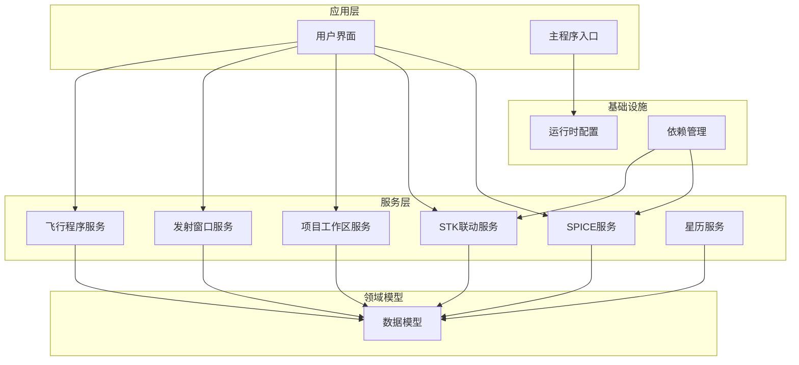

**图表来源**
- [main.py:1-36](file://src/smart/main.py#L1-L36)
- [app_runtime.py:1-96](file://src/smart/app_runtime.py#L1-L96)

**章节来源**
- [README.md:1-204](file://README.md#L1-L204)
- [pyproject.toml:1-50](file://pyproject.toml#L1-L50)

## 核心组件

SMART项目包含以下核心API组件：

### SPICE服务API
- **天体状态查询**：提供天体位置和速度向量查询功能
- **坐标系转换**：支持不同坐标系之间的变换
- **时间转换**：UTC与ET（秒贴地历元）互转
- **内核管理**：本地内核发现、加载和下载

### STK联动API
- **场景创建**：自动创建STK场景并配置基本参数
- **数据导出**：轨道星历、姿态数据的导出
- **对象管理**：卫星、地面站、中继卫星的对象创建和配置
- **命令执行**：通过COM或Socket执行STK命令

### 项目工作区API
- **文件操作**：项目创建、打开、复制等功能
- **数据读写**：配置文件的保存和加载
- **配置管理**：各种任务配置的标准化处理

**章节来源**
- [spice_service.py:1-305](file://src/smart/services/spice_service.py#L1-L305)
- [stk_link.py:1-755](file://src/smart/services/stk_link.py#L1-L755)
- [project_workspace.py:1-920](file://src/smart/services/project_workspace.py#L1-L920)

## 架构概览

SMART采用分层架构设计，各层职责明确：

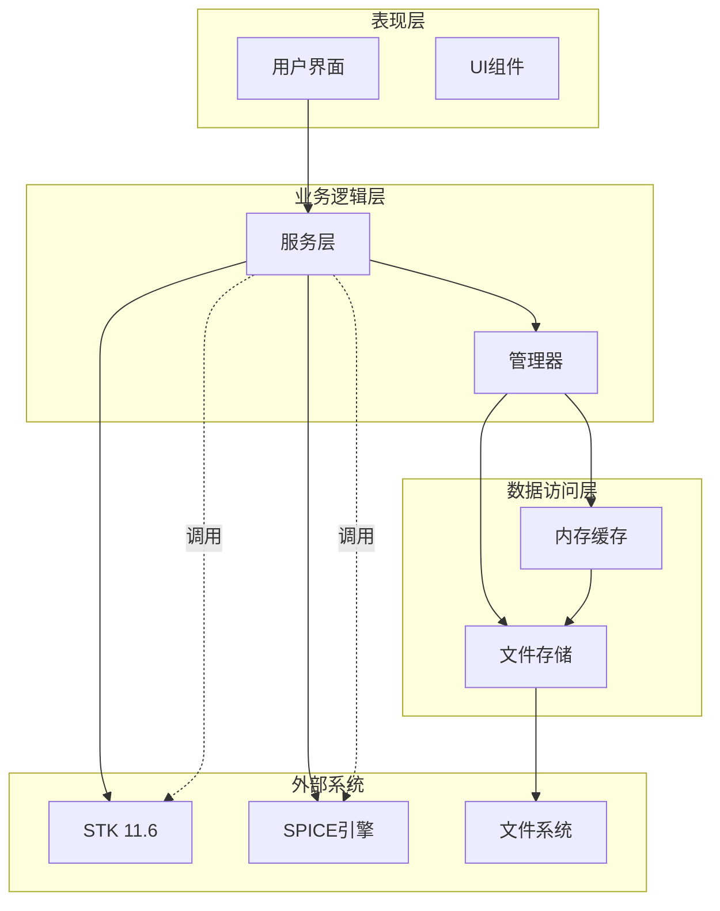

**图表来源**
- [spice_service.py:174-305](file://src/smart/services/spice_service.py#L174-L305)
- [stk_link.py:199-555](file://src/smart/services/stk_link.py#L199-L555)
- [project_workspace.py:64-117](file://src/smart/services/project_workspace.py#L64-L117)

## 详细组件分析

### SPICE服务API详解

SPICE服务提供了完整的天体物理计算能力，是SMART项目的核心数据源。

#### 主要类和接口

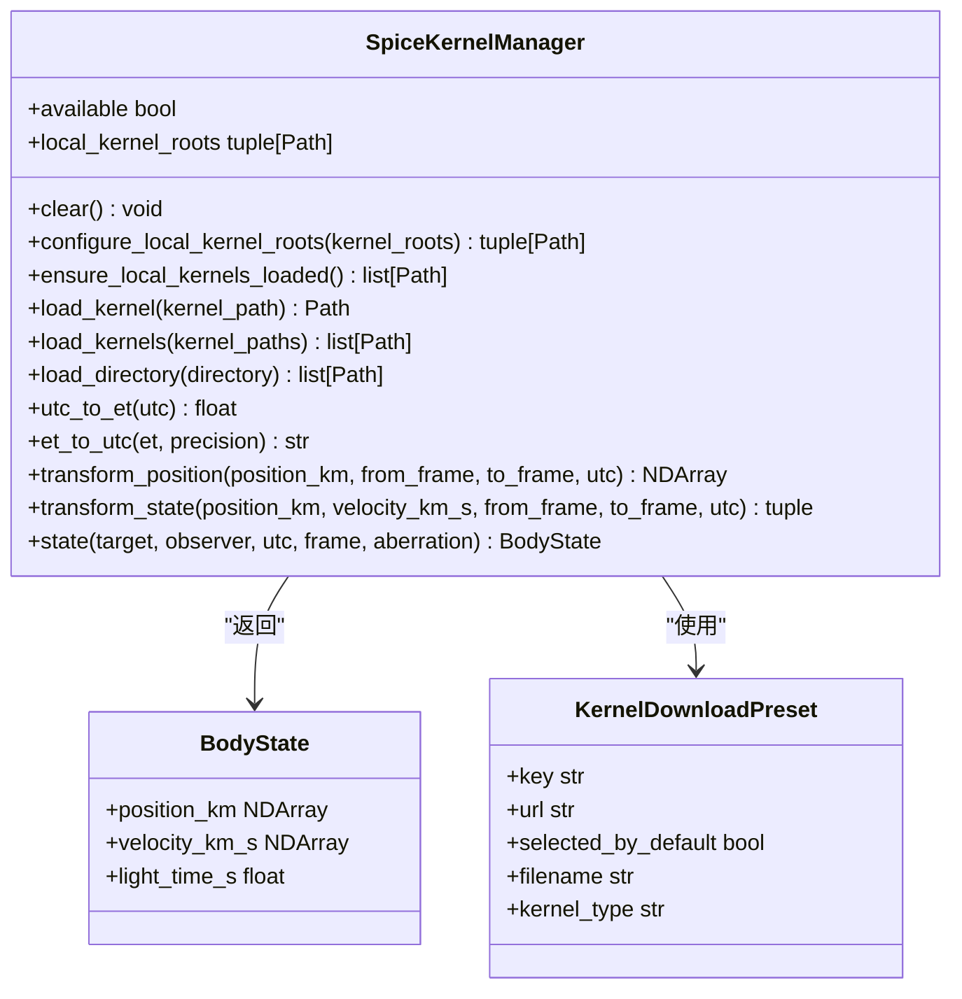

**图表来源**
- [spice_service.py:28-305](file://src/smart/services/spice_service.py#L28-L305)

#### 时间转换接口

SPICE服务提供了UTC与ET（秒贴地历元）之间的精确转换：

| 方法 | 参数 | 返回值 | 描述 |
|------|------|--------|------|
| `utc_to_et` | `utc: str` | `float` | 将UTC时间转换为ET（秒贴地历元） |
| `et_to_utc` | `et: float, precision: int = 3` | `str` | 将ET转换为UTC字符串 |

#### 坐标系转换接口

支持多种坐标系之间的变换：

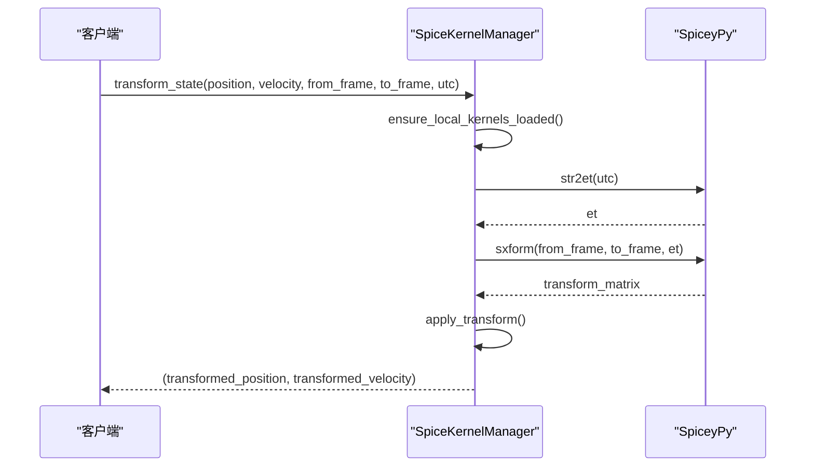

**图表来源**
- [spice_service.py:265-286](file://src/smart/services/spice_service.py#L265-L286)

#### 天体状态查询

提供精确的天体状态向量查询：

| 参数 | 类型 | 必需 | 描述 |
|------|------|------|------|
| `target` | `str` | 是 | 目标天体名称 |
| `observer` | `str` | 是 | 观测者标识符 |
| `utc` | `str` | 是 | UTC时间字符串 |
| `frame` | `str` | 否 | 参考坐标系，默认"J2000" |
| `aberration` | `str` | 否 | 修正类型，默认"NONE" |

**章节来源**
- [spice_service.py:241-305](file://src/smart/services/spice_service.py#L241-L305)

### STK联动API详解

STK联动服务实现了SMART与AGI STK 11.6的深度集成。

#### 主要类和接口

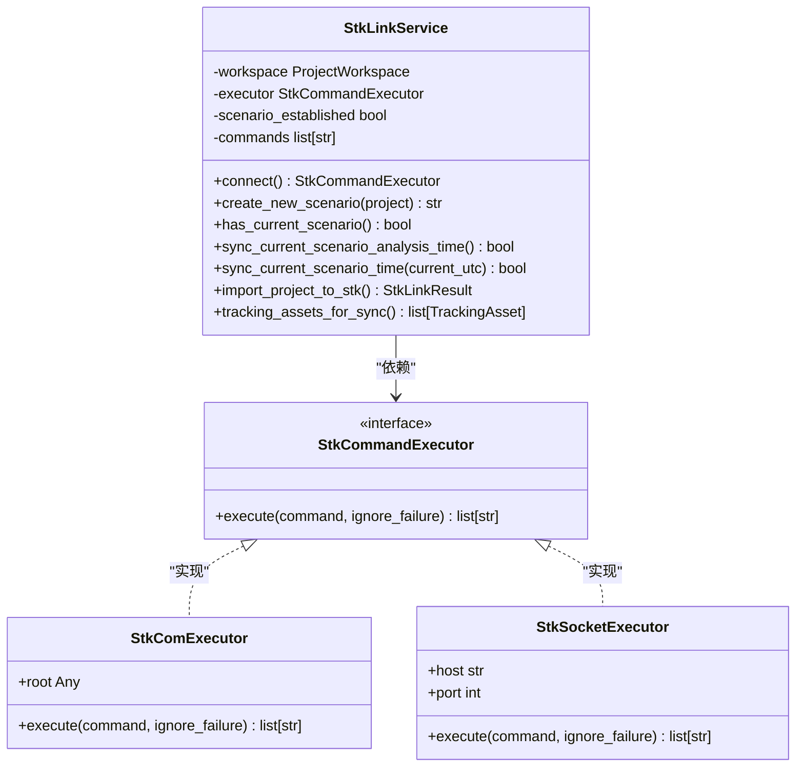

**图表来源**
- [stk_link.py:52-555](file://src/smart/services/stk_link.py#L52-L555)

#### STK场景管理

STK联动服务提供了完整的场景生命周期管理：

| 方法 | 参数 | 返回值 | 描述 |
|------|------|--------|------|
| `create_new_scenario` | `project: ProjectInfo` | `str` | 创建新的STK场景 |
| `has_current_scenario` | 无 | `bool` | 检查当前是否有活动场景 |
| `sync_current_scenario_analysis_time` | 无 | `bool` | 同步分析时间范围 |
| `sync_current_scenario_time` | `current_utc: str` | `bool` | 设置动画当前时间 |

#### 数据导出功能

支持多种数据格式的导出：

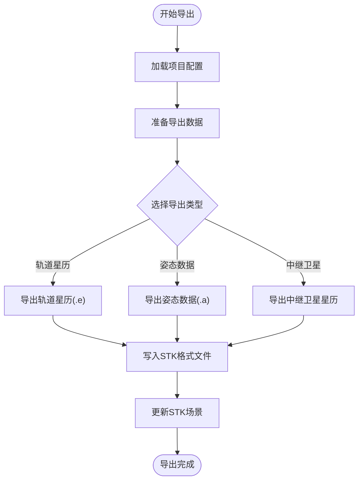

**图表来源**
- [stk_link.py:280-337](file://src/smart/services/stk_link.py#L280-L337)

#### 对象管理接口

支持卫星、地面站、中继卫星的自动化管理：

| 对象类型 | 创建方法 | 配置参数 | 图形属性 |
|----------|----------|----------|----------|
| 卫星 | `_ensure_satellite(name)` | 质量、推力、ISP等 | 颜色、标签、轨道显示 |
| 地面站 | `_create_ground_stations()` | 经纬度、海拔高度 | 几何标记、可视范围 |
| 中继卫星 | `_create_relay_satellites()` | 经度、轨道高度 | 特殊颜色、标签 |

**章节来源**
- [stk_link.py:199-755](file://src/smart/services/stk_link.py#L199-L755)

### 项目工作区API详解

项目工作区服务提供了完整的项目生命周期管理功能。

#### 主要类和接口

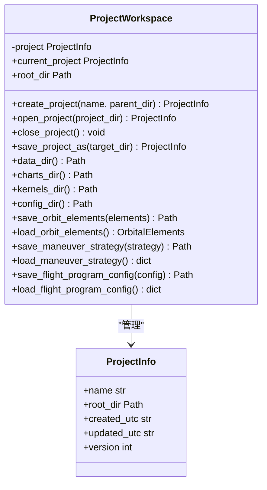

**图表来源**
- [project_workspace.py:64-661](file://src/smart/services/project_workspace.py#L64-L661)

#### 文件操作接口

项目工作区提供了标准化的文件操作：

| 方法 | 参数 | 返回值 | 描述 |
|------|------|--------|------|
| `create_project` | `name: str, parent_dir: str` | `ProjectInfo` | 创建新项目 |
| `open_project` | `project_dir: str` | `ProjectInfo` | 打开现有项目 |
| `save_project_as` | `target_dir: str` | `ProjectInfo` | 复制项目到新位置 |
| `save_orbit_elements` | `elements: OrbitalElements` | `Path` | 保存轨道元素 |
| `load_orbit_elements` | 无 | `OrbitalElements` | 加载轨道元素 |

#### 配置管理

支持多种任务配置的标准化处理：

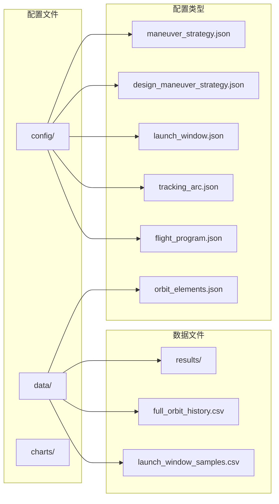

**图表来源**
- [project_workspace.py:33-53](file://src/smart/services/project_workspace.py#L33-L53)

**章节来源**
- [project_workspace.py:1-920](file://src/smart/services/project_workspace.py#L1-L920)

### 发射窗口分析API

发射窗口分析服务提供了完整的发射窗口计算和约束验证功能。

#### 核心数据结构

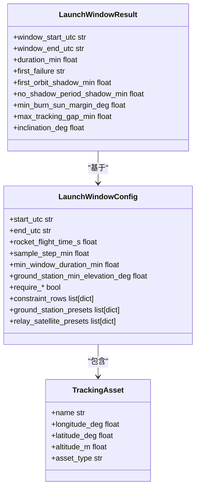

**图表来源**
- [launch_window.py:54-129](file://src/smart/services/launch_window.py#L54-L129)

#### 约束类型

发射窗口分析支持多种约束条件：

| 约束类型 | 描述 | 参数 |
|----------|------|------|
| `no_shadow` | 无地影约束 | 无 |
| `ground_elevation` | 地面站仰角约束 | 最小仰角 |
| `theta_s` | 太阳角约束 | 最大太阳角 |
| `theta_st` | 太阳-卫星角约束 | 最大太阳-卫星角 |
| `relay_alpha_abs` | 中继卫星α角约束 | 最大绝对值 |
| `relay_beta_abs` | 中继卫星β角约束 | 最大绝对值 |
| `inclination` | 倾角约束 | 最大倾角 |

**章节来源**
- [launch_window.py:1-800](file://src/smart/services/launch_window.py#L1-L800)

### 飞行程序设计API

飞行程序设计服务提供了完整的飞行程序生成和验证功能。

#### 飞行程序事件类型

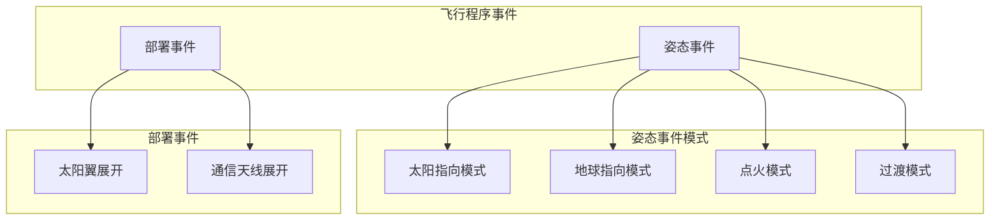

**图表来源**
- [flight_program.py:25-32](file://src/smart/services/flight_program.py#L25-L32)

#### 采样接口

飞行程序服务提供了精确的状态采样功能：

| 方法 | 参数 | 返回值 | 描述 |
|------|------|--------|------|
| `sample_flight_program_state` | `orbit_history_csv, maneuver_strategy, payload, elapsed_min, t0_utc` | `FlightProgramSample` | 采样单个时间点的状态 |
| `sample_flight_program_states` | 同上 | `list[FlightProgramSample]` | 采样整个轨迹的状态序列 |

**章节来源**
- [flight_program.py:292-332](file://src/smart/services/flight_program.py#L292-L332)

## 依赖关系分析

SMART项目的依赖关系清晰明确，各模块之间耦合度适中。

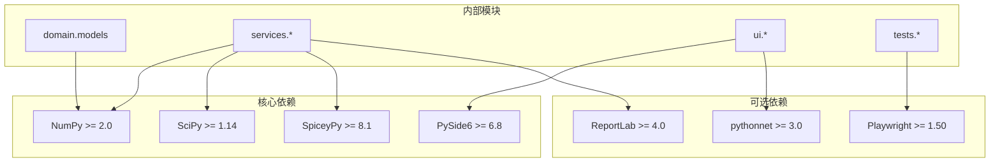

**图表来源**
- [pyproject.toml:11-22](file://pyproject.toml#L11-L22)

### 外部系统集成

SMART与多个外部系统的集成关系：

| 系统 | 集成方式 | 用途 | 版本要求 |
|------|----------|------|----------|
| STK 11.6 | COM接口/Socket | 场景管理、数据导出 | 11.6 |
| SPICE | SpiceyPy封装 | 天体物理计算 | 8.1+ |
| Windows COM | pythonnet | STK自动化控制 | 3.0+ |
| PySide6 | GUI框架 | 用户界面 | 6.8+ |
| NumPy | 数值计算 | 向量运算 | 2.0+ |

**章节来源**
- [pyproject.toml:1-50](file://pyproject.toml#L1-L50)

## 性能考虑

### SPICE服务性能特性

SPICE服务在性能方面具有以下特点：

- **内核预加载**：首次使用时自动加载必要的内核文件，避免重复加载开销
- **缓存机制**：已加载的内核文件会被缓存，提高后续查询效率
- **批量操作**：支持批量内核加载和状态查询，减少系统调用次数
- **内存管理**：合理管理内核文件句柄，避免内存泄漏

### STK联动性能优化

STK联动服务采用了多项性能优化措施：

- **连接复用**：建立一次连接后复用到多次命令执行
- **批量命令**：将相关的STK命令合并执行，减少通信开销
- **异步处理**：Socket连接设置超时机制，避免长时间阻塞
- **错误恢复**：自动检测STK状态并进行连接恢复

### 项目工作区性能特性

项目工作区服务的性能优化包括：

- **延迟加载**：配置文件按需加载，避免不必要的I/O操作
- **增量更新**：项目元数据只在必要时更新
- **路径缓存**：常用路径进行缓存，减少路径解析开销
- **文件锁**：避免并发访问导致的性能问题

## 故障排除指南

### SPICE服务常见问题

#### 内核加载失败

**症状**：`SpiceUnavailableError` 异常

**原因**：
- SpiceyPy未正确安装
- 内核文件路径不正确
- 内核文件格式不支持

**解决方案**：
1. 确认SpiceyPy已正确安装
2. 检查内核文件扩展名是否为支持的类型
3. 验证内核文件路径的有效性

#### 时间转换错误

**症状**：时间转换函数抛出异常

**原因**：
- UTC时间格式不正确
- SPICE内核未加载
- 时区信息缺失

**解决方案**：
1. 使用ISO 8601格式的时间字符串
2. 确保本地内核已加载
3. 明确指定UTC时区

### STK联动常见问题

#### 连接失败

**症状**：STK连接超时或拒绝

**原因**：
- STK 11.6未安装或路径不正确
- COM服务未启用
- Socket端口被占用

**解决方案**：
1. 确认STK 11.6已正确安装
2. 检查COM服务状态
3. 更改STK连接端口

#### 命令执行失败

**症状**：STK命令返回NACK或错误

**原因**：
- STK场景不存在
- 命令语法错误
- 权限不足

**解决方案**：
1. 确保STK场景已创建
2. 检查命令格式
3. 以管理员权限运行

### 项目工作区常见问题

#### 项目文件损坏

**症状**：项目无法打开或配置丢失

**原因**：
- JSON文件格式错误
- 文件权限问题
- 编码格式不正确

**解决方案**：
1. 检查JSON文件格式
2. 确认文件权限
3. 使用UTF-8编码保存

#### 路径解析错误

**症状**：文件路径找不到或解析失败

**原因**：
- 相对路径解析错误
- 跨平台路径分隔符问题
- 环境变量未设置

**解决方案**：
1. 使用绝对路径
2. 统一使用正斜杠
3. 设置正确的环境变量

**章节来源**
- [test_spice_service.py:1-199](file://tests/test_spice_service.py#L1-L199)
- [test_stk_link.py:1-390](file://tests/test_stk_link.py#L1-L390)
- [test_project_workspace.py:1-432](file://tests/test_project_workspace.py#L1-L432)

## 结论

SMART项目提供了一个完整的航天任务分析API生态系统，涵盖了从基础的SPICE天体物理计算到高级的STK场景管理，以及项目化的数据管理功能。

### 主要优势

1. **模块化设计**：清晰的模块划分使得API易于理解和使用
2. **完整的功能覆盖**：从数据获取到结果导出的全链路支持
3. **稳定的接口设计**：基于数据类的接口设计保证了向后兼容性
4. **完善的错误处理**：详细的异常类型和错误信息帮助快速定位问题

### 技术特色

1. **SPICE集成**：深度集成了SPICE引擎，提供精确的天体物理计算
2. **STK自动化**：实现了STK 11.6的自动化控制和数据导出
3. **项目化管理**：提供了完整的项目生命周期管理功能
4. **跨平台支持**：基于Python的跨平台特性

### 发展建议

1. **API文档完善**：可以考虑添加更详细的API文档和示例
2. **性能监控**：增加性能指标监控和报告功能
3. **插件系统**：考虑支持第三方插件扩展功能
4. **云服务集成**：探索云端数据存储和协作功能

SMART项目为航天任务分析提供了一个强大而灵活的API平台，适合进一步的功能扩展和应用集成。