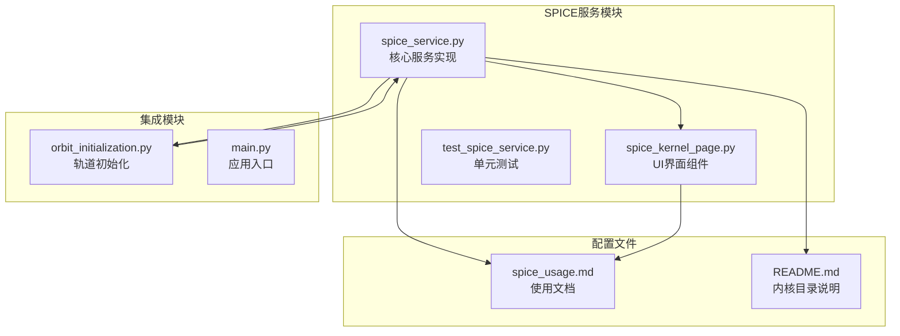
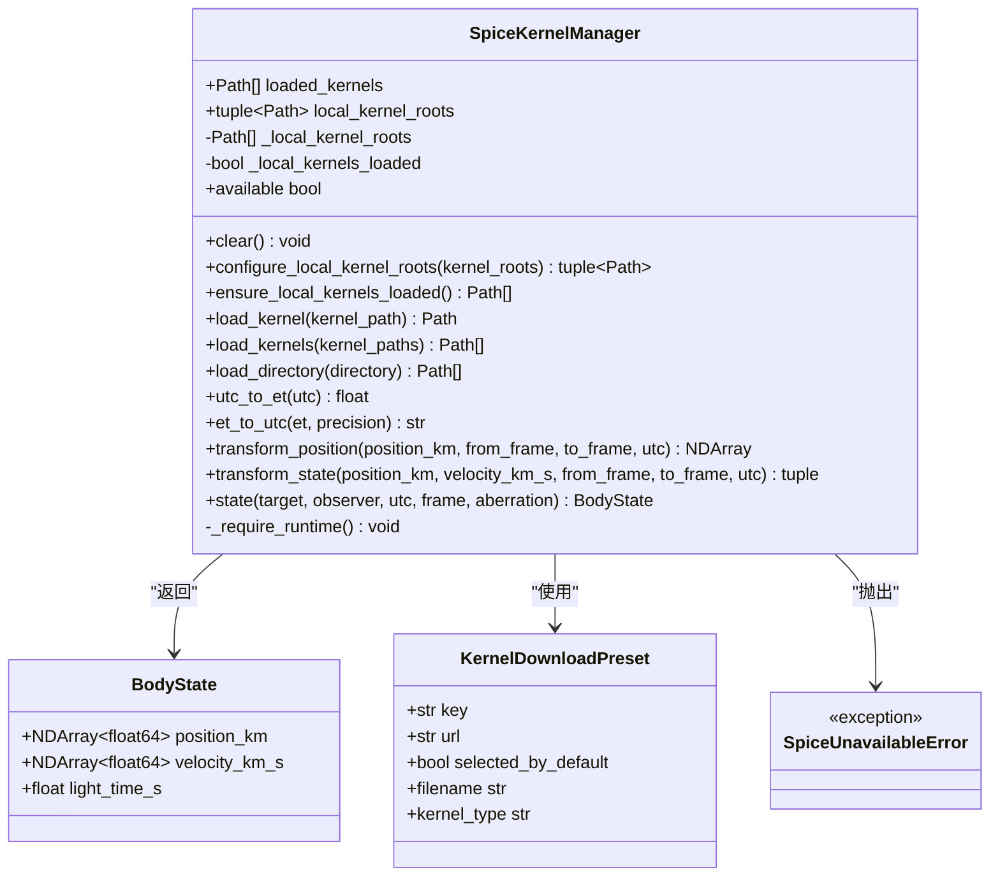
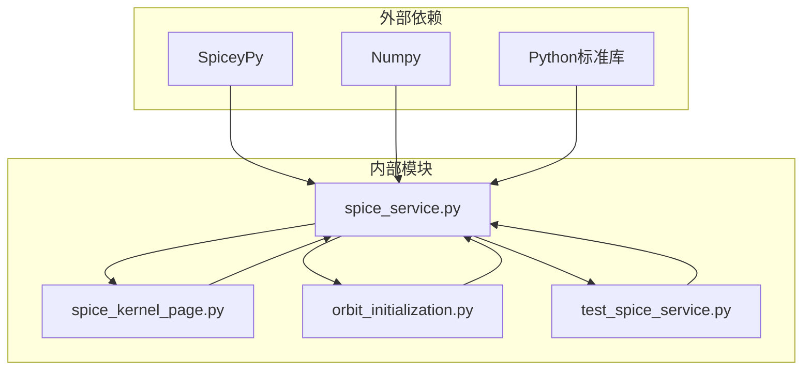

# SPICE服务API

<cite>
**本文档引用的文件**
- [spice_service.py](file://src/smart/services/spice_service.py)
- [test_spice_service.py](file://tests/test_spice_service.py)
- [spice_usage.md](file://doc/spice_usage.md)
- [spice_kernel_page.py](file://src/smart/ui/widgets/spice_kernel_page.py)
- [README.md](file://data/kernels/README.md)
- [orbit_initialization.py](file://src/smart/services/orbit_initialization.py)
</cite>

## 目录
1. [简介](#简介)
2. [项目结构](#项目结构)
3. [核心组件](#核心组件)
4. [架构概览](#架构概览)
5. [详细组件分析](#详细组件分析)
6. [依赖关系分析](#依赖关系分析)
7. [性能考虑](#性能考虑)
8. [故障排除指南](#故障排除指南)
9. [结论](#结论)
10. [附录](#附录)

## 简介

SMART项目中的SPICE服务API提供了基于NAIF SPICE工具包的完整天体物理计算能力。该服务封装了SpiceyPy Python绑定，为轨道分析、时间转换、坐标系变换和天体状态查询提供了统一的接口。

本API的核心目标是：
- 提供标准的SPICE函数封装，避免重复实现
- 支持UTC/历元时间解析、归一化和转换
- 实现坐标系与参考系转换
- 提供状态向量查询能力
- 支持内核文件的自动发现、下载和加载机制

## 项目结构

SPICE服务位于项目的`src/smart/services/`目录下，主要包含以下关键文件：



**图表来源**
- [spice_service.py:1-305](file://src/smart/services/spice_service.py#L1-L305)
- [spice_kernel_page.py:1-554](file://src/smart/ui/widgets/spice_kernel_page.py#L1-L554)
- [spice_usage.md:1-235](file://doc/spice_usage.md#L1-L235)

**章节来源**
- [spice_service.py:1-305](file://src/smart/services/spice_service.py#L1-L305)
- [spice_usage.md:1-235](file://doc/spice_usage.md#L1-L235)

## 核心组件

SPICE服务API的核心组件包括：

### SpiceKernelManager类
这是API的主要入口点，负责管理SPICE内核和提供所有公共接口。

### 数据类
- **BodyState**: 表示天体状态向量的数据类
- **KernelDownloadPreset**: 内核下载预设配置

### 辅助函数
- **discover_kernel_files**: 文件发现和排序
- **download_kernel_file**: 内核文件下载
- **default_local_kernel_roots**: 默认内核根目录配置

**章节来源**
- [spice_service.py:28-305](file://src/smart/services/spice_service.py#L28-L305)

## 架构概览



**图表来源**
- [spice_service.py:28-305](file://src/smart/services/spice_service.py#L28-L305)

## 详细组件分析

### SpiceKernelManager类详解

#### 属性
- `available`: 检查SPICE运行时可用性
- `local_kernel_roots`: 获取当前配置的内核根目录
- `loaded_kernels`: 获取已加载内核的路径列表

#### 内核管理方法

##### clear() 方法
**功能**: 清空所有已加载的SPICE内核
**参数**: 无
**返回值**: 无
**异常**: 
- `SpiceUnavailableError`: 当SPICE不可用时抛出
**使用场景**: 切换项目或重新配置内核时清理环境

##### configure_local_kernel_roots() 方法
**功能**: 配置本地内核搜索路径
**参数**: 
- `kernel_roots` (Iterable[str | Path]): 内核根目录列表
**返回值**: 
- `tuple[Path, ...]`: 配置后的根目录元组
**异常**: 无
**最佳实践**: 在应用启动时调用，确保正确的内核搜索顺序

##### ensure_local_kernels_loaded() 方法
**功能**: 自动扫描并加载本地内核文件
**参数**: 无
**返回值**: 
- `list[Path]`: 已加载内核的路径列表
**异常**: 
- `SpiceUnavailableError`: 当SPICE不可用时抛出
**特点**: 
- 支持自动去重（同名文件只加载一次）
- 按文件名排序确保一致性
- 只在必要时加载，避免重复操作

##### load_kernel() 方法
**功能**: 加载单个内核文件
**参数**: 
- `kernel_path` (str | Path): 内核文件路径
**返回值**: 
- `Path`: 已加载内核的绝对路径
**异常**: 
- `FileNotFoundError`: 当内核文件不存在时
- `SpiceUnavailableError`: 当SPICE不可用时
**特点**: 
- 自动去重检查
- 支持用户展开和绝对路径解析

##### load_kernels() 方法
**功能**: 批量加载内核文件
**参数**: 
- `kernel_paths` (Iterable[str | Path]): 内核文件路径集合
**返回值**: 
- `list[Path]`: 已加载内核的路径列表
**异常**: 无
**使用场景**: 一次性加载多个内核文件

##### load_directory() 方法
**功能**: 加载指定目录下的所有内核文件
**参数**: 
- `directory` (str | Path): 包含内核文件的目录路径
**返回值**: 
- `list[Path]`: 已加载内核的路径列表
**异常**: 
- `FileNotFoundError`: 当目录不存在时
- `SpiceUnavailableError`: 当SPICE不可用时
**特点**: 
- 自动发现所有支持的内核文件类型
- 支持递归搜索子目录

#### 时间转换方法

##### utc_to_et() 方法
**功能**: 将UTC时间转换为SPICE历元时间
**参数**: 
- `utc` (str): UTC时间字符串
**返回值**: 
- `float`: SPICE历元时间（秒）
**异常**: 
- `SpiceUnavailableError`: 当SPICE不可用时
**特点**: 
- 自动加载本地内核
- 支持ISO格式UTC时间
- 内部使用`spice.str2et`函数

##### et_to_utc() 方法
**功能**: 将SPICE历元时间转换回UTC时间
**参数**: 
- `et` (float): SPICE历元时间
- `precision` (int): 时间精度（小数位数，默认3）
**返回值**: 
- `str`: UTC时间字符串（ISO格式）
**异常**: 
- `SpiceUnavailableError`: 当SPICE不可用时
**特点**: 
- 使用`spice.et2utc`函数
- 支持高精度时间表示

#### 坐标系变换方法

##### transform_position() 方法
**功能**: 在给定UTC时刻进行位置向量的坐标系变换
**参数**: 
- `position_km` (Iterable[float]): 位置向量（千米）
- `from_frame` (str): 源坐标系
- `to_frame` (str): 目标坐标系
- `utc` (str): UTC时间
**返回值**: 
- `NDArray[np.float64]`: 变换后的位置向量
**异常**: 
- `SpiceUnavailableError`: 当SPICE不可用时
**特点**: 
- 使用`spice.pxform`计算旋转矩阵
- 支持任意坐标系之间的线性变换
- 返回三维位置向量

##### transform_state() 方法
**功能**: 在给定UTC时刻进行状态向量（位置+速度）的坐标系变换
**参数**: 
- `position_km` (Iterable[float]): 位置向量（千米）
- `velocity_km_s` (Iterable[float]): 速度向量（千米/秒）
- `from_frame` (str): 源坐标系
- `to_frame` (str): 目标坐标系
- `utc` (str): UTC时间
**返回值**: 
- `tuple[NDArray[np.float64], NDArray[np.float64]]`: (变换后的位置, 变换后的速度)
**异常**: 
- `SpiceUnavailableError`: 当SPICE不可用时
**特点**: 
- 使用`spice.sxform`计算6x6变换矩阵
- 同时处理位置和速度分量
- 保持状态向量的完整性

#### 天体状态查询方法

##### state() 方法
**功能**: 查询目标天体相对于观测体的状态向量
**参数**: 
- `target` (str): 目标天体名称
- `observer` (str): 观测体名称
- `utc` (str): UTC时间
- `frame` (str): 输出坐标系（默认"J2000"）
- `aberration` (str): 修正类型（默认"NONE"）
**返回值**: 
- `BodyState`: 包含位置、速度和光时间的状态对象
**异常**: 
- `SpiceUnavailableError`: 当SPICE不可用时
**特点**: 
- 使用`spice.spkezr`获取精确状态向量
- 自动处理光行时间效应
- 返回标准化的BodyState对象

#### 异常处理

##### SpiceUnavailableError
**类型**: `RuntimeError`
**触发条件**: 
- 尝试使用SPICE功能但SpiceyPy未安装
- 运行时SPICE环境不可用
**处理建议**: 
- 捕获异常并提供降级方案
- 记录详细的错误信息
- 引导用户安装必要的依赖

**章节来源**
- [spice_service.py:174-305](file://src/smart/services/spice_service.py#L174-L305)

### BodyState数据类

BodyState是专门设计用于存储天体状态向量的数据类，具有以下结构：

| 字段名 | 类型 | 描述 | 单位 |
|--------|------|------|------|
| position_km | NDArray[np.float64] | 三维位置向量 | 千米 |
| velocity_km_s | NDArray[np.float64] | 三维速度向量 | 千米/秒 |
| light_time_s | float | 光行时间延迟 | 秒 |

**使用场景**:
- 天体状态查询结果的标准化表示
- 轨道分析和传播的基础数据结构
- 与其他模块间的状态数据交换

**章节来源**
- [spice_service.py:28-33](file://src/smart/services/spice_service.py#L28-L33)

### 内核下载预设

系统内置了常用的SPICE内核预设，支持一键下载和配置：

| 预设键 | 文件名 | URL | 默认选择 |
|--------|--------|-----|----------|
| naif0012_lsk | naif0012.tls | https://naif.jpl.nasa.gov/pub/naif/generic_kernels/lsk/naif0012.tls | ✓ |
| pck00011_pck | pck00011.tpc | https://naif.jpl.nasa.gov/pub/naif/generic_kernels/pck/pck00011.tpc | ✓ |
| earth_assoc_itrf93_fk | earth_assoc_itrf93.tf | https://naif.jpl.nasa.gov/pub/naif/generic_kernels/fk/planets/earth_assoc_itrf93.tf | ✓ |
| earth_latest_high_prec_bpc | earth_latest_high_prec.bpc | https://naif.jpl.nasa.gov/pub/naif/generic_kernels/pck/earth_latest_high_prec.bpc | ✓ |
| de440s_spk | de440s.bsp | https://naif.jpl.nasa.gov/pub/naif/generic_kernels/spk/planets/de440s.bsp | ✓ |

**章节来源**
- [spice_service.py:50-76](file://src/smart/services/spice_service.py#L50-L76)

## 依赖关系分析



**图表来源**
- [spice_service.py:13-16](file://src/smart/services/spice_service.py#L13-L16)
- [spice_kernel_page.py:8-17](file://src/smart/ui/widgets/spice_kernel_page.py#L8-L17)

### 外部依赖

- **SpiceyPy**: SPICE Python绑定，提供核心功能
- **NumPy**: 数值计算支持，特别是数组操作
- **Python标准库**: urllib用于网络下载，pathlib用于路径操作

### 内部依赖

- **UI组件**: SpiceKernelPage提供图形化内核管理界面
- **业务逻辑**: orbit_initialization集成坐标系转换
- **测试框架**: test_spice_service提供全面的单元测试

**章节来源**
- [spice_service.py:13-16](file://src/smart/services/spice_service.py#L13-L16)
- [spice_kernel_page.py:8-17](file://src/smart/ui/widgets/spice_kernel_page.py#L8-L17)

## 性能考虑

### 内核加载优化
- **自动去重**: 同名内核文件只加载一次，避免重复开销
- **延迟加载**: 仅在需要时才加载内核，减少启动时间
- **批量操作**: 支持批量内核加载，提高效率

### 计算优化
- **向量化操作**: 使用NumPy数组进行批量计算
- **内存管理**: 及时清理不需要的内核，释放内存
- **缓存策略**: 利用SPICE内部缓存机制

### I/O优化
- **异步下载**: 内核下载使用临时文件，完成后原子替换
- **文件发现**: 支持递归搜索，避免手动遍历
- **路径解析**: 统一使用绝对路径，避免重复解析

## 故障排除指南

### 常见问题及解决方案

#### SpiceyPy未安装
**症状**: 调用任何SPICE方法时抛出`SpiceUnavailableError`
**解决方案**: 
- 安装SpiceyPy: `pip install spiceypy`
- 验证安装: `python -c "import spiceypy"`
- 检查环境: 确保在正确的Python环境中

#### 内核文件缺失
**症状**: 坐标系转换或状态查询失败
**解决方案**:
- 下载必需的内核文件
- 确保内核文件位于正确的目录结构中
- 验证内核文件的完整性

#### 时间格式错误
**症状**: UTC到ET转换失败
**解决方案**:
- 使用ISO格式的UTC时间字符串
- 确保包含时区信息（如Z后缀）
- 验证时间字符串的有效性

#### 坐标系名称错误
**症状**: 坐标系变换失败
**解决方案**:
- 检查坐标系名称的拼写
- 确保内核文件包含所需的坐标系定义
- 验证UTC时间的正确性

### 错误处理最佳实践

#### 异常捕获
```python
try:
    manager = SpiceKernelManager()
    manager.ensure_local_kernels_loaded()
    position = manager.transform_position(
        [1000, 2000, 3000],
        from_frame="J2000",
        to_frame="ITRF93",
        utc="2026-01-01T00:00:00Z"
    )
except SpiceUnavailableError as e:
    # 处理SPICE不可用的情况
    handle_spice_unavailable(e)
except Exception as e:
    # 处理其他异常
    handle_general_error(e)
```

#### 日志记录
- 记录SPICE运行时状态
- 记录内核加载过程
- 记录关键计算步骤

#### 用户反馈
- 提供清晰的错误消息
- 指导用户解决问题的方法
- 提供降级方案选项

**章节来源**
- [spice_service.py:24-26](file://src/smart/services/spice_service.py#L24-L26)
- [spice_kernel_page.py:414-439](file://src/smart/ui/widgets/spice_kernel_page.py#L414-L439)

## 结论

SMART项目的SPICE服务API提供了完整而强大的天体物理计算能力。通过SpiceKernelManager类，开发者可以轻松实现：

1. **内核管理**: 自动发现、下载和加载SPICE内核文件
2. **时间转换**: UTC与SPICE历元时间的双向转换
3. **坐标系变换**: 位置和状态向量的多坐标系转换
4. **天体状态查询**: 目标天体相对于观测体的状态向量

该API的设计充分考虑了易用性和可靠性，提供了完善的错误处理和用户反馈机制。通过标准化的接口，开发者可以专注于业务逻辑，而不必担心底层SPICE细节。

## 附录

### 使用示例

#### 基本内核管理
```python
from smart.services.spice_service import SpiceKernelManager

# 创建管理器实例
manager = SpiceKernelManager()

# 自动加载本地内核
manager.ensure_local_kernels_loaded()

# 手动加载特定内核
manager.load_kernel("/path/to/kernel.bsp")
```

#### 时间转换示例
```python
# UTC到ET转换
et = manager.utc_to_et("2026-01-01T12:00:00Z")

# ET到UTC转换
utc = manager.et_to_utc(et, precision=6)
```

#### 坐标系变换示例
```python
# 位置向量变换
position_j2000, velocity_j2000 = manager.transform_state(
    position_km=[7000.0, 0.0, 0.0],
    velocity_km_s=[0.0, 7.5, 1.0],
    from_frame="ITRF93",
    to_frame="J2000",
    utc="2026-01-01T12:00:00Z"
)
```

#### 天体状态查询示例
```python
# 查询地球相对于太阳的状态
earth_state = manager.state(
    target="Earth",
    observer="Sun",
    utc="2026-01-01T12:00:00Z",
    frame="J2000",
    aberration="NONE"
)

print(f"位置: {earth_state.position_km}")
print(f"速度: {earth_state.velocity_km_s}")
print(f"光时间: {earth_state.light_time_s}")
```

### 最佳实践

1. **初始化顺序**: 先配置内核根目录，再加载内核，最后进行计算
2. **错误处理**: 始终捕获并妥善处理SpiceUnavailableError
3. **资源管理**: 及时清理不需要的内核，避免内存泄漏
4. **性能优化**: 批量操作内核文件，避免频繁的I/O操作
5. **测试覆盖**: 为关键功能编写单元测试，确保可靠性

### 相关文档

- [SPICE使用指南:1-235](file://doc/spice_usage.md#L1-L235)
- [内核目录说明:1-12](file://data/kernels/README.md#L1-L12)
- [UI内核管理页面:1-554](file://src/smart/ui/widgets/spice_kernel_page.py#L1-L554)