# STK联动API

<cite>
**本文档引用的文件**
- [stk_link.py](file://src/smart/services/stk_link.py)
- [stk_link_page.py](file://src/smart/ui/widgets/stk_link_page.py)
- [stk_11_6_operations.md](file://src/smart/agents/skills/stk_11_6_operations.md)
- [stk_ephemeris.py](file://src/smart/services/stk_ephemeris.py)
- [test_stk_link.py](file://tests/test_stk_link.py)
- [models.py](file://src/smart/domain/models.py)
</cite>

## 目录
1. [简介](#简介)
2. [项目结构](#项目结构)
3. [核心组件](#核心组件)
4. [架构概览](#架构概览)
5. [详细组件分析](#详细组件分析)
6. [依赖关系分析](#依赖关系分析)
7. [性能考虑](#性能考虑)
8. [故障排除指南](#故障排除指南)
9. [结论](#结论)
10. [附录](#附录)

## 简介

STK联动API是SMART项目中用于与AGI STK 11.6进行集成的关键组件。该API提供了完整的STK场景管理、卫星对象操作、数据导入导出和实时通信功能。通过该API，用户可以实现从SMART项目到STK场景的无缝数据同步，包括轨道数据、姿态信息、测控站点和中继卫星的自动导入。

该系统支持两种连接模式：
- **COM接口模式**：通过Windows COM接口直接控制STK应用程序
- **Socket连接模式**：通过本地Socket连接STK的Connect服务

## 项目结构

STK联动API主要分布在以下模块中：

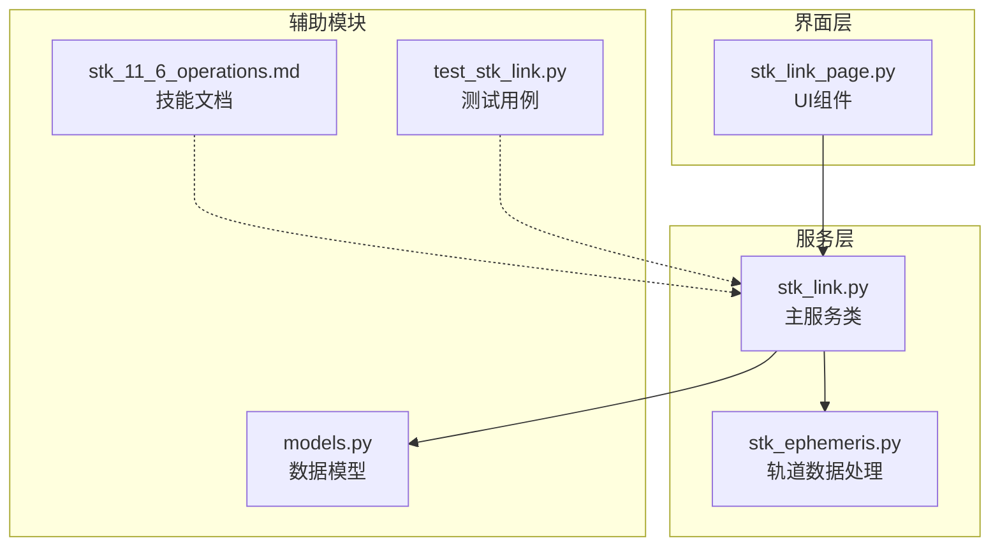

**图表来源**
- [stk_link.py:1-755](file://src/smart/services/stk_link.py#L1-L755)
- [stk_link_page.py:1-324](file://src/smart/ui/widgets/stk_link_page.py#L1-L324)

**章节来源**
- [stk_link.py:1-755](file://src/smart/services/stk_link.py#L1-L755)
- [stk_link_page.py:1-324](file://src/smart/ui/widgets/stk_link_page.py#L1-L324)

## 核心组件

### StkLinkService类

StkLinkService是STK联动API的核心类，提供了所有公共接口：

#### 主要功能特性
- **场景管理**：创建、连接和管理STK场景
- **卫星对象管理**：导入卫星轨道、姿态和3D模型
- **地面资产同步**：管理测控站点和中继卫星
- **数据导出**：生成STK兼容的轨道和姿态文件
- **实时通信**：支持COM和Socket两种通信方式

#### 关键属性
- `executor`: 当前使用的命令执行器（COM或Socket）
- `_scenario_established`: 场景建立状态标志
- `_commands`: 已执行的STK命令列表

**章节来源**
- [stk_link.py:199-558](file://src/smart/services/stk_link.py#L199-L558)

## 架构概览

STK联动API采用分层架构设计，实现了清晰的关注点分离：

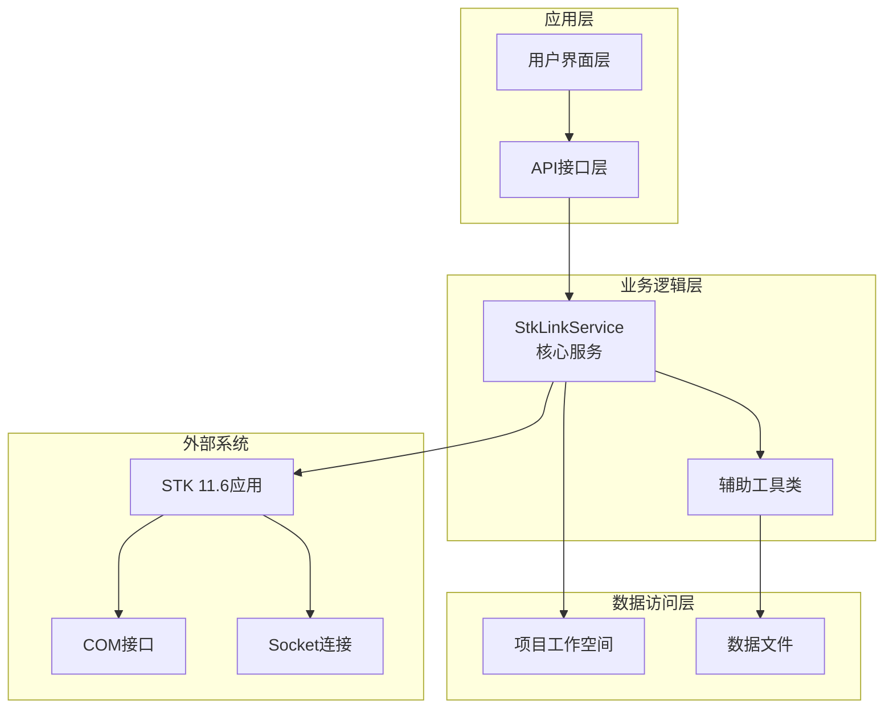

**图表来源**
- [stk_link.py:199-558](file://src/smart/services/stk_link.py#L199-L558)
- [stk_link_page.py:36-324](file://src/smart/ui/widgets/stk_link_page.py#L36-L324)

## 详细组件分析

### 连接建立机制

#### 启动和连接流程

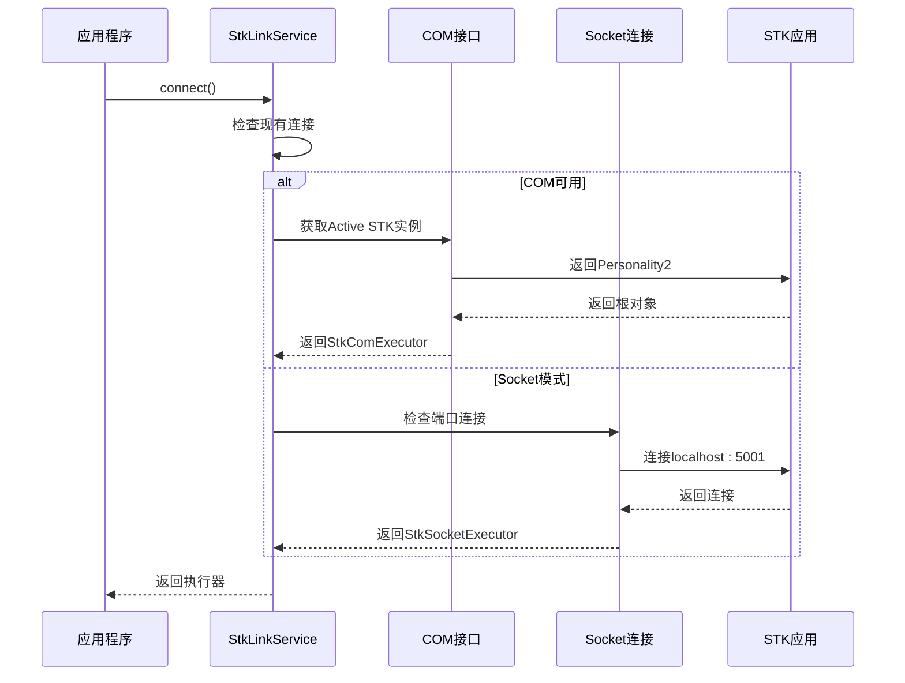

**图表来源**
- [stk_link.py:111-141](file://src/smart/services/stk_link.py#L111-L141)
- [stk_link.py:144-167](file://src/smart/services/stk_link.py#L144-L167)

#### 连接模式选择策略

系统优先使用COM接口，当COM不可用时自动降级到Socket连接：

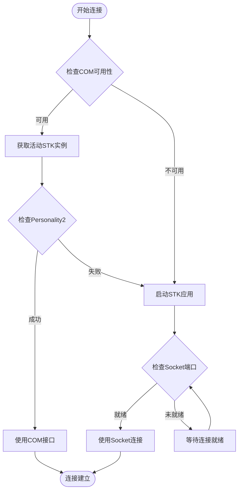

**图表来源**
- [stk_link.py:111-188](file://src/smart/services/stk_link.py#L111-L188)

**章节来源**
- [stk_link.py:111-188](file://src/smart/services/stk_link.py#L111-L188)

### 场景管理功能

#### 场景创建和同步

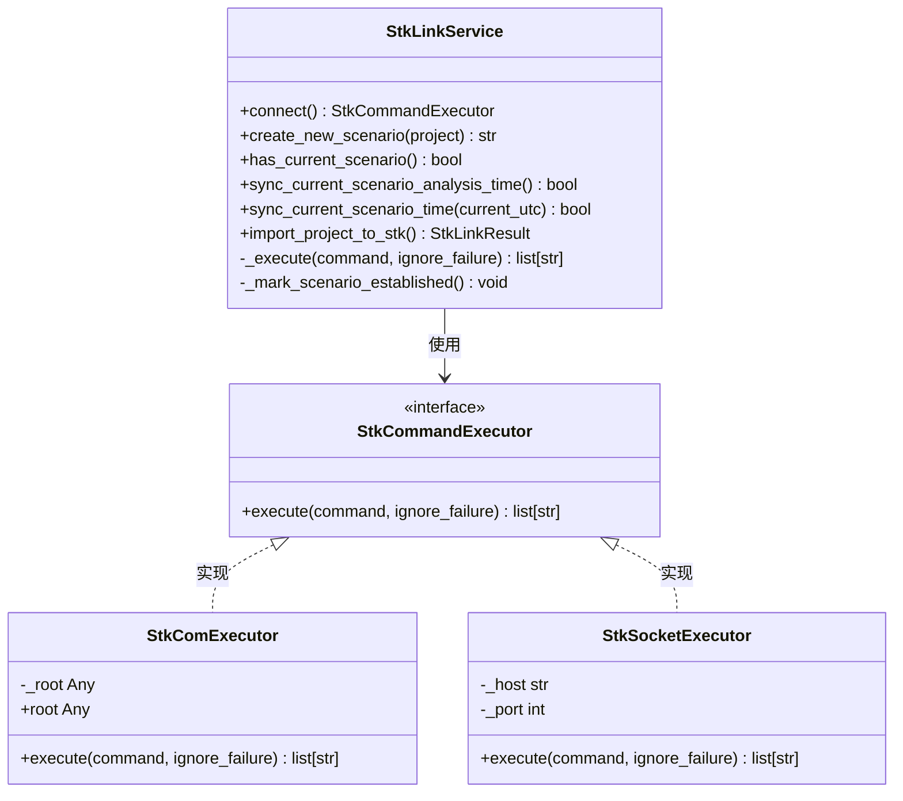

**图表来源**
- [stk_link.py:199-558](file://src/smart/services/stk_link.py#L199-L558)
- [stk_link.py:52-108](file://src/smart/services/stk_link.py#L52-L108)

#### 场景同步流程

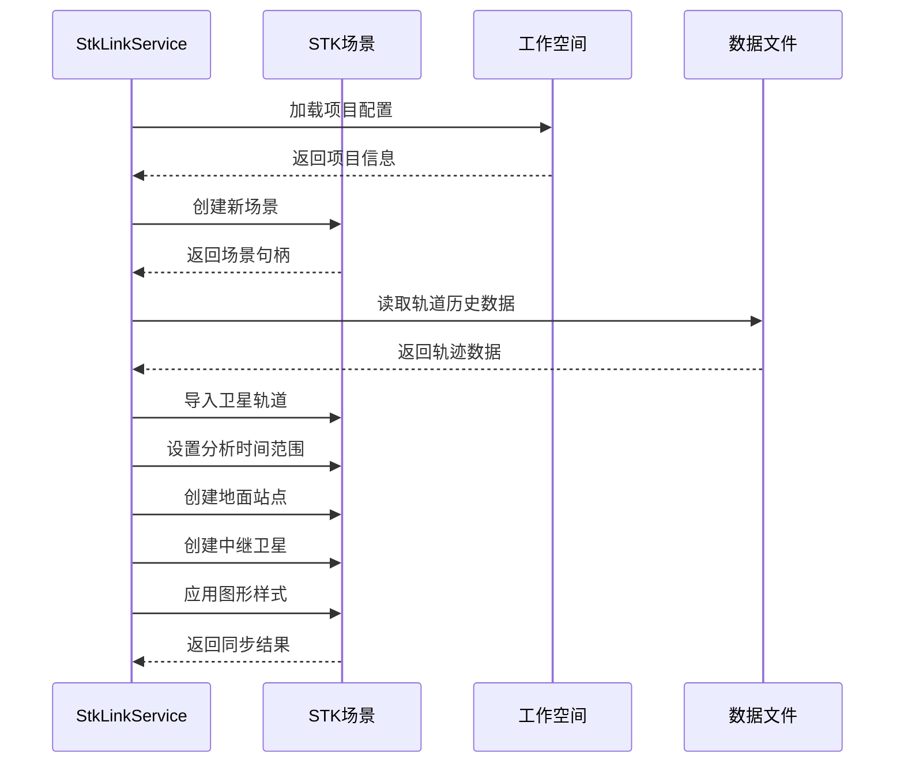

**图表来源**
- [stk_link.py:280-337](file://src/smart/services/stk_link.py#L280-L337)

**章节来源**
- [stk_link.py:223-337](file://src/smart/services/stk_link.py#L223-L337)

### 卫星对象管理

#### 轨道数据导入

系统支持多种轨道数据格式的导入和转换：

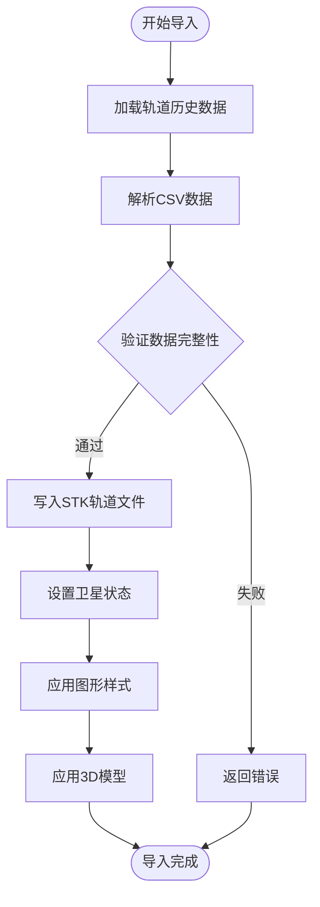

**图表来源**
- [stk_link.py:280-301](file://src/smart/services/stk_link.py#L280-L301)
- [stk_ephemeris.py:31-111](file://src/smart/services/stk_ephemeris.py#L31-L111)

#### 姿态数据处理

系统能够处理复杂的姿态数据并生成STK兼容的姿态文件：

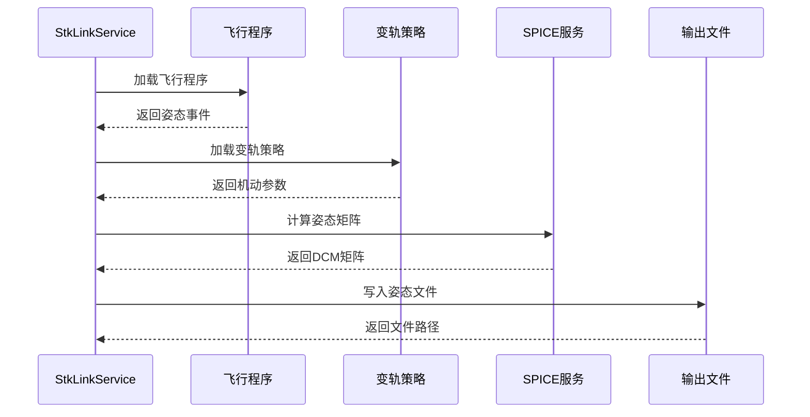

**图表来源**
- [stk_link.py:385-404](file://src/smart/services/stk_link.py#L385-L404)

**章节来源**
- [stk_link.py:280-404](file://src/smart/services/stk_link.py#L280-L404)

### 数据导出功能

#### STK文件格式生成

系统支持生成多种STK兼容的数据文件：

| 文件类型 | 用途 | 格式规范 |
|---------|------|----------|
| 轨道文件(.e) | 卫星轨道导入 | STK轨道文件格式 |
| 姿态文件(.a) | 卫星姿态导入 | STK姿态文件格式 |
| 中继卫星文件(.e) | GEO中继卫星 | 固定坐标系轨道 |

#### 文件生成流程

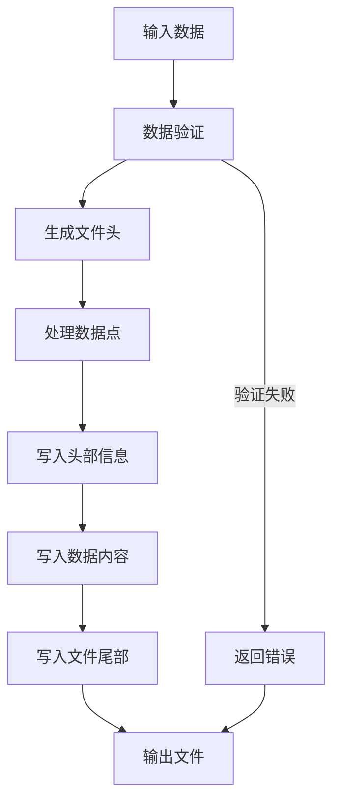

**图表来源**
- [stk_ephemeris.py:49-106](file://src/smart/services/stk_ephemeris.py#L49-L106)
- [stk_link.py:560-632](file://src/smart/services/stk_link.py#L560-L632)

**章节来源**
- [stk_ephemeris.py:31-111](file://src/smart/services/stk_ephemeris.py#L31-L111)
- [stk_link.py:560-632](file://src/smart/services/stk_link.py#L560-L632)

### 实时通信功能

#### Socket连接协议

系统通过标准的STK Connect协议进行通信：

| 协议元素 | 描述 | 示例 |
|---------|------|------|
| 请求格式 | ASCII文本，以换行符结尾 | "New / Scenario Test\n" |
| 响应格式 | "ACK"或"NACK"开头 | "ACK\n"或"NACK 错误信息\n" |
| 编码方式 | UTF-8 | 全部ASCII字符 |
| 超时设置 | 3秒 | socket超时 |

#### 命令执行流程

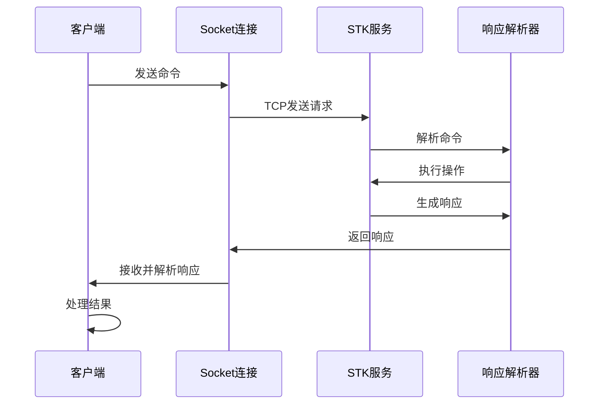

**图表来源**
- [stk_link.py:75-108](file://src/smart/services/stk_link.py#L75-L108)

**章节来源**
- [stk_link.py:75-108](file://src/smart/services/stk_link.py#L75-L108)

## 依赖关系分析

### 外部依赖

STK联动API依赖于以下关键外部组件：

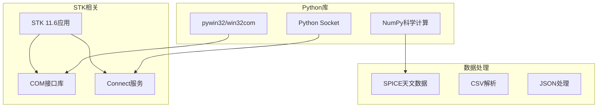

**图表来源**
- [stk_link.py:16-17](file://src/smart/services/stk_link.py#L16-L17)
- [stk_link.py:117-119](file://src/smart/services/stk_link.py#L117-L119)

### 内部依赖关系

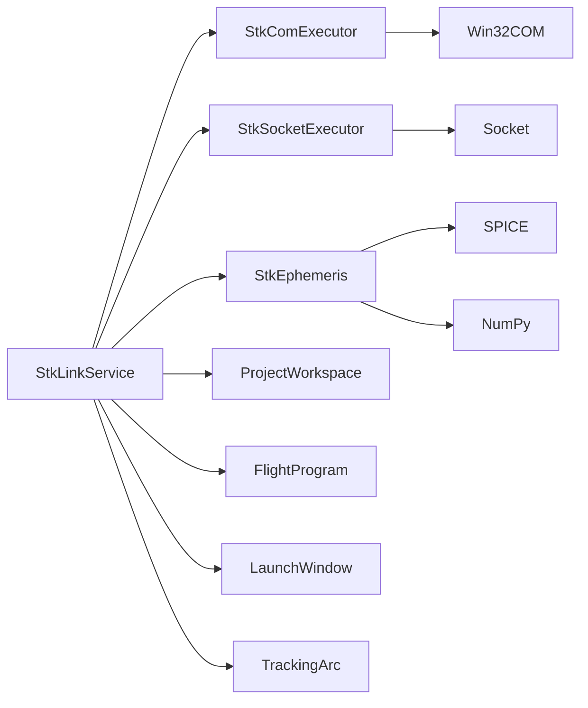

**图表来源**
- [stk_link.py:18-26](file://src/smart/services/stk_link.py#L18-L26)
- [stk_link.py:57-108](file://src/smart/services/stk_link.py#L57-L108)

**章节来源**
- [stk_link.py:18-26](file://src/smart/services/stk_link.py#L18-L26)

## 性能考虑

### 连接优化策略

1. **连接池管理**：避免频繁创建和销毁连接
2. **批量命令执行**：合并多个相关命令减少网络往返
3. **缓存机制**：缓存已解析的配置和计算结果
4. **异步操作**：使用线程池处理长时间运行的操作

### 内存管理

- **数据流处理**：大文件采用流式处理避免内存溢出
- **对象生命周期**：及时释放不再使用的COM对象
- **临时文件清理**：自动清理生成的中间文件

### 并发安全

- **线程同步**：确保多线程环境下的操作安全性
- **资源锁定**：防止同时修改同一STK对象
- **异常恢复**：在网络中断时自动重连

## 故障排除指南

### 常见问题及解决方案

#### COM接口问题
- **症状**：无法连接到STK COM接口
- **原因**：pywin32未正确安装或STK未启动
- **解决**：检查Python环境中的pywin32安装，手动启动STK应用

#### Socket连接问题
- **症状**：Socket连接超时或拒绝
- **原因**：STK Connect服务未启动或端口被占用
- **解决**：确认STK 11.6已启动，检查端口5001的可用性

#### 数据格式问题
- **症状**：轨道数据导入失败
- **原因**：CSV文件格式不正确或缺少必要字段
- **解决**：验证CSV文件包含必需的列：position_x_m, position_y_m, position_z_m, velocity_x_m_s等

#### 权限问题
- **症状**：无法创建文件或访问STK
- **原因**：权限不足或路径不存在
- **解决**：以管理员权限运行，确保输出目录存在且可写

**章节来源**
- [stk_link.py:95-106](file://src/smart/services/stk_link.py#L95-L106)
- [stk_link.py:113-114](file://src/smart/services/stk_link.py#L113-L114)

### 调试技巧

1. **启用详细日志**：查看执行的每一条STK命令
2. **检查中间文件**：验证生成的轨道和姿态文件
3. **监控STK状态**：确认STK场景和对象的正确性
4. **网络诊断**：使用netstat检查Socket连接状态

## 结论

STK联动API为SMART项目提供了强大而灵活的STK集成能力。通过COM和Socket两种连接模式，系统能够在不同环境下稳定运行。其模块化设计使得功能扩展和维护变得简单，同时提供了完善的错误处理和性能优化机制。

该API的主要优势包括：
- 支持多种连接模式的自动切换
- 完整的轨道和姿态数据处理能力
- 用户友好的界面集成
- 强大的错误处理和恢复机制
- 良好的性能和并发支持

## 附录

### API使用示例

#### 基本使用流程

```python
# 创建服务实例
service = StkLinkService(workspace)

# 连接到STK
executor = service.connect()

# 创建新场景
scenario_name = service.create_new_scenario()

# 同步项目数据
result = service.import_project_to_stk()

# 清理连接
service.clear_executor()
```

#### 高级配置选项

```python
# 自定义连接参数
service = StkLinkService(
    workspace,
    executor=custom_executor
)

# 设置自定义STK路径
os.environ['STK_APP_PATH'] = 'C:\\Program Files\\AGI\\STK 116\\bin\\AgUiApplication.exe'
```

### 配置参考

#### 环境变量
- `STK_APP_PATH`: STK 11.6可执行文件路径
- `SMART_STK_HELP_CONFIG`: STK帮助配置文件路径
- `SMART_STK_HELP_KB`: STK知识库路径
- `SMART_STK_HELP_SCRIPT`: STK帮助脚本路径

#### 配置文件格式
```json
{
    "kb_path": "/path/to/stk11_help.sqlite3",
    "script_path": "/path/to/stkhelp_cli.py",
    "command": "stkhelp"
}
```

**章节来源**
- [stk_11_6_operations.md:28-32](file://src/smart/agents/skills/stk_11_6_operations.md#L28-L32)