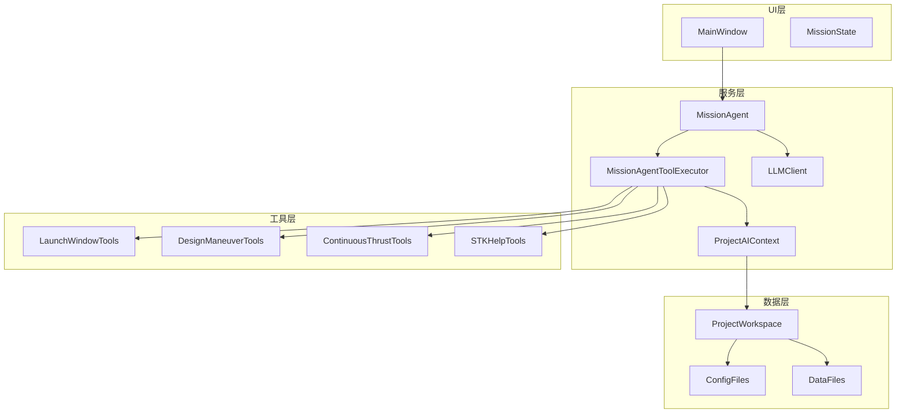
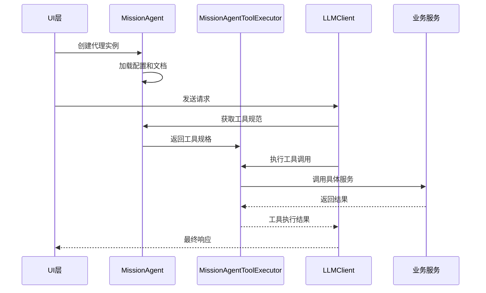
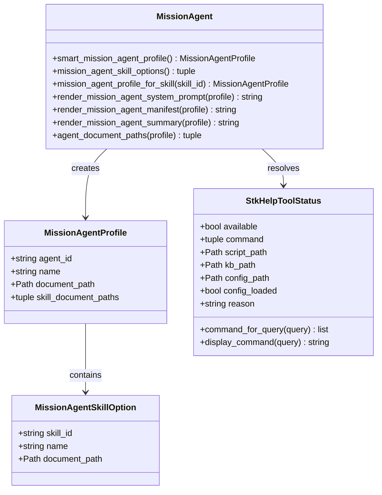
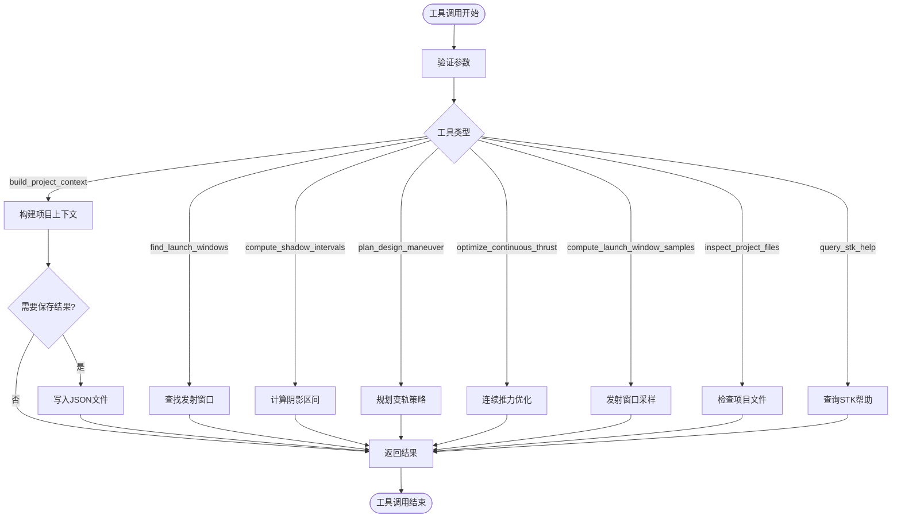
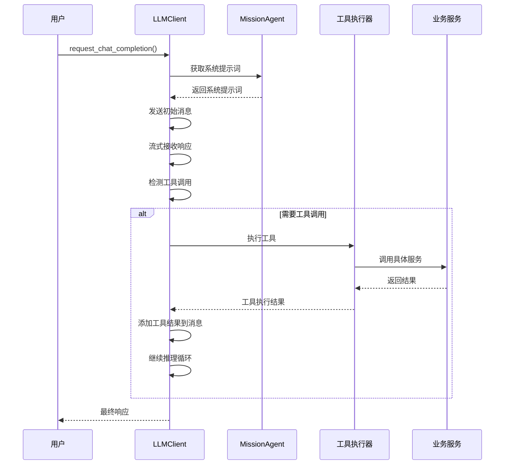
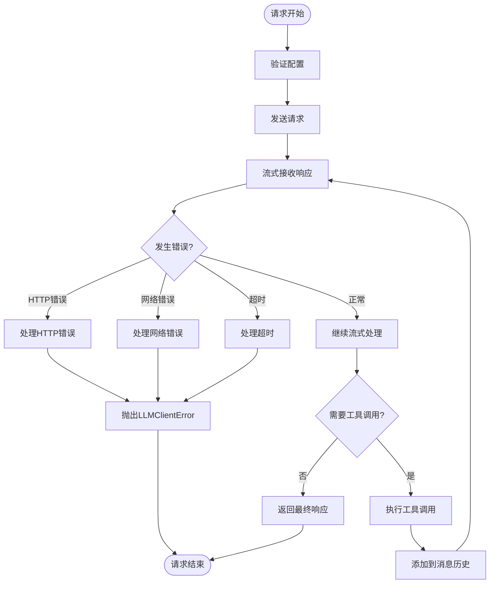
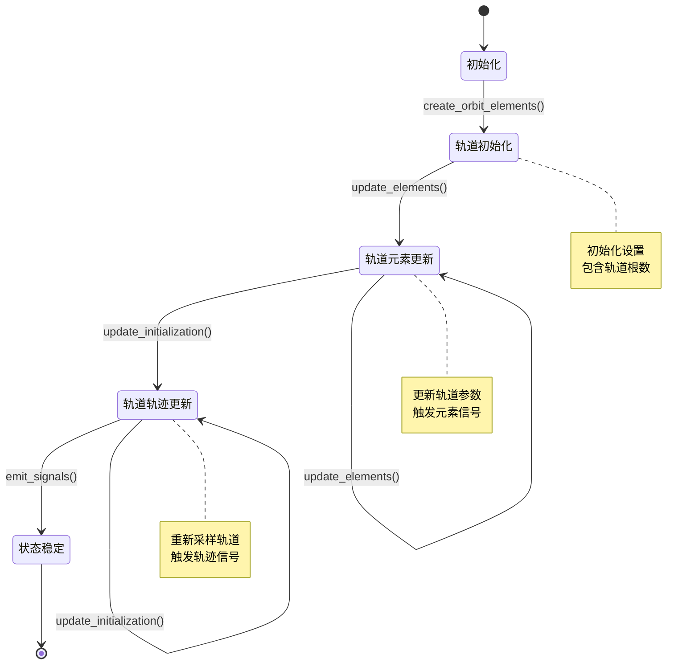
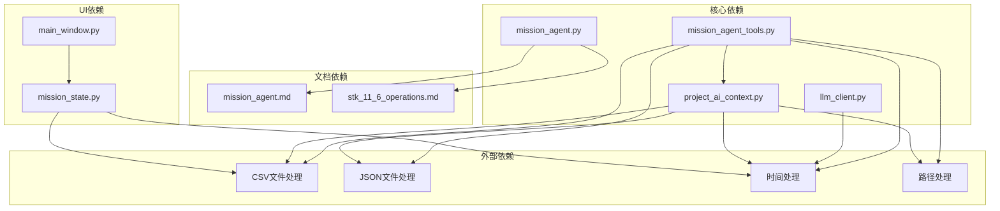

# 任务代理API

<cite>
**本文档引用的文件**
- [mission_agent.py](file://src/smart/services/mission_agent.py)
- [mission_agent_tools.py](file://src/smart/services/mission_agent_tools.py)
- [llm_client.py](file://src/smart/services/llm_client.py)
- [mission_state.py](file://src/smart/ui/mission_state.py)
- [mission_agent.md](file://src/smart/agents/mission_agent.md)
- [stk_11_6_operations.md](file://src/smart/agents/skills/stk_11_6_operations.md)
- [project_ai_context.py](file://src/smart/services/project_ai_context.py)
- [main_window.py](file://src/smart/ui/main_window.py)
- [test_llm_client.py](file://tests/test_llm_client.py)
</cite>

## 目录
1. [简介](#简介)
2. [项目结构](#项目结构)
3. [核心组件](#核心组件)
4. [架构概览](#架构概览)
5. [详细组件分析](#详细组件分析)
6. [依赖关系分析](#依赖关系分析)
7. [性能考虑](#性能考虑)
8. [故障排除指南](#故障排除指南)
9. [结论](#结论)
10. [附录](#附录)

## 简介

任务代理API是SMART项目中的核心智能决策系统，负责协调航天器任务分析、工具调用和智能决策流程。该系统基于MissionAgent类和MissionAgentToolExecutor类构建，集成了LLM客户端、项目上下文构建器和多种专业工具，为用户提供完整的任务规划和决策支持。

系统的主要目标是：
- 提供航天器任务分析的智能决策能力
- 集成多种专业工具进行任务规划和优化
- 支持与STK 11.6等外部系统的交互
- 实现任务状态管理和实时监控
- 提供可扩展的工具链集成机制

## 项目结构

SMART项目采用模块化架构，任务代理API位于服务层，与UI层和业务逻辑层分离：

**图表来源**
- [mission_agent.py:1-240](file://src/smart/services/mission_agent.py#L1-L240)
- [mission_agent_tools.py:1-732](file://src/smart/services/mission_agent_tools.py#L1-L732)
- [main_window.py:1-200](file://src/smart/ui/main_window.py#L1-L200)

**章节来源**
- [mission_agent.py:1-240](file://src/smart/services/mission_agent.py#L1-L240)
- [mission_agent_tools.py:1-732](file://src/smart/services/mission_agent_tools.py#L1-L732)
- [main_window.py:1-200](file://src/smart/ui/main_window.py#L1-L200)

## 核心组件

### MissionAgent类

MissionAgent类是任务代理的核心，负责管理代理配置、技能选择和系统提示词生成。

主要功能：
- **代理配置管理**：维护代理ID、名称和文档路径
- **技能选项管理**：提供可用技能的选择和过滤
- **系统提示词生成**：根据配置生成完整的系统提示词
- **文档管理**：处理代理和技能文档的读取和渲染

关键特性：
- 使用dataclass实现不可变配置
- 支持技能级别的配置覆盖
- 提供完整的文档路径管理
- 集成STK 11.6帮助系统

### MissionAgentToolExecutor类

MissionAgentToolExecutor类实现了工具执行器模式，提供统一的工具调用接口。

主要工具集：
- **项目上下文构建**：`build_project_context` - 构建项目摘要上下文
- **发射窗口查询**：`find_launch_windows` - 查找指定日期的发射窗口
- **阴影区间计算**：`compute_shadow_intervals_for_launch` - 计算发射时刻的地影区间
- **变轨策略规划**：`plan_design_maneuver_strategy` - 设计脉冲变轨策略
- **连续推力优化**：`optimize_design_continuous_thrust` - 连续推力设计优化
- **发射窗口采样**：`compute_launch_window_samples` - 发射窗口重新采样
- **项目文件检查**：`inspect_project_files` - 检查项目文件完整性
- **STK帮助查询**：`query_stk_help` - 查询STK 11.6帮助KB

**章节来源**
- [mission_agent.py:40-240](file://src/smart/services/mission_agent.py#L40-L240)
- [mission_agent_tools.py:42-250](file://src/smart/services/mission_agent_tools.py#L42-L250)

## 架构概览

任务代理API采用分层架构设计，确保了良好的模块分离和可扩展性：

**图表来源**
- [mission_agent.py:185-211](file://src/smart/services/mission_agent.py#L185-L211)
- [mission_agent_tools.py:232-249](file://src/smart/services/mission_agent_tools.py#L232-L249)
- [llm_client.py:69-162](file://src/smart/services/llm_client.py#L69-L162)

## 详细组件分析

### MissionAgent类详细分析

**图表来源**
- [mission_agent.py:40-240](file://src/smart/services/mission_agent.py#L40-L240)

#### 工具规范定义

MissionAgentToolExecutor类提供了完整的工具规范定义：

**图表来源**
- [mission_agent_tools.py:232-512](file://src/smart/services/mission_agent_tools.py#L232-L512)

**章节来源**
- [mission_agent.py:145-240](file://src/smart/services/mission_agent.py#L145-L240)
- [mission_agent_tools.py:42-512](file://src/smart/services/mission_agent_tools.py#L42-L512)

### LLM客户端集成

LLM客户端提供了完整的智能决策流程：

**图表来源**
- [llm_client.py:69-162](file://src/smart/services/llm_client.py#L69-L162)
- [mission_agent.py:185-211](file://src/smart/services/mission_agent.py#L185-L211)

#### 错误处理机制

LLM客户端实现了完善的错误处理：

**图表来源**
- [llm_client.py:228-272](file://src/smart/services/llm_client.py#L228-L272)

**章节来源**
- [llm_client.py:69-339](file://src/smart/services/llm_client.py#L69-L339)

### 任务状态管理

MissionState类提供了任务状态的实时管理：

**图表来源**
- [mission_state.py:11-45](file://src/smart/ui/mission_state.py#L11-L45)

**章节来源**
- [mission_state.py:11-45](file://src/smart/ui/mission_state.py#L11-L45)

## 依赖关系分析

任务代理API的依赖关系清晰且模块化：

**图表来源**
- [mission_agent.py:1-32](file://src/smart/services/mission_agent.py#L1-L32)
- [mission_agent_tools.py:12-32](file://src/smart/services/mission_agent_tools.py#L12-L32)
- [project_ai_context.py:1-11](file://src/smart/services/project_ai_context.py#L1-L11)

**章节来源**
- [mission_agent.py:1-32](file://src/smart/services/mission_agent.py#L1-L32)
- [mission_agent_tools.py:12-32](file://src/smart/services/mission_agent_tools.py#L12-L32)
- [project_ai_context.py:1-11](file://src/smart/services/project_ai_context.py#L1-L11)

## 性能考虑

任务代理API在设计时充分考虑了性能优化：

### 工具执行优化
- **延迟加载**：工具规范仅在需要时生成
- **缓存机制**：项目上下文结果缓存
- **批量处理**：多个工具调用的批处理优化

### 内存管理
- **数据类使用**：不可变数据结构减少内存占用
- **流式处理**：大文件的流式读取和处理
- **资源清理**：及时释放临时文件和连接

### 并发处理
- **异步工具调用**：支持并发执行多个工具
- **进度回调**：实时反馈处理进度
- **超时控制**：防止长时间阻塞

## 故障排除指南

### 常见问题及解决方案

#### LLM客户端错误
- **API密钥无效**：检查环境变量SMART_LLM_API_KEY
- **模型不支持**：确保使用支持的DeepSeek模型
- **网络连接失败**：检查防火墙和代理设置
- **请求超时**：增加timeout_s配置值

#### 工具执行错误
- **未知工具名**：确认工具名称在工具规范中定义
- **参数验证失败**：检查工具参数的类型和范围
- **文件访问权限**：确保对项目目录有读写权限
- **外部依赖缺失**：检查STK 11.6安装和配置

#### 项目上下文构建错误
- **项目根目录不存在**：确认项目路径正确
- **配置文件格式错误**：检查JSON文件的语法
- **数据文件损坏**：验证CSV文件的完整性
- **内存不足**：调整row_limit和char_limit参数

**章节来源**
- [llm_client.py:27-29](file://src/smart/services/llm_client.py#L27-L29)
- [mission_agent_tools.py:38-40](file://src/smart/services/mission_agent_tools.py#L38-L40)

## 结论

任务代理API是一个设计精良、功能完整的智能决策系统。其核心优势包括：

### 架构优势
- **模块化设计**：清晰的职责分离和依赖管理
- **可扩展性**：易于添加新的工具和技能
- **稳定性**：完善的错误处理和恢复机制
- **性能优化**：高效的工具执行和资源管理

### 功能特性
- **智能决策**：基于LLM的高级推理能力
- **工具集成**：统一的工具调用接口
- **状态管理**：实时的任务状态监控
- **文档驱动**：基于文档的代理行为控制

### 应用价值
该系统为航天器任务分析提供了强大的智能化支持，能够：
- 自动化复杂的任务规划流程
- 提供准确的工程决策建议
- 减少人工干预和错误
- 提高整体工作效率

## 附录

### API使用示例

#### 基本使用流程
1. 创建MissionAgent实例
2. 配置LLM客户端参数
3. 定义工具执行器
4. 发送聊天完成请求
5. 处理响应和工具调用

#### 高级配置选项
- **推理强度**：high或max级别
- **思维模式**：启用或禁用内部思考
- **工具轮次**：最大工具调用次数
- **进度回调**：实时进度反馈

### 扩展指南

#### 添加新工具
1. 在tool_specs中定义工具规范
2. 实现execute方法中的工具逻辑
3. 添加相应的参数验证
4. 编写单元测试

#### 集成新技能
1. 创建技能文档文件
2. 更新技能选项列表
3. 配置技能ID和名称
4. 测试技能集成

**章节来源**
- [mission_agent.py:145-183](file://src/smart/services/mission_agent.py#L145-L183)
- [mission_agent_tools.py:46-231](file://src/smart/services/mission_agent_tools.py#L46-L231)