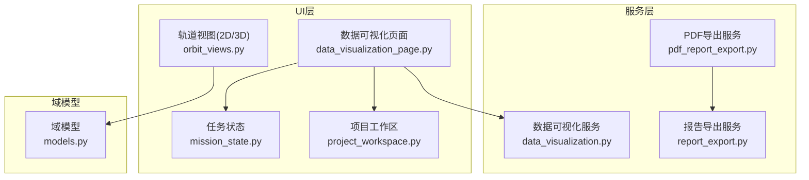
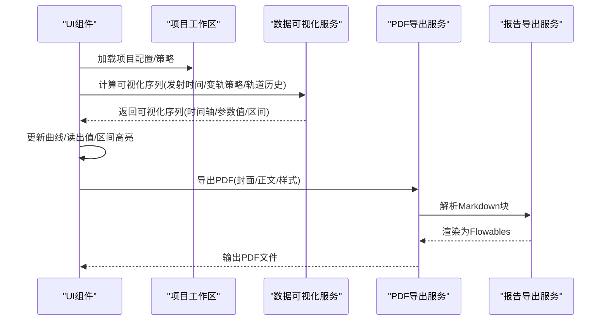
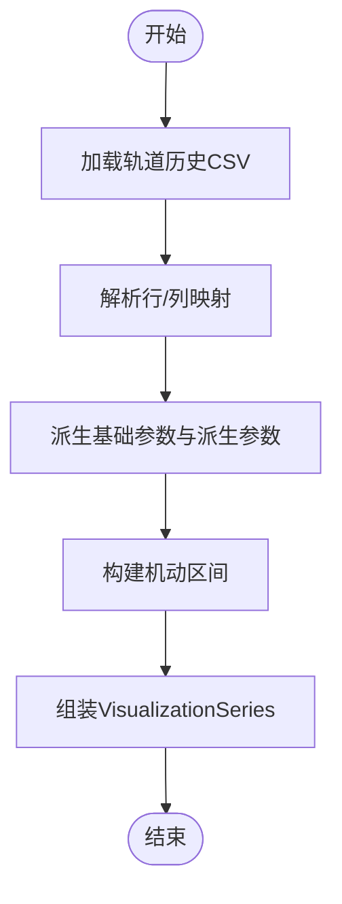
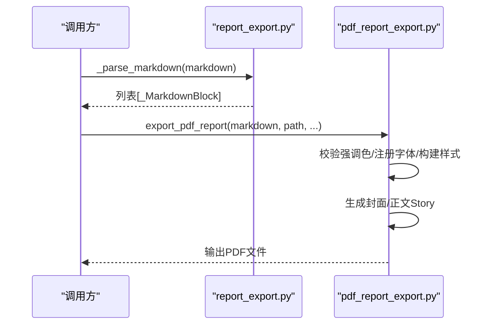
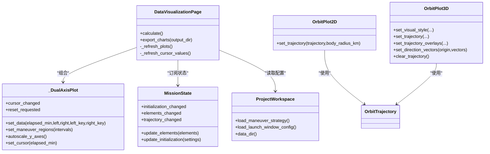
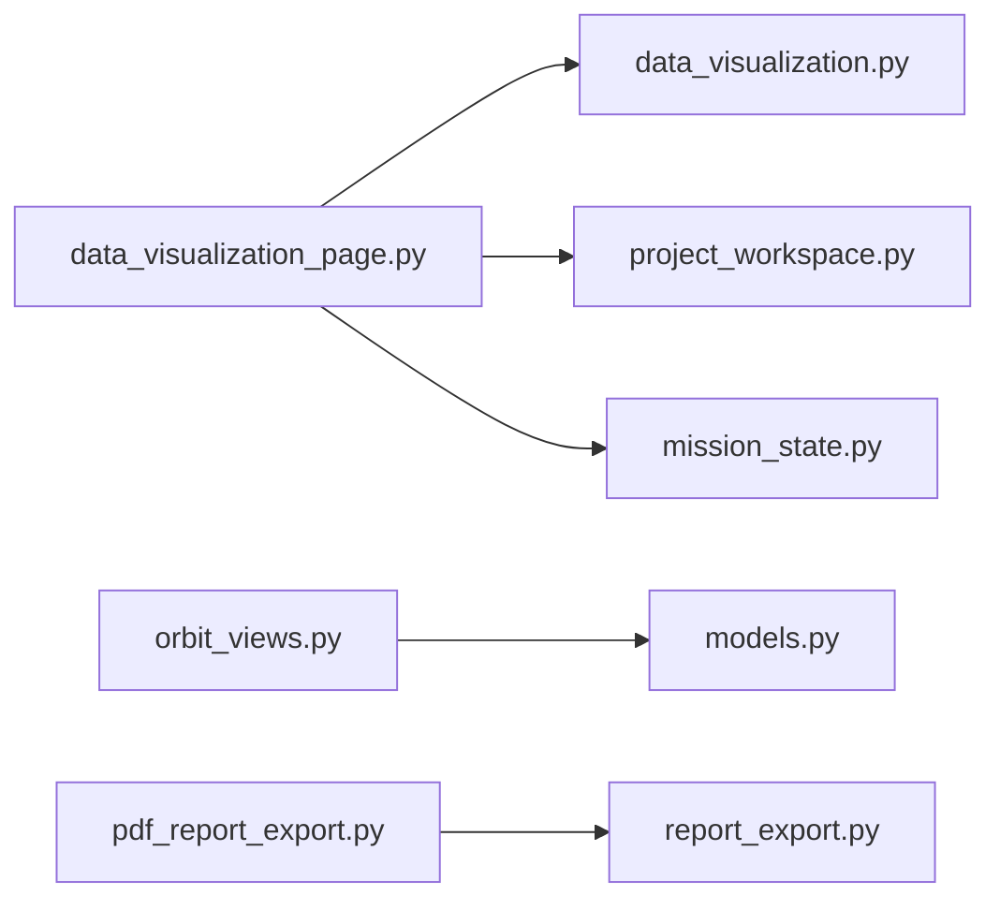

# 数据服务API

<cite>
**本文引用的文件列表**
- [data_visualization.py](file://src/smart/services/data_visualization.py)
- [pdf_report_export.py](file://src/smart/services/pdf_report_export.py)
- [report_export.py](file://src/smart/services/report_export.py)
- [data_visualization_page.py](file://src/smart/ui/widgets/data_visualization_page.py)
- [orbit_views.py](file://src/smart/ui/widgets/orbit_views.py)
- [project_workspace.py](file://src/smart/services/project_workspace.py)
- [models.py](file://src/smart/domain/models.py)
- [mission_state.py](file://src/smart/ui/mission_state.py)
- [test_data_visualization.py](file://tests/test_data_visualization.py)
- [test_pdf_report_export.py](file://tests/test_pdf_report_export.py)
</cite>

## 目录
1. [简介](#简介)
2. [项目结构](#项目结构)
3. [核心组件](#核心组件)
4. [架构总览](#架构总览)
5. [详细组件分析](#详细组件分析)
6. [依赖关系分析](#依赖关系分析)
7. [性能考虑](#性能考虑)
8. [故障排查指南](#故障排查指南)
9. [结论](#结论)
10. [附录](#附录)

## 简介
本文件面向“数据服务API”的使用者与维护者，系统性梳理数据可视化、报告生成、2D/3D轨道渲染、图表导出、数据格式转换与输出质量控制等能力的公共接口与实现要点。文档同时覆盖前端UI组件与后端数据服务之间的数据绑定与状态同步机制，并给出性能优化与内存管理的最佳实践建议。

## 项目结构
围绕数据服务API的关键模块分布如下：
- 服务层（数据处理与导出）
  - 可视化参数构建与计算：data_visualization.py
  - 报告导出（PDF/DOCX/Markdown）：pdf_report_export.py、report_export.py
- UI层（数据绑定与渲染）
  - 2D/3D轨道视图与交互：data_visualization_page.py、orbit_views.py
  - 项目工作区与配置读写：project_workspace.py
  - 域模型与状态：models.py、mission_state.py
- 测试与验证
  - 可视化与报告导出的单元测试：test_data_visualization.py、test_pdf_report_export.py

**图表来源**
- [data_visualization.py:1-220](file://src/smart/services/data_visualization.py#L1-L220)
- [pdf_report_export.py:1-469](file://src/smart/services/pdf_report_export.py#L1-L469)
- [report_export.py:1-369](file://src/smart/services/report_export.py#L1-L369)
- [data_visualization_page.py:1-653](file://src/smart/ui/widgets/data_visualization_page.py#L1-L653)
- [orbit_views.py:1-547](file://src/smart/ui/widgets/orbit_views.py#L1-L547)
- [mission_state.py:1-44](file://src/smart/ui/mission_state.py#L1-L44)
- [project_workspace.py:1-920](file://src/smart/services/project_workspace.py#L1-L920)
- [models.py:1-255](file://src/smart/domain/models.py#L1-L255)

**章节来源**
- [data_visualization.py:1-220](file://src/smart/services/data_visualization.py#L1-L220)
- [pdf_report_export.py:1-469](file://src/smart/services/pdf_report_export.py#L1-L469)
- [report_export.py:1-369](file://src/smart/services/report_export.py#L1-L369)
- [data_visualization_page.py:1-653](file://src/smart/ui/widgets/data_visualization_page.py#L1-L653)
- [orbit_views.py:1-547](file://src/smart/ui/widgets/orbit_views.py#L1-L547)
- [project_workspace.py:1-920](file://src/smart/services/project_workspace.py#L1-L920)
- [models.py:1-255](file://src/smart/domain/models.py#L1-L255)
- [mission_state.py:1-44](file://src/smart/ui/mission_state.py#L1-L44)

## 核心组件
- 数据可视化服务
  - 提供轨道历史CSV解析、参数派生与可视化序列构建，支持平近点角、Beta角、地球-太阳夹角等派生参数计算。
  - 提供默认发射时间推断逻辑，兼容飞行计划与变轨策略配置。
- 报告导出服务
  - 支持Markdown解析与渲染，输出PDF（基于reportlab）、DOCX（基于XML打包）、纯文本Markdown。
  - PDF导出包含封面与正文模板、样式表、表格列宽自适应、符号归一化等。
- UI可视化组件
  - 2D曲线视图：双轴联动、游标同步、区间高亮、自适应缩放、导出PNG。
  - 3D轨道视图：OpenGL渲染、地球纹理、方向矢量箭头、机动轨迹叠加、信息覆盖层。
- 项目工作区
  - 统一管理项目目录结构、配置文件路径、读写策略与元数据更新时间戳。
- 域模型与状态
  - 定义轨道元素、轨迹、初始化设置等数据结构；MissionState提供信号驱动的状态变更与UI绑定。

**章节来源**
- [data_visualization.py:1-220](file://src/smart/services/data_visualization.py#L1-L220)
- [pdf_report_export.py:1-469](file://src/smart/services/pdf_report_export.py#L1-L469)
- [report_export.py:1-369](file://src/smart/services/report_export.py#L1-L369)
- [data_visualization_page.py:1-653](file://src/smart/ui/widgets/data_visualization_page.py#L1-L653)
- [orbit_views.py:1-547](file://src/smart/ui/widgets/orbit_views.py#L1-L547)
- [project_workspace.py:1-920](file://src/smart/services/project_workspace.py#L1-L920)
- [models.py:1-255](file://src/smart/domain/models.py#L1-L255)
- [mission_state.py:1-44](file://src/smart/ui/mission_state.py#L1-L44)

## 架构总览
数据服务API通过服务层完成数据处理与格式转换，UI层负责展示与交互，二者通过信号/槽与数据类进行解耦绑定。

**图表来源**
- [data_visualization_page.py:346-373](file://src/smart/ui/widgets/data_visualization_page.py#L346-L373)
- [data_visualization.py:49-107](file://src/smart/services/data_visualization.py#L49-L107)
- [pdf_report_export.py:81-155](file://src/smart/services/pdf_report_export.py#L81-L155)
- [report_export.py:43-123](file://src/smart/services/report_export.py#L43-L123)
- [project_workspace.py:118-127](file://src/smart/services/project_workspace.py#L118-L127)

## 详细组件分析

### 数据可视化服务 API
- 主要职责
  - 将轨道历史CSV解析为数值数组，派生轨道参数（半长轴、偏心率、倾角、升交点赤经、近地点幅角、真/平/偏近点角、近/远地点高度、Beta角、地球-太阳夹角等）。
  - 构建VisualizationSeries，包含发射UTC、T0 UTC、时间轴（分钟）、参数值矩阵、机动区间等。
  - 提供默认发射时间推断函数，优先飞行计划，其次变轨策略，最后当前UTC。
- 关键接口
  - build_visualization_series(...)
  - default_launch_utc_from_configs(...)
  - parameter_label(...) / parameter_unit(...)
- 性能与数值稳定性
  - 使用numpy向量化计算，避免Python循环；对三角函数与向量归一化加入数值下界保护。
  - 对地球半径采用中位数估计以提升鲁棒性。

**图表来源**
- [data_visualization.py:49-107](file://src/smart/services/data_visualization.py#L49-L107)
- [data_visualization.py:144-171](file://src/smart/services/data_visualization.py#L144-L171)

**章节来源**
- [data_visualization.py:1-220](file://src/smart/services/data_visualization.py#L1-L220)
- [test_data_visualization.py:110-139](file://tests/test_data_visualization.py#L110-L139)

### 报告导出服务 API
- 功能概览
  - Markdown解析：标题、段落、列表、表格、代码块识别与规范化。
  - DOCX导出：基于OpenXML打包，生成word/document.xml、styles.xml等。
  - PDF导出：reportlab渲染，含封面模板、正文模板、样式表、表格列宽、页眉页脚。
- 关键接口
  - export_markdown_report(markdown, path)
  - export_docx_report(markdown, path)
  - export_pdf_report(markdown, path, title, project_name, generated_at, accent)
- 输出质量控制
  - 符号归一化（√/×等）、表格列宽自适应、强调色校验与回退、字体注册与回退。

**图表来源**
- [report_export.py:43-123](file://src/smart/services/report_export.py#L43-L123)
- [pdf_report_export.py:81-155](file://src/smart/services/pdf_report_export.py#L81-L155)

**章节来源**
- [report_export.py:1-369](file://src/smart/services/report_export.py#L1-L369)
- [pdf_report_export.py:1-469](file://src/smart/services/pdf_report_export.py#L1-L469)
- [test_pdf_report_export.py:27-68](file://tests/test_pdf_report_export.py#L27-L68)

### UI可视化组件 API
- 2D曲线视图（双轴联动）
  - 支持左右双参数选择、游标移动、区间高亮、自适应缩放、读出值显示、导出PNG。
  - 事件：cursor_changed、reset_requested。
- 3D轨道视图（OpenGL）
  - 地球网格/纹理、轨道线、当前点标记、起始点标记、子卫星点标记、方向矢量箭头与标签、机动轨迹叠加。
  - 视图样式可配置（背景色、轨道/标记颜色、线宽）。
- 数据绑定与状态同步
  - MissionState提供initialization_changed、elements_changed、trajectory_changed信号，UI订阅以刷新视图。
  - ProjectWorkspace提供配置读取/保存，驱动计算与渲染。

**图表来源**
- [data_visualization_page.py:44-280](file://src/smart/ui/widgets/data_visualization_page.py#L44-L280)
- [orbit_views.py:104-547](file://src/smart/ui/widgets/orbit_views.py#L104-L547)
- [mission_state.py:11-44](file://src/smart/ui/mission_state.py#L11-L44)
- [project_workspace.py:234-239](file://src/smart/services/project_workspace.py#L234-L239)

**章节来源**
- [data_visualization_page.py:1-653](file://src/smart/ui/widgets/data_visualization_page.py#L1-L653)
- [orbit_views.py:1-547](file://src/smart/ui/widgets/orbit_views.py#L1-L547)
- [mission_state.py:1-44](file://src/smart/ui/mission_state.py#L1-L44)
- [project_workspace.py:1-920](file://src/smart/services/project_workspace.py#L1-L920)

### 2D/3D可视化组件配置与渲染接口
- 2D曲线视图
  - 参数选择：从参数选项集合中选择左右轴参数，自动标注单位与标签。
  - 区间高亮：基于机动区间绘制透明区间，便于识别机动窗口。
  - 读出值：游标位置对应参数值与时间，格式化显示。
  - 导出：grab()截图保存PNG。
- 3D视图
  - 视觉样式：背景色、轨道线宽、颜色。
  - 轨迹叠加：当前轨迹、起始点、子卫星点、方向矢量箭头与标签、机动轨迹。
  - 地球对象：网格/纹理、旋转、缩放。
  - 信息覆盖层：四角信息标签，随窗口大小调整布局。
- 数据绑定
  - UI通过MissionState的信号感知元素/轨迹变化，自动刷新视图。
  - ProjectWorkspace提供策略与配置路径，驱动计算入口。

**章节来源**
- [data_visualization_page.py:44-280](file://src/smart/ui/widgets/data_visualization_page.py#L44-L280)
- [orbit_views.py:156-547](file://src/smart/ui/widgets/orbit_views.py#L156-L547)
- [mission_state.py:11-44](file://src/smart/ui/mission_state.py#L11-L44)
- [project_workspace.py:183-239](file://src/smart/services/project_workspace.py#L183-L239)

### 报告模板定制、数据格式化与输出质量控制
- 模板定制
  - PDF：封面/正文PageTemplate、页眉页脚、强调色、字体注册与回退。
  - DOCX：OpenXML结构（document.xml、styles.xml、rels），表格边框与居中。
- 数据格式化
  - Markdown解析：标题层级、列表、表格、代码块；表格紧凑格式拆分。
  - 符号归一化：√/×等特殊符号替换，确保跨平台一致性。
- 输出质量控制
  - 表格列宽自适应；强调色合法性校验与回退；字体缺失时回退至默认。
  - DOCX打包压缩级别与必需资源文件齐全性检查。

**章节来源**
- [pdf_report_export.py:1-469](file://src/smart/services/pdf_report_export.py#L1-L469)
- [report_export.py:1-369](file://src/smart/services/report_export.py#L1-L369)
- [test_pdf_report_export.py:27-68](file://tests/test_pdf_report_export.py#L27-L68)

## 依赖关系分析
- 服务层内部
  - data_visualization依赖launch_window与earth_orientation的辅助函数，用于时间线构建与太阳矢量计算。
  - pdf_report_export复用report_export的Markdown解析与符号归一化。
- UI层与服务层
  - DataVisualizationPage依赖data_visualization构建可视化序列，并通过ProjectWorkspace读取策略与配置。
  - OrbitPlot2D/OrbitPlot3D依赖域模型OrbitTrajectory进行渲染。
- 状态与绑定
  - MissionState通过信号通知UI更新，UI再触发服务层重新计算或导出。

**图表来源**
- [data_visualization_page.py:1-25](file://src/smart/ui/widgets/data_visualization_page.py#L1-L25)
- [data_visualization.py:11-18](file://src/smart/services/data_visualization.py#L11-L18)
- [pdf_report_export.py:45-45](file://src/smart/services/pdf_report_export.py#L45-L45)
- [report_export.py:1-11](file://src/smart/services/report_export.py#L1-L11)
- [orbit_views.py:10-11](file://src/smart/ui/widgets/orbit_views.py#L10-L11)
- [models.py:69-78](file://src/smart/domain/models.py#L69-L78)
- [mission_state.py:11-14](file://src/smart/ui/mission_state.py#L11-L14)
- [project_workspace.py:10-31](file://src/smart/services/project_workspace.py#L10-L31)

**章节来源**
- [data_visualization_page.py:1-25](file://src/smart/ui/widgets/data_visualization_page.py#L1-L25)
- [data_visualization.py:11-18](file://src/smart/services/data_visualization.py#L11-L18)
- [pdf_report_export.py:45-45](file://src/smart/services/pdf_report_export.py#L45-L45)
- [report_export.py:1-11](file://src/smart/services/report_export.py#L1-L11)
- [orbit_views.py:10-11](file://src/smart/ui/widgets/orbit_views.py#L10-L11)
- [models.py:69-78](file://src/smart/domain/models.py#L69-L78)
- [mission_state.py:11-14](file://src/smart/ui/mission_state.py#L11-L14)
- [project_workspace.py:10-31](file://src/smart/services/project_workspace.py#L10-L31)

## 性能考虑
- 数值计算
  - 使用numpy向量化替代Python循环，减少类型转换与循环开销；对向量归一化引入最小范数阈值，避免除零与NaN传播。
- 内存管理
  - VisualizationSeries与UI中的数组均使用numpy数组，尽量复用数组视图与就地修改；导出PNG前及时释放中间图像对象。
- 渲染优化
  - 3D视图按需可见性切换（setVisible），减少不必要的绘制；方向矢量与机动轨迹按需创建/销毁，避免重复实例化。
- I/O与缓存
  - ProjectWorkspace统一管理文件路径与元数据更新时间戳，避免重复读取；Markdown解析仅在导出时进行一次解析。
- 并发与异步
  - 当前未见多线程/异步实现，建议在大规模数据处理时引入异步队列与进度回调，避免阻塞UI线程。

[本节为通用指导，不直接分析具体文件]

## 故障排查指南
- 可视化参数缺失或异常
  - 检查轨道历史CSV字段是否完整；确认派生参数计算（如Beta角、地球-太阳夹角）输入向量非零。
  - 参考测试用例验证派生参数与机动区间数量。
- PDF导出失败或样式异常
  - 校验强调色格式（十六进制）；字体注册失败时回退至默认字体但仍可生成PDF。
  - 确认输出路径存在且具备写权限。
- DOCX导出结构错误
  - 确认ZIP包内必需文件齐全（document.xml、styles.xml、rels等）；表格XML结构正确。
- 3D视图不可用
  - OpenGL初始化失败时显示提示信息；检查本地OpenGL运行时与驱动。

**章节来源**
- [test_data_visualization.py:101-139](file://tests/test_data_visualization.py#L101-L139)
- [test_pdf_report_export.py:27-68](file://tests/test_pdf_report_export.py#L27-L68)
- [pdf_report_export.py:158-181](file://src/smart/services/pdf_report_export.py#L158-L181)
- [orbit_views.py:195-210](file://src/smart/ui/widgets/orbit_views.py#L195-L210)

## 结论
本数据服务API通过清晰的服务-界面分离，提供了从轨道参数计算、2D/3D可视化渲染到报告导出的全链路能力。其接口设计注重参数派生的数值稳健性、报告输出的跨平台一致性与UI交互的响应性。结合测试用例与最佳实践，可在工程化落地中获得稳定可靠的用户体验。

[本节为总结性内容，不直接分析具体文件]

## 附录
- API清单（按功能分类）
  - 数据可视化
    - build_visualization_series(...)
    - default_launch_utc_from_configs(...)
    - parameter_label(...), parameter_unit(...)
  - 报告导出
    - export_markdown_report(...)
    - export_docx_report(...)
    - export_pdf_report(...)
  - UI导出
    - DataVisualizationPage.export_charts(...)
  - 项目工作区
    - ProjectWorkspace.load_maneuver_strategy()/load_launch_window_config()/data_dir()

[本节为概览性内容，不直接分析具体文件]