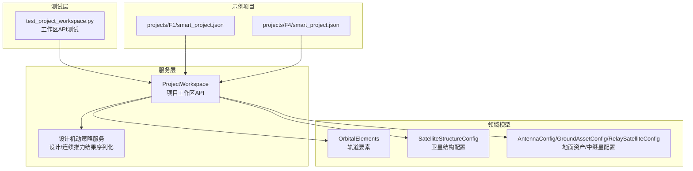
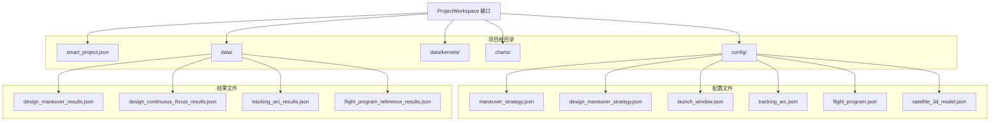
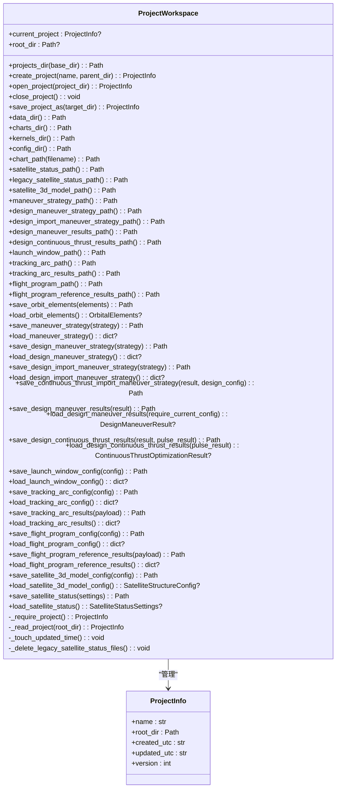
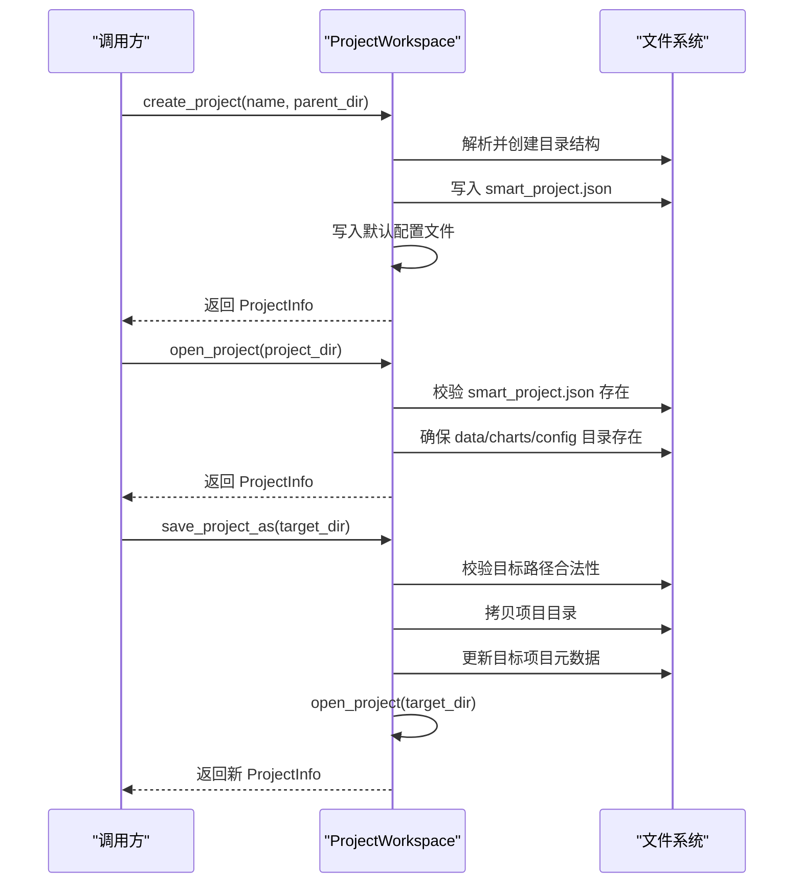
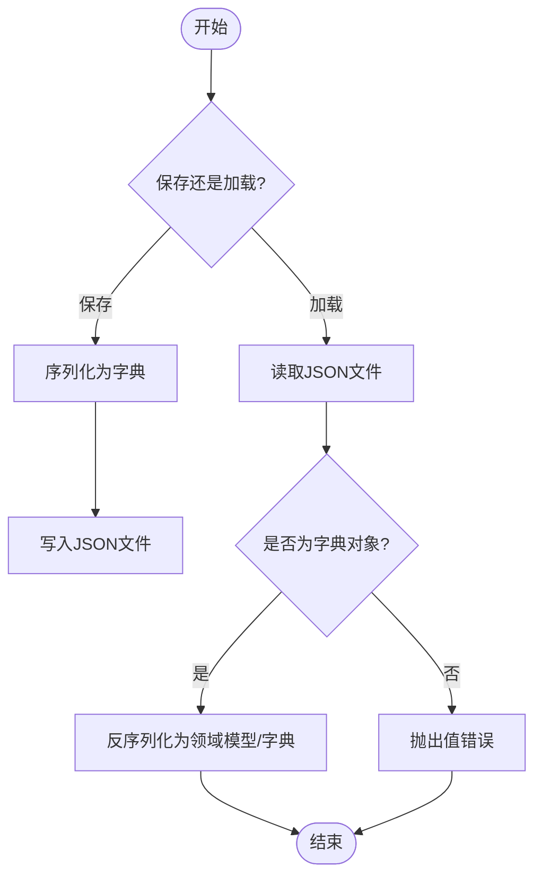
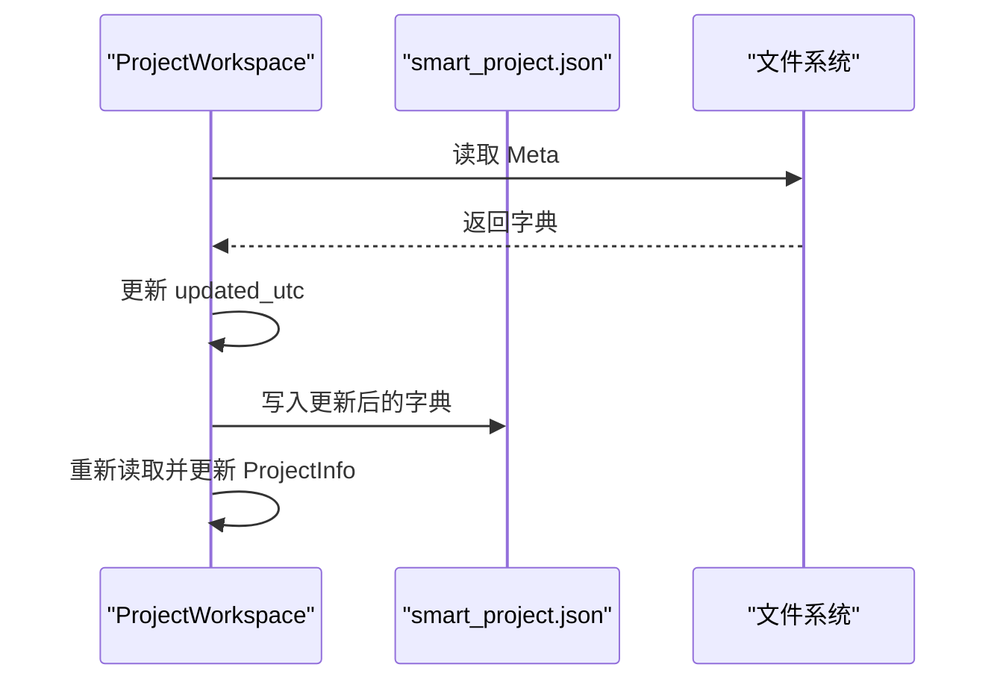
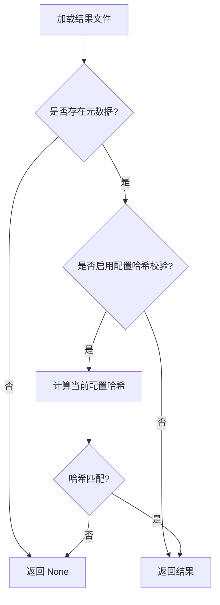
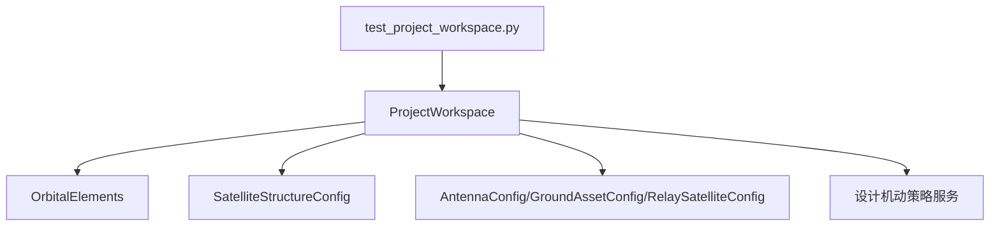

# 项目工作区API

<cite>
**本文档引用的文件**
- [project_workspace.py](file://src/smart/services/project_workspace.py)
- [test_project_workspace.py](file://tests/test_project_workspace.py)
- [models.py](file://src/smart/domain/models.py)
- [design_maneuver_strategy.py](file://src/smart/services/design_maneuver_strategy.py)
- [app_runtime.py](file://src/smart/app_runtime.py)
- [F1/smart_project.json](file://projects/F1/smart_project.json)
- [F4/smart_project.json](file://projects/F4/smart_project.json)
</cite>

## 目录
1. [简介](#简介)
2. [项目结构](#项目结构)
3. [核心组件](#核心组件)
4. [架构总览](#架构总览)
5. [详细组件分析](#详细组件分析)
6. [依赖分析](#依赖分析)
7. [性能考虑](#性能考虑)
8. [故障排除指南](#故障排除指南)
9. [结论](#结论)
10. [附录](#附录)

## 简介
本文件为项目工作区API的权威技术文档，面向需要直接使用或扩展项目工作区功能的开发者与测试人员。文档围绕 ProjectWorkspace 类的公共接口进行系统性说明，涵盖项目文件系统操作、数据读写、配置管理、项目元数据管理、文件路径解析、数据序列化与校验、项目结构验证、数据完整性检查与错误恢复机制，并提供项目模板使用、配置文件格式与数据迁移指南，以及与文件系统的交互模式与并发访问控制建议。

## 项目结构
项目采用分层与功能域结合的组织方式：
- 服务层：项目工作区API位于服务层，负责项目生命周期管理与数据持久化。
- 领域模型：定义卫星、轨道、天线等核心数据结构。
- 测试层：通过单元测试覆盖项目创建工作、配置读写、结果加载等关键流程。
- 示例项目：仓库内包含示例项目，用于验证工作区API在真实场景下的行为。

**图表来源**
- [project_workspace.py:64-920](file://src/smart/services/project_workspace.py#L64-L920)
- [models.py:17-200](file://src/smart/domain/models.py#L17-L200)
- [design_maneuver_strategy.py:1-200](file://src/smart/services/design_maneuver_strategy.py#L1-L200)
- [test_project_workspace.py:1-432](file://tests/test_project_workspace.py#L1-L432)
- [F1/smart_project.json:1-6](file://projects/F1/smart_project.json#L1-L6)
- [F4/smart_project.json:1-6](file://projects/F4/smart_project.json#L1-L6)

**章节来源**
- [project_workspace.py:64-116](file://src/smart/services/project_workspace.py#L64-L116)
- [project_workspace.py:118-127](file://src/smart/services/project_workspace.py#L118-L127)
- [project_workspace.py:132-154](file://src/smart/services/project_workspace.py#L132-L154)
- [project_workspace.py:156-169](file://src/smart/services/project_workspace.py#L156-L169)
- [project_workspace.py:171-211](file://src/smart/services/project_workspace.py#L171-L211)
- [project_workspace.py:213-482](file://src/smart/services/project_workspace.py#L213-L482)
- [project_workspace.py:484-626](file://src/smart/services/project_workspace.py#L484-L626)
- [project_workspace.py:636-660](file://src/smart/services/project_workspace.py#L636-L660)

## 核心组件
- ProjectWorkspace：项目工作区的核心类，提供项目创建、打开、保存、复制、关闭等生命周期管理；提供各类配置与结果的读写接口；维护项目元数据与更新时间戳。
- ProjectInfo：不可变的数据类，描述当前激活项目的名称、根目录、创建/更新UTC时间与版本号。
- 领域模型：OrbitalElements、SatelliteStructureConfig、AntennaConfig、GroundAssetConfig、RelaySatelliteConfig 等，作为读写接口的输入输出载体。
- 设计策略与结果序列化：提供设计机动策略与连续推力优化结果的序列化/反序列化工具函数，供工作区API调用以实现数据持久化。

**章节来源**
- [project_workspace.py:55-62](file://src/smart/services/project_workspace.py#L55-L62)
- [project_workspace.py:64-920](file://src/smart/services/project_workspace.py#L64-L920)
- [models.py:17-200](file://src/smart/domain/models.py#L17-L200)
- [design_maneuver_strategy.py:119-186](file://src/smart/services/design_maneuver_strategy.py#L119-L186)

## 架构总览
ProjectWorkspace 将“项目文件系统布局”与“数据模型序列化”解耦：
- 文件系统布局：工作区在项目根目录下创建 data、data/kernels、charts、config 四个子目录，并在根目录放置 smart_project.json 元数据文件。
- 数据模型序列化：通过统一的 JSON 序列化/反序列化函数与领域模型转换函数，确保数据一致性与向后兼容。
- 配置与结果：工作区提供独立的配置文件（如 maneuver_strategy.json、launch_window.json）与结果文件（如 design_maneuver_results.json、design_continuous_thrust_results.json），并支持基于哈希的完整性校验。

**图表来源**
- [project_workspace.py:33-53](file://src/smart/services/project_workspace.py#L33-L53)
- [project_workspace.py:156-211](file://src/smart/services/project_workspace.py#L156-L211)
- [project_workspace.py:277-396](file://src/smart/services/project_workspace.py#L277-L396)

## 详细组件分析

### ProjectWorkspace 类
- 职责：管理项目生命周期、文件系统布局、配置与结果的读写、元数据维护与更新时间戳。
- 关键属性与方法：
  - 属性：current_project、root_dir
  - 项目管理：create_project、open_project、close_project、save_project_as
  - 路径解析：projects_dir、data_dir、charts_dir、kernels_dir、config_dir、各文件路径方法
  - 数据读写：save/load orbit_elements、maneuver_strategy、design_maneuver_strategy、launch_window、tracking_arc、flight_program、tracking_arc_results、flight_program_reference_results、design_maneuver_results、design_continuous_thrust_results、satellite_3d_model_config、satellite_status
  - 内部辅助：_require_project、_read_project、_touch_updated_time、_delete_legacy_satellite_status_files、_write_json、_read_json、_stable_hash、_orbital_elements_payload/_from_payload、_satellite_structure_payload/_from_payload、default_maneuver_strategy_payload

**图表来源**
- [project_workspace.py:55-62](file://src/smart/services/project_workspace.py#L55-L62)
- [project_workspace.py:64-920](file://src/smart/services/project_workspace.py#L64-L920)

**章节来源**
- [project_workspace.py:64-920](file://src/smart/services/project_workspace.py#L64-L920)

### 项目创建与打开流程
- 创建项目：校验名称非空，解析父目录，创建 projects 子目录与项目根目录，初始化 data、data/kernels、charts、config 目录，生成 smart_project.json 元数据，随后写入默认配置（卫星3D模型、机动策略、设计机动策略、发射窗口、跟踪弧、飞行程序）。
- 打开项目：解析项目根目录，要求存在 smart_project.json，不存在则抛出异常；同时确保 data、kernels、charts、config 目录存在。
- 复制项目：校验目标路径合法性（非当前项目内部、非空目录、非文件），执行拷贝，更新目标项目元数据中的名称与更新时间戳，并自动打开新项目。

**图表来源**
- [project_workspace.py:82-116](file://src/smart/services/project_workspace.py#L82-L116)
- [project_workspace.py:118-127](file://src/smart/services/project_workspace.py#L118-L127)
- [project_workspace.py:132-154](file://src/smart/services/project_workspace.py#L132-L154)

**章节来源**
- [project_workspace.py:82-116](file://src/smart/services/project_workspace.py#L82-L116)
- [project_workspace.py:118-127](file://src/smart/services/project_workspace.py#L118-L127)
- [project_workspace.py:132-154](file://src/smart/services/project_workspace.py#L132-L154)
- [test_project_workspace.py:21-91](file://tests/test_project_workspace.py#L21-L91)
- [test_project_workspace.py:107-123](file://tests/test_project_workspace.py#L107-L123)

### 配置管理与数据读写
- 轨道要素：保存时将 OrbitalElements 转换为字典并写入 data/orbit_elements.json；加载时从 JSON 反序列化为 OrbitalElements。
- 卫星3D模型配置：保存时写入 config/satellite_3d_model.json，并删除旧版配置文件；加载时优先读取新路径，若不存在则回退到旧路径。
- 卫星状态配置：保存时写入 config/satellite_status.json；加载时兼容旧版 data/satellite_status.json。
- 机动策略：保存/加载时对策略进行规范化处理，确保字段一致性。
- 设计机动策略：保存/加载时使用设计策略服务提供的规范化与序列化函数。
- 发射窗口与跟踪弧：分别保存/加载独立配置文件。
- 飞行程序：保存/加载配置与参考结果。
- 结果文件：设计机动与连续推力优化结果均包含元数据（如 config_hash、pulse_result_hash），用于完整性校验与缓存一致性判断。

**图表来源**
- [project_workspace.py:213-226](file://src/smart/services/project_workspace.py#L213-L226)
- [project_workspace.py:398-404](file://src/smart/services/project_workspace.py#L398-L404)
- [project_workspace.py:484-626](file://src/smart/services/project_workspace.py#L484-L626)
- [project_workspace.py:678-683](file://src/smart/services/project_workspace.py#L678-L683)

**章节来源**
- [project_workspace.py:213-226](file://src/smart/services/project_workspace.py#L213-L226)
- [project_workspace.py:227-267](file://src/smart/services/project_workspace.py#L227-L267)
- [project_workspace.py:277-396](file://src/smart/services/project_workspace.py#L277-L396)
- [project_workspace.py:398-482](file://src/smart/services/project_workspace.py#L398-L482)
- [project_workspace.py:484-626](file://src/smart/services/project_workspace.py#L484-L626)
- [project_workspace.py:678-683](file://src/smart/services/project_workspace.py#L678-L683)

### 项目元数据管理与文件路径解析
- 元数据文件：smart_project.json，包含 name、version、created_utc、updated_utc 字段；每次保存数据后会更新 updated_utc 并重新读取项目信息。
- 路径解析：提供统一的目录与文件路径方法，避免硬编码，便于扩展与维护。
- 哈希校验：使用稳定哈希（对JSON进行排序与紧凑序列化）计算配置摘要，用于结果文件的完整性校验。

**图表来源**
- [project_workspace.py:641-660](file://src/smart/services/project_workspace.py#L641-L660)
- [project_workspace.py:678-683](file://src/smart/services/project_workspace.py#L678-L683)

**章节来源**
- [project_workspace.py:641-660](file://src/smart/services/project_workspace.py#L641-L660)
- [project_workspace.py:673-675](file://src/smart/services/project_workspace.py#L673-L675)

### 数据完整性检查与错误恢复
- 元数据校验：打开项目时强制要求存在 smart_project.json；读取JSON时要求为字典对象，否则抛出值错误。
- 配置一致性：对策略与配置进行规范化处理，确保字段类型与范围符合预期。
- 结果文件校验：设计机动与连续推力结果文件包含元数据哈希，加载时可选择性校验当前配置哈希是否匹配，不匹配则返回空结果以避免使用过期数据。
- 旧版兼容：卫星状态配置优先读取新路径，若不存在则回退到旧路径；保存新配置时会删除旧版文件，确保单一配置来源。

**图表来源**
- [project_workspace.py:287-298](file://src/smart/services/project_workspace.py#L287-L298)
- [project_workspace.py:316-330](file://src/smart/services/project_workspace.py#L316-L330)
- [project_workspace.py:628-634](file://src/smart/services/project_workspace.py#L628-L634)

**章节来源**
- [project_workspace.py:287-298](file://src/smart/services/project_workspace.py#L287-L298)
- [project_workspace.py:316-330](file://src/smart/services/project_workspace.py#L316-L330)
- [project_workspace.py:628-634](file://src/smart/services/project_workspace.py#L628-L634)

### 项目模板使用与配置文件格式
- 默认配置模板：创建项目时自动生成默认的卫星3D模型、机动策略、设计机动策略、发射窗口、跟踪弧、飞行程序配置。
- 配置文件命名与位置：遵循固定命名规则，位于 config 或 data 目录下，便于自动化工具与UI组件识别。
- 示例项目：F1 与 F4 项目展示了实际项目结构与元数据文件内容，可用于对照与验证。

**章节来源**
- [project_workspace.py:100-116](file://src/smart/services/project_workspace.py#L100-L116)
- [test_project_workspace.py:21-91](file://tests/test_project_workspace.py#L21-L91)
- [F1/smart_project.json:1-6](file://projects/F1/smart_project.json#L1-L6)
- [F4/smart_project.json:1-6](file://projects/F4/smart_project.json#L1-L6)

### 数据迁移指南
- 卫星状态配置迁移：从旧版 config/satellite_status.json 与 data/satellite_status.json 迁移到新版 config/satellite_3d_model.json；保存新配置时会删除旧版文件。
- 策略配置迁移：对策略与配置进行规范化处理，确保字段兼容；必要时可在加载时进行字段映射与默认值填充。
- 元数据迁移：创建项目时写入 version 字段；后续版本可通过读取 version 并执行相应迁移逻辑。

**章节来源**
- [project_workspace.py:406-413](file://src/smart/services/project_workspace.py#L406-L413)
- [project_workspace.py:484-626](file://src/smart/services/project_workspace.py#L484-L626)
- [project_workspace.py:641-652](file://src/smart/services/project_workspace.py#L641-L652)

### 与文件系统的交互模式与并发访问控制
- 交互模式：工作区API通过 Path 对象进行路径解析与目录创建，所有JSON读写均使用 UTF-8 编码，确保跨平台一致性。
- 并发访问控制：工作区未内置锁机制；建议在应用层面通过单实例访问或外部锁协调多个进程对同一项目目录的并发写入，避免竞态条件导致的数据损坏。

**章节来源**
- [project_workspace.py:667-670](file://src/smart/services/project_workspace.py#L667-L670)
- [project_workspace.py:678-683](file://src/smart/services/project_workspace.py#L678-L683)

## 依赖分析
- 与领域模型的依赖：ProjectWorkspace 依赖 OrbitalElements、SatelliteStructureConfig 等数据类进行序列化与反序列化。
- 与设计策略服务的依赖：ProjectWorkspace 使用设计策略服务提供的序列化/反序列化函数与默认策略生成器。
- 与测试的依赖：测试用例覆盖项目创建、打开、复制、配置读写、结果加载等关键路径，确保API稳定性。

**图表来源**
- [project_workspace.py:10-31](file://src/smart/services/project_workspace.py#L10-L31)
- [models.py:17-200](file://src/smart/domain/models.py#L17-L200)
- [design_maneuver_strategy.py:119-186](file://src/smart/services/design_maneuver_strategy.py#L119-L186)
- [test_project_workspace.py:8-18](file://tests/test_project_workspace.py#L8-L18)

**章节来源**
- [project_workspace.py:10-31](file://src/smart/services/project_workspace.py#L10-L31)
- [models.py:17-200](file://src/smart/domain/models.py#L17-L200)
- [design_maneuver_strategy.py:119-186](file://src/smart/services/design_maneuver_strategy.py#L119-L186)
- [test_project_workspace.py:8-18](file://tests/test_project_workspace.py#L8-L18)

## 性能考虑
- JSON序列化：使用紧凑格式与UTF-8编码，减少磁盘占用与I/O开销。
- 哈希计算：对大型配置或结果进行稳定哈希时，注意避免频繁重复计算；可在上层缓存已计算的哈希值。
- 目录创建：批量创建目录时使用 exist_ok=True，避免重复检查带来的性能损耗。
- 大文件处理：对于大体积结果文件，建议在UI层进行懒加载与分页展示，避免一次性加载造成内存压力。

## 故障排除指南
- 无法打开项目：确认项目根目录存在 smart_project.json；若缺失，需重新创建项目或修复元数据。
- JSON读取失败：检查目标文件是否为有效的JSON对象；确保文件未被其他进程锁定。
- 配置不一致：若加载策略或配置出现字段缺失或类型错误，检查规范化流程是否正确执行。
- 结果文件不显示：若启用配置哈希校验且哈希不匹配，返回空结果属正常行为；请先更新当前配置或清理结果文件。
- 旧版配置残留：保存新配置后旧版文件会被删除；如仍存在，请手动清理或检查权限问题。

**章节来源**
- [project_workspace.py:636-639](file://src/smart/services/project_workspace.py#L636-L639)
- [project_workspace.py:678-683](file://src/smart/services/project_workspace.py#L678-L683)
- [project_workspace.py:287-298](file://src/smart/services/project_workspace.py#L287-L298)
- [project_workspace.py:316-330](file://src/smart/services/project_workspace.py#L316-L330)
- [project_workspace.py:628-634](file://src/smart/services/project_workspace.py#L628-L634)

## 结论
ProjectWorkspace 提供了完整的项目工作区管理能力，覆盖项目生命周期、文件系统布局、配置与结果读写、元数据维护与完整性校验。通过清晰的接口设计与严格的序列化/反序列化流程，确保数据一致性与可维护性。建议在生产环境中配合应用级并发控制与备份策略，以保障多用户协作场景下的数据安全。

## 附录
- 项目根目录约定：projects/项目名/
- 目录约定：data、data/kernels、charts、config
- 元数据文件：smart_project.json
- 配置文件清单：maneuver_strategy.json、design_maneuver_strategy.json、launch_window.json、tracking_arc.json、flight_program.json、satellite_3d_model.json
- 结果文件清单：design_maneuver_results.json、design_continuous_thrust_results.json、tracking_arc_results.json、flight_program_reference_results.json
- 示例项目：F1、F4