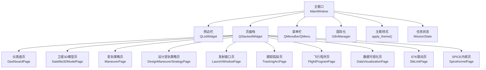
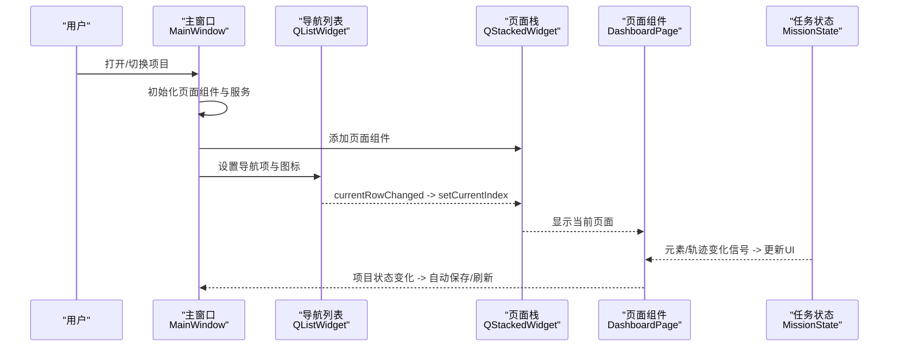
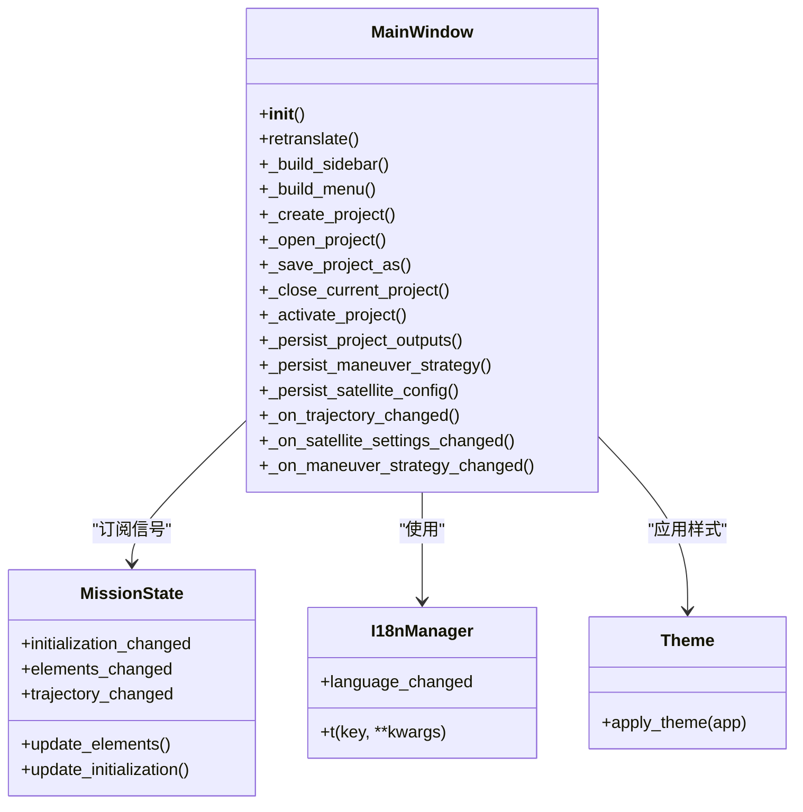
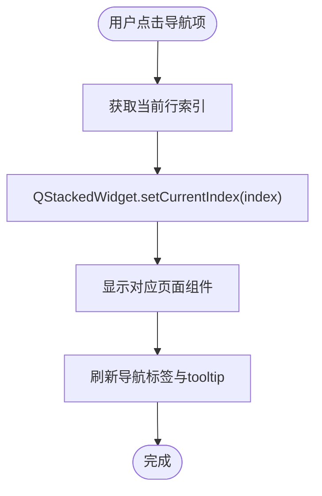
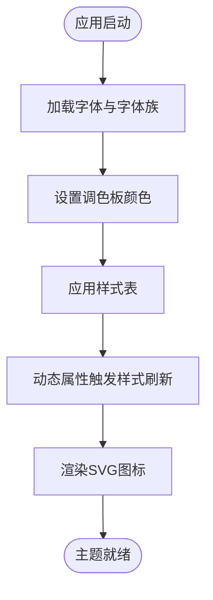
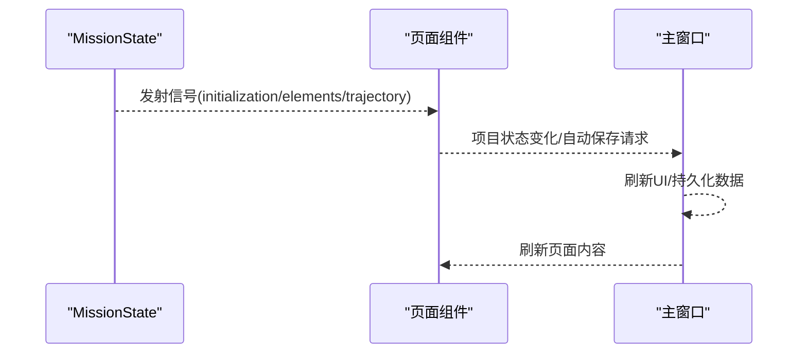
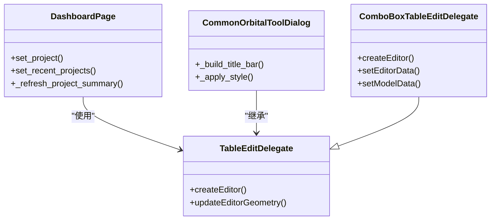
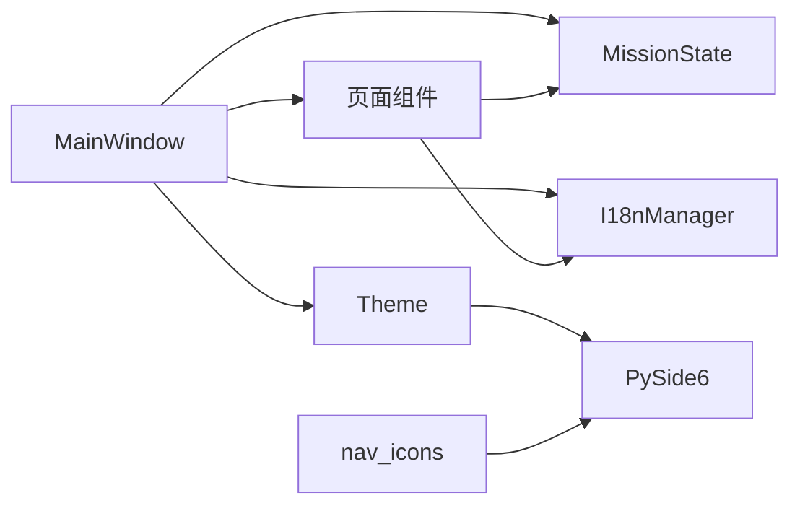

# UI组件架构

<cite>
**本文引用的文件**
- [main_window.py](file://src/smart/ui/main_window.py)
- [theme.py](file://src/smart/ui/theme.py)
- [i18n.py](file://src/smart/ui/i18n.py)
- [mission_state.py](file://src/smart/ui/mission_state.py)
- [nav_icons.py](file://src/smart/ui/nav_icons.py)
- [dashboard_page.py](file://src/smart/ui/widgets/dashboard_page.py)
- [common_orbital_tools.py](file://src/smart/ui/widgets/common_orbital_tools.py)
- [table_editing.py](file://src/smart/ui/widgets/table_editing.py)
</cite>

## 目录
1. [简介](#简介)
2. [项目结构](#项目结构)
3. [核心组件](#核心组件)
4. [架构总览](#架构总览)
5. [详细组件分析](#详细组件分析)
6. [依赖分析](#依赖分析)
7. [性能考量](#性能考量)
8. [故障排查指南](#故障排查指南)
9. [结论](#结论)
10. [附录](#附录)

## 简介
本文件系统化梳理 SMART 项目的桌面 UI 组件架构，涵盖主窗口设计、页面导航、主题与国际化、MVVM 数据流、控件与工具组件体系、响应式布局与跨平台兼容、可重用性与样式定制、国际化支持、无障碍访问建议、与 PySide6 的集成方式及性能优化策略。目标是帮助开发者与设计师高效理解并扩展 UI 层。

## 项目结构
SMART 的 UI 层位于 src/smart/ui 目录，采用“主窗口 + 页面容器 + 页面组件 + 控件与工具”的分层组织：
- 主窗口：负责布局、菜单、侧边栏导航、页面栈与全局状态联动
- 页面容器：QStackedWidget 管理多个页面组件的切换
- 页面组件：如仪表盘、卫星3D模型、变轨策略、发射窗口、数据可视化等
- 控件与工具：通用控件、表格编辑委托、通用轨道工具对话框等
- 主题与国际化：统一的主题样式、字体与调色板，以及多语言文案管理

**图表来源**
- [main_window.py:53-136](file://src/smart/ui/main_window.py#L53-L136)
- [dashboard_page.py:263-293](file://src/smart/ui/widgets/dashboard_page.py#L263-L293)

**章节来源**
- [main_window.py:53-136](file://src/smart/ui/main_window.py#L53-L136)
- [theme.py:473-519](file://src/smart/ui/theme.py#L473-L519)
- [i18n.py:498-517](file://src/smart/ui/i18n.py#L498-L517)
- [mission_state.py:11-45](file://src/smart/ui/mission_state.py#L11-L45)

## 核心组件
- 主窗口 MainWindow：构建侧边栏导航、菜单、页面栈，协调项目生命周期与自动保存，桥接 MissionState 与各页面组件
- 页面容器 QStackedWidget：承载所有页面组件，通过 QListWidget 的索引切换
- 页面组件 DashboardPage：项目概览与状态卡片，展示数据链路就绪度、模块状态与关键指标
- 主题系统 theme.py：统一应用样式、字体与调色板，支持动态属性控制侧边栏折叠态
- 国际化 i18n.py：集中管理多语言文案，提供信号通知语言变更
- 导航图标 nav_icons.py：内嵌 SVG 图标，支持主题色替换与不同尺寸渲染
- 任务状态 MissionState：提供轨道初始化、元素与轨迹的信号，驱动页面联动更新
- 通用工具 common_orbital_tools.py：提供轨道六根数转换、霍曼转移、Lambert 传、两体传播等工具对话框
- 表格编辑 table_editing.py：为表格提供暗色风格的单元格编辑委托与组合框选项

**章节来源**
- [main_window.py:53-136](file://src/smart/ui/main_window.py#L53-L136)
- [dashboard_page.py:263-293](file://src/smart/ui/widgets/dashboard_page.py#L263-L293)
- [theme.py:473-519](file://src/smart/ui/theme.py#L473-L519)
- [i18n.py:498-517](file://src/smart/ui/i18n.py#L498-L517)
- [nav_icons.py:17-138](file://src/smart/ui/nav_icons.py#L17-L138)
- [mission_state.py:11-45](file://src/smart/ui/mission_state.py#L11-L45)
- [common_orbital_tools.py:68-200](file://src/smart/ui/widgets/common_orbital_tools.py#L68-L200)
- [table_editing.py:6-126](file://src/smart/ui/widgets/table_editing.py#L6-L126)

## 架构总览
SMART 的 UI 采用“主窗口 + 页面栈 + MVVM 数据流”的架构：
- 视图层：MainWindow、各页面组件、控件与工具对话框
- 模型层：MissionState 提供轨道初始化、元素与轨迹，I18nManager 提供语言模型
- 视图模型层：页面组件持有业务模型（如 ProjectWorkspace、StkLinkService），并通过信号与主窗口交互
- 导航与布局：侧边栏 QListWidget 与 QStackedWidget 实现页面切换；菜单栏提供项目与工具入口

**图表来源**
- [main_window.py:256-267](file://src/smart/ui/main_window.py#L256-L267)
- [main_window.py:127-136](file://src/smart/ui/main_window.py#L127-L136)
- [dashboard_page.py:263-293](file://src/smart/ui/widgets/dashboard_page.py#L263-L293)
- [mission_state.py:12-44](file://src/smart/ui/mission_state.py#L12-L44)

## 详细组件分析

### 主窗口 MainWindow
- 职责
  - 构建侧边栏导航与菜单栏
  - 管理页面栈与页面组件实例
  - 协调项目生命周期（创建、打开、另存为、关闭）
  - 自动保存轨道元素、变轨策略与卫星3D模型配置
  - 支持侧边栏折叠与动态样式刷新
- 关键特性
  - 导航键与图标映射：通过 nav_icons 提供 Lucide 风格 SVG 图标
  - 国际化：菜单标题、动作文本与提示信息通过 I18nManager 动态翻译
  - 主题：通过 theme.apply_theme 统一字体、调色板与样式表
  - 事件流：MissionState 的 initialization_changed/elements_changed/trajectory_changed 信号驱动页面更新

**图表来源**
- [main_window.py:53-781](file://src/smart/ui/main_window.py#L53-L781)
- [mission_state.py:11-45](file://src/smart/ui/mission_state.py#L11-L45)
- [i18n.py:498-517](file://src/smart/ui/i18n.py#L498-L517)
- [theme.py:473-519](file://src/smart/ui/theme.py#L473-L519)

**章节来源**
- [main_window.py:53-136](file://src/smart/ui/main_window.py#L53-L136)
- [main_window.py:370-532](file://src/smart/ui/main_window.py#L370-L532)
- [main_window.py:601-660](file://src/smart/ui/main_window.py#L601-L660)
- [main_window.py:675-781](file://src/smart/ui/main_window.py#L675-L781)

### 页面导航系统
- 导航键与图标
  - 导航键集合定义在主窗口中，对应 nav_icons 中的 SVG 图标
  - 折叠态与展开态通过动态属性 collapsed 控制，样式表随之刷新
- 切换机制
  - QListWidget 的 currentRowChanged 信号绑定到 QStackedWidget 的 setCurrentIndex
  - 侧边栏折叠时，标签与对齐方式动态调整，tooltip 与图标保持一致

**图表来源**
- [main_window.py:256-267](file://src/smart/ui/main_window.py#L256-L267)
- [main_window.py:346-369](file://src/smart/ui/main_window.py#L346-L369)

**章节来源**
- [main_window.py:39-50](file://src/smart/ui/main_window.py#L39-L50)
- [main_window.py:256-267](file://src/smart/ui/main_window.py#L256-L267)
- [nav_icons.py:17-138](file://src/smart/ui/nav_icons.py#L17-L138)

### 主题定制机制
- 字体与调色板
  - 应用样式风格为 Fusion，加载 Noto Sans SC 字体族，回退至系统字体
  - 通过 QPalette 设置 Window/WindowText/Base/AlternateBase/Text/Button/ButtonText/Highlight 等颜色
- 样式表
  - APP_STYLESHEET 定义了 QWidget/QLabel/QMainWindow/QMenuBar/QMenu/QToolBar/QStatusBar/QFrame/QPushButton/QComboBox/QTableView/QListWidget 等控件的外观
  - 通过 role 属性与动态属性（如 collapsed）实现不同状态下的样式切换
- 字体与图标
  - 内嵌 SVG 图标，支持主题色替换与多尺寸渲染

**图表来源**
- [theme.py:473-519](file://src/smart/ui/theme.py#L473-L519)
- [nav_icons.py:161-206](file://src/smart/ui/nav_icons.py#L161-L206)

**章节来源**
- [theme.py:12-470](file://src/smart/ui/theme.py#L12-L470)
- [theme.py:473-519](file://src/smart/ui/theme.py#L473-L519)
- [nav_icons.py:17-138](file://src/smart/ui/nav_icons.py#L17-L138)

### MVVM 模式在 UI 层的实现
- 视图（View）：MainWindow、各页面组件（如 DashboardPage）、控件与工具对话框
- 视图模型（ViewModel）：页面组件持有业务模型（MissionState、I18nManager、ProjectWorkspace 等），并通过信号与主窗口交互
- 模型（Model）：MissionState 提供轨道初始化、元素与轨迹，I18nManager 提供语言模型
- 数据绑定与命令
  - 信号槽：MissionState 的 initialization_changed/elements_changed/trajectory_changed 与 MainWindow 的回调函数建立绑定
  - 命令处理：菜单与按钮的动作通过触发器连接到主窗口的项目生命周期方法
  - 状态管理：主窗口维护 autosave_enabled、最新卫星配置与变轨策略，避免在刷新过程中误触发保存

**图表来源**
- [mission_state.py:12-44](file://src/smart/ui/mission_state.py#L12-L44)
- [main_window.py:127-136](file://src/smart/ui/main_window.py#L127-L136)
- [main_window.py:601-660](file://src/smart/ui/main_window.py#L601-L660)

**章节来源**
- [mission_state.py:11-45](file://src/smart/ui/mission_state.py#L11-L45)
- [main_window.py:127-136](file://src/smart/ui/main_window.py#L127-L136)
- [main_window.py:601-660](file://src/smart/ui/main_window.py#L601-L660)

### 页面组件与控件组件分类
- 页面组件
  - 仪表盘页：项目概览、关键指标、模块状态卡片与时间线
  - 卫星3D模型页：卫星参数配置与3D模型预览
  - 变轨策略页：导入与编辑变轨策略
  - 设计变轨策略页：脉冲规划与结果存档
  - 发射窗口页：窗口搜索与约束过滤
  - 跟踪弧段页：可见性与测量规划
  - 飞行程序页：任务活动与事件设计
  - 数据可视化页：图表生成与导出
  - STK 联动页：导出与导入
  - SPICE 内核页：内核扫描与加载
- 控件组件
  - 通用工具对话框：轨道六根数/状态矢量转换、霍曼转移、Lambert 传、两体传播等
  - 表格编辑委托：暗色风格的单元格编辑与组合框选项
  - 自绘控件：仪表盘背景网格、指标卡、时间线与折线图

**图表来源**
- [dashboard_page.py:263-800](file://src/smart/ui/widgets/dashboard_page.py#L263-L800)
- [common_orbital_tools.py:68-200](file://src/smart/ui/widgets/common_orbital_tools.py#L68-L200)
- [table_editing.py:6-126](file://src/smart/ui/widgets/table_editing.py#L6-L126)

**章节来源**
- [dashboard_page.py:263-800](file://src/smart/ui/widgets/dashboard_page.py#L263-L800)
- [common_orbital_tools.py:68-200](file://src/smart/ui/widgets/common_orbital_tools.py#L68-L200)
- [table_editing.py:6-126](file://src/smart/ui/widgets/table_editing.py#L6-L126)

### 国际化与无障碍访问
- 国际化
  - I18nManager 提供 t 方法与 language_changed 信号，支持动态切换语言
  - 主窗口与页面组件在构造与 retranslate 中统一更新菜单、动作与页面文本
- 无障碍访问
  - 建议：为按钮与菜单项提供 accessibleName/accessibleDescription；为表格与列表提供可读性更强的文本；确保键盘导航与焦点管理

**章节来源**
- [i18n.py:498-517](file://src/smart/ui/i18n.py#L498-L517)
- [main_window.py:675-711](file://src/smart/ui/main_window.py#L675-L711)
- [dashboard_page.py:290-293](file://src/smart/ui/widgets/dashboard_page.py#L290-L293)

## 依赖分析
- 组件耦合
  - MainWindow 与各页面组件通过信号/槽松耦合，通过 QStackedWidget 管理页面切换
  - 页面组件依赖 MissionState、I18nManager、ProjectWorkspace 等服务
- 外部依赖
  - PySide6：窗口、控件、样式与信号槽
  - 主题与图标：依赖 QtSvg 与 QFontDatabase
- 潜在循环依赖
  - UI 层内部无循环依赖；页面组件之间通过主窗口协调，避免直接耦合

**图表来源**
- [main_window.py:53-136](file://src/smart/ui/main_window.py#L53-L136)
- [mission_state.py:11-45](file://src/smart/ui/mission_state.py#L11-L45)
- [i18n.py:498-517](file://src/smart/ui/i18n.py#L498-L517)
- [theme.py:473-519](file://src/smart/ui/theme.py#L473-L519)
- [nav_icons.py:17-138](file://src/smart/ui/nav_icons.py#L17-L138)

**章节来源**
- [main_window.py:53-136](file://src/smart/ui/main_window.py#L53-L136)
- [mission_state.py:11-45](file://src/smart/ui/mission_state.py#L11-L45)
- [i18n.py:498-517](file://src/smart/ui/i18n.py#L498-L517)
- [theme.py:473-519](file://src/smart/ui/theme.py#L473-L519)
- [nav_icons.py:17-138](file://src/smart/ui/nav_icons.py#L17-L138)

## 性能考量
- 渲染与样式
  - 使用 QStackedWidget 管理页面切换，减少不必要的重建
  - 主题样式通过动态属性与样式表刷新，避免频繁重绘
- 数据更新
  - MissionState 的信号按需触发页面更新，避免全量刷新
  - 自动保存启用标志位防止在刷新过程中重复持久化
- 图标与字体
  - 内嵌 SVG 图标与字体数据库减少外部资源加载
- 表格编辑
  - 自定义委托在编辑器创建时设置样式，避免全局样式污染

**章节来源**
- [main_window.py:601-660](file://src/smart/ui/main_window.py#L601-L660)
- [theme.py:473-519](file://src/smart/ui/theme.py#L473-L519)
- [table_editing.py:6-126](file://src/smart/ui/widgets/table_editing.py#L6-L126)

## 故障排查指南
- 项目打开失败
  - 检查 smart_project.json 是否存在；确认路径权限与磁盘空间
- 自动保存失败
  - 查看状态栏消息；检查项目目录写权限与磁盘空间
- SPICE 内核加载失败
  - 确认内核目录与文件完整性；检查 SpiceyPy 安装状态
- 3D 模型预览异常
  - 确认 trimesh/pycollada 安装；检查模型格式与路径
- 表格编辑异常
  - 确认委托安装与列选项配置；检查编辑器样式与焦点

**章节来源**
- [main_window.py:390-407](file://src/smart/ui/main_window.py#L390-L407)
- [main_window.py:420-438](file://src/smart/ui/main_window.py#L420-L438)
- [main_window.py:622-631](file://src/smart/ui/main_window.py#L622-L631)
- [dashboard_page.py:558-800](file://src/smart/ui/widgets/dashboard_page.py#L558-L800)

## 结论
SMART 的 UI 架构以 MainWindow 为核心，通过 QStackedWidget 与导航系统实现清晰的页面组织；主题与国际化系统保证视觉一致性与可扩展性；MVVM 数据流通过信号与状态对象实现松耦合；控件与工具组件提供可重用的交互与编辑体验。整体设计兼顾可维护性、可扩展性与跨平台兼容性。

## 附录
- 开发规范与最佳实践
  - 统一使用 role 属性与样式表命名，避免硬编码颜色与尺寸
  - 通过信号槽传递状态变化，避免直接耦合页面组件
  - 对话框与工具类尽量继承通用基类，复用标题栏与拖拽行为
  - 表格编辑使用自定义委托，确保暗色主题一致性
- 响应式设计与跨平台兼容
  - 使用布局策略与最小尺寸约束，适配不同分辨率
  - 依赖 Qt Fusion 风格与样式表，减少平台差异
- 无障碍访问建议
  - 为关键控件提供可读性描述；支持键盘导航与屏幕阅读器