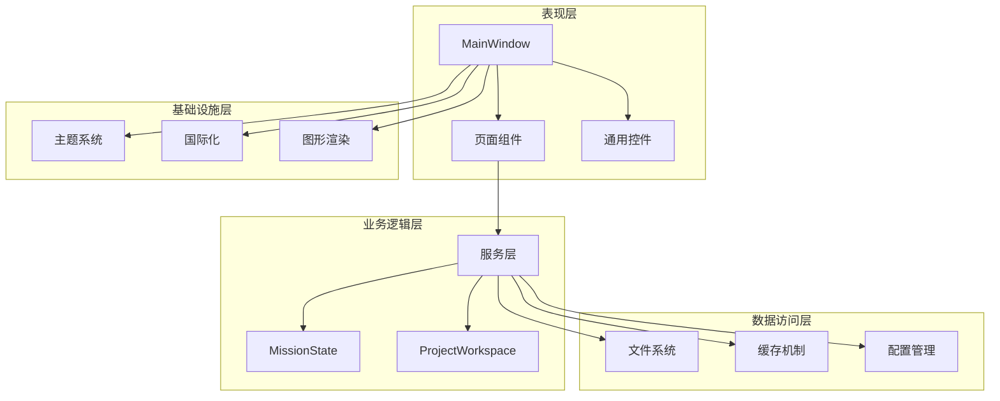
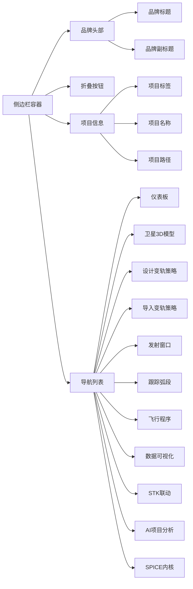
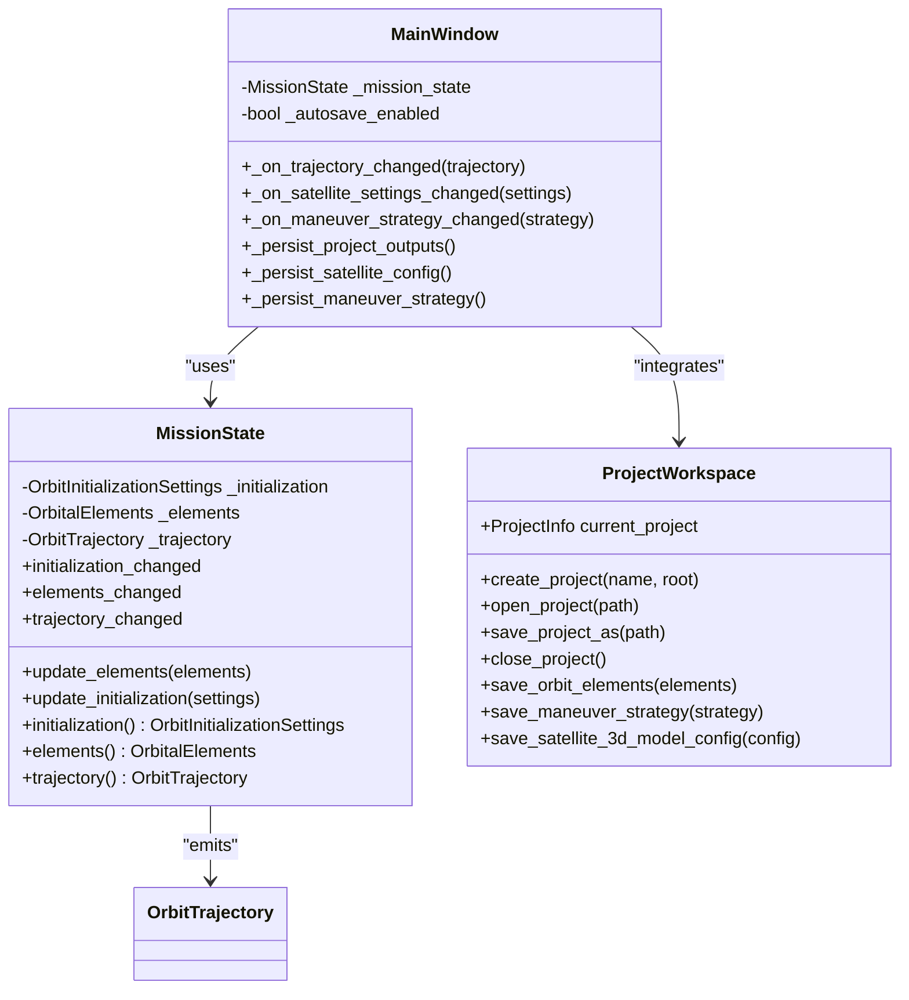
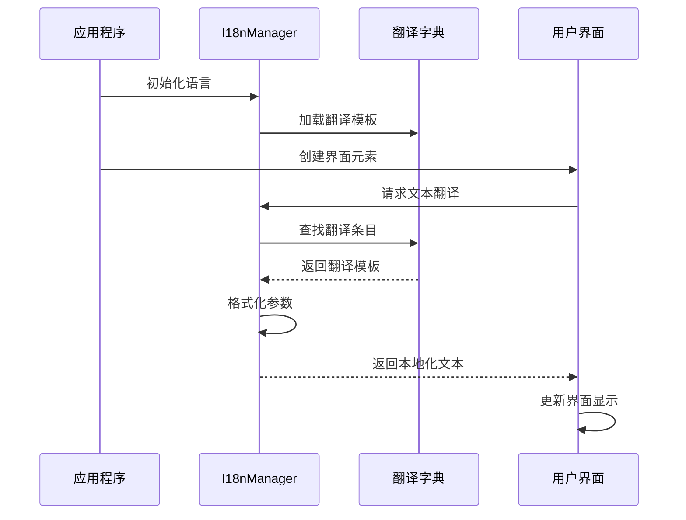
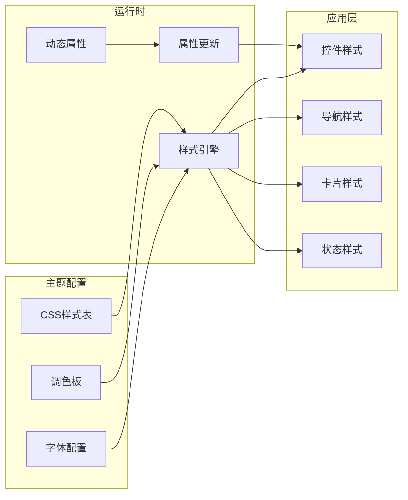
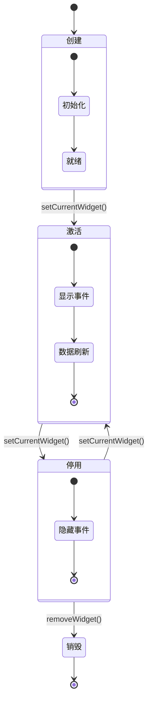
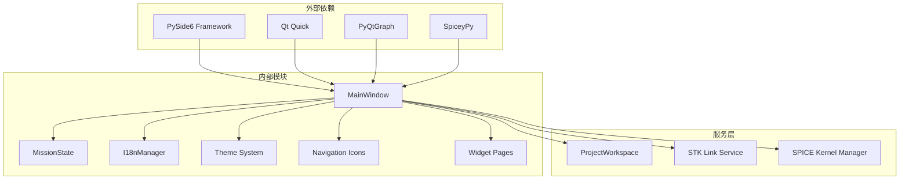

# 主窗口架构

<cite>
**本文档引用的文件**
- [main_window.py](file://src/smart/ui/main_window.py)
- [mission_state.py](file://src/smart/ui/mission_state.py)
- [theme.py](file://src/smart/ui/theme.py)
- [i18n.py](file://src/smart/ui/i18n.py)
- [nav_icons.py](file://src/smart/ui/nav_icons.py)
- [dashboard_page.py](file://src/smart/ui/widgets/dashboard_page.py)
- [app_runtime.py](file://src/smart/app_runtime.py)
- [main.py](file://src/smart/main.py)
</cite>

## 目录
1. [简介](#简介)
2. [项目结构](#项目结构)
3. [核心组件](#核心组件)
4. [架构概览](#架构概览)
5. [详细组件分析](#详细组件分析)
6. [依赖关系分析](#依赖关系分析)
7. [性能考虑](#性能考虑)
8. [故障排除指南](#故障排除指南)
9. [结论](#结论)

## 简介

SMART项目主窗口架构是一个基于PySide6构建的现代化桌面应用程序，专注于航天器任务分析、研究与工具集。该架构采用模块化设计，通过MainWindow类统一管理应用的主界面，实现了项目状态管理、工作区集成和服务层连接的深度整合。

该主窗口采用经典的三栏布局：左侧折叠式导航栏、中央内容区域和顶部菜单系统，配合QStackedWidget实现页面间的无缝切换。系统集成了完整的国际化支持、主题系统和样式定制机制，为用户提供一致且美观的用户体验。

## 项目结构

SMART项目的UI架构采用清晰的分层设计：

```mermaid
graph TB
subgraph "应用入口层"
Main[main.py]
AppRuntime[app_runtime.py]
end
subgraph "界面管理层"
MainWindow[MainWindow]
Theme[Theme System]
I18n[I18n Manager]
NavIcons[Navigation Icons]
end
subgraph "业务页面层"
Dashboard[Dashboard Page]
Satellite[Satellite 3D Model]
Maneuver[Maneuver Strategy]
Launch[Launch Window]
Tracking[Tracking Arc]
Flight[Flight Program]
Visualization[Data Visualization]
STK[STK Link]
AI[AI Analysis]
SPICE[SPICE Kernel]
end
subgraph "服务层"
Workspace[Project Workspace]
MissionState[Mission State]
STKService[STK Link Service]
SpiceManager[SPICE Kernel Manager]
end
Main --> MainWindow
MainWindow --> Theme
MainWindow --> I18n
MainWindow --> NavIcons
MainWindow --> Dashboard
MainWindow --> Satellite
MainWindow --> Maneuver
MainWindow --> Launch
MainWindow --> Tracking
MainWindow --> Flight
MainWindow --> Visualization
MainWindow --> STK
MainWindow --> AI
MainWindow --> SPICE
MainWindow --> Workspace
MainWindow --> MissionState
MainWindow --> STKService
MainWindow --> SpiceManager
```

**图表来源**
- [main.py:10-36](file://src/smart/main.py#L10-L36)
- [main_window.py:53-137](file://src/smart/ui/main_window.py#L53-L137)

**章节来源**
- [main.py:1-36](file://src/smart/main.py#L1-L36)
- [main_window.py:1-781](file://src/smart/ui/main_window.py#L1-L781)

## 核心组件

### MainWindow类设计

MainWindow是整个应用的核心控制器，负责协调各个组件的生命周期和交互。其设计理念体现了以下原则：

**职责分离**：将界面管理、状态控制、服务集成等功能分离到专门的类中，确保单一职责原则。

**事件驱动架构**：通过信号槽机制实现组件间的松耦合通信，支持异步更新和状态同步。

**模块化设计**：每个功能页面都是独立的模块，可以单独开发、测试和维护。

**状态管理模式**：使用MissionState统一管理航天器轨道状态，确保数据一致性。

**章节来源**
- [main_window.py:53-137](file://src/smart/ui/main_window.py#L53-L137)
- [mission_state.py:11-45](file://src/smart/ui/mission_state.py#L11-L45)

### 页面管理系统

系统采用QStackedWidget实现页面切换，支持以下特性：

- **动态页面加载**：根据项目状态动态添加和移除页面
- **内存优化**：页面在非激活状态下保持最小化资源占用
- **状态持久化**：页面状态在切换时自动保存和恢复
- **生命周期管理**：提供页面创建、激活、停用的完整生命周期

**章节来源**
- [main_window.py:74-125](file://src/smart/ui/main_window.py#L74-L125)
- [main_window.py:110-125](file://src/smart/ui/main_window.py#L110-L125)

## 架构概览

SMART主窗口架构采用分层设计模式，确保了良好的可维护性和扩展性：

**图表来源**
- [main_window.py:53-137](file://src/smart/ui/main_window.py#L53-L137)
- [mission_state.py:16-45](file://src/smart/ui/mission_state.py#L16-L45)

### 导航系统架构

侧边栏导航系统采用QListWidget实现，支持折叠/展开模式：

**图表来源**
- [main_window.py:215-277](file://src/smart/ui/main_window.py#L215-L277)
- [nav_icons.py:17-138](file://src/smart/ui/nav_icons.py#L17-L138)

**章节来源**
- [main_window.py:215-277](file://src/smart/ui/main_window.py#L215-L277)
- [nav_icons.py:1-211](file://src/smart/ui/nav_icons.py#L1-L211)

## 详细组件分析

### 项目状态管理系统

MissionState类实现了完整的状态管理机制：

**图表来源**
- [mission_state.py:11-45](file://src/smart/ui/mission_state.py#L11-L45)
- [main_window.py:60-67](file://src/smart/ui/main_window.py#L60-L67)
- [main_window.py:601-660](file://src/smart/ui/main_window.py#L601-L660)

系统的核心特性包括：

**状态变更通知**：通过Qt信号机制通知所有订阅者状态变更
**自动保存机制**：在状态变更时自动保存项目数据
**数据验证**：确保所有输入数据都经过验证和标准化
**轨迹计算**：实时计算和更新轨道轨迹

**章节来源**
- [mission_state.py:11-45](file://src/smart/ui/mission_state.py#L11-L45)
- [main_window.py:601-660](file://src/smart/ui/main_window.py#L601-L660)

### 国际化支持系统

I18nManager提供了完整的多语言支持：

**图表来源**
- [i18n.py:498-517](file://src/smart/ui/i18n.py#L498-L517)

系统支持以下特性：

**动态语言切换**：运行时支持语言切换而无需重启
**参数化翻译**：支持带参数的复杂翻译模板
**键值映射**：通过统一的键值系统管理所有文本
**默认回退**：当翻译缺失时自动回退到默认语言

**章节来源**
- [i18n.py:1-517](file://src/smart/ui/i18n.py#L1-L517)

### 主题系统架构

主题系统采用CSS样式表和Qt样式表的组合：

**图表来源**
- [theme.py:12-519](file://src/smart/ui/theme.py#L12-L519)

**章节来源**
- [theme.py:1-519](file://src/smart/ui/theme.py#L1-L519)

### 页面生命周期管理

系统实现了完整的页面生命周期管理：

**图表来源**
- [main_window.py:110-125](file://src/smart/ui/main_window.py#L110-L125)

**章节来源**
- [main_window.py:110-125](file://src/smart/ui/main_window.py#L110-L125)

## 依赖关系分析

SMART主窗口架构的依赖关系呈现清晰的层次结构：

**图表来源**
- [main_window.py:6-25](file://src/smart/ui/main_window.py#L6-L25)
- [app_runtime.py:7-8](file://src/smart/app_runtime.py#L7-L8)

### 关键依赖关系

**PySide6集成**：深度集成了PySide6框架的所有核心功能
**服务层抽象**：通过接口抽象隐藏具体服务实现细节
**页面解耦**：页面组件之间保持低耦合高内聚
**状态同步**：通过信号槽机制实现组件间状态同步

**章节来源**
- [main_window.py:6-25](file://src/smart/ui/main_window.py#L6-L25)
- [app_runtime.py:31-91](file://src/smart/app_runtime.py#L31-L91)

## 性能考虑

SMART主窗口架构在设计时充分考虑了性能优化：

### 图形渲染优化

系统采用了多种图形渲染优化策略：

**OpenGL上下文共享**：通过`AA_ShareOpenGLContexts`属性实现多个OpenGL上下文间的资源共享
**SwiftShader后备**：在硬件加速不可用时自动降级到软件渲染
**图形API统一**：强制Qt Quick和QWidget使用相同的图形API

### 内存管理策略

**延迟加载**：页面组件采用延迟加载策略，减少启动时的内存占用
**对象池模式**：重复使用的控件对象通过对象池管理
**垃圾回收优化**：合理管理Qt对象的生命周期，避免内存泄漏

### 网络和IO优化

**异步操作**：所有耗时操作都采用异步方式执行
**缓存机制**：实现多层次缓存系统，减少重复计算
**批处理操作**：将多个小操作合并为批处理，提高效率

## 故障排除指南

### 常见问题诊断

**SPICE内核加载失败**
- 检查内核文件完整性
- 验证内核文件格式兼容性
- 确认内核文件路径正确性

**页面切换异常**
- 检查QStackedWidget索引有效性
- 验证页面对象的正确性
- 确认信号槽连接状态

**主题样式失效**
- 检查CSS样式表语法
- 验证Qt样式表兼容性
- 确认动态属性更新机制

### 调试技巧

**状态监控**：使用Qt的调试工具监控信号槽连接状态
**内存分析**：定期检查内存使用情况，识别潜在泄漏
**性能分析**：使用性能分析工具识别性能瓶颈

**章节来源**
- [main_window.py:581-599](file://src/smart/ui/main_window.py#L581-L599)
- [app_runtime.py:10-91](file://src/smart/app_runtime.py#L10-L91)

## 结论

SMART主窗口架构展现了现代桌面应用设计的最佳实践。通过合理的分层设计、模块化组件和完善的架构模式，该系统实现了功能完整性与代码可维护性的平衡。

**主要优势**：
- **架构清晰**：层次分明，职责明确
- **扩展性强**：模块化设计便于功能扩展
- **用户体验佳**：流畅的页面切换和响应式界面
- **性能优异**：多种优化策略确保应用性能

**技术亮点**：
- 深度集成PySide6框架
- 完整的国际化和主题系统
- 健壮的状态管理和数据持久化
- 灵活的页面生命周期管理

该架构为类似的专业应用软件提供了优秀的参考模板，展示了如何在复杂的业务场景中实现优雅的技术架构。