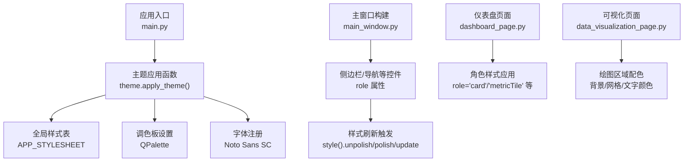
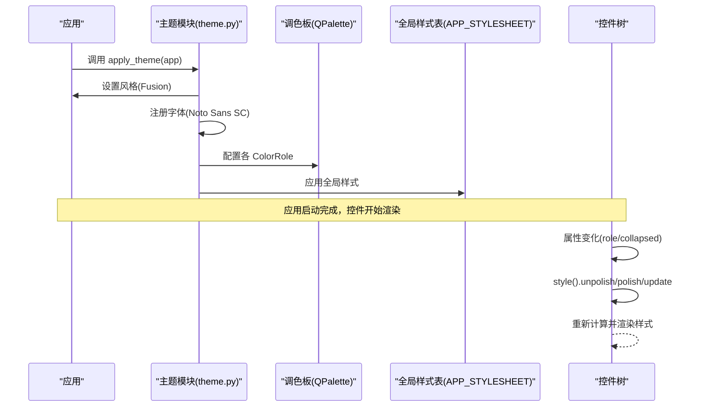
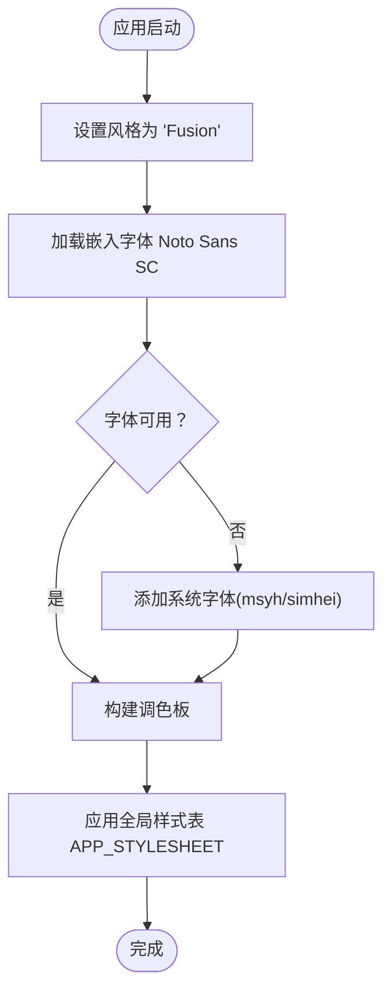
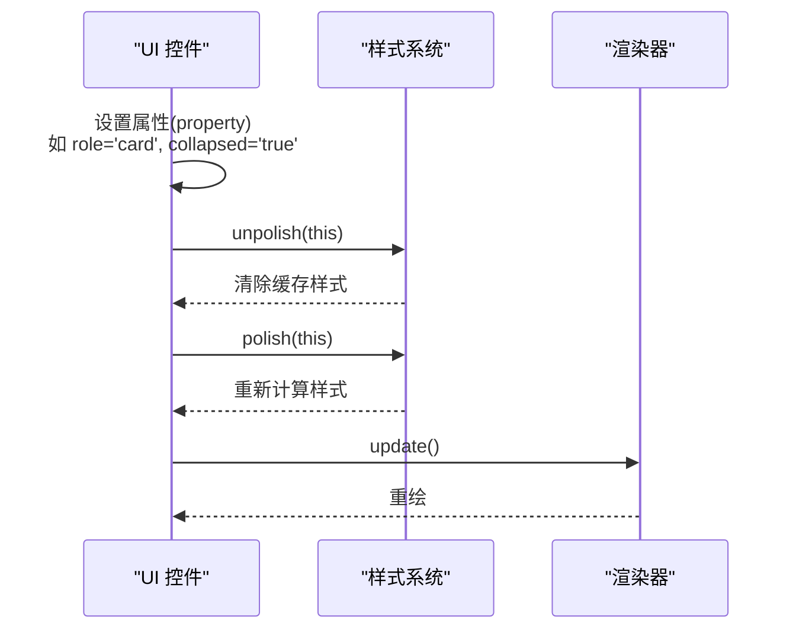
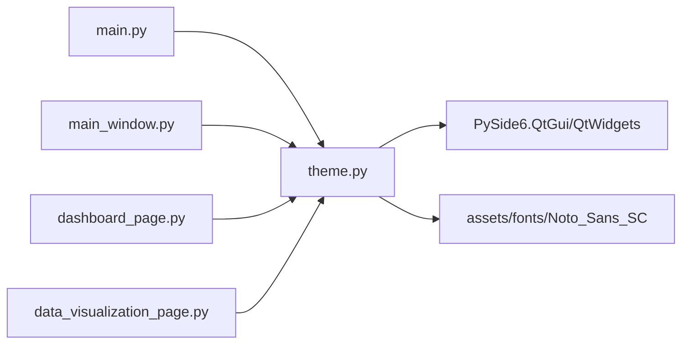

# 主题样式系统

<cite>
**本文档引用的文件**
- [theme.py](file://src/smart/ui/theme.py)
- [main.py](file://src/smart/main.py)
- [app_runtime.py](file://src/smart/app_runtime.py)
- [main_window.py](file://src/smart/ui/main_window.py)
- [dashboard_page.py](file://src/smart/ui/widgets/dashboard_page.py)
- [data_visualization_page.py](file://src/smart/ui/widgets/data_visualization_page.py)
- [README.txt](file://src/smart/assets/fonts/Noto_Sans_SC/README.txt)
</cite>

## 目录
1. [简介](#简介)
2. [项目结构](#项目结构)
3. [核心组件](#核心组件)
4. [架构总览](#架构总览)
5. [详细组件分析](#详细组件分析)
6. [依赖关系分析](#依赖关系分析)
7. [性能考虑](#性能考虑)
8. [故障排除指南](#故障排除指南)
9. [结论](#结论)
10. [附录](#附录)

## 简介
本文件系统性阐述 SMART 项目的主题样式系统，重点覆盖以下方面：
- 样式架构与动态主题切换机制
- 样式属性命名约定、层级结构与优先级规则
- 主题变量定义、颜色系统与字体配置
- 组件中样式的应用方式与继承关系
- 动态样式更新、属性绑定与实时预览
- 可维护性设计、模块化组织与性能优化
- 主题定制指南与样式开发最佳实践

## 项目结构
SMART 的样式系统围绕 PySide6 的 Qt 样式表（QSS）与 Palette 进行集中管理，并通过应用启动流程统一注入到全局界面。

图表来源
- [main.py:10-31](file://src/smart/main.py#L10-L31)
- [theme.py:473-519](file://src/smart/ui/theme.py#L473-L519)
- [main_window.py:215-339](file://src/smart/ui/main_window.py#L215-L339)
- [dashboard_page.py:155-182](file://src/smart/ui/widgets/dashboard_page.py#L155-L182)
- [data_visualization_page.py:28-31](file://src/smart/ui/widgets/data_visualization_page.py#L28-L31)

章节来源
- [main.py:10-31](file://src/smart/main.py#L10-L31)
- [theme.py:12-519](file://src/smart/ui/theme.py#L12-L519)
- [main_window.py:215-339](file://src/smart/ui/main_window.py#L215-L339)
- [dashboard_page.py:155-182](file://src/smart/ui/widgets/dashboard_page.py#L155-L182)
- [data_visualization_page.py:28-31](file://src/smart/ui/widgets/data_visualization_page.py#L28-L31)

## 核心组件
- 主题应用函数：负责设置 Qt 风格、字体族、调色板与全局样式表。
- 全局样式表：以 QSS 字符串形式集中定义各类控件与伪状态的外观。
- 调色板：为禁用、高亮、工具提示等状态提供颜色基线。
- 控件角色系统：通过属性 role 与 collapsed 等动态属性实现分组样式与状态切换。
- 字体系统：优先加载嵌入字体，回退至系统字体，确保跨平台一致性。

章节来源
- [theme.py:473-519](file://src/smart/ui/theme.py#L473-L519)
- [theme.py:12-470](file://src/smart/ui/theme.py#L12-L470)
- [main_window.py:315-339](file://src/smart/ui/main_window.py#L315-L339)

## 架构总览
SMART 的样式系统采用“集中式主题 + 角色驱动”的架构：
- 集中式主题：在应用启动时一次性注入全局样式与调色板，保证一致的视觉基线。
- 角色驱动：通过控件的 role 属性与动态属性（如 collapsed），在不修改代码的情况下切换样式状态。
- 动态刷新：当动态属性变化时，调用 style().unpolish/polish/update 强制重新计算样式，实现“实时预览”。

图表来源
- [main.py:25](file://src/smart/main.py#L25)
- [theme.py:473-519](file://src/smart/ui/theme.py#L473-L519)
- [main_window.py:334-339](file://src/smart/ui/main_window.py#L334-L339)

## 详细组件分析

### 主题应用与全局样式
- 风格与字体：强制使用 Fusion 风格；优先加载嵌入字体 Noto Sans SC，若不可用则回退到系统字体。
- 调色板：为 Window、WindowText、Base、AlternateBase、Text、Button、ButtonText、Highlight、HighlightedText、ToolTipBase、ToolTipText 等角色设置颜色，并对禁用态进行降级处理。
- 全局样式表：覆盖 QWidget、QLabel、QMainWindow、QMenuBar、QMenu、QToolBar、QStatusBar、QFrame、QPushButton、QComboBox、QTableView/QTableWidget、QScrollBar、QListWidget 等控件及其伪状态与子控件。

图表来源
- [theme.py:473-519](file://src/smart/ui/theme.py#L473-L519)
- [theme.py:8-10](file://src/smart/ui/theme.py#L8-L10)
- [theme.py:475-499](file://src/smart/ui/theme.py#L475-L499)

章节来源
- [theme.py:473-519](file://src/smart/ui/theme.py#L473-L519)
- [theme.py:12-470](file://src/smart/ui/theme.py#L12-L470)

### 角色系统与动态属性
- 角色系统：通过控件的 property("role") 将控件归类为“卡片”、“指标卡”、“侧边栏”、“场景工具栏”等语义化角色，样式表按 role 选择器匹配。
- 动态属性：如 sidebar 的 collapsed 属性用于在折叠/展开两种布局间切换，样式表中通过 [collapsed="true"] 选择器区分不同状态下的外观。
- 实时预览：当动态属性变化时，调用 style().unpolish(widget) → style().polish(widget) → widget.update() 强制重算样式，实现即时更新。

图表来源
- [main_window.py:315-339](file://src/smart/ui/main_window.py#L315-L339)
- [theme.py:114-118](file://src/smart/ui/theme.py#L114-L118)

章节来源
- [main_window.py:315-339](file://src/smart/ui/main_window.py#L315-L339)
- [theme.py:95-118](file://src/smart/ui/theme.py#L95-L118)

### 样式属性命名约定、层级与优先级
- 命名约定
  - 角色选择器：QFrame[role="card"]、QLabel[role="metricValue"] 等，语义明确、便于复用。
  - 状态选择器：QListWidget[role="nav"]::item:hover、QPushButton:pressed、QFrame[role="sceneToolbar"] QPushButton:checked 等，清晰表达交互状态。
  - 动态属性选择器：QListWidget[role="nav"][collapsed="true"]::item，用于响应 UI 状态变化。
- 层级结构
  - 全局层：APP_STYLESHEET 定义基础控件与通用状态。
  - 角色层：按控件角色划分的样式块，覆盖具体控件的细节。
  - 状态层：伪状态与交互状态修饰，叠加于角色层之上。
- 优先级规则
  - Qt 样式解析遵循“特异性 + 源顺序”，在本项目中表现为：
    - 具体选择器（含属性与伪状态）优先于通用选择器；
    - 后声明的样式覆盖先前声明的同优先级样式；
    - 通过 style().unpolish/polish/update 强制刷新后，当前状态的样式优先级最高。

章节来源
- [theme.py:12-470](file://src/smart/ui/theme.py#L12-L470)
- [main_window.py:334-339](file://src/smart/ui/main_window.py#L334-L339)

### 颜色系统与字体配置
- 颜色系统
  - 基础色板：深蓝/青绿系为主，强调对比度与可读性，适用于背景、文本、边框与高亮。
  - 状态色：为不同状态标签提供语义化颜色，如“运行中/计划中/加载中/断开连接”等。
  - 图表配色：可视化页面使用固定色板与透明度组合，确保多曲线叠加时的区分度。
- 字体配置
  - 嵌入字体：Noto Sans SC 变量字体，支持权重连续变化，减少静态字体数量。
  - 回退策略：若嵌入字体不可用，则尝试系统字体 msyh（微软雅黑）、simhei（黑体）。
  - 字号与行高：全局字号与行高在 APP_STYLESHEET 中统一设定，部分控件按角色微调。

章节来源
- [theme.py:12-18](file://src/smart/ui/theme.py#L12-L18)
- [theme.py:503-517](file://src/smart/ui/theme.py#L503-L517)
- [data_visualization_page.py:28-31](file://src/smart/ui/widgets/data_visualization_page.py#L28-L31)
- [README.txt:1-45](file://src/smart/assets/fonts/Noto_Sans_SC/README.txt#L1-L45)

### 组件中的样式应用与继承
- 仪表盘页面：通过设置控件的 role 属性（如 "card"、"metricTile"、"dashboardHero"、"glassPanel"）自动应用对应样式块。
- 列表与导航：QListWidget[role="nav"] 及其项在 hover/selected/collapsed 状态下分别应用不同的渐变与圆角，体现层次与交互反馈。
- 表格与滚动条：QTableView/QTableWidget 与 QScrollBar 的样式在 APP_STYLESHEET 中统一定义，确保跨平台一致性。
- 自绘控件：部分控件通过 paintEvent 手绘背景与网格，颜色与全局主题保持一致，避免硬编码。

章节来源
- [dashboard_page.py:155-182](file://src/smart/ui/widgets/dashboard_page.py#L155-L182)
- [dashboard_page.py:227-261](file://src/smart/ui/widgets/dashboard_page.py#L227-L261)
- [theme.py:95-118](file://src/smart/ui/theme.py#L95-L118)
- [theme.py:358-427](file://src/smart/ui/theme.py#L358-L427)
- [theme.py:432-448](file://src/smart/ui/theme.py#L432-L448)

### 动态样式更新、属性绑定与实时预览
- 属性绑定：通过 setProperty("role", "...") 与 setProperty("collapsed", "true/false") 将 UI 状态映射到样式选择器。
- 更新流程：在属性变更后，调用 style().unpolish/polish/update，使当前控件立即应用新样式，无需重启应用。
- 实时预览：侧边栏折叠/展开、按钮按下/悬停、表格选中等交互均能即时反映到样式上，提升用户体验。

章节来源
- [main_window.py:334-339](file://src/smart/ui/main_window.py#L334-L339)
- [dashboard_page.py:256-261](file://src/smart/ui/widgets/dashboard_page.py#L256-L261)

## 依赖关系分析
- 主题模块依赖 PySide6 的 QtGui 与 QtWidgets，用于字体数据库、调色板与样式表。
- 应用入口依赖主题模块，在创建主窗口前完成主题初始化。
- 主窗口与各页面组件通过属性与样式刷新实现解耦，降低耦合度。
- 字体资源位于 assets/fonts/Noto_Sans_SC，通过相对路径加载，便于打包与部署。

图表来源
- [main.py:16](file://src/smart/main.py#L16)
- [theme.py:5-10](file://src/smart/ui/theme.py#L5-L10)
- [main_window.py:15](file://src/smart/ui/main_window.py#L15)
- [dashboard_page.py:10](file://src/smart/ui/widgets/dashboard_page.py#L10)
- [data_visualization_page.py:8](file://src/smart/ui/widgets/data_visualization_page.py#L8)

章节来源
- [main.py:16](file://src/smart/main.py#L16)
- [theme.py:5-10](file://src/smart/ui/theme.py#L5-L10)
- [main_window.py:15](file://src/smart/ui/main_window.py#L15)
- [dashboard_page.py:10](file://src/smart/ui/widgets/dashboard_page.py#L10)
- [data_visualization_page.py:8](file://src/smart/ui/widgets/data_visualization_page.py#L8)

## 性能考虑
- 字体加载：仅在主题初始化阶段加载一次字体，避免重复注册带来的开销。
- 样式缓存：Qt 的样式系统内置缓存，频繁 unpolish/polish 会带来一定成本，建议在批量更新时合并操作或节流。
- 自绘优化：自绘控件尽量减少每帧绘制复杂度，使用合适的抗锯齿与最小必要绘制区域。
- 调色板与样式表：集中定义避免重复样式规则，减少解析与匹配成本。

## 故障排除指南
- 字体未生效
  - 检查嵌入字体路径是否存在；若不存在，确认系统字体是否可用。
  - 参考：[theme.py:476-499](file://src/smart/ui/theme.py#L476-L499)
- 样式未随属性变化更新
  - 确认在属性变更后调用了 style().unpolish/polish/update。
  - 参考：[main_window.py:334-339](file://src/smart/ui/main_window.py#L334-L339)
- 高亮/禁用态颜色异常
  - 检查调色板中对应 ColorRole 的配置，特别是 Disabled 分组的颜色。
  - 参考：[theme.py:515-517](file://src/smart/ui/theme.py#L515-L517)
- 表格/滚动条样式不一致
  - 确认 APP_STYLESHEET 中相关选择器未被其他规则覆盖。
  - 参考：[theme.py:358-448](file://src/smart/ui/theme.py#L358-L448)

章节来源
- [theme.py:476-499](file://src/smart/ui/theme.py#L476-L499)
- [main_window.py:334-339](file://src/smart/ui/main_window.py#L334-L339)
- [theme.py:515-517](file://src/smart/ui/theme.py#L515-L517)
- [theme.py:358-448](file://src/smart/ui/theme.py#L358-L448)

## 结论
SMART 的主题样式系统以“集中式主题 + 角色驱动 + 动态属性”为核心，实现了高内聚、低耦合且易于扩展的样式架构。通过严格的命名约定、层级结构与优先级规则，以及完善的动态更新机制，既保证了视觉一致性，又提供了良好的可维护性与性能表现。建议在后续迭代中持续完善角色体系与状态覆盖，进一步增强主题的可定制能力。

## 附录

### 主题定制指南
- 新增角色样式
  - 在 APP_STYLESHEET 中添加对应选择器与规则；
  - 在组件中设置 property("role", "yourRole")；
  - 必要时在动态属性分支中补充状态选择器。
- 修改颜色基线
  - 调整 QPalette 中各 ColorRole 的颜色值；
  - 同步更新相关控件的文本/边框/高亮颜色。
- 字体替换
  - 替换嵌入字体文件与注册路径；
  - 确保回退字体可用，避免跨平台差异。
- 动态属性扩展
  - 为控件新增 property("state", "...")；
  - 在样式表中添加 [state="..."] 选择器；
  - 在逻辑处触发 unpolish/polish/update。

### 样式开发最佳实践
- 使用角色系统统一管理控件外观，避免散落的硬编码样式。
- 优先使用伪状态与动态属性表达交互与状态，减少条件分支。
- 控件自绘时遵循全局配色，保持一致性。
- 对高频更新的样式进行节流或批处理，避免过度重绘。