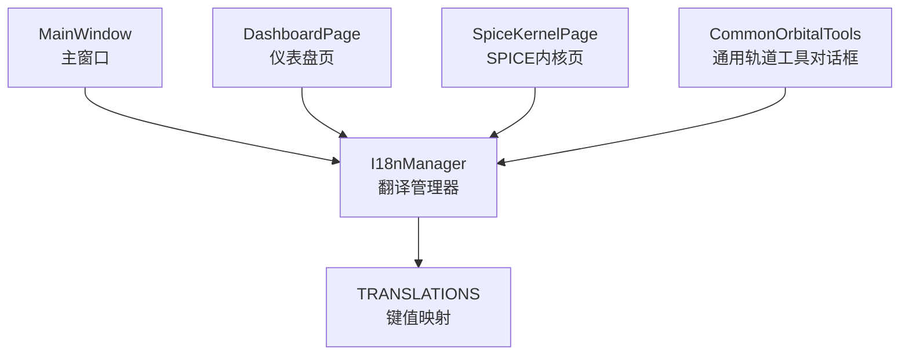
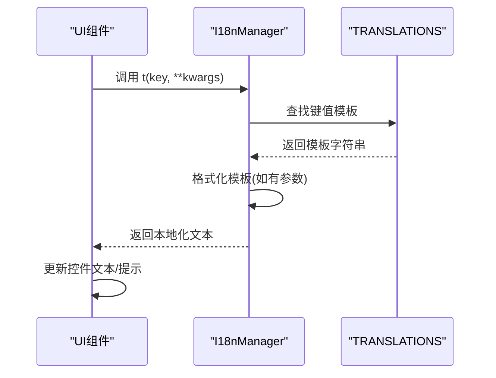
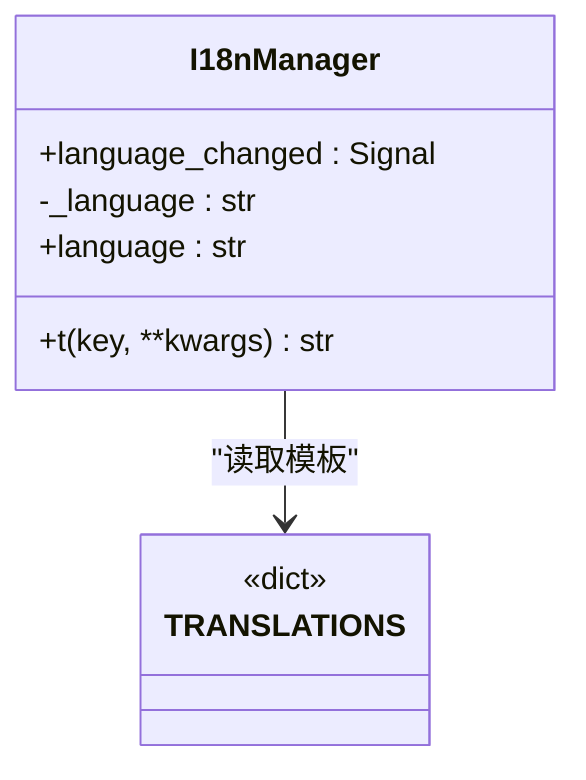
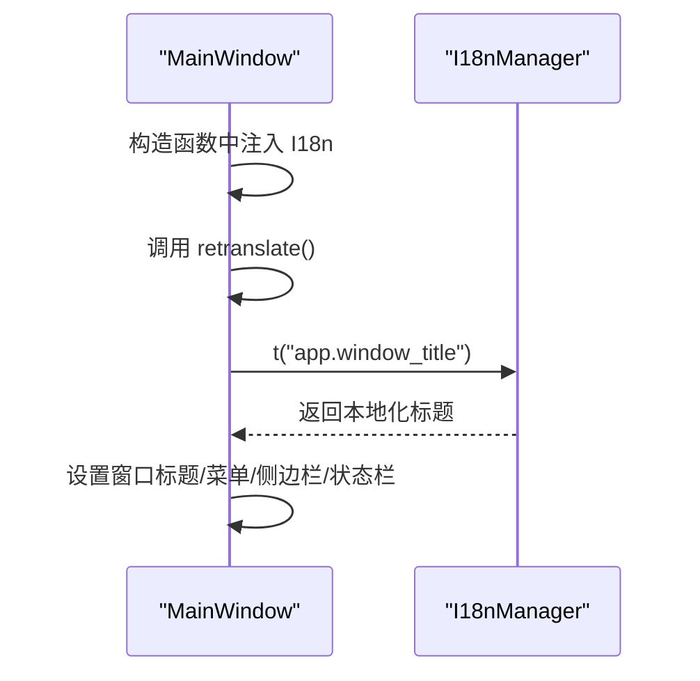
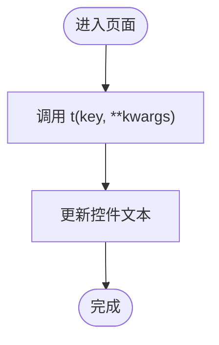
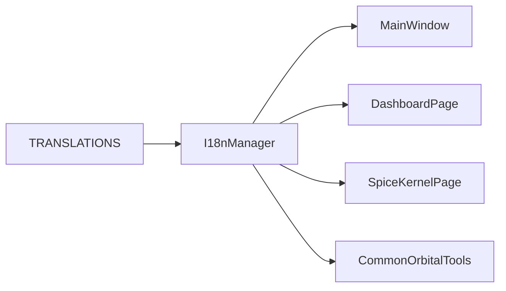

# 国际化系统

<cite>
**本文引用的文件**
- [src/smart/ui/i18n.py](file://src/smart/ui/i18n.py)
- [src/smart/ui/main_window.py](file://src/smart/ui/main_window.py)
- [src/smart/ui/widgets/dashboard_page.py](file://src/smart/ui/widgets/dashboard_page.py)
- [src/smart/ui/widgets/spice_kernel_page.py](file://src/smart/ui/widgets/spice_kernel_page.py)
- [src/smart/ui/widgets/common_orbital_tools.py](file://src/smart/ui/widgets/common_orbital_tools.py)
</cite>

## 目录
1. [简介](#简介)
2. [项目结构](#项目结构)
3. [核心组件](#核心组件)
4. [架构总览](#架构总览)
5. [详细组件分析](#详细组件分析)
6. [依赖分析](#依赖分析)
7. [性能考虑](#性能考虑)
8. [故障排查指南](#故障排查指南)
9. [结论](#结论)
10. [附录](#附录)

## 简介
本文件系统化梳理 SMART 项目的国际化（i18n）体系，覆盖翻译键值组织、命名规范、上下文管理、动态文本替换与参数化翻译、复数形式处理现状、语言切换机制、状态保持与界面刷新、翻译文件加载与缓存策略、错误处理、开发流程与质量保障，以及本地化测试与最佳实践。

## 项目结构
- 国际化核心位于 UI 层，通过单一模块集中管理翻译键值与翻译函数。
- 主窗口与各页面组件在构建 UI 时调用统一的翻译函数，实现标题、菜单、按钮、提示等文本的本地化。
- 翻译键值采用层级命名空间，便于模块化组织与检索。

**图表来源**
- [src/smart/ui/i18n.py:5-496](file://src/smart/ui/i18n.py#L5-L496)
- [src/smart/ui/main_window.py:53-136](file://src/smart/ui/main_window.py#L53-L136)
- [src/smart/ui/widgets/dashboard_page.py:1-200](file://src/smart/ui/widgets/dashboard_page.py#L1-L200)
- [src/smart/ui/widgets/spice_kernel_page.py:529-553](file://src/smart/ui/widgets/spice_kernel_page.py#L529-L553)
- [src/smart/ui/widgets/common_orbital_tools.py:70-120](file://src/smart/ui/widgets/common_orbital_tools.py#L70-L120)

**章节来源**
- [src/smart/ui/i18n.py:5-496](file://src/smart/ui/i18n.py#L5-L496)
- [src/smart/ui/main_window.py:53-136](file://src/smart/ui/main_window.py#L53-L136)

## 核心组件
- 翻译键值字典：集中存放各语言的键值对，当前包含中文键值。
- I18nManager：提供翻译函数与信号，负责根据键值获取模板并进行参数化替换。
- 主窗口与页面：在初始化与交互过程中调用翻译函数，实现界面文本本地化。

**章节来源**
- [src/smart/ui/i18n.py:5-496](file://src/smart/ui/i18n.py#L5-L496)
- [src/smart/ui/i18n.py:498-516](file://src/smart/ui/i18n.py#L498-L516)
- [src/smart/ui/main_window.py:53-136](file://src/smart/ui/main_window.py#L53-L136)

## 架构总览
- 键值组织：采用点分层级命名，如“模块.子模块.字段”，便于模块划分与上下文隔离。
- 动态替换：通过字符串格式化实现参数化翻译，支持占位符替换。
- 界面刷新：主窗口提供 retranslate 方法，统一刷新菜单、侧边栏、状态栏等文本。
- 语言切换：I18nManager 提供语言变更信号，但当前实现固定返回中文语言标识，语言切换逻辑需在后续版本完善。

**图表来源**
- [src/smart/ui/i18n.py:509-516](file://src/smart/ui/i18n.py#L509-L516)

**章节来源**
- [src/smart/ui/i18n.py:509-516](file://src/smart/ui/i18n.py#L509-L516)
- [src/smart/ui/main_window.py:675-711](file://src/smart/ui/main_window.py#L675-L711)

## 详细组件分析

### I18nManager 类与翻译键值
- 角色定位：提供统一的翻译入口与语言变更信号。
- 翻译流程：根据键值从字典取模板，若提供参数则进行格式化替换；若格式化异常则回退为模板原文。
- 语言属性：当前固定返回中文标识，语言切换需扩展实现。

**图表来源**
- [src/smart/ui/i18n.py:498-516](file://src/smart/ui/i18n.py#L498-L516)
- [src/smart/ui/i18n.py:5-496](file://src/smart/ui/i18n.py#L5-L496)

**章节来源**
- [src/smart/ui/i18n.py:498-516](file://src/smart/ui/i18n.py#L498-L516)

### 主窗口的本地化集成
- 初始化：构造主窗口时注入 I18nManager 实例，随后调用 retranslate 刷新界面文本。
- 交互刷新：项目操作、侧边栏折叠/展开、状态栏消息等均通过 t 函数获取本地化文本。
- 菜单与导航：菜单标题、动作文本、导航项标签均通过 t 获取本地化内容。

**图表来源**
- [src/smart/ui/main_window.py:53-136](file://src/smart/ui/main_window.py#L53-L136)
- [src/smart/ui/main_window.py:675-711](file://src/smart/ui/main_window.py#L675-L711)

**章节来源**
- [src/smart/ui/main_window.py:53-136](file://src/smart/ui/main_window.py#L53-L136)
- [src/smart/ui/main_window.py:675-711](file://src/smart/ui/main_window.py#L675-L711)

### 页面与对话框的本地化
- 仪表盘页：在多个 UI 元素上设置本地化文本，包括按钮、标签与列表项。
- SPICE 内核页：表格表头、按钮与状态文本均通过 retranslate 统一刷新。
- 通用轨道工具对话框：标题栏、按钮与提示文本通过 t 获取本地化内容。

**图表来源**
- [src/smart/ui/widgets/dashboard_page.py:970-983](file://src/smart/ui/widgets/dashboard_page.py#L970-L983)
- [src/smart/ui/widgets/spice_kernel_page.py:529-553](file://src/smart/ui/widgets/spice_kernel_page.py#L529-L553)
- [src/smart/ui/widgets/common_orbital_tools.py:70-120](file://src/smart/ui/widgets/common_orbital_tools.py#L70-L120)

**章节来源**
- [src/smart/ui/widgets/dashboard_page.py:970-983](file://src/smart/ui/widgets/dashboard_page.py#L970-L983)
- [src/smart/ui/widgets/spice_kernel_page.py:529-553](file://src/smart/ui/widgets/spice_kernel_page.py#L529-L553)
- [src/smart/ui/widgets/common_orbital_tools.py:70-120](file://src/smart/ui/widgets/common_orbital_tools.py#L70-L120)

### 翻译键值组织与命名规范
- 组织方式：按模块/页面/字段层级命名，例如“模块.子模块.字段”。
- 上下文管理：通过层级命名区分不同页面与功能域，避免键值冲突。
- 命名建议：采用小写字母与点分隔，避免特殊字符；同一语义在不同页面使用相同键值以确保一致性。

**章节来源**
- [src/smart/ui/i18n.py:5-496](file://src/smart/ui/i18n.py#L5-L496)

### 动态文本替换与参数化翻译
- 替换机制：通过字符串格式化实现参数化替换，支持任意关键字参数。
- 异常处理：当格式化参数不匹配时回退为模板原文，避免崩溃。
- 使用示例：项目状态消息、统计摘要、表格列标题等广泛使用参数化翻译。

**章节来源**
- [src/smart/ui/i18n.py:509-516](file://src/smart/ui/i18n.py#L509-L516)
- [src/smart/ui/main_window.py:370-407](file://src/smart/ui/main_window.py#L370-L407)
- [src/smart/ui/main_window.py:440-461](file://src/smart/ui/main_window.py#L440-L461)

### 复数形式处理
- 现状：当前翻译键值未体现复数形式差异，复数逻辑通常通过参数化与上下文控制实现。
- 建议：对于需要复数变化的语句，可在键值中预留占位符并通过参数传入计数，由调用方决定复数形式。

**章节来源**
- [src/smart/ui/i18n.py:509-516](file://src/smart/ui/i18n.py#L509-L516)

### 语言切换机制、状态保持与界面刷新
- 切换机制：I18nManager 提供语言变更信号，但当前语言属性固定返回中文标识。
- 状态保持：主窗口通过 Settings 存储侧边栏折叠状态等用户偏好。
- 界面刷新：主窗口提供 retranslate 方法，统一刷新菜单、导航、侧边栏与状态栏文本；页面也提供 retranslate 方法刷新自身文本。

**章节来源**
- [src/smart/ui/i18n.py:499-507](file://src/smart/ui/i18n.py#L499-L507)
- [src/smart/ui/main_window.py:675-711](file://src/smart/ui/main_window.py#L675-L711)
- [src/smart/ui/widgets/spice_kernel_page.py:529-553](file://src/smart/ui/widgets/spice_kernel_page.py#L529-L553)

### 翻译文件加载、缓存策略与错误处理
- 加载方式：翻译键值直接嵌入源码字典，启动即加载，无需额外文件。
- 缓存策略：当前未实现外部文件缓存，键值驻留内存。
- 错误处理：格式化异常时回退为模板原文；UI 层通过 QMessageBox 展示错误信息，避免界面崩溃。

**章节来源**
- [src/smart/ui/i18n.py:509-516](file://src/smart/ui/i18n.py#L509-L516)
- [src/smart/ui/main_window.py:388-404](file://src/smart/ui/main_window.py#L388-L404)
- [src/smart/ui/main_window.py:420-435](file://src/smart/ui/main_window.py#L420-L435)

## 依赖分析
- I18nManager 依赖 TRANSLATIONS 字典。
- 主窗口与各页面依赖 I18nManager 的 t 方法与 retranslate。
- UI 控件依赖翻译后的文本进行渲染。

**图表来源**
- [src/smart/ui/i18n.py:5-496](file://src/smart/ui/i18n.py#L5-L496)
- [src/smart/ui/i18n.py:498-516](file://src/smart/ui/i18n.py#L498-L516)
- [src/smart/ui/main_window.py:53-136](file://src/smart/ui/main_window.py#L53-L136)
- [src/smart/ui/widgets/dashboard_page.py:1-200](file://src/smart/ui/widgets/dashboard_page.py#L1-L200)
- [src/smart/ui/widgets/spice_kernel_page.py:529-553](file://src/smart/ui/widgets/spice_kernel_page.py#L529-L553)
- [src/smart/ui/widgets/common_orbital_tools.py:70-120](file://src/smart/ui/widgets/common_orbital_tools.py#L70-L120)

**章节来源**
- [src/smart/ui/i18n.py:5-496](file://src/smart/ui/i18n.py#L5-L496)
- [src/smart/ui/i18n.py:498-516](file://src/smart/ui/i18n.py#L498-L516)
- [src/smart/ui/main_window.py:53-136](file://src/smart/ui/main_window.py#L53-L136)

## 性能考虑
- 内存占用：翻译键值驻留内存，键值规模较大时需关注内存开销。
- 渲染效率：retranslate 会遍历大量控件，建议在批量刷新时减少不必要的重复调用。
- 格式化成本：参数化翻译涉及字符串格式化，应避免在高频路径中频繁调用复杂格式化。

## 故障排查指南
- 翻译缺失：当键值不存在时，返回键值本身。可通过日志或调试确认缺失键值。
- 参数格式化错误：当格式化参数不匹配时，返回模板原文。检查调用处参数与模板占位符是否一致。
- UI 未刷新：确认调用了 retranslate 或对应页面的 retranslate 方法。
- 错误对话框：项目操作失败时通过 QMessageBox 展示错误信息，检查错误标题与正文是否正确。

**章节来源**
- [src/smart/ui/i18n.py:509-516](file://src/smart/ui/i18n.py#L509-L516)
- [src/smart/ui/main_window.py:388-404](file://src/smart/ui/main_window.py#L388-L404)
- [src/smart/ui/main_window.py:420-435](file://src/smart/ui/main_window.py#L420-L435)

## 结论
SMART 的国际化系统以简洁的键值字典与统一的翻译函数为核心，实现了界面文本的本地化与参数化替换。当前语言切换逻辑尚未实现，建议在后续版本中扩展 I18nManager 的语言切换能力，并引入外部翻译文件与缓存机制，以支持多语言部署与更好的维护性。

## 附录

### 国际化开发流程
- 新增键值：在翻译字典中添加新键值，遵循层级命名规范。
- 使用翻译：在 UI 构造与交互中调用 t 函数，并传入必要参数。
- 刷新界面：在语言切换或初始化时调用 retranslate 刷新文本。
- 质量保证：编写单元测试验证键值存在性与参数化替换正确性。

### 翻译维护与质量保证
- 键值审计：定期清理未使用键值，合并重复键值。
- 文本一致性：同一语义在不同页面使用相同键值。
- 参数校验：确保模板占位符与调用参数一一对应。

### 多语言开发最佳实践
- 键值命名：采用清晰的层级命名，避免歧义。
- 参数化：优先使用参数化翻译，便于复用与本地化。
- 错误处理：对格式化异常进行捕获与回退，保证 UI 稳定性。
- 界面刷新：集中管理 retranslate，避免分散刷新导致的性能问题。