# 页面导航系统

<cite>
**本文档引用的文件**
- [main_window.py](file://src/smart/ui/main_window.py)
- [nav_icons.py](file://src/smart/ui/nav_icons.py)
- [i18n.py](file://src/smart/ui/i18n.py)
- [mission_state.py](file://src/smart/ui/mission_state.py)
- [test_sidebar_navigation.py](file://tests/test_sidebar_navigation.py)
- [README.md](file://README.md)
</cite>

## 目录
1. [简介](#简介)
2. [项目结构](#项目结构)
3. [核心组件](#核心组件)
4. [架构概览](#架构概览)
5. [详细组件分析](#详细组件分析)
6. [依赖关系分析](#依赖关系分析)
7. [性能考虑](#性能考虑)
8. [故障排除指南](#故障排除指南)
9. [结论](#结论)
10. [附录](#附录)

## 简介

SMART项目的页面导航系统是一个基于PySide6的桌面应用程序导航框架，专为航天器任务分析和工程设计而构建。该系统提供了直观的侧边栏导航、动态图标系统、国际化支持和状态保持机制。

导航系统的核心目标是为用户提供流畅的页面切换体验，同时保持项目状态的一致性和可追溯性。系统支持8个主要功能页面，包括轨道设计、变轨策略、发射窗口分析、跟踪弧段分析、飞行程序设计、数据可视化、STK联动和AI项目分析。

## 项目结构

SMART项目采用模块化架构，导航系统作为UI层的重要组成部分，与业务逻辑层和服务层紧密集成。

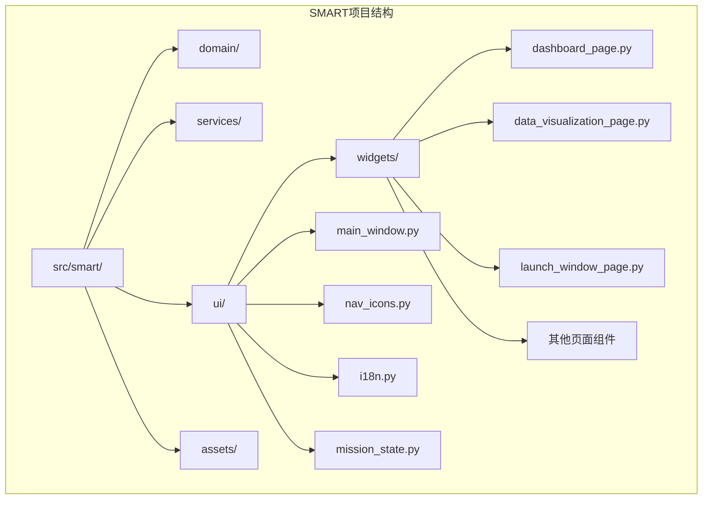

**图表来源**
- [main_window.py:1-781](file://src/smart/ui/main_window.py#L1-L781)
- [nav_icons.py:1-211](file://src/smart/ui/nav_icons.py#L1-L211)
- [i18n.py:1-517](file://src/smart/ui/i18n.py#L1-L517)

**章节来源**
- [README.md:187-196](file://README.md#L187-L196)

## 核心组件

导航系统由以下核心组件构成：

### 主窗口组件
- **MainWindow**: 导航系统的主控制器，负责页面管理和状态同步
- **侧边栏框架**: 包含品牌标识、项目信息和导航列表
- **页面堆栈**: 管理所有功能页面的显示和切换

### 导航组件
- **导航列表**: 基于QListWidget的导航项集合
- **动态图标系统**: 支持主题色切换的SVG图标渲染
- **国际化标签**: 支持多语言的导航文本显示

### 状态管理
- **MissionState**: 航天器任务状态的全局管理
- **项目工作空间**: 项目生命周期管理
- **最近项目管理**: 项目访问历史追踪

**章节来源**
- [main_window.py:53-136](file://src/smart/ui/main_window.py#L53-L136)
- [nav_icons.py:17-138](file://src/smart/ui/nav_icons.py#L17-L138)
- [mission_state.py:11-45](file://src/smart/ui/mission_state.py#L11-L45)

## 架构概览

导航系统采用分层架构设计，确保了良好的可维护性和扩展性。

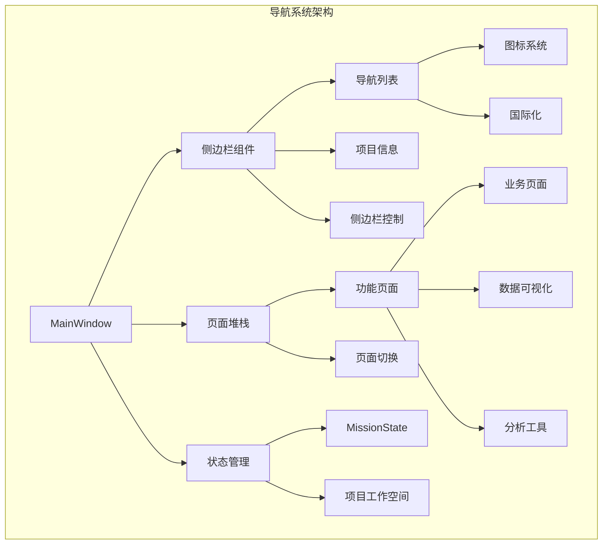

**图表来源**
- [main_window.py:215-277](file://src/smart/ui/main_window.py#L215-L277)
- [main_window.py:110-125](file://src/smart/ui/main_window.py#L110-L125)

## 详细组件分析

### 侧边栏导航系统

侧边栏是导航系统的核心界面元素，提供了完整的页面导航功能。

#### 导航列表构建过程

导航列表的构建遵循以下流程：

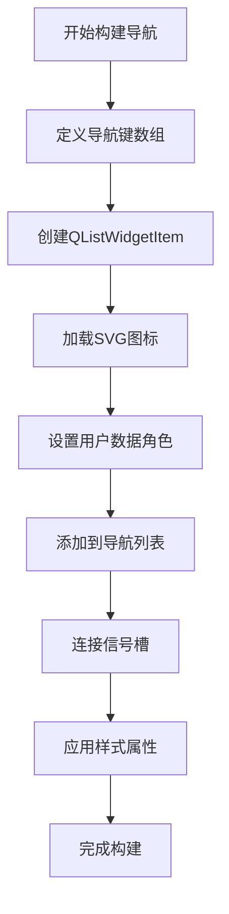

**图表来源**
- [main_window.py:261-266](file://src/smart/ui/main_window.py#L261-L266)

#### 侧边栏展开折叠逻辑

侧边栏支持动态展开和折叠，具有以下特性：

| 状态 | 宽度 | 文本显示 | 图标布局 | 项目信息 |
|------|------|----------|----------|----------|
| 展开 | 280px | 完整标签 | 左对齐 | 显示 |
| 折叠 | 72px | 空白 | 居中 | 隐藏 |

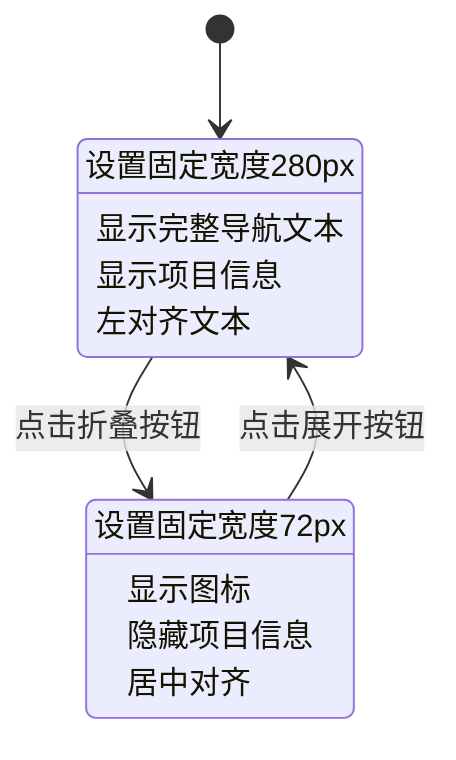

**图表来源**
- [main_window.py:315-345](file://src/smart/ui/main_window.py#L315-L345)

#### 动态样式更新机制

样式更新通过Qt的动态属性系统实现：

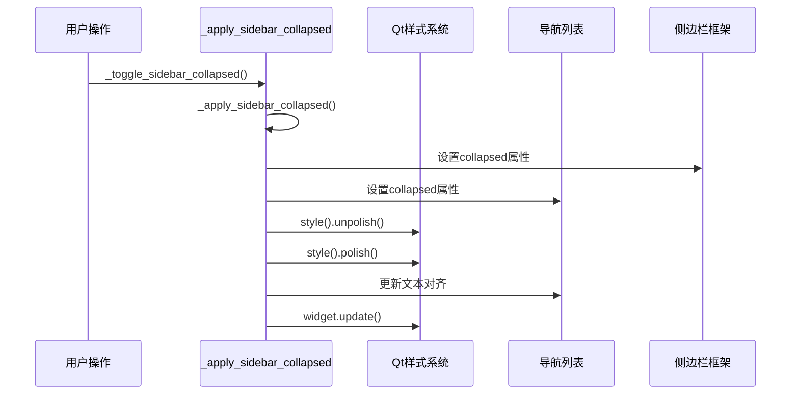

**图表来源**
- [main_window.py:315-345](file://src/smart/ui/main_window.py#L315-L345)

**章节来源**
- [main_window.py:312-369](file://src/smart/ui/main_window.py#L312-L369)

### 图标系统

SMART采用内嵌SVG图标系统，提供统一的视觉风格和主题适配能力。

#### 图标渲染流程

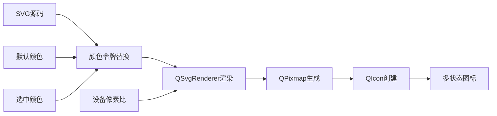

**图表来源**
- [nav_icons.py:161-184](file://src/smart/ui/nav_icons.py#L161-L184)

#### 图标支持矩阵

| 导航键 | 图标名称 | 功能描述 |
|--------|----------|----------|
| nav.dashboard | 仪表板网格 | 任务系统总览 |
| nav.orbit_design | 卫星轨道 | 卫星3D模型配置 |
| nav.design_maneuver_strategy | 设计策略 | 设计变轨策略 |
| nav.maneuver_strategy | 导入策略 | 导入变轨策略 |
| nav.launch_window | 发射窗口 | 发射窗口分析 |
| nav.tracking_arc | 跟踪弧段 | 跟踪弧段分析 |
| nav.flight_program | 飞行程序 | 飞行程序设计 |
| nav.data_visualization | 数据图表 | 科学数据可视化 |
| nav.stk_link | STK联动 | STK联动功能 |
| nav.ai_project_analysis | AI分析 | AI项目分析 |

**章节来源**
- [nav_icons.py:17-138](file://src/smart/ui/nav_icons.py#L17-L138)

### 国际化系统

导航系统完全支持国际化，当前支持简体中文。

#### 国际化实现机制

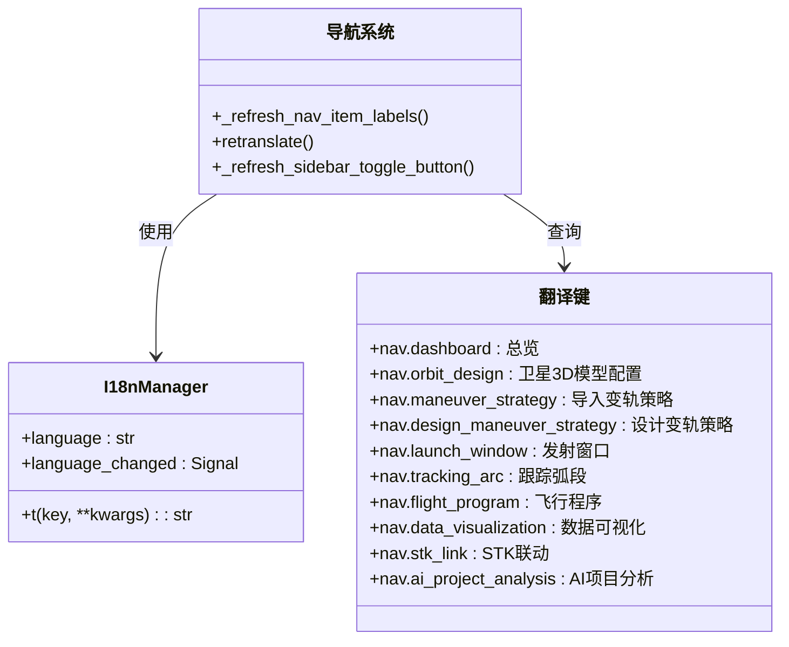

**图表来源**
- [i18n.py:498-517](file://src/smart/ui/i18n.py#L498-L517)
- [main_window.py:675-711](file://src/smart/ui/main_window.py#L675-L711)

**章节来源**
- [i18n.py:5-496](file://src/smart/ui/i18n.py#L5-L496)
- [main_window.py:675-711](file://src/smart/ui/main_window.py#L675-L711)

### 页面路由机制

页面路由通过QStackedWidget实现，支持信号槽机制进行页面切换。

#### 页面切换流程

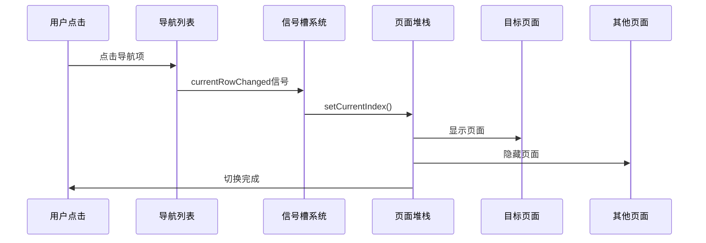

**图表来源**
- [main_window.py:266](file://src/smart/ui/main_window.py#L266)

#### 页面状态保持策略

页面状态保持通过以下机制实现：

1. **自动保存机制**: 基于MissionState的信号监听
2. **项目状态同步**: 项目激活时的状态恢复
3. **页面懒加载**: 按需创建和销毁页面实例
4. **配置持久化**: 关键配置的本地存储

**章节来源**
- [main_window.py:127-131](file://src/smart/ui/main_window.py#L127-L131)
- [main_window.py:534-580](file://src/smart/ui/main_window.py#L534-L580)

### 最近项目管理系统

最近项目管理提供便捷的项目访问功能，支持最多8个项目的追踪。

#### 最近项目管理流程

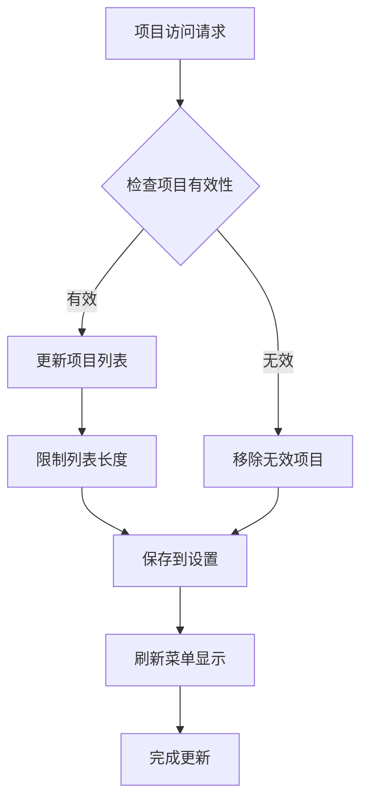

**图表来源**
- [main_window.py:736-759](file://src/smart/ui/main_window.py#L736-L759)

#### 最近项目存储机制

| 存储位置 | 数据格式 | 最大数量 | 清理策略 |
|----------|----------|----------|----------|
| QSettings | JSON数组 | 8个项目 | 自动去重和截断 |
| 内存缓存 | Python列表 | 动态 | 程序运行时缓存 |
| 菜单显示 | QAction列表 | 动态 | 实时更新 |

**章节来源**
- [main_window.py:712-759](file://src/smart/ui/main_window.py#L712-L759)

## 依赖关系分析

导航系统与其他组件的依赖关系如下：

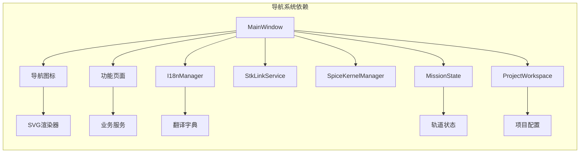

**图表来源**
- [main_window.py:8-25](file://src/smart/ui/main_window.py#L8-L25)
- [nav_icons.py:11-12](file://src/smart/ui/nav_icons.py#L11-L12)

**章节来源**
- [main_window.py:8-25](file://src/smart/ui/main_window.py#L8-L25)

## 性能考虑

导航系统在设计时充分考虑了性能优化：

### 渲染优化
- SVG图标使用QSvgRenderer进行硬件加速渲染
- 动态属性更新采用最小化重绘策略
- 页面切换使用异步加载避免阻塞UI

### 内存管理
- 页面实例按需创建和销毁
- 图标资源缓存避免重复渲染
- 最近项目列表限制在8个项目以内

### 响应性优化
- 侧边栏切换使用动画过渡
- 导航列表使用统一项目尺寸
- 国际化文本缓存避免重复查询

## 故障排除指南

### 常见问题及解决方案

#### 侧边栏图标显示异常
**症状**: 导航图标显示为空白或颜色异常
**原因**: SVG渲染失败或颜色令牌替换错误
**解决方案**: 
1. 检查SVG源码完整性
2. 验证颜色令牌替换逻辑
3. 确认QSvgRenderer正常工作

#### 页面切换失效
**症状**: 点击导航项无响应
**原因**: 信号槽连接中断或页面索引错误
**解决方案**:
1. 检查currentRowChanged信号连接
2. 验证页面堆栈索引一致性
3. 确认页面实例正确创建

#### 国际化文本显示错误
**症状**: 导航文本显示为键名而非翻译内容
**原因**: 翻译字典缺失或I18nManager配置错误
**解决方案**:
1. 验证翻译键的存在性
2. 检查I18nManager的语言设置
3. 确认retranslate方法正确调用

**章节来源**
- [test_sidebar_navigation.py:9-22](file://tests/test_sidebar_navigation.py#L9-L22)
- [test_sidebar_navigation.py:24-43](file://tests/test_sidebar_navigation.py#L24-L43)

## 结论

SMART项目的页面导航系统展现了优秀的架构设计和用户体验考虑。系统通过模块化设计实现了高内聚低耦合，通过信号槽机制保证了组件间的松散耦合，通过国际化支持体现了全球化视野。

导航系统的主要优势包括：
- **可扩展性**: 支持新页面的无缝集成
- **用户体验**: 提供流畅的导航和状态保持
- **技术先进性**: 采用现代UI框架和最佳实践
- **可维护性**: 清晰的代码结构和完善的测试覆盖

未来可以考虑的改进方向：
- 增加导航历史记录功能
- 实现键盘快捷键支持
- 优化移动端适配
- 增强无障碍访问支持

## 附录

### 新页面集成指南

要向导航系统添加新页面，需要遵循以下步骤：

1. **创建页面类**: 继承QWidget或相应的基类
2. **注册导航键**: 在_NAV_KEYS数组中添加新的导航键
3. **创建页面实例**: 在MainWindow构造函数中初始化页面
4. **添加到页面堆栈**: 将新页面addWidget到_stack
5. **实现图标**: 在nav_icons.py中添加对应SVG图标
6. **国际化支持**: 在i18n.py中添加翻译键
7. **测试验证**: 编写单元测试验证功能

### 导航状态同步机制

导航系统通过以下机制确保状态同步：

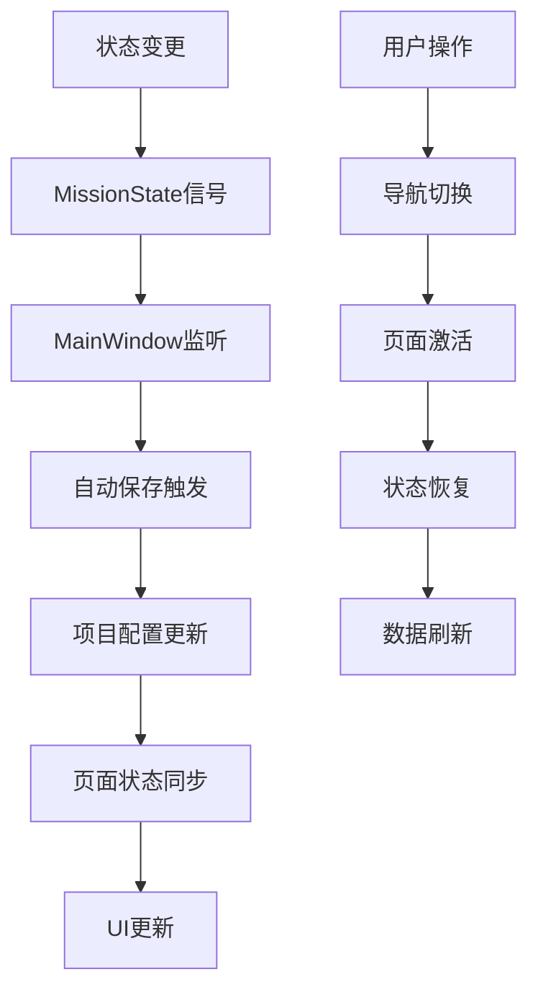

**图表来源**
- [mission_state.py:12-14](file://src/smart/ui/mission_state.py#L12-L14)
- [main_window.py:601-617](file://src/smart/ui/main_window.py#L601-L617)