# AI分析页面

<cite>
**本文档引用的文件**
- [ai_project_analysis_page.py](file://src/smart/ui/widgets/ai_project_analysis_page.py)
- [project_ai_context.py](file://src/smart/services/project_ai_context.py)
- [llm_client.py](file://src/smart/services/llm_client.py)
- [mission_agent.py](file://src/smart/services/mission_agent.py)
- [mission_agent_tools.py](file://src/smart/services/mission_agent_tools.py)
- [ai_project_analysis.md](file://doc/ai_project_analysis.md)
- [mission_agent.md](file://src/smart/agents/mission_agent.md)
- [mission_analysis_calculation.md](file://src/smart/agents/skills/mission_analysis_calculation.md)
- [project_consistency_audit.md](file://src/smart/agents/skills/project_consistency_audit.md)
- [stk_11_6_operations.md](file://src/smart/agents/skills/stk_11_6_operations.md)
- [ai_project_analysis.md](file://projects/F4/data/ai_project_analysis.md)
- [main_window.py](file://src/smart/ui/main_window.py)
- [test_ai_project_analysis.py](file://tests/test_ai_project_analysis.py)
</cite>

## 目录
1. [简介](#简介)
2. [项目结构](#项目结构)
3. [核心组件](#核心组件)
4. [架构概览](#架构概览)
5. [详细组件分析](#详细组件分析)
6. [依赖分析](#依赖分析)
7. [性能考虑](#性能考虑)
8. [故障排除指南](#故障排除指南)
9. [结论](#结论)
10. [附录](#附录)

## 简介
AI分析页面是SMART航天任务分析系统中的智能辅助模块，旨在通过大语言模型(LLM)对当前项目进行全面的工程分析。该页面集成了LLM客户端、项目上下文分析和智能报告生成功能，为用户提供对话式的项目解读和建议生成机制。

该页面的核心设计理念是"工程导向的智能分析"，通过以下方式实现：
- 基于项目配置和数据的上下文理解
- 受控的本地工具调用能力
- 可复核的工程分析报告
- 安全的API密钥管理
- 深度的项目数据集成

## 项目结构
AI分析页面采用模块化设计，主要包含以下核心模块：

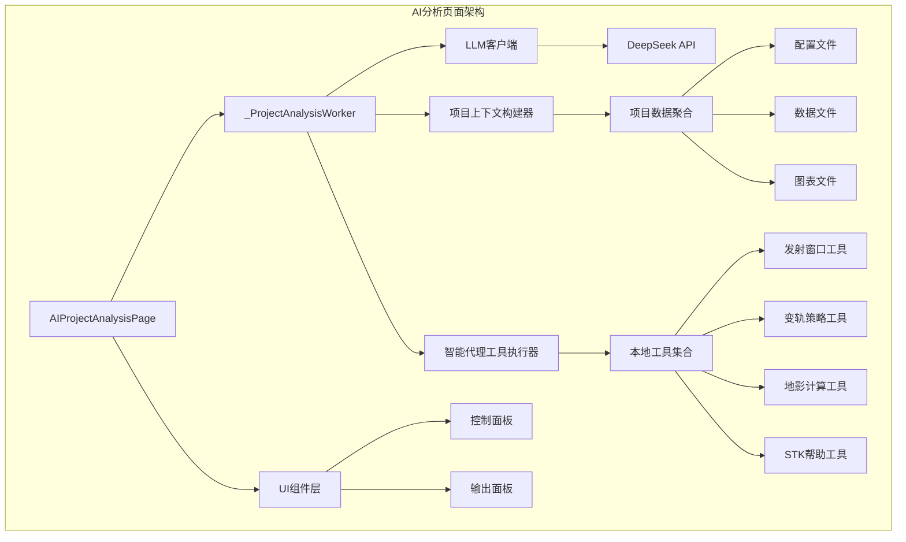

**图表来源**
- [ai_project_analysis_page.py:231-273](file://src/smart/ui/widgets/ai_project_analysis_page.py#L231-L273)
- [llm_client.py:69-162](file://src/smart/services/llm_client.py#L69-L162)
- [project_ai_context.py:17-56](file://src/smart/services/project_ai_context.py#L17-L56)
- [mission_agent_tools.py:42-231](file://src/smart/services/mission_agent_tools.py#L42-L231)

**章节来源**
- [ai_project_analysis_page.py:231-273](file://src/smart/ui/widgets/ai_project_analysis_page.py#L231-L273)
- [ai_project_analysis.md:1-103](file://doc/ai_project_analysis.md#L1-L103)

## 核心组件
AI分析页面由多个相互协作的组件构成，每个组件都有明确的职责和接口。

### 主要组件概述
1. **AIProjectAnalysisPage**: 主界面控制器，管理用户交互和状态
2. **_ProjectAnalysisWorker**: 后台分析工作者，执行实际的分析任务
3. **LLM客户端**: 处理与DeepSeek API的通信
4. **项目上下文构建器**: 聚合和整理项目数据
5. **智能代理工具执行器**: 提供受控的本地工具调用能力

### 组件交互流程
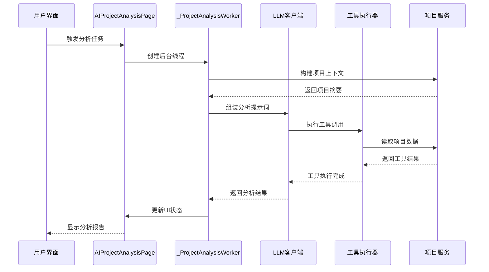

**图表来源**
- [ai_project_analysis_page.py:530-572](file://src/smart/ui/widgets/ai_project_analysis_page.py#L530-L572)
- [llm_client.py:69-162](file://src/smart/services/llm_client.py#L69-L162)
- [mission_agent_tools.py:232-249](file://src/smart/services/mission_agent_tools.py#L232-L249)

**章节来源**
- [ai_project_analysis_page.py:147-218](file://src/smart/ui/widgets/ai_project_analysis_page.py#L147-L218)
- [llm_client.py:31-50](file://src/smart/services/llm_client.py#L31-L50)

## 架构概览
AI分析页面采用分层架构设计，确保了良好的可维护性和扩展性。

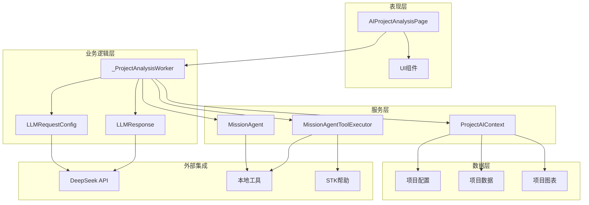

**图表来源**
- [ai_project_analysis_page.py:231-428](file://src/smart/ui/widgets/ai_project_analysis_page.py#L231-L428)
- [project_ai_context.py:17-81](file://src/smart/services/project_ai_context.py#L17-L81)
- [mission_agent.py:145-211](file://src/smart/services/mission_agent.py#L145-L211)

### 数据流架构
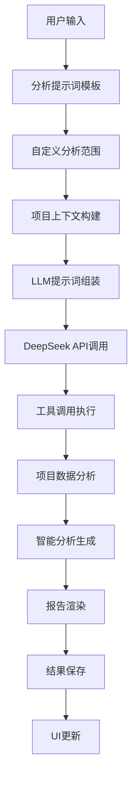

**图表来源**
- [ai_project_analysis_page.py:43-144](file://src/smart/ui/widgets/ai_project_analysis_page.py#L43-L144)
- [project_ai_context.py:59-80](file://src/smart/services/project_ai_context.py#L59-L80)

**章节来源**
- [ai_project_analysis_page.py:231-493](file://src/smart/ui/widgets/ai_project_analysis_page.py#L231-L493)
- [ai_project_analysis.md:37-94](file://doc/ai_project_analysis.md#L37-L94)

## 详细组件分析

### AIProjectAnalysisPage组件
AIProjectAnalysisPage是AI分析页面的主控制器，负责管理整个分析流程和用户交互。

#### UI组件结构
页面采用左右布局设计，左侧为控制面板，右侧为输出面板：

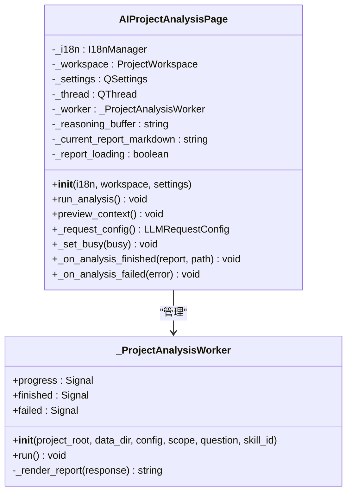

**图表来源**
- [ai_project_analysis_page.py:231-249](file://src/smart/ui/widgets/ai_project_analysis_page.py#L231-L249)
- [ai_project_analysis_page.py:147-170](file://src/smart/ui/widgets/ai_project_analysis_page.py#L147-L170)

#### 控制面板功能
控制面板包含以下核心功能区域：

1. **分析任务区域**: 提供提示词模板选择和自定义分析范围
2. **项目预检区域**: 显示项目状态和安全边界
3. **模型配置区域**: DeepSeek API参数配置
4. **本地工具区域**: 专家技能和工具说明

#### 输出面板功能
输出面板提供完整的分析结果展示和导出功能：
- Markdown格式报告显示
- 执行日志追踪
- 多格式报告导出（MD、DOCX、PDF）

**章节来源**
- [ai_project_analysis_page.py:274-493](file://src/smart/ui/widgets/ai_project_analysis_page.py#L274-L493)

### LLM客户端组件
LLM客户端负责处理与DeepSeek API的通信，实现了完整的工具调用流程。

#### 请求配置管理
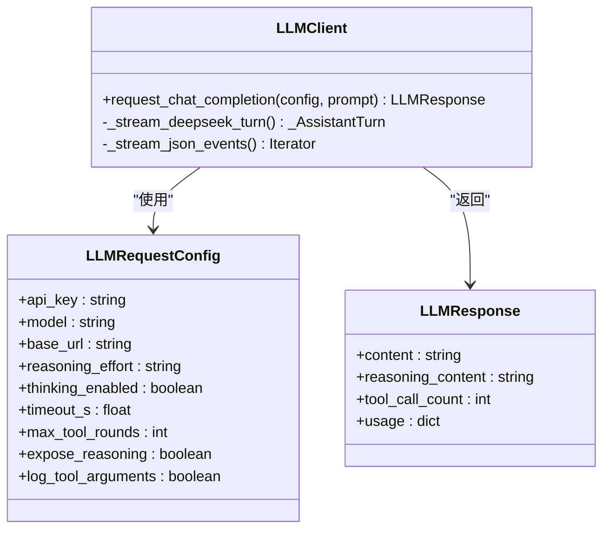

**图表来源**
- [llm_client.py:31-50](file://src/smart/services/llm_client.py#L31-L50)
- [llm_client.py:44-50](file://src/smart/services/llm_client.py#L44-L50)

#### 工具调用机制
LLM客户端实现了智能的工具调用机制，支持多轮对话和工具执行：

1. **流式响应处理**: 支持SSE流式响应
2. **推理内容追踪**: 可选择暴露或隐藏推理过程
3. **工具调用协调**: 自动处理工具调用和结果返回
4. **错误处理机制**: 完善的异常处理和恢复

**章节来源**
- [llm_client.py:69-255](file://src/smart/services/llm_client.py#L69-L255)

### 项目上下文构建器
项目上下文构建器负责聚合和整理项目数据，为LLM提供结构化的分析输入。

#### 上下文构建流程
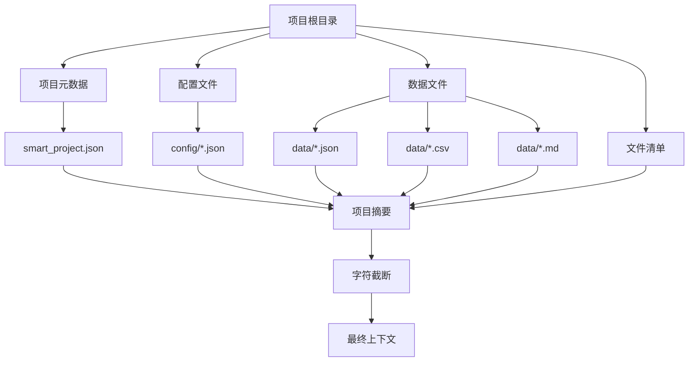

**图表来源**
- [project_ai_context.py:17-56](file://src/smart/services/project_ai_context.py#L17-L56)

#### 数据摘要策略
项目上下文构建器采用了智能的数据摘要策略：

1. **文件选择优先级**: 优先处理关键文件（轨道元素、发射窗口、设计结果）
2. **数据格式适配**: 支持JSON、CSV、文本等多种格式
3. **统计信息提取**: 自动计算数值统计和样本行
4. **字符限制控制**: 防止上下文过大影响分析效果

**章节来源**
- [project_ai_context.py:17-217](file://src/smart/services/project_ai_context.py#L17-L217)

### 智能代理工具执行器
智能代理工具执行器提供了受控的本地工具调用能力，是AI分析页面的核心功能之一。

#### 工具集合
工具执行器支持以下核心工具：

| 工具名称 | 功能描述 | 使用场景 |
|---------|----------|----------|
| build_project_context | 构建项目上下文 | 分析前的数据准备 |
| find_launch_windows | 查找发射窗口 | 窗口分析和验证 |
| compute_shadow_intervals_for_launch | 计算地影区间 | 地影风险评估 |
| plan_design_maneuver_strategy | 设计变轨策略 | 脉冲变轨分析 |
| optimize_design_continuous_thrust | 连续推力优化 | 连续推力复核 |
| compute_launch_window_samples | 发射窗口采样 | 窗口重新计算 |
| inspect_project_files | 项目文件检查 | 项目完整性验证 |
| query_stk_help | STK帮助查询 | STK命令参考 |

#### 工具执行流程
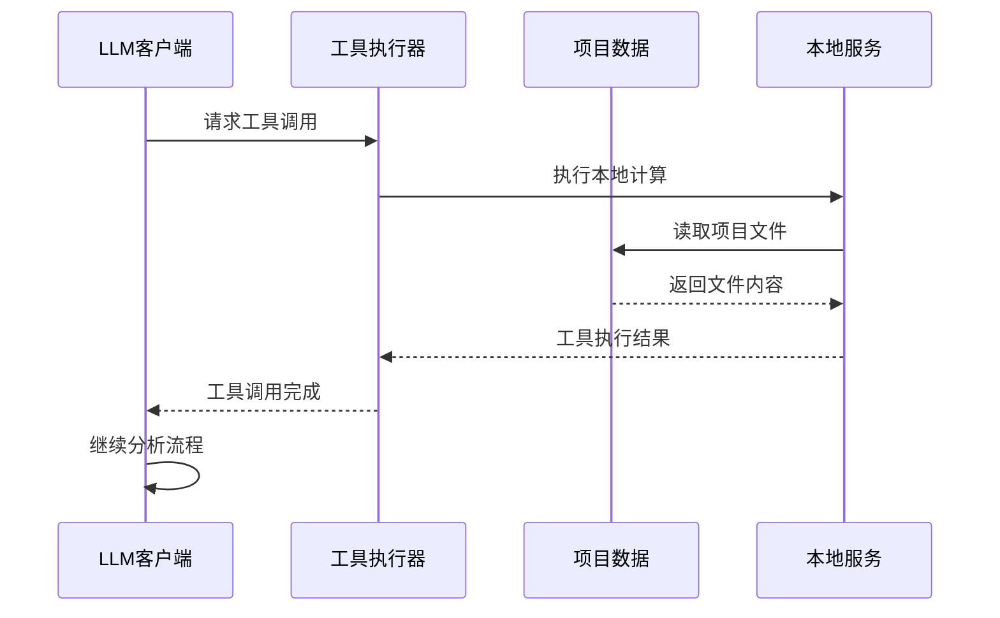

**图表来源**
- [mission_agent_tools.py:232-249](file://src/smart/services/mission_agent_tools.py#L232-L249)

**章节来源**
- [mission_agent_tools.py:42-732](file://src/smart/services/mission_agent_tools.py#L42-L732)

### 智能代理系统
智能代理系统提供了多技能的专家能力，支持不同类型的项目分析任务。

#### 技能配置
智能代理系统包含以下核心技能：

1. **任务分析计算技能**: 覆盖变轨策略、发射窗口、跟踪弧段、地影计算等
2. **项目一致性审计技能**: 检查项目配置、缓存数据、计算结果之间的一致性
3. **STK 11.6操作技能**: 提供STK相关操作和帮助查询能力

#### 系统提示词生成
智能代理系统能够动态生成系统提示词，确保AI助手具备正确的角色定位和工作原则。

**章节来源**
- [mission_agent.py:145-211](file://src/smart/services/mission_agent.py#L145-L211)
- [mission_agent.md:1-27](file://src/smart/agents/mission_agent.md#L1-L27)

## 依赖分析
AI分析页面的依赖关系相对清晰，主要依赖于项目的服务层和UI框架。

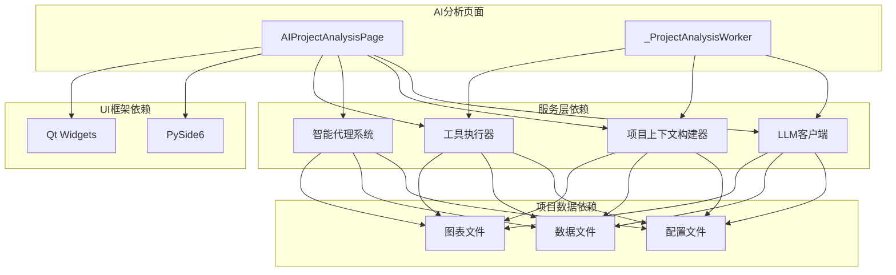

**图表来源**
- [ai_project_analysis_page.py:10-36](file://src/smart/ui/widgets/ai_project_analysis_page.py#L10-L36)
- [llm_client.py:1-10](file://src/smart/services/llm_client.py#L1-L10)

### 外部依赖
AI分析页面的主要外部依赖包括：

1. **DeepSeek API**: 提供大语言模型服务
2. **PySide6**: 提供GUI界面框架
3. **Python标准库**: 提供基础功能支持
4. **项目内部服务**: 提供航天任务分析能力

### 内部依赖关系
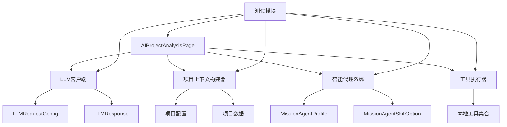

**图表来源**
- [test_ai_project_analysis.py:38-39](file://tests/test_ai_project_analysis.py#L38-L39)

**章节来源**
- [ai_project_analysis_page.py:10-36](file://src/smart/ui/widgets/ai_project_analysis_page.py#L10-L36)
- [test_ai_project_analysis.py:1-490](file://tests/test_ai_project_analysis.py#L1-L490)

## 性能考虑
AI分析页面在设计时充分考虑了性能优化和用户体验。

### 性能优化策略
1. **异步处理**: 所有网络请求都在后台线程执行，避免UI阻塞
2. **数据截断**: 上下文构建器自动截断过大的数据，防止内存溢出
3. **流式响应**: LLM客户端支持流式响应，提升用户体验
4. **缓存机制**: 项目文件检查结果可以重复利用

### 内存管理
- 合理的字符串缓冲区管理
- 及时释放临时文件句柄
- 控制日志输出的内存占用

### 网络优化
- 连接超时和重试机制
- 流式数据处理减少内存峰值
- 错误快速检测和恢复

## 故障排除指南
AI分析页面提供了完善的错误处理和故障排除机制。

### 常见问题诊断
1. **API连接问题**: 检查DeepSeek API密钥和网络连接
2. **项目数据缺失**: 验证项目文件的完整性和可访问性
3. **工具执行失败**: 检查本地工具的依赖和权限
4. **内存不足**: 减少分析范围或清理项目缓存

### 错误处理机制
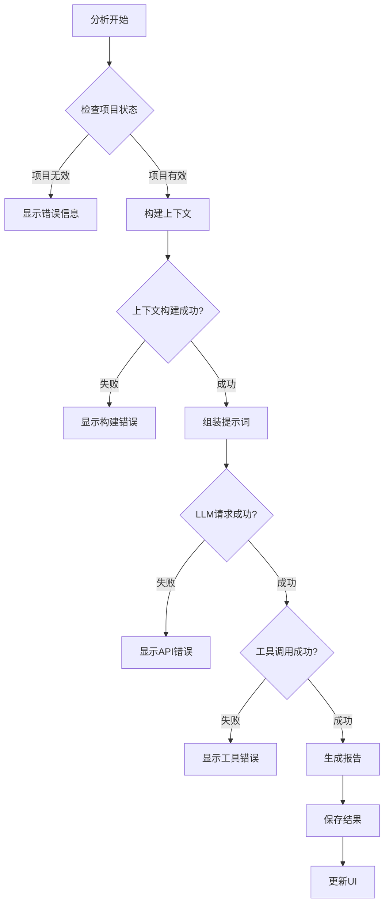

**图表来源**
- [ai_project_analysis_page.py:607-616](file://src/smart/ui/widgets/ai_project_analysis_page.py#L607-L616)

### 日志和追踪
- 详细的执行日志记录
- 工具调用轨迹追踪
- 错误堆栈信息收集

**章节来源**
- [ai_project_analysis_page.py:600-620](file://src/smart/ui/widgets/ai_project_analysis_page.py#L600-L620)

## 结论
AI分析页面是一个设计精良的智能分析工具，它成功地将大语言模型的强大能力与SMART项目的工程需求相结合。通过模块化的架构设计、受控的工具调用机制和完善的错误处理，该页面为用户提供了一个强大而安全的项目分析平台。

### 主要优势
1. **工程导向**: 始终以工程复核和项目改进为目标
2. **安全可控**: 通过工具调用限制和数据截断确保安全性
3. **智能高效**: 利用LLM的上下文理解和推理能力提升分析效率
4. **可扩展性强**: 模块化设计便于功能扩展和维护

### 应用价值
AI分析页面不仅能够自动化复杂的项目分析任务，更重要的是它提供了一种新的项目管理方式，通过智能辅助帮助工程师更好地理解和改进航天任务设计。

## 附录

### 配置选项详解
AI分析页面提供了丰富的配置选项，用户可以根据需要进行个性化设置：

#### 模型配置
- **DeepSeek base_url**: API服务地址，默认为官方服务
- **api_key**: 认证密钥，支持环境变量配置
- **model**: 模型选择，支持V4 Pro和V4 Flash
- **reasoning_effort**: 推理强度，支持high和max
- **thinking_enabled**: 是否启用推理内容显示

#### 技能配置
- **全部内置Skill**: 启用所有技能的组合
- **任务分析计算Skill**: 专注于工程计算分析
- **项目一致性审计Skill**: 专注于项目数据一致性检查
- **STK 11.6操作Skill**: 专注于STK相关操作

#### 报告导出
- **Markdown导出**: 原始格式报告
- **DOCX导出**: Word格式报告
- **PDF导出**: PDF格式报告

### 使用最佳实践
1. **数据完整性**: 确保项目数据的完整性和时效性
2. **分析范围控制**: 合理设置分析范围，避免过度计算
3. **工具调用谨慎**: 仅在必要时使用工具调用功能
4. **结果验证**: 对AI生成的建议进行人工验证

### 维护注意事项
1. **定期更新**: 保持AI模型和工具的最新版本
2. **数据备份**: 定期备份重要的项目数据
3. **性能监控**: 监控分析任务的性能表现
4. **安全更新**: 及时更新API密钥和安全配置

**章节来源**
- [ai_project_analysis.md:28-103](file://doc/ai_project_analysis.md#L28-L103)
- [ai_project_analysis_page.py:621-646](file://src/smart/ui/widgets/ai_project_analysis_page.py#L621-L646)