# 仪表板页面

<cite>
**本文档引用的文件**
- [dashboard_page.py](file://src/smart/ui/widgets/dashboard_page.py)
- [main_window.py](file://src/smart/ui/main_window.py)
- [theme.py](file://src/smart/ui/theme.py)
- [i18n.py](file://src/smart/ui/i18n.py)
- [nav_icons.py](file://src/smart/ui/nav_icons.py)
- [project_workspace.py](file://src/smart/services/project_workspace.py)
- [mission_state.py](file://src/smart/ui/mission_state.py)
- [smart_project.json(F1)](file://projects/F1/smart_project.json)
- [maneuver_strategy.json(F1)](file://projects/F1/config/maneuver_strategy.json)
- [launch_window.json(F4)](file://projects/F4/config/launch_window.json)
</cite>

## 目录
1. [简介](#简介)
2. [项目结构](#项目结构)
3. [核心组件](#核心组件)
4. [架构概览](#架构概览)
5. [详细组件分析](#详细组件分析)
6. [依赖关系分析](#依赖关系分析)
7. [性能考虑](#性能考虑)
8. [故障排除指南](#故障排除指南)
9. [结论](#结论)
10. [附录](#附录)

## 简介

仪表板页面是 SMART 项目的核心主界面，采用一体化桌面任务设计架构。它作为项目主界面，提供了统一的用户体验，整合了各个功能模块的入口点，实现了任务态势的全面监控和状态展示。

仪表板的设计理念基于"任务工作区"概念，通过可视化的方式呈现项目状态、数据链路完整性、模块就绪度等关键信息。它不仅是一个导航入口，更是整个任务分析流程的控制中心和信息枢纽。

## 项目结构

SMART 项目采用模块化架构，仪表板页面位于 UI 层的 widgets 子模块中，与业务逻辑层的服务组件紧密协作：

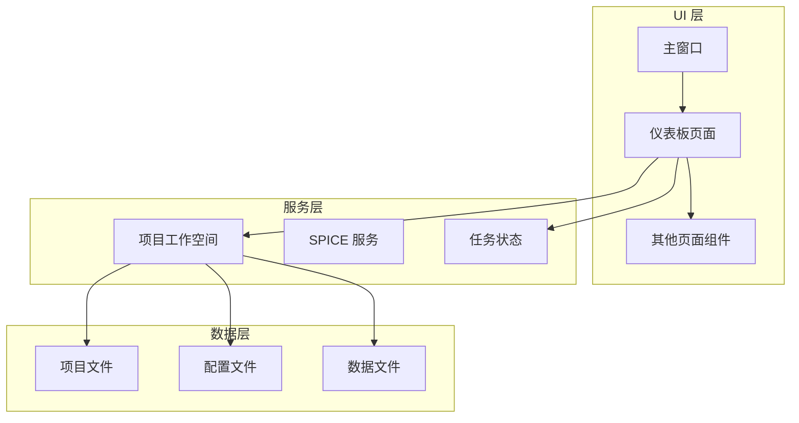

**图表来源**
- [main_window.py:53-136](file://src/smart/ui/main_window.py#L53-L136)
- [dashboard_page.py:263-293](file://src/smart/ui/widgets/dashboard_page.py#L263-L293)

**章节来源**
- [main_window.py:53-136](file://src/smart/ui/main_window.py#L53-L136)
- [dashboard_page.py:263-293](file://src/smart/ui/widgets/dashboard_page.py#L263-L293)

## 核心组件

仪表板页面由多个精心设计的组件构成，每个组件都有特定的功能和职责：

### 主要组件架构

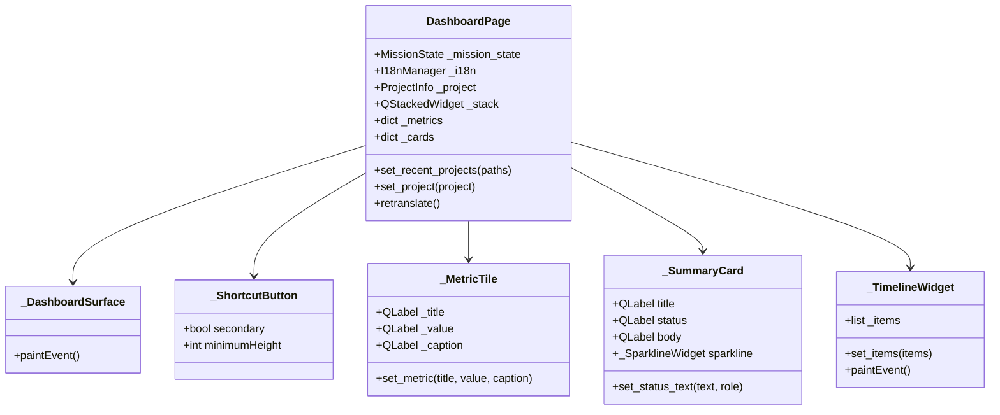

**图表来源**
- [dashboard_page.py:72-102](file://src/smart/ui/widgets/dashboard_page.py#L72-L102)
- [dashboard_page.py:105-113](file://src/smart/ui/widgets/dashboard_page.py#L105-L113)
- [dashboard_page.py:155-182](file://src/smart/ui/widgets/dashboard_page.py#L155-L182)
- [dashboard_page.py:227-261](file://src/smart/ui/widgets/dashboard_page.py#L227-L261)
- [dashboard_page.py:184-225](file://src/smart/ui/widgets/dashboard_page.py#L184-L225)

### 数据流处理

仪表板采用双页面模式（空项目状态和项目状态），通过 QStackedWidget 实现动态切换：

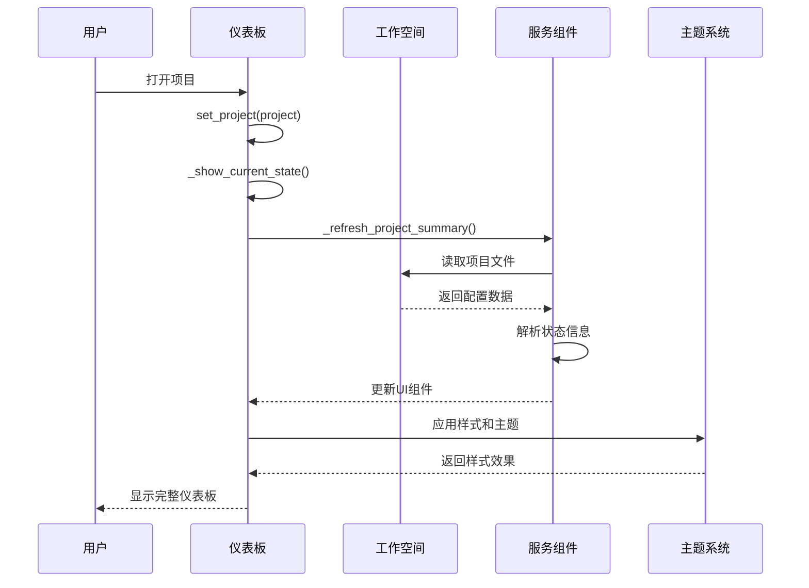

**图表来源**
- [dashboard_page.py:294-296](file://src/smart/ui/widgets/dashboard_page.py#L294-L296)
- [dashboard_page.py:558-560](file://src/smart/ui/widgets/dashboard_page.py#L558-L560)
- [main_window.py:534-580](file://src/smart/ui/main_window.py#L534-L580)

**章节来源**
- [dashboard_page.py:72-102](file://src/smart/ui/widgets/dashboard_page.py#L72-L102)
- [dashboard_page.py:105-113](file://src/smart/ui/widgets/dashboard_page.py#L105-L113)
- [dashboard_page.py:155-182](file://src/smart/ui/widgets/dashboard_page.py#L155-L182)
- [dashboard_page.py:227-261](file://src/smart/ui/widgets/dashboard_page.py#L227-L261)

## 架构概览

仪表板页面采用 MVC（Model-View-Controller）架构模式，通过信号槽机制实现松耦合的组件通信：

### 整体架构设计

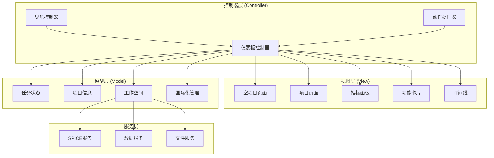

**图表来源**
- [dashboard_page.py:263-293](file://src/smart/ui/widgets/dashboard_page.py#L263-L293)
- [main_window.py:86-125](file://src/smart/ui/main_window.py#L86-L125)
- [mission_state.py:11-45](file://src/smart/ui/mission_state.py#L11-L45)

### 组件交互流程

仪表板页面通过信号槽机制与主窗口和其他组件进行通信：

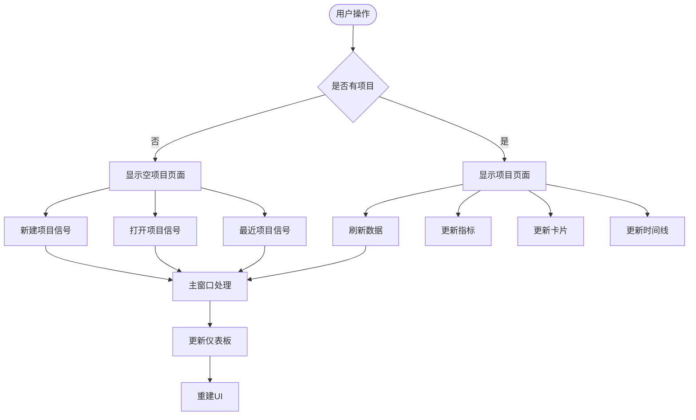

**图表来源**
- [dashboard_page.py:264-267](file://src/smart/ui/widgets/dashboard_page.py#L264-L267)
- [dashboard_page.py:303-306](file://src/smart/ui/widgets/dashboard_page.py#L303-L306)
- [main_window.py:86-90](file://src/smart/ui/main_window.py#L86-L90)

**章节来源**
- [dashboard_page.py:263-293](file://src/smart/ui/widgets/dashboard_page.py#L263-L293)
- [main_window.py:86-125](file://src/smart/ui/main_window.py#L86-L125)
- [mission_state.py:11-45](file://src/smart/ui/mission_state.py#L11-L45)

## 详细组件分析

### 仪表板表面组件 (_DashboardSurface)

仪表板表面组件提供了独特的视觉背景，采用渐变色彩和网格线条营造专业的太空任务控制台氛围：

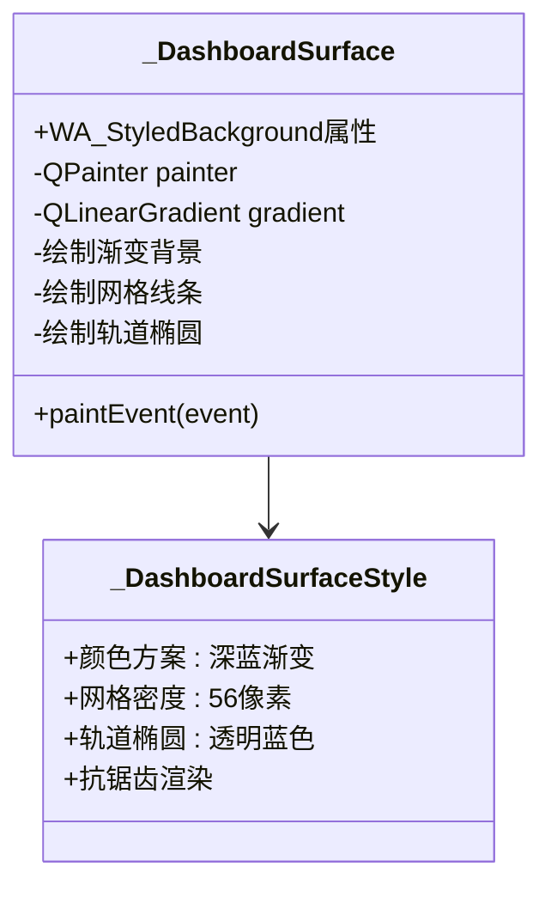

**图表来源**
- [dashboard_page.py:72-102](file://src/smart/ui/widgets/dashboard_page.py#L72-L102)

该组件使用 Qt 的 QPainter 进行自定义绘制，实现了以下特性：
- 渐变背景从深蓝到青蓝的平滑过渡
- 56像素间距的细密网格线条
- 透明度为42%的蓝色轨道椭圆装饰
- 抗锯齿渲染确保视觉质量

**章节来源**
- [dashboard_page.py:72-102](file://src/smart/ui/widgets/dashboard_page.py#L72-L102)

### 快捷操作按钮 (_ShortcutButton)

快捷按钮组件提供了统一的交互体验，支持主要操作的快速访问：

| 属性 | 默认值 | 描述 |
|------|--------|------|
| 最小高度 | 38像素 | 确保足够的点击区域 |
| 光标样式 | 手形光标 | 提供视觉反馈 |
| 变体支持 | 普通/次要 | 区分操作重要性 |

快捷按钮支持两种变体：
- **普通按钮**：用于主要操作（新建项目）
- **次要按钮**：用于辅助操作（打开项目）

**章节来源**
- [dashboard_page.py:105-113](file://src/smart/ui/widgets/dashboard_page.py#L105-L113)

### 指标面板 (_MetricTile)

指标面板组件用于展示关键性能指标，采用卡片式设计：

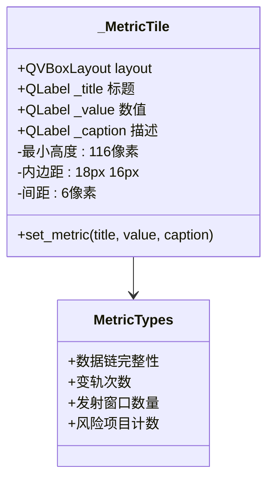

**图表来源**
- [dashboard_page.py:155-182](file://src/smart/ui/widgets/dashboard_page.py#L155-L182)

指标面板支持四种核心指标：
1. **数据链完整性**：显示关键配置/结果文件的覆盖情况
2. **变轨次数**：当前策略配置的数量
3. **发射窗口**：可用窗口数和采样点数量
4. **风险项目**：需要复核的项目数量

**章节来源**
- [dashboard_page.py:155-182](file://src/smart/ui/widgets/dashboard_page.py#L155-L182)

### 功能卡片 (_SummaryCard)

功能卡片组件提供模块状态的详细信息和可视化展示：

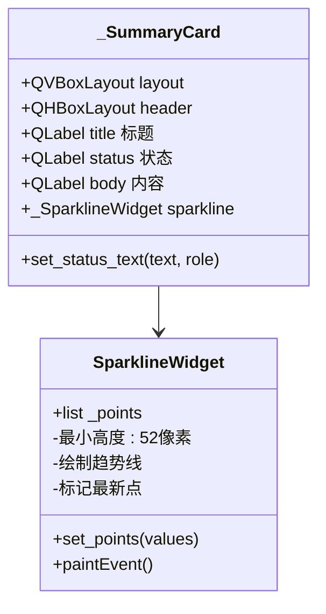

**图表来源**
- [dashboard_page.py:227-261](file://src/smart/ui/widgets/dashboard_page.py#L227-L261)
- [dashboard_page.py:114-153](file://src/smart/ui/widgets/dashboard_page.py#L114-L153)

每个功能卡片包含：
- **标题**：模块名称
- **状态标签**：就绪/加载中/规划中/未连接
- **内容区域**：详细的状态描述
- **趋势图**：数值变化的可视化

**章节来源**
- [dashboard_page.py:227-261](file://src/smart/ui/widgets/dashboard_page.py#L227-L261)
- [dashboard_page.py:114-153](file://src/smart/ui/widgets/dashboard_page.py#L114-L153)

### 时间线组件 (_TimelineWidget)

时间线组件展示了完整的计算流程和各模块的依赖关系：

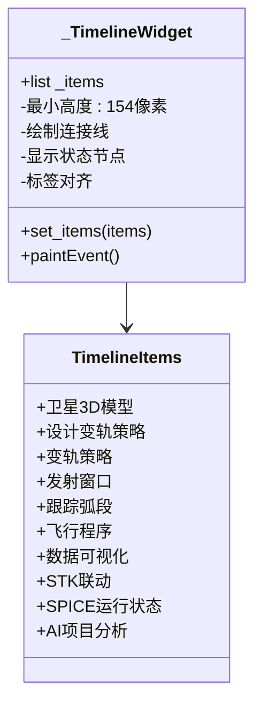

**图表来源**
- [dashboard_page.py:184-225](file://src/smart/ui/widgets/dashboard_page.py#L184-L225)

时间线按照逻辑顺序排列，使用不同颜色表示模块状态：
- **绿色**：就绪状态
- **青色**：加载中
- **黄色**：规划中
- **红色**：未连接

**章节来源**
- [dashboard_page.py:184-225](file://src/smart/ui/widgets/dashboard_page.py#L184-L225)

### 数据绑定机制

仪表板采用双向数据绑定机制，确保界面与数据源的实时同步：

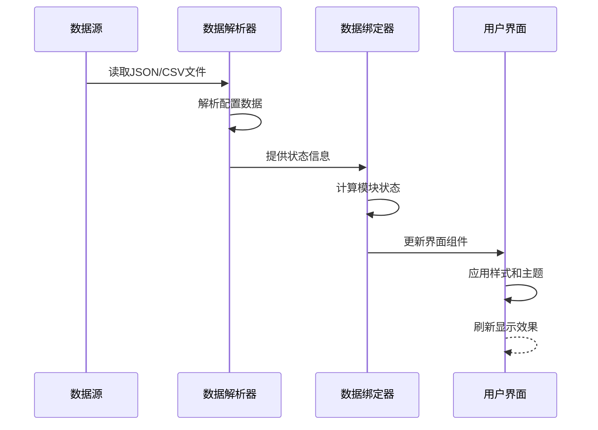

**图表来源**
- [dashboard_page.py:558-850](file://src/smart/ui/widgets/dashboard_page.py#L558-L850)

数据绑定的具体实现包括：
1. **文件监控**：自动检测项目文件的变化
2. **状态计算**：基于文件存在性和内容计算模块状态
3. **实时更新**：通过信号槽机制触发界面更新
4. **缓存机制**：避免重复的文件读取操作

**章节来源**
- [dashboard_page.py:558-850](file://src/smart/ui/widgets/dashboard_page.py#L558-L850)

## 依赖关系分析

仪表板页面与多个系统组件存在复杂的依赖关系，形成了完整的功能生态系统：

### 核心依赖关系

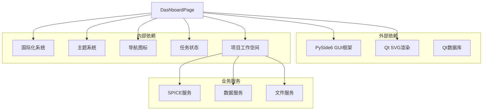

**图表来源**
- [dashboard_page.py:10-16](file://src/smart/ui/widgets/dashboard_page.py#L10-L16)
- [main_window.py:6-26](file://src/smart/ui/main_window.py#L6-L26)

### 数据流依赖

仪表板页面的数据流遵循严格的依赖层次：

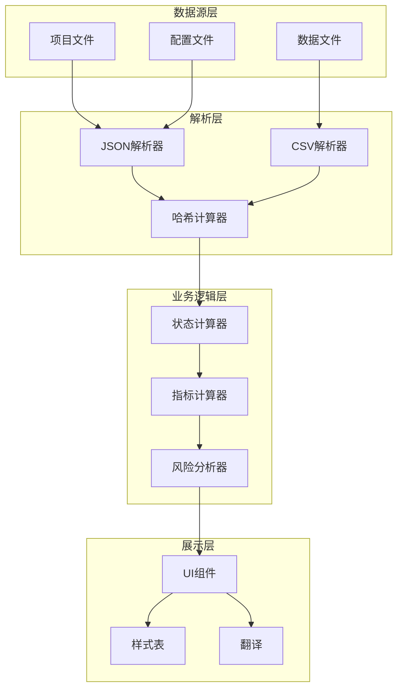

**图表来源**
- [dashboard_page.py:18-66](file://src/smart/ui/widgets/dashboard_page.py#L18-L66)
- [dashboard_page.py:558-850](file://src/smart/ui/widgets/dashboard_page.py#L558-L850)

**章节来源**
- [dashboard_page.py:10-16](file://src/smart/ui/widgets/dashboard_page.py#L10-L16)
- [main_window.py:6-26](file://src/smart/ui/main_window.py#L6-L26)

## 性能考虑

仪表板页面在设计时充分考虑了性能优化，采用了多种技术手段确保流畅的用户体验：

### 性能优化策略

| 优化技术 | 实现方式 | 性能收益 |
|----------|----------|----------|
| 惰性加载 | 仅在显示时解析文件 | 减少启动时间 |
| 缓存机制 | 文件哈希缓存 | 避免重复计算 |
| 异步更新 | 信号槽异步处理 | 提高响应性 |
| 内存管理 | 及时释放资源 | 控制内存占用 |

### 内存使用分析

仪表板页面的内存使用遵循以下模式：
- **静态资源**：图标、样式表等一次性加载
- **动态数据**：项目文件内容按需解析
- **临时对象**：解析过程中的中间对象及时清理

### 响应时间优化

通过以下措施优化用户交互响应：
- **延迟初始化**：非关键组件延迟创建
- **增量更新**：仅更新发生变化的部分
- **批处理操作**：合并多个UI更新操作

## 故障排除指南

### 常见问题及解决方案

#### 项目文件读取失败
**症状**：仪表板显示空白或错误信息  
**原因**：项目文件损坏或权限不足  
**解决方法**：
1. 检查项目目录权限
2. 验证 JSON 文件格式正确性
3. 重新创建项目文件

#### SPICE 服务不可用
**症状**：SPICE 相关功能无法使用  
**原因**：SPICE 运行时环境未正确配置  
**解决方法**：
1. 安装 SpiceyPy 依赖
2. 配置内核文件路径
3. 重新加载内核文件

#### 国际化显示异常
**症状**：界面文本显示为键名而非翻译  
**原因**：翻译文件加载失败或语言设置错误  
**解决方法**：
1. 检查翻译文件完整性
2. 验证语言代码正确性
3. 重新初始化 I18nManager

**章节来源**
- [dashboard_page.py:558-850](file://src/smart/ui/widgets/dashboard_page.py#L558-L850)
- [i18n.py:498-517](file://src/smart/ui/i18n.py#L498-L517)

## 结论

SMART 仪表板页面作为一个复杂而精密的用户界面组件，成功实现了以下目标：

### 设计成就
- **统一用户体验**：通过一致的视觉风格和交互模式
- **功能完整性**：涵盖所有核心功能模块的状态监控
- **可扩展性**：模块化设计支持新功能的无缝集成
- **性能优化**：高效的内存管理和响应式更新机制

### 技术亮点
- **先进的架构模式**：MVC 架构确保了良好的代码组织
- **灵活的主题系统**：支持视觉风格的动态切换
- **完善的国际化支持**：多语言环境下的本地化处理
- **强大的数据绑定**：实时反映项目状态变化

### 未来发展方向
1. **增强的可视化功能**：集成更丰富的图表和仪表盘
2. **智能状态预测**：基于历史数据的模块状态预测
3. **协作功能**：支持多用户协同工作的界面设计
4. **移动端适配**：响应式设计以支持平板和移动设备

仪表板页面不仅是一个功能组件，更是 SMART 项目设计理念和技术实力的集中体现，为用户提供了专业而高效的任务分析工作环境。

## 附录

### 配置选项

仪表板页面支持以下配置选项：

| 配置项 | 类型 | 默认值 | 描述 |
|--------|------|--------|------|
| sidebar/collapsed | 布尔值 | false | 侧边栏折叠状态 |
| recent_projects | 字符串列表 | [] | 最近打开的项目路径 |
| language | 字符串 | "zh" | 界面语言设置 |

### 扩展方法

开发者可以通过以下方式扩展仪表板功能：

1. **添加新模块卡片**：在 `_cards` 字典中添加新的功能模块
2. **自定义指标面板**：扩展 `_metrics` 字典添加新的 KPI 指标
3. **集成第三方服务**：通过服务接口集成外部工具和 API
4. **主题定制**：修改样式表文件实现视觉风格定制

### API 参考

仪表板页面的主要公共接口：

- `set_project(ProjectInfo | None)` - 设置当前项目
- `set_recent_projects(list[str])` - 设置最近项目列表
- `retranslate()` - 重新翻译界面文本
- `showEvent()` - 窗口显示事件处理

**章节来源**
- [dashboard_page.py:294-301](file://src/smart/ui/widgets/dashboard_page.py#L294-L301)
- [dashboard_page.py:964-984](file://src/smart/ui/widgets/dashboard_page.py#L964-L984)