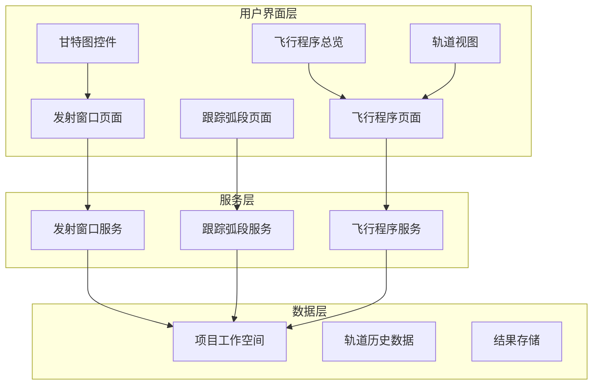
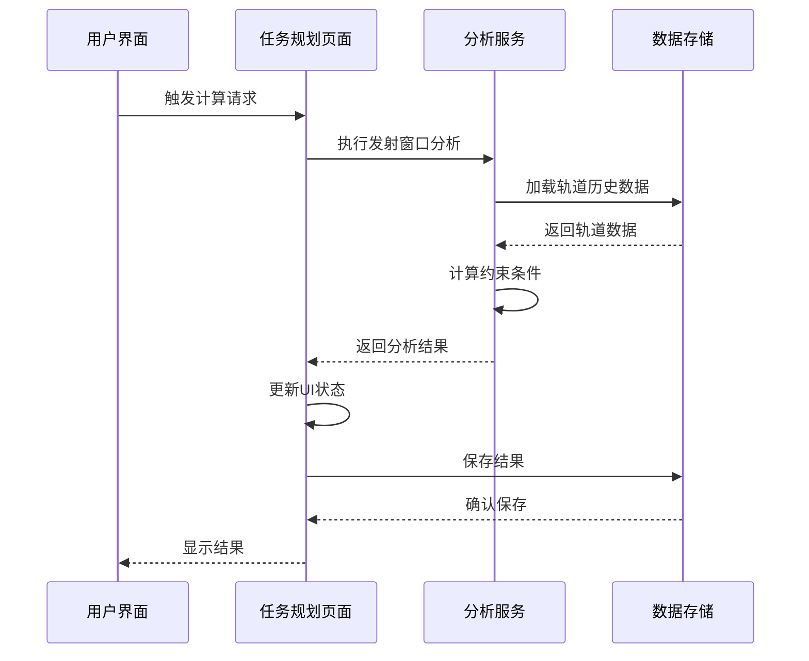
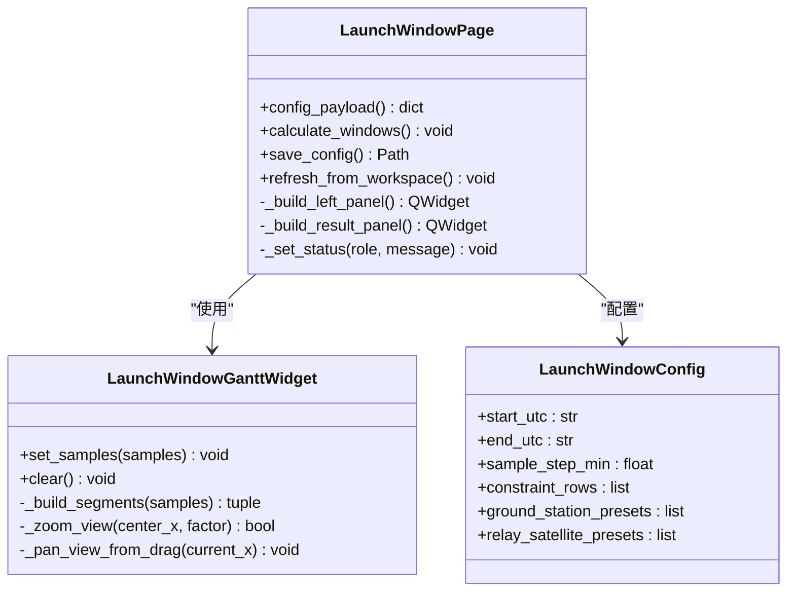
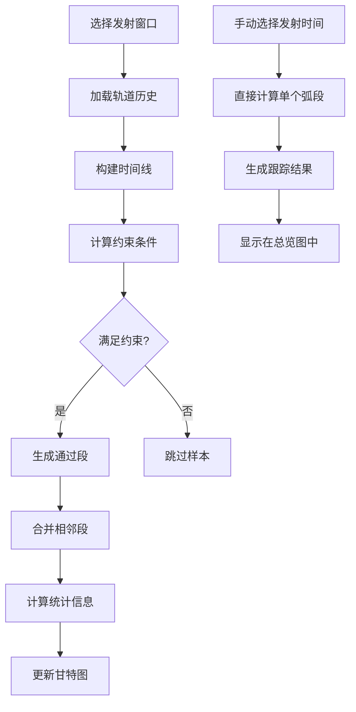
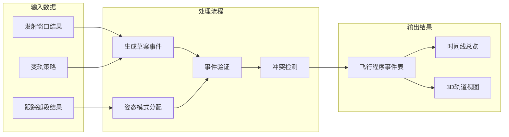
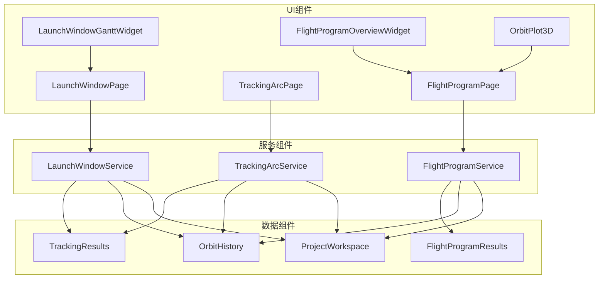

# 任务规划页面

<cite>
**本文档引用的文件**
- [launch_window_page.py](file://src/smart/ui/widgets/launch_window_page.py)
- [launch_window_gantt.py](file://src/smart/ui/widgets/launch_window_gantt.py)
- [tracking_arc_page.py](file://src/smart/ui/widgets/tracking_arc_page.py)
- [flight_program_page.py](file://src/smart/ui/widgets/flight_program_page.py)
- [flight_program_overview.py](file://src/smart/ui/widgets/flight_program_overview.py)
- [orbit_views.py](file://src/smart/ui/widgets/orbit_views.py)
- [launch_window.py](file://src/smart/services/launch_window.py)
- [tracking_arc.py](file://src/smart/services/tracking_arc.py)
- [flight_program.py](file://src/smart/services/flight_program.py)
</cite>

## 目录
1. [简介](#简介)
2. [项目结构](#项目结构)
3. [核心组件](#核心组件)
4. [架构概览](#架构概览)
5. [详细组件分析](#详细组件分析)
6. [依赖关系分析](#依赖关系分析)
7. [性能考虑](#性能考虑)
8. [故障排除指南](#故障排除指南)
9. [结论](#结论)

## 简介

任务规划页面是 SMART 系统中的核心功能模块，负责协调多个分析模块的结果，提供完整的任务设计流程。该页面集成了发射窗口分析、甘特图可视化、跟踪弧段分析和飞行程序设计四大核心功能，为航天任务规划提供了一体化的解决方案。

系统采用模块化架构设计，通过清晰的组件分离实现了高度的可维护性和扩展性。每个功能模块都有独立的用户界面组件和服务层实现，同时通过统一的项目工作空间进行数据集成和状态管理。

## 项目结构

任务规划页面的组织结构体现了清晰的分层架构：

**图表来源**
- [launch_window_page.py:348-408](file://src/smart/ui/widgets/launch_window_page.py#L348-L408)
- [tracking_arc_page.py:671-722](file://src/smart/ui/widgets/tracking_arc_page.py#L671-L722)
- [flight_program_page.py:70-184](file://src/smart/ui/widgets/flight_program_page.py#L70-L184)

**章节来源**
- [launch_window_page.py:348-408](file://src/smart/ui/widgets/launch_window_page.py#L348-L408)
- [tracking_arc_page.py:671-722](file://src/smart/ui/widgets/tracking_arc_page.py#L671-L722)
- [flight_program_page.py:70-184](file://src/smart/ui/widgets/flight_program_page.py#L70-L184)

## 核心组件

### 发射窗口分析组件

发射窗口分析组件提供了完整的发射条件评估和可视化功能：

- **参数配置面板**：支持发射时间范围、扫描步长、约束条件等参数设置
- **状态摘要显示**：实时展示当前配置的状态信息和资源设置
- **进度监控**：计算过程的进度条和状态反馈
- **结果导出**：CSV格式的结果文件导出功能

### 甘特图可视化组件

甘特图组件提供了直观的时间轴可视化：

- **多层级时间线**：支持发射窗口、约束条件、通过段等多种时间维度
- **交互式导航**：滚轮缩放、鼠标拖拽平移、双击重置等操作
- **颜色编码系统**：不同状态使用不同颜色区分（红色窗口、绿色通过）
- **工具提示**：悬停显示详细的时间信息和持续时间

### 跟踪弧段分析组件

跟踪弧段分析组件专注于测控可见性计算：

- **多资产支持**：地面站、中继星等不同类型的测控资源
- **可见性约束**：仰角、天线角度、相对位置等约束条件
- **弧段优化**：自动识别和优化测控弧段
- **统计汇总**：各资产的使用时间和最长连续段

### 飞行程序设计组件

飞行程序设计组件提供完整的任务时间线管理：

- **姿态模式管理**：SPM、EPM、AFM、Transition等不同姿态模式
- **事件表创建**：主要飞行事件和部署操作的表格管理
- **参考结果管理**：跟踪弧段结果的保存和加载
- **实时预览**：3D轨道视图和时间线总览

**章节来源**
- [launch_window_page.py:432-446](file://src/smart/ui/widgets/launch_window_page.py#L432-L446)
- [launch_window_gantt.py:35-88](file://src/smart/ui/widgets/launch_window_gantt.py#L35-L88)
- [tracking_arc_page.py:38-85](file://src/smart/ui/widgets/tracking_arc_page.py#L38-L85)
- [flight_program_page.py:290-373](file://src/smart/ui/widgets/flight_program_page.py#L290-L373)

## 架构概览

任务规划页面采用分层架构设计，确保了良好的模块化和可扩展性：

**图表来源**
- [launch_window.py:565-620](file://src/smart/services/launch_window.py#L565-L620)
- [tracking_arc.py:66-93](file://src/smart/services/tracking_arc.py#L66-L93)
- [flight_program.py:144-227](file://src/smart/services/flight_program.py#L144-L227)

系统的核心优势在于其模块化设计，每个组件都有明确的职责边界：

- **UI组件层**：负责用户交互和可视化展示
- **服务层**：提供核心算法和数据分析能力
- **数据层**：管理项目配置和结果存储
- **集成层**：协调各组件间的通信和数据流转

## 详细组件分析

### 发射窗口页面分析

发射窗口页面是任务规划的核心入口，提供了完整的发射条件评估功能：

**图表来源**
- [launch_window_page.py:348-800](file://src/smart/ui/widgets/launch_window_page.py#L348-L800)
- [launch_window_gantt.py:35-438](file://src/smart/ui/widgets/launch_window_gantt.py#L35-L438)
- [launch_window.py:64-100](file://src/smart/services/launch_window.py#L64-L100)

#### 约束扫描和结果筛选

发射窗口分析的核心功能包括：

1. **约束条件定义**：支持多种约束类型（无地影、可见性、角度限制等）
2. **参数化表达式**：支持基于变轨策略的时间参数表达式
3. **扫描算法**：按设定步长遍历发射时间范围
4. **结果合并**：将连续的通过样本合并为完整窗口

#### 可视化展示机制

甘特图采用层次化的时间轴设计：

- **窗口行**：红色显示发射窗口的通过情况
- **约束行**：每种约束条件单独一行，绿色显示通过段
- **交互功能**：支持缩放、平移、双击重置等操作
- **工具提示**：显示详细的时间范围和持续时间信息

**章节来源**
- [launch_window_page.py:472-551](file://src/smart/ui/widgets/launch_window_page.py#L472-L551)
- [launch_window_gantt.py:246-356](file://src/smart/ui/widgets/launch_window_gantt.py#L246-L356)
- [launch_window.py:195-209](file://src/smart/services/launch_window.py#L195-L209)

### 跟踪弧段页面分析

跟踪弧段页面专注于测控资源的可见性分析和优化：

**图表来源**
- [tracking_arc_page.py:424-475](file://src/smart/ui/widgets/tracking_arc_page.py#L424-L475)
- [tracking_arc.py:160-269](file://src/smart/services/tracking_arc.py#L160-L269)

#### 测控可见性计算

跟踪弧段分析的核心算法：

1. **资产建模**：将地面站和中继星建模为固定坐标系中的点
2. **几何计算**：计算卫星与测控资产的视线几何关系
3. **约束评估**：检查仰角、天线角度、相对位置等约束
4. **弧段生成**：将连续的通过状态合并为完整的弧段

#### 弧段优化策略

系统采用智能的弧段优化算法：

- **连续性检测**：识别相邻且时间接近的通过段
- **合并规则**：根据时间间隔和约束条件决定是否合并
- **统计汇总**：计算每种资产的使用情况和性能指标
- **可视化反馈**：在甘特图中直观展示优化结果

**章节来源**
- [tracking_arc_page.py:38-85](file://src/smart/ui/widgets/tracking_arc_page.py#L38-L85)
- [tracking_arc.py:271-325](file://src/smart/services/tracking_arc.py#L271-L325)

### 飞行程序页面分析

飞行程序页面提供完整的任务时间线管理和可视化：

**图表来源**
- [flight_program_page.py:424-475](file://src/smart/ui/widgets/flight_program_page.py#L424-L475)
- [flight_program.py:144-227](file://src/smart/services/flight_program.py#L144-L227)

#### 时间线生成机制

飞行程序的时间线生成遵循以下原则：

1. **事件优先级**：姿态事件优先于部署事件
2. **模式连续性**：确保姿态模式的连续转换
3. **约束满足**：所有事件都必须满足测控和轨道约束
4. **冲突避免**：自动检测和解决事件间的冲突

#### 参考结果管理

系统提供完善的参考结果管理功能：

- **自动保存**：每次计算后自动保存参考结果
- **版本控制**：支持多版本结果的对比和切换
- **快速加载**：支持之前计算结果的快速加载
- **结果验证**：自动验证结果的有效性和一致性

**章节来源**
- [flight_program_page.py:593-621](file://src/smart/ui/widgets/flight_program_page.py#L593-L621)
- [flight_program_overview.py:83-106](file://src/smart/ui/widgets/flight_program_overview.py#L83-L106)
- [flight_program.py:229-290](file://src/smart/services/flight_program.py#L229-L290)

## 依赖关系分析

任务规划页面的组件间依赖关系体现了清晰的分层架构：

**图表来源**
- [launch_window_page.py:13-40](file://src/smart/ui/widgets/launch_window_page.py#L13-L40)
- [tracking_arc_page.py:22-33](file://src/smart/ui/widgets/tracking_arc_page.py#L22-L33)
- [flight_program_page.py:42-60](file://src/smart/ui/widgets/flight_program_page.py#L42-L60)

### 组件耦合度分析

系统设计遵循低耦合高内聚的原则：

- **UI与服务分离**：界面组件只负责展示，逻辑处理由服务层完成
- **数据访问抽象**：通过工作空间统一管理数据访问
- **接口契约明确**：各组件间通过明确定义的接口进行通信
- **错误隔离**：异常处理在各自组件内部完成，不向外传播

### 外部依赖管理

系统对外部依赖进行了有效管理：

- **第三方库封装**：PySide6、NumPy、pyqtgraph等库的使用被封装在服务层
- **配置管理**：所有外部依赖都通过配置文件进行管理
- **版本兼容**：定期检查和更新依赖库版本，确保兼容性

**章节来源**
- [launch_window_page.py:13-40](file://src/smart/ui/widgets/launch_window_page.py#L13-L40)
- [tracking_arc_page.py:22-33](file://src/smart/ui/widgets/tracking_arc_page.py#L22-L33)
- [flight_program_page.py:42-60](file://src/smart/ui/widgets/flight_program_page.py#L42-L60)

## 性能考虑

任务规划页面在设计时充分考虑了性能优化：

### 计算效率优化

1. **向量化计算**：大量使用NumPy数组操作，避免Python循环
2. **缓存机制**：轨道历史数据和中间结果的智能缓存
3. **增量更新**：只更新发生变化的部分UI组件
4. **异步处理**：长时间计算使用后台线程执行

### 内存管理策略

- **数据共享**：多个组件共享相同的轨道历史数据
- **及时释放**：不再使用的中间结果及时释放内存
- **批量处理**：大量数据处理采用批处理方式

### 可扩展性设计

- **插件架构**：支持新的分析模块的插件化集成
- **配置驱动**：通过配置文件控制各种行为参数
- **模块化测试**：每个组件都有独立的单元测试

## 故障排除指南

### 常见问题诊断

#### 发射窗口计算异常

**症状**：计算过程中出现错误或结果为空

**可能原因**：
- 轨道历史数据格式不正确
- 参数配置超出合理范围
- 计算资源不足

**解决步骤**：
1. 检查轨道历史文件的完整性和格式
2. 验证发射时间范围的合理性
3. 查看系统内存和CPU使用情况
4. 重新启动应用程序

#### 甘特图显示异常

**症状**：甘特图无法正常显示或显示错误

**可能原因**：
- 数据格式不匹配
- 时间范围计算错误
- 渲染性能问题

**解决步骤**：
1. 检查传入数据的格式和完整性
2. 验证时间戳的正确性
3. 尝试调整视图范围
4. 清理浏览器缓存

#### 跟踪弧段分析失败

**症状**：跟踪弧段计算结果异常

**可能原因**：
- 测控资产配置错误
- 几何计算精度问题
- 约束条件过于严格

**解决步骤**：
1. 检查测控资产的坐标和参数
2. 验证约束条件的合理性
3. 调整计算精度参数
4. 简化约束条件进行测试

### 调试工具和方法

系统提供了多种调试和诊断工具：

- **日志记录**：详细的计算过程日志
- **状态监控**：实时显示系统状态和性能指标
- **错误报告**：友好的错误信息和修复建议
- **性能分析**：计算时间的详细统计和分析

**章节来源**
- [launch_window_page.py:796-807](file://src/smart/ui/widgets/launch_window_page.py#L796-L807)
- [tracking_arc_page.py:727-752](file://src/smart/ui/widgets/tracking_arc_page.py#L727-L752)
- [flight_program_page.py:185-224](file://src/smart/ui/widgets/flight_program_page.py#L185-L224)

## 结论

任务规划页面通过精心设计的模块化架构，成功整合了发射窗口分析、跟踪弧段计算和飞行程序设计三大核心功能。系统不仅提供了强大的分析能力，还通过直观的可视化界面和灵活的交互方式，大大提升了用户的使用体验。

### 主要成就

1. **功能完整性**：涵盖了任务规划的所有关键环节
2. **用户体验**：直观的界面设计和流畅的操作体验
3. **技术先进性**：采用了现代的软件架构和最佳实践
4. **可维护性**：清晰的代码结构和完善的测试体系

### 未来发展方向

- **算法优化**：进一步提升计算效率和精度
- **功能扩展**：支持更多的分析模型和约束条件
- **集成增强**：与其他航天系统的深度集成
- **智能化升级**：引入机器学习和人工智能技术

通过持续的改进和发展，任务规划页面将成为航天任务设计领域的重要工具，为未来的深空探测和卫星任务提供强有力的技术支撑。