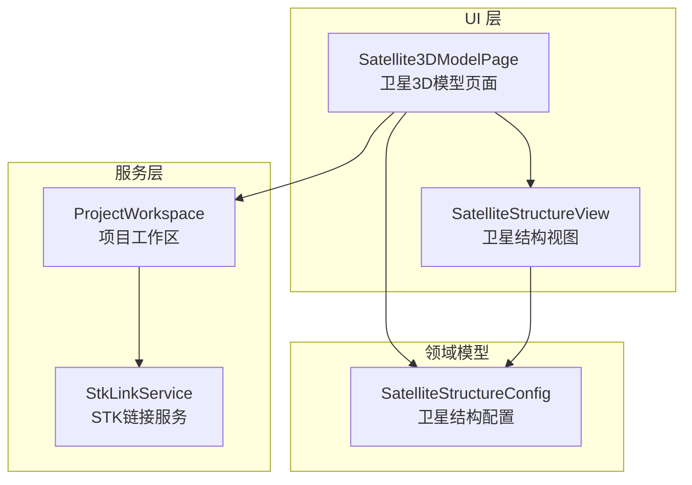
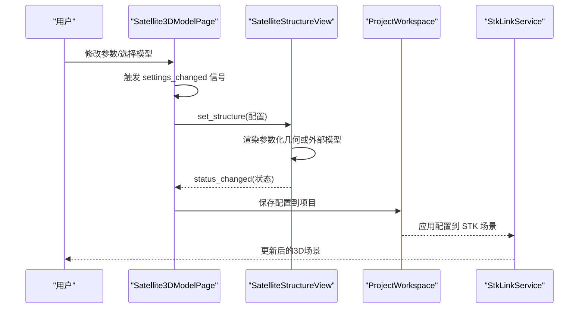
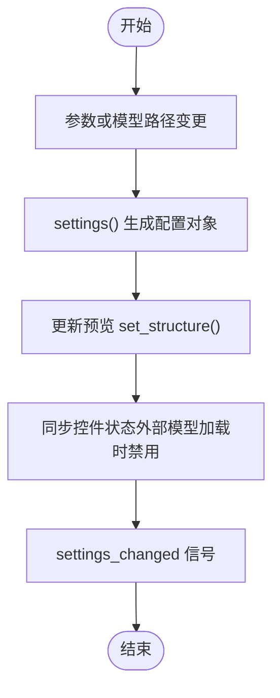
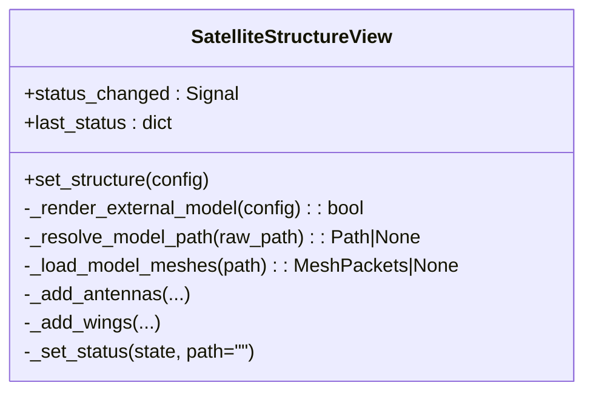
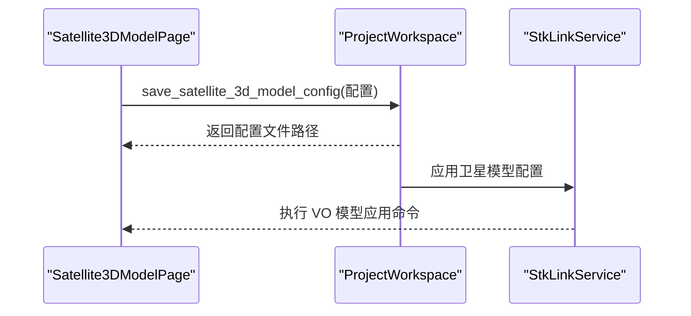
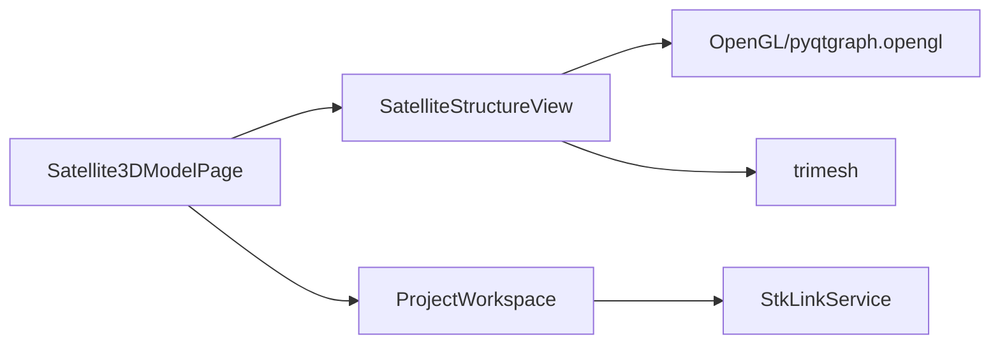

# 卫星配置页面

<cite>
**本文档引用的文件**
- [satellite_status_page.py](file://src/smart/ui/widgets/satellite_status_page.py)
- [satellite_structure_view.py](file://src/smart/ui/widgets/satellite_structure_view.py)
- [models.py](file://src/smart/domain/models.py)
- [project_workspace.py](file://src/smart/services/project_workspace.py)
- [stk_link.py](file://src/smart/services/stk_link.py)
- [test_project_workspace.py](file://tests/test_project_workspace.py)
</cite>

## 目录
1. [简介](#简介)
2. [项目结构](#项目结构)
3. [核心组件](#核心组件)
4. [架构总览](#架构总览)
5. [详细组件分析](#详细组件分析)
6. [依赖关系分析](#依赖关系分析)
7. [性能考虑](#性能考虑)
8. [故障排除指南](#故障排除指南)
9. [结论](#结论)
10. [附录](#附录)

## 简介
本文件系统性梳理卫星配置页面组件的设计架构与实现细节，重点覆盖以下方面：
- 卫星状态页面与卫星结构视图的职责划分与协作关系
- 卫星几何结构、载荷配置与物理属性的参数化建模与约束
- 3D 可视化组件的集成方式、模型渲染与交互控制
- 数据验证、参数约束与实时预览机制
- 与项目工作区的数据同步与持久化策略
- 扩展接口与自定义配置选项

该组件体系以数据驱动为核心，通过参数化的卫星结构配置对象驱动 3D 预览，并通过项目工作区服务实现配置的持久化与跨模块共享。

## 项目结构
卫星配置页面位于 UI 层，围绕两个关键部件组织：
- 卫星3D模型页面（UI 控件集合）：负责参数输入、实时预览触发与配置导出
- 卫星结构视图（3D 渲染器）：负责参数化几何体绘制与外部模型加载

二者通过信号槽机制进行数据交换，UI 页面在参数变化时发出变更信号，视图接收配置并即时更新渲染。

图表来源
- [satellite_status_page.py:25-72](file://src/smart/ui/widgets/satellite_status_page.py#L25-L72)
- [satellite_structure_view.py:66-131](file://src/smart/ui/widgets/satellite_structure_view.py#L66-L131)
- [models.py:188-204](file://src/smart/domain/models.py#L188-L204)
- [project_workspace.py:398-400](file://src/smart/services/project_workspace.py#L398-L400)
- [stk_link.py:472-489](file://src/smart/services/stk_link.py#L472-L489)

章节来源
- [satellite_status_page.py:25-72](file://src/smart/ui/widgets/satellite_status_page.py#L25-L72)
- [satellite_structure_view.py:66-131](file://src/smart/ui/widgets/satellite_structure_view.py#L66-L131)
- [models.py:188-204](file://src/smart/domain/models.py#L188-L204)

## 核心组件
- 卫星3D模型页面（Satellite3DModelPage）
  - 负责构建参数化界面（数值型与计数型字段）、文件选择与示例模型应用、实时预览触发与配置导出
  - 提供 settings_changed 信号，用于通知外部订阅者配置变更
- 卫星结构视图（SatelliteStructureView）
  - 负责 3D 渲染：参数化几何体（主体、天线、机翼太阳能板）与外部模型（DAE/GLB/GLTF）加载
  - 提供 status_changed 信号，反馈渲染状态（如模型加载成功、不支持等）
- 领域模型（SatelliteStructureConfig）
  - 定义卫星几何尺寸、载荷数量、面板参数与外部模型路径等字段
- 项目工作区（ProjectWorkspace）
  - 提供卫星3D模型配置的保存与加载能力，确保与项目生命周期一致
- STK 链接服务（StkLinkService）
  - 在 STK 场景中应用卫星3D模型配置，支持多种模型格式

章节来源
- [satellite_status_page.py:25-342](file://src/smart/ui/widgets/satellite_status_page.py#L25-L342)
- [satellite_structure_view.py:66-472](file://src/smart/ui/widgets/satellite_structure_view.py#L66-L472)
- [models.py:188-204](file://src/smart/domain/models.py#L188-L204)
- [project_workspace.py:398-400](file://src/smart/services/project_workspace.py#L398-L400)
- [stk_link.py:472-489](file://src/smart/services/stk_link.py#L472-L489)

## 架构总览
卫星配置页面采用“参数化配置 + 实时预览 + 外部模型加载”的三层架构：
- 参数化配置层：由 UI 控件收集用户输入，封装为配置对象
- 实时预览层：根据配置对象渲染参数化几何或外部模型
- 外部集成层：将配置写入项目工作区并在 STK 中应用

图表来源
- [satellite_status_page.py:212-296](file://src/smart/ui/widgets/satellite_status_page.py#L212-L296)
- [satellite_structure_view.py:132-211](file://src/smart/ui/widgets/satellite_structure_view.py#L132-L211)
- [project_workspace.py:398-400](file://src/smart/services/project_workspace.py#L398-L400)
- [stk_link.py:472-489](file://src/smart/services/stk_link.py#L472-L489)

## 详细组件分析

### 组件A：卫星3D模型页面（Satellite3DModelPage）
- 功能职责
  - 构建参数表单：数值型字段（尺寸、轴长、厚度等）与计数型字段（天线数量、机翼数量、每翼面板数）
  - 文件操作：模型路径选择、示例模型应用、对话框目录解析
  - 实时联动：参数变化即触发预览更新与配置导出
  - 国际化：所有标签与提示文本通过 I18nManager 动态翻译
- 关键流程
  - 参数变更 → 触发 settings_changed 信号 → 更新预览 → 同步控件状态（外部模型加载时禁用参数控件）
  - 模型路径变更 → 解析并尝试加载外部模型 → 更新状态标签
- 数据流
  - settings() → 生成配置对象 → apply_settings() → set_structure() → 视图渲染

图表来源
- [satellite_status_page.py:212-296](file://src/smart/ui/widgets/satellite_status_page.py#L212-L296)
- [satellite_status_page.py:238-259](file://src/smart/ui/widgets/satellite_status_page.py#L238-L259)

章节来源
- [satellite_status_page.py:25-342](file://src/smart/ui/widgets/satellite_status_page.py#L25-L342)

### 组件B：卫星结构视图（SatelliteStructureView）
- 功能职责
  - 参数化渲染：主体立方体、椭圆反射器天线阵列、机翼与面板网格
  - 外部模型加载：支持 DAE/GLB/GLTF；通过 trimesh 加载场景并逐网格渲染
  - 状态反馈：渲染状态（参数化/模型加载成功/不支持/失败等）通过信号对外广播
  - 相机与坐标系：内置网格与轴系辅助观察
- 关键算法
  - 参数化几何：基于尺寸与数量计算布局，使用序列位置函数生成均匀分布
  - 外部模型：路径解析、缓存、边界计算、网格样式推断与颜色着色
- 错误处理
  - OpenGL 初始化失败：显示不可用提示
  - trimesh 不可用：提示模型支持不可用
  - 路径不存在/扩展名不支持：提示找不到或无效扩展名

图表来源
- [satellite_structure_view.py:66-472](file://src/smart/ui/widgets/satellite_structure_view.py#L66-L472)

章节来源
- [satellite_structure_view.py:66-472](file://src/smart/ui/widgets/satellite_structure_view.py#L66-L472)

### 组件C：数据模型（SatelliteStructureConfig）
- 字段类别
  - 几何尺寸：主体三轴尺寸、天线主/短轴与深度、面板跨度/宽度/间隙
  - 结构数量：东西向天线数量、南北机翼数量、每翼面板数
  - 外部模型：模型路径字符串
- 默认值与约束
  - 默认值来源于领域模型，确保新项目具备合理初始形态
  - 渲染侧对关键参数设置下限，避免过小导致视觉异常

章节来源
- [models.py:188-204](file://src/smart/domain/models.py#L188-L204)
- [satellite_structure_view.py:146-156](file://src/smart/ui/widgets/satellite_structure_view.py#L146-L156)

### 组件D：项目工作区（ProjectWorkspace）
- 职责
  - 提供卫星3D模型配置的保存与加载接口
  - 与 STK 链接服务配合，在 STK 场景中应用模型配置
- 文件策略
  - 使用独立配置文件存储当前项目卫星3D模型参数
  - 自动清理历史遗留状态文件，保证配置一致性

图表来源
- [project_workspace.py:398-400](file://src/smart/services/project_workspace.py#L398-L400)
- [stk_link.py:472-489](file://src/smart/services/stk_link.py#L472-L489)

章节来源
- [project_workspace.py:398-400](file://src/smart/services/project_workspace.py#L398-L400)
- [stk_link.py:472-489](file://src/smart/services/stk_link.py#L472-L489)

## 依赖关系分析
- UI 页面依赖视图组件进行实时渲染
- 视图组件依赖 OpenGL 与可选的 trimesh 进行外部模型加载
- 页面与工作区通过配置对象进行数据交换
- 工作区与 STK 链接服务协作实现外部应用

图表来源
- [satellite_status_page.py:9-10](file://src/smart/ui/widgets/satellite_status_page.py#L9-L10)
- [satellite_structure_view.py:10-18](file://src/smart/ui/widgets/satellite_structure_view.py#L10-L18)
- [project_workspace.py:10-17](file://src/smart/services/project_workspace.py#L10-L17)
- [stk_link.py:472-489](file://src/smart/services/stk_link.py#L472-L489)

章节来源
- [satellite_status_page.py:9-10](file://src/smart/ui/widgets/satellite_status_page.py#L9-L10)
- [satellite_structure_view.py:10-18](file://src/smart/ui/widgets/satellite_structure_view.py#L10-L18)
- [project_workspace.py:10-17](file://src/smart/services/project_workspace.py#L10-L17)

## 性能考虑
- 外部模型加载采用缓存策略，避免重复解析同一路径场景
- 参数化渲染仅在配置变更时重建动态项，减少不必要的 GPU 操作
- 当 OpenGL 或 trimesh 不可用时，快速降级并提示，避免阻塞主线程
- 相机距离与视角根据整体尺寸动态调整，提升观察体验

## 故障排除指南
- 3D 预览不可用
  - 现象：显示 OpenGL 初始化失败提示
  - 排查：确认本地运行环境具备可用的 OpenGL 运行时
- 外部模型加载失败
  - 现象：状态提示模型加载失败或不支持
  - 排查：检查模型路径是否存在、扩展名是否受支持（DAE/GLB/GLTF），避免使用 STK 专用的.mdl 格式
- 参数控件被禁用
  - 现象：启用外部模型后，参数控件变为只读
  - 原因：外部模型加载成功后，参数化控件被禁用以避免冲突
- 配置未持久化
  - 现象：关闭页面后配置丢失
  - 排查：确认已调用保存接口并将配置写入项目工作区

章节来源
- [satellite_structure_view.py:75-87](file://src/smart/ui/widgets/satellite_structure_view.py#L75-L87)
- [satellite_structure_view.py:212-233](file://src/smart/ui/widgets/satellite_structure_view.py#L212-L233)
- [satellite_status_page.py:307-316](file://src/smart/ui/widgets/satellite_status_page.py#L307-L316)

## 结论
卫星配置页面通过清晰的分层设计实现了参数化配置与实时预览的无缝衔接。UI 页面负责交互与导出，视图组件负责渲染与状态反馈，工作区与 STK 链接服务保障了配置的持久化与外部应用。该架构具备良好的扩展性与可维护性，便于后续增加新的参数维度与外部模型格式支持。

## 附录

### 数据验证与参数约束
- 渲染侧最小阈值：对关键尺寸设置下限，防止过小导致不可见或渲染异常
- 外部模型扩展名：仅支持 DAE/GLB/GLTF；.mdl 不受支持
- 路径解析：优先使用显式路径，否则按候选扩展名尝试定位

章节来源
- [satellite_structure_view.py:146-156](file://src/smart/ui/widgets/satellite_structure_view.py#L146-L156)
- [satellite_structure_view.py:255-279](file://src/smart/ui/widgets/satellite_structure_view.py#L255-L279)

### 实时预览与状态反馈
- 页面参数变化 → settings_changed 信号 → 视图 set_structure() → 渲染更新
- 视图状态变化 → status_changed 信号 → 页面同步控件与状态标签

章节来源
- [satellite_status_page.py:212-296](file://src/smart/ui/widgets/satellite_status_page.py#L212-L296)
- [satellite_structure_view.py:402-410](file://src/smart/ui/widgets/satellite_structure_view.py#L402-L410)

### 项目工作区数据同步机制
- 保存：将配置对象序列化为 JSON 并写入项目配置目录
- 加载：从配置文件反序列化为配置对象，支持迁移与兼容
- STK 应用：通过 VO 模型命令将配置应用到 STK 场景

章节来源
- [project_workspace.py:398-400](file://src/smart/services/project_workspace.py#L398-L400)
- [test_project_workspace.py:350-380](file://tests/test_project_workspace.py#L350-L380)
- [stk_link.py:472-489](file://src/smart/services/stk_link.py#L472-L489)

### 扩展接口与自定义配置选项
- 新增参数字段：在配置对象中添加字段，并在 UI 表单中映射对应控件
- 新增外部模型格式：在路径解析与加载逻辑中扩展支持列表
- 自定义渲染样式：通过网格样式推断与颜色提升函数定制外观

章节来源
- [models.py:188-204](file://src/smart/domain/models.py#L188-L204)
- [satellite_structure_view.py:412-443](file://src/smart/ui/widgets/satellite_structure_view.py#L412-L443)