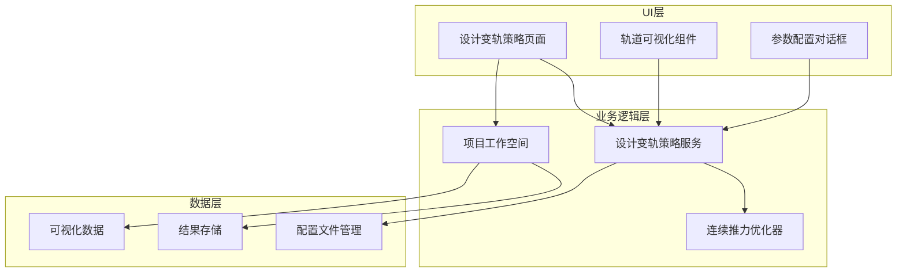
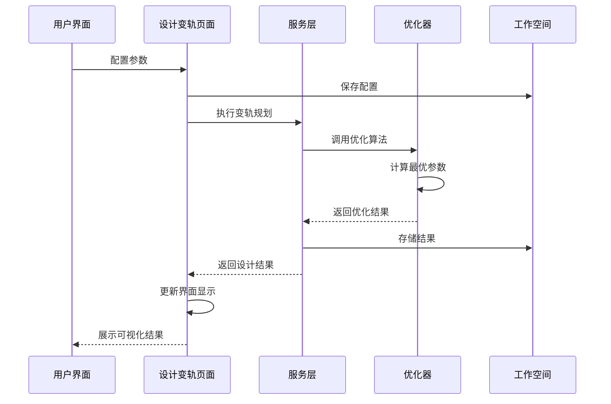
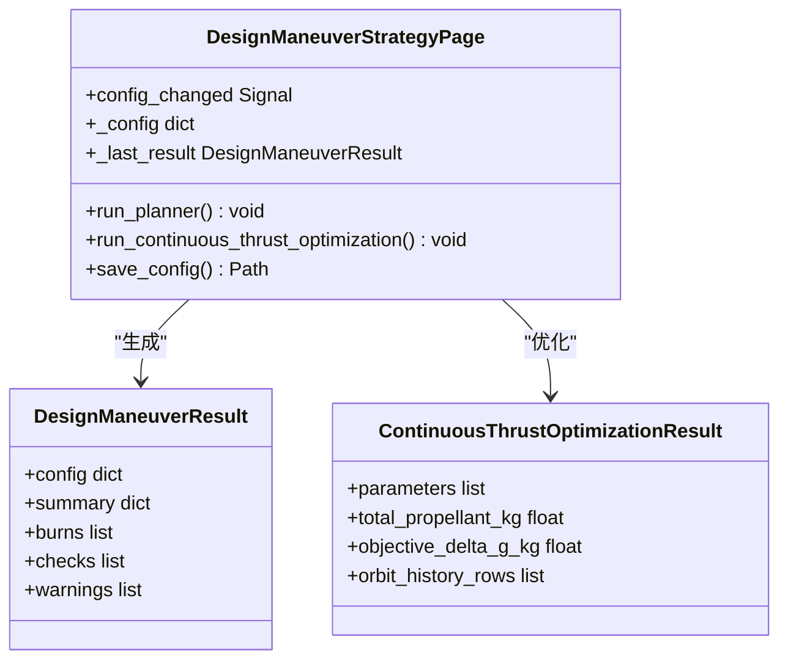
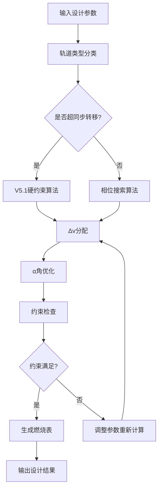
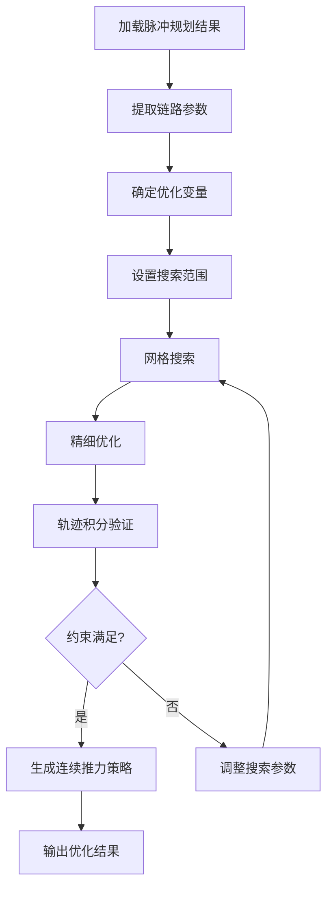
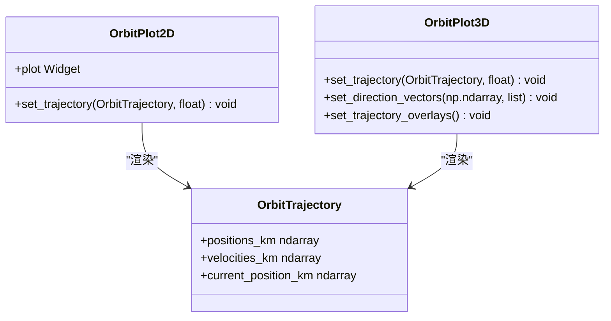
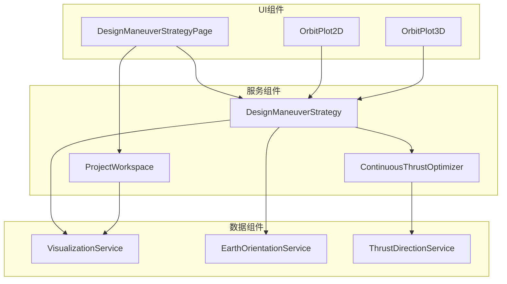

# 变轨设计页面

<cite>
**本文档引用的文件**
- [design_maneuver_strategy_page.py](file://src/smart/ui/widgets/design_maneuver_strategy_page.py)
- [design_maneuver_strategy.py](file://src/smart/services/design_maneuver_strategy.py)
- [design_continuous_thrust_optimizer.py](file://src/smart/services/design_continuous_thrust_optimizer.py)
- [project_workspace.py](file://src/smart/services/project_workspace.py)
- [data_visualization.py](file://src/smart/services/data_visualization.py)
- [orbit_views.py](file://src/smart/ui/widgets/orbit_views.py)
- [maneuver_page.py](file://src/smart/ui/widgets/maneuver_page.py)
- [README.md](file://README.md)
</cite>

## 目录
1. [简介](#简介)
2. [项目结构](#项目结构)
3. [核心组件](#核心组件)
4. [架构概览](#架构概览)
5. [详细组件分析](#详细组件分析)
6. [依赖关系分析](#依赖关系分析)
7. [性能考虑](#性能考虑)
8. [故障排除指南](#故障排除指南)
9. [结论](#结论)
10. [附录](#附录)

## 简介

变轨设计页面是SMART项目中的核心功能模块，负责支持脉冲变轨和连续推力优化算法的完整设计流程。该页面提供了直观的用户界面，使航天工程师能够配置复杂的变轨策略参数，执行优化计算，并可视化展示变轨结果。

本系统集成了先进的轨道力学算法，支持多种变轨类型（脉冲变轨、连续推力变轨）和优化策略，为卫星轨道转移、位置保持和轨道机动提供完整的解决方案。

## 项目结构

变轨设计页面位于SMART项目的UI层和业务逻辑层之间，采用分层架构设计：

**图表来源**
- [design_maneuver_strategy_page.py:120-252](file://src/smart/ui/widgets/design_maneuver_strategy_page.py#L120-L252)
- [design_maneuver_strategy.py:538-676](file://src/smart/services/design_maneuver_strategy.py#L538-L676)
- [project_workspace.py:64-117](file://src/smart/services/project_workspace.py#L64-L117)

**章节来源**
- [design_maneuver_strategy_page.py:120-252](file://src/smart/ui/widgets/design_maneuver_strategy_page.py#L120-L252)
- [project_workspace.py:64-117](file://src/smart/services/project_workspace.py#L64-L117)

## 核心组件

### 设计变轨策略页面

设计变轨策略页面是用户交互的核心界面，提供以下主要功能：

- **参数配置面板**：支持初始轨道、目标轨道、发动机参数等关键配置
- **高级设置对话框**：提供详细的优化参数和约束条件配置
- **实时状态监控**：显示计算进度和结果状态
- **结果可视化**：展示变轨燃烧表和连续推力参数

### 设计变轨策略服务

该服务实现了完整的变轨设计算法，包括：

- **脉冲变轨规划**：基于相位搜索和约束满足的变轨策略生成
- **连续推力优化**：针对低推力系统的参数优化算法
- **约束检查**：确保所有设计参数满足物理和工程约束
- **结果验证**：提供多维度的性能指标分析

### 连续推力优化器

专门处理连续推力变轨的优化算法：

- **参数化优化**：优化推力开始时间和偏航角参数
- **轨迹积分**：使用数值积分方法求解连续推力轨迹
- **约束满足**：确保终端条件和约束条件得到满足
- **性能评估**：计算推进剂消耗和轨道参数

**章节来源**
- [design_maneuver_strategy_page.py:120-800](file://src/smart/ui/widgets/design_maneuver_strategy_page.py#L120-L800)
- [design_maneuver_strategy.py:42-189](file://src/smart/services/design_maneuver_strategy.py#L42-L189)
- [design_continuous_thrust_optimizer.py:44-201](file://src/smart/services/design_continuous_thrust_optimizer.py#L44-L201)

## 架构概览

变轨设计页面采用模块化的架构设计，各组件之间通过清晰的接口进行通信：

**图表来源**
- [design_maneuver_strategy_page.py:697-783](file://src/smart/ui/widgets/design_maneuver_strategy_page.py#L697-L783)
- [design_maneuver_strategy.py:538-676](file://src/smart/services/design_maneuver_strategy.py#L538-L676)
- [project_workspace.py:241-331](file://src/smart/services/project_workspace.py#L241-L331)

## 详细组件分析

### 参数配置系统

设计变轨策略页面提供了全面的参数配置能力：

#### 基础参数配置
- **初始轨道参数**：半长轴、偏心率、倾角、升交点经度等
- **目标轨道参数**：目标半长轴、偏心率、倾角、经度等
- **发动机参数**：推力、比冲、沉底推力等

#### 高级参数配置
- **约束条件**：点火时长限制、Δv分配规则
- **优化权重**：不同目标函数的权重设置
- **搜索参数**：相位搜索范围和步长

**图表来源**
- [design_maneuver_strategy_page.py:120-252](file://src/smart/ui/widgets/design_maneuver_strategy_page.py#L120-L252)
- [design_maneuver_strategy.py:68-120](file://src/smart/services/design_maneuver_strategy.py#L68-L120)

**章节来源**
- [design_maneuver_strategy_page.py:123-174](file://src/smart/ui/widgets/design_maneuver_strategy_page.py#L123-L174)
- [design_maneuver_strategy_page.py:471-616](file://src/smart/ui/widgets/design_maneuver_strategy_page.py#L471-L616)

### 变轨策略优化算法

#### 脉冲变轨优化流程

脉冲变轨优化采用多阶段算法：

**图表来源**
- [design_maneuver_strategy.py:538-676](file://src/smart/services/design_maneuver_strategy.py#L538-L676)

#### 连续推力优化算法

连续推力优化采用参数化方法：

**图表来源**
- [design_continuous_thrust_optimizer.py:44-201](file://src/smart/services/design_continuous_thrust_optimizer.py#L44-L201)

**章节来源**
- [design_maneuver_strategy.py:538-676](file://src/smart/services/design_maneuver_strategy.py#L538-L676)
- [design_continuous_thrust_optimizer.py:247-369](file://src/smart/services/design_continuous_thrust_optimizer.py#L247-L369)

### 结果可视化系统

#### 轨道可视化组件

系统提供2D和3D双重可视化支持：

**图表来源**
- [orbit_views.py:104-154](file://src/smart/ui/widgets/orbit_views.py#L104-L154)
- [orbit_views.py:156-417](file://src/smart/ui/widgets/orbit_views.py#L156-L417)

#### 数据可视化分析

数据可视化页面提供深入的性能分析：

- **轨道参数曲线**：展示半长轴、偏心率、倾角等参数随时间变化
- **推进剂消耗分析**：显示推进剂使用情况和剩余量
- **机动事件标注**：突出显示重要的轨道机动时刻

**章节来源**
- [orbit_views.py:104-417](file://src/smart/ui/widgets/orbit_views.py#L104-L417)
- [data_visualization.py:21-107](file://src/smart/services/data_visualization.py#L21-L107)

### 性能指标分析

系统提供全面的性能指标评估：

#### 脉冲变轨性能指标
- **推进剂消耗**：总Δv需求和推进剂质量
- **轨道精度**：终端轨道参数误差
- **计算效率**：优化算法收敛性和计算时间

#### 连续推力性能指标
- **参数优化质量**：推力参数的最优性评估
- **轨迹跟踪精度**：连续推力轨迹与目标轨迹的偏差
- **约束满足度**：各种约束条件的满足程度

**章节来源**
- [design_maneuver_strategy.py:68-120](file://src/smart/services/design_maneuver_strategy.py#L68-L120)
- [design_continuous_thrust_optimizer.py:576-598](file://src/smart/services/design_continuous_thrust_optimizer.py#L576-L598)

## 依赖关系分析

变轨设计页面的组件间依赖关系如下：

**图表来源**
- [design_maneuver_strategy_page.py:11-37](file://src/smart/ui/widgets/design_maneuver_strategy_page.py#L11-L37)
- [design_maneuver_strategy.py:27-31](file://src/smart/services/design_maneuver_strategy.py#L27-L31)

**章节来源**
- [design_maneuver_strategy_page.py:11-37](file://src/smart/ui/widgets/design_maneuver_strategy_page.py#L11-L37)
- [design_maneuver_strategy.py:16-32](file://src/smart/services/design_maneuver_strategy.py#L16-L32)

## 性能考虑

### 计算复杂度优化

系统在多个层面进行了性能优化：

- **算法复杂度控制**：通过参数化搜索减少计算空间
- **缓存机制**：避免重复计算相同参数组合的结果
- **并行计算**：利用多核处理器加速数值积分计算

### 内存管理

- **数据结构优化**：使用NumPy数组提高内存效率
- **增量计算**：只存储必要的中间结果
- **垃圾回收**：及时释放不再使用的计算资源

### 用户体验优化

- **异步计算**：避免界面冻结影响用户体验
- **进度反馈**：实时显示计算进度和状态
- **错误恢复**：提供友好的错误处理和恢复机制

## 故障排除指南

### 常见问题及解决方案

#### 配置参数错误
- **症状**：参数验证失败或计算异常
- **原因**：输入参数超出有效范围或相互冲突
- **解决**：检查参数范围和单位，参考默认值配置

#### 计算收敛失败
- **症状**：优化算法无法找到可行解
- **原因**：约束条件过于严格或初始猜测不合适
- **解决**：放宽约束条件或调整搜索参数

#### 可视化显示异常
- **症状**：轨道显示不正确或图形渲染错误
- **原因**：OpenGL初始化失败或图形驱动问题
- **解决**：检查系统图形环境或使用2D视图

**章节来源**
- [design_maneuver_strategy_page.py:648-719](file://src/smart/ui/widgets/design_maneuver_strategy_page.py#L648-L719)
- [design_continuous_thrust_optimizer.py:576-598](file://src/smart/services/design_continuous_thrust_optimizer.py#L576-L598)

## 结论

变轨设计页面是一个功能完整、架构清晰的航天工程工具。它成功地将复杂的轨道力学算法与直观的用户界面相结合，为用户提供了一站式的变轨设计解决方案。

该系统的主要优势包括：

- **算法完整性**：支持脉冲变轨和连续推力两种主要变轨类型
- **参数丰富性**：提供全面的配置选项和约束条件
- **可视化能力**：强大的2D/3D可视化和数据分析功能
- **工程实用性**：经过实际项目验证的可靠算法

未来的发展方向包括算法性能进一步优化、更多变轨类型的扩展支持，以及更智能化的参数推荐功能。

## 附录

### API参考

#### 主要接口定义

| 接口名称 | 功能描述 | 输入参数 | 返回值 |
|---------|----------|----------|--------|
| `plan_design_maneuver_strategy` | 执行脉冲变轨规划 | 配置字典 | 设计结果对象 |
| `optimize_continuous_thrust_model_parameters` | 优化连续推力参数 | 设计结果 | 优化结果对象 |
| `export_continuous_thrust_maneuver_strategy_xlsx` | 导出连续推力策略 | 优化结果, 配置 | 文件路径 |

### 配置文件格式

系统使用JSON格式存储配置信息，支持版本管理和迁移：

- **设计变轨策略配置**：包含所有设计参数和约束条件
- **结果存储格式**：标准化的数据结构便于后续处理
- **项目元数据**：版本控制和项目信息管理

**章节来源**
- [project_workspace.py:241-331](file://src/smart/services/project_workspace.py#L241-L331)
- [design_maneuver_strategy.py:191-362](file://src/smart/services/design_maneuver_strategy.py#L191-L362)