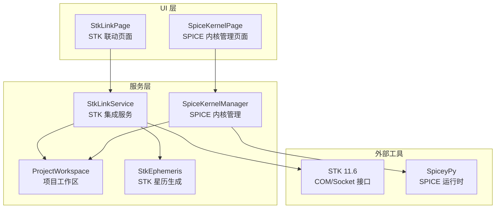
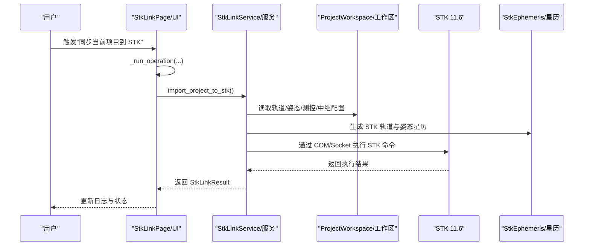
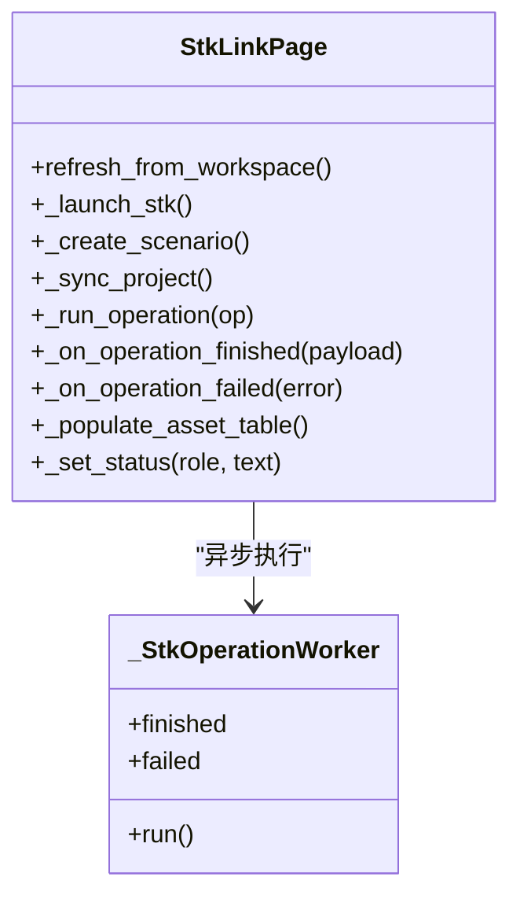
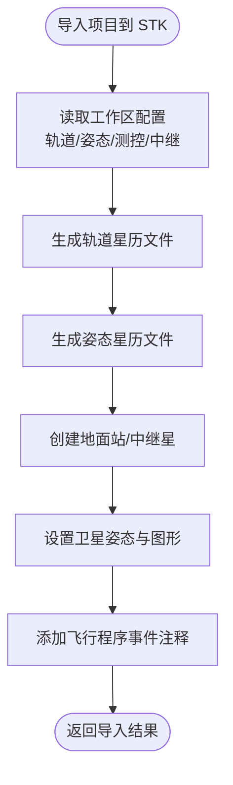
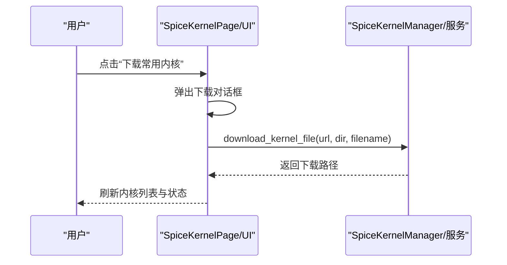
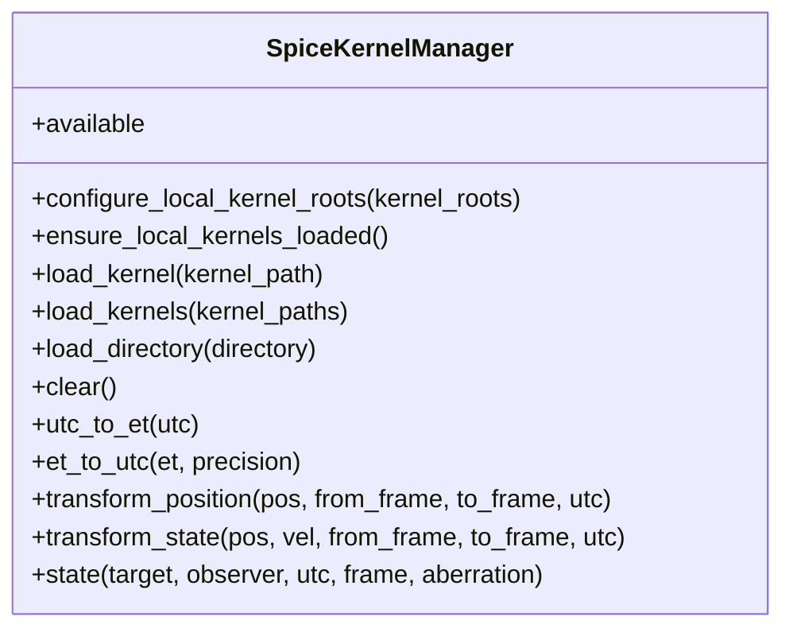
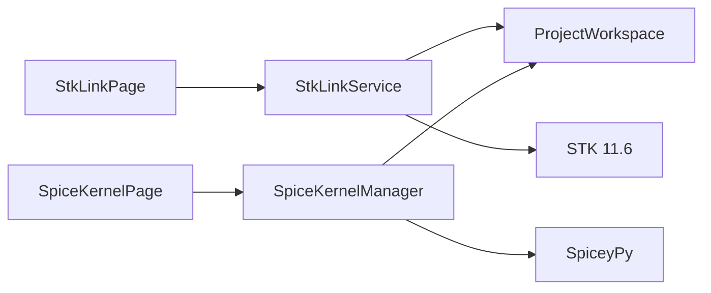

# 外部集成页面

<cite>
**本文引用的文件**
- [stk_link_page.py](file://src/smart/ui/widgets/stk_link_page.py)
- [stk_link.py](file://src/smart/services/stk_link.py)
- [spice_kernel_page.py](file://src/smart/ui/widgets/spice_kernel_page.py)
- [spice_service.py](file://src/smart/services/spice_service.py)
- [stk_ephemeris.py](file://src/smart/services/stk_ephemeris.py)
- [project_workspace.py](file://src/smart/services/project_workspace.py)
- [main_window.py](file://src/smart/ui/main_window.py)
- [spice_usage.md](file://doc/spice_usage.md)
- [README.md](file://README.md)
- [stk_11_6_operations.md](file://src/smart/agents/skills/stk_11_6_operations.md)
- [test_stk_link.py](file://tests/test_stk_link.py)
- [test_spice_service.py](file://tests/test_spice_service.py)
</cite>

## 目录
1. [简介](#简介)
2. [项目结构](#项目结构)
3. [核心组件](#核心组件)
4. [架构总览](#架构总览)
5. [详细组件分析](#详细组件分析)
6. [依赖分析](#依赖分析)
7. [性能考虑](#性能考虑)
8. [故障排除指南](#故障排除指南)
9. [结论](#结论)
10. [附录](#附录)

## 简介
本文件聚焦于 SMART 项目中的外部集成页面组件，具体包括：
- STK 联动页面：负责与 STK 11.6 的双向数据交换与场景管理，支持启动/连接 STK、创建新场景、将项目轨道、姿态、测控与中继资源同步至 STK，并记录执行日志。
- SPICE 内核管理页面：负责本地 SPICE 内核的扫描、加载、下载与运行状态监控，提供内核目录管理、批量加载、清理与状态提示。

该文档从架构、数据流、处理逻辑、集成机制、错误处理与重连、项目工作区同步与一致性、配置与性能调优、故障排除等方面进行系统化说明，帮助开发者与使用者高效理解与维护外部集成页面。

## 项目结构
外部集成页面位于 UI 层与服务层之间，UI 层负责交互与状态展示，服务层负责与外部工具（STK 11.6、SPICE）的通信与数据处理。

**图表来源**
- [stk_link_page.py:36-324](file://src/smart/ui/widgets/stk_link_page.py#L36-L324)
- [spice_kernel_page.py:200-554](file://src/smart/ui/widgets/spice_kernel_page.py#L200-L554)
- [stk_link.py:199-755](file://src/smart/services/stk_link.py#L199-L755)
- [spice_service.py:174-305](file://src/smart/services/spice_service.py#L174-L305)
- [stk_ephemeris.py:34-278](file://src/smart/services/stk_ephemeris.py#L34-L278)
- [project_workspace.py:64-800](file://src/smart/services/project_workspace.py#L64-L800)

**章节来源**
- [README.md:1-204](file://README.md#L1-L204)

## 核心组件
- STK 联动页面（UI）
  - 负责构建操作面板、日志面板、资产预览表格，触发 STK 连接、创建场景、同步项目到 STK 的操作。
  - 通过后台线程与工作器执行耗时操作，避免阻塞 UI。
- STK 集成服务（服务）
  - 提供 STK 连接、场景创建、项目数据导入、姿态与星历生成、事件注释、图形与模型应用等能力。
  - 支持 COM 与 Socket 两种连接方式，具备场景状态标记与恢复能力。
- SPICE 内核管理页面（UI）
  - 负责内核目录扫描、加载、下载、清理与状态提示，提供常用内核预设与自定义下载。
- SPICE 内核管理（服务）
  - 提供内核自动发现、加载、清理、UTC/ET 转换、坐标系变换、天体状态查询等接口。
  - 支持项目级与仓库级内核根目录配置与去重加载。

**章节来源**
- [stk_link_page.py:36-324](file://src/smart/ui/widgets/stk_link_page.py#L36-L324)
- [stk_link.py:199-755](file://src/smart/services/stk_link.py#L199-L755)
- [spice_kernel_page.py:200-554](file://src/smart/ui/widgets/spice_kernel_page.py#L200-L554)
- [spice_service.py:174-305](file://src/smart/services/spice_service.py#L174-L305)

## 架构总览
外部集成页面的总体架构围绕“UI 控制器 + 服务层 + 外部工具”的三层设计：
- UI 控制器负责用户交互与状态展示，通过后台线程异步执行服务层操作。
- 服务层封装与外部工具的交互细节，提供稳定的 API 与错误处理。
- 外部工具包括 STK 11.6（COM/Socket）与 SPICE（SpiceyPy），服务层负责连接、命令执行与数据转换。

**图表来源**
- [stk_link_page.py:182-202](file://src/smart/ui/widgets/stk_link_page.py#L182-L202)
- [stk_link.py:280-337](file://src/smart/services/stk_link.py#L280-L337)
- [stk_ephemeris.py:34-114](file://src/smart/services/stk_ephemeris.py#L34-L114)

## 详细组件分析

### STK 联动页面（UI）
- 操作面板
  - 启动本地 STK 11.6：尝试通过 COM/Socket 连接或启动应用。
  - 建立新场景：创建 STK 场景并设置分析时间窗。
  - 同步当前项目：将轨道、姿态、测控与中继资源导入 STK。
- 日志面板
  - 实时显示 STK 命令与生成文件路径，支持清空。
- 资产预览
  - 列出将被同步的测控资源（地面站/船、中继星），包含经纬度信息。
- 线程与状态
  - 使用 QThread + Worker 异步执行 STK 操作，防止 UI 阻塞。
  - 通过状态标签与样式属性提示连接状态与操作结果。

**图表来源**
- [stk_link_page.py:36-324](file://src/smart/ui/widgets/stk_link_page.py#L36-L324)

**章节来源**
- [stk_link_page.py:36-324](file://src/smart/ui/widgets/stk_link_page.py#L36-L324)

### STK 集成服务（服务）
- 连接与场景管理
  - 支持通过 COM 或 Socket 连接 STK 11.6，自动检测已打开场景并标记场景建立状态。
  - 提供创建新场景、同步分析时间窗、设置动画当前时间等功能。
- 项目数据导入
  - 从工作区读取轨道历史、姿态策略、测控与中继配置，生成 STK 轨道与姿态星历文件。
  - 导入地面站、中继星、卫星姿态与图形模型，添加飞行程序事件注释。
- 数据生成
  - 生成 STK 轨道星历（Ephemeris）与姿态星历（Attitude），确保时间戳与坐标系正确。
- 错误处理
  - 对 STK 命令失败、Socket 连接失败、COM 初始化失败等情况进行捕获与提示。

**图表来源**
- [stk_link.py:280-337](file://src/smart/services/stk_link.py#L280-L337)
- [stk_ephemeris.py:34-114](file://src/smart/services/stk_ephemeris.py#L34-L114)

**章节来源**
- [stk_link.py:199-755](file://src/smart/services/stk_link.py#L199-L755)
- [stk_ephemeris.py:34-278](file://src/smart/services/stk_ephemeris.py#L34-L278)

### SPICE 内核管理页面（UI）
- 功能概览
  - 扫描内核目录、加载单个/全部内核、清理已加载内核、打开内核目录、下载常用内核。
  - 实时显示运行状态、已加载内核数量与文件列表。
- 下载与校验
  - 提供常用内核预设与自定义 URL 下载，自动校验文件名与后缀。
- 状态提示
  - 通过状态标签与样式属性提示 SPICE 可用性与操作结果。

**图表来源**
- [spice_kernel_page.py:445-510](file://src/smart/ui/widgets/spice_kernel_page.py#L445-L510)
- [spice_service.py:133-172](file://src/smart/services/spice_service.py#L133-L172)

**章节来源**
- [spice_kernel_page.py:200-554](file://src/smart/ui/widgets/spice_kernel_page.py#L200-L554)
- [spice_service.py:174-305](file://src/smart/services/spice_service.py#L174-L305)

### SPICE 内核管理（服务）
- 自动发现与加载
  - 支持多种内核后缀（.tls/.tpc/.tf/.bsp/.bpc/.bc），按项目级与仓库级根目录扫描并去重加载。
- 时间与坐标转换
  - 提供 UTC/ET 转换、位置/状态向量变换、天体状态查询等核心接口。
- 运行时状态
  - 提供运行状态摘要，提示是否可用及加载建议。

**图表来源**
- [spice_service.py:174-305](file://src/smart/services/spice_service.py#L174-L305)

**章节来源**
- [spice_service.py:174-305](file://src/smart/services/spice_service.py#L174-L305)

## 依赖分析
- UI 与服务层耦合
  - StkLinkPage 依赖 StkLinkService 与 ProjectWorkspace；SpiceKernelPage 依赖 SpiceKernelManager 与 ProjectWorkspace。
- 外部工具依赖
  - STK 11.6：COM/Socket 接口，需安装 STK 11.6 并启用 Connect。
  - SPICE：SpiceyPy，需安装并准备常用内核。
- 数据一致性
  - 项目工作区提供统一的配置与数据文件路径，确保 UI 与服务层共享一致的数据源。

**图表来源**
- [main_window.py:53-136](file://src/smart/ui/main_window.py#L53-L136)
- [stk_link.py:199-217](file://src/smart/services/stk_link.py#L199-L217)
- [spice_service.py:174-182](file://src/smart/services/spice_service.py#L174-L182)

**章节来源**
- [main_window.py:53-136](file://src/smart/ui/main_window.py#L53-L136)

## 性能考虑
- 异步执行
  - STK 操作通过后台线程执行，避免阻塞 UI，提升响应性。
- 内核加载去重
  - SPICE 内核按文件名去重，避免重复加载，减少内存占用与初始化时间。
- 自动加载策略
  - SPICE 在首次调用时自动加载项目级与仓库级内核，减少手动干预。
- STK 星历生成
  - 采用高效的星历格式与插值方法，减少导入与渲染开销。

[本节为通用性能讨论，无需特定文件引用]

## 故障排除指南
- STK 11.6 无法连接
  - 检查 STK 是否已安装并启用 Connect；确认 COM/Socket 连接端口与主机配置。
  - 参考 STK 11.6 操作技能文档，获取帮助索引与命令参考。
- SPICE 不可用
  - 确认 SpiceyPy 已安装；检查内核目录与文件后缀是否受支持。
  - 使用页面内置的运行状态提示，确认内核是否成功加载。
- 同步失败
  - 查看 STK 操作日志，确认命令执行结果与生成文件路径。
  - 检查项目工作区配置文件是否完整，特别是轨道历史与姿态策略。
- 重连与恢复
  - 服务层具备场景状态标记与恢复能力，断开后可重新连接并恢复场景。

**章节来源**
- [stk_11_6_operations.md:19-32](file://src/smart/agents/skills/stk_11_6_operations.md#L19-L32)
- [spice_usage.md:1-235](file://doc/spice_usage.md#L1-L235)
- [test_stk_link.py:1-390](file://tests/test_stk_link.py#L1-L390)
- [test_spice_service.py:1-199](file://tests/test_spice_service.py#L1-L199)

## 结论
外部集成页面通过清晰的 UI 与服务分层设计，实现了与 STK 11.6 和 SPICE 的稳定集成。STK 联动页面提供了完整的场景管理与数据同步能力，SPICE 内核管理页面则保障了时间与坐标转换的准确性与一致性。配合项目工作区的数据落盘与 UI 自动保存机制，外部集成页面形成了可靠的任务分析与工程化闭环。

[本节为总结性内容，无需特定文件引用]

## 附录

### 外部集成页面与项目工作区的数据同步与一致性
- 项目工作区提供统一的配置与数据文件路径，UI 与服务层共享同一份数据源。
- 主窗口在项目激活/关闭时自动重置 SPICE 工作空间，确保内核加载与状态一致。
- UI 自动保存机制在关键事件发生时持久化配置与结果，避免数据丢失。

**章节来源**
- [project_workspace.py:64-800](file://src/smart/services/project_workspace.py#L64-L800)
- [main_window.py:53-136](file://src/smart/ui/main_window.py#L53-L136)

### 配置管理与性能调优
- STK 11.6
  - 通过 COM/Socket 连接，优先使用已打开场景以减少启动开销。
  - 合理设置场景分析时间窗，避免不必要的长时间计算。
- SPICE
  - 将常用内核放置在项目级 data/kernels/，优先于仓库级内核。
  - 使用自动加载策略，减少手动加载次数。
  - 合理组织内核后缀与命名，避免重复加载。

**章节来源**
- [spice_usage.md:54-96](file://doc/spice_usage.md#L54-L96)
- [README.md:161-186](file://README.md#L161-L186)