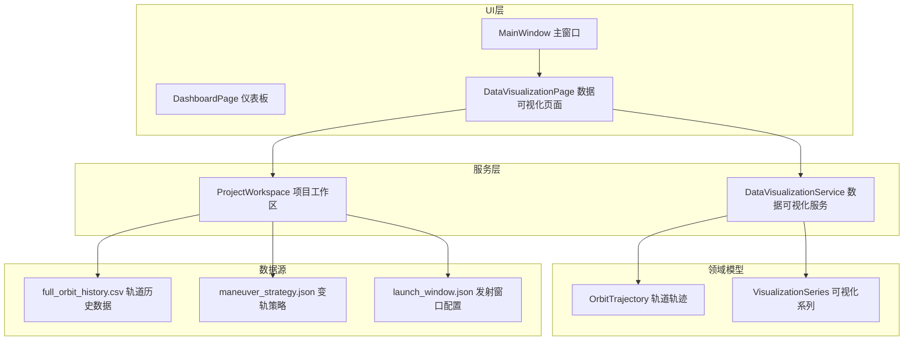
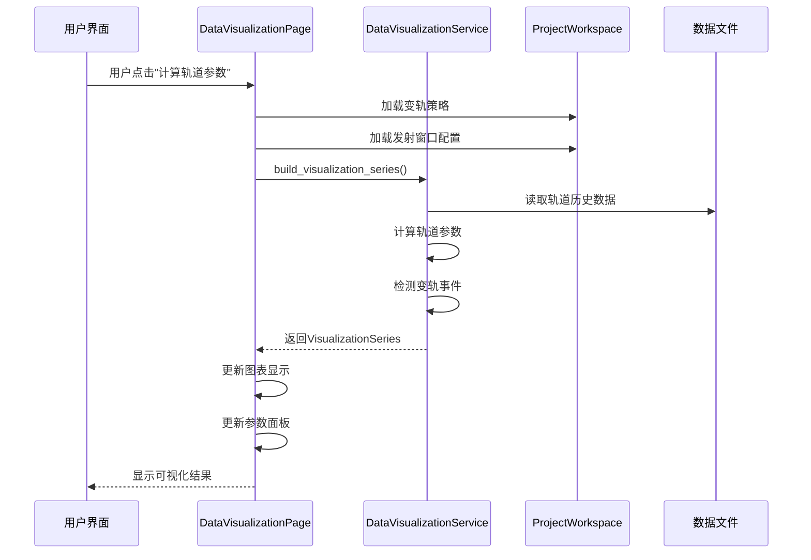
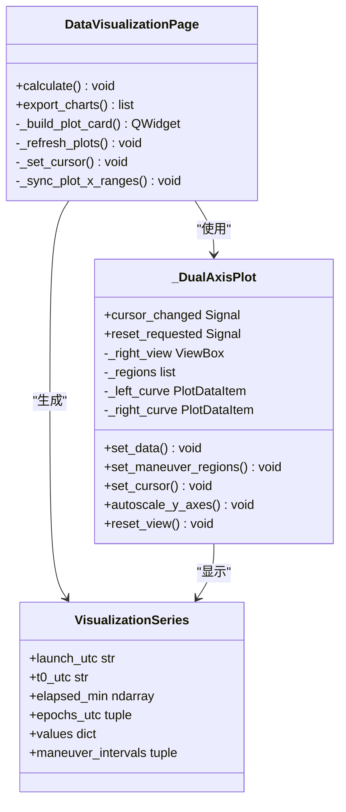
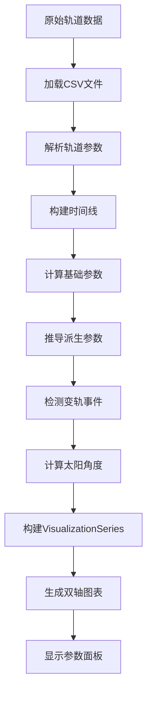
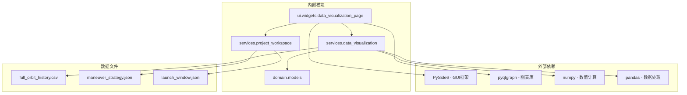
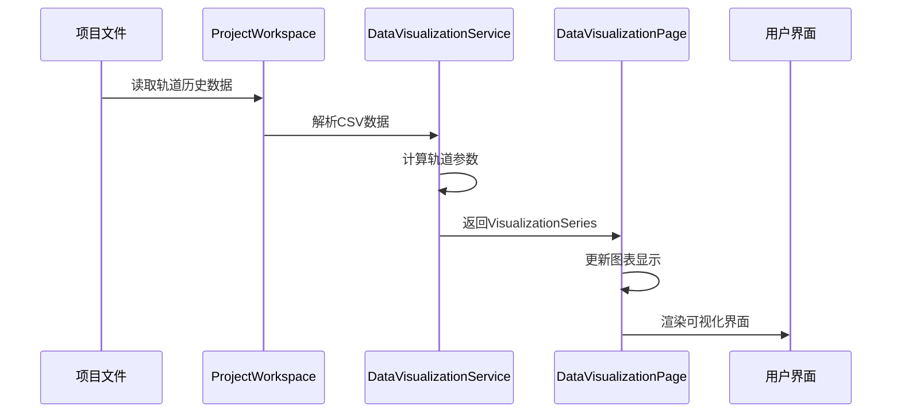

# 数据可视化页面

<cite>
**本文档引用的文件**
- [data_visualization_page.py](file://src/smart/ui/widgets/data_visualization_page.py)
- [data_visualization.py](file://src/smart/services/data_visualization.py)
- [project_workspace.py](file://src/smart/services/project_workspace.py)
- [models.py](file://src/smart/domain/models.py)
- [dashboard_page.py](file://src/smart/ui/widgets/dashboard_page.py)
- [main_window.py](file://src/smart/ui/main_window.py)
- [full_orbit_history.csv](file://projects/F4/data/full_orbit_history.csv)
- [test_data_visualization.py](file://tests/test_data_visualization.py)
</cite>

## 目录
1. [简介](#简介)
2. [项目结构](#项目结构)
3. [核心组件](#核心组件)
4. [架构概览](#架构概览)
5. [详细组件分析](#详细组件分析)
6. [依赖关系分析](#依赖关系分析)
7. [性能考虑](#性能考虑)
8. [故障排除指南](#故障排除指南)
9. [结论](#结论)

## 简介

数据可视化页面是SMART项目中的核心功能模块，负责展示卫星轨道参数的可视化分析。该页面集成了多种图表类型和交互式分析工具，为用户提供直观的轨道数据分析界面。

主要功能包括：
- 多参数轨道参数曲线绘制
- 双轴联动图表显示
- 实时时间线交互控制
- 发射窗口和变轨事件标注
- 导出功能支持
- 国际化本地化支持

## 项目结构

数据可视化页面在SMART项目中的组织结构如下：

**图表来源**
- [main_window.py:110-125](file://src/smart/ui/main_window.py#L110-L125)
- [data_visualization_page.py:282-341](file://src/smart/ui/widgets/data_visualization_page.py#L282-L341)
- [project_workspace.py:64-127](file://src/smart/services/project_workspace.py#L64-L127)

**章节来源**
- [main_window.py:110-125](file://src/smart/ui/main_window.py#L110-L125)
- [data_visualization_page.py:1-653](file://src/smart/ui/widgets/data_visualization_page.py#L1-L653)

## 核心组件

### 数据可视化页面主类

`DataVisualizationPage` 是整个可视化功能的核心组件，负责管理用户界面和数据处理逻辑。

**关键特性：**
- 双轴联动图表系统
- 实时时间线控制
- 参数选择器
- 发射时间配置
- 导出功能

### 可视化服务层

`data_visualization.py` 提供了完整的数据处理和分析能力：

**核心数据结构：**
- `VisualizationSeries`: 包含所有可视化所需的数据
- `PARAMETER_OPTIONS`: 参数选项配置
- `ManeuverInterval`: 变轨区间定义

**主要功能：**
- 轨道参数计算
- 时间线构建
- 变轨事件检测
- 太阳角度计算

### 项目工作区集成

`ProjectWorkspace` 提供了与项目数据的无缝集成：

**数据访问：**
- 自动加载变轨策略
- 发射窗口配置读取
- 轨道历史数据访问
- 结果导出支持

**章节来源**
- [data_visualization_page.py:282-653](file://src/smart/ui/widgets/data_visualization_page.py#L282-L653)
- [data_visualization.py:39-107](file://src/smart/services/data_visualization.py#L39-L107)
- [project_workspace.py:227-267](file://src/smart/services/project_workspace.py#L227-L267)

## 架构概览

数据可视化页面采用分层架构设计，确保了良好的可维护性和扩展性：

**图表来源**
- [data_visualization_page.py:346-373](file://src/smart/ui/widgets/data_visualization_page.py#L346-L373)
- [data_visualization.py:49-107](file://src/smart/services/data_visualization.py#L49-L107)
- [project_workspace.py:227-267](file://src/smart/services/project_workspace.py#L227-L267)

**章节来源**
- [data_visualization_page.py:346-373](file://src/smart/ui/widgets/data_visualization_page.py#L346-L373)
- [data_visualization.py:49-107](file://src/smart/services/data_visualization.py#L49-L107)

## 详细组件分析

### 双轴图表系统

双轴图表系统是数据可视化页面的核心组件，提供了强大的数据展示能力。

**图表来源**
- [data_visualization_page.py:44-280](file://src/smart/ui/widgets/data_visualization_page.py#L44-L280)
- [data_visualization_page.py:282-653](file://src/smart/ui/widgets/data_visualization_page.py#L282-L653)
- [data_visualization.py:39-47](file://src/smart/services/data_visualization.py#L39-L47)

#### 图表交互功能

**时间线控制：**
- 无限线标记当前位置
- 实时参数值显示
- 双轴同步缩放
- 右键重置视图

**参数选择：**
- 左轴参数选择器
- 右轴参数选择器
- 动态参数切换
- 单位自动适配

**变轨事件标注：**
- 变轨区间高亮显示
- 不同颜色区分
- 透明度调节
- 响应式布局

### 数据处理管道

数据处理管道负责从原始数据到可视化结果的完整转换过程：

**图表来源**
- [data_visualization.py:49-107](file://src/smart/services/data_visualization.py#L49-L107)
- [data_visualization.py:144-171](file://src/smart/services/data_visualization.py#L144-L171)

#### 参数计算逻辑

**基础参数计算：**
- 半长轴转换（米到千米）
- 偏心率保持不变
- 轨道倾角转换（度）
- 近地点幅角转换（度）

**派生参数推导：**
- 平近点角计算
- 近地点高度推导
- 远地点高度推导
- 质量参数保持

**章节来源**
- [data_visualization.py:144-171](file://src/smart/services/data_visualization.py#L144-L171)
- [data_visualization.py:66-97](file://src/smart/services/data_visualization.py#L66-L97)

### 发射时间管理系统

发射时间管理是数据可视化的重要前置条件：

**默认发射时间计算：**
- 优先使用飞行程序选择的发射时间
- 其次使用变轨策略的T0时间
- 最后使用当前UTC时间

**时间格式处理：**
- 北京时间显示格式
- UTC时间内部存储
- 时区自动转换
- 格式化输出

**章节来源**
- [data_visualization_page.py:564-580](file://src/smart/ui/widgets/data_visualization_page.py#L564-L580)
- [data_visualization.py:110-127](file://src/smart/services/data_visualization.py#L110-L127)

## 依赖关系分析

数据可视化页面的依赖关系体现了清晰的分层架构：

**图表来源**
- [data_visualization_page.py:1-25](file://src/smart/ui/widgets/data_visualization_page.py#L1-L25)
- [data_visualization.py:1-18](file://src/smart/services/data_visualization.py#L1-L18)

**章节来源**
- [data_visualization_page.py:1-25](file://src/smart/ui/widgets/data_visualization_page.py#L1-L25)
- [data_visualization.py:1-18](file://src/smart/services/data_visualization.py#L1-L18)

### 数据流分析

数据流从项目文件到用户界面的完整路径：

**图表来源**
- [project_workspace.py:227-267](file://src/smart/services/project_workspace.py#L227-L267)
- [data_visualization.py:49-66](file://src/smart/services/data_visualization.py#L49-L66)
- [data_visualization_page.py:444-460](file://src/smart/ui/widgets/data_visualization_page.py#L444-L460)

**章节来源**
- [project_workspace.py:227-267](file://src/smart/services/project_workspace.py#L227-L267)
- [data_visualization.py:49-66](file://src/smart/services/data_visualization.py#L49-L66)

## 性能考虑

### 内存优化策略

**数据结构优化：**
- 使用numpy数组进行数值计算
- 避免重复数据拷贝
- 及时释放不需要的中间变量
- 使用内存映射处理大文件

**渲染性能优化：**
- 图表数据分块渲染
- 惰性加载机制
- 缓存计算结果
- 防抖处理用户交互

### 计算效率提升

**算法优化：**
- 向量化操作替代循环
- 并行计算支持
- 近似算法应用
- 数据预处理

**资源管理：**
- 连接池管理
- 文件句柄及时关闭
- 内存使用监控
- 异常情况下的资源清理

## 故障排除指南

### 常见问题诊断

**数据加载失败：**
- 检查CSV文件格式完整性
- 验证字段名称一致性
- 确认文件编码格式
- 检查文件权限设置

**图表显示异常：**
- 验证numpy版本兼容性
- 检查pyqtgraph安装状态
- 确认matplotlib后端配置
- 检查图形驱动程序

**性能问题排查：**
- 监控内存使用情况
- 分析CPU占用率
- 检查磁盘I/O性能
- 评估网络连接状态

### 错误处理机制

**异常捕获策略：**
- 详细的错误信息记录
- 用户友好的错误提示
- 自动恢复机制
- 完整的日志追踪

**章节来源**
- [data_visualization_page.py:364-366](file://src/smart/ui/widgets/data_visualization_page.py#L364-L366)
- [test_data_visualization.py:101-139](file://tests/test_data_visualization.py#L101-L139)

## 结论

数据可视化页面作为SMART项目的核心功能模块，展现了优秀的架构设计和实现质量。通过分层架构、清晰的职责分离和完善的错误处理机制，该页面为用户提供了强大而易用的轨道数据分析工具。

**主要优势：**
- 模块化设计便于维护和扩展
- 丰富的交互功能提升用户体验
- 高效的数据处理能力支持大规模数据
- 完善的错误处理机制确保系统稳定性

**未来改进方向：**
- 支持更多图表类型和可视化效果
- 增强实时数据更新能力
- 优化移动端适配
- 扩展自定义配置选项

该组件为整个SMART项目的可视化分析奠定了坚实的基础，为后续功能扩展提供了良好的技术支撑。