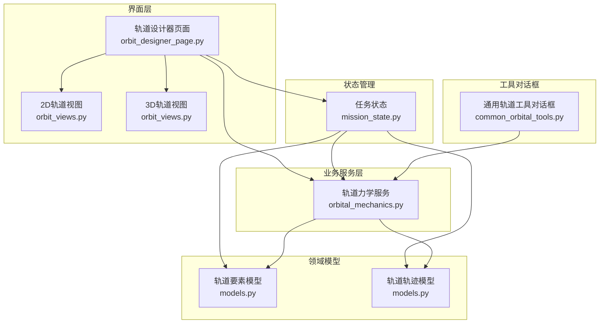
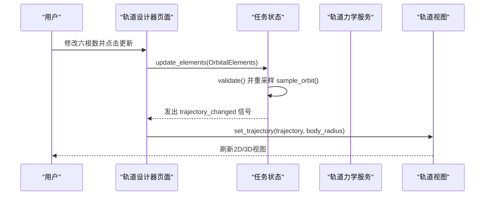
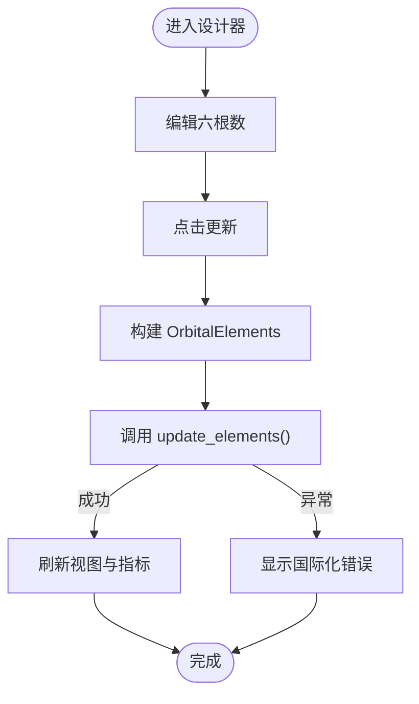
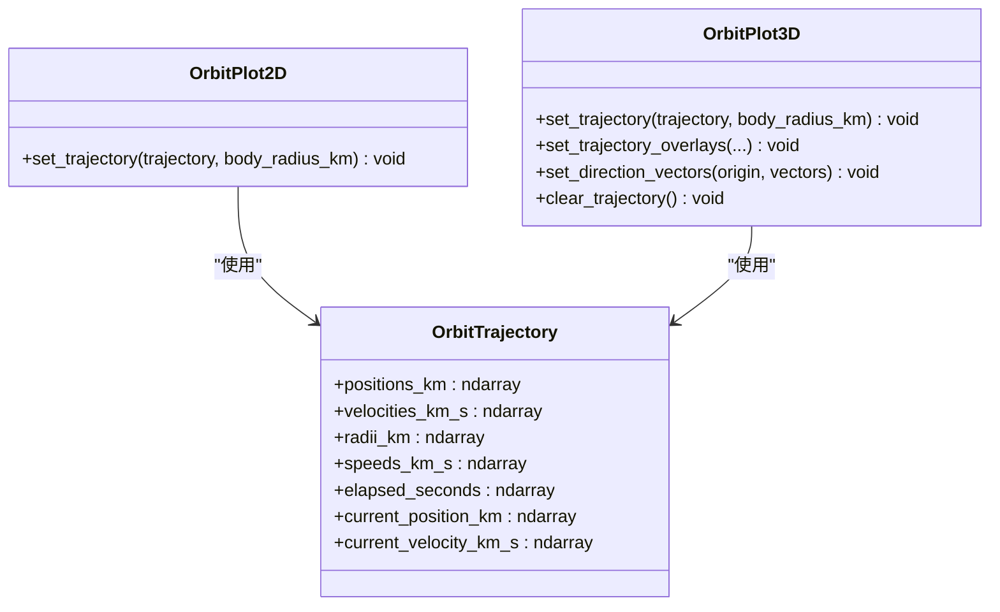
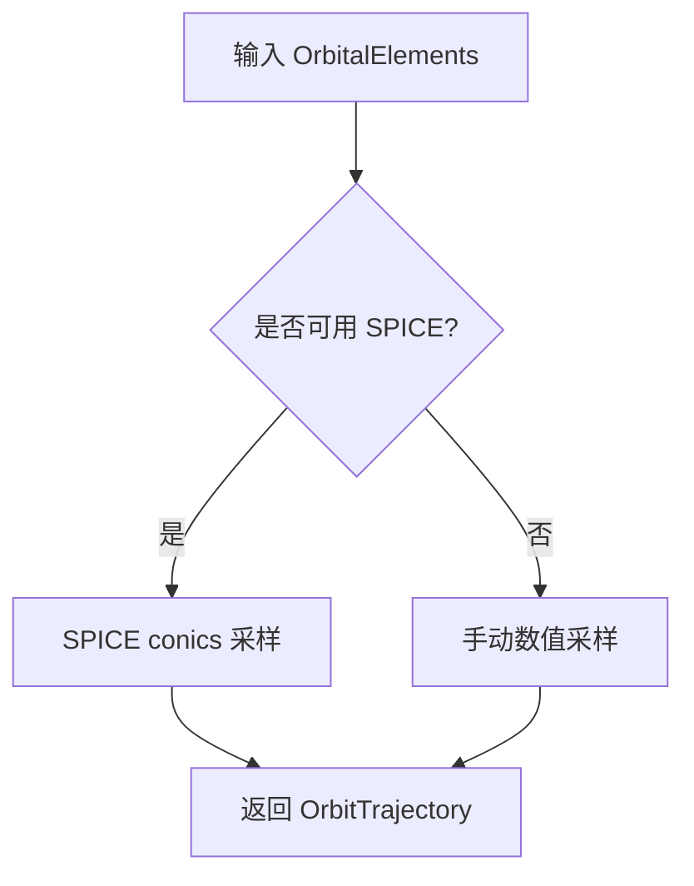
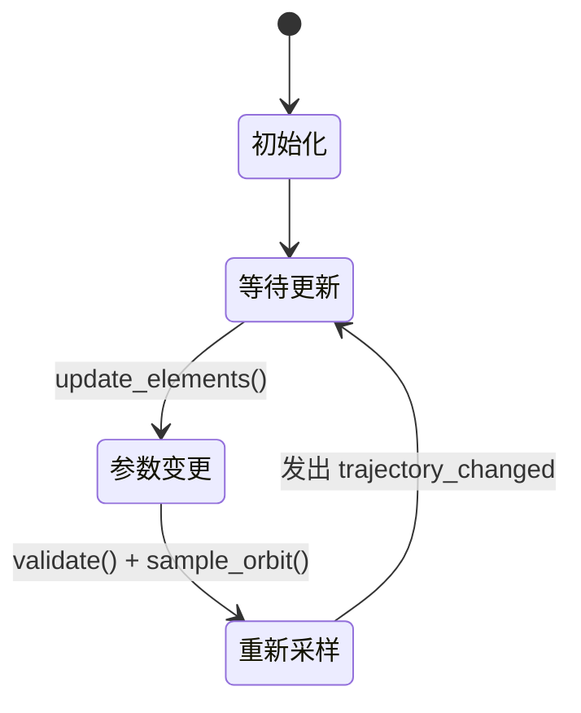
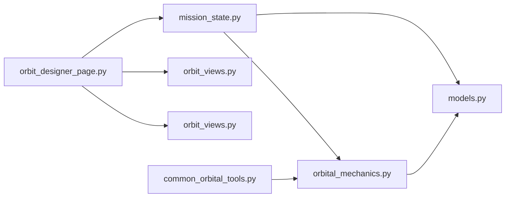

# 轨道设计页面

<cite>
**本文档引用的文件**
- [orbit_designer_page.py](file://src/smart/ui/widgets/orbit_designer_page.py)
- [orbit_views.py](file://src/smart/ui/widgets/orbit_views.py)
- [orbital_mechanics.py](file://src/smart/services/orbital_mechanics.py)
- [models.py](file://src/smart/domain/models.py)
- [mission_state.py](file://src/smart/ui/mission_state.py)
- [common_orbital_tools.py](file://src/smart/ui/widgets/common_orbital_tools.py)
</cite>

## 目录
1. [简介](#简介)
2. [项目结构](#项目结构)
3. [核心组件](#核心组件)
4. [架构总览](#架构总览)
5. [详细组件分析](#详细组件分析)
6. [依赖分析](#依赖分析)
7. [性能考虑](#性能考虑)
8. [故障排查指南](#故障排查指南)
9. [结论](#结论)
10. [附录](#附录)

## 简介
本文件系统性阐述“轨道设计页面”的功能与架构，重点覆盖以下方面：
- 轨道参数输入与校验
- 轨道工具集与辅助计算
- 可视化视图（2D/3D）的集成与渲染
- 多轨道模式支持与参数编辑
- 轨道轨迹的动态更新机制
- 性能优化策略与复杂度管理

该页面以“开普勒轨道”为核心，通过输入六根数（半长轴、偏心率、轨道倾角、升交点赤经、近地点幅角、真近点角）驱动轨道采样与渲染，并提供多种轨道工具用于快速换算与辅助规划。

## 项目结构
轨道设计页面位于用户界面层，围绕“参数输入 + 轨道采样 + 视图渲染”的主流程组织代码；服务层提供轨道力学计算，领域模型承载轨道要素与结果数据结构。

图表来源
- [orbit_designer_page.py:1-249](file://src/smart/ui/widgets/orbit_designer_page.py#L1-L249)
- [orbit_views.py:1-547](file://src/smart/ui/widgets/orbit_views.py#L1-L547)
- [orbital_mechanics.py:1-780](file://src/smart/services/orbital_mechanics.py#L1-L780)
- [models.py:1-255](file://src/smart/domain/models.py#L1-L255)
- [mission_state.py:1-45](file://src/smart/ui/mission_state.py#L1-L45)
- [common_orbital_tools.py:1-800](file://src/smart/ui/widgets/common_orbital_tools.py#L1-L800)

章节来源
- [orbit_designer_page.py:1-249](file://src/smart/ui/widgets/orbit_designer_page.py#L1-L249)
- [orbit_views.py:1-547](file://src/smart/ui/widgets/orbit_views.py#L1-L547)
- [orbital_mechanics.py:1-780](file://src/smart/services/orbital_mechanics.py#L1-L780)
- [models.py:1-255](file://src/smart/domain/models.py#L1-L255)
- [mission_state.py:1-45](file://src/smart/ui/mission_state.py#L1-L45)
- [common_orbital_tools.py:1-800](file://src/smart/ui/widgets/common_orbital_tools.py#L1-L800)

## 核心组件
- 轨道设计器页面（参数输入与控制）
  - 提供六根数输入控件与更新按钮，负责参数校验与触发状态更新
  - 展示轨道指标（周期、近地点/远地点高度、当前速度）
  - 绑定国际化文本与错误提示
- 轨道视图（2D/3D）
  - 2D视图：绘制轨道平面轨迹与当前位置标记，按最大半径自适应缩放
  - 3D视图：绘制地球球体纹理或默认色块、轨道轨迹、当前位置、起始点与方向箭头；可选显示机动段
- 轨道力学服务
  - 提供从六根数采样轨道、从状态矢量反推六根数、椭圆/圆轨道指标换算、近点角换算、拉格朗日轨道转移等
- 任务状态
  - 维护初始化设置、轨道要素与轨道轨迹，提供信号通知视图更新
- 通用轨道工具对话框
  - 提供“六根数↔状态矢量”转换、“近远地点参数”、“圆轨道周期/高度”、“近点角换算”、“太阳/月亮位置”等工具

章节来源
- [orbit_designer_page.py:81-148](file://src/smart/ui/widgets/orbit_designer_page.py#L81-L148)
- [orbit_views.py:104-154](file://src/smart/ui/widgets/orbit_views.py#L104-L154)
- [orbit_views.py:156-547](file://src/smart/ui/widgets/orbit_views.py#L156-L547)
- [orbital_mechanics.py:277-310](file://src/smart/services/orbital_mechanics.py#L277-L310)
- [mission_state.py:11-45](file://src/smart/ui/mission_state.py#L11-L45)
- [common_orbital_tools.py:315-496](file://src/smart/ui/widgets/common_orbital_tools.py#L315-L496)

## 架构总览
轨道设计页面采用“参数驱动 + 事件通知”的架构：
- 参数输入由用户在设计器中完成，点击更新后调用任务状态更新函数
- 任务状态内部验证参数并重新采样轨道，发出信号通知视图刷新
- 视图根据最新轨道轨迹与地球半径进行渲染与标注

图表来源
- [orbit_designer_page.py:150-167](file://src/smart/ui/widgets/orbit_designer_page.py#L150-L167)
- [mission_state.py:34-44](file://src/smart/ui/mission_state.py#L34-L44)
- [orbital_mechanics.py:277-310](file://src/smart/services/orbital_mechanics.py#L277-L310)
- [orbit_views.py:137-154](file://src/smart/ui/widgets/orbit_views.py#L137-L154)
- [orbit_views.py:341-417](file://src/smart/ui/widgets/orbit_views.py#L341-L417)

## 详细组件分析

### 轨道设计器页面（参数输入与指标展示）
- 控件布局
  - 左侧卡片：标题、副标题、六根数输入控件（半长轴、偏心率、倾角、RAAN、近地点幅角、真近点角）
  - 错误信息标签：国际化错误文案映射
  - 更新按钮：构建 OrbitalElements 并调用任务状态更新
  - 指标卡片：周期、近地点/远地点高度、当前速度
- 动态刷新
  - 订阅任务状态的轨迹变更信号，更新视图与指标
  - 国际化文本随语言切换自动更新

图表来源
- [orbit_designer_page.py:150-167](file://src/smart/ui/widgets/orbit_designer_page.py#L150-L167)
- [orbit_designer_page.py:168-184](file://src/smart/ui/widgets/orbit_designer_page.py#L168-L184)
- [orbit_designer_page.py:213-240](file://src/smart/ui/widgets/orbit_designer_page.py#L213-L240)

章节来源
- [orbit_designer_page.py:81-148](file://src/smart/ui/widgets/orbit_designer_page.py#L81-L148)
- [orbit_designer_page.py:150-184](file://src/smart/ui/widgets/orbit_designer_page.py#L150-L184)
- [orbit_designer_page.py:213-240](file://src/smart/ui/widgets/orbit_designer_page.py#L213-L240)

### 轨道视图（2D/3D 渲染与动态更新）
- 2D 视图
  - 使用二维绘图库绘制轨道轨迹与当前位置标记
  - 根据最大半径自适应坐标范围，保证地球与轨道完整可见
- 3D 视图
  - 使用 OpenGL 渲染地球球体（纹理或默认色），轨道线、当前位置、起始点与方向箭头
  - 支持信息叠加层（左上/右上/左下/右下）与相机位置自适应
  - 当 OpenGL 初始化失败时，显示不可用提示

图表来源
- [orbit_views.py:104-154](file://src/smart/ui/widgets/orbit_views.py#L104-L154)
- [orbit_views.py:156-547](file://src/smart/ui/widgets/orbit_views.py#L156-L547)
- [models.py:69-78](file://src/smart/domain/models.py#L69-L78)

章节来源
- [orbit_views.py:104-154](file://src/smart/ui/widgets/orbit_views.py#L104-L154)
- [orbit_views.py:156-547](file://src/smart/ui/widgets/orbit_views.py#L156-L547)
- [models.py:69-78](file://src/smart/domain/models.py#L69-L78)

### 轨道力学服务（多轨道模式与计算）
- 六根数到状态矢量
  - 在有 SPICE 时优先使用 SPICE 的解析方法，否则回退到手动数值实现
- 轨道采样
  - 生成均匀分布的真近点角，计算对应位置/速度与半径/速度序列
- 圆/椭圆轨道指标换算
  - 圆轨道：高度/周期互算，导出周期、速度、逃逸速度、平均角速度
  - 椭圆轨道：近远地点高度到半长轴、偏心率、周期
- 近点角换算
  - 真/偏/平近点角相互换算
- 拉格朗日轨道转移
  - 零转亚搏两体转移求解，支持长/短路径选择

图表来源
- [orbital_mechanics.py:255-275](file://src/smart/services/orbital_mechanics.py#L255-L275)
- [orbital_mechanics.py:277-310](file://src/smart/services/orbital_mechanics.py#L277-L310)
- [orbital_mechanics.py:435-466](file://src/smart/services/orbital_mechanics.py#L435-L466)
- [orbital_mechanics.py:468-494](file://src/smart/services/orbital_mechanics.py#L468-L494)
- [orbital_mechanics.py:522-553](file://src/smart/services/orbital_mechanics.py#L522-L553)
- [orbital_mechanics.py:555-621](file://src/smart/services/orbital_mechanics.py#L555-L621)

章节来源
- [orbital_mechanics.py:255-310](file://src/smart/services/orbital_mechanics.py#L255-L310)
- [orbital_mechanics.py:435-494](file://src/smart/services/orbital_mechanics.py#L435-L494)
- [orbital_mechanics.py:522-553](file://src/smart/services/orbital_mechanics.py#L522-L553)
- [orbital_mechanics.py:555-621](file://src/smart/services/orbital_mechanics.py#L555-L621)

### 任务状态（参数变更与轨迹更新）
- 维护初始化设置、轨道要素与轨道轨迹
- 更新参数时执行校验并重新采样，发出信号通知订阅者刷新视图
- 默认采样点数为 480，兼顾精度与性能

图表来源
- [mission_state.py:16-44](file://src/smart/ui/mission_state.py#L16-L44)

章节来源
- [mission_state.py:11-45](file://src/smart/ui/mission_state.py#L11-L45)

### 通用轨道工具对话框（辅助计算）
- 六根数↔状态矢量转换
- 近远地点高度到椭圆轨道参数
- 圆轨道高度/周期互算
- 近点角（真/偏/平）换算
- 太阳/月亮位置与日/月下点地理坐标

章节来源
- [common_orbital_tools.py:315-496](file://src/smart/ui/widgets/common_orbital_tools.py#L315-L496)
- [common_orbital_tools.py:498-565](file://src/smart/ui/widgets/common_orbital_tools.py#L498-L565)
- [common_orbital_tools.py:567-667](file://src/smart/ui/widgets/common_orbital_tools.py#L567-L667)
- [common_orbital_tools.py:669-739](file://src/smart/ui/widgets/common_orbital_tools.py#L669-L739)
- [common_orbital_tools.py:741-800](file://src/smart/ui/widgets/common_orbital_tools.py#L741-L800)

## 依赖分析
- 页面与视图
  - 设计器页面依赖任务状态与视图组件，视图依赖轨道轨迹数据
- 服务与模型
  - 任务状态依赖轨道力学服务与领域模型；轨道力学服务依赖 SPICE 与数学库
- 工具与服务
  - 通用工具对话框依赖轨道力学服务与地球定向服务

图表来源
- [orbit_designer_page.py:1-249](file://src/smart/ui/widgets/orbit_designer_page.py#L1-L249)
- [orbit_views.py:1-547](file://src/smart/ui/widgets/orbit_views.py#L1-L547)
- [mission_state.py:1-45](file://src/smart/ui/mission_state.py#L1-L45)
- [orbital_mechanics.py:1-780](file://src/smart/services/orbital_mechanics.py#L1-L780)
- [models.py:1-255](file://src/smart/domain/models.py#L1-L255)
- [common_orbital_tools.py:1-800](file://src/smart/ui/widgets/common_orbital_tools.py#L1-L800)

章节来源
- [orbit_designer_page.py:1-249](file://src/smart/ui/widgets/orbit_designer_page.py#L1-L249)
- [orbit_views.py:1-547](file://src/smart/ui/widgets/orbit_views.py#L1-L547)
- [mission_state.py:1-45](file://src/smart/ui/mission_state.py#L1-L45)
- [orbital_mechanics.py:1-780](file://src/smart/services/orbital_mechanics.py#L1-L780)
- [models.py:1-255](file://src/smart/domain/models.py#L1-L255)
- [common_orbital_tools.py:1-800](file://src/smart/ui/widgets/common_orbital_tools.py#L1-L800)

## 性能考虑
- 轨道采样点数
  - 默认 480 点，兼顾实时性与轨迹平滑度；可根据屏幕分辨率与交互需求调整
- 2D 自适应缩放
  - 基于最大半径的 1.15 倍安全系数，避免边缘裁剪
- 3D 渲染优化
  - 仅在 OpenGL 可用时启用 3D 视图；地球网格纹理加载失败时降级为默认色块
  - 方向箭头与标签数量按需创建/销毁，避免冗余对象
- 数值稳定性
  - 异常时回退至纯数值实现，确保在无 SPICE 环境下的可用性
- 事件驱动更新
  - 通过信号通知减少轮询与重复计算，提升响应效率

章节来源
- [mission_state.py:20](file://src/smart/ui/mission_state.py#L20)
- [orbit_views.py:151-153](file://src/smart/ui/widgets/orbit_views.py#L151-L153)
- [orbit_views.py:195-210](file://src/smart/ui/widgets/orbit_views.py#L195-L210)
- [orbital_mechanics.py:260-275](file://src/smart/services/orbital_mechanics.py#L260-L275)
- [orbital_mechanics.py:288-310](file://src/smart/services/orbital_mechanics.py#L288-L310)

## 故障排查指南
- 输入参数无效
  - 半长轴小于中心体半径、偏心率不满足椭圆条件、近地点低于表面等会触发校验异常
  - 解决：调整参数范围，参考错误文案定位问题字段
- 3D 视图不可用
  - OpenGL 初始化失败时显示不可用提示
  - 解决：检查本地 OpenGL 运行时与驱动，或使用 2D 视图
- SPICE 不可用
  - 无法连接内核或解析异常时回退到手动实现
  - 解决：确认内核路径与时间格式，或等待网络/内核加载完成
- 视图未刷新
  - 确认任务状态已发出轨迹变更信号，且视图已订阅相应信号

章节来源
- [models.py:29-36](file://src/smart/domain/models.py#L29-L36)
- [orbit_designer_page.py:159-166](file://src/smart/ui/widgets/orbit_designer_page.py#L159-L166)
- [orbit_views.py:195-210](file://src/smart/ui/widgets/orbit_views.py#L195-L210)
- [orbital_mechanics.py:260-275](file://src/smart/services/orbital_mechanics.py#L260-L275)

## 结论
轨道设计页面通过清晰的参数输入、稳健的轨道力学计算与直观的 2D/3D 可视化，实现了对开普勒轨道的高效编辑与动态预览。其模块化设计便于扩展更多轨道模式与工具，同时具备良好的性能与容错能力，适合在工程规划与教学演示场景中使用。

## 附录
- 数据模型关键字段
  - OrbitalElements：半长轴、偏心率、倾角、RAAN、近地点幅角、真近点角、中心体引力参数与半径
  - OrbitTrajectory：位置、速度、半径、速率、时间序列与当前状态
- 常用工具入口
  - 六根数↔状态矢量转换
  - 近远地点高度到椭圆参数
  - 圆轨道高度/周期互算
  - 近点角换算
  - 太阳/月亮位置与日/月下点地理坐标

章节来源
- [models.py:17-49](file://src/smart/domain/models.py#L17-L49)
- [models.py:69-78](file://src/smart/domain/models.py#L69-L78)
- [common_orbital_tools.py:315-496](file://src/smart/ui/widgets/common_orbital_tools.py#L315-L496)
- [common_orbital_tools.py:498-565](file://src/smart/ui/widgets/common_orbital_tools.py#L498-L565)
- [common_orbital_tools.py:567-667](file://src/smart/ui/widgets/common_orbital_tools.py#L567-L667)
- [common_orbital_tools.py:669-739](file://src/smart/ui/widgets/common_orbital_tools.py#L669-L739)
- [common_orbital_tools.py:741-800](file://src/smart/ui/widgets/common_orbital_tools.py#L741-L800)