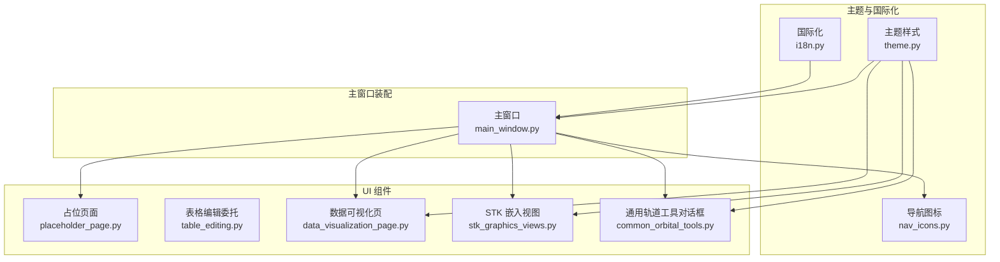
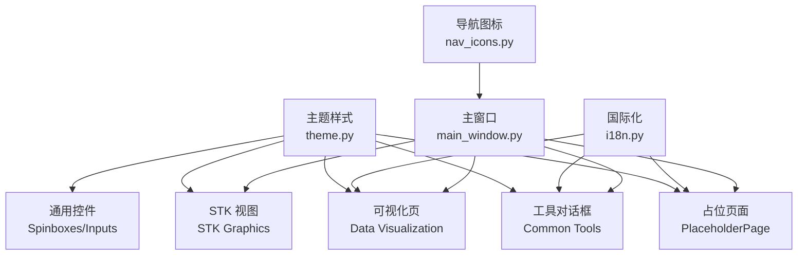
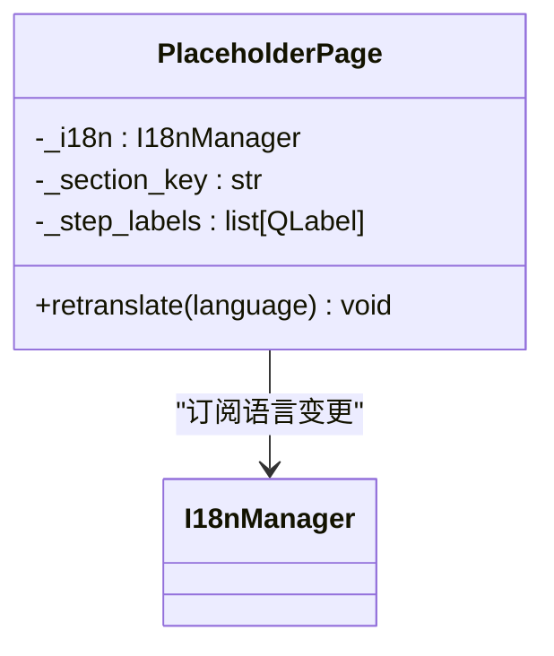
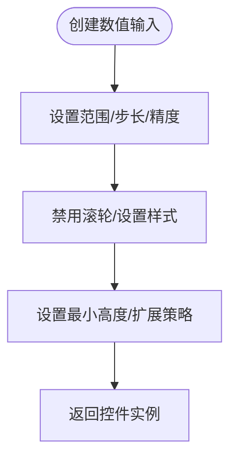
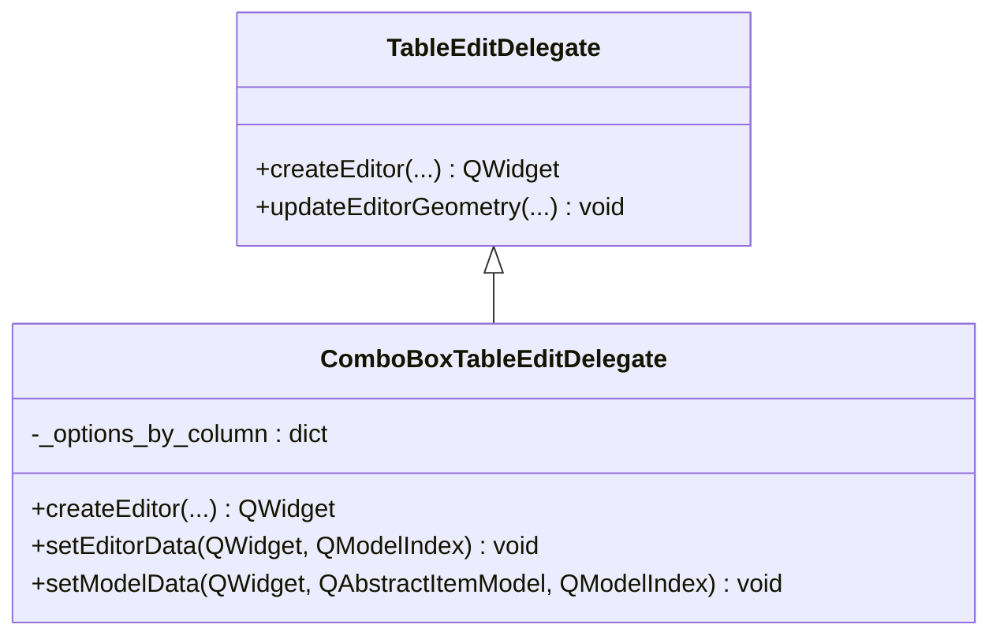
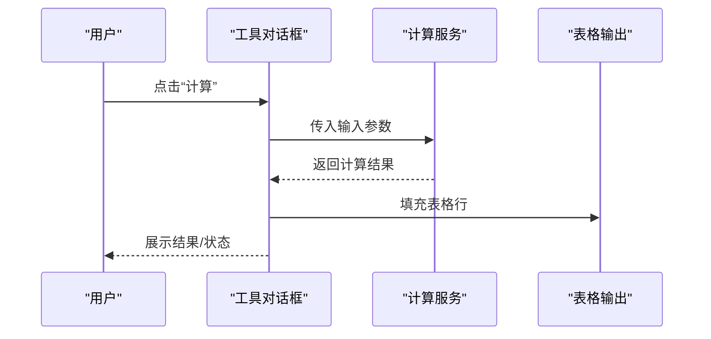
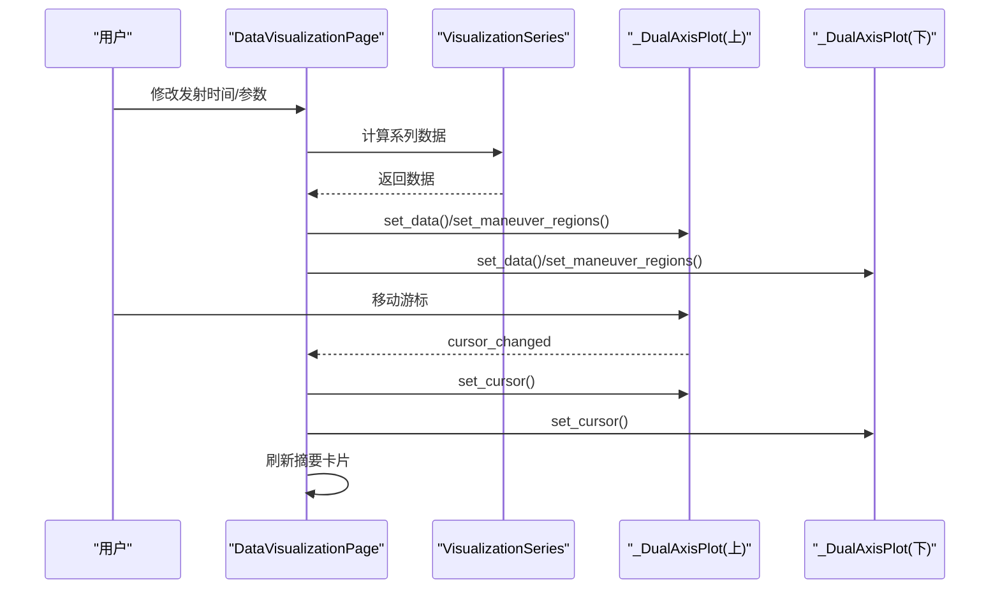
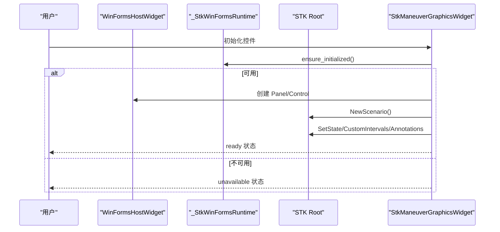
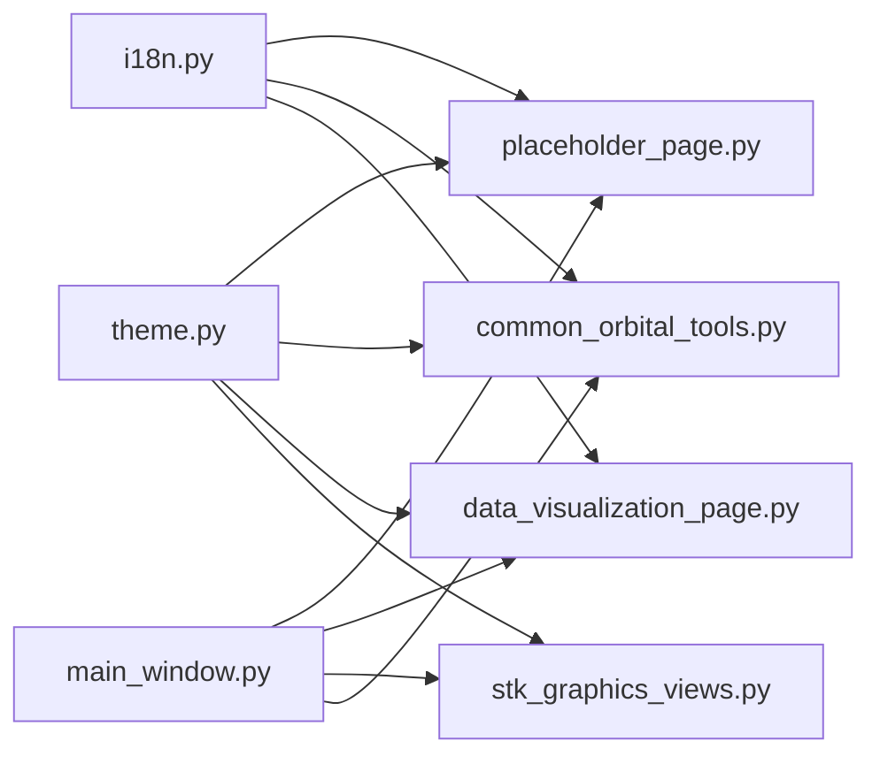

# 通用组件

<cite>
**本文引用的文件**
- [src/smart/ui/widgets/placeholder_page.py](file://src/smart/ui/widgets/placeholder_page.py)
- [src/smart/ui/widgets/__init__.py](file://src/smart/ui/widgets/__init__.py)
- [src/smart/ui/theme.py](file://src/smart/ui/theme.py)
- [src/smart/ui/main_window.py](file://src/smart/ui/main_window.py)
- [src/smart/ui/i18n.py](file://src/smart/ui/i18n.py)
- [src/smart/ui/nav_icons.py](file://src/smart/ui/nav_icons.py)
- [src/smart/ui/widgets/table_editing.py](file://src/smart/ui/widgets/table_editing.py)
- [src/smart/ui/widgets/common_orbital_tools.py](file://src/smart/ui/widgets/common_orbital_tools.py)
- [src/smart/ui/widgets/data_visualization_page.py](file://src/smart/ui/widgets/data_visualization_page.py)
- [src/smart/ui/widgets/stk_graphics_views.py](file://src/smart/ui/widgets/stk_graphics_views.py)
</cite>

## 目录
1. [简介](#简介)
2. [项目结构](#项目结构)
3. [核心组件](#核心组件)
4. [架构总览](#架构总览)
5. [组件详解](#组件详解)
6. [依赖关系分析](#依赖关系分析)
7. [性能考量](#性能考量)
8. [故障排查指南](#故障排查指南)
9. [结论](#结论)
10. [附录](#附录)

## 简介
本文件系统化梳理 SMART 桌面应用中的通用 UI 组件，重点覆盖以下方面：
- 设计模式与复用机制：统一的主题样式、角色属性、国际化与布局策略
- 基础组件能力：数值输入框、占位页面、表格编辑委托、通用轨道工具对话框、可视化曲线与 STK 嵌入视图
- 样式统一、事件处理与状态管理：通过角色属性与样式表驱动一致外观，信号槽与状态对象管理交互
- 可配置性、主题适配与无障碍支持：主题注入、字体与色彩体系、可读性与键盘可达性
- 组件组合与布局管理：容器、分割器、栅格与流式布局的协同
- 开发规范、扩展方法与最佳实践：命名约定、职责边界、可测试性与可维护性

## 项目结构
通用 UI 组件主要集中在 src/smart/ui/widgets 目录，配合主题、国际化与主窗口装配使用。核心文件包括：
- 占位页面与通用工具对话框：placeholder_page.py、common_orbital_tools.py
- 表格编辑与输入控件：table_editing.py、data_visualization_page.py（含自定义数值输入）
- 主窗口装配与导航：main_window.py、nav_icons.py
- 主题与国际化：theme.py、i18n.py
- STK 嵌入视图：stk_graphics_views.py

**图表来源**
- [src/smart/ui/main_window.py:86-124](file://src/smart/ui/main_window.py#L86-L124)
- [src/smart/ui/widgets/placeholder_page.py:8-65](file://src/smart/ui/widgets/placeholder_page.py#L8-L65)
- [src/smart/ui/widgets/data_visualization_page.py:282-341](file://src/smart/ui/widgets/data_visualization_page.py#L282-L341)
- [src/smart/ui/widgets/stk_graphics_views.py:259-305](file://src/smart/ui/widgets/stk_graphics_views.py#L259-L305)
- [src/smart/ui/widgets/common_orbital_tools.py:68-313](file://src/smart/ui/widgets/common_orbital_tools.py#L68-L313)
- [src/smart/ui/theme.py:12-470](file://src/smart/ui/theme.py#L12-L470)
- [src/smart/ui/i18n.py:498-517](file://src/smart/ui/i18n.py#L498-L517)
- [src/smart/ui/nav_icons.py:17-138](file://src/smart/ui/nav_icons.py#L17-L138)

**章节来源**
- [src/smart/ui/widgets/__init__.py:1-3](file://src/smart/ui/widgets/__init__.py#L1-L3)
- [src/smart/ui/main_window.py:86-124](file://src/smart/ui/main_window.py#L86-L124)

## 核心组件
- 占位页面 PlaceholderPage：用于模块尚未实现时的占位提示，具备标题、摘要、步骤说明卡片与多语言重译能力
- 数值输入框与日期时间输入：NoWheelDoubleSpinBox、NoWheelDateTimeEdit、NoWheelComboBox 等，统一禁用滚轮、设置范围与步长、最小高度与扩展策略
- 表格编辑委托：TableEditDelegate 与 ComboBoxTableEditDelegate，定制单元格编辑器外观与行为
- 通用轨道工具对话框：多种轨道计算对话框，统一标题栏、卡片面板、输出表格与样式
- 数据可视化页：双曲线视图、参数选择、游标联动、读出信息与图表导出
- STK 嵌入视图：Windows 平台下通过 .NET 互操作嵌入 STK 2D/3D 控件，提供轨道预览与标注

**章节来源**
- [src/smart/ui/widgets/placeholder_page.py:8-65](file://src/smart/ui/widgets/placeholder_page.py#L8-L65)
- [src/smart/ui/widgets/common_orbital_tools.py:50-66](file://src/smart/ui/widgets/common_orbital_tools.py#L50-L66)
- [src/smart/ui/widgets/table_editing.py:6-126](file://src/smart/ui/widgets/table_editing.py#L6-L126)
- [src/smart/ui/widgets/data_visualization_page.py:422-460](file://src/smart/ui/widgets/data_visualization_page.py#L422-L460)
- [src/smart/ui/widgets/stk_graphics_views.py:200-358](file://src/smart/ui/widgets/stk_graphics_views.py#L200-L358)

## 架构总览
通用组件遵循“主题驱动 + 角色属性 + 国际化 + 事件信号”的架构模式：
- 主题层：通过样式表与调色板统一控件外观，角色属性驱动不同语义元素的视觉差异
- 组件层：以 QFrame/QWidget 为容器，结合布局管理器实现响应式与可组合的界面
- 交互层：信号槽连接业务状态与 UI 更新，国际化管理文本与提示
- 装配层：主窗口集中创建与管理页面，侧边栏导航与菜单项联动

**图表来源**
- [src/smart/ui/theme.py:12-470](file://src/smart/ui/theme.py#L12-L470)
- [src/smart/ui/i18n.py:498-517](file://src/smart/ui/i18n.py#L498-L517)
- [src/smart/ui/main_window.py:86-124](file://src/smart/ui/main_window.py#L86-L124)
- [src/smart/ui/nav_icons.py:17-138](file://src/smart/ui/nav_icons.py#L17-L138)

## 组件详解

### 占位页面 PlaceholderPage
- 功能特性
  - 标题、摘要、卡片式步骤说明区域
  - 多语言重译：通过 I18nManager 的语言变更信号触发 retranslate
  - 角色属性：使用 role 属性区分页面标题、正文、卡片与标题等语义层级
- 使用场景
  - 模块尚未实现或需要引导用户进入下一步时展示
- 交互与状态
  - 依赖外部传入的 I18nManager 与 section_key，动态拼接翻译键
  - 通过 QVBoxLayout 设置边距与间距，卡片内部使用垂直布局承载标题与步骤

**图表来源**
- [src/smart/ui/widgets/placeholder_page.py:8-65](file://src/smart/ui/widgets/placeholder_page.py#L8-L65)

**章节来源**
- [src/smart/ui/widgets/placeholder_page.py:8-65](file://src/smart/ui/widgets/placeholder_page.py#L8-L65)

### 数值输入框与日期时间输入
- 设计模式
  - 封装通用数值输入：NoWheelDoubleSpinBox，统一设置范围、步长、精度、禁用滚轮、最小高度与扩展策略
  - 日期时间输入：NoWheelDateTimeEdit，禁用滚轮、设置日历弹窗、显示格式与时区
  - 下拉选择：NoWheelComboBox，禁用滚轮、统一样式与选项绑定
- 复用机制
  - 通过工厂函数 _number_field 快速构建带默认样式的数值字段
  - 在多个对话框与页面中复用，保证输入体验一致
- 事件处理与状态
  - 禁用滚轮避免误触，确保数值输入稳定性
  - 与业务逻辑联动，如发射时间选择、轨道参数输入

**图表来源**
- [src/smart/ui/widgets/common_orbital_tools.py:50-66](file://src/smart/ui/widgets/common_orbital_tools.py#L50-L66)
- [src/smart/ui/widgets/data_visualization_page.py:631-636](file://src/smart/ui/widgets/data_visualization_page.py#L631-L636)

**章节来源**
- [src/smart/ui/widgets/common_orbital_tools.py:50-66](file://src/smart/ui/widgets/common_orbital_tools.py#L50-L66)
- [src/smart/ui/widgets/data_visualization_page.py:631-636](file://src/smart/ui/widgets/data_visualization_page.py#L631-L636)

### 表格编辑委托 TableEditDelegate 与 ComboBoxTableEditDelegate
- 设计模式
  - 自定义 QStyledItemDelegate，统一表格内编辑器外观与行为
  - ComboBoxTableEditDelegate 为特定列提供预设选项，提交时回写模型数据
- 复用机制
  - install_table_edit_delegate/install_combo_table_edit_delegate 提供便捷安装接口
  - 适用于多处表格编辑场景，提升一致性与可维护性
- 事件处理
  - 编辑器创建时设置边框、内边距、选中背景色与全选
  - 下拉框选择变化时发出 commitData 信号，确保数据及时落盘

**图表来源**
- [src/smart/ui/widgets/table_editing.py:6-126](file://src/smart/ui/widgets/table_editing.py#L6-L126)

**章节来源**
- [src/smart/ui/widgets/table_editing.py:6-126](file://src/smart/ui/widgets/table_editing.py#L6-L126)

### 通用轨道工具对话框（工具集）
- 设计模式
  - 抽象基类 _CommonOrbitalToolDialog：统一标题栏、拖拽、卡片/面板、输出表格与样式
  - 各具体对话框（如轨道六根数↔状态矢量、近远地点参数、圆轨道周期/高度、近点角换算、太阳月亮位置）继承并扩展
- 复用机制
  - 统一的标题栏与关闭按钮、卡片与面板布局、输出表格模板
  - 通过 I18nManager 注入文案，支持多语言
- 事件处理与状态
  - 计算按钮触发计算流程，异常时显示错误信息
  - 输出表格按列填充计算结果，保持对齐与可读性

**图表来源**
- [src/smart/ui/widgets/common_orbital_tools.py:315-496](file://src/smart/ui/widgets/common_orbital_tools.py#L315-L496)
- [src/smart/ui/widgets/common_orbital_tools.py:498-564](file://src/smart/ui/widgets/common_orbital_tools.py#L498-L564)
- [src/smart/ui/widgets/common_orbital_tools.py:567-666](file://src/smart/ui/widgets/common_orbital_tools.py#L567-L666)
- [src/smart/ui/widgets/common_orbital_tools.py:669-738](file://src/smart/ui/widgets/common_orbital_tools.py#L669-L738)
- [src/smart/ui/widgets/common_orbital_tools.py:741-799](file://src/smart/ui/widgets/common_orbital_tools.py#L741-L799)

**章节来源**
- [src/smart/ui/widgets/common_orbital_tools.py:68-313](file://src/smart/ui/widgets/common_orbital_tools.py#L68-L313)

### 数据可视化页 DataVisualizationPage
- 设计模式
  - 双曲线视图 _DualAxisPlot：左右双轴、游标联动、读出信息、区间标注、自适应/重置视图
  - 页面布局：标题、副标题、发射时间选择、计算按钮、摘要卡片、双曲线卡片、分割器
- 复用机制
  - 两个 _DualAxisPlot 实例共享参数选择与游标同步逻辑
  - 通过 VisualizationSeries 统一数据结构，支持多参数曲线绘制
- 事件处理与状态
  - 发射时间变更触发计算，异常时显示状态信息
  - 游标移动同步两图与摘要卡片，读出当前时刻参数

**图表来源**
- [src/smart/ui/widgets/data_visualization_page.py:282-341](file://src/smart/ui/widgets/data_visualization_page.py#L282-L341)
- [src/smart/ui/widgets/data_visualization_page.py:422-460](file://src/smart/ui/widgets/data_visualization_page.py#L422-L460)
- [src/smart/ui/widgets/data_visualization_page.py:444-460](file://src/smart/ui/widgets/data_visualization_page.py#L444-L460)
- [src/smart/ui/widgets/data_visualization_page.py:496-507](file://src/smart/ui/widgets/data_visualization_page.py#L496-L507)

**章节来源**
- [src/smart/ui/widgets/data_visualization_page.py:282-341](file://src/smart/ui/widgets/data_visualization_page.py#L282-L341)
- [src/smart/ui/widgets/data_visualization_page.py:422-460](file://src/smart/ui/widgets/data_visualization_page.py#L422-L460)

### STK 嵌入视图 StkManeuverGraphicsWidget
- 设计模式
  - _WinFormsHostWidget：在 Qt 中托管 WinForms 控件，桥接 Handle 与 QWindow
  - StkManeuverGraphicsWidget：提供 2D/3D 场景卡片、占位提示、状态标签与控制初始化
- 复用机制
  - 通过 _StkWinFormsRuntime 确保 STK/.NET 运行时可用性，失败时统一提示
  - 场景加载、卫星对象创建、轨道路径与标注、动画控制等流程标准化
- 事件处理与状态
  - 状态模式：idle/unavailable/load_failed/ready，根据可用性与加载结果更新提示
  - 支持保存场景、清理图形与关闭事件处理

**图表来源**
- [src/smart/ui/widgets/stk_graphics_views.py:200-358](file://src/smart/ui/widgets/stk_graphics_views.py#L200-L358)
- [src/smart/ui/widgets/stk_graphics_views.py:35-198](file://src/smart/ui/widgets/stk_graphics_views.py#L35-L198)

**章节来源**
- [src/smart/ui/widgets/stk_graphics_views.py:200-358](file://src/smart/ui/widgets/stk_graphics_views.py#L200-L358)

## 依赖关系分析
- 主题与样式
  - APP_STYLESHEET 通过角色属性与控件类型选择器统一控件外观，包括按钮、标签、表格、滚动条等
  - 主题应用函数负责字体、调色板与样式表注入
- 国际化
  - I18nManager.t 提供翻译与占位符格式化，组件通过信号监听语言变更并重译
- 主窗口装配
  - MainWindow 统一创建页面、菜单、侧边栏与导航列表，页面间通过信号槽联动状态

**图表来源**
- [src/smart/ui/theme.py:12-470](file://src/smart/ui/theme.py#L12-L470)
- [src/smart/ui/i18n.py:498-517](file://src/smart/ui/i18n.py#L498-L517)
- [src/smart/ui/main_window.py:86-124](file://src/smart/ui/main_window.py#L86-L124)

**章节来源**
- [src/smart/ui/theme.py:12-470](file://src/smart/ui/theme.py#L12-L470)
- [src/smart/ui/i18n.py:498-517](file://src/smart/ui/i18n.py#L498-L517)
- [src/smart/ui/main_window.py:86-124](file://src/smart/ui/main_window.py#L86-L124)

## 性能考量
- 主题与样式
  - 样式表一次性注入，避免频繁重绘；角色属性减少重复样式声明
- 可视化曲线
  - 使用 NumPy 向量化计算与缓存索引，减少重复计算
  - 游标移动与读出信息按需更新，避免全量重绘
- STK 嵌入
  - 通过 .NET 运行时桥接，注意消息泵与控件生命周期管理，避免阻塞 UI 线程
- 表格编辑
  - 委托模式减少自定义控件开销，编辑器创建与几何更新在必要时触发

[本节为通用指导，不直接分析具体文件]

## 故障排查指南
- 主题未生效
  - 检查主题应用函数是否被调用，确认字体数据库与调色板设置
- 国际化文本未更新
  - 确认组件是否连接 I18nManager 的语言变更信号，retranslate 是否正确设置属性
- STK 嵌入不可用
  - 检查运行时可用性错误信息，确认 Windows 平台、.NET 互操作与 STK 安装
- 表格编辑异常
  - 确认委托安装正确，ComboBox 选项与数据绑定一致，编辑器几何更新逻辑正常

**章节来源**
- [src/smart/ui/theme.py:473-519](file://src/smart/ui/theme.py#L473-L519)
- [src/smart/ui/i18n.py:498-517](file://src/smart/ui/i18n.py#L498-L517)
- [src/smart/ui/widgets/stk_graphics_views.py:104-113](file://src/smart/ui/widgets/stk_graphics_views.py#L104-L113)
- [src/smart/ui/widgets/table_editing.py:117-126](file://src/smart/ui/widgets/table_editing.py#L117-L126)

## 结论
SMART 的通用 UI 组件通过主题驱动、角色属性与国际化实现外观与文案的一致性；通过信号槽与状态对象实现事件与状态的解耦；通过可复用的输入控件、表格委托与对话框模板提升开发效率与可维护性。在布局层面，采用容器、分割器与栅格布局实现灵活组合与响应式体验。建议在新组件开发中遵循统一的命名、职责与可测试性原则，确保与现有体系无缝集成。

[本节为总结性内容，不直接分析具体文件]

## 附录
- 开发规范与最佳实践
  - 命名约定：控件与类名清晰表达语义，避免缩写；文件名小写加下划线
  - 职责边界：主题负责外观，业务逻辑负责数据，UI 负责交互；通过信号槽解耦
  - 可测试性：将复杂逻辑封装为纯函数或服务类，便于单元测试
  - 可维护性：统一的输入控件工厂、表格委托与对话框基类，减少重复代码
  - 可扩展性：新增组件尽量复用现有布局与样式，避免破坏整体风格

[本节为通用指导，不直接分析具体文件]