# 页面组件系统

<cite>
**本文档引用的文件**
- [main_window.py](file://src/smart/ui/main_window.py)
- [dashboard_page.py](file://src/smart/ui/widgets/dashboard_page.py)
- [launch_window_page.py](file://src/smart/ui/widgets/launch_window_page.py)
- [maneuver_page.py](file://src/smart/ui/widgets/maneuver_page.py)
- [satellite_status_page.py](file://src/smart/ui/widgets/satellite_status_page.py)
- [design_maneuver_strategy_page.py](file://src/smart/ui/widgets/design_maneuver_strategy_page.py)
- [data_visualization_page.py](file://src/smart/ui/widgets/data_visualization_page.py)
- [tracking_arc_page.py](file://src/smart/ui/widgets/tracking_arc_page.py)
- [orbit_designer_page.py](file://src/smart/ui/widgets/orbit_designer_page.py)
- [flight_program_page.py](file://src/smart/ui/widgets/flight_program_page.py)
</cite>

## 目录
1. [引言](#引言)
2. [项目结构](#项目结构)
3. [核心组件](#核心组件)
4. [架构概览](#架构概览)
5. [详细组件分析](#详细组件分析)
6. [依赖关系分析](#依赖关系分析)
7. [性能考虑](#性能考虑)
8. [故障排除指南](#故障排除指南)
9. [结论](#结论)

## 引言

SMART项目页面组件系统是一个基于PySide6构建的航天任务规划界面框架。该系统采用模块化设计，将复杂的航天任务规划流程分解为多个专门化的页面组件，每个组件负责特定的功能领域。

本系统的核心设计理念包括：
- **模块化架构**：每个页面组件独立封装，职责单一
- **数据驱动设计**：通过MissionState和ProjectWorkspace实现数据共享
- **事件驱动通信**：使用Qt信号槽机制实现组件间通信
- **可扩展性**：支持新页面组件的添加和现有组件的扩展

## 项目结构

SMART项目的UI层采用清晰的分层架构：

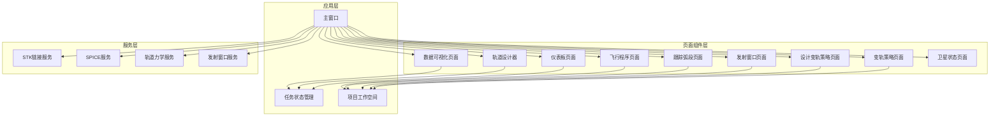

**图表来源**
- [main_window.py:53-136](file://src/smart/ui/main_window.py#L53-L136)
- [dashboard_page.py:263-292](file://src/smart/ui/widgets/dashboard_page.py#L263-L292)

**章节来源**
- [main_window.py:1-781](file://src/smart/ui/main_window.py#L1-L781)
- [dashboard_page.py:1-984](file://src/smart/ui/widgets/dashboard_page.py#L1-L984)

## 核心组件

### 主窗口系统

主窗口作为整个应用的容器，负责页面导航、项目管理和组件协调：

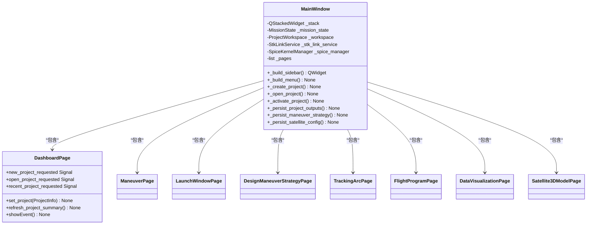

**图表来源**
- [main_window.py:53-136](file://src/smart/ui/main_window.py#L53-L136)
- [dashboard_page.py:263-292](file://src/smart/ui/widgets/dashboard_page.py#L263-L292)

### 页面组件层次结构

系统包含以下核心页面组件：

1. **仪表板页面** - 项目概览和状态监控
2. **轨道设计器** - 轨道参数可视化和编辑
3. **变轨策略页面** - 变轨计划制定和管理
4. **设计变轨策略页面** - 变轨策略算法执行
5. **发射窗口页面** - 发射时机分析和选择
6. **跟踪弧段页面** - 地面跟踪资源分析
7. **飞行程序页面** - 整体飞行任务编排
8. **数据可视化页面** - 轨道参数和结果展示
9. **卫星状态页面** - 卫星3D模型配置

**章节来源**
- [main_window.py:86-121](file://src/smart/ui/main_window.py#L86-L121)
- [dashboard_page.py:424-516](file://src/smart/ui/widgets/dashboard_page.py#L424-L516)

## 架构概览

### 数据流架构

系统采用双向数据流架构，确保数据的一致性和实时性：

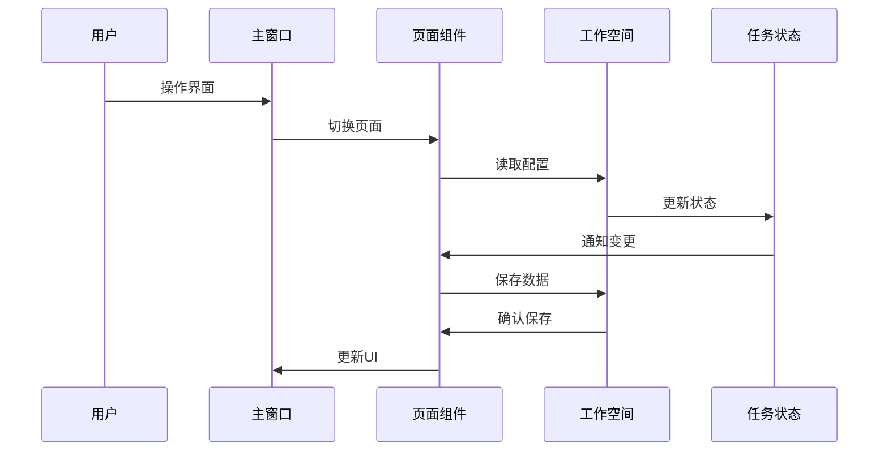

**图表来源**
- [main_window.py:127-131](file://src/smart/ui/main_window.py#L127-L131)
- [maneuver_page.py:697-718](file://src/smart/ui/widgets/maneuver_page.py#L697-L718)

### 通信机制

页面组件间通过多种方式实现通信：

1. **信号槽机制**：Qt内置的事件驱动通信
2. **项目工作空间**：统一的数据存储和访问接口
3. **任务状态管理**：全局状态同步和广播
4. **直接方法调用**：组件间的直接交互

**章节来源**
- [main_window.py:127-131](file://src/smart/ui/main_window.py#L127-L131)
- [maneuver_page.py:697-718](file://src/smart/ui/widgets/maneuver_page.py#L697-L718)

## 详细组件分析

### 仪表板页面系统

仪表板页面作为系统的入口和控制中心，提供项目概览和快速导航功能：

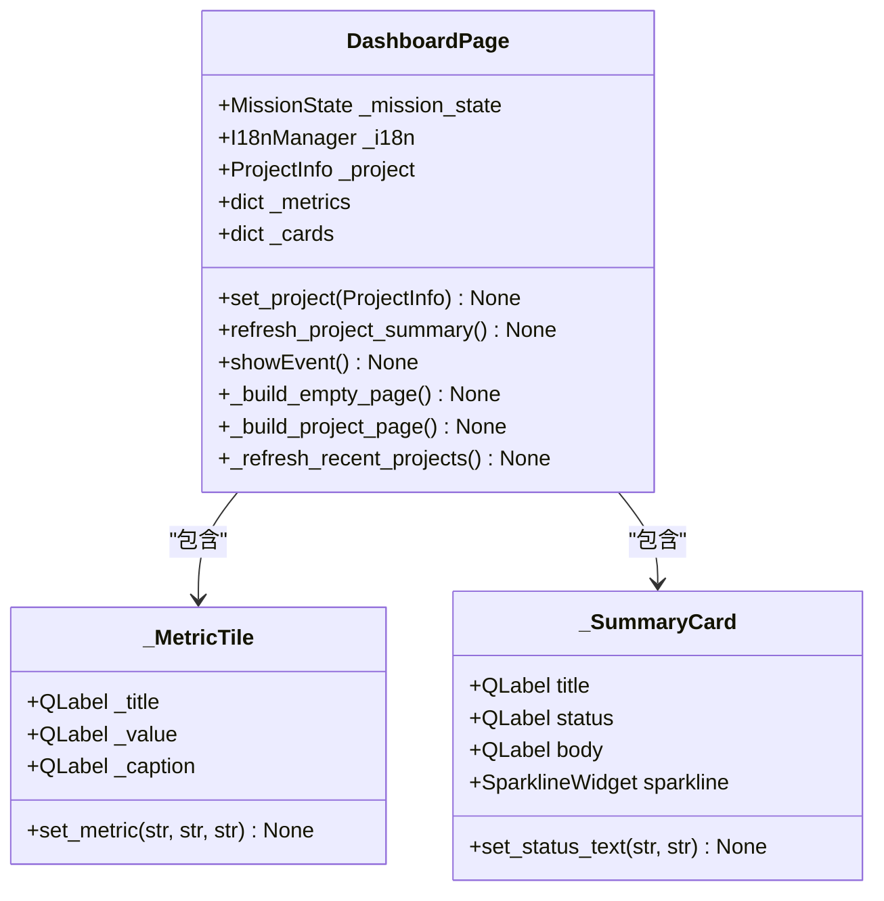

**图表来源**
- [dashboard_page.py:263-292](file://src/smart/ui/widgets/dashboard_page.py#L263-L292)
- [dashboard_page.py:155-182](file://src/smart/ui/widgets/dashboard_page.py#L155-L182)
- [dashboard_page.py:227-262](file://src/smart/ui/widgets/dashboard_page.py#L227-L262)

#### 功能特性

仪表板页面的核心功能包括：

1. **项目状态监控**：实时显示项目各模块的状态
2. **数据链路追踪**：监控各模块数据生成情况
3. **风险评估**：识别潜在问题和风险项
4. **快速导航**：提供到各功能页面的快捷入口

**章节来源**
- [dashboard_page.py:558-800](file://src/smart/ui/widgets/dashboard_page.py#L558-L800)

### 发射窗口分析系统

发射窗口页面专注于发射时机的分析和优化：

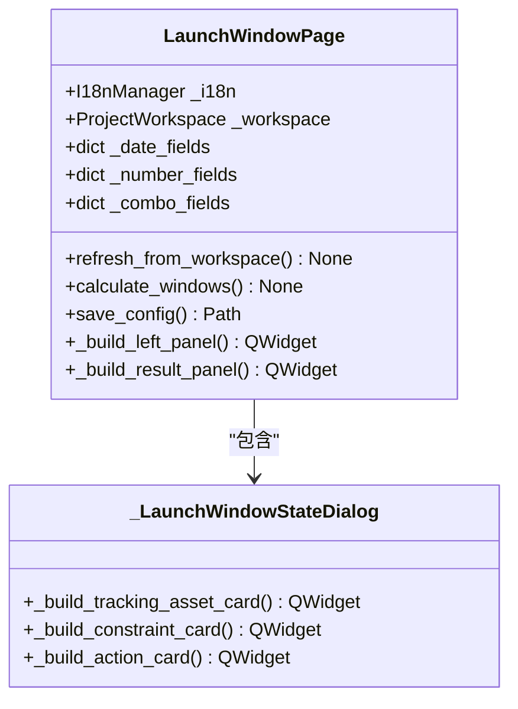

**图表来源**
- [launch_window_page.py:348-407](file://src/smart/ui/widgets/launch_window_page.py#L348-L407)
- [launch_window_page.py:70-167](file://src/smart/ui/widgets/launch_window_page.py#L70-L167)

#### 核心算法

发射窗口计算涉及复杂的轨道力学和约束满足算法：

1. **窗口扫描算法**：遍历可能的发射时间窗口
2. **约束验证**：检查发射条件是否满足
3. **优化策略**：寻找最优发射时机
4. **结果可视化**：Gantt图展示发射窗口

**章节来源**
- [launch_window_page.py:796-800](file://src/smart/ui/widgets/launch_window_page.py#L796-L800)

### 变轨策略管理系统

变轨策略页面提供完整的变轨计划制定和管理功能：

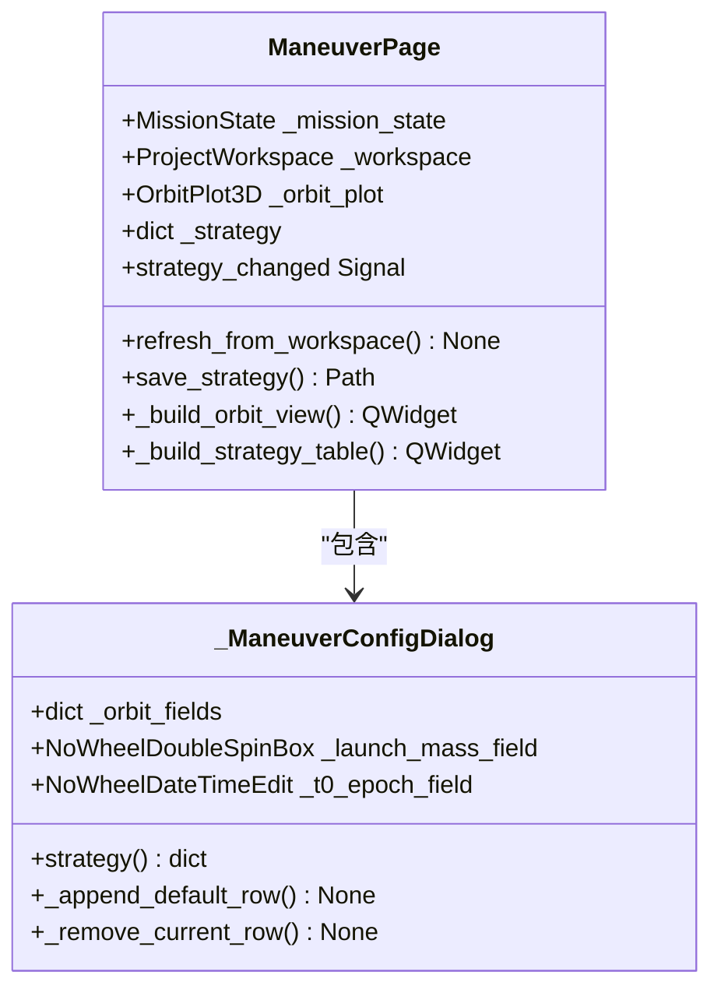

**图表来源**
- [maneuver_page.py:263-341](file://src/smart/ui/widgets/maneuver_page.py#L263-L341)
- [maneuver_page.py:241-560](file://src/smart/ui/widgets/maneuver_page.py#L241-L560)

#### 技术实现

变轨策略管理采用以下关键技术：

1. **3D轨道可视化**：实时显示卫星轨道轨迹
2. **参数化配置**：支持灵活的变轨参数设置
3. **数值计算**：精确的轨道力学计算
4. **图形渲染**：高性能的OpenGL渲染

**章节来源**
- [maneuver_page.py:561-800](file://src/smart/ui/widgets/maneuver_page.py#L561-L800)

### 设计变轨策略算法系统

设计变轨策略页面专注于算法层面的变轨策略生成：

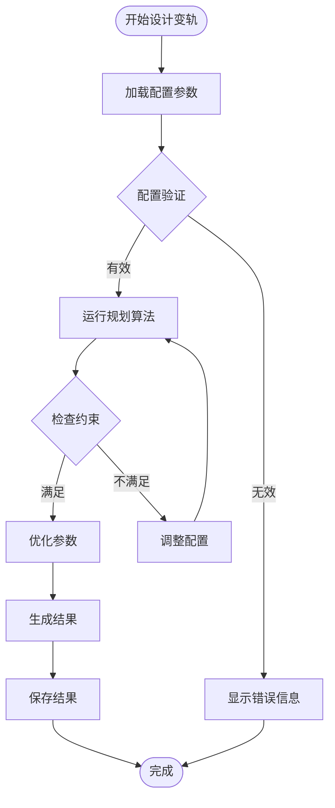

**图表来源**
- [design_maneuver_strategy_page.py:697-718](file://src/smart/ui/widgets/design_maneuver_strategy_page.py#L697-L718)

#### 算法复杂度

设计变轨策略涉及的算法复杂度：

- **规划算法**：O(n²) 时间复杂度，其中n为可能的变轨次数
- **约束检查**：O(n) 时间复杂度
- **参数优化**：O(k) 迭代复杂度，其中k为优化迭代次数
- **内存使用**：O(n×m) 空间复杂度，用于存储中间结果

**章节来源**
- [design_maneuver_strategy_page.py:735-782](file://src/smart/ui/widgets/design_maneuver_strategy_page.py#L735-L782)

### 数据可视化系统

数据可视化页面提供轨道参数的多维度展示：

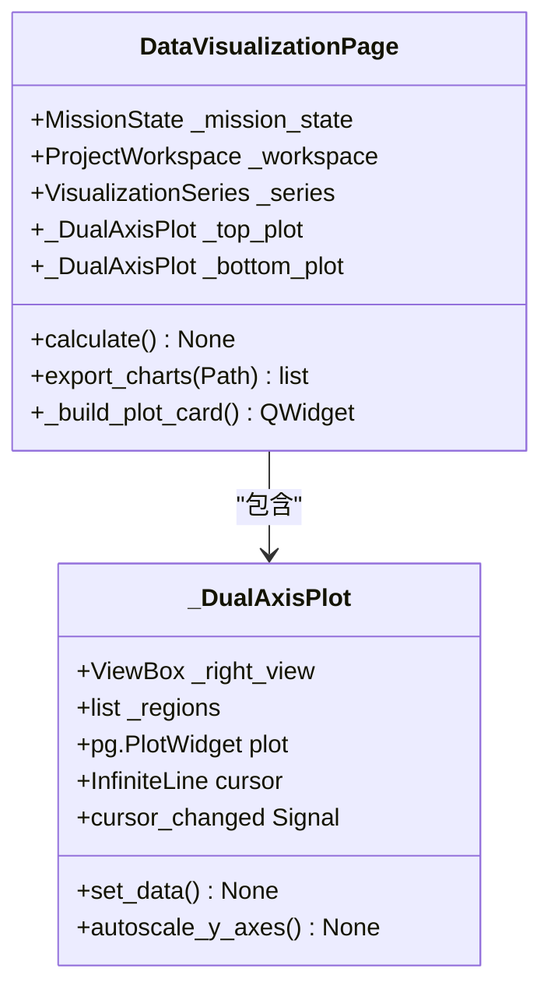

**图表来源**
- [data_visualization_page.py:282-341](file://src/smart/ui/widgets/data_visualization_page.py#L282-L341)
- [data_visualization_page.py:44-127](file://src/smart/ui/widgets/data_visualization_page.py#L44-L127)

#### 可视化特性

数据可视化系统具备以下特性：

1. **双轴显示**：支持两个不同量级参数的同时展示
2. **交互式操作**：支持缩放、平移和时间线控制
3. **实时更新**：基于任务状态变化动态更新
4. **导出功能**：支持高质量图像导出

**章节来源**
- [data_visualization_page.py:444-521](file://src/smart/ui/widgets/data_visualization_page.py#L444-L521)

### 跟踪弧段分析系统

跟踪弧段页面专注于地面跟踪资源的分析和优化：

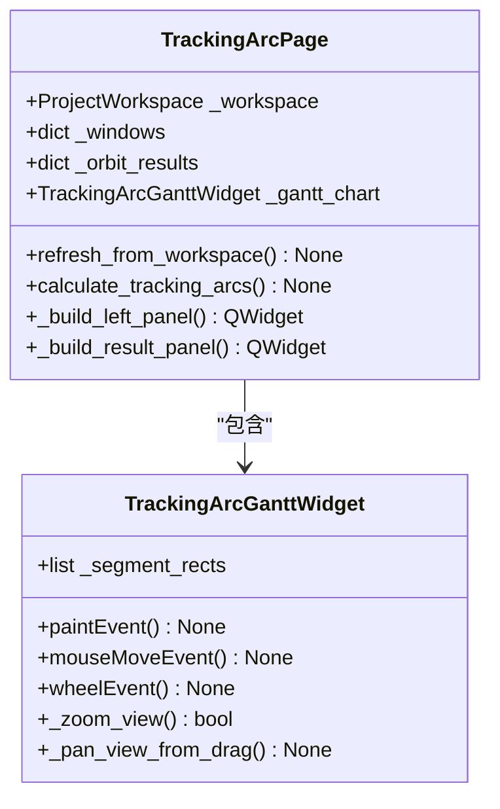

**图表来源**
- [tracking_arc_page.py:671-721](file://src/smart/ui/widgets/tracking_arc_page.py#L671-L721)
- [tracking_arc_page.py:38-141](file://src/smart/ui/widgets/tracking_arc_page.py#L38-L141)

#### Gantt图实现

跟踪弧段Gantt图采用自绘技术实现：

1. **事件驱动绘制**：响应数据变化自动重绘
2. **交互式缩放**：支持鼠标滚轮缩放和平移
3. **精确的时间轴**：支持毫秒级时间精度
4. **颜色编码系统**：不同类型的弧段使用不同颜色

**章节来源**
- [tracking_arc_page.py:142-346](file://src/smart/ui/widgets/tracking_arc_page.py#L142-L346)

### 飞行程序编排系统

飞行程序页面提供整体飞行任务的编排和管理：

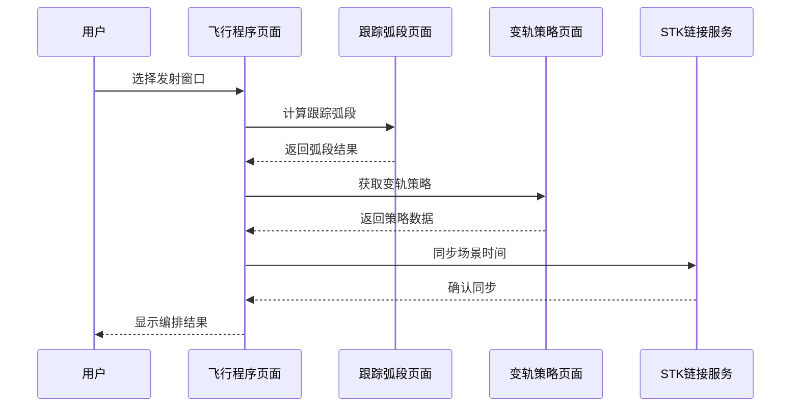

**图表来源**
- [flight_program_page.py:424-474](file://src/smart/ui/widgets/flight_program_page.py#L424-L474)

#### 时间线管理

飞行程序采用复杂的时间线管理系统：

1. **多层级时间轴**：支持分钟级到小时级的时间粒度
2. **事件关联**：变轨事件与跟踪弧段的精确关联
3. **实时同步**：与外部STK系统的实时时间同步
4. **冲突检测**：自动检测和报告时间冲突

**章节来源**
- [flight_program_page.py:593-621](file://src/smart/ui/widgets/flight_program_page.py#L593-L621)

## 依赖关系分析

### 组件耦合度分析

系统采用松耦合设计，通过接口和信号槽实现组件间解耦：

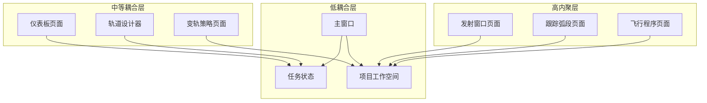

**图表来源**
- [main_window.py:53-136](file://src/smart/ui/main_window.py#L53-L136)

### 外部依赖管理

系统对外部依赖进行集中管理：

1. **SPICE服务**：用于天体坐标计算
2. **STK链接**：与Satellite Tool Kit的集成
3. **PyQtGraph**：高性能科学绘图库
4. **NumPy**：数值计算基础库

**章节来源**
- [main_window.py:104-108](file://src/smart/ui/main_window.py#L104-L108)

## 性能考虑

### 内存管理策略

系统采用多种内存管理策略确保高效运行：

1. **延迟加载**：页面组件按需加载，减少启动时间
2. **缓存机制**：对计算结果和配置进行缓存
3. **资源池**：复用昂贵的对象如3D渲染器
4. **垃圾回收**：及时释放不再使用的对象

### 渲染性能优化

针对大量数据可视化的性能优化：

1. **GPU加速**：利用OpenGL进行硬件加速渲染
2. **数据分块**：将大数据集分割为可管理的块
3. **增量更新**：只更新发生变化的部分
4. **LOD系统**：根据距离调整细节级别

### 并发处理

系统支持异步操作以避免界面阻塞：

1. **后台计算**：长时间运行的算法在后台线程执行
2. **进度反馈**：提供计算进度和状态反馈
3. **取消机制**：允许用户取消长时间操作
4. **错误隔离**：防止后台错误影响主界面

## 故障排除指南

### 常见问题诊断

1. **项目加载失败**
   - 检查项目目录结构完整性
   - 验证JSON配置文件格式正确性
   - 确认必要的数据文件存在

2. **计算超时**
   - 检查系统资源使用情况
   - 调整算法参数设置
   - 考虑增加计算资源

3. **界面卡顿**
   - 检查是否有过多的实时更新
   - 关闭不必要的可视化元素
   - 清理内存缓存

### 错误恢复机制

系统提供多层次的错误恢复机制：

1. **自动恢复**：某些临时错误可以自动恢复
2. **状态回滚**：支持撤销最近的操作
3. **数据备份**：定期自动备份重要数据
4. **日志记录**：详细记录错误信息便于诊断

**章节来源**
- [main_window.py:398-404](file://src/smart/ui/main_window.py#L398-L404)
- [maneuver_page.py:715-718](file://src/smart/ui/widgets/maneuver_page.py#L715-L718)

## 结论

SMART项目页面组件系统展现了现代航天任务规划软件的设计理念和技术实现。通过模块化架构、事件驱动通信和数据驱动设计，系统实现了高度的可扩展性和维护性。

### 主要优势

1. **架构清晰**：层次分明的组件设计便于理解和维护
2. **功能完整**：覆盖了航天任务规划的各个关键环节
3. **性能优秀**：采用多种优化技术确保流畅的用户体验
4. **扩展性强**：支持新功能的添加和现有功能的改进

### 技术特色

1. **可视化导向**：丰富的图表和3D可视化提升用户体验
2. **算法集成**：深度集成了专业的轨道力学算法
3. **实时同步**：与外部系统的实时数据交换能力
4. **国际化支持**：完整的多语言界面支持

该系统为航天任务规划提供了一个强大而灵活的技术平台，为未来的功能扩展和性能优化奠定了坚实的基础。