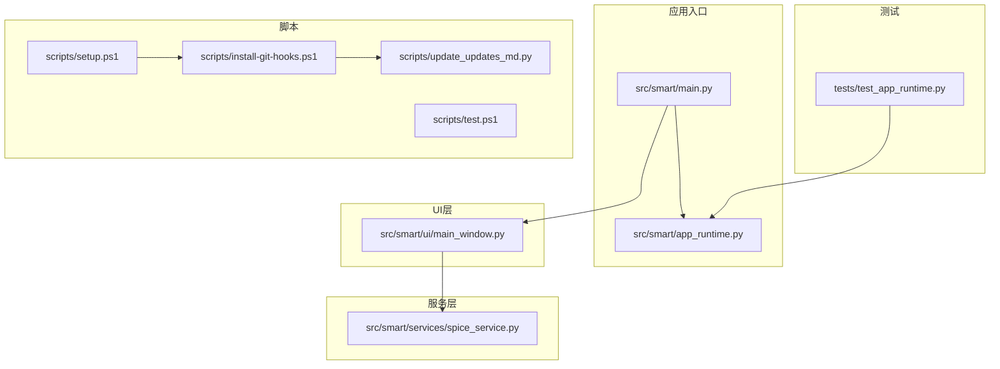
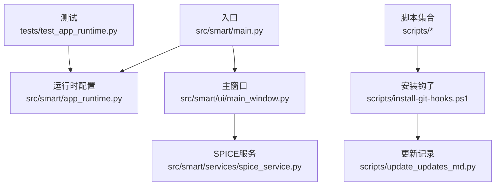
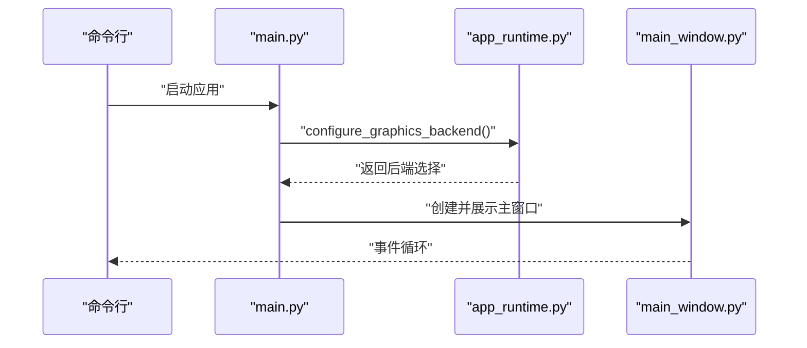
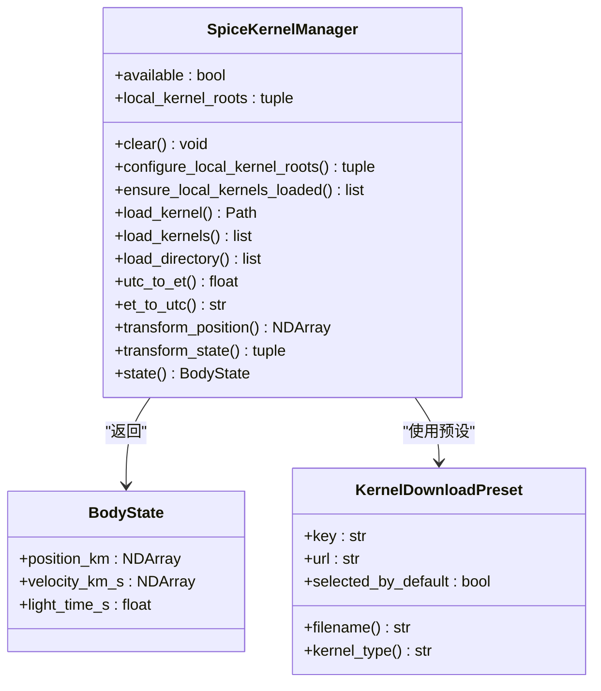
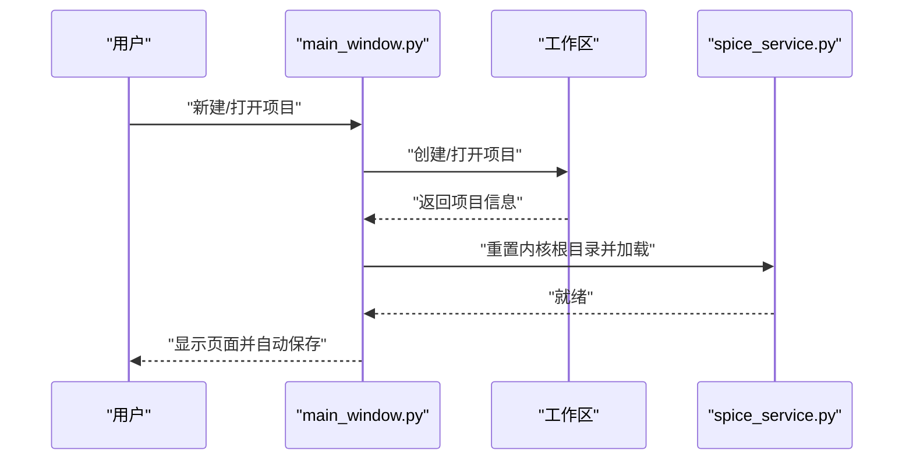
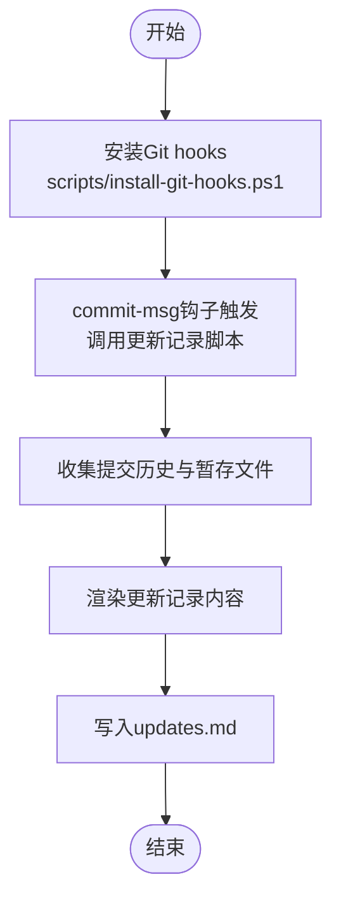
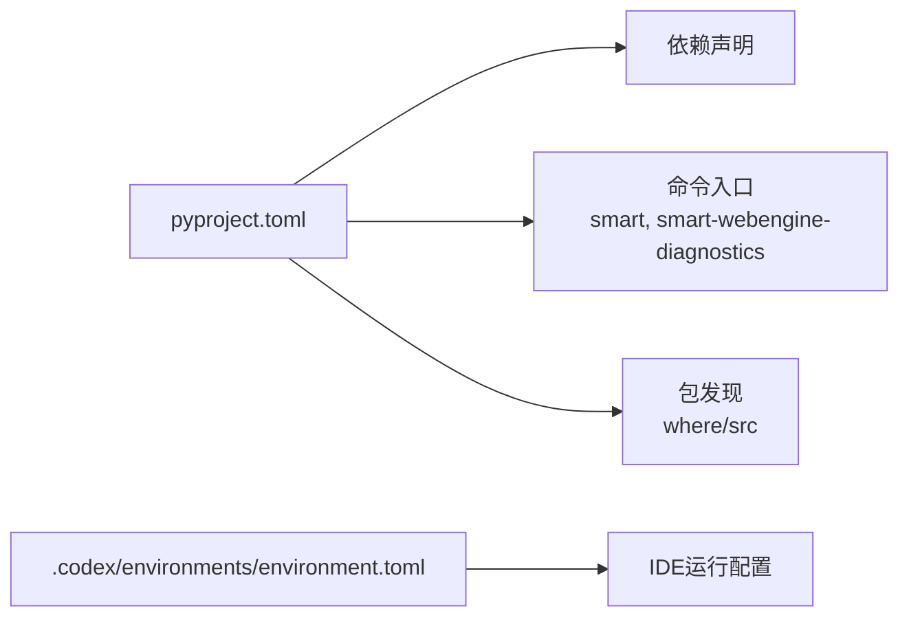

# 代码质量与规范

<cite>
**本文引用的文件**
- [README.md](file://README.md)
- [pyproject.toml](file://pyproject.toml)
- [scripts\install-git-hooks.ps1](file://scripts/install-git-hooks.ps1)
- [scripts\setup.ps1](file://scripts/setup.ps1)
- [scripts\test.ps1](file://scripts/test.ps1)
- [scripts\update_updates_md.py](file://scripts/update_updates_md.py)
- [src\smart\main.py](file://src/smart/main.py)
- [src\smart\app_runtime.py](file://src/smart/app_runtime.py)
- [src\smart\services\spice_service.py](file://src/smart/services/spice_service.py)
- [src\smart\ui\main_window.py](file://src/smart/ui/main_window.py)
- [.codex\environments\environment.toml](file://.codex/environments/environment.toml)
- [tests\test_app_runtime.py](file://tests/test_app_runtime.py)
</cite>

## 目录
1. [引言](#引言)
2. [项目结构](#项目结构)
3. [核心组件](#核心组件)
4. [架构总览](#架构总览)
5. [详细组件分析](#详细组件分析)
6. [依赖关系分析](#依赖关系分析)
7. [性能考量](#性能考量)
8. [故障排查指南](#故障排查指南)
9. [结论](#结论)
10. [附录](#附录)

## 引言
本指南面向SMART项目的开发者，系统阐述Python编码规范、Git钩子配置与使用、代码审查清单与最佳实践、文档注释与API维护方法、静态分析工具集成以及代码重构与遗留代码处理策略。SMART是一个基于PySide6的桌面应用，围绕STK 11.6 + SPICE + PySide6构建统一工作流，强调工程化、可追溯与可复用。

## 项目结构
SMART采用分层与功能域结合的组织方式：
- src/smart/domain：领域模型
- src/smart/services：数值计算与SPICE服务
- src/smart/ui：桌面界面与控件
- tests：单元与功能测试
- scripts：安装、运行、测试、Git钩子安装与更新记录维护脚本
- data/kernels：本地SPICE内核
- doc：算法与流程文档
- .githooks：Git钩子
- .codex/environments：IDE环境配置

**图表来源**
- [src\smart\main.py:1-36](file://src/smart/main.py#L1-L36)
- [src\smart\app_runtime.py:1-96](file://src/smart/app_runtime.py#L1-L96)
- [src\smart\ui\main_window.py:1-781](file://src/smart/ui/main_window.py#L1-L781)
- [src\smart\services\spice_service.py:1-305](file://src/smart/services/spice_service.py#L1-L305)
- [tests\test_app_runtime.py:1-30](file://tests/test_app_runtime.py#L1-L30)
- [scripts\setup.ps1:1-47](file://scripts/setup.ps1#L1-L47)
- [scripts\test.ps1:1-38](file://scripts/test.ps1#L1-L38)
- [scripts\install-git-hooks.ps1:1-15](file://scripts/install-git-hooks.ps1#L1-L15)
- [scripts\update_updates_md.py:1-222](file://scripts/update_updates_md.py#L1-L222)

**章节来源**
- [README.md:187-196](file://README.md#L187-L196)
- [pyproject.toml:1-50](file://pyproject.toml#L1-L50)

## 核心组件
- 应用入口与运行时配置：负责图形后端设置、主题与图标加载、主窗口展示。
- SPICE服务：封装内核发现、下载、加载与坐标变换等核心能力。
- 主窗口：聚合导航、页面与工作区，实现项目生命周期管理与自动保存。
- 测试与脚本：提供测试执行、虚拟环境与依赖安装、Git钩子安装与更新记录维护。

**章节来源**
- [src\smart\main.py:10-36](file://src/smart/main.py#L10-L36)
- [src\smart\app_runtime.py:31-90](file://src/smart/app_runtime.py#L31-L90)
- [src\smart\services\spice_service.py:174-305](file://src/smart/services/spice_service.py#L174-L305)
- [src\smart\ui\main_window.py:53-137](file://src/smart/ui/main_window.py#L53-L137)
- [tests\test_app_runtime.py:8-29](file://tests/test_app_runtime.py#L8-L29)

## 架构总览
SMART采用“入口-运行时-UI-服务”的分层架构，UI层通过服务层访问SPICE能力，测试覆盖运行时配置与核心服务，脚本贯穿安装、测试与Git钩子生命周期。

**图表来源**
- [src\smart\main.py:10-36](file://src/smart/main.py#L10-L36)
- [src\smart\app_runtime.py:31-90](file://src/smart/app_runtime.py#L31-L90)
- [src\smart\ui\main_window.py:53-137](file://src/smart/ui/main_window.py#L53-L137)
- [src\smart\services\spice_service.py:174-305](file://src/smart/services/spice_service.py#L174-L305)
- [tests\test_app_runtime.py:8-29](file://tests/test_app_runtime.py#L8-L29)
- [scripts\install-git-hooks.ps1:1-15](file://scripts/install-git-hooks.ps1#L1-L15)
- [scripts\update_updates_md.py:182-217](file://scripts/update_updates_md.py#L182-L217)

## 详细组件分析

### 组件A：应用入口与运行时配置
- 职责：初始化图形后端、加载应用图标、设置主题、创建主窗口并进入事件循环。
- 关键点：图形后端强制一致，避免WebEngine与OpenGL组合冲突；默认SwiftShader以提升兼容性。
- 测试：针对默认行为与覆盖行为进行断言，确保环境变量与标志位正确注入。

**图表来源**
- [src\smart\main.py:10-36](file://src/smart/main.py#L10-L36)
- [src\smart\app_runtime.py:31-90](file://src/smart/app_runtime.py#L31-L90)
- [tests\test_app_runtime.py:8-29](file://tests/test_app_runtime.py#L8-L29)

**章节来源**
- [src\smart\main.py:10-36](file://src/smart/main.py#L10-L36)
- [src\smart\app_runtime.py:31-90](file://src/smart/app_runtime.py#L31-L90)
- [tests\test_app_runtime.py:8-29](file://tests/test_app_runtime.py#L8-L29)

### 组件B：SPICE服务
- 职责：内核发现与加载、UTC/ET转换、坐标系变换、天体状态查询。
- 数据结构：BodyState、KernelDownloadPreset、SpiceKernelManager。
- 错误处理：未安装SpiceyPy时抛出明确异常；路径与文件名校验严格。
- 性能：内核去重加载、延迟加载策略，避免重复加载与重复计算。

**图表来源**
- [src\smart\services\spice_service.py:28-48](file://src/smart/services/spice_service.py#L28-L48)
- [src\smart\services\spice_service.py:174-305](file://src/smart/services/spice_service.py#L174-L305)

**章节来源**
- [src\smart\services\spice_service.py:174-305](file://src/smart/services/spice_service.py#L174-L305)

### 组件C：主窗口与项目生命周期
- 职责：导航、页面聚合、项目创建/打开/保存/关闭、自动保存、SPICE工作区重置。
- 关键流程：项目激活时加载内核、恢复数据；变更事件触发持久化；最近项目列表维护。
- UI交互：菜单、侧边栏、国际化文案刷新。

**图表来源**
- [src\smart\ui\main_window.py:53-137](file://src/smart/ui/main_window.py#L53-L137)
- [src\smart\services\spice_service.py:205-221](file://src/smart/services/spice_service.py#L205-L221)

**章节来源**
- [src\smart\ui\main_window.py:53-137](file://src/smart/ui/main_window.py#L53-L137)
- [src\smart\ui\main_window.py:534-580](file://src/smart/ui/main_window.py#L534-L580)
- [src\smart\ui\main_window.py:618-660](file://src/smart/ui/main_window.py#L618-L660)

### 组件D：Git钩子与更新记录维护
- 职责：安装Git hooks路径，post-commit自动刷新并写入updates.md；commit-msg阶段调用脚本维护更新记录。
- 工具链：PowerShell脚本驱动，Python脚本解析git历史与暂存区，生成结构化更新记录。

**图表来源**
- [scripts\install-git-hooks.ps1:1-15](file://scripts/install-git-hooks.ps1#L1-L15)
- [scripts\update_updates_md.py:105-127](file://scripts/update_updates_md.py#L105-L127)
- [scripts\update_updates_md.py:182-217](file://scripts/update_updates_md.py#L182-L217)

**章节来源**
- [README.md:114-124](file://README.md#L114-L124)
- [scripts\install-git-hooks.ps1:1-15](file://scripts/install-git-hooks.ps1#L1-L15)
- [scripts\update_updates_md.py:1-222](file://scripts/update_updates_md.py#L1-L222)

## 依赖关系分析
- 包管理与入口：pyproject.toml声明项目元数据、依赖与可选开发依赖，提供命令入口。
- 运行时依赖：NumPy、SciPy、PySide6、pyqtgraph、PyOpenGL、trimesh、spiceypy等。
- 开发与诊断：pytest、playwright等。
- IDE环境：Codex环境配置指向项目入口。

**图表来源**
- [pyproject.toml:1-50](file://pyproject.toml#L1-L50)
- [.codex\environments\environment.toml:1-12](file://.codex/environments/environment.toml#L1-L12)

**章节来源**
- [pyproject.toml:1-50](file://pyproject.toml#L1-L50)
- [.codex\environments\environment.toml:8-11](file://.codex/environments/environment.toml#L8-L11)

## 性能考量
- 图形后端一致性：强制WebEngine与UI使用相同OpenGL/ANGLE后端，避免组合渲染导致的黑屏或性能退化。
- SPICE内核加载：去重加载、延迟加载、目录遍历有序化，减少重复I/O与重复加载。
- 自动保存策略：仅在变更事件触发且允许自动保存时持久化，避免频繁磁盘写入。
- 计算密集型：数值计算依赖NumPy/SciPy，建议在服务层进行批量化与向量化操作。

[本节为通用指导，无需具体文件分析]

## 故障排查指南
- 图形后端问题：确认环境变量与标志位是否被正确注入；必要时显式覆盖后端。
- SPICE不可用：检查依赖安装与内核目录；确保内核已加载且未重复加载。
- 项目自动保存失败：检查工作区权限与磁盘空间；关注状态栏错误提示。
- Git钩子未生效：确认hooksPath设置与脚本执行策略；手动执行安装脚本。

**章节来源**
- [src\smart\app_runtime.py:10-28](file://src/smart/app_runtime.py#L10-L28)
- [src\smart\services\spice_service.py:188-192](file://src/smart/services/spice_service.py#L188-L192)
- [src\smart\ui\main_window.py:628-631](file://src/smart/ui/main_window.py#L628-L631)
- [scripts\install-git-hooks.ps1:9-10](file://scripts/install-git-hooks.ps1#L9-L10)

## 结论
SMART在工程实践中形成了清晰的分层架构与完善的脚本化工具链。建议在现有基础上进一步完善静态分析与格式化工具集成、补充API文档与类型注解、建立更严格的代码审查流程与重构策略，持续提升代码质量与可维护性。

[本节为总结性内容，无需具体文件分析]

## 附录

### Python编码规范与项目风格
- 命名与模块：使用小写下划线命名；模块与包结构清晰，避免过深嵌套。
- 类与函数：单类职责单一；函数短小、高内聚；必要时使用slots减少内存占用。
- 类型与注解：优先使用类型注解与NumPy数组类型；保持注释与类型一致。
- 错误处理：明确异常类型与错误消息；对外暴露清晰的错误语义。
- 文档字符串：模块与公共接口保留简洁文档字符串；复杂逻辑补充说明。
- 导入顺序：标准库、第三方、项目内模块分组；避免循环导入。

[本节为通用规范，无需具体文件分析]

### Git钩子配置与使用
- 安装：执行安装脚本设置hooksPath为.githooks。
- commit-msg：在提交时调用更新记录脚本，维护updates.md。
- post-commit：自动刷新并写入当前提交信息，支持自动amend模式。
- 执行策略：若终端执行策略限制，需临时调整执行策略以运行脚本。

**章节来源**
- [README.md:109-124](file://README.md#L109-L124)
- [scripts\install-git-hooks.ps1:1-15](file://scripts/install-git-hooks.ps1#L1-L15)
- [scripts\update_updates_md.py:182-217](file://scripts/update_updates_md.py#L182-L217)

### 代码审查清单
- 功能完整性：接口行为与预期一致；边界条件与异常路径覆盖。
- 性能考虑：避免重复计算与I/O；合理使用缓存与延迟加载。
- 安全性评估：输入校验与路径安全；敏感信息不硬编码。
- 可测试性：函数与类易于Mock与断言；提供稳定接口。
- 文档与注释：公共API具备文档字符串；复杂逻辑有简要说明。

[本节为通用清单，无需具体文件分析]

### 文档注释与API维护
- 标准格式：模块头部简述用途；类与公共方法保留文档字符串；参数与返回值明确。
- API维护：变更接口时同步更新文档；新增功能及时补充说明。
- 示例与用法：在README或doc中提供典型用法与流程图。

**章节来源**
- [README.md:73-81](file://README.md#L73-L81)

### 静态分析与格式化工具集成
- 推荐工具：flake8（语法与风格检查）、black（代码格式化）、pytest（测试执行）。
- 集成方式：在CI/CD或本地pre-commit钩子中执行；与现有脚本配合使用。
- 规则定制：结合PEP 8与项目风格制定规则集；对第三方库与数值计算特殊场景放宽限制。

[本节为通用指导，无需具体文件分析]

### 代码重构与遗留代码处理
- 重构策略：先完善测试，再进行小步重构；保持接口稳定。
- 遗留代码：标记风险点与技术债；逐步替换为新实现；保留迁移路径。
- 规范落地：定期回顾与评审，持续改进代码质量。

[本节为通用指导，无需具体文件分析]