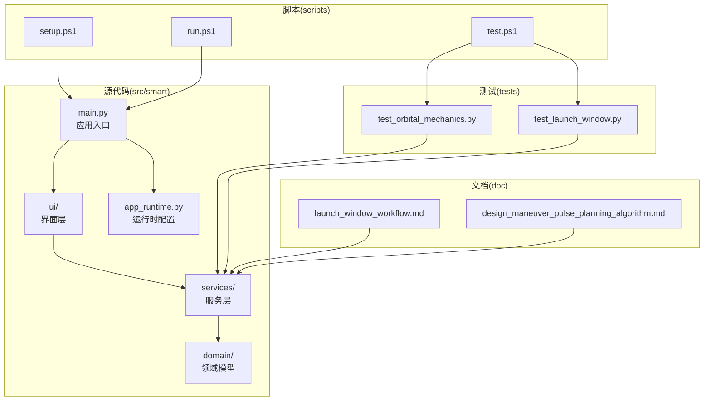
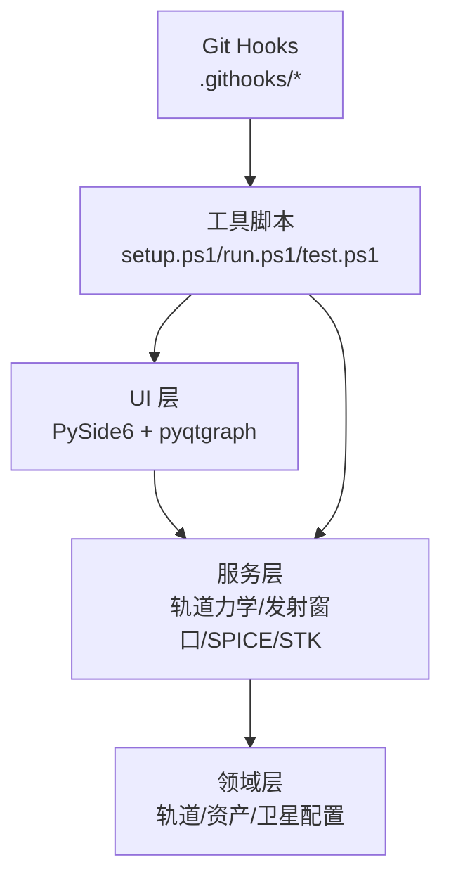
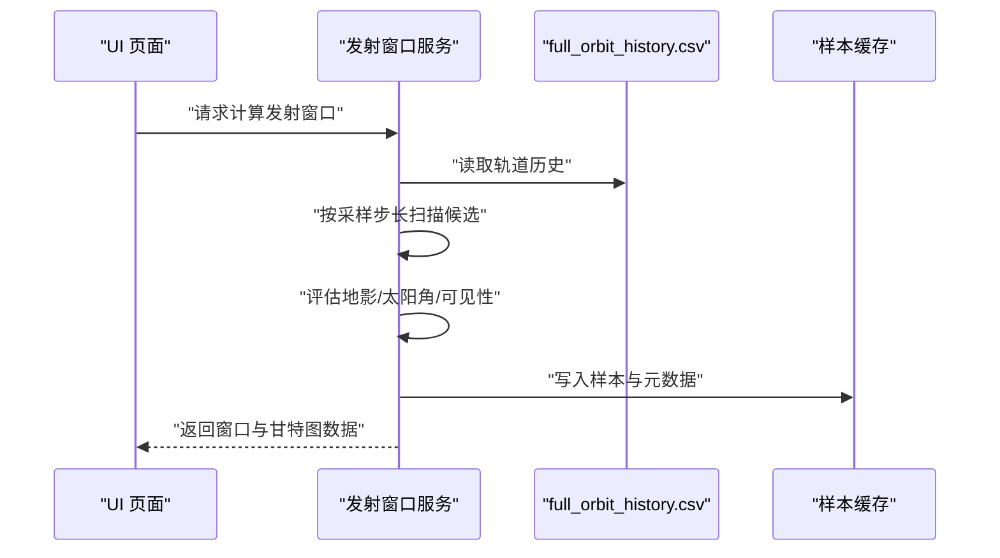
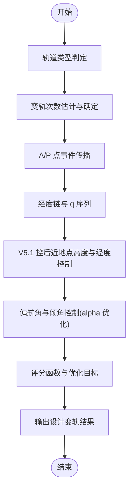
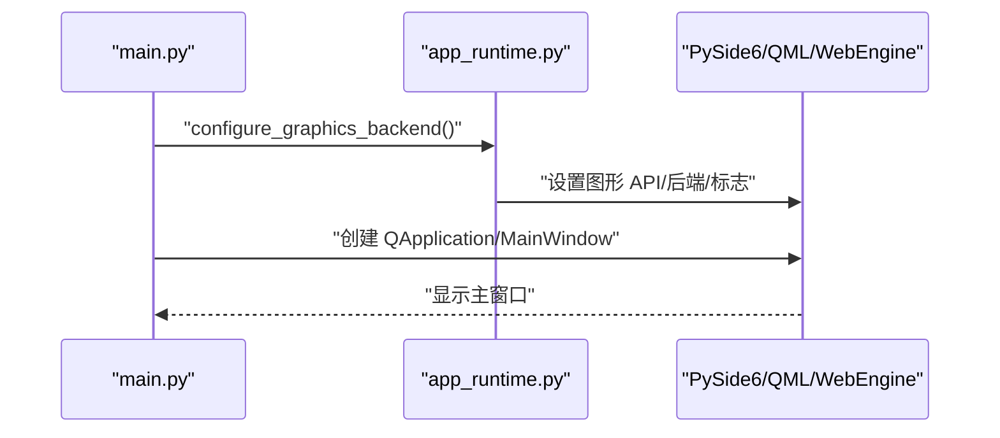
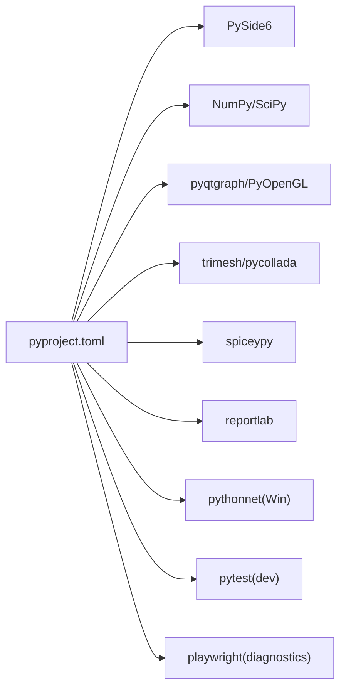

# 开发指南

<cite>
**本文引用的文件**
- [README.md](file://README.md)
- [pyproject.toml](file://pyproject.toml)
- [scripts/setup.ps1](file://scripts/setup.ps1)
- [scripts/run.ps1](file://scripts/run.ps1)
- [scripts/test.ps1](file://scripts/test.ps1)
- [src/smart/main.py](file://src/smart/main.py)
- [src/smart/app_runtime.py](file://src/smart/app_runtime.py)
- [src/smart/domain/models.py](file://src/smart/domain/models.py)
- [src/smart/services/__init__.py](file://src/smart/services/__init__.py)
- [src/smart/ui/__init__.py](file://src/smart/ui/__init__.py)
- [tests/test_orbital_mechanics.py](file://tests/test_orbital_mechanics.py)
- [tests/test_launch_window.py](file://tests/test_launch_window.py)
- [doc/launch_window_workflow.md](file://doc/launch_window_workflow.md)
- [doc/design_maneuver_pulse_planning_algorithm.md](file://doc/design_maneuver_pulse_planning_algorithm.md)
- [AGENTS.md](file://AGENTS.md)
</cite>

## 目录
1. [简介](#简介)
2. [项目结构](#项目结构)
3. [核心组件](#核心组件)
4. [架构总览](#架构总览)
5. [详细组件分析](#详细组件分析)
6. [依赖分析](#依赖分析)
7. [性能考量](#性能考量)
8. [故障排查指南](#故障排查指南)
9. [结论](#结论)
10. [附录](#附录)

## 简介
SMART 是一个面向航天任务设计与工程分析的桌面软件，围绕 STK 11.6 + SPICE + PySide6 构建统一工作流，覆盖项目管理、卫星3D模型配置、轨道初始化、设计变轨策略、连续推力参数优化、导入变轨策略、发射窗口计算、跟踪弧段分析、飞行程序设计、STK 联动、SPICE 内核管理、项目化数据落盘与 AI 辅助项目解读等核心链路。项目强调以北京时间配置任务参数、优先复用 SPICE 与本地 STK 能力、图形验证基于本地桌面绘图与 OpenGL 轨道视图运行，并将项目结果按 config/data/charts 结构自动沉淀。

## 项目结构
仓库采用按职责分层的组织方式：
- src/smart：源代码包，包含 domain（领域模型）、services（服务层）、ui（界面层）与入口模块
- tests：单元与功能测试
- data/kernels：本地 SPICE 内核
- scripts：PowerShell 工具脚本（安装、运行、测试、Git hooks）
- doc：算法与工作流文档
- projects：示例项目模板与数据

**图表来源**
- [src/smart/main.py:1-36](file://src/smart/main.py#L1-L36)
- [src/smart/app_runtime.py:1-96](file://src/smart/app_runtime.py#L1-L96)
- [tests/test_orbital_mechanics.py:1-143](file://tests/test_orbital_mechanics.py#L1-L143)
- [tests/test_launch_window.py:1-1027](file://tests/test_launch_window.py#L1-L1027)
- [scripts/setup.ps1:1-47](file://scripts/setup.ps1#L1-L47)
- [scripts/run.ps1:1-38](file://scripts/run.ps1#L1-L38)
- [scripts/test.ps1:1-38](file://scripts/test.ps1#L1-L38)
- [doc/launch_window_workflow.md:1-117](file://doc/launch_window_workflow.md#L1-L117)
- [doc/design_maneuver_pulse_planning_algorithm.md:1-741](file://doc/design_maneuver_pulse_planning_algorithm.md#L1-L741)

**章节来源**
- [README.md:187-196](file://README.md#L187-L196)
- [pyproject.toml:1-50](file://pyproject.toml#L1-L50)

## 核心组件
- 应用入口与运行时
  - 应用入口负责初始化图形后端、主题与主窗口，启动事件循环
  - 运行时配置确保 Qt Quick 与 WebEngine 使用一致的图形 API，避免桌面 OpenGL 与 D3D11 组合导致的黑屏问题
- 领域模型
  - 提供轨道根数、轨道轨迹、天线/地面资产/中继卫星配置等基础数据结构与校验
- 服务层
  - 包含轨道力学、发射窗口、SPICE 服务、STK 联动、PDF 报告导出等业务服务
- 测试层
  - 覆盖轨道力学算法、发射窗口扫描与约束评估等关键流程

**章节来源**
- [src/smart/main.py:10-36](file://src/smart/main.py#L10-L36)
- [src/smart/app_runtime.py:31-96](file://src/smart/app_runtime.py#L31-L96)
- [src/smart/domain/models.py:1-255](file://src/smart/domain/models.py#L1-L255)
- [tests/test_orbital_mechanics.py:1-143](file://tests/test_orbital_mechanics.py#L1-L143)
- [tests/test_launch_window.py:1-1027](file://tests/test_launch_window.py#L1-L1027)

## 架构总览
SMART 采用分层架构：
- UI 层：PySide6 + pyqtgraph，提供 2D/3D 视图与交互控件
- 服务层：封装数值计算、SPICE/STK 集成与工程约束评估
- 领域层：定义任务与轨道相关的数据模型与不变量
- 工具与脚本：PowerShell 脚本负责虚拟环境、安装与测试；Git hooks 维护更新日志

**图表来源**
- [src/smart/main.py:1-36](file://src/smart/main.py#L1-L36)
- [src/smart/app_runtime.py:1-96](file://src/smart/app_runtime.py#L1-L96)
- [pyproject.toml:1-50](file://pyproject.toml#L1-L50)
- [README.md:114-124](file://README.md#L114-L124)

## 详细组件分析

### 组件A：发射窗口分析服务
- 数据来源与缓存
  - 依赖 maneuver_strategy.json 与 full_orbit_history.csv
  - 采样候选发射时刻，评估地影、太阳角、地面站/中继可见性
  - 将连续通过样本合并为窗口，写入 launch_window_samples.csv 与元数据
- 结果与可视化
  - 结果表列包含窗口起止、T0 前沿、首圈地影、最长地影与边界限制条件
  - 甘特图按条件逐行渲染，通过区间绿色、失败区间空白
- 性能要点
  - 向量化计算地影/可见性，按需启用约束，节流进度回调，避免重复 IO

**图表来源**
- [doc/launch_window_workflow.md:1-117](file://doc/launch_window_workflow.md#L1-L117)
- [tests/test_launch_window.py:1-1027](file://tests/test_launch_window.py#L1-L1027)

**章节来源**
- [doc/launch_window_workflow.md:1-117](file://doc/launch_window_workflow.md#L1-L117)
- [tests/test_launch_window.py:1-1027](file://tests/test_launch_window.py#L1-L1027)

### 组件B：设计变轨策略脉冲规划
- 算法定位
  - 工程初设级脉冲规划，非有限推力高精度传播器
  - 默认超同步转移采用 V5.1 硬约束相位搜索：枚举 q 序列 → 搜索前段近地点目标 → 硬约束筛选 → 推进剂排序
- 关键流程
  - 轨道类型判定（超同步/标准转移）
  - 变轨次数估计与确定（推荐次数、用户指定、固定尾段）
  - A/P 点事件传播（J2 数值积分或二体解析）
  - 经度链与 q 序列（回归圈数控制）
  - V5.1 控后近地点高度与经度控制
  - 偏航角与倾角控制（alpha 优化）
  - 评分函数与优化目标（约束优先、推进剂最小化）
- 输出
  - DesignManeuverResult，包含 summary、burns、checks、warnings

**图表来源**
- [doc/design_maneuver_pulse_planning_algorithm.md:1-741](file://doc/design_maneuver_pulse_planning_algorithm.md#L1-L741)

**章节来源**
- [doc/design_maneuver_pulse_planning_algorithm.md:1-741](file://doc/design_maneuver_pulse_planning_algorithm.md#L1-L741)

### 组件C：应用入口与运行时配置
- 入口
  - 初始化图形后端（Qt Quick 与 WebEngine 图形 API 一致性）
  - 设置应用图标、主题与主窗口
- 运行时
  - 配置 SMART_WEBENGINE_BACKEND 与 Chromium 参数，兼容不同 GPU 驱动栈
  - 强制桌面 OpenGL 与上下文共享，避免组合渲染错误

**图表来源**
- [src/smart/main.py:10-36](file://src/smart/main.py#L10-L36)
- [src/smart/app_runtime.py:31-96](file://src/smart/app_runtime.py#L31-L96)

**章节来源**
- [src/smart/main.py:10-36](file://src/smart/main.py#L10-L36)
- [src/smart/app_runtime.py:31-96](file://src/smart/app_runtime.py#L31-L96)

### 组件D：领域模型与数据结构
- 领域模型
  - OrbitalElements、OrbitInitializationSettings、OrbitTrajectory、HohmannTransferResult、AntennaConfig、GroundAssetConfig、RelaySatelliteConfig、SatelliteStructureConfig、SatelliteStatusSettings 等
  - 提供 validate 方法与派生属性（周期、近/远地距离、速度等）
- 用途
  - 为服务层提供统一的数据契约，确保输入合法性与计算稳定性

**章节来源**
- [src/smart/domain/models.py:1-255](file://src/smart/domain/models.py#L1-L255)

## 依赖分析
- 构建系统
  - 使用 setuptools 作为构建后端，包目录映射至 src
- 运行时依赖
  - GUI：PySide6
  - 数值计算：NumPy、SciPy
  - 2D/3D 可视化：pyqtgraph、PyOpenGL、trimesh、pycollada
  - SPICE：spiceypy
  - 报告导出：reportlab
  - Windows 平台：pythonnet
- 可选依赖
  - dev：pytest
  - diagnostics：playwright（端到端诊断）

**图表来源**
- [pyproject.toml:1-50](file://pyproject.toml#L1-L50)

**章节来源**
- [pyproject.toml:1-50](file://pyproject.toml#L1-L50)

## 性能考量
- 向量化计算
  - 发射窗口服务中地影时长、最长连续时长、地面站仰角与中继星角度计算应保持 NumPy 向量化实现
- 条件启用
  - 仅在对应约束启用时计算太阳角、地面站测控角或中继星测控角
- 进度节流
  - 避免在候选点循环中频繁调用 processEvents()，减少 UI 事件抖动
- 缓存与元数据
  - 仅在元数据与当前输入一致时复用样本缓存，变更约束/阈值/步长/资源/策略后需重新计算

**章节来源**
- [doc/launch_window_workflow.md:98-107](file://doc/launch_window_workflow.md#L98-L107)
- [AGENTS.md:89-89](file://AGENTS.md#L89-L89)

## 故障排查指南
- 图形后端问题
  - 症状：WebEngine 黑屏或组合渲染错误
  - 处理：确保 QSG_RHI_BACKEND=opengl、QT_OPENGL=desktop、QQuickWindow.setGraphicsApi(OpenGL)，必要时设置 SMART_WEBENGINE_BACKEND=d3d11 或 swiftshader
- SPICE/STK 集成
  - 症状：STK 对象创建或帧转换异常
  - 处理：优先使用 SPICE 与本地 STK 能力，核对内核加载顺序与 UTC/ET 转换
- 测试执行
  - 症状：pytest 无法找到或混用系统 Python
  - 处理：使用虚拟环境中的 Python 执行 pytest，避免 PATH 混淆

**章节来源**
- [src/smart/app_runtime.py:31-96](file://src/smart/app_runtime.py#L31-L96)
- [AGENTS.md:31-42](file://AGENTS.md#L31-L42)
- [AGENTS.md:100-111](file://AGENTS.md#L100-L111)
- [AGENTS.md:112-118](file://AGENTS.md#L112-L118)

## 结论
SMART 通过清晰的分层架构与工程化的测试策略，实现了从轨道初始化到发射窗口与飞行程序设计的完整链路。建议在开发中坚持：
- 以 SPICE 优先的数值处理与本地 STK 集成
- 严格的约束校验与向量化性能优化
- 以测试驱动的迭代与缓存一致性保障
- 以文档与脚本工具提升协作效率

## 附录

### 开发环境搭建
- 虚拟环境与依赖
  - 使用 PowerShell 脚本创建虚拟环境并安装开发依赖
  - 也可直接模块启动应用
- 运行与测试
  - run.ps1 启动应用；test.ps1 运行测试；setup.ps1 安装依赖并注册 Git hooks

**章节来源**
- [README.md:82-113](file://README.md#L82-L113)
- [scripts/setup.ps1:1-47](file://scripts/setup.ps1#L1-L47)
- [scripts/run.ps1:1-38](file://scripts/run.ps1#L1-L38)
- [scripts/test.ps1:1-38](file://scripts/test.ps1#L1-L38)

### 代码规范与最佳实践
- UI 层时间字段以北京时间显示与编辑，服务/配置边界使用 UTC 字符串
- 避免鼠标滚轮驱动参数编辑，使用无滚轮控件
- 项目对话框风格统一，遵循深蓝/黑背景、青色边框与图标、橙色主按钮等规范
- 保持服务层计算向量化，避免在候选点循环中触发 UI 事件

**章节来源**
- [AGENTS.md:75-80](file://AGENTS.md#L75-L80)
- [AGENTS.md:89-89](file://AGENTS.md#L89-L89)

### 测试策略
- 单元测试
  - 覆盖轨道力学算法（开普勒/拉普拉斯/两体传播、Hohmann/平面变轨等）
- 集成测试
  - 覆盖发射窗口扫描与约束评估，包括样本缓存、结果表与甘特图
- 端到端测试
  - 可选 playwright 依赖用于 WebEngine 诊断与自动化验证

**章节来源**
- [tests/test_orbital_mechanics.py:1-143](file://tests/test_orbital_mechanics.py#L1-L143)
- [tests/test_launch_window.py:1-1027](file://tests/test_launch_window.py#L1-L1027)
- [pyproject.toml:24-31](file://pyproject.toml#L24-L31)

### Git 工作流程与代码审查
- Git hooks
  - 自动维护更新日志，提交时自动追加条目
- 建议流程
  - 小步提交、明确提交信息、在 Codex 会话中使用 handoff 文件传递上下文
  - 复杂任务优先使用文件化规划工作流，保持本地规划产物整洁

**章节来源**
- [README.md:114-124](file://README.md#L114-L124)
- [AGENTS.md:60-74](file://AGENTS.md#L60-L74)

### 调试技巧与性能分析
- 图形后端
  - 通过 SMART_WEBENGINE_BACKEND 与 Chromium 参数切换渲染后端
- 性能分析
  - 对发射窗口扫描进行向量化改造，按需启用约束，节流进度回调
- 问题排查
  - SPICE/STK 集成优先使用本地内核与 UTC/ET 转换，避免手动数学回退

**章节来源**
- [src/smart/app_runtime.py:44-90](file://src/smart/app_runtime.py#L44-L90)
- [doc/launch_window_workflow.md:98-107](file://doc/launch_window_workflow.md#L98-L107)
- [AGENTS.md:100-111](file://AGENTS.md#L100-L111)

### 代码质量保证
- 静态分析与覆盖率
  - 项目未包含静态分析与覆盖率配置文件；建议在 CI 中引入
- 持续集成
  - 建议在 CI 中执行 pytest，确保跨平台兼容性与依赖一致性

**章节来源**
- [pyproject.toml:24-31](file://pyproject.toml#L24-L31)

### 新功能开发流程
- 需求分析
  - 参考规划工作流与模板，形成轻量级文件化计划
- 设计与实现
  - 在 domain/services/ui 分层中新增或扩展模块，保持向量化与约束校验
- 测试验证
  - 补充单元/集成测试，必要时增加端到端测试
- 文档与发布
  - 更新相关文档，维护更新日志，按需发布

**章节来源**
- [AGENTS.md:60-74](file://AGENTS.md#L60-L74)
- [README.md:114-124](file://README.md#L114-L124)

### 构建与打包
- 构建系统
  - 使用 setuptools，包目录映射至 src
- 打包与脚本入口
  - 提供 smart 与 smart-webengine-diagnostics 命令入口
- 依赖管理
  - 运行时与可选依赖在 pyproject.toml 中声明

**章节来源**
- [pyproject.toml:1-50](file://pyproject.toml#L1-L50)

### 贡献指南与社区参与
- 使用 Caveman 技能进行通用响应
- STK 帮助知识库与本地帮助路径
- 小任务检查点：完成即总结、更新 handoff/notes、创建 git checkpoint 提交
- UI/发射窗口/SPICE/测试等规则明确，避免在 UI 线程阻塞与 API 错误使用

**章节来源**
- [AGENTS.md:1-125](file://AGENTS.md#L1-L125)