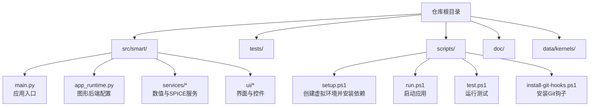
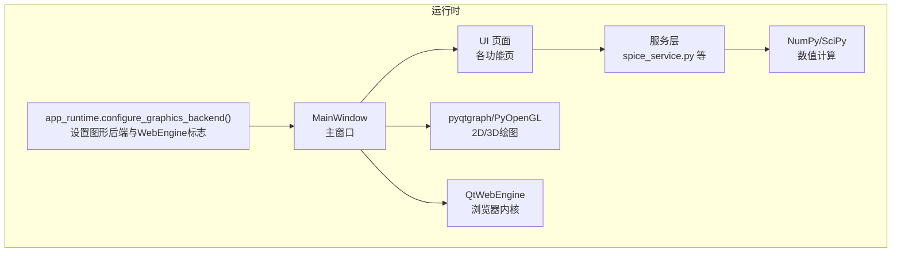
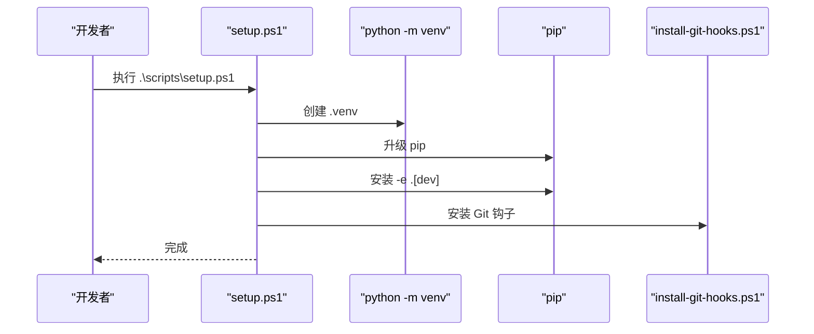
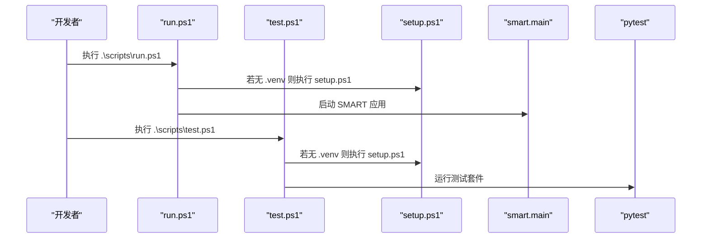
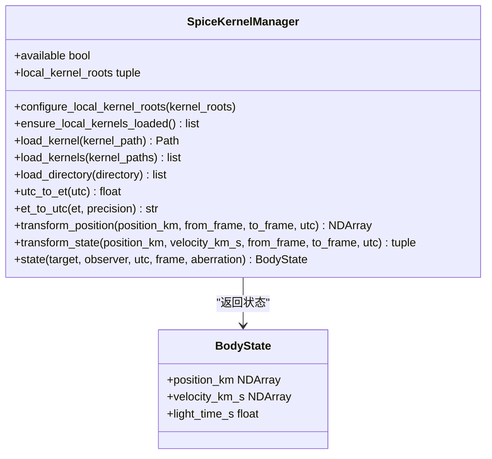
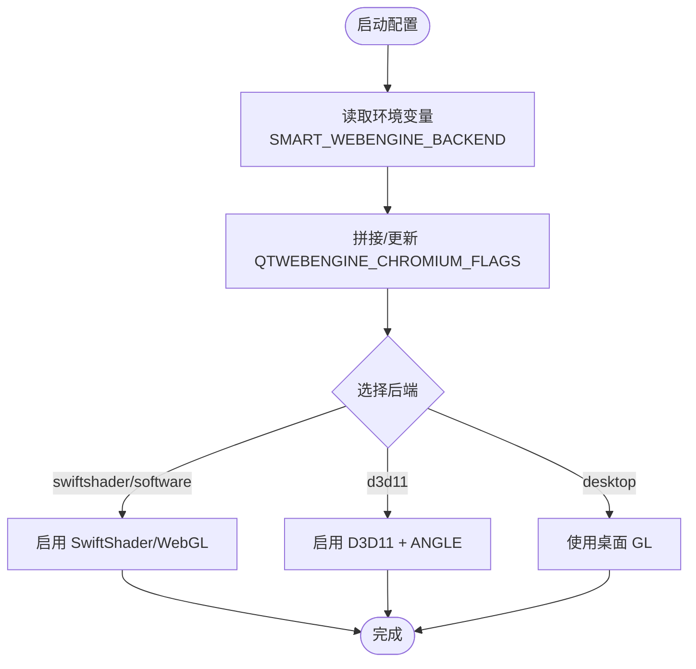
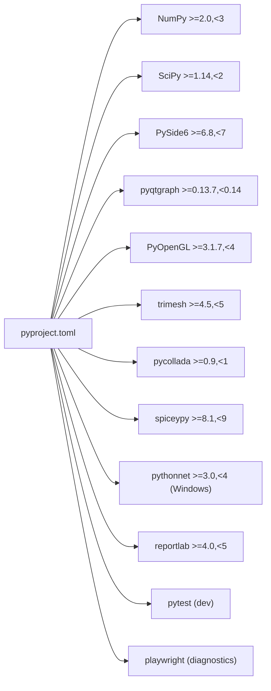

# 开发环境搭建

<cite>
**本文引用的文件**
- [pyproject.toml](file://pyproject.toml)
- [README.md](file://README.md)
- [setup.ps1](file://scripts/setup.ps1)
- [run.ps1](file://scripts/run.ps1)
- [test.ps1](file://scripts/test.ps1)
- [install-git-hooks.ps1](file://scripts/install-git-hooks.ps1)
- [main.py](file://src/smart/main.py)
- [app_runtime.py](file://src/smart/app_runtime.py)
- [spice_service.py](file://src/smart/services/spice_service.py)
- [spice_usage.md](file://doc/spice_usage.md)
- [webengine_diagnostics.py](file://src/smart/webengine_diagnostics.py)
- [test_app_runtime.py](file://tests/test_app_runtime.py)
- [test_spice_service.py](file://tests/test_spice_service.py)
</cite>

## 目录
1. [简介](#简介)
2. [项目结构](#项目结构)
3. [核心组件](#核心组件)
4. [架构总览](#架构总览)
5. [详细组件分析](#详细组件分析)
6. [依赖分析](#依赖分析)
7. [性能考虑](#性能考虑)
8. [故障排除指南](#故障排除指南)
9. [结论](#结论)
10. [附录](#附录)

## 简介
本指南面向首次参与 SMART 项目的开发者，提供从零搭建 Windows 平台开发环境的完整流程，涵盖 Python 3.10+ 环境配置、虚拟环境创建、依赖安装、开发工具配置、SPICE 内核准备、以及常见问题排查与环境验证步骤。SMART 是一款围绕 STK 11.6 + SPICE + PySide6 的航天任务分析桌面应用，强调数值计算、图形渲染与工程结果沉淀。

## 项目结构
SMART 采用“源码在 src 下、包名为 smart-desktop”的标准布局，入口模块为桌面应用主程序，核心业务逻辑分布在 services 与 ui 子模块中，测试位于 tests 目录，脚本位于 scripts 目录，文档位于 doc 目录，SPICE 内核默认放置于 data/kernels。

**图表来源**
- [README.md:187-196](file://README.md#L187-L196)
- [pyproject.toml:36-49](file://pyproject.toml#L36-L49)

**章节来源**
- [README.md:187-196](file://README.md#L187-L196)
- [pyproject.toml:36-49](file://pyproject.toml#L36-L49)

## 核心组件
- Python 版本与构建系统：要求 Python 3.10+，使用 setuptools 作为构建后端。
- 关键依赖：
  - NumPy：高性能数值计算基础库。
  - SciPy：科学与工程计算扩展。
  - PySide6：跨平台桌面 GUI 框架。
  - pyqtgraph + PyOpenGL：2D/3D 图形绘制与 OpenGL 支持。
  - trimesh + pycollada：3D 模型处理与导入。
  - SpiceyPy：SPICE 接口，用于时间、坐标系与状态向量计算。
  - pythonnet：仅 Windows 平台，用于与 .NET 组件交互。
  - reportlab：PDF 报告导出。
  - 可选依赖：pytest（开发）、playwright（诊断）。
- 应用入口：命令行入口 smart 指向 smart.main:main，桌面程序通过 main.py 启动。

**章节来源**
- [pyproject.toml:10-22](file://pyproject.toml#L10-L22)
- [pyproject.toml:32-34](file://pyproject.toml#L32-L34)
- [README.md:48-54](file://README.md#L48-L54)
- [main.py:10-31](file://src/smart/main.py#L10-L31)

## 架构总览
SMART 的运行时架构围绕“图形后端配置 + GUI 主窗口 + 服务层（数值/SPICE）+ UI 页面”展开。图形后端通过 app_runtime.py 统一配置，确保 Qt Quick/QWebEngine 与 OpenGL 上下文兼容；SPICE 服务封装在 spice_service.py 中，负责内核发现、加载与状态查询。

**图表来源**
- [app_runtime.py:31-90](file://src/smart/app_runtime.py#L31-L90)
- [main.py:18-31](file://src/smart/main.py#L18-L31)
- [spice_service.py:174-305](file://src/smart/services/spice_service.py#L174-L305)

## 详细组件分析

### 组件A：环境初始化与依赖安装（PowerShell 脚本）
该组件负责自动化创建虚拟环境、升级 pip、安装开发依赖与 Git 钩子，简化新环境搭建流程。

**图表来源**
- [setup.ps1:24-40](file://scripts/setup.ps1#L24-L40)

**章节来源**
- [setup.ps1:1-47](file://scripts/setup.ps1#L1-L47)
- [README.md:82-90](file://README.md#L82-L90)

### 组件B：应用启动与测试（PowerShell 脚本）
run.ps1 与 test.ps1 提供一键启动应用与运行测试的能力，内部会自动检测并触发 setup.ps1。

**图表来源**
- [run.ps1:20-33](file://scripts/run.ps1#L20-L33)
- [test.ps1:20-33](file://scripts/test.ps1#L20-L33)

**章节来源**
- [run.ps1:1-38](file://scripts/run.ps1#L1-L38)
- [test.ps1:1-38](file://scripts/test.ps1#L1-L38)

### 组件C：SPICE 服务与内核管理
spice_service.py 封装了 SPICE 的内核发现、加载、状态查询与下载预设等功能，是轨道与时间处理的核心。

**图表来源**
- [spice_service.py:174-305](file://src/smart/services/spice_service.py#L174-L305)

**章节来源**
- [spice_service.py:13-17](file://src/smart/services/spice_service.py#L13-L17)
- [spice_service.py:50-76](file://src/smart/services/spice_service.py#L50-L76)
- [spice_usage.md:1-69](file://doc/spice_usage.md#L1-L69)

### 组件D：图形后端与 WebEngine 诊断
app_runtime.py 统一配置 Qt 的图形后端与 WebEngine 的 Chromium 参数，webengine_diagnostics.py 提供诊断窗口，帮助定位 WebGL/GPU 相关问题。

**图表来源**
- [app_runtime.py:31-90](file://src/smart/app_runtime.py#L31-L90)

**章节来源**
- [app_runtime.py:10-90](file://src/smart/app_runtime.py#L10-L90)
- [webengine_diagnostics.py:192-208](file://src/smart/webengine_diagnostics.py#L192-L208)

## 依赖分析
SMART 的依赖分为核心运行时依赖与可选开发/诊断依赖。核心依赖与版本范围在 pyproject.toml 中明确声明，确保兼容性与稳定性。

**图表来源**
- [pyproject.toml:11-22](file://pyproject.toml#L11-L22)
- [pyproject.toml:24-30](file://pyproject.toml#L24-L30)

**章节来源**
- [pyproject.toml:11-22](file://pyproject.toml#L11-L22)
- [pyproject.toml:24-30](file://pyproject.toml#L24-L30)

## 性能考虑
- 图形后端选择：在 Windows 上若遇到硬件 WebGL 黑屏问题，可使用 SwiftShader 或 software 后端；必要时切换到 d3d11 或 desktop 后端。
- SPICE 内核加载：优先使用本地内核目录，避免重复下载；确保内核后缀符合支持列表，减少加载失败与重复加载。
- 测试与验证：通过 pytest 快速验证核心模块行为，确保数值计算与图形渲染路径稳定。

[本节为通用指导，无需特定文件引用]

## 故障排除指南
- PowerShell 执行策略限制
  - 现象：脚本无法执行。
  - 处理：在当前会话临时放宽执行策略，或调整系统策略。
  - 参考：[README.md:108-112](file://README.md#L108-L112)
- 虚拟环境未创建或路径错误
  - 现象：找不到 .venv/Scripts/python.exe。
  - 处理：执行 setup.ps1 创建虚拟环境；确认 Python 3.10+ 已安装。
  - 参考：[setup.ps1:24-34](file://scripts/setup.ps1#L24-L34)
- SPICE 未安装或内核缺失
  - 现象：SPICE 功能不可用或报错。
  - 处理：安装依赖；在 data/kernels/ 放置推荐内核；使用内置下载预设或手动放置内核。
  - 参考：[spice_usage.md:22-43](file://doc/spice_usage.md#L22-L43)，[spice_service.py:80-88](file://src/smart/services/spice_service.py#L80-L88)
- WebEngine/WebGL 渲染异常
  - 现象：WebGL 黑屏或 GPU 功能状态异常。
  - 处理：使用 webengine_diagnostics 工具诊断，切换 SMART_WEBENGINE_BACKEND 或图形后端。
  - 参考：[webengine_diagnostics.py:192-208](file://src/smart/webengine_diagnostics.py#L192-L208)，[app_runtime.py:44-90](file://src/smart/app_runtime.py#L44-L90)
- 依赖安装失败
  - 现象：pip 安装报错或版本冲突。
  - 处理：先升级 pip；在干净虚拟环境中安装；检查网络代理；必要时使用离线方式安装。
  - 参考：[setup.ps1:37-40](file://scripts/setup.ps1#L37-L40)

**章节来源**
- [README.md:108-112](file://README.md#L108-L112)
- [setup.ps1:24-40](file://scripts/setup.ps1#L24-L40)
- [spice_usage.md:22-43](file://doc/spice_usage.md#L22-L43)
- [spice_service.py:80-88](file://src/smart/services/spice_service.py#L80-L88)
- [webengine_diagnostics.py:192-208](file://src/smart/webengine_diagnostics.py#L192-L208)
- [app_runtime.py:44-90](file://src/smart/app_runtime.py#L44-L90)

## 结论
通过本指南，您可以在 Windows 平台上快速完成 SMART 的开发环境搭建：创建 Python 3.10+ 虚拟环境、安装项目依赖、准备 SPICE 内核、配置图形后端与 WebEngine、并使用脚本一键启动应用与运行测试。遇到问题时，可借助内置诊断工具与脚本日志进行定位与修复。

[本节为总结，无需特定文件引用]

## 附录

### A. Windows 平台完整安装流程（步骤说明）
- 步骤1：安装 Python 3.10+
  - 确认版本满足 requires-python >=3.10。
  - 参考：[pyproject.toml:10](file://pyproject.toml#L10)
- 步骤2：创建虚拟环境
  - 使用官方 venv 创建 .venv。
  - 参考：[README.md:84-86](file://README.md#L84-L86)
- 步骤3：安装依赖
  - 升级 pip；安装可编辑模式开发依赖。
  - 参考：[README.md:87-88](file://README.md#L87-L88)，[setup.ps1:37-40](file://scripts/setup.ps1#L37-L40)
- 步骤4：安装 Git 钩子
  - 设置 .githooks 为 hooksPath。
  - 参考：[install-git-hooks.ps1:9](file://scripts/install-git-hooks.ps1#L9)
- 步骤5：准备 SPICE 内核
  - 在 data/kernels/ 放置推荐内核；或使用下载预设。
  - 参考：[spice_usage.md:26-43](file://doc/spice_usage.md#L26-L43)
- 步骤6：启动应用与运行测试
  - 使用 run.ps1 启动；使用 test.ps1 运行测试。
  - 参考：[README.md:99-106](file://README.md#L99-L106)，[run.ps1:20-33](file://scripts/run.ps1#L20-L33)，[test.ps1:20-33](file://scripts/test.ps1#L20-L33)

**章节来源**
- [pyproject.toml:10](file://pyproject.toml#L10)
- [README.md:84-88](file://README.md#L84-L88)
- [setup.ps1:37-40](file://scripts/setup.ps1#L37-L40)
- [install-git-hooks.ps1:9](file://scripts/install-git-hooks.ps1#L9)
- [spice_usage.md:26-43](file://doc/spice_usage.md#L26-L43)
- [README.md:99-106](file://README.md#L99-L106)
- [run.ps1:20-33](file://scripts/run.ps1#L20-L33)
- [test.ps1:20-33](file://scripts/test.ps1#L20-L33)

### B. 环境验证清单
- 验证 Python 版本与虚拟环境
  - 确认 .venv/Scripts/python.exe 可用。
  - 参考：[setup.ps1:28-34](file://scripts/setup.ps1#L28-L34)
- 验证依赖安装
  - 运行测试套件，确保核心模块通过。
  - 参考：[README.md:198-203](file://README.md#L198-L203)，[test_app_runtime.py:8-29](file://tests/test_app_runtime.py#L8-L29)，[test_spice_service.py:20-31](file://tests/test_spice_service.py#L20-L31)
- 验证 SPICE 功能
  - 检查 runtime_summary 输出是否 Ready；加载内核后可查询状态。
  - 参考：[spice_service.py:79-88](file://src/smart/services/spice_service.py#L79-L88)，[spice_usage.md:65-69](file://doc/spice_usage.md#L65-L69)
- 验证图形与 WebEngine
  - 使用 webengine_diagnostics 工具检查 GPU 与 WebGL 状态。
  - 参考：[webengine_diagnostics.py:192-208](file://src/smart/webengine_diagnostics.py#L192-L208)

**章节来源**
- [setup.ps1:28-34](file://scripts/setup.ps1#L28-L34)
- [README.md:198-203](file://README.md#L198-L203)
- [test_app_runtime.py:8-29](file://tests/test_app_runtime.py#L8-L29)
- [test_spice_service.py:20-31](file://tests/test_spice_service.py#L20-L31)
- [spice_service.py:79-88](file://src/smart/services/spice_service.py#L79-L88)
- [spice_usage.md:65-69](file://doc/spice_usage.md#L65-L69)
- [webengine_diagnostics.py:192-208](file://src/smart/webengine_diagnostics.py#L192-L208)