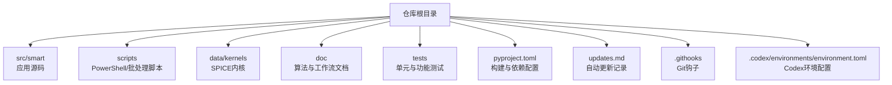
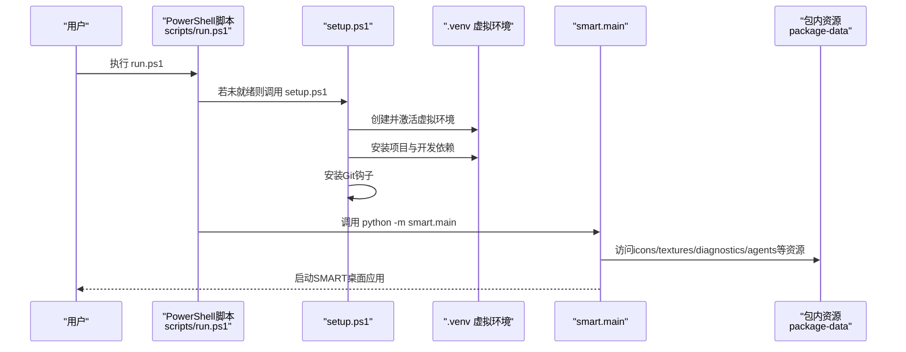
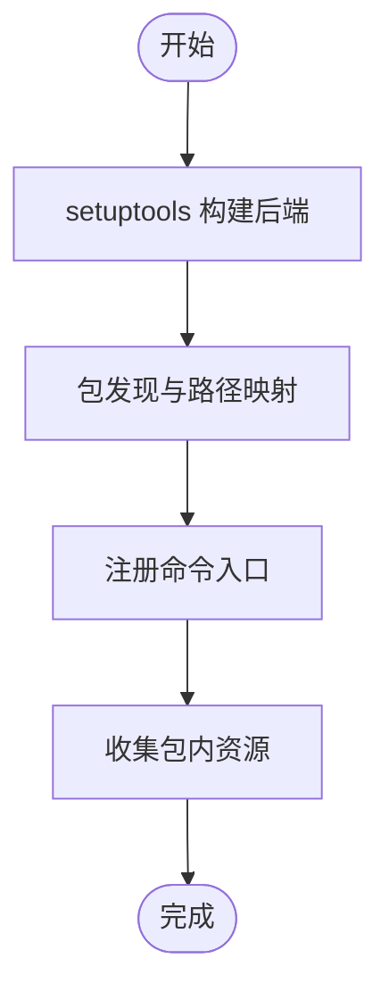
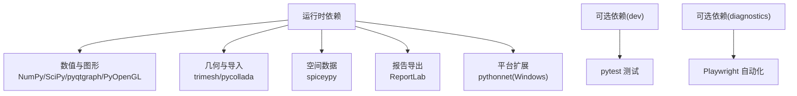
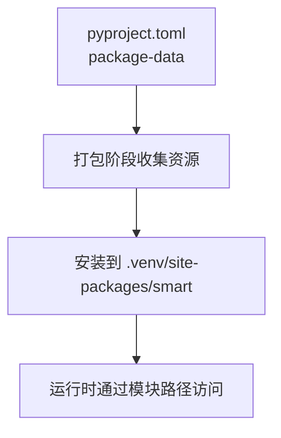
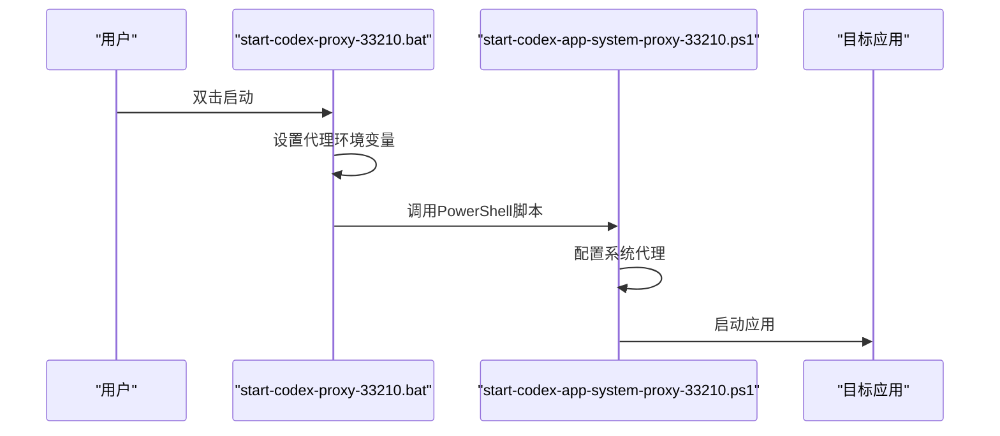
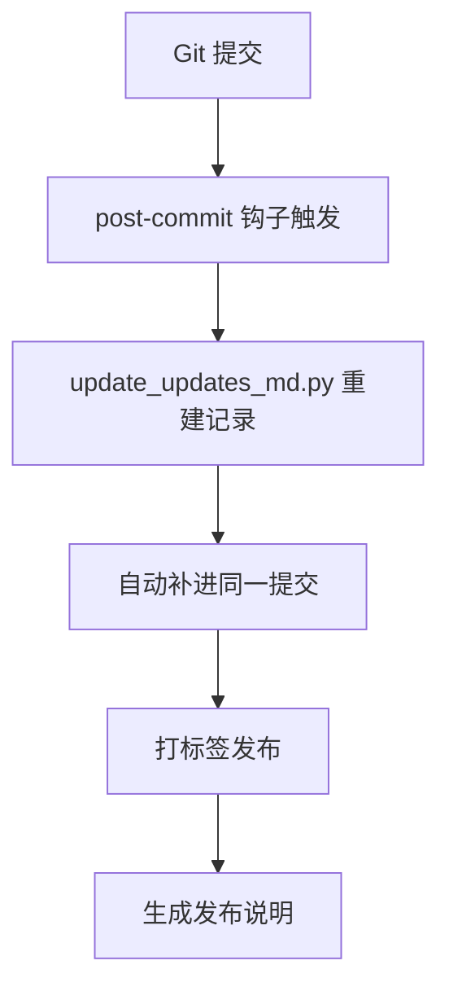
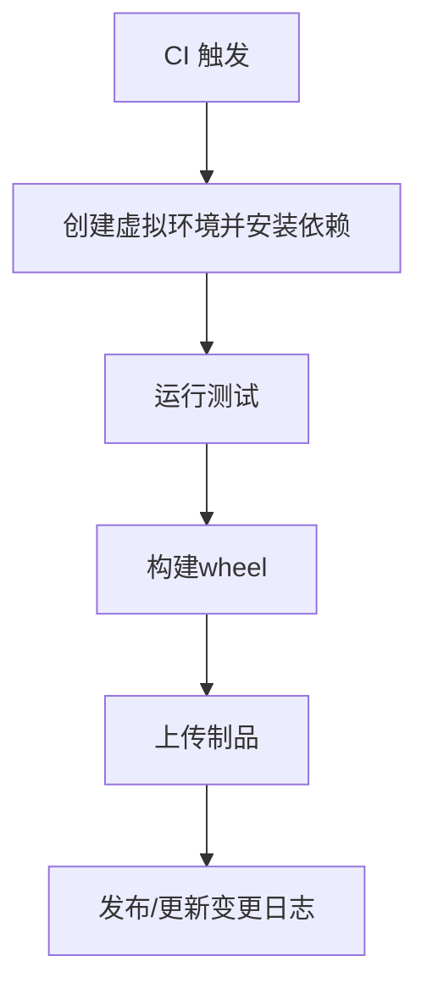
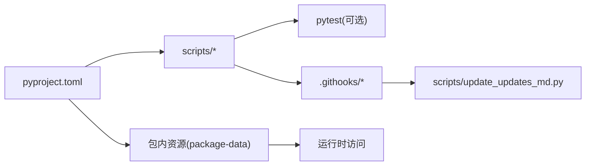

# 构建与部署

<cite>
**本文引用的文件**
- [README.md](file://README.md)
- [pyproject.toml](file://pyproject.toml)
- [scripts/setup.ps1](file://scripts/setup.ps1)
- [scripts/run.ps1](file://scripts/run.ps1)
- [scripts/test.ps1](file://scripts/test.ps1)
- [scripts/install-git-hooks.ps1](file://scripts/install-git-hooks.ps1)
- [scripts/update_updates_md.py](file://scripts/update_updates_md.py)
- [.githooks/post-commit](file://.githooks/post-commit)
- [start-codex-app-system-proxy-33210.ps1](file://start-codex-app-system-proxy-33210.ps1)
- [start-codex-proxy-33210.bat](file://start-codex-proxy-33210.bat)
- [.codex/environments/environment.toml](file://.codex/environments/environment.toml)
- [updates.md](file://updates.md)
</cite>

## 目录
1. [简介](#简介)
2. [项目结构](#项目结构)
3. [核心组件](#核心组件)
4. [架构总览](#架构总览)
5. [详细组件分析](#详细组件分析)
6. [依赖关系分析](#依赖关系分析)
7. [性能考虑](#性能考虑)
8. [故障排查指南](#故障排查指南)
9. [结论](#结论)
10. [附录](#附录)

## 简介
本指南面向SMART桌面应用的构建与部署，覆盖以下要点：
- 构建流程与打包配置：基于标准Python打包体系，定义入口命令与包内资源。
- 依赖管理：集中于pyproject.toml，区分运行时与开发/诊断依赖。
- 资源文件处理：通过package-data声明静态资源路径，确保打包后可被运行时访问。
- 平台部署策略：聚焦Windows平台的应用启动与代理配置，提供可复用脚本与批处理。
- 启动脚本使用：包含虚拟环境准备、应用启动、测试执行与Git钩子安装。
- 版本管理与发布：基于Git提交与自动更新记录，给出版本号规范与变更日志维护建议。
- CI/CD建议：结合现有脚本与钩子，提出可落地的自动化流程设计思路。
- 部署后监控与维护：结合更新记录与日志机制，提供运维视角的建议。

## 项目结构
SMART采用“src为主、脚本在scripts、资源在assets”的组织方式，核心入口为命令行脚本与主程序模块，资源通过打包配置纳入发行包。

**章节来源**
- [README.md: 187-196:187-196](file://README.md#L187-L196)
- [pyproject.toml: 36-49:36-49](file://pyproject.toml#L36-L49)

## 核心组件
- 打包与入口
  - 命令行入口：通过项目脚本注册smart与诊断工具入口，指向主模块函数。
  - 包内资源：通过package-data声明icons、textures、diagnostics与agents文档等静态资源路径。
- 依赖管理
  - 运行时依赖：NumPy、SciPy、PySide6、pyqtgraph、PyOpenGL、trimesh、pycollada、spiceypy、ReportLab等。
  - 可选依赖：dev用于测试，diagnostics用于Playwright自动化测试。
  - Windows专用依赖：pythonnet。
- 构建后资源
  - 资源文件随包分发，运行时可通过模块路径访问，保证跨平台一致性。

**章节来源**
- [pyproject.toml: 5-34:5-34](file://pyproject.toml#L5-L34)
- [pyproject.toml: 42-49:42-49](file://pyproject.toml#L42-L49)

## 架构总览
下图展示从用户执行到应用启动的关键流程，以及与脚本、钩子和资源的关系。

**图表来源**
- [scripts/run.ps1: 20-37:20-37](file://scripts/run.ps1#L20-L37)
- [scripts/setup.ps1: 20-46:20-46](file://scripts/setup.ps1#L20-L46)
- [pyproject.toml: 32-34:32-34](file://pyproject.toml#L32-L34)
- [pyproject.toml: 42-49:42-49](file://pyproject.toml#L42-L49)

**章节来源**
- [scripts/run.ps1: 20-37:20-37](file://scripts/run.ps1#L20-L37)
- [scripts/setup.ps1: 20-46:20-46](file://scripts/setup.ps1#L20-L46)
- [pyproject.toml: 32-34:32-34](file://pyproject.toml#L32-L34)
- [pyproject.toml: 42-49:42-49](file://pyproject.toml#L42-L49)

## 详细组件分析

### 构建与打包配置
- 打包后端：setuptools + build-meta。
- 包发现：通过where与package-dir将src映射为包根。
- 入口命令：smart与smart-webengine-diagnostics分别指向主模块与诊断模块。
- 包内资源：icons、textures、diagnostics与agents文档路径纳入打包。

**章节来源**
- [pyproject.toml: 1-41:1-41](file://pyproject.toml#L1-L41)
- [pyproject.toml: 32-49:32-49](file://pyproject.toml#L32-L49)

### 依赖管理策略
- 运行时依赖：限定版本范围，确保兼容性与稳定性。
- 可选依赖：dev与diagnostics分离，避免生产环境冗余。
- 平台差异：Windows平台增加pythonnet，满足特定COM交互需求。

**章节来源**
- [pyproject.toml: 11-22:11-22](file://pyproject.toml#L11-L22)
- [pyproject.toml: 24-30:24-30](file://pyproject.toml#L24-L30)

### 资源文件处理
- package-data声明路径集合，确保资源随包分发。
- 运行时通过模块路径访问资源，避免硬编码绝对路径。
- assets目录包含icons、textures与diagnostics HTML，便于UI与诊断工具使用。

**章节来源**
- [pyproject.toml: 42-49:42-49](file://pyproject.toml#L42-L49)

### Windows平台部署与启动
- PowerShell启动脚本：自动检测并创建/激活虚拟环境，然后启动应用。
- 批处理代理脚本：设置HTTP/HTTPS/ALL_PROXY并启动指定应用。
- Codex环境配置：通过environment.toml定义运行命令，便于外部工具集成。

**图表来源**
- [start-codex-proxy-33210.bat: 4-10:4-10](file://start-codex-proxy-33210.bat#L4-L10)
- [start-codex-app-system-proxy-33210.ps1: 3-11:3-11](file://start-codex-app-system-proxy-33210.ps1#L3-L11)

**章节来源**
- [scripts/run.ps1: 20-37:20-37](file://scripts/run.ps1#L20-L37)
- [start-codex-proxy-33210.bat: 4-10:4-10](file://start-codex-proxy-33210.bat#L4-L10)
- [start-codex-app-system-proxy-33210.ps1: 3-11:3-11](file://start-codex-app-system-proxy-33210.ps1#L3-L11)
- [.codex/environments/environment.toml: 8-11:8-11](file://.codex/environments/environment.toml#L8-L11)

### 版本管理与发布流程
- 版本号：pyproject.toml中定义，遵循语义化版本。
- 变更日志：通过post-commit钩子自动维护updates.md，记录每次提交的时间戳、标题与影响文件。
- 发布建议：以版本标签为界，合并变更至主分支后，更新版本号并在发布说明中汇总重要改动。

**图表来源**
- [.githooks/post-commit: 8-15:8-15](file://.githooks/post-commit#L8-L15)
- [scripts/update_updates_md.py: 182-187:182-187](file://scripts/update_updates_md.py#L182-L187)

**章节来源**
- [pyproject.toml: 6-7:6-7](file://pyproject.toml#L6-L7)
- [.githooks/post-commit: 8-15:8-15](file://.githooks/post-commit#L8-L15)
- [scripts/update_updates_md.py: 182-187:182-187](file://scripts/update_updates_md.py#L182-L187)
- [updates.md: 1-10:1-10](file://updates.md#L1-L10)

### CI/CD配置建议与自动化流程
- 触发条件：push到主分支或创建标签。
- 步骤建议：
  - 环境准备：使用Python 3.10+，创建虚拟环境并安装依赖（含dev）。
  - 测试：运行pytest，覆盖核心模块与功能。
  - 构建：使用setuptools进行构建，产出wheel。
  - 发布：上传wheel至制品库或发布页面；更新updates.md（如需）。
- 工具集成：结合Codex环境配置，将构建与测试命令标准化。

**章节来源**
- [scripts/setup.ps1: 38-39:38-39](file://scripts/setup.ps1#L38-L39)
- [scripts/test.ps1: 33](file://scripts/test.ps1#L33)
- [pyproject.toml: 1-4:1-4](file://pyproject.toml#L1-L4)
- [.codex/environments/environment.toml: 11](file://.codex/environments/environment.toml#L11)

### 部署后监控与维护
- 更新记录：通过post-commit钩子自动维护，便于追踪每次改动。
- 日志与审计：利用更新记录中的时间戳与提交信息，定位问题与回归。
- 运维建议：定期审阅updates.md，识别高频变更模块；在发布前进行回归测试与资源路径校验。

**章节来源**
- [.githooks/post-commit: 8-15:8-15](file://.githooks/post-commit#L8-L15)
- [scripts/update_updates_md.py: 166-179:166-179](file://scripts/update_updates_md.py#L166-L179)
- [updates.md: 1-10:1-10](file://updates.md#L1-L10)

## 依赖关系分析
- 组件耦合
  - scripts依赖pyproject定义的入口与依赖；setup自动安装dev与diagnostics。
  - .githooks依赖post-commit脚本与update_updates_md.py。
  - 应用运行时依赖包内资源，资源路径由pyproject声明。
- 外部依赖
  - Windows平台依赖pythonnet；SPICE相关依赖spiceypy；GUI与3D渲染依赖PySide6与PyOpenGL。

**图表来源**
- [pyproject.toml: 32-49:32-49](file://pyproject.toml#L32-L49)
- [scripts/setup.ps1: 38-40:38-40](file://scripts/setup.ps1#L38-L40)
- [.githooks/post-commit: 10](file://.githooks/post-commit#L10)
- [scripts/update_updates_md.py: 208-217:208-217](file://scripts/update_updates_md.py#L208-L217)

**章节来源**
- [pyproject.toml: 32-49:32-49](file://pyproject.toml#L32-L49)
- [scripts/setup.ps1: 38-40:38-40](file://scripts/setup.ps1#L38-L40)
- [.githooks/post-commit: 10](file://.githooks/post-commit#L10)
- [scripts/update_updates_md.py: 208-217:208-217](file://scripts/update_updates_md.py#L208-L217)

## 性能考虑
- 虚拟环境隔离：通过脚本统一创建与激活，避免依赖冲突与重复安装。
- 资源访问：包内资源集中声明，减少运行时路径查找开销。
- 平台差异：Windows专用依赖仅在该平台生效，避免非必要安装。

## 故障排查指南
- 虚拟环境未创建或损坏
  - 症状：run.ps1提示未找到解释器。
  - 处理：执行setup.ps1强制重建，或手动删除.vnev后重试。
- 权限问题导致脚本无法执行
  - 症状：PowerShell执行策略限制。
  - 处理：按README指引临时放宽策略，或使用批处理脚本。
- 代理与网络访问
  - 症状：应用或测试阶段网络受限。
  - 处理：使用start-codex-proxy-33210.bat设置代理，或通过系统代理脚本配置。
- 变更日志异常
  - 症状：updates.md未更新或内容不一致。
  - 处理：确认post-commit钩子是否正确安装；必要时手动执行update_updates_md.py。

**章节来源**
- [scripts/run.ps1: 24-29:24-29](file://scripts/run.ps1#L24-L29)
- [scripts/setup.ps1: 24-34:24-34](file://scripts/setup.ps1#L24-L34)
- [README.md: 108-112:108-112](file://README.md#L108-L112)
- [start-codex-proxy-33210.bat: 4-10:4-10](file://start-codex-proxy-33210.bat#L4-L10)
- [.githooks/post-commit: 8-15:8-15](file://.githooks/post-commit#L8-L15)
- [scripts/update_updates_md.py: 208-217:208-217](file://scripts/update_updates_md.py#L208-L217)

## 结论
本指南基于仓库现有脚本与配置，给出了SMART的构建与部署实践路径。通过统一的虚拟环境管理、清晰的依赖与资源声明、Windows平台的启动与代理脚本，以及自动化的变更日志维护，能够有效支撑日常开发、测试与发布。建议在CI/CD中固化这些步骤，确保交付质量与可追溯性。

## 附录
- 快速开始与运行
  - 使用PowerShell脚本一键安装与启动，或直接设置PYTHONPATH后运行主模块。
- 项目管理与数据落盘
  - 项目激活后，配置与结果按约定路径自动保存，便于复算与交接。
- SPICE内核
  - 将内核置于data/kernels/，遵循默认加载顺序与调用示例。

**章节来源**
- [README.md: 82-97:82-97](file://README.md#L82-L97)
- [README.md: 125-152:125-152](file://README.md#L125-L152)
- [README.md: 161-185:161-185](file://README.md#L161-L185)