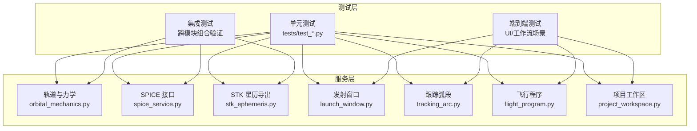
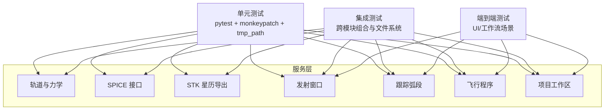
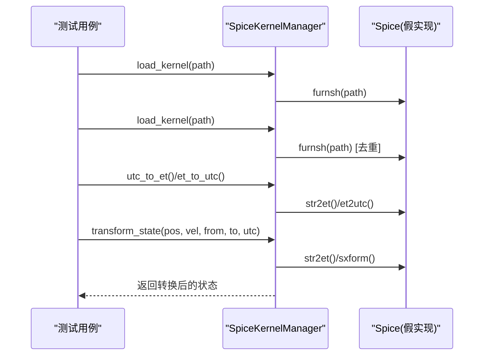
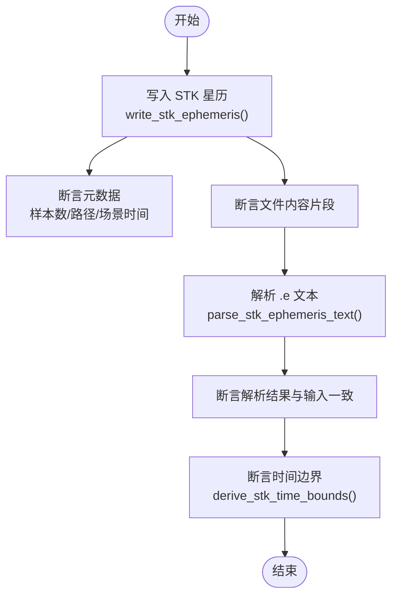
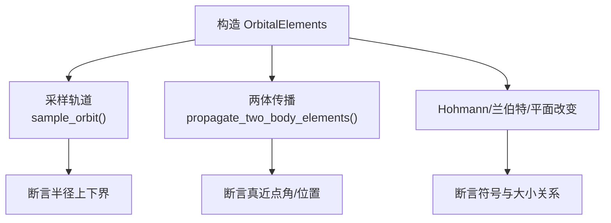
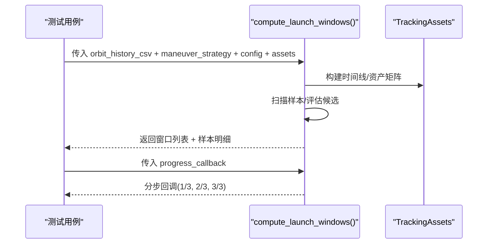
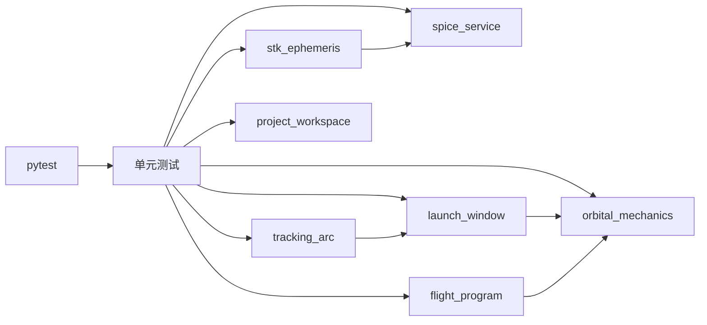

# 测试策略

<cite>
**本文引用的文件**
- [README.md](file://README.md)
- [pyproject.toml](file://pyproject.toml)
- [scripts/test.ps1](file://scripts/test.ps1)
- [tests/test_spice_service.py](file://tests/test_spice_service.py)
- [tests/test_stk_ephemeris.py](file://tests/test_stk_ephemeris.py)
- [tests/test_orbital_mechanics.py](file://tests/test_orbital_mechanics.py)
- [tests/test_launch_window.py](file://tests/test_launch_window.py)
- [tests/test_flight_program.py](file://tests/test_flight_program.py)
- [tests/test_tracking_arc.py](file://tests/test_tracking_arc.py)
- [tests/test_project_workspace.py](file://tests/test_project_workspace.py)
- [tests/test_orbit_initialization.py](file://tests/test_orbit_initialization.py)
- [src/smart/services/spice_service.py](file://src/smart/services/spice_service.py)
- [src/smart/services/stk_ephemeris.py](file://src/smart/services/stk_ephemeris.py)
- [src/smart/services/orbital_mechanics.py](file://src/smart/services/orbital_mechanics.py)
- [src/smart/services/launch_window.py](file://src/smart/services/launch_window.py)
- [src/smart/services/project_workspace.py](file://src/smart/services/project_workspace.py)
</cite>

## 目录
1. [引言](#引言)
2. [项目结构](#项目结构)
3. [核心组件](#核心组件)
4. [架构总览](#架构总览)
5. [详细组件分析](#详细组件分析)
6. [依赖关系分析](#依赖关系分析)
7. [性能考量](#性能考量)
8. [故障排查指南](#故障排查指南)
9. [结论](#结论)
10. [附录](#附录)

## 引言
本测试策略文档面向 SMART 项目，系统化阐述测试金字塔（单元测试、集成测试、端到端测试）的实施方法，结合 pytest 测试框架的配置与使用规范，给出各类服务（轨道计算、SPICE 接口、STK 集成、发射窗口、跟踪弧段、飞行程序、项目工作区等）的测试策略与实践建议。同时提供测试数据准备、模拟对象创建、覆盖率与质量门禁、以及持续集成中的测试执行流程与结果分析方法。

## 项目结构
SMART 采用分层组织：src/smart 下为业务域与服务层，tests 为测试集合，scripts 提供运行与测试脚本，README 与 pyproject.toml 描述项目与依赖。测试覆盖主要集中在服务层与核心算法，确保数值正确性、接口稳定性与跨组件协作可靠性。

**图表来源**
- [tests/test_orbital_mechanics.py:1-143](file://tests/test_orbital_mechanics.py#L1-L143)
- [tests/test_spice_service.py:1-199](file://tests/test_spice_service.py#L1-L199)
- [tests/test_stk_ephemeris.py:1-77](file://tests/test_stk_ephemeris.py#L1-L77)
- [tests/test_launch_window.py:1-800](file://tests/test_launch_window.py#L1-L800)
- [tests/test_flight_program.py:1-314](file://tests/test_flight_program.py#L1-L314)
- [tests/test_tracking_arc.py:1-465](file://tests/test_tracking_arc.py#L1-L465)
- [tests/test_project_workspace.py:1-432](file://tests/test_project_workspace.py#L1-L432)

**章节来源**
- [README.md: 187-196:187-196](file://README.md#L187-L196)
- [pyproject.toml: 24-30:24-30](file://pyproject.toml#L24-L30)

## 核心组件
- 轨道与力学（orbital_mechanics）：提供开普勒/拉普拉斯/两体传播、Hohmann/平面改变/兰伯特定轨等核心算法，用于单元测试的数学正确性验证。
- SPICE 接口（spice_service）：封装内核发现、下载、加载与时间/坐标转换，用于单元测试的边界条件与错误路径覆盖。
- STK 星历导出（stk_ephemeris）：将轨道历史转换为 STK .e 文件，用于单元测试的格式与一致性验证。
- 发射窗口（launch_window）：多资产、多约束的窗口扫描与合并逻辑，用于单元测试的复杂流程与边界条件。
- 跟踪弧段（tracking_arc）：基于窗口与轨道历史生成甘特图与统计，用于单元测试的 UI/数据一致性。
- 飞行程序（flight_program）：姿态模式采样与事件序列构建，用于单元测试的状态机与采样正确性。
- 项目工作区（project_workspace）：项目生命周期与配置持久化，用于单元测试的文件系统与配置一致性。

**章节来源**
- [src/smart/services/orbital_mechanics.py: 1-200:1-200](file://src/smart/services/orbital_mechanics.py#L1-L200)
- [src/smart/services/spice_service.py: 1-200:1-200](file://src/smart/services/spice_service.py#L1-L200)
- [src/smart/services/stk_ephemeris.py: 1-200:1-200](file://src/smart/services/stk_ephemeris.py#L1-L200)
- [src/smart/services/launch_window.py: 1-200:1-200](file://src/smart/services/launch_window.py#L1-L200)
- [src/smart/services/project_workspace.py: 1-200:1-200](file://src/smart/services/project_workspace.py#L1-L200)

## 架构总览
下图展示测试金字塔在 SMART 中的映射：单元测试聚焦服务层算法与接口；集成测试关注跨服务协作与数据流；端到端测试覆盖 UI 工作流与真实数据链路。

**图表来源**
- [tests/test_orbital_mechanics.py:1-143](file://tests/test_orbital_mechanics.py#L1-L143)
- [tests/test_spice_service.py:1-199](file://tests/test_spice_service.py#L1-L199)
- [tests/test_stk_ephemeris.py:1-77](file://tests/test_stk_ephemeris.py#L1-L77)
- [tests/test_launch_window.py:1-800](file://tests/test_launch_window.py#L1-L800)
- [tests/test_flight_program.py:1-314](file://tests/test_flight_program.py#L1-L314)
- [tests/test_tracking_arc.py:1-465](file://tests/test_tracking_arc.py#L1-L465)
- [tests/test_project_workspace.py:1-432](file://tests/test_project_workspace.py#L1-L432)

## 详细组件分析

### SPICE 接口测试策略
- 目标：验证内核发现、下载、去重加载、时间/坐标转换与错误处理。
- 方法：
  - 使用 monkeypatch 注入假 Spice 实现，断言调用序列与参数。
  - 使用 tmp_path 构造临时内核文件，验证加载与去重。
  - 验证 UTC/ET 转换、SXFORM/PXFORM 使用路径。
  - 验证下载 URL 解析、文件名推断与覆盖策略。
- 关键断言：加载次数、调用顺序、异常抛出、文件内容与元数据。

**图表来源**
- [tests/test_spice_service.py: 33-55:33-55](file://tests/test_spice_service.py#L33-L55)
- [tests/test_spice_service.py: 57-96:57-96](file://tests/test_spice_service.py#L57-L96)
- [tests/test_spice_service.py: 98-138:98-138](file://tests/test_spice_service.py#L98-L138)
- [tests/test_spice_service.py: 150-171:150-171](file://tests/test_spice_service.py#L150-L171)

**章节来源**
- [tests/test_spice_service.py: 20-199:20-199](file://tests/test_spice_service.py#L20-L199)
- [src/smart/services/spice_service.py: 174-200:174-200](file://src/smart/services/spice_service.py#L174-L200)

### STK 星历导出测试策略
- 目标：验证 .e 文件生成的格式、元数据与解析一致性。
- 方法：
  - 使用 tmp_path 生成 CSV 历史，调用写入函数，断言文件内容片段与元数据。
  - 使用解析函数反向验证解析结果与输入一致。
  - 验证时间边界推导与 STK 时间格式。
- 关键断言：文件头字段、采样数量、场景时间、位置/速度单位与坐标系。

**图表来源**
- [tests/test_stk_ephemeris.py: 9-61:9-61](file://tests/test_stk_ephemeris.py#L9-L61)
- [tests/test_stk_ephemeris.py: 63-77:63-77](file://tests/test_stk_ephemeris.py#L63-L77)
- [src/smart/services/stk_ephemeris.py: 31-112:31-112](file://src/smart/services/stk_ephemeris.py#L31-L112)

**章节来源**
- [tests/test_stk_ephemeris.py: 1-77:1-77](file://tests/test_stk_ephemeris.py#L1-L77)
- [src/smart/services/stk_ephemeris.py: 114-152:114-152](file://src/smart/services/stk_ephemeris.py#L114-L152)

### 轨道力学测试策略
- 目标：验证轨道采样、两体传播、Hohmann/兰伯特/平面改变等算法的数值正确性与边界行为。
- 方法：
  - 使用已知轨道要素进行正向/逆向变换，断言误差在容差范围内。
  - 对 Hohmann/兰伯特等过程断言符号与大小关系。
  - 对采样半径上下界进行比较。
- 关键断言：半长轴/离心率/倾角等参数恢复精度、速度/半径边界、角度转换往返一致性。

**图表来源**
- [tests/test_orbital_mechanics.py: 25-36:25-36](file://tests/test_orbital_mechanics.py#L25-L36)
- [tests/test_orbital_mechanics.py: 128-143:128-143](file://tests/test_orbital_mechanics.py#L128-L143)
- [src/smart/services/orbital_mechanics.py: 129-173:129-173](file://src/smart/services/orbital_mechanics.py#L129-L173)

**章节来源**
- [tests/test_orbital_mechanics.py: 1-143:1-143](file://tests/test_orbital_mechanics.py#L1-L143)
- [src/smart/services/orbital_mechanics.py: 29-95:29-95](file://src/smart/services/orbital_mechanics.py#L29-L95)

### 发射窗口测试策略
- 目标：验证配置归一化、约束表达式解析、窗口合并、进度回调与资产矩阵计算。
- 方法：
  - 归一化配置断言默认值与单位转换。
  - 参数化时间表达式解析断言区间边界。
  - 窗口合并断言前后约束标记与阴影指标。
  - 进度回调断言分步通知。
- 关键断言：配置字段标准化、参数化表达式求值、窗口持续时间与约束标记、资产位置矩阵形状与值。

**图表来源**
- [tests/test_launch_window.py: 105-129:105-129](file://tests/test_launch_window.py#L105-L129)
- [tests/test_launch_window.py: 254-264:254-264](file://tests/test_launch_window.py#L254-L264)
- [tests/test_launch_window.py: 489-518:489-518](file://tests/test_launch_window.py#L489-L518)

**章节来源**
- [tests/test_launch_window.py: 105-800:105-800](file://tests/test_launch_window.py#L105-L800)
- [src/smart/services/launch_window.py: 54-136:54-136](file://src/smart/services/launch_window.py#L54-L136)

### 跟踪弧段测试策略
- 目标：验证窗口点位（前沿/中点/后沿）选择、甘特图构建、资产汇总与 UI 数据一致性。
- 方法：
  - 生成简化的轨道历史 CSV，断言三种点位的时间戳。
  - 构建窗口结果，断言甘特段与资产汇总统计。
  - UI 组件测试断言对话框、同步按钮与警告提示。
- 关键断言：点位键值与 UTC、甘特段起止时间、资产汇总时长与数量。

**章节来源**
- [tests/test_tracking_arc.py: 315-375:315-375](file://tests/test_tracking_arc.py#L315-L375)
- [tests/test_tracking_arc.py: 396-465:396-465](file://tests/test_tracking_arc.py#L396-L465)

### 飞行程序测试策略
- 目标：验证事件归一化、草稿生成、姿态模式采样与上下文复用。
- 方法：
  - 事件归一化断言字段完整性与时序修正。
  - 草稿生成断言姿态模式覆盖与事件类型。
  - 采样上下文断言预计算数据复用避免重复计算。
- 关键断言：事件字段集、AFM/EPM/SPM/TRANSITION 模式分布、姿态朝向单位向量。

**章节来源**
- [tests/test_flight_program.py: 120-185:120-185](file://tests/test_flight_program.py#L120-L185)
- [tests/test_flight_program.py: 216-254:216-254](file://tests/test_flight_program.py#L216-L254)
- [tests/test_flight_program.py: 256-314:256-314](file://tests/test_flight_program.py#L256-L314)

### 项目工作区测试策略
- 目标：验证项目创建/复制/关闭、配置持久化与加载、文件结构与默认值。
- 方法：
  - 创建项目断言目录结构与默认配置文件存在。
  - 保存/加载轨道要素、变轨策略、设计结果与连续推力结果。
  - 断言配置独立保存与版本兼容。
- 关键断言：目录层级、JSON 字段、默认初始值、路径一致性。

**章节来源**
- [tests/test_project_workspace.py: 21-91:21-91](file://tests/test_project_workspace.py#L21-L91)
- [tests/test_project_workspace.py: 138-235:138-235](file://tests/test_project_workspace.py#L138-L235)
- [tests/test_project_workspace.py: 268-339:268-339](file://tests/test_project_workspace.py#L268-L339)

### 轨道初始化测试策略
- 目标：验证 TLE 与 STK 星历文本解析、错误帧拒绝与单位转换。
- 方法：
  - TLE 解析断言轨道要素与时间。
  - STK 星历解析断言坐标系与半长轴/离心率范围。
  - 不支持坐标系断言抛出初始化错误。
- 关键断言：要素范围、时间精度、错误类型。

**章节来源**
- [tests/test_orbit_initialization.py: 12-31:12-31](file://tests/test_orbit_initialization.py#L12-L31)
- [tests/test_orbit_initialization.py: 33-64:33-64](file://tests/test_orbit_initialization.py#L33-L64)
- [tests/test_orbit_initialization.py: 66-87:66-87](file://tests/test_orbit_initialization.py#L66-L87)

## 依赖关系分析
- 测试框架与依赖：pytest 作为主测试框架，配合 tmp_path、monkeypatch 等 pytest 特性；项目可选依赖包含诊断工具与 playwright（端到端）。
- 服务间耦合：
  - STK 星历导出依赖 SPICE 与地球定向服务。
  - 发射窗口依赖轨道历史与资产配置。
  - 跟踪弧段依赖发射窗口结果与轨道历史。
  - 飞行程序依赖轨道历史、变轨策略与跟踪结果。
- 外部依赖：SpiceyPy（可选），STK .e 文件格式与 SPICE 内核。

**图表来源**
- [pyproject.toml: 24-30:24-30](file://pyproject.toml#L24-L30)
- [src/smart/services/stk_ephemeris.py: 12-18:12-18](file://src/smart/services/stk_ephemeris.py#L12-L18)
- [src/smart/services/launch_window.py: 13](file://src/smart/services/launch_window.py#L13)

**章节来源**
- [pyproject.toml: 11-22:11-22](file://pyproject.toml#L11-L22)
- [pyproject.toml: 24-30:24-30](file://pyproject.toml#L24-L30)

## 性能考量
- 单元测试应避免真实网络与磁盘 IO，优先使用 monkeypatch 与内存数据。
- 对于发射窗口与跟踪弧段等耗时流程，建议拆分小样本与关键路径测试，保留少量回归用例。
- 使用 pytest 的基准测试插件（如 pytest-benchmark）对热点函数进行性能回归监控。

## 故障排查指南
- SPICE 相关错误：
  - 确认 SpiceyPy 是否安装，否则会触发不可用错误。
  - 检查内核目录与后缀是否受支持，下载 URL 协议与文件名合法性。
- STK 星历导出：
  - 确保输入 CSV 包含必要字段且数值可转换。
  - 检查场景时间与采样时间边界，避免空样本。
- 发射窗口：
  - 参数化时间表达式需匹配变轨区间，注意起止点与分钟数。
  - 资产配置与预设需启用有效站点/卫星。
- 飞行程序：
  - 事件归一化会将瞬时事件转为等长时间窗，注意与采样点对应。
  - 姿态模式采样依赖预计算上下文，避免重复加载。

**章节来源**
- [src/smart/services/spice_service.py: 188-193:188-193](file://src/smart/services/spice_service.py#L188-L193)
- [src/smart/services/stk_ephemeris.py: 36-44:36-44](file://src/smart/services/stk_ephemeris.py#L36-L44)
- [src/smart/services/launch_window.py: 41-45:41-45](file://src/smart/services/launch_window.py#L41-L45)
- [tests/test_flight_program.py: 120-146:120-146](file://tests/test_flight_program.py#L120-L146)

## 结论
SMART 的测试策略以 pytest 为核心，通过单元测试保障算法与接口正确性，通过集成测试覆盖跨服务协作与数据一致性，通过端到端测试验证 UI 工作流与真实数据链路。建议在 CI 中强制执行单元测试与覆盖率阈值，逐步扩展端到端测试覆盖面，持续提升质量门禁与交付稳定性。

## 附录

### pytest 配置与使用规范
- 运行方式：通过命令行或 PowerShell 脚本执行 pytest。
- 常用特性：
  - tmp_path：临时文件系统隔离。
  - monkeypatch：替换模块属性与全局对象。
  - 标记与过滤：使用 pytest.mark.skip/xfail 等控制用例执行。
- 覆盖率与质量门禁（建议）
  - 单元测试覆盖率：目标≥80%，关键路径≥90%。
  - 集成测试覆盖率：目标≥70%，重点模块≥85%。
  - 质量门禁：未达阈值阻塞合并请求；CI 失败自动标注。

**章节来源**
- [README.md: 198-204:198-204](file://README.md#L198-L204)
- [scripts/test.ps1: 31-34:31-34](file://scripts/test.ps1#L31-L34)

### 测试数据准备与模拟对象
- 测试数据：
  - 轨道历史 CSV：包含时间、位置、速度、轨道高度等字段。
  - STK 星历样本：包含 elapsed_time_s、位置/速度与子卫星经纬度。
  - 发射窗口样本：包含 launch_utc/t0_utc、ok/failure 与各项指标。
- 模拟对象：
  - 使用 monkeypatch.patch.object 替换 spice 接口与网络下载。
  - 使用 pandas.DataFrame/字典序列构造最小化输入。
  - 使用 dataclasses.asdict 生成标准化配置载荷。

**章节来源**
- [tests/test_tracking_arc.py: 31-84:31-84](file://tests/test_tracking_arc.py#L31-L84)
- [tests/test_stk_ephemeris.py: 9-47:9-47](file://tests/test_stk_ephemeris.py#L9-L47)
- [tests/test_launch_window.py: 50-103:50-103](file://tests/test_launch_window.py#L50-L103)

### 持续集成中的测试执行流程
- 环境准备：执行 setup.ps1 创建虚拟环境并安装依赖。
- 测试执行：调用 test.ps1，内部执行 python -m pytest。
- 结果分析：收集测试报告与覆盖率，失败用例标注与重试策略。

**章节来源**
- [scripts/test.ps1: 24-34:24-34](file://scripts/test.ps1#L24-L34)
- [pyproject.toml: 24-27:24-27](file://pyproject.toml#L24-L27)