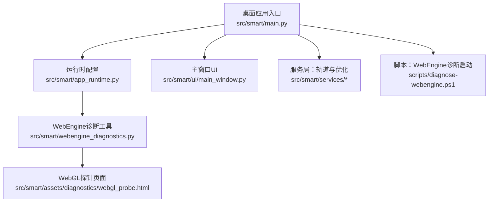
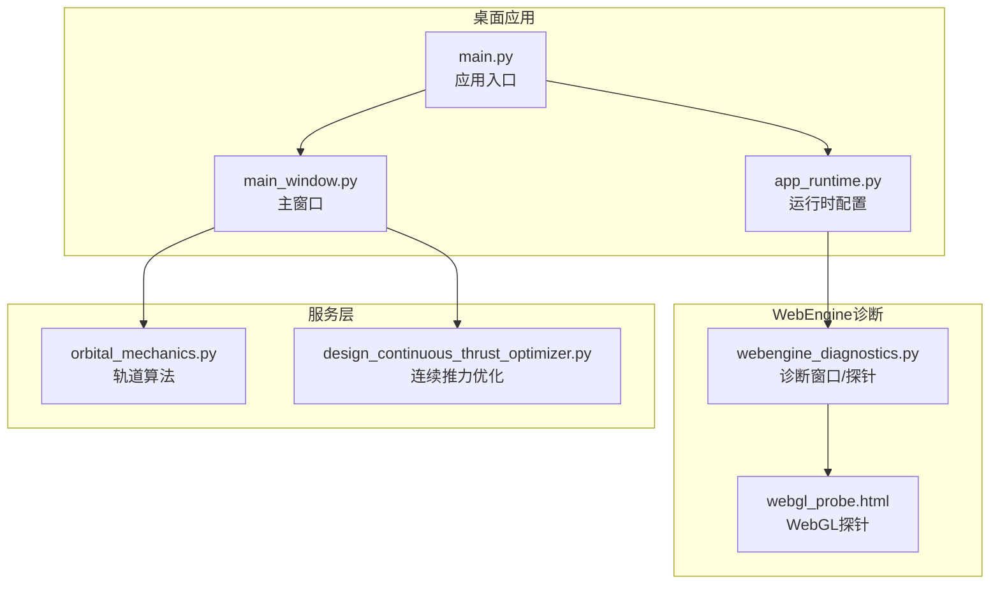
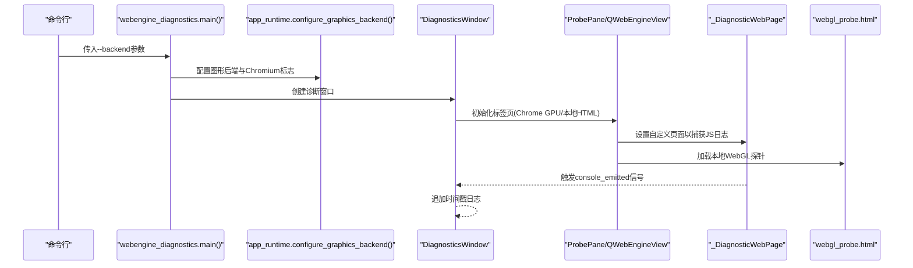
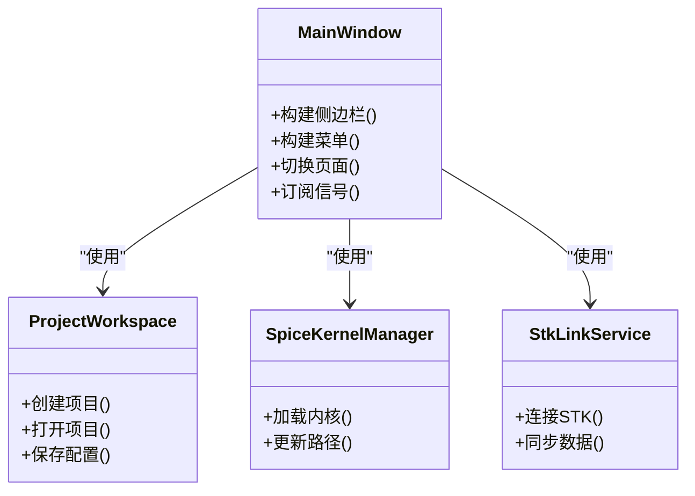
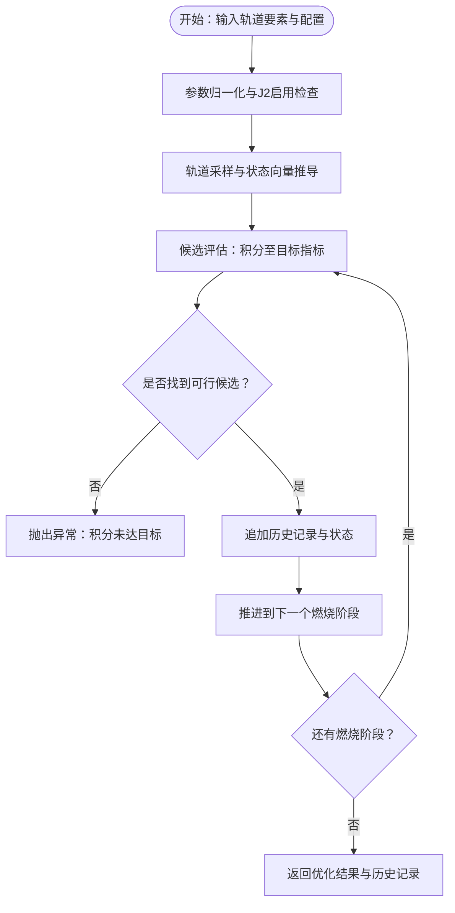
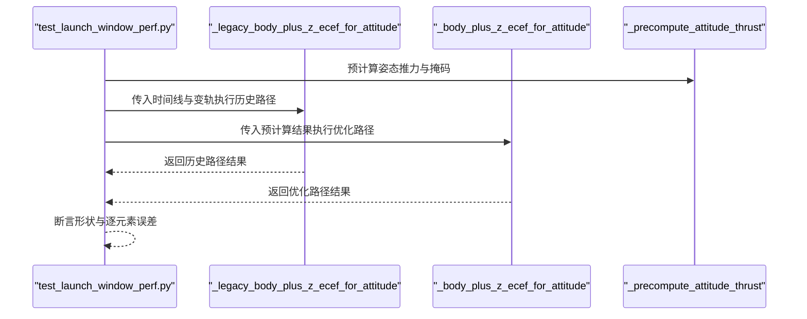
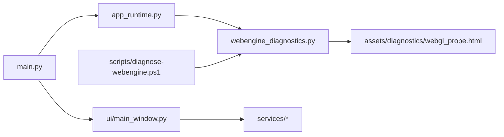
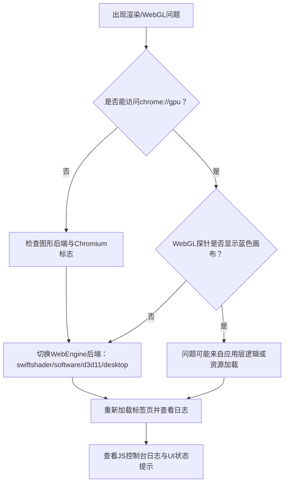

# 调试与性能分析

<cite>
**本文引用的文件**
- [src/smart/main.py](file://src/smart/main.py)
- [src/smart/app_runtime.py](file://src/smart/app_runtime.py)
- [src/smart/webengine_diagnostics.py](file://src/smart/webengine_diagnostics.py)
- [src/smart/assets/diagnostics/webgl_probe.html](file://src/smart/assets/diagnostics/webgl_probe.html)
- [scripts/diagnose-webengine.ps1](file://scripts/diagnose-webengine.ps1)
- [src/smart/ui/main_window.py](file://src/smart/ui/main_window.py)
- [src/smart/services/orbital_mechanics.py](file://src/smart/services/orbital_mechanics.py)
- [src/smart/services/design_continuous_thrust_optimizer.py](file://src/smart/services/design_continuous_thrust_optimizer.py)
- [tests/test_launch_window_perf.py](file://tests/test_launch_window_perf.py)
- [src/smart/ui/widgets/tracking_arc_page.py](file://src/smart/ui/widgets/tracking_arc_page.py)
</cite>

## 目录
1. [简介](#简介)
2. [项目结构](#项目结构)
3. [核心组件](#核心组件)
4. [架构总览](#架构总览)
5. [详细组件分析](#详细组件分析)
6. [依赖分析](#依赖分析)
7. [性能考虑](#性能考虑)
8. [故障排查指南](#故障排查指南)
9. [结论](#结论)
10. [附录](#附录)

## 简介
本指南面向SMART桌面应用的调试与性能分析，覆盖以下主题：
- 桌面应用调试技巧：PySide6断点设置、变量检查、调用栈分析与UI响应性优化
- WebEngine组件诊断：WebGL探针工具使用、浏览器兼容性问题排查
- 性能分析：内存泄漏检测、CPU使用率分析、UI响应性优化
- 日志记录与错误追踪：统一日志输出、异常捕获与状态提示
- 复杂算法调试：轨道计算与数值优化的可视化与分步验证
- 常见问题快速定位与解决

## 项目结构
SMART采用模块化组织，核心入口在桌面应用主程序，运行时配置影响WebEngine渲染后端，诊断工具用于隔离WebGL与GPU问题，服务层承载轨道与优化算法，UI层负责交互与可视化。

图表来源
- [src/smart/main.py:10-31](file://src/smart/main.py#L10-L31)
- [src/smart/app_runtime.py:31-90](file://src/smart/app_runtime.py#L31-L90)
- [src/smart/webengine_diagnostics.py:112-190](file://src/smart/webengine_diagnostics.py#L112-L190)
- [src/smart/assets/diagnostics/webgl_probe.html:1-129](file://src/smart/assets/diagnostics/webgl_probe.html#L1-L129)
- [scripts/diagnose-webengine.ps1:31-32](file://scripts/diagnose-webengine.ps1#L31-L32)

章节来源
- [src/smart/main.py:10-31](file://src/smart/main.py#L10-L31)
- [src/smart/app_runtime.py:31-90](file://src/smart/app_runtime.py#L31-L90)
- [src/smart/webengine_diagnostics.py:112-190](file://src/smart/webengine_diagnostics.py#L112-L190)
- [src/smart/assets/diagnostics/webgl_probe.html:1-129](file://src/smart/assets/diagnostics/webgl_probe.html#L1-L129)
- [scripts/diagnose-webengine.ps1:31-32](file://scripts/diagnose-webengine.ps1#L31-L32)

## 核心组件
- 应用入口与主题初始化：负责图形后端配置、图标加载、主题应用与主窗口展示
- 运行时配置：统一管理WebEngine渲染后端与Chromium参数，确保OpenGL/D3D兼容
- WebEngine诊断工具：集成QWebEngineView与自定义页面，捕获JS控制台消息，输出日志
- WebGL探针：在Web环境中检测WebGL可用性与渲染器信息
- 服务层算法：轨道力学与连续推力优化，提供可验证的数值流程
- UI页面：包含发射窗口、跟踪弧段等复杂视图，支持状态提示与错误反馈

章节来源
- [src/smart/main.py:10-31](file://src/smart/main.py#L10-L31)
- [src/smart/app_runtime.py:31-90](file://src/smart/app_runtime.py#L31-L90)
- [src/smart/webengine_diagnostics.py:23-110](file://src/smart/webengine_diagnostics.py#L23-L110)
- [src/smart/assets/diagnostics/webgl_probe.html:88-121](file://src/smart/assets/diagnostics/webgl_probe.html#L88-L121)
- [src/smart/services/orbital_mechanics.py:29-200](file://src/smart/services/orbital_mechanics.py#L29-L200)
- [src/smart/services/design_continuous_thrust_optimizer.py:44-200](file://src/smart/services/design_continuous_thrust_optimizer.py#L44-L200)

## 架构总览
下图展示桌面应用、运行时配置、WebEngine诊断与WebGL探针之间的交互关系。

图表来源
- [src/smart/main.py:10-31](file://src/smart/main.py#L10-L31)
- [src/smart/app_runtime.py:31-90](file://src/smart/app_runtime.py#L31-L90)
- [src/smart/webengine_diagnostics.py:112-190](file://src/smart/webengine_diagnostics.py#L112-L190)
- [src/smart/assets/diagnostics/webgl_probe.html:1-129](file://src/smart/assets/diagnostics/webgl_probe.html#L1-L129)
- [src/smart/services/orbital_mechanics.py:29-200](file://src/smart/services/orbital_mechanics.py#L29-L200)
- [src/smart/services/design_continuous_thrust_optimizer.py:44-200](file://src/smart/services/design_continuous_thrust_optimizer.py#L44-L200)

## 详细组件分析

### 组件A：WebEngine诊断与WebGL探针
- 功能概述
  - 诊断窗口包含两个标签页：chrome://gpu与本地WebGL探针页面
  - 自定义QWebEnginePage拦截JS控制台消息并通过信号传递到UI日志
  - 探针页面尝试创建WebGL/WebGL2上下文，绘制背景色并输出渲染器信息
- 关键流程
  - 启动时根据环境变量或命令行参数选择WebEngine后端
  - 加载URL并监听加载开始/进度/完成、URL变化、标题变化事件
  - 用户可一键重载所有标签页，清空日志

图表来源
- [src/smart/webengine_diagnostics.py:192-208](file://src/smart/webengine_diagnostics.py#L192-L208)
- [src/smart/app_runtime.py:31-90](file://src/smart/app_runtime.py#L31-L90)
- [src/smart/webengine_diagnostics.py:43-110](file://src/smart/webengine_diagnostics.py#L43-L110)
- [src/smart/assets/diagnostics/webgl_probe.html:88-121](file://src/smart/assets/diagnostics/webgl_probe.html#L88-L121)

章节来源
- [src/smart/webengine_diagnostics.py:23-110](file://src/smart/webengine_diagnostics.py#L23-L110)
- [src/smart/webengine_diagnostics.py:112-190](file://src/smart/webengine_diagnostics.py#L112-L190)
- [src/smart/assets/diagnostics/webgl_probe.html:88-121](file://src/smart/assets/diagnostics/webgl_probe.html#L88-L121)
- [scripts/diagnose-webengine.ps1:31-32](file://scripts/diagnose-webengine.ps1#L31-L32)

### 组件B：桌面应用入口与UI主窗口
- 入口职责
  - 配置图形后端、加载图标、应用主题
  - 创建主窗口并显示
- 主窗口职责
  - 维护项目工作区、SPICE内核管理、STK链接服务
  - 构建菜单与侧边栏导航，切换多个业务页面
  - 订阅轨迹变更、卫星设置变更、策略变更等信号

图表来源
- [src/smart/main.py:10-31](file://src/smart/main.py#L10-L31)
- [src/smart/ui/main_window.py:53-136](file://src/smart/ui/main_window.py#L53-L136)

章节来源
- [src/smart/main.py:10-31](file://src/smart/main.py#L10-L31)
- [src/smart/ui/main_window.py:53-136](file://src/smart/ui/main_window.py#L53-L136)

### 组件C：轨道力学与连续推力优化
- 轨道力学
  - 提供旋转矩阵、平近点异常转换、状态向量推导、轨道采样等基础函数
- 连续推力优化
  - 基于脉冲规划序列，对尾段进行经度与偏心率联合优化
  - 通过候选评估与参数回填生成优化结果

图表来源
- [src/smart/services/orbital_mechanics.py:29-200](file://src/smart/services/orbital_mechanics.py#L29-L200)
- [src/smart/services/design_continuous_thrust_optimizer.py:44-200](file://src/smart/services/design_continuous_thrust_optimizer.py#L44-L200)

章节来源
- [src/smart/services/orbital_mechanics.py:29-200](file://src/smart/services/orbital_mechanics.py#L29-L200)
- [src/smart/services/design_continuous_thrust_optimizer.py:44-200](file://src/smart/services/design_continuous_thrust_optimizer.py#L44-L200)

### 组件D：性能回归测试（发射窗口姿态计算）
- 测试目标
  - 对比优化前后“体朝向+Z”计算路径的一致性与性能提升
- 方法
  - 构造相同时间线与变轨集合，分别调用历史实现与优化实现
  - 断言结果逐元素一致且无向量化外的Python循环

图表来源
- [tests/test_launch_window_perf.py:108-126](file://tests/test_launch_window_perf.py#L108-L126)
- [tests/test_launch_window_perf.py:128-151](file://tests/test_launch_window_perf.py#L128-L151)

章节来源
- [tests/test_launch_window_perf.py:108-126](file://tests/test_launch_window_perf.py#L108-L126)
- [tests/test_launch_window_perf.py:128-151](file://tests/test_launch_window_perf.py#L128-L151)

## 依赖分析
- 入口依赖运行时配置，后者决定WebEngine后端与Chromium标志
- 诊断工具依赖运行时配置与资源文件中的WebGL探针
- UI主窗口依赖服务层算法与工作区管理
- 脚本通过环境变量驱动诊断工具进程

图表来源
- [src/smart/main.py:10-31](file://src/smart/main.py#L10-L31)
- [src/smart/app_runtime.py:31-90](file://src/smart/app_runtime.py#L31-L90)
- [src/smart/webengine_diagnostics.py:112-190](file://src/smart/webengine_diagnostics.py#L112-L190)
- [src/smart/assets/diagnostics/webgl_probe.html:1-129](file://src/smart/assets/diagnostics/webgl_probe.html#L1-L129)
- [scripts/diagnose-webengine.ps1:31-32](file://scripts/diagnose-webengine.ps1#L31-L32)

章节来源
- [src/smart/main.py:10-31](file://src/smart/main.py#L10-L31)
- [src/smart/app_runtime.py:31-90](file://src/smart/app_runtime.py#L31-L90)
- [src/smart/webengine_diagnostics.py:112-190](file://src/smart/webengine_diagnostics.py#L112-L190)
- [src/smart/assets/diagnostics/webgl_probe.html:1-129](file://src/smart/assets/diagnostics/webgl_probe.html#L1-L129)
- [scripts/diagnose-webengine.ps1:31-32](file://scripts/diagnose-webengine.ps1#L31-L32)

## 性能考虑
- 图形后端与Chromium标志
  - 使用运行时配置统一设置OpenGL/D3D与ANGLE后端，避免主窗口与WebEngine组合导致的黑屏或兼容性问题
  - 可通过脚本参数或环境变量切换后端，便于对比不同路径的性能与稳定性
- 数值优化与向量化
  - 发射窗口姿态计算路径已从逐样本Python循环提升为向量化ECI→ECEF变换，回归测试保证结果一致性
- UI响应性
  - 诊断窗口的日志输出带时间戳，便于观察加载与渲染耗时
  - 建议在长任务中使用异步或分片处理，并在UI中显示进度

章节来源
- [src/smart/app_runtime.py:31-90](file://src/smart/app_runtime.py#L31-L90)
- [tests/test_launch_window_perf.py:108-126](file://tests/test_launch_window_perf.py#L108-L126)
- [src/smart/webengine_diagnostics.py:180-189](file://src/smart/webengine_diagnostics.py#L180-L189)

## 故障排查指南
- WebEngine渲染问题
  - 使用诊断工具隔离问题：若chrome://gpu显示GPU功能正常但WebGL探针无蓝色画布，则问题可能出在WebGL上下文创建或驱动
  - 尝试切换后端：swiftshader/software/d3d11/desktop，结合脚本参数或环境变量
- 控制台日志与错误
  - 诊断窗口会捕获JS控制台消息并输出到日志；注意区分不同标签页的URL变化与标题变化
  - UI页面在异常时会通过状态栏提示用户，例如发射窗口同步失败或不一致
- 常见问题定位
  - 发射窗口不一致：检查是否已同步、是否存在文件缺失或计算异常
  - WebGL不可用：确认WebGL已启用、驱动与后端匹配

图表来源
- [src/smart/webengine_diagnostics.py:127-139](file://src/smart/webengine_diagnostics.py#L127-L139)
- [src/smart/webengine_diagnostics.py:168-178](file://src/smart/webengine_diagnostics.py#L168-L178)
- [src/smart/ui/widgets/tracking_arc_page.py:1217-1230](file://src/smart/ui/widgets/tracking_arc_page.py#L1217-L1230)

章节来源
- [src/smart/webengine_diagnostics.py:127-139](file://src/smart/webengine_diagnostics.py#L127-L139)
- [src/smart/webengine_diagnostics.py:168-178](file://src/smart/webengine_diagnostics.py#L168-L178)
- [src/smart/ui/widgets/tracking_arc_page.py:1217-1230](file://src/smart/ui/widgets/tracking_arc_page.py#L1217-L1230)

## 结论
通过统一的运行时配置、专用的WebEngine诊断工具与WebGL探针，SMART能够在Windows多驱动环境下稳定运行WebGL内容。配合服务层的数值算法与性能回归测试，可有效保障复杂轨道计算的正确性与性能。建议在日常开发中：
- 使用诊断工具快速定位WebGL与GPU问题
- 在长任务中采用向量化与异步策略，保持UI响应
- 通过日志与状态提示完善错误追踪与用户反馈

## 附录
- 快速命令
  - 运行WebEngine诊断：通过脚本设置后端并启动诊断工具
- 调试要点
  - PySide6断点：在UI主窗口与服务层函数中设置断点，观察变量与调用栈
  - JS日志：关注诊断窗口输出的控制台消息与URL变化
  - 性能回归：利用现有测试验证优化路径的正确性与性能收益

章节来源
- [scripts/diagnose-webengine.ps1:31-32](file://scripts/diagnose-webengine.ps1#L31-L32)
- [src/smart/webengine_diagnostics.py:180-189](file://src/smart/webengine_diagnostics.py#L180-L189)
- [tests/test_launch_window_perf.py:108-126](file://tests/test_launch_window_perf.py#L108-L126)