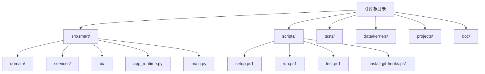
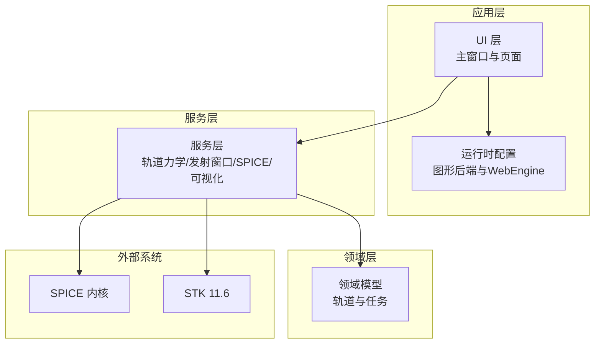
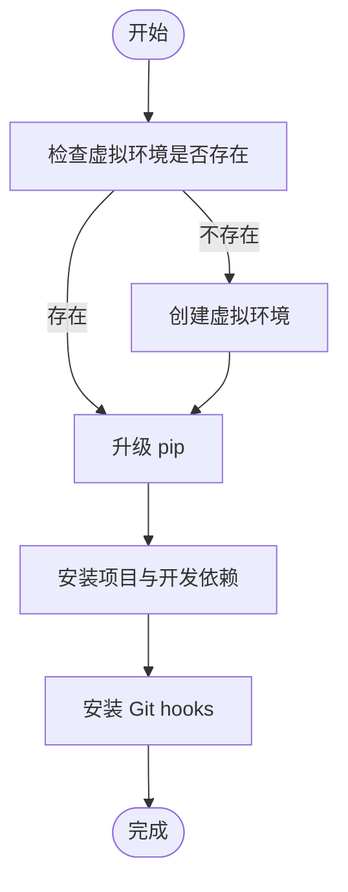
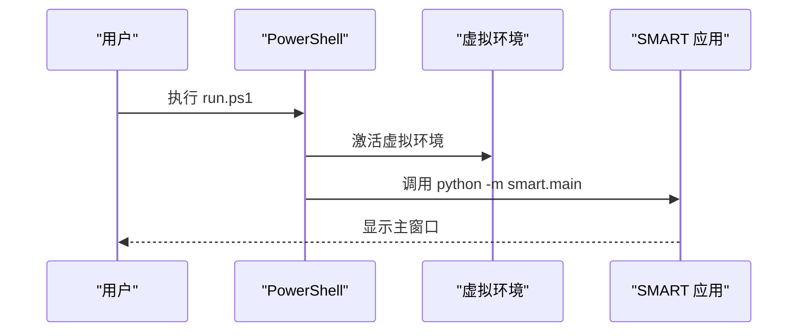
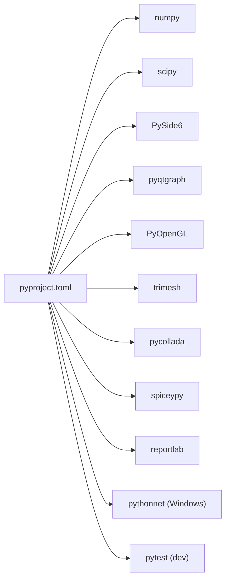

# 快速开始

<cite>
**本文引用的文件**
- [README.md](file://README.md)
- [pyproject.toml](file://pyproject.toml)
- [scripts/setup.ps1](file://scripts/setup.ps1)
- [scripts/run.ps1](file://scripts/run.ps1)
- [scripts/test.ps1](file://scripts/test.ps1)
- [scripts/install-git-hooks.ps1](file://scripts/install-git-hooks.ps1)
- [src/smart/main.py](file://src/smart/main.py)
- [src/smart/app_runtime.py](file://src/smart/app_runtime.py)
- [src/smart/__init__.py](file://src/smart/__init__.py)
- [projects/F4/smart_project.json](file://projects/F4/smart_project.json)
- [projects/F1/smart_project.json](file://projects/F1/smart_project.json)
- [data/kernels/README.md](file://data/kernels/README.md)
- [tests/test_app_runtime.py](file://tests/test_app_runtime.py)
- [tests/test_common_orbital_tools.py](file://tests/test_common_orbital_tools.py)
</cite>

## 目录
1. [简介](#简介)
2. [项目结构](#项目结构)
3. [核心组件](#核心组件)
4. [架构总览](#架构总览)
5. [详细组件分析](#详细组件分析)
6. [依赖关系分析](#依赖关系分析)
7. [性能注意事项](#性能注意事项)
8. [故障排查指南](#故障排查指南)
9. [结论](#结论)
10. [附录](#附录)

## 简介
SMART 是一个面向航天任务设计与工程分析的桌面软件，围绕 STK 11.6 + SPICE + PySide6 构建统一工作流，覆盖项目管理、卫星3D模型配置、轨道初始化、设计变轨策略、连续推力参数优化、导入变轨策略、发射窗口计算、跟踪弧段分析、飞行程序设计、STK 联动、SPICE 内核管理、项目化数据落盘和 AI 辅助项目解读等核心链路。本文提供面向初学者的快速开始指南，涵盖环境准备、PowerShell 脚本使用、项目启动方式、常见问题与解决方案，以及首次使用的完整流程示例。

## 项目结构
SMART 采用模块化的分层组织：
- 根目录包含项目说明、脚本、数据内核、文档与更新记录
- src/smart/ 为应用源码，分为 domain（领域模型）、services（服务层）、ui（界面）、webengine 诊断等
- tests/ 为单元与功能测试
- data/kernels/ 用于放置 SPICE 内核
- projects/ 包含多个示例项目配置

**图表来源**
- [README.md:187-196](file://README.md#L187-L196)
- [pyproject.toml:36-49](file://pyproject.toml#L36-L49)

**章节来源**
- [README.md:187-196](file://README.md#L187-L196)
- [pyproject.toml:36-49](file://pyproject.toml#L36-L49)

## 核心组件
- 应用入口与运行时配置
  - 应用入口：通过命令行入口 smart 或模块启动 python -m smart.main
  - 运行时配置：图形后端与 WebEngine 参数设置，确保桌面 OpenGL 与 WebEngine 渲染兼容
- 服务层
  - SPICE 服务：内核加载、时间与坐标系转换、天体状态查询
  - 其他服务：轨道力学、飞行程序、发射窗口、跟踪弧段、可视化等
- UI 层
  - 主窗口与主题、导航、各功能页面（设计变轨、发射窗口、飞行程序、可视化等）
- 测试与验证
  - pytest 测试套件，覆盖运行时配置、UI 工具对话框、SPICE 查询等

**章节来源**
- [pyproject.toml:32-34](file://pyproject.toml#L32-L34)
- [src/smart/main.py:10-31](file://src/smart/main.py#L10-L31)
- [src/smart/app_runtime.py:31-90](file://src/smart/app_runtime.py#L31-L90)
- [README.md:198-203](file://README.md#L198-L203)

## 架构总览
SMART 的桌面应用采用模块化分层架构：UI 层负责交互与可视化，服务层封装数值计算与外部系统（SPICE、STK）集成，domain 层承载任务与轨道领域模型，tests 提供质量保障。

**图表来源**
- [src/smart/main.py:10-31](file://src/smart/main.py#L10-L31)
- [src/smart/app_runtime.py:31-90](file://src/smart/app_runtime.py#L31-L90)
- [README.md:48-71](file://README.md#L48-L71)

## 详细组件分析

### 环境准备与依赖安装
- Python 版本要求
  - Python >= 3.10
- 依赖安装方式
  - 使用 pip 安装项目及其开发依赖
  - 支持可编辑安装以便开发调试
- 虚拟环境建议
  - 推荐使用 venv 创建隔离环境，避免全局污染

**章节来源**
- [pyproject.toml:10](file://pyproject.toml#L10)
- [README.md:84-89](file://README.md#L84-L89)

### PowerShell 脚本使用指南
- setup.ps1
  - 功能：创建虚拟环境、升级 pip、安装项目与开发依赖、安装 Git hooks
  - 参数：-ForceRecreate 可强制重建虚拟环境
  - 执行：在仓库根目录运行 .\scripts\setup.ps1
- run.ps1
  - 功能：启动 SMART 桌面程序
  - 参数：-SkipSetup 可跳过自动 setup，若未检测到虚拟环境则报错
  - 执行：在仓库根目录运行 .\scripts\run.ps1
- test.ps1
  - 功能：运行测试套件
  - 参数：-SkipSetup 可跳过自动 setup，若未检测到虚拟环境则报错
  - 执行：在仓库根目录运行 .\scripts\test.ps1
- install-git-hooks.ps1
  - 功能：设置 Git hooks 路径，便于提交时自动维护更新记录
  - 执行：在仓库根目录运行 .\scripts\install-git-hooks.ps1

**图表来源**
- [scripts/setup.ps1:24-44](file://scripts/setup.ps1#L24-L44)

**章节来源**
- [scripts/setup.ps1:1-47](file://scripts/setup.ps1#L1-L47)
- [scripts/run.ps1:1-38](file://scripts/run.ps1#L1-L38)
- [scripts/test.ps1:1-38](file://scripts/test.ps1#L1-L38)
- [scripts/install-git-hooks.ps1:1-15](file://scripts/install-git-hooks.ps1#L1-L15)

### 项目启动方式
- 命令行启动
  - 使用命令行入口 smart 启动桌面程序
  - 适用于已安装项目的环境
- 模块启动
  - 设置 PYTHONPATH=src 后，使用 python -m smart.main 启动
  - 适用于开发调试或未安装项目的场景

**图表来源**
- [scripts/run.ps1:24-33](file://scripts/run.ps1#L24-L33)
- [src/smart/main.py:10-31](file://src/smart/main.py#L10-L31)

**章节来源**
- [README.md:82-97](file://README.md#L82-L97)
- [src/smart/main.py:10-31](file://src/smart/main.py#L10-L31)

### SPICE 内核与数据目录
- 内核放置位置
  - 将 SPICE 内核文件放入 data/kernels/ 目录
- 推荐内核集合
  - leap seconds、planetary constants、e.g. de440.bsp 或任务专用 SPK
- 加载策略
  - 应用当前优先本地加载项目级与仓库级内核
  - 未来可通过 SpiceKernelManager 在分析模块中精确加载所需内核集

**章节来源**
- [data/kernels/README.md:1-12](file://data/kernels/README.md#L1-L12)
- [README.md:161-185](file://README.md#L161-L185)

### 示例项目与数据落盘
- 示例项目
  - projects/F1 与 projects/F4 提供最小可用项目配置
- 数据落盘
  - 项目激活后，配置与结果按 config/data/charts 结构自动保存
  - 常见落盘文件包括卫星3D模型、设计变轨策略、发射窗口、跟踪弧段、飞行程序、轨道历史等

**章节来源**
- [projects/F1/smart_project.json:1-6](file://projects/F1/smart_project.json#L1-L6)
- [projects/F4/smart_project.json:1-6](file://projects/F4/smart_project.json#L1-L6)
- [README.md:125-152](file://README.md#L125-L152)

## 依赖关系分析
SMART 的依赖主要来自 Python 生态与平台特定组件：
- 核心依赖：numpy、scipy、PySide6、pyqtgraph、PyOpenGL、spiceypy、trimesh、pycollada、reportlab
- 开发依赖：pytest
- 平台依赖：pythonnet（仅 Windows）

**图表来源**
- [pyproject.toml:11-27](file://pyproject.toml#L11-L27)

**章节来源**
- [pyproject.toml:11-27](file://pyproject.toml#L11-L27)

## 性能注意事项
- 图形后端一致性
  - 运行时强制统一 Qt Quick 与 WebEngine 的渲染后端，避免桌面窗口与 OpenGL 上下文不兼容导致的黑屏或渲染异常
- WebEngine 渲染路径
  - 默认使用 SwiftShader 软件渲染，可在特定环境下切换到 D3D11、SwiftShader-WebGL 或 Desktop 模式
- 依赖版本
  - 严格控制依赖版本范围，确保数值计算与图形库的稳定性

**章节来源**
- [src/smart/app_runtime.py:31-90](file://src/smart/app_runtime.py#L31-L90)
- [tests/test_app_runtime.py:8-29](file://tests/test_app_runtime.py#L8-L29)

## 故障排查指南
- 执行策略限制
  - 若提示无法运行脚本，请在当前会话临时放宽执行策略：Set-ExecutionPolicy -Scope Process Bypass
- 虚拟环境缺失
  - run.ps1/test.ps1 在未检测到虚拟环境时会尝试自动 setup；如需跳过请使用 -SkipSetup，但需确保已手动安装依赖
- 图形渲染问题
  - 如遇 WebEngine 黑屏或渲染异常，可设置 SMART_WEBENGINE_BACKEND 环境变量为 d3d11、swiftshader、swiftshader-webgl 或 desktop
- SPICE 内核加载失败
  - 确认 data/kernels/ 下存在所需内核文件，或在分析模块中通过 SpiceKernelManager 精确加载

**章节来源**
- [README.md:108-112](file://README.md#L108-L112)
- [scripts/run.ps1:24-29](file://scripts/run.ps1#L24-L29)
- [scripts/test.ps1:24-29](file://scripts/test.ps1#L24-L29)
- [src/smart/app_runtime.py:44-90](file://src/smart/app_runtime.py#L44-L90)
- [data/kernels/README.md:1-12](file://data/kernels/README.md#L1-L12)

## 结论
通过本快速开始指南，您可以在本地完成环境准备、依赖安装与项目启动，并掌握 PowerShell 脚本的使用方法。建议先运行 setup.ps1 完成环境初始化，再使用 run.ps1 启动应用，最后结合示例项目与 SPICE 内核进行实践。遇到问题时，可依据故障排查指南逐步定位与解决。

## 附录

### 首次使用完整流程示例
- 准备环境
  - 安装 Python 3.10+
  - 在仓库根目录执行 .\scripts\setup.ps1
- 启动应用
  - 方式一：执行 .\scripts\run.ps1
  - 方式二：在仓库根目录执行 smart（需已安装）
  - 方式三：设置 PYTHONPATH=src 后执行 python -m smart.main
- 验证测试
  - 在仓库根目录执行 .\scripts\test.ps1
- 配置 SPICE 内核
  - 将推荐内核放入 data/kernels/
- 打开示例项目
  - 通过顶部菜单“项目 / Project”选择 projects/F1 或 projects/F4

**章节来源**
- [README.md:82-112](file://README.md#L82-L112)
- [scripts/setup.ps1:1-47](file://scripts/setup.ps1#L1-L47)
- [scripts/run.ps1:1-38](file://scripts/run.ps1#L1-L38)
- [scripts/test.ps1:1-38](file://scripts/test.ps1#L1-L38)
- [data/kernels/README.md:1-12](file://data/kernels/README.md#L1-L12)
- [projects/F1/smart_project.json:1-6](file://projects/F1/smart_project.json#L1-L6)
- [projects/F4/smart_project.json:1-6](file://projects/F4/smart_project.json#L1-L6)