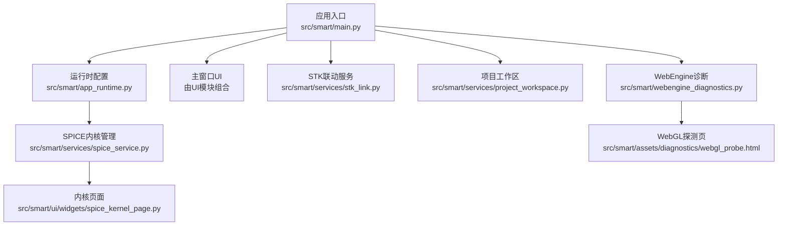
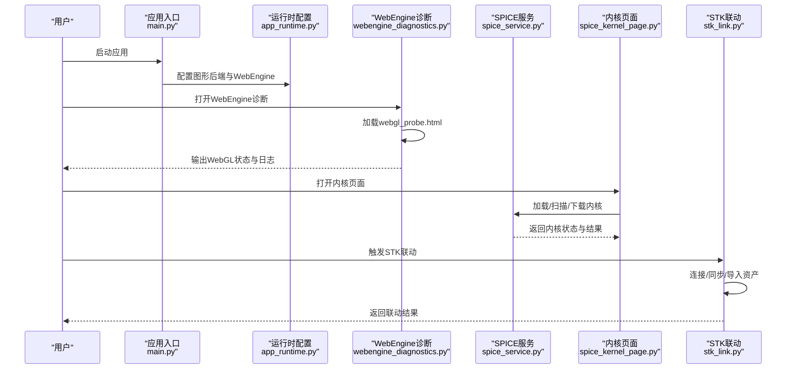
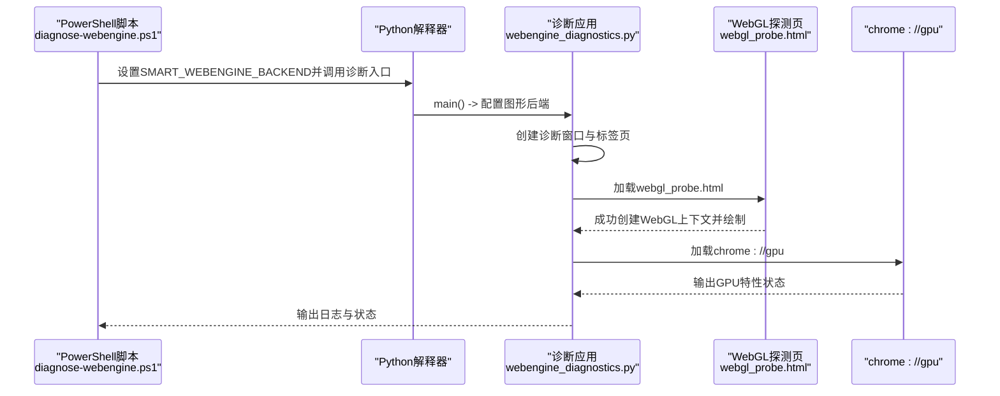
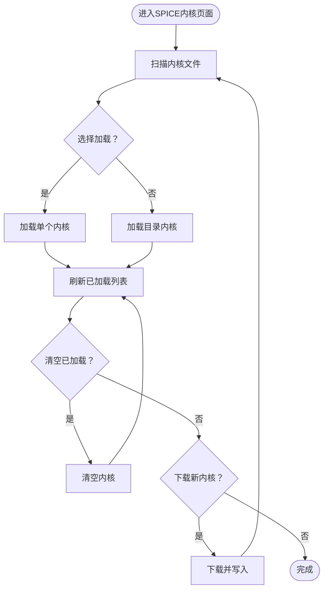
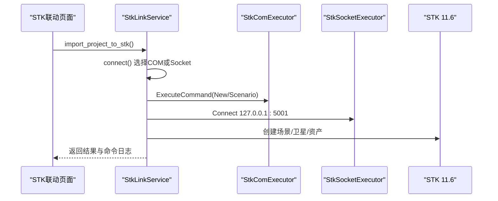
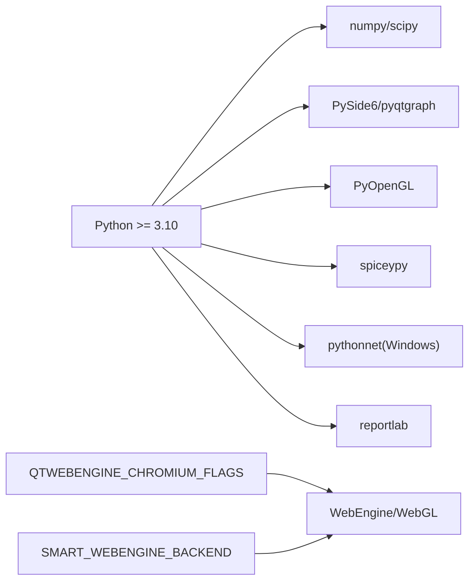

# 故障排除

<cite>
**本文引用的文件**   
- [README.md](file://README.md)
- [pyproject.toml](file://pyproject.toml)
- [scripts/setup.ps1](file://scripts/setup.ps1)
- [scripts/run.ps1](file://scripts/run.ps1)
- [scripts/diagnose-webengine.ps1](file://scripts/diagnose-webengine.ps1)
- [src/smart/main.py](file://src/smart/main.py)
- [src/smart/app_runtime.py](file://src/smart/app_runtime.py)
- [src/smart/webengine_diagnostics.py](file://src/smart/webengine_diagnostics.py)
- [src/smart/assets/diagnostics/webgl_probe.html](file://src/smart/assets/diagnostics/webgl_probe.html)
- [src/smart/services/spice_service.py](file://src/smart/services/spice_service.py)
- [src/smart/ui/widgets/spice_kernel_page.py](file://src/smart/ui/widgets/spice_kernel_page.py)
- [doc/spice_usage.md](file://doc/spice_usage.md)
- [src/smart/services/stk_link.py](file://src/smart/services/stk_link.py)
- [tests/test_spice_service.py](file://tests/test_spice_service.py)
- [tests/test_stk_link.py](file://tests/test_stk_link.py)
- [src/smart/services/project_workspace.py](file://src/smart/services/project_workspace.py)
</cite>

## 目录
1. [简介](#简介)
2. [项目结构](#项目结构)
3. [核心组件](#核心组件)
4. [架构总览](#架构总览)
5. [详细组件分析](#详细组件分析)
6. [依赖关系分析](#依赖关系分析)
7. [性能考虑](#性能考虑)
8. [故障排除指南](#故障排除指南)
9. [结论](#结论)
10. [附录](#附录)

## 简介
本指南聚焦于SMART项目的故障排除，覆盖安装问题、运行时错误、性能问题与集成问题。内容包括：
- WebEngine诊断工具的使用方法（WebGL探测与浏览器兼容性检查）
- 系统环境检查清单（Python版本、依赖库、系统权限等）
- 日志分析与错误信息解读
- SPICE内核问题、STK连接问题与数据导入问题的专项解决方案
- 性能优化建议与资源监控方法
- 社区支持渠道与问题反馈流程
- 如何收集诊断信息与提交Bug报告

## 项目结构
SMART是一个基于PySide6的桌面应用，围绕STK 11.6、SPICE与PyQt生态构建统一工作流。关键模块与职责概览：
- 应用入口与运行时配置：main.py、app_runtime.py
- SPICE内核管理与服务：spice_service.py、spice_kernel_page.py、spice_usage.md
- STK联动：stk_link.py
- 项目工作区与数据落盘：project_workspace.py
- WebEngine诊断工具：webengine_diagnostics.py、webgl_probe.html、diagnose-webengine.ps1
- 依赖与脚本：pyproject.toml、setup.ps1、run.ps1

**图表来源**
- [src/smart/main.py:1-36](file://src/smart/main.py#L1-L36)
- [src/smart/app_runtime.py:1-96](file://src/smart/app_runtime.py#L1-L96)
- [src/smart/services/spice_service.py:1-305](file://src/smart/services/spice_service.py#L1-L305)
- [src/smart/ui/widgets/spice_kernel_page.py:1-554](file://src/smart/ui/widgets/spice_kernel_page.py#L1-L554)
- [src/smart/services/stk_link.py:1-755](file://src/smart/services/stk_link.py#L1-L755)
- [src/smart/services/project_workspace.py:1-800](file://src/smart/services/project_workspace.py#L1-L800)
- [src/smart/webengine_diagnostics.py:1-213](file://src/smart/webengine_diagnostics.py#L1-L213)
- [src/smart/assets/diagnostics/webgl_probe.html:1-129](file://src/smart/assets/diagnostics/webgl_probe.html#L1-L129)

**章节来源**
- [README.md:187-196](file://README.md#L187-L196)
- [pyproject.toml:1-50](file://pyproject.toml#L1-L50)

## 核心组件
- 应用入口与运行时配置
  - main.py负责初始化图形后端与主题，启动主窗口
  - app_runtime.py负责设置Qt/Chromium标志、图形后端与WebEngine参数
- SPICE内核管理
  - spice_service.py提供内核发现、加载、下载与SPICE接口封装
  - spice_kernel_page.py提供内核页面UI与交互
  - doc/spice_usage.md提供SPICE使用规范与最佳实践
- STK联动
  - stk_link.py封装COM/Socket连接、命令执行、场景同步与资产导入
- WebEngine诊断
  - webengine_diagnostics.py提供诊断窗口与日志采集
  - webgl_probe.html用于检测WebGL可用性
  - diagnose-webengine.ps1提供便捷脚本

**章节来源**
- [src/smart/main.py:10-31](file://src/smart/main.py#L10-L31)
- [src/smart/app_runtime.py:31-90](file://src/smart/app_runtime.py#L31-L90)
- [src/smart/services/spice_service.py:174-305](file://src/smart/services/spice_service.py#L174-L305)
- [src/smart/ui/widgets/spice_kernel_page.py:200-554](file://src/smart/ui/widgets/spice_kernel_page.py#L200-L554)
- [doc/spice_usage.md:1-235](file://doc/spice_usage.md#L1-L235)
- [src/smart/services/stk_link.py:199-755](file://src/smart/services/stk_link.py#L199-L755)
- [src/smart/webengine_diagnostics.py:192-213](file://src/smart/webengine_diagnostics.py#L192-L213)
- [src/smart/assets/diagnostics/webgl_probe.html:1-129](file://src/smart/assets/diagnostics/webgl_probe.html#L1-L129)

## 架构总览
下图展示SMART在运行期的关键交互：应用启动、图形后端配置、WebEngine诊断、SPICE内核管理与STK联动。

**图表来源**
- [src/smart/main.py:10-31](file://src/smart/main.py#L10-L31)
- [src/smart/app_runtime.py:31-90](file://src/smart/app_runtime.py#L31-L90)
- [src/smart/webengine_diagnostics.py:192-213](file://src/smart/webengine_diagnostics.py#L192-L213)
- [src/smart/assets/diagnostics/webgl_probe.html:70-125](file://src/smart/assets/diagnostics/webgl_probe.html#L70-L125)
- [src/smart/services/spice_service.py:205-240](file://src/smart/services/spice_service.py#L205-L240)
- [src/smart/ui/widgets/spice_kernel_page.py:406-440](file://src/smart/ui/widgets/spice_kernel_page.py#L406-L440)
- [src/smart/services/stk_link.py:218-337](file://src/smart/services/stk_link.py#L218-L337)

## 详细组件分析

### WebEngine诊断工具
- 目的：隔离渲染问题，判断是QWebEngine本身还是WebGL上下文创建导致的黑屏
- 使用方式
  - PowerShell脚本：scripts/diagnose-webengine.ps1
  - 参数：--backend（swiftshader、software、swiftshader-webgl、d3d11、desktop）
  - 行为：自动创建/激活虚拟环境，设置SMART_WEBENGINE_BACKEND，运行诊断程序
- 诊断界面
  - 两个标签页：chrome://gpu、WebGL Probe
  - WebGL Probe：绘制青蓝色画布，输出版本/语言/厂商/渲染器等信息
  - 日志：记录loadStarted/loadFinished/URL变化/控制台消息
- 解释
  - chrome://gpu：查看GPU特性状态
  - WebGL Probe：若显示青蓝色画布且渲染器信息完整，则WebGL可用

**图表来源**
- [scripts/diagnose-webengine.ps1:1-37](file://scripts/diagnose-webengine.ps1#L1-L37)
- [src/smart/webengine_diagnostics.py:192-213](file://src/smart/webengine_diagnostics.py#L192-L213)
- [src/smart/assets/diagnostics/webgl_probe.html:70-125](file://src/smart/assets/diagnostics/webgl_probe.html#L70-L125)

**章节来源**
- [scripts/diagnose-webengine.ps1:1-37](file://scripts/diagnose-webengine.ps1#L1-L37)
- [src/smart/webengine_diagnostics.py:112-213](file://src/smart/webengine_diagnostics.py#L112-L213)
- [src/smart/assets/diagnostics/webgl_probe.html:1-129](file://src/smart/assets/diagnostics/webgl_probe.html#L1-L129)

### SPICE内核管理
- 关键点
  - 自动发现与加载：discover_kernel_files、ensure_local_kernels_loaded
  - 接口封装：utc_to_et、et_to_utc、transform_position/state、state
  - 下载与校验：download_kernel_file、infer_kernel_filename
  - UI：spice_kernel_page.py提供扫描、加载、清空、下载与状态展示
- 常见问题与对策
  - 缺少必要内核：根据doc/spice_usage.md准备naif0012.tls、pck00011.tpc、earth_assoc_itrf93.tf、earth_latest_high_prec.bpc、de440s.bsp
  - 加载顺序与去重：同名文件按目录优先级去重
  - 手工兜底：SPICE不可用时退回Python标准库解析

**图表来源**
- [src/smart/ui/widgets/spice_kernel_page.py:359-511](file://src/smart/ui/widgets/spice_kernel_page.py#L359-L511)
- [src/smart/services/spice_service.py:91-240](file://src/smart/services/spice_service.py#L91-L240)

**章节来源**
- [src/smart/services/spice_service.py:174-305](file://src/smart/services/spice_service.py#L174-L305)
- [src/smart/ui/widgets/spice_kernel_page.py:200-554](file://src/smart/ui/widgets/spice_kernel_page.py#L200-L554)
- [doc/spice_usage.md:22-72](file://doc/spice_usage.md#L22-L72)

### STK联动
- 关键点
  - 连接策略：COM优先，回退Socket；自动启动STK或附加到现有实例
  - 命令执行：StkComExecutor/StkSocketExecutor，统一execute接口
  - 场景同步：分析时间段、动画时间、资产导入（地面站、中继星）
  - 资产名称清洗与英文化：sanitize_stk_object_name、_english_stk_label
- 常见问题与对策
  - STK未安装或路径不正确：修正STK_116_APP_PATH
  - Socket未就绪：等待或手动启动STK
  - COM不可用：脚本会回退到Socket
  - 资产导入失败：检查模型文件路径与格式

**图表来源**
- [src/smart/services/stk_link.py:111-188](file://src/smart/services/stk_link.py#L111-L188)
- [src/smart/services/stk_link.py:280-337](file://src/smart/services/stk_link.py#L280-L337)

**章节来源**
- [src/smart/services/stk_link.py:199-755](file://src/smart/services/stk_link.py#L199-L755)

## 依赖关系分析
- Python版本与依赖
  - Python >= 3.10
  - 关键依赖：numpy、scipy、PySide6、pyqtgraph、PyOpenGL、spiceypy、pythonnet（Windows）、reportlab
- 运行时标志
  - QTWEBENGINE_CHROMIUM_FLAGS：启用WebGL、忽略GPU黑名单、指定ANGLE后端
  - SMART_WEBENGINE_BACKEND：swiftshader/software/d3d11/desktop/swiftshader-webgl
- 脚本与入口
  - setup.ps1：创建虚拟环境并安装依赖
  - run.ps1：启动应用
  - diagnose-webengine.ps1：运行WebEngine诊断

**图表来源**
- [pyproject.toml:10-22](file://pyproject.toml#L10-L22)
- [pyproject.toml:28-30](file://pyproject.toml#L28-L30)
- [src/smart/app_runtime.py:47-90](file://src/smart/app_runtime.py#L47-L90)

**章节来源**
- [pyproject.toml:1-50](file://pyproject.toml#L1-L50)
- [scripts/setup.ps1:1-47](file://scripts/setup.ps1#L1-L47)
- [scripts/run.ps1:1-38](file://scripts/run.ps1#L1-L38)

## 性能考虑
- 图形后端与WebGL
  - 在Windows上默认使用SwiftShader以规避D3D11与桌面OpenGL上下文不兼容
  - 可通过--backend切换到d3d11、desktop或swiftshader-webgl
- SPICE内核加载
  - 自动扫描与去重，避免重复加载
  - 建议将常用内核置于项目/data/kernels/，减少跨目录查找
- STK联动
  - 仅在需要时创建/同步场景，避免频繁命令往返
  - 对大文件（如星历）进行增量处理与缓存

[本节为通用指导，无需特定文件引用]

## 故障排除指南

### 安装问题
- 症状
  - 无法创建虚拟环境或安装依赖
  - 启动时报找不到模块
- 排查步骤
  - 使用setup.ps1创建并激活虚拟环境，确保pip升级成功
  - 确认Python版本满足>=3.10
  - 在首次运行后安装Git hooks（install-git-hooks.ps1）
- 常见原因
  - 权限不足或执行策略限制
  - 网络代理导致pip/依赖下载失败
- 解决方案
  - 以管理员权限运行PowerShell或调整执行策略
  - 配置网络代理或更换镜像源
  - 重新执行setup.ps1

**章节来源**
- [scripts/setup.ps1:1-47](file://scripts/setup.ps1#L1-L47)
- [pyproject.toml:10-22](file://pyproject.toml#L10-L22)

### 运行时错误
- 症状
  - 应用启动后黑屏或WebGL不可用
  - 3D视图无渲染
- 排查步骤
  - 使用diagnose-webengine.ps1运行诊断，选择不同后端（--backend）
  - 查看诊断窗口日志：loadStarted/loadFinished/URL变化/控制台消息
  - 在WebGL标签页确认是否出现青蓝色画布与渲染器信息
- 常见原因
  - GPU驱动不兼容或WebGL被禁用
  - ANGLE/D3D11与桌面OpenGL上下文冲突
- 解决方案
  - 切换后端：--backend swiftshader 或 desktop
  - 在系统设置中启用WebGL，更新显卡驱动

**章节来源**
- [scripts/diagnose-webengine.ps1:1-37](file://scripts/diagnose-webengine.ps1#L1-L37)
- [src/smart/webengine_diagnostics.py:112-213](file://src/smart/webengine_diagnostics.py#L112-L213)
- [src/smart/assets/diagnostics/webgl_probe.html:70-125](file://src/smart/assets/diagnostics/webgl_probe.html#L70-L125)
- [src/smart/app_runtime.py:47-90](file://src/smart/app_runtime.py#L47-L90)

### 性能问题
- 症状
  - 3D视图卡顿、帧率低
  - 大数据导入耗时长
- 排查步骤
  - 在WebEngine诊断中观察GPU状态与WebGL能力
  - 检查SPICE内核是否齐全，避免重复加载
  - 减少一次性绘制对象数量，分批加载
- 优化建议
  - 使用desktop后端提升OpenGL兼容性
  - 将内核文件放置在项目级data/kernels/，减少扫描范围
  - 对STK联动进行批量命令合并与异步处理

**章节来源**
- [src/smart/app_runtime.py:31-90](file://src/smart/app_runtime.py#L31-L90)
- [src/smart/services/spice_service.py:205-240](file://src/smart/services/spice_service.py#L205-L240)
- [src/smart/services/stk_link.py:280-337](file://src/smart/services/stk_link.py#L280-L337)

### 集成问题
- SPICE内核问题
  - 症状：时间/坐标转换失败、报错提示内核缺失
  - 排查：确认data/kernels/存在必要内核；检查同名文件去重与加载顺序
  - 解决：按doc/spice_usage.md准备内核；在项目级覆盖仓库级同名文件
- STK连接问题
  - 症状：无法连接COM或Socket、命令执行失败
  - 排查：确认STK安装路径、端口开放、COM可用性
  - 解决：修正STK_116_APP_PATH；等待Socket就绪或手动启动STK
- 数据导入问题
  - 症状：星历导入失败、资产名称异常
  - 排查：检查文件格式、坐标系与单位；确认模型文件路径与扩展名
  - 解决：使用受支持的模型格式；清理资产名称并确保英文化

**章节来源**
- [doc/spice_usage.md:22-72](file://doc/spice_usage.md#L22-L72)
- [src/smart/services/spice_service.py:174-305](file://src/smart/services/spice_service.py#L174-L305)
- [src/smart/services/stk_link.py:111-188](file://src/smart/services/stk_link.py#L111-L188)
- [tests/test_stk_link.py:137-170](file://tests/test_stk_link.py#L137-L170)

### 日志分析与错误信息解读
- WebEngine诊断日志
  - loadStarted/loadFinished：页面加载状态
  - URL/Title变化：页面导航与标题更新
  - 控制台消息：JS错误与警告
- SPICE内核页面
  - 状态栏：Ready/Loading/Disconnected
  - 行为：加载/清空/下载均会更新状态与按钮可用性
- STK联动
  - 命令执行返回值：ACK/NACK区分成功与失败
  - 异常：抛出RuntimeError并包含原始命令

**章节来源**
- [src/smart/webengine_diagnostics.py:43-110](file://src/smart/webengine_diagnostics.py#L43-L110)
- [src/smart/ui/widgets/spice_kernel_page.py:512-554](file://src/smart/ui/widgets/spice_kernel_page.py#L512-L554)
- [src/smart/services/stk_link.py:65-108](file://src/smart/services/stk_link.py#L65-L108)

### 系统环境检查清单
- Python版本与解释器
  - Python >= 3.10
  - 使用虚拟环境中的python.exe
- 依赖库
  - numpy、scipy、PySide6、pyqtgraph、PyOpenGL、spiceypy、pythonnet(Windows)、reportlab
- 系统权限
  - 虚拟环境目录写权限
  - STK安装目录访问权限
- 图形与WebGL
  - 启用WebGL，更新显卡驱动
  - 在Windows上避免D3D11与桌面OpenGL冲突

**章节来源**
- [pyproject.toml:10-22](file://pyproject.toml#L10-L22)
- [scripts/setup.ps1:28-34](file://scripts/setup.ps1#L28-L34)
- [src/smart/app_runtime.py:47-90](file://src/smart/app_runtime.py#L47-L90)

### 社区支持与问题反馈
- 项目定位与功能范围
  - 项目README提供了功能文档与技术选型说明
- 问题反馈建议
  - 收集诊断信息：WebEngine诊断日志、SPICE内核状态、STK命令日志
  - 描述环境：Python版本、依赖版本、操作系统与显卡型号
  - 提供最小复现：项目配置、内核文件与操作步骤
- 提交渠道
  - 仓库根目录updates.md由Git hook维护，正常提交时自动更新
  - 可通过脚本更新记录：scripts/update_updates_md.py

**章节来源**
- [README.md:73-81](file://README.md#L73-L81)
- [README.md:114-123](file://README.md#L114-L123)

### 如何收集诊断信息与提交Bug报告
- 收集信息
  - WebEngine诊断：运行diagnose-webengine.ps1，截图或复制日志
  - SPICE内核：列出data/kernels/内容与加载状态
  - STK联动：记录命令执行结果与异常堆栈
- 提交Bug
  - 在仓库中创建Issue，附带：
    - 环境信息（Python/依赖/系统/显卡）
    - 诊断日志与截图
    - 复现步骤与期望/实际结果
  - 如需补充，请使用scripts/update_updates_md.py维护更新记录

**章节来源**
- [scripts/diagnose-webengine.ps1:1-37](file://scripts/diagnose-webengine.ps1#L1-L37)
- [src/smart/services/spice_service.py:205-240](file://src/smart/services/spice_service.py#L205-L240)
- [src/smart/services/stk_link.py:280-337](file://src/smart/services/stk_link.py#L280-L337)
- [README.md:114-123](file://README.md#L114-L123)

## 结论
本指南提供了SMART从安装、运行到诊断与优化的全链路故障排除方法。通过WebEngine诊断工具快速定位渲染问题，借助SPICE内核页面与STK联动服务的错误日志，结合系统环境检查与社区支持渠道，可高效解决常见问题并提升系统稳定性与性能。

[本节为总结性内容，无需特定文件引用]

## 附录
- 相关文档与脚本
  - README.md：项目定位、功能文档与运行脚本
  - doc/spice_usage.md：SPICE使用规范与内核要求
  - tests/test_spice_service.py、tests/test_stk_link.py：行为测试与断言参考

**章节来源**
- [README.md:1-204](file://README.md#L1-L204)
- [doc/spice_usage.md:1-235](file://doc/spice_usage.md#L1-L235)
- [tests/test_spice_service.py:1-199](file://tests/test_spice_service.py#L1-L199)
- [tests/test_stk_link.py:1-390](file://tests/test_stk_link.py#L1-L390)