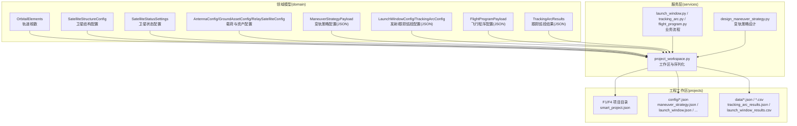
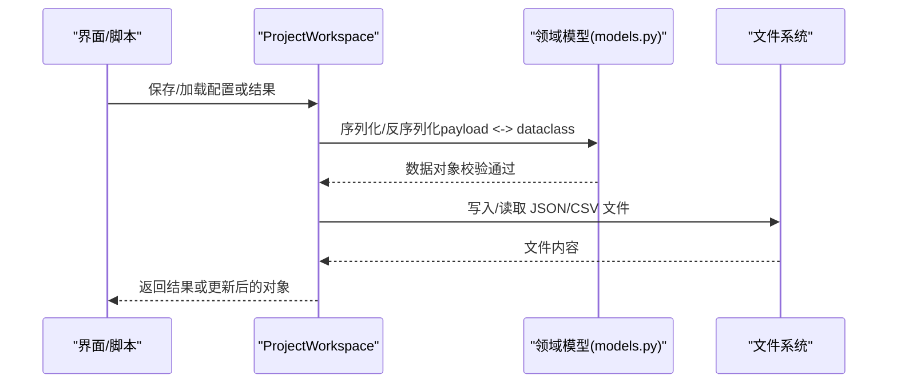
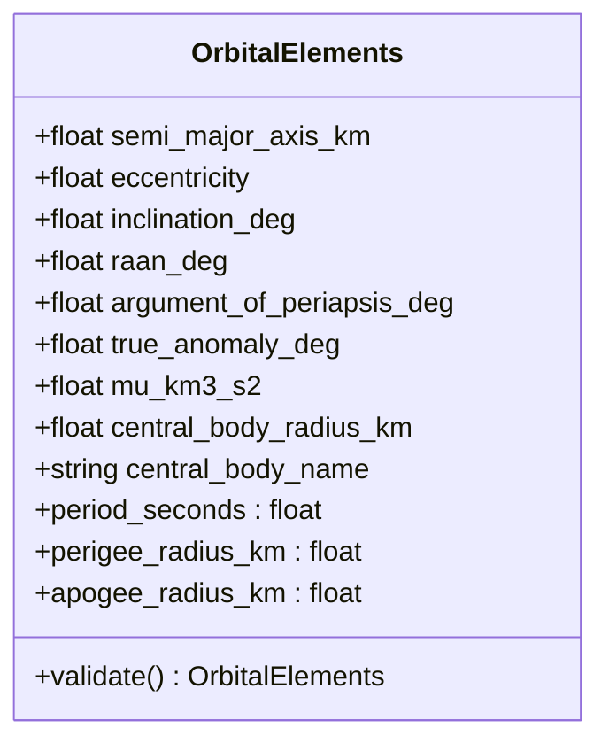
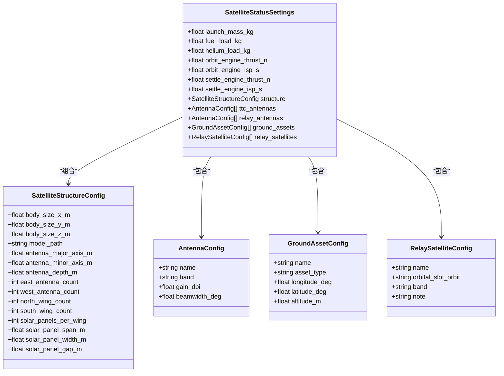
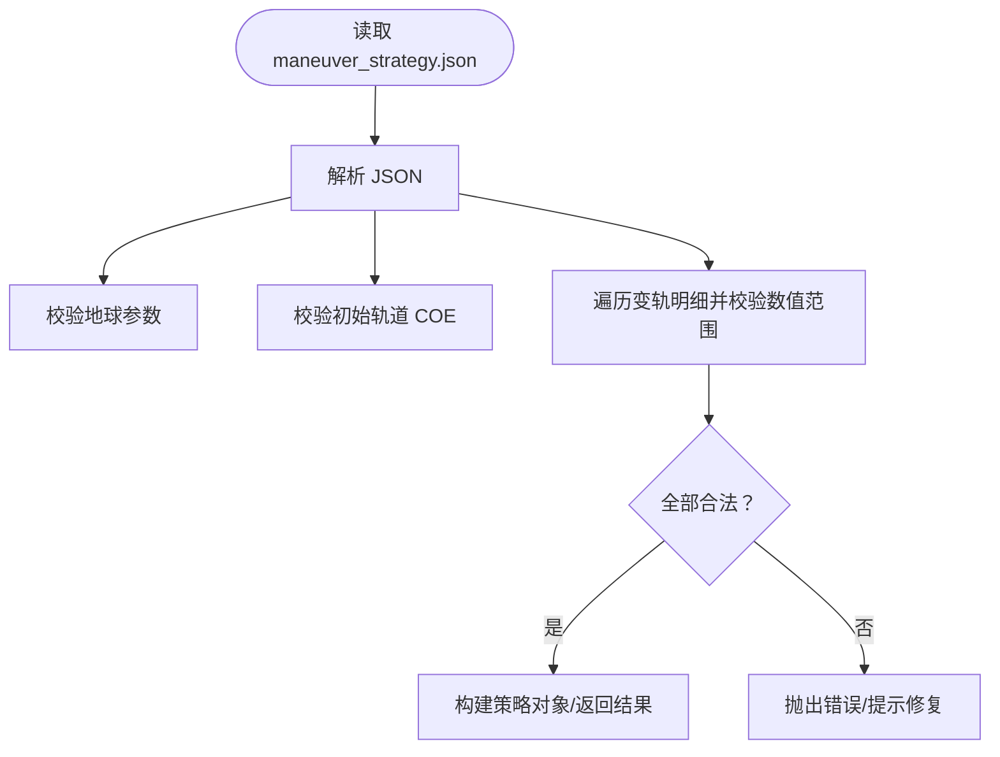
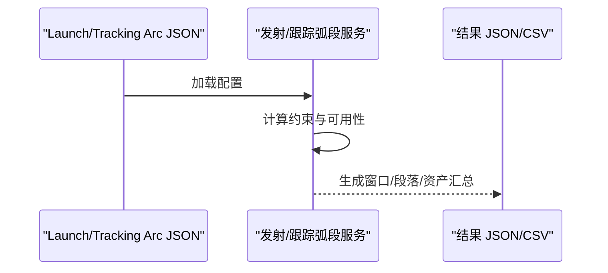
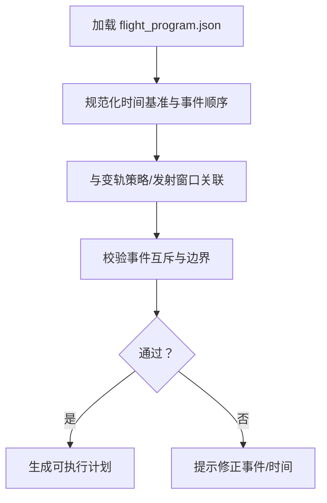
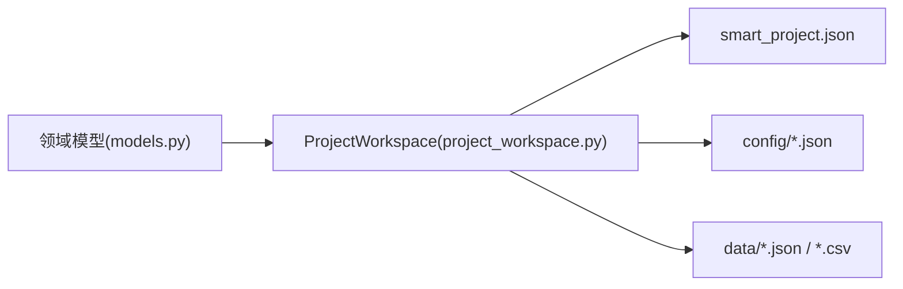

# 数据模型

<cite>
**本文档引用的文件**
- [models.py](file://src/smart/domain/models.py)
- [project_workspace.py](file://src/smart/services/project_workspace.py)
- [smart_project.json（F1）](file://projects/F1/smart_project.json)
- [smart_project.json（F4）](file://projects/F4/smart_project.json)
- [orbit_elements.json（F1）](file://projects/F1/data/orbit_elements.json)
- [maneuver_strategy.json（F4）](file://projects/F4/config/maneuver_strategy.json)
- [launch_window.json（F4）](file://projects/F4/config/launch_window.json)
- [tracking_arc.json（F4）](file://projects/F4/config/tracking_arc.json)
- [flight_program.json（F4）](file://projects/F4/config/flight_program.json)
- [satellite_3d_model.json（F4）](file://projects/F4/config/satellite_3d_model.json)
- [satellite_status.json（F1）](file://projects/F1/config/satellite_status.json)
- [launch_window_results.csv（F4）](file://projects/F4/data/launch_window_results.csv)
- [tracking_arc_results.json（F4）](file://projects/F4/data/tracking_arc_results.json)
</cite>

## 目录
1. [引言](#引言)
2. [项目结构](#项目结构)
3. [核心数据模型](#核心数据模型)
4. [架构总览](#架构总览)
5. [详细组件分析](#详细组件分析)
6. [依赖关系分析](#依赖关系分析)
7. [性能与可扩展性](#性能与可扩展性)
8. [故障排查指南](#故障排查指南)
9. [结论](#结论)
10. [附录：使用示例与最佳实践](#附录使用示例与最佳实践)

## 引言
本文件系统化梳理 SMART 项目中的核心数据模型与实体关系，覆盖轨道根数、卫星结构配置、变轨策略、发射窗口配置与结果、跟踪弧段配置与结果、飞行程序配置与结果等关键数据结构。文档同时阐明字段定义、数据类型、验证规则与业务约束，并给出序列化/反序列化机制、文件存储策略、依赖关系与错误处理建议，帮助开发者与用户在工程实践中正确使用与扩展这些模型。

## 项目结构
SMART 项目采用“领域模型 + 服务层 + 工程工作区”的分层组织方式：
- 领域模型位于 domain 层，定义核心数据结构与校验逻辑；
- 服务层负责业务流程与数据转换，如发射窗口计算、变轨策略设计、飞行程序生成等；
- 工作区层负责项目元数据、文件路径管理与 JSON 序列化/反序列化。

图表来源
- [project_workspace.py:10-31](file://src/smart/services/project_workspace.py#L10-L31)
- [models.py:17-255](file://src/smart/domain/models.py#L17-L255)

章节来源
- [project_workspace.py:33-52](file://src/smart/services/project_workspace.py#L33-L52)
- [smart_project.json（F1）:1-6](file://projects/F1/smart_project.json#L1-L6)
- [smart_project.json（F4）:1-6](file://projects/F4/smart_project.json#L1-L6)

## 核心数据模型
本节按主题划分核心数据模型，逐一说明字段、类型、验证规则与业务约束。

### 轨道根数模型（OrbitalElements）
- 字段与类型
  - 半长轴（km）、偏心率、轨道倾角（deg）、升交点赤经（deg）、近地点幅角（deg）、真近点角（deg）
  - 地心引力参数（km³/s²）、中心天体半径（km）、中心天体名称（字符串）
- 验证规则
  - 半长轴必须大于中心天体半径；偏心率需满足 0 ≤ e < 1；近地点高度必须高于中心天体表面
- 计算属性
  - 轨道周期（秒）、近地点/远地点半径（km）

章节来源
- [models.py:17-48](file://src/smart/domain/models.py#L17-L48)

### 卫星结构配置模型（SatelliteStructureConfig）
- 字段与类型
  - 机体尺寸（x/y/z，m），3D 模型路径，天线主/短轴（m），天线深度（m）
  - 东西/南北翼天线数量，单翼太阳能板数量、跨度、宽度、板间距（m）
- 默认值与用途
  - 提供默认参数以支持快速初始化；用于可视化与资源评估

章节来源
- [models.py:188-204](file://src/smart/domain/models.py#L188-L204)

### 卫星状态配置模型（SatelliteStatusSettings）
- 字段与类型
  - 发射质量（kg）、燃料负载（kg）、氦气负载（kg）
  - 轨控发动机推力/比冲（N、s），停泊发动机推力/比冲（N、s）
  - 结构配置（SatelliteStructureConfig）
  - 天基载荷：TTC 天线、中继天线（列表，含名称、波段、增益、波束宽度）
  - 地面资产：地面站/船（列表，含名称、类型、经纬度、海拔）
  - 中继卫星：中继星（列表，含名称、轨道位置、波段、备注）
- 默认值与用途
  - 提供默认载荷与资产集合；支持多实例配置与扩展

章节来源
- [models.py:207-255](file://src/smart/domain/models.py#L207-L255)

### 变轨策略模型（ManeuverStrategyPayload）
- 来源与版本
  - JSON 文件 maneuver_strategy.json，包含策略来源、地球参数、初始轨道、推进器参数、多次变轨的起止时间、燃烧时长、控制燃料占比、姿态/方向参数等
- 关键字段
  - 源信息（类型、生成时间、硬约束是否通过）
  - 地球参数（引力参数、J2、自转角速度、数值步长时间）
  - 初始轨道（COE，半长轴、偏心率、倾角、近地点幅角、升交点、平近点角）
  - 变轨次数与各次变轨明细（起始时间、燃烧时长、控制燃料占比、停泊时长、方向模式、偏航角、Δ 角、Δv 方向、推力/比冲）
- 验证与约束
  - 合法的地球参数与初始轨道；各变轨项的数值范围与一致性检查

章节来源
- [maneuver_strategy.json（F4）:1-103](file://projects/F4/config/maneuver_strategy.json#L1-L103)

### 发射窗口模型（LaunchWindowConfig）
- 字段与类型
  - 时间窗起止（UTC）、火箭飞行时间（s）、采样步长（min）、最小窗口时长（min）
  - 地面站/中继星可见性与几何约束阈值（角度、离地高度、阴影区间、测控弧长等）
  - 约束行（列表）：启用、名称、起止（min 或占位符 Tn_start/Tn_end）、条件类型（如无阴影、中继可见、地面可见、太阳角等）、作用范围（all/relay/ground）
  - 预设与自定义资产（地面站/中继星，含经纬度、海拔、类型）
- 业务约束
  - 要求首次轨道阴影、无阴影时段、跟踪弧、远程跟踪、分离阴影、点火太阳角等条件满足

章节来源
- [launch_window.json（F4）:1-230](file://projects/F4/config/launch_window.json#L1-L230)

### 跟踪弧段模型（TrackingArcConfig）
- 字段与类型
  - 与发射窗口配置一致，用于跟踪弧段分析与可视化
- 用途
  - 评估不同发射时刻的跟踪与测控可用性，输出跟踪弧段结果

章节来源
- [tracking_arc.json（F4）:1-230](file://projects/F4/config/tracking_arc.json#L1-L230)

### 飞行程序模型（FlightProgramPayload）
- 字段与类型
  - 版本、时间基准（如 t0 经历分钟）、发射选择模式（窗口/手动）、选定发射 UTC、选定轨道点（leading/midpoint）
  - 生成信息（过渡时长、来源）
  - 事件列表（事件 ID、名称、种类、模式、起止时间、瞬态标记、来源、锁定状态、注释、属性）
- 业务约束
  - 事件顺序与互斥（如点火前后过渡、姿态模式切换）；与变轨策略联动

章节来源
- [flight_program.json（F4）:1-367](file://projects/F4/config/flight_program.json#L1-L367)

### 轨道根数持久化（orbit_elements.json）
- 字段与类型
  - 与 OrbitalElements 对应，用于项目数据目录下的轨道根数快照
- 用途
  - 保存/加载轨道根数，便于复现与回放

章节来源
- [orbit_elements.json（F1）:1-11](file://projects/F1/data/orbit_elements.json#L1-L11)

### 卫星 3D 模型配置（satellite_3d_model.json）
- 字段与类型
  - 与 SatelliteStructureConfig 对应，用于项目配置目录下的卫星结构参数
- 用途
  - 保存/加载卫星结构配置，兼容旧版卫星状态文件

章节来源
- [satellite_3d_model.json（F4）:1-17](file://projects/F4/config/satellite_3d_model.json#L1-L17)

### 卫星状态配置（satellite_status.json）
- 字段与类型
  - 与 SatelliteStatusSettings 对应，包含推进器参数、载荷与资产清单
- 用途
  - 保存/加载卫星状态配置，兼容旧版文件布局

章节来源
- [satellite_status.json（F1）:1-72](file://projects/F1/config/satellite_status.json#L1-L72)

### 发射窗口结果（launch_window_results.csv）
- 字段与类型
  - 窗口前沿/后沿（北京时间）、窗口时长（min）、入轨 T0 前沿（北京时间）、首圈地影（min）、窗口前沿/后沿轨道最长地影（min）、窗口前沿/后沿限制条件
- 用途
  - 导出发射窗口候选与关键约束信息，便于人工审阅与决策

章节来源
- [launch_window_results.csv（F4）:1-6](file://projects/F4/data/launch_window_results.csv#L1-L6)

### 跟踪弧段结果（tracking_arc_results.json）
- 字段与类型
  - 版本、条目字典（键为窗口起止与时长拼接），每项包含配置、窗口信息、窗口签名、结果（点火时段、地面站/中继星/阴影段、资产汇总、阴影总时长、变轨次数等）
- 用途
  - 保存跟踪弧段分析结果，支持可视化与报告生成

章节来源
- [tracking_arc_results.json（F4）:1-800](file://projects/F4/data/tracking_arc_results.json#L1-L800)

## 架构总览
下图展示数据模型在工程中的流转：领域模型作为数据载体，服务层进行业务处理与规范化，工作区层负责持久化与版本控制。

图表来源
- [project_workspace.py:667-683](file://src/smart/services/project_workspace.py#L667-L683)
- [models.py:17-255](file://src/smart/domain/models.py#L17-L255)

## 详细组件分析

### 轨道根数模型（OrbitalElements）
- 设计要点
  - 使用 dataclass 定义不可变字段与默认值；提供 validate 方法进行轨道物理合法性检查
  - 提供周期、近/远地点半径等派生属性，避免重复计算
- 验证与约束
  - 半长轴 > 中心体半径；0 ≤ 偏心率 < 1；近地点高度 > 0
- 性能与复杂度
  - 校验为 O(1)；派生属性为纯数学计算，开销极低

图表来源
- [models.py:17-48](file://src/smart/domain/models.py#L17-L48)

章节来源
- [models.py:17-48](file://src/smart/domain/models.py#L17-L48)

### 卫星结构与状态配置
- 设计要点
  - 将结构参数、载荷与资产拆分为独立 dataclass，便于组合与扩展
  - 提供默认值与工厂函数，降低使用门槛
- 依赖关系
  - SatelliteStatusSettings 组合 SatelliteStructureConfig 与其他配置类

图表来源
- [models.py:163-255](file://src/smart/domain/models.py#L163-L255)

章节来源
- [models.py:163-255](file://src/smart/domain/models.py#L163-L255)

### 变轨策略配置（JSON）
- 设计要点
  - 以 JSON 承载策略配置，便于外部工具导入导出与版本管理
  - 包含地球参数、初始轨道、变轨次数与明细等
- 与领域模型的关系
  - JSON 通过服务层转换为内部 payload，再映射到领域模型或业务对象

图表来源
- [maneuver_strategy.json（F4）:1-103](file://projects/F4/config/maneuver_strategy.json#L1-L103)

章节来源
- [maneuver_strategy.json（F4）:1-103](file://projects/F4/config/maneuver_strategy.json#L1-L103)

### 发射窗口与跟踪弧段配置（JSON）
- 设计要点
  - 以 JSON 描述约束行、资产预设与自定义、时间窗与采样参数
  - 支持多种条件类型（无阴影、中继可见、地面可见、太阳角等）
- 输出结果
  - 跟踪弧段结果 JSON 包含窗口、签名、段落与资产汇总

图表来源
- [launch_window.json（F4）:1-230](file://projects/F4/config/launch_window.json#L1-L230)
- [tracking_arc.json（F4）:1-230](file://projects/F4/config/tracking_arc.json#L1-L230)
- [tracking_arc_results.json（F4）:1-800](file://projects/F4/data/tracking_arc_results.json#L1-L800)
- [launch_window_results.csv（F4）:1-6](file://projects/F4/data/launch_window_results.csv#L1-L6)

章节来源
- [launch_window.json（F4）:1-230](file://projects/F4/config/launch_window.json#L1-L230)
- [tracking_arc.json（F4）:1-230](file://projects/F4/config/tracking_arc.json#L1-L230)
- [tracking_arc_results.json（F4）:1-800](file://projects/F4/data/tracking_arc_results.json#L1-L800)
- [launch_window_results.csv（F4）:1-6](file://projects/F4/data/launch_window_results.csv#L1-L6)

### 飞行程序配置（JSON）
- 设计要点
  - 以事件列表描述姿态/部署/点火等阶段，支持自动/手动来源与锁定状态
  - 与变轨策略联动，确保事件时间与变轨窗口一致

图表来源
- [flight_program.json（F4）:1-367](file://projects/F4/config/flight_program.json#L1-L367)

章节来源
- [flight_program.json（F4）:1-367](file://projects/F4/config/flight_program.json#L1-L367)

## 依赖关系分析
- 领域模型与服务层
  - 服务层通过 project_workspace.py 提供统一的序列化/反序列化接口，将 dataclass 映射为 JSON payload，并写入/读取文件
- 文件与项目元数据
  - 每个项目包含 smart_project.json 元数据，记录项目名称、版本与时间戳；工作区根据文件名常量定位各配置/结果文件
- 外部依赖
  - JSON 文件作为主要持久化介质；CSV 用于导出窗口结果

图表来源
- [project_workspace.py:33-52](file://src/smart/services/project_workspace.py#L33-L52)
- [smart_project.json（F1）:1-6](file://projects/F1/smart_project.json#L1-L6)
- [smart_project.json（F4）:1-6](file://projects/F4/smart_project.json#L1-L6)

章节来源
- [project_workspace.py:33-52](file://src/smart/services/project_workspace.py#L33-L52)

## 性能与可扩展性
- 性能特性
  - 领域模型字段均为标量或数组，序列化/反序列化成本低；轨道计算为纯数学运算，复杂度低
- 可扩展性
  - 新增配置可通过 JSON 字段扩展；服务层提供标准化的读写与哈希机制，便于缓存与版本控制
- 建议
  - 对大规模 CSV/JSON 的读取建议分块处理；对频繁变更的配置使用增量更新策略

[本节为通用指导，无需特定文件来源]

## 故障排查指南
- 常见问题与处理
  - JSON 解析失败：检查文件编码与格式；确认顶层为对象
  - 字段缺失或类型不匹配：核对字段名与类型；必要时使用默认值回退
  - 轨道非法：半长轴过小、偏心率越界、近地点低于地表等；修正后重试
  - 变轨策略不合法：检查各变轨项的时间、角度与推力参数是否在合理范围内
- 错误处理机制
  - 读取 JSON 时进行类型校验；序列化时使用稳定哈希（sort_keys、紧凑分隔符）保证一致性
  - 工作区层提供标准化的读写函数与错误包装，便于定位问题

章节来源
- [project_workspace.py:673-683](file://src/smart/services/project_workspace.py#L673-L683)
- [project_workspace.py:686-695](file://src/smart/services/project_workspace.py#L686-L695)
- [models.py:29-36](file://src/smart/domain/models.py#L29-L36)

## 结论
SMART 项目的数据模型围绕“领域模型 + JSON 文件 + 工作区服务”的架构组织，既保证了领域语义的清晰表达，又兼顾了工程落地的易用性与可维护性。通过严格的字段定义、验证规则与序列化机制，项目实现了从轨道根数、卫星配置、变轨策略、发射窗口、跟踪弧段到飞行程序的全链路数据闭环。

[本节为总结，无需特定文件来源]

## 附录：使用示例与最佳实践
- 使用示例
  - 保存轨道根数：调用工作区的保存方法，传入 OrbitalElements 实例，自动写入 orbit_elements.json
  - 保存卫星结构配置：调用保存方法，传入 SatelliteStructureConfig 实例，写入 satellite_3d_model.json
  - 保存变轨策略：传入 JSON payload 至保存方法，写入 maneuver_strategy.json
  - 保存发射/跟踪弧段配置：分别写入 launch_window.json / tracking_arc.json
  - 保存飞行程序配置：写入 flight_program.json
  - 导出窗口结果：读取 tracking_arc_results.json 或 launch_window_results.csv 进行报告生成
- 最佳实践
  - 在写入前进行规范化与哈希校验，确保配置一致性与缓存命中
  - 对外部导入的 JSON 进行严格校验与默认值填充，避免运行期异常
  - 对大规模数据采用分块读取与增量更新策略，提升稳定性与性能
  - 保持 JSON 字段命名与类型的一致性，便于跨模块协作与自动化处理

章节来源
- [project_workspace.py:213-240](file://src/smart/services/project_workspace.py#L213-L240)
- [project_workspace.py:332-358](file://src/smart/services/project_workspace.py#L332-L358)
- [project_workspace.py:372-396](file://src/smart/services/project_workspace.py#L372-L396)
- [project_workspace.py:667-683](file://src/smart/services/project_workspace.py#L667-L683)