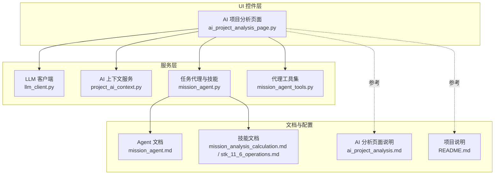
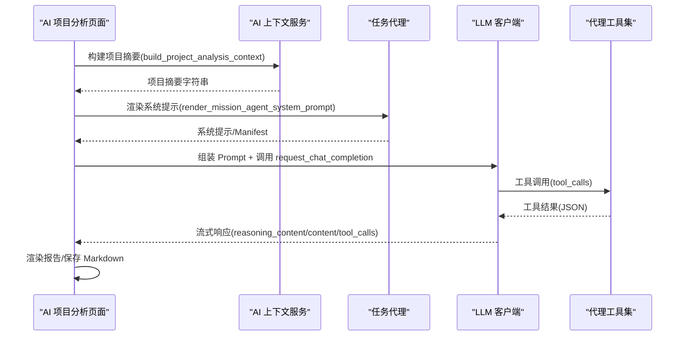
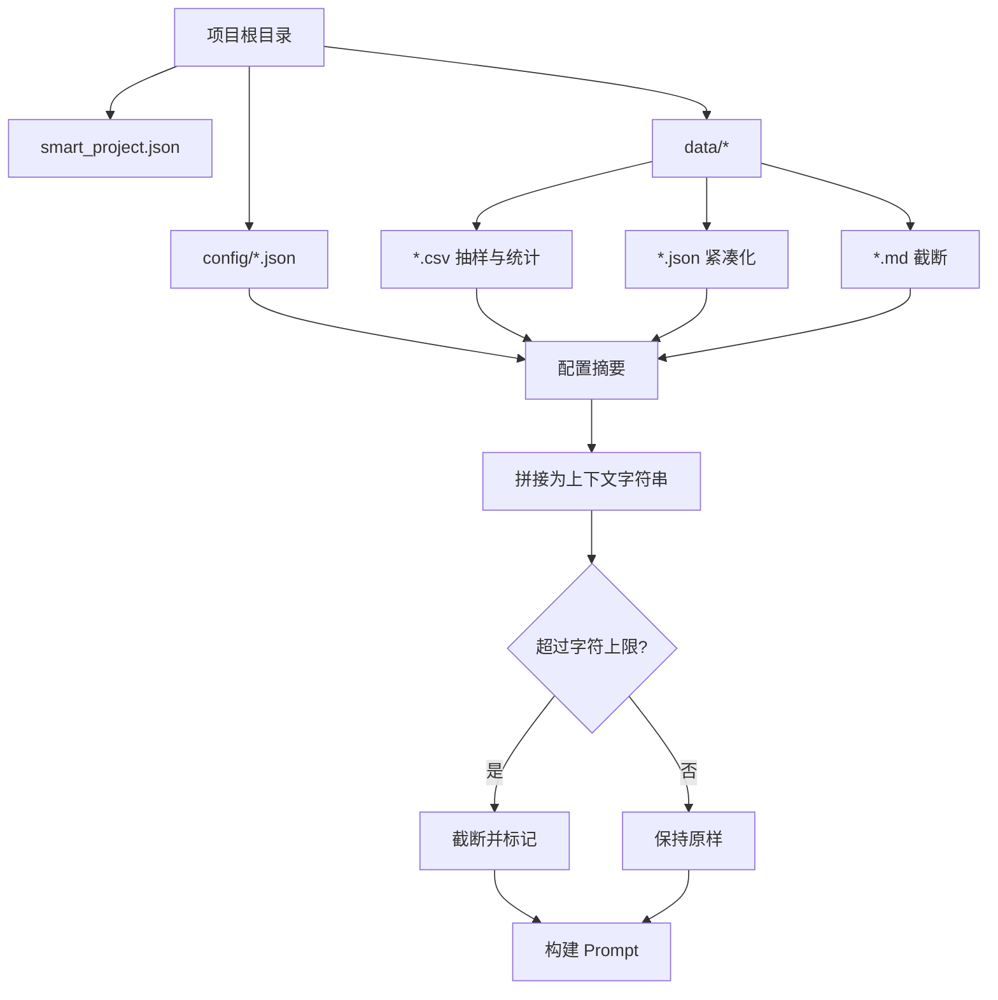
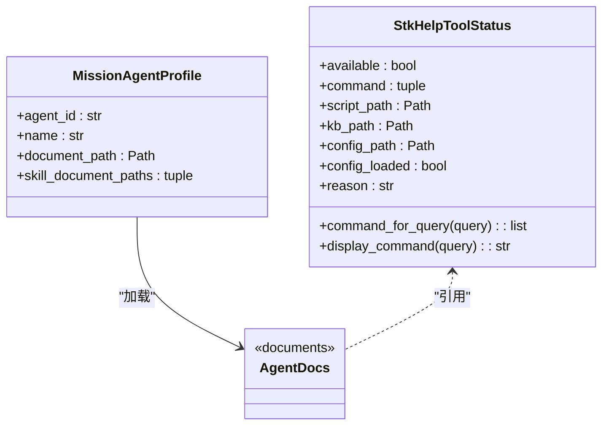
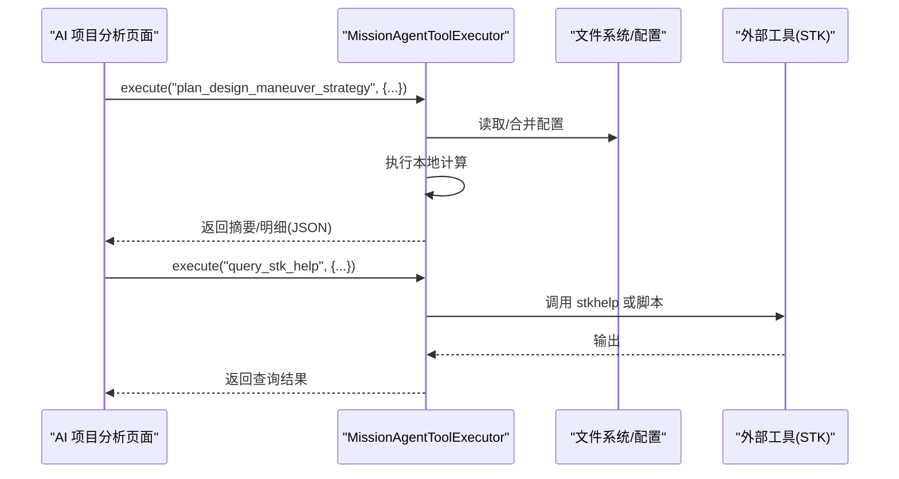
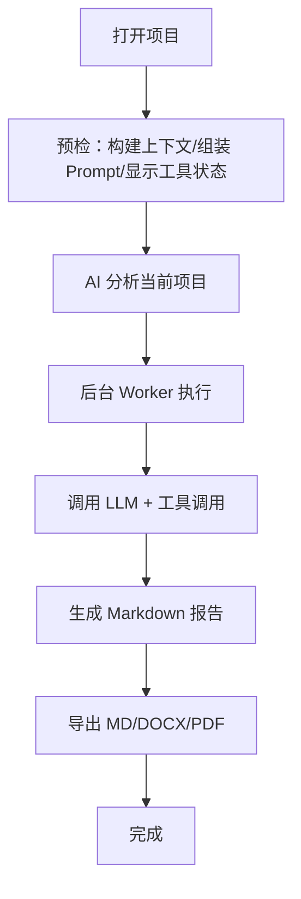
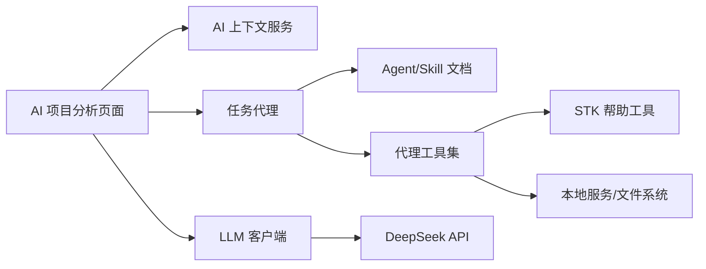

# AI集成服务

<cite>
**本文引用的文件**
- [llm_client.py](file://src/smart/services/llm_client.py)
- [project_ai_context.py](file://src/smart/services/project_ai_context.py)
- [mission_agent.py](file://src/smart/services/mission_agent.py)
- [mission_agent_tools.py](file://src/smart/services/mission_agent_tools.py)
- [ai_project_analysis_page.py](file://src/smart/ui/widgets/ai_project_analysis_page.py)
- [ai_project_analysis.md](file://doc/ai_project_analysis.md)
- [README.md](file://README.md)
- [mission_agent.md](file://src/smart/agents/mission_agent.md)
- [mission_analysis_calculation.md](file://src/smart/agents/skills/mission_analysis_calculation.md)
- [stk_11_6_operations.md](file://src/smart/agents/skills/stk_11_6_operations.md)
- [test_llm_client.py](file://tests/test_llm_client.py)
- [test_ai_project_analysis.py](file://tests/test_ai_project_analysis.py)
- [pyproject.toml](file://pyproject.toml)
- [app_runtime.py](file://src/smart/app_runtime.py)
</cite>

## 目录
1. [简介](#简介)
2. [项目结构](#项目结构)
3. [核心组件](#核心组件)
4. [架构总览](#架构总览)
5. [详细组件分析](#详细组件分析)
6. [依赖关系分析](#依赖关系分析)
7. [性能考量](#性能考量)
8. [故障排查指南](#故障排查指南)
9. [结论](#结论)
10. [附录](#附录)

## 简介
本文件系统化阐述 SMART 项目中的 AI 集成服务，聚焦以下能力：
- LLM 客户端服务：模型接入、提示工程与响应处理
- AI 上下文服务：知识抽取、语义理解和智能推荐
- 任务代理服务：智能决策、工具调用与执行监控
- 代理工具集：API 封装、参数验证与错误恢复
- 配置管理、性能调优与安全控制
- AI 辅助分析工作流程与最佳实践
- AI 与传统航天分析方法的融合策略

## 项目结构
AI 集成服务位于桌面应用的“服务层”与“UI 控件层”，围绕 LLM 客户端、项目上下文、代理与工具集协同工作，最终在 UI 页面中呈现报告与执行日志。

**图表来源**
- [ai_project_analysis_page.py:1-120](file://src/smart/ui/widgets/ai_project_analysis_page.py#L1-L120)
- [llm_client.py:1-120](file://src/smart/services/llm_client.py#L1-L120)
- [project_ai_context.py:1-60](file://src/smart/services/project_ai_context.py#L1-L60)
- [mission_agent.py:1-80](file://src/smart/services/mission_agent.py#L1-L80)
- [mission_agent_tools.py:1-80](file://src/smart/services/mission_agent_tools.py#L1-L80)
- [mission_agent.md:1-27](file://src/smart/agents/mission_agent.md#L1-L27)
- [mission_analysis_calculation.md:1-48](file://src/smart/agents/skills/mission_analysis_calculation.md#L1-L48)
- [stk_11_6_operations.md:1-52](file://src/smart/agents/skills/stk_11_6_operations.md#L1-L52)
- [ai_project_analysis.md:1-40](file://doc/ai_project_analysis.md#L1-L40)
- [README.md:1-60](file://README.md#L1-L60)

**章节来源**
- [ai_project_analysis_page.py:1-120](file://src/smart/ui/widgets/ai_project_analysis_page.py#L1-L120)
- [README.md:1-60](file://README.md#L1-L60)

## 核心组件
- LLM 客户端服务：封装 DeepSeek V4 接口，支持流式 SSE、推理内容暴露控制、工具调用循环与进度回调。
- AI 上下文服务：从项目目录抽取 JSON/CSV/文件清单，生成项目摘要与 Prompt。
- 任务代理服务：加载 Agent 与 Skill 文档，渲染 system prompt 与 manifest，提供技能选择与 STK 帮助工具解析。
- 代理工具集：封装设计变轨、发射窗口、地影计算、STK 帮助查询等本地工具，统一参数校验与错误处理。
- UI 页面：提供提示词模板、模型配置、技能选择、执行日志与报告导出。

**章节来源**
- [llm_client.py:69-162](file://src/smart/services/llm_client.py#L69-L162)
- [project_ai_context.py:17-81](file://src/smart/services/project_ai_context.py#L17-L81)
- [mission_agent.py:145-211](file://src/smart/services/mission_agent.py#L145-L211)
- [mission_agent_tools.py:42-250](file://src/smart/services/mission_agent_tools.py#L42-L250)
- [ai_project_analysis_page.py:231-428](file://src/smart/ui/widgets/ai_project_analysis_page.py#L231-L428)

## 架构总览
AI 集成服务采用“UI 触发 → 上下文构建 → 提示工程 → LLM 推理 + 工具调用 → 结果聚合 → 报告输出”的流水线。

**图表来源**
- [ai_project_analysis_page.py:170-218](file://src/smart/ui/widgets/ai_project_analysis_page.py#L170-L218)
- [project_ai_context.py:17-81](file://src/smart/services/project_ai_context.py#L17-L81)
- [mission_agent.py:185-201](file://src/smart/services/mission_agent.py#L185-L201)
- [llm_client.py:69-162](file://src/smart/services/llm_client.py#L69-L162)
- [mission_agent_tools.py:232-250](file://src/smart/services/mission_agent_tools.py#L232-L250)

## 详细组件分析

### LLM 客户端服务
- 模型接入
  - 仅支持 DeepSeek V4 模型族，提供推理效率与思维链开关。
  - 默认启用流式 SSE，包含用量统计；支持工具调用 auto 选择。
- 提示工程
  - 通过系统提示注入 Agent/Skill 文档，确保模型遵循工程规范。
- 响应处理
  - 流式解析 SSE，累积 content 与 reasoning_content；合并工具调用增量。
  - 支持推理内容暴露控制与工具参数日志截断，兼顾可观测性与隐私。
- 错误处理
  - 统一封装 HTTP/URL/超时错误，抛出可诊断的运行时异常。

```mermaid
flowchart TD
Start(["开始 request_chat_completion"]) --> Validate["校验 API Key 与模型"]
Validate --> BuildMsg["构建消息数组(system+user)"]
BuildMsg --> Loop{"工具调用轮次 < max_tool_rounds ?"}
Loop --> |否| Done["返回 LLMResponse"]
Loop --> |是| Stream["流式请求 _stream_deepseek_turn"]
Stream --> Reasoning{"reasoning_content 可见?"}
Reasoning --> |是| EmitR["进度回调输出 reasoning"]
Reasoning --> |否| EmitDefault["进度回调提示默认不显示思考流"]
Stream --> Content["累积 content"]
Stream --> MergeTool["合并 tool_calls 增量"]
MergeTool --> HasTool{"有 tool_calls ?"}
HasTool --> |否| Done
HasTool --> |是| Exec["执行 tool_executor(name, args)"]
Exec --> AppendTool["追加 tool 结果到消息"]
AppendTool --> Loop
```

**图表来源**
- [llm_client.py:69-162](file://src/smart/services/llm_client.py#L69-L162)
- [llm_client.py:164-226](file://src/smart/services/llm_client.py#L164-L226)
- [llm_client.py:228-272](file://src/smart/services/llm_client.py#L228-L272)

**章节来源**
- [llm_client.py:69-162](file://src/smart/services/llm_client.py#L69-L162)
- [llm_client.py:164-226](file://src/smart/services/llm_client.py#L164-L226)
- [llm_client.py:228-272](file://src/smart/services/llm_client.py#L228-L272)
- [test_llm_client.py:9-33](file://tests/test_llm_client.py#L9-L33)
- [test_llm_client.py:60-118](file://tests/test_llm_client.py#L60-L118)
- [test_llm_client.py:120-162](file://tests/test_llm_client.py#L120-L162)

### AI 上下文服务
- 知识抽取
  - 读取项目元数据、配置 JSON、关键数据 CSV/MD，生成结构化摘要。
  - 对大文件进行统计与抽样，避免将完整大 CSV 直接送入模型。
- 语义理解
  - 将抽取内容与 Agent/Skill 文档拼装为 Prompt，限定分析范围与输出要求。
- 智能推荐
  - 通过模板化提示词引导模型聚焦特定分析域（如发射窗口、地影、变轨策略）。

**图表来源**
- [project_ai_context.py:17-81](file://src/smart/services/project_ai_context.py#L17-L81)
- [project_ai_context.py:83-155](file://src/smart/services/project_ai_context.py#L83-L155)
- [project_ai_context.py:157-183](file://src/smart/services/project_ai_context.py#L157-L183)

**章节来源**
- [project_ai_context.py:17-81](file://src/smart/services/project_ai_context.py#L17-L81)
- [project_ai_context.py:83-155](file://src/smart/services/project_ai_context.py#L83-L155)
- [ai_project_analysis.md:37-49](file://doc/ai_project_analysis.md#L37-L49)

### 任务代理服务
- Agent 与 Skill 加载
  - 从 Markdown 文档加载 Agent 与 Skill，渲染 Manifest 与系统提示。
- 技能选择
  - 支持“全部技能”与单个技能注入，便于聚焦分析范围。
- STK 帮助工具解析
  - 优先级：环境变量 > 本机 JSON 配置 > 默认用户目录；支持命令或脚本两种调用路径。

**图表来源**
- [mission_agent.py:40-71](file://src/smart/services/mission_agent.py#L40-L71)
- [mission_agent.py:145-211](file://src/smart/services/mission_agent.py#L145-L211)
- [mission_agent.md:1-27](file://src/smart/agents/mission_agent.md#L1-L27)
- [mission_analysis_calculation.md:1-48](file://src/smart/agents/skills/mission_analysis_calculation.md#L1-L48)
- [stk_11_6_operations.md:1-52](file://src/smart/agents/skills/stk_11_6_operations.md#L1-L52)

**章节来源**
- [mission_agent.py:145-211](file://src/smart/services/mission_agent.py#L145-L211)
- [mission_agent.py:80-120](file://src/smart/services/mission_agent.py#L80-L120)
- [mission_agent.md:1-27](file://src/smart/agents/mission_agent.md#L1-L27)
- [mission_analysis_calculation.md:1-48](file://src/smart/agents/skills/mission_analysis_calculation.md#L1-L48)
- [stk_11_6_operations.md:1-52](file://src/smart/agents/skills/stk_11_6_operations.md#L1-L52)

### 代理工具集
- 工具封装
  - 设计变轨策略、连续推力优化、发射窗口重采样、地影区间计算、项目文件检查、STK 帮助查询。
- 参数验证
  - 对必填字段、数值范围、时间格式进行严格校验；必要时抛出可诊断错误。
- 错误恢复
  - 通过统一异常类型与错误消息，区分“项目文件缺失”“参数非法”“外部工具不可用”等场景。

**图表来源**
- [mission_agent_tools.py:232-250](file://src/smart/services/mission_agent_tools.py#L232-L250)
- [mission_agent_tools.py:296-342](file://src/smart/services/mission_agent_tools.py#L296-L342)
- [mission_agent_tools.py:474-512](file://src/smart/services/mission_agent_tools.py#L474-L512)

**章节来源**
- [mission_agent_tools.py:42-250](file://src/smart/services/mission_agent_tools.py#L42-L250)
- [mission_agent_tools.py:296-342](file://src/smart/services/mission_agent_tools.py#L296-L342)
- [mission_agent_tools.py:474-512](file://src/smart/services/mission_agent_tools.py#L474-L512)
- [test_ai_project_analysis.py:230-241](file://tests/test_ai_project_analysis.py#L230-L241)
- [test_ai_project_analysis.py:293-307](file://tests/test_ai_project_analysis.py#L293-L307)
- [test_ai_project_analysis.py:309-328](file://tests/test_ai_project_analysis.py#L309-L328)
- [test_ai_project_analysis.py:330-363](file://tests/test_ai_project_analysis.py#L330-L363)

### UI 页面与工作流
- 提示词模板
  - 提供“项目综合体检”“设计变轨策略复核”“连续推力优化复核”“发射窗口约束重采样”“跟踪弧段与地影风险”“飞行程序与结果一致性”等模板。
- 模型配置
  - 支持 base_url、api_key、model、reasoning_effort、thinking 开关；配置持久化至本机设置。
- 执行监控
  - 后台线程执行，实时输出进度、reasoning 内容、工具调用与报告保存状态。
- 报告导出
  - 支持 Markdown、DOCX、PDF 导出，表格符号规范化，保证跨平台可读性。

**图表来源**
- [ai_project_analysis_page.py:495-529](file://src/smart/ui/widgets/ai_project_analysis_page.py#L495-L529)
- [ai_project_analysis_page.py:530-573](file://src/smart/ui/widgets/ai_project_analysis_page.py#L530-L573)
- [ai_project_analysis_page.py:600-620](file://src/smart/ui/widgets/ai_project_analysis_page.py#L600-L620)
- [ai_project_analysis_page.py:449-458](file://src/smart/ui/widgets/ai_project_analysis_page.py#L449-L458)

**章节来源**
- [ai_project_analysis_page.py:43-144](file://src/smart/ui/widgets/ai_project_analysis_page.py#L43-L144)
- [ai_project_analysis_page.py:530-573](file://src/smart/ui/widgets/ai_project_analysis_page.py#L530-L573)
- [ai_project_analysis_page.py:600-620](file://src/smart/ui/widgets/ai_project_analysis_page.py#L600-L620)
- [ai_project_analysis.md:81-94](file://doc/ai_project_analysis.md#L81-L94)

## 依赖关系分析
- 组件耦合
  - UI 页面依赖上下文服务、代理与 LLM 客户端；代理依赖文档；工具集依赖本地服务与外部工具。
- 外部依赖
  - LLM 服务（DeepSeek）、STK 帮助工具、报告导出库（reportlab）。
- 配置与环境
  - API key 与模型参数可通过页面或环境变量注入；STK 帮助工具通过环境变量/配置文件控制。

**图表来源**
- [ai_project_analysis_page.py:10-36](file://src/smart/ui/widgets/ai_project_analysis_page.py#L10-L36)
- [mission_agent.py:145-211](file://src/smart/services/mission_agent.py#L145-L211)
- [mission_agent_tools.py:31-32](file://src/smart/services/mission_agent_tools.py#L31-L32)
- [pyproject.toml:11-22](file://pyproject.toml#L11-L22)

**章节来源**
- [pyproject.toml:11-22](file://pyproject.toml#L11-L22)
- [app_runtime.py:31-91](file://src/smart/app_runtime.py#L31-L91)

## 性能考量
- 流式处理
  - 使用 SSE 流式响应，边生成边输出，降低首字延迟。
- 数据截断
  - 上下文与工具参数日志均设置截断阈值，避免超长内容阻塞。
- 轮次限制
  - 工具调用轮次上限防止无限循环，结合最大耗时控制保障稳定性。
- UI 线程隔离
  - LLM 请求在后台线程执行，避免阻塞界面交互。

**章节来源**
- [llm_client.py:101-162](file://src/smart/services/llm_client.py#L101-L162)
- [llm_client.py:319-324](file://src/smart/services/llm_client.py#L319-L324)
- [ai_project_analysis_page.py:570-573](file://src/smart/ui/widgets/ai_project_analysis_page.py#L570-L573)

## 故障排查指南
- API 配置
  - 确认 base_url、api_key、model 填写正确；若使用环境变量，检查变量名与值。
- STK 帮助工具
  - 检查 kb_path、script_path、command 是否可达；优先使用环境变量覆盖配置文件。
- 工具参数
  - 对必填字段与数值范围进行校验；注意时间格式与单位转换。
- 日志与回溯
  - 展开“执行日志”查看 reasoning_content、工具调用与返回摘要；错误信息包含关键线索。

**章节来源**
- [ai_project_analysis_page.py:621-646](file://src/smart/ui/widgets/ai_project_analysis_page.py#L621-L646)
- [mission_agent_tools.py:474-512](file://src/smart/services/mission_agent_tools.py#L474-L512)
- [test_ai_project_analysis.py:293-307](file://tests/test_ai_project_analysis.py#L293-L307)
- [test_ai_project_analysis.py:309-328](file://tests/test_ai_project_analysis.py#L309-L328)
- [test_ai_project_analysis.py:330-363](file://tests/test_ai_project_analysis.py#L330-L363)

## 结论
SMART 的 AI 集成服务通过“受控工具调用 + 工程化提示工程 + 流式可观测性”实现安全、可控且高效的 AI 辅助分析。其核心在于：
- 以项目上下文为锚点，避免无关噪声；
- 以 Agent/Skill 为边界，限定模型行为；
- 以工具集为桥梁，连接本地计算与外部知识；
- 以 UI 为入口，提供可追溯、可导出的工程化报告。

## 附录

### 配置管理与安全控制
- API key 管理
  - 页面输入或环境变量注入；不写入项目配置。
- 数据发送范围
  - 仅发送摘要与受限文件清单，不上传完整大 CSV、二进制文件与内核。
- 安全边界
  - 工具默认只读；明确提示不会发送 API key 与完整 prompt。

**章节来源**
- [ai_project_analysis.md:28-36](file://doc/ai_project_analysis.md#L28-L36)
- [ai_project_analysis.md:37-49](file://doc/ai_project_analysis.md#L37-L49)
- [ai_project_analysis_page.py:518-528](file://src/smart/ui/widgets/ai_project_analysis_page.py#L518-L528)

### 性能调优建议
- 合理设置 reasoning_effort 与 thinking 开关，平衡质量与速度。
- 控制上下文字符上限与 CSV 抽样行数，避免超限。
- 限制工具调用轮次与单次工具执行超时，提升鲁棒性。

**章节来源**
- [llm_client.py:32-42](file://src/smart/services/llm_client.py#L32-L42)
- [llm_client.py:101-162](file://src/smart/services/llm_client.py#L101-L162)
- [project_ai_context.py:13-14](file://src/smart/services/project_ai_context.py#L13-L14)

### 最佳实践
- 使用模板化提示词明确分析范围与输出要求。
- 优先调用本地工具获取项目数据，减少假设性结论。
- 对关键结论标注证据路径与复核页面，便于工程验证。
- 严格区分“建议”与“已执行”，避免误导。

**章节来源**
- [ai_project_analysis.md:81-94](file://doc/ai_project_analysis.md#L81-L94)
- [mission_agent.md:20-27](file://src/smart/agents/mission_agent.md#L20-L27)
- [mission_analysis_calculation.md:41-48](file://src/smart/agents/skills/mission_analysis_calculation.md#L41-L48)

### 与传统航天分析的融合策略
- 以 SPICE/STK 为核心，AI 作为“智能分析与建议引擎”参与工程闭环。
- 保持 UI 时间基准与服务层配置边界分离，报告中明确时间基准。
- 将 AI 输出作为“下一步验证清单”，而非直接修改任务配置。

**章节来源**
- [README.md:22-31](file://README.md#L22-L31)
- [mission_agent.md:13-18](file://src/smart/agents/mission_agent.md#L13-L18)
- [ai_project_analysis.md:95-103](file://doc/ai_project_analysis.md#L95-L103)