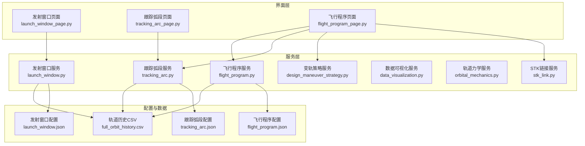
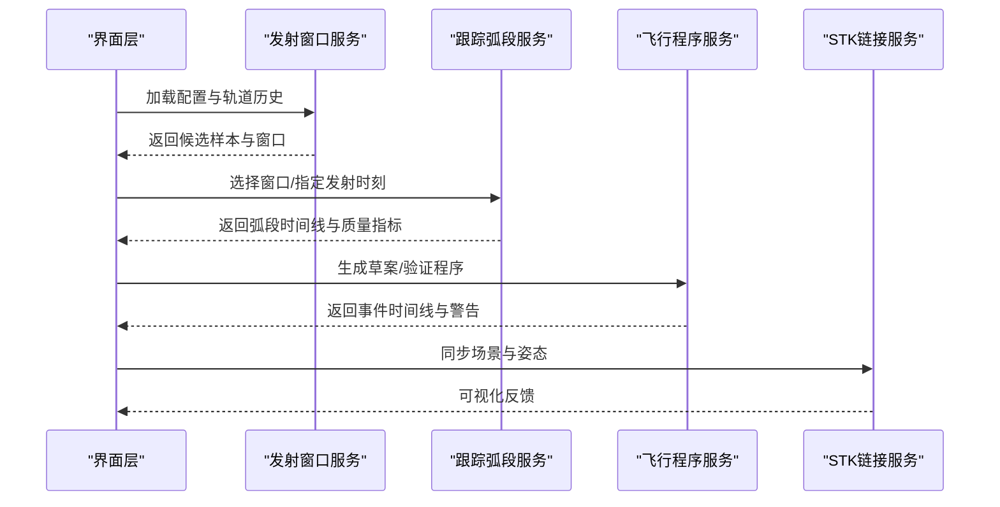
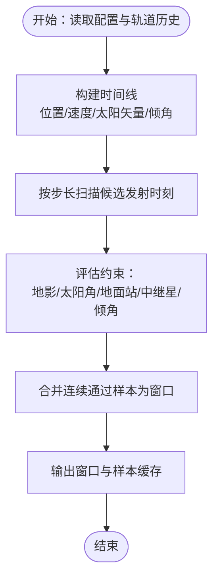
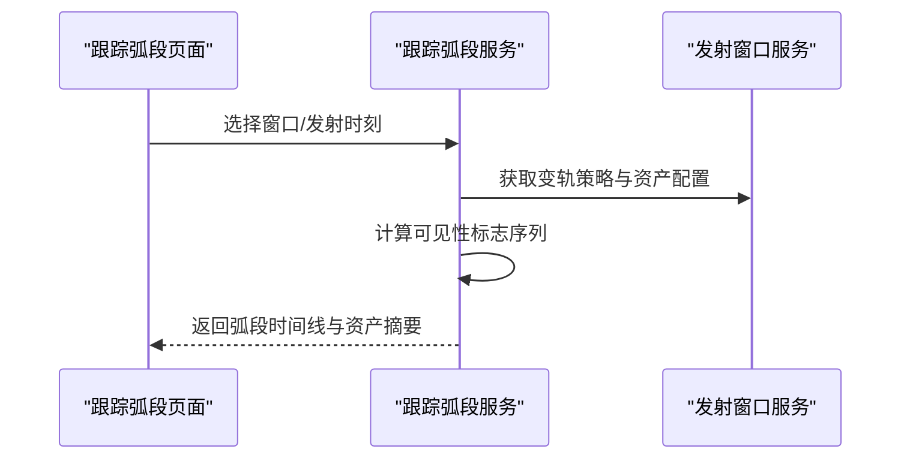
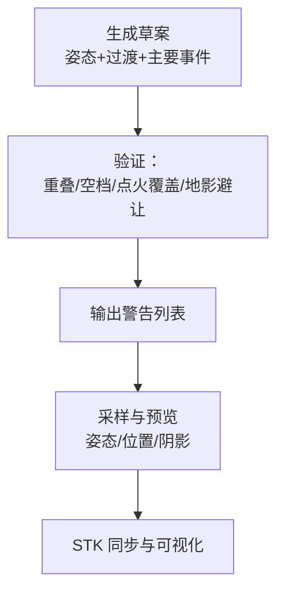
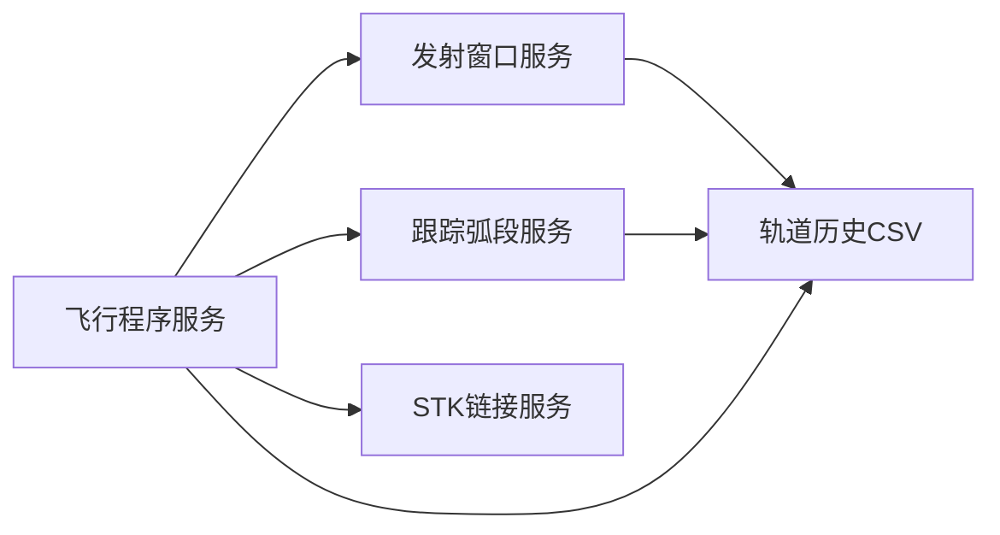

# 任务规划服务

<cite>
**本文引用的文件**
- [launch_window.py](file://src/smart/services/launch_window.py)
- [tracking_arc.py](file://src/smart/services/tracking_arc.py)
- [flight_program.py](file://src/smart/services/flight_program.py)
- [design_maneuver_strategy.py](file://src/smart/services/design_maneuver_strategy.py)
- [data_visualization.py](file://src/smart/services/data_visualization.py)
- [orbital_mechanics.py](file://src/smart/services/orbital_mechanics.py)
- [stk_link.py](file://src/smart/services/stk_link.py)
- [launch_window_workflow.md](file://doc/launch_window_workflow.md)
- [planning_workflow.md](file://doc/planning_workflow.md)
- [launch_window_page.py](file://src/smart/ui/widgets/launch_window_page.py)
- [tracking_arc_page.py](file://src/smart/ui/widgets/tracking_arc_page.py)
- [flight_program_page.py](file://src/smart/ui/widgets/flight_program_page.py)
- [launch_window.json](file://projects/F4/config/launch_window.json)
- [flight_program.json](file://projects/F4/config/flight_program.json)
- [tracking_arc.json](file://projects/F4/config/tracking_arc.json)
</cite>

## 目录
1. [简介](#简介)
2. [项目结构](#项目结构)
3. [核心组件](#核心组件)
4. [架构总览](#架构总览)
5. [详细组件分析](#详细组件分析)
6. [依赖关系分析](#依赖关系分析)
7. [性能考量](#性能考量)
8. [故障排查指南](#故障排查指南)
9. [结论](#结论)
10. [附录](#附录)

## 简介
本文件系统化梳理 SMART 任务规划服务，围绕三大核心能力展开：发射窗口分析、跟踪弧段分析与飞行程序生成。文档重点阐释以下方面：
- 发射窗口分析服务的约束扫描算法、窗口计算方法与结果筛选机制
- 跟踪弧段分析服务的测控可见性计算、地面站覆盖分析与弧段质量评估
- 飞行程序服务的时间线生成算法、事件调度策略与程序验证机制
- 多目标优化、约束处理与不确定性分析
- 可视化工具与结果解读方法
- 与轨道设计、变轨策略的协同工作机制

## 项目结构
任务规划服务采用分层架构，UI 层负责交互与可视化，服务层提供核心算法与数据处理，配置与数据层支撑运行参数与历史数据。

**图表来源**
- [launch_window_page.py:348-800](file://src/smart/ui/widgets/launch_window_page.py#L348-L800)
- [tracking_arc_page.py:671-800](file://src/smart/ui/widgets/tracking_arc_page.py#L671-L800)
- [flight_program_page.py:70-800](file://src/smart/ui/widgets/flight_program_page.py#L70-L800)
- [launch_window.py:1-800](file://src/smart/services/launch_window.py#L1-L800)
- [tracking_arc.py:1-384](file://src/smart/services/tracking_arc.py#L1-L384)
- [flight_program.py:1-635](file://src/smart/services/flight_program.py#L1-L635)
- [design_maneuver_strategy.py:1-800](file://src/smart/services/design_maneuver_strategy.py#L1-L800)
- [data_visualization.py:1-220](file://src/smart/services/data_visualization.py#L1-L220)
- [orbital_mechanics.py:1-780](file://src/smart/services/orbital_mechanics.py#L1-L780)
- [stk_link.py:1-755](file://src/smart/services/stk_link.py#L1-L755)
- [launch_window.json:1-230](file://projects/F4/config/launch_window.json#L1-L230)
- [flight_program.json:1-367](file://projects/F4/config/flight_program.json#L1-L367)
- [tracking_arc.json:1-230](file://projects/F4/config/tracking_arc.json#L1-L230)

**章节来源**
- [launch_window_page.py:348-800](file://src/smart/ui/widgets/launch_window_page.py#L348-L800)
- [tracking_arc_page.py:671-800](file://src/smart/ui/widgets/tracking_arc_page.py#L671-L800)
- [flight_program_page.py:70-800](file://src/smart/ui/widgets/flight_program_page.py#L70-L800)

## 核心组件
- 发射窗口分析服务：基于轨道历史与变轨策略，扫描候选发射时刻，评估地影、太阳角、地面站与中继星可见性等约束，合并连续通过样本形成发射窗口，输出窗口结果与样本缓存。
- 跟踪弧段分析服务：针对选定发射窗口或指定发射时刻，计算各测控资源与约束条件下的可见弧段，统计资产覆盖时长与质量指标，生成弧段时间线。
- 飞行程序服务：以变轨策略与跟踪弧段为基础，生成姿态模式、过渡段与主要事件的时间线草案，支持验证与采样，结合 STK 实现可视化联动。
- 变轨策略服务：提供轨道机动参数化建模、多阶段约束与优化，支撑发射窗口与飞行程序的协同设计。
- 数据可视化与 STK 集成：提供轨道参数序列构建、姿态采样与 STK 场景同步，辅助结果解读与验证。

**章节来源**
- [launch_window.py:565-620](file://src/smart/services/launch_window.py#L565-L620)
- [tracking_arc.py:66-121](file://src/smart/services/tracking_arc.py#L66-L121)
- [flight_program.py:144-227](file://src/smart/services/flight_program.py#L144-L227)
- [design_maneuver_strategy.py:535-673](file://src/smart/services/design_maneuver_strategy.py#L535-L673)
- [data_visualization.py:49-108](file://src/smart/services/data_visualization.py#L49-L108)
- [stk_link.py:280-338](file://src/smart/services/stk_link.py#L280-L338)

## 架构总览
任务规划服务遵循“配置驱动 + 数据驱动”的设计原则，UI 通过服务层调用核心算法，服务层以轨道历史 CSV 与变轨策略为输入，产出发射窗口、跟踪弧段与飞行程序等结果，并通过 STK 进行可视化验证。

**图表来源**
- [launch_window_page.py:796-800](file://src/smart/ui/widgets/launch_window_page.py#L796-L800)
- [tracking_arc_page.py:424-475](file://src/smart/ui/widgets/tracking_arc_page.py#L424-L475)
- [flight_program_page.py:424-507](file://src/smart/ui/widgets/flight_program_page.py#L424-L507)
- [stk_link.py:280-338](file://src/smart/services/stk_link.py#L280-L338)

## 详细组件分析

### 发射窗口分析服务
- 约束扫描算法
  - 时间约定：候选发射时刻 + 火箭飞行时间 = 入轨 T0；服务层以 UTC 字符串处理，页面以北京时间展示。
  - 约束类型：地影、地面站可见性、中继星可见性、太阳角 θs、倾角限制等；支持结构化约束表与参数化表达式（如 T1_start、T2_end）。
  - 计算流程：按采样步长遍历候选时刻，评估地影时长、太阳角、地面站/中继星可见性，合并连续通过样本为窗口。
- 窗口计算方法
  - 时间线构建：基于轨道历史 CSV，预计算位置、速度、太阳矢量、倾角等，向量化评估各约束。
  - 窗口合并：根据最小窗口时长与样本连续性合并，输出窗口起止、最长地影、首个失败约束等指标。
- 结果筛选机制
  - 通过/失败标记：每个候选时刻记录是否满足全部启用约束；失败原因保存在 failure 字段。
  - 结果表：窗口前沿/后沿、入轨 T0 前沿、地影统计、边界约束等列。
  - 甘特图：按约束行绘制通过区间，鼠标悬停显示起止与时长。
- 性能与缓存
  - 样本缓存：候选样本与元数据一致时可复用，避免重复计算。
  - 向量化：地影、可见性与角度计算采用 NumPy 向量化，减少循环开销。

**图表来源**
- [launch_window.py:565-620](file://src/smart/services/launch_window.py#L565-L620)
- [launch_window_workflow.md:1-117](file://doc/launch_window_workflow.md#L1-L117)

**章节来源**
- [launch_window.py:565-620](file://src/smart/services/launch_window.py#L565-L620)
- [launch_window_workflow.md:1-117](file://doc/launch_window_workflow.md#L1-L117)
- [launch_window_page.py:796-800](file://src/smart/ui/widgets/launch_window_page.py#L796-L800)

### 跟踪弧段分析服务
- 测控可见性计算
  - 地面站：基于仰角与天线角阈值，计算可见性标志序列。
  - 中继星：基于 α/β 角与天线覆盖角，计算可见性标志序列。
  - 太阳角 θs：以反太阳方向为参考，计算跟踪天线角。
- 地面站覆盖分析
  - 统计各地面站/中继星的可见段数量、总时长与最长段时长，形成资产摘要。
- 弧段质量评估
  - 地影时段统计：计算地影总时长，作为飞行程序部署事件避让的重要参考。
  - 可见性质量：可见段连续性与时长占比，辅助评估测控链路稳定性。
- 结果组织
  - 弧段时间线：按行标签（变轨点火、地面站、中继星、地影）组织可见段。
  - 多窗口点位：支持窗口前沿、中点、后沿三条轨道的对比分析。

**图表来源**
- [tracking_arc.py:66-121](file://src/smart/services/tracking_arc.py#L66-L121)
- [tracking_arc_page.py:424-475](file://src/smart/ui/widgets/tracking_arc_page.py#L424-L475)

**章节来源**
- [tracking_arc.py:66-269](file://src/smart/services/tracking_arc.py#L66-L269)
- [tracking_arc_page.py:38-85](file://src/smart/ui/widgets/tracking_arc_page.py#L38-L85)

### 飞行程序服务
- 时间线生成算法
  - 草案生成：基于变轨策略与跟踪弧段，自动生成姿态模式（SPM/EPM/AFM/TRM）、过渡段与主要事件（如太阳翼/天线展开）。
  - 采样与预览：构建采样上下文，按时间点采样姿态、位置、阴影状态，驱动 3D 轨迹预览。
- 事件调度策略
  - 点火前后过渡：在每次变轨区间前后添加过渡段，确保姿态模式切换的物理可行性。
  - 主要事件：部署事件与地影时段的冲突检测与提示。
- 程序验证机制
  - 事件重叠/空档检查：相邻姿态事件的时序一致性。
  - 点火覆盖校验：AFM 模式是否完整覆盖各变轨区间。
  - 地影避让：部署事件与地影时段的潜在冲突告警。
- 与 STK 协同
  - 自动导入轨道与姿态数据，标注飞行事件，同步动画时间轴，提升验证效率。

**图表来源**
- [flight_program.py:144-227](file://src/smart/services/flight_program.py#L144-L227)
- [flight_program.py:229-289](file://src/smart/services/flight_program.py#L229-L289)
- [flight_program_page.py:424-507](file://src/smart/ui/widgets/flight_program_page.py#L424-L507)

**章节来源**
- [flight_program.py:144-227](file://src/smart/services/flight_program.py#L144-L227)
- [flight_program.py:229-289](file://src/smart/services/flight_program.py#L229-L289)
- [flight_program_page.py:424-507](file://src/smart/ui/widgets/flight_program_page.py#L424-L507)

### 多目标优化、约束处理与不确定性分析
- 多目标优化
  - 变轨策略：在给定初始/目标轨道与推进器参数下，优化变轨次数、ΔV 分配与相位控制，兼顾燃料消耗与轨道控制精度。
  - 约束处理：硬约束（如点火时长、经度窗口、倾角限制）与软约束（均匀性、终端误差权重）共同作用。
- 不确定性分析
  - 参数扰动：对初始状态、推进器性能与观测误差进行敏感性分析，评估对窗口与弧段的影响。
  - 场景扩展：结合 STK 进行传播与可视化的不确定性传播验证。

**章节来源**
- [design_maneuver_strategy.py:535-673](file://src/smart/services/design_maneuver_strategy.py#L535-L673)
- [orbital_mechanics.py:359-432](file://src/smart/services/orbital_mechanics.py#L359-L432)

### 可视化工具与结果解读
- 数据可视化服务
  - 轨道参数序列：半长轴、偏心率、倾角、升交点、近地点幅角、真近点角、星下点经纬度、质量、Beta 角、地球-太阳夹角等。
  - 采样上下文：姿态模式、太阳矢量、地影标志，支撑飞行程序预览。
- STK 集成
  - 自动导入轨道与姿态数据，标注事件，同步动画时间轴，支持与飞行程序播放头联动。
- 结果解读
  - 发射窗口：关注地影、太阳角与测控可见性的边界条件；窗口长度与最长地影决定任务执行窗口。
  - 跟踪弧段：关注地面站/中继星覆盖率与连续性；地影总时长影响部署事件安排。
  - 飞行程序：优先保证点火覆盖与过渡段时长，避免与地影冲突。

**章节来源**
- [data_visualization.py:49-108](file://src/smart/services/data_visualization.py#L49-L108)
- [stk_link.py:280-338](file://src/smart/services/stk_link.py#L280-L338)
- [flight_program_page.py:415-423](file://src/smart/ui/widgets/flight_program_page.py#L415-L423)

## 依赖关系分析
- 组件耦合
  - 发射窗口服务依赖轨道历史与变轨策略，输出样本与窗口；跟踪弧段服务复用发射窗口的资产与策略配置；飞行程序服务依赖两者结果并引入 STK 验证。
- 外部依赖
  - STK：用于场景导入、姿态标注与动画同步。
  - SPICE/天文常数：轨道力学与天体定向计算的基础。
- 循环依赖
  - 服务层模块间为单向依赖，未发现循环导入。

**图表来源**
- [launch_window.py:565-620](file://src/smart/services/launch_window.py#L565-L620)
- [tracking_arc.py:66-121](file://src/smart/services/tracking_arc.py#L66-L121)
- [flight_program.py:144-227](file://src/smart/services/flight_program.py#L144-L227)
- [stk_link.py:280-338](file://src/smart/services/stk_link.py#L280-L338)

**章节来源**
- [launch_window.py:565-620](file://src/smart/services/launch_window.py#L565-L620)
- [tracking_arc.py:66-121](file://src/smart/services/tracking_arc.py#L66-L121)
- [flight_program.py:144-227](file://src/smart/services/flight_program.py#L144-L227)
- [stk_link.py:280-338](file://src/smart/services/stk_link.py#L280-L338)

## 性能考量
- 向量化计算：地影、可见性与角度计算采用 NumPy 向量化，显著降低循环开销。
- 缓存策略：样本缓存与元数据一致性校验，避免重复计算。
- 进度节流：页面进度条刷新节流，减少 UI 卡顿。
- 内存控制：候选点分块批量计算（可选）以控制内存占用。

**章节来源**
- [launch_window_workflow.md:98-107](file://doc/launch_window_workflow.md#L98-L107)

## 故障排查指南
- 发射窗口页面
  - 问题：计算耗时过长或卡顿
    - 排查：检查采样步长与扫描范围；确认缓存是否命中；观察进度条刷新频率。
  - 问题：窗口为空或边界异常
    - 排查：检查约束启用状态与阈值；核对变轨策略与轨道历史是否匹配。
- 跟踪弧段页面
  - 问题：弧段缺失或覆盖不足
    - 排查：检查地面站/中继星配置与可见性阈值；确认变轨策略是否正确导入。
- 飞行程序页面
  - 问题：事件重叠或点火未覆盖
    - 排查：查看警告列表；调整过渡段时长；核对 AFM 模式覆盖范围。
  - 问题：STK 同步失败
    - 排查：确认 STK 应用连接状态；检查命令执行日志与端口可用性。

**章节来源**
- [launch_window_workflow.md:1-127](file://doc/launch_window_workflow.md#L1-L127)
- [launch_window_page.py:796-800](file://src/smart/ui/widgets/launch_window_page.py#L796-L800)
- [tracking_arc_page.py:424-475](file://src/smart/ui/widgets/tracking_arc_page.py#L424-L475)
- [flight_program_page.py:424-507](file://src/smart/ui/widgets/flight_program_page.py#L424-L507)
- [stk_link.py:111-168](file://src/smart/services/stk_link.py#L111-L168)

## 结论
任务规划服务通过“发射窗口—跟踪弧段—飞行程序”的闭环设计，实现了从约束扫描到结果可视化的全链路自动化。服务层以向量化计算与缓存机制保障性能，UI 层提供直观的参数配置与可视化反馈，STK 集成进一步强化了验证能力。建议在实际工程中持续优化约束权重与不确定性传播，以提升任务成功率与鲁棒性。

## 附录
- 配置文件参考
  - 发射窗口配置：时间范围、火箭飞行时间、采样步长、约束表、测控资源预设与自定义项。
  - 飞行程序配置：版本、时间基准、发射选择模式、事件列表与生成参数。
  - 跟踪弧段配置：与发射窗口配置基本一致，用于参考轨计算。
- 工作流与模板
  - 规划工作流：建议采用计划文档记录研究过程、验证步骤与失败尝试，便于知识沉淀与复用。

**章节来源**
- [launch_window.json:1-230](file://projects/F4/config/launch_window.json#L1-L230)
- [flight_program.json:1-367](file://projects/F4/config/flight_program.json#L1-L367)
- [tracking_arc.json:1-230](file://projects/F4/config/tracking_arc.json#L1-L230)
- [planning_workflow.md:1-127](file://doc/planning_workflow.md#L1-L127)