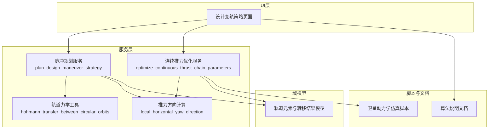
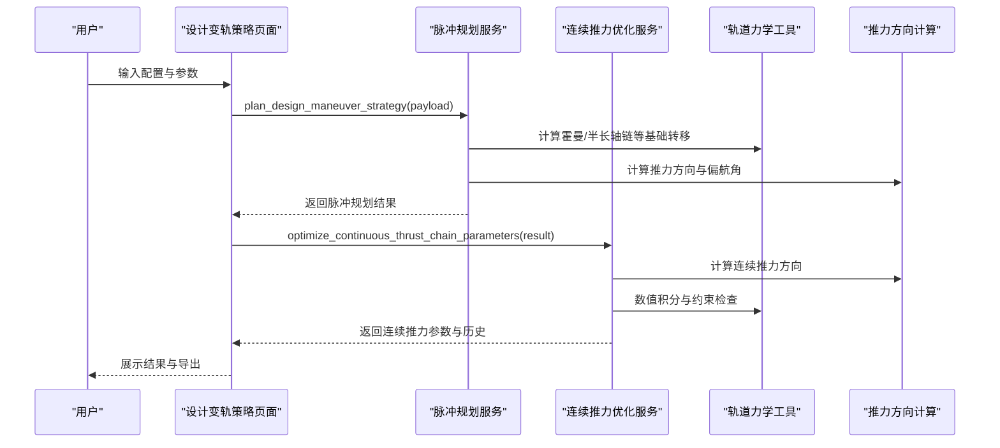
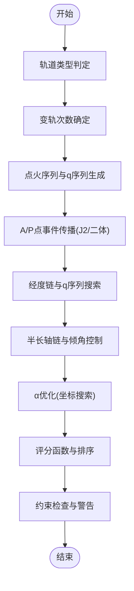
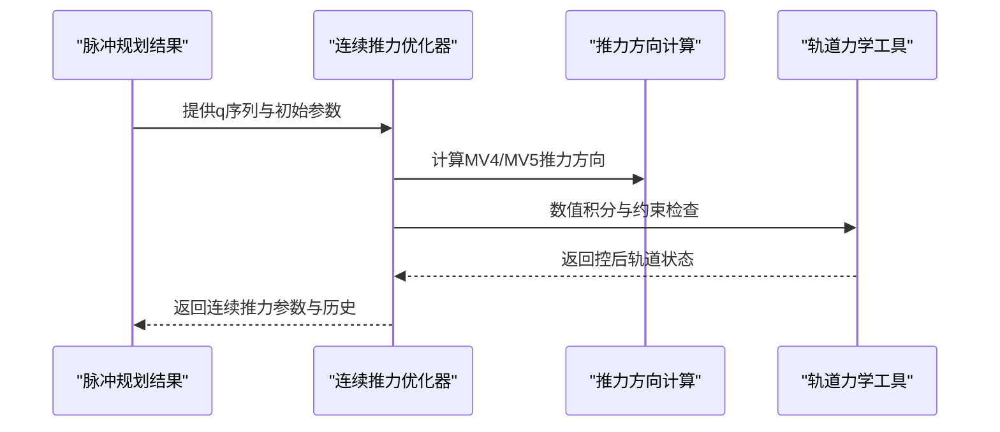
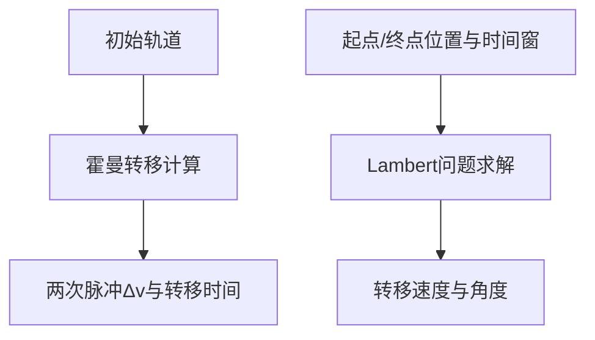
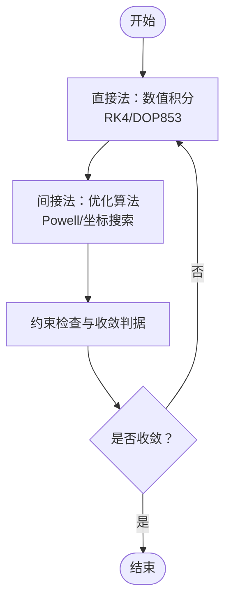
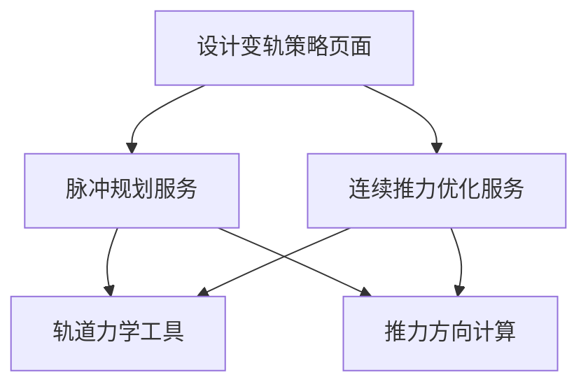

# 变轨设计服务

<cite>
**本文档引用的文件**
- [design_maneuver_strategy.py](file://src/smart/services/design_maneuver_strategy.py)
- [design_continuous_thrust_optimizer.py](file://src/smart/services/design_continuous_thrust_optimizer.py)
- [orbital_mechanics.py](file://src/smart/services/orbital_mechanics.py)
- [thrust_direction.py](file://src/smart/services/thrust_direction.py)
- [models.py](file://src/smart/domain/models.py)
- [design_maneuver_strategy_page.py](file://src/smart/ui/widgets/design_maneuver_strategy_page.py)
- [design_maneuver_pulse_planning_algorithm.md](file://doc/design_maneuver_pulse_planning_algorithm.md)
- [design_continuous_thrust_parameter_optimization_algorithm.md](file://doc/design_continuous_thrust_parameter_optimization_algorithm.md)
- [design_maneuver_results.json](file://projects/F4/data/design_maneuver_results.json)
- [design_continuous_thrust_results.json](file://projects/F4/data/design_continuous_thrust_results.json)
- [satellite_dynamics_equation.py](file://scripts/satellite_dynamics_equation.py)
</cite>

## 目录
1. [简介](#简介)
2. [项目结构](#项目结构)
3. [核心组件](#核心组件)
4. [架构概览](#架构概览)
5. [详细组件分析](#详细组件分析)
6. [依赖关系分析](#依赖关系分析)
7. [性能考量](#性能考量)
8. [故障排查指南](#故障排查指南)
9. [结论](#结论)
10. [附录](#附录)

## 简介
本文件面向变轨设计服务的使用者与开发者，系统阐述脉冲变轨策略设计的数学模型与优化算法，涵盖霍曼转移、双椭圆转移等经典轨道机动方法，以及连续推力优化器的数值求解策略（直接法与间接法）。文档还详细说明了变轨参数约束条件、目标函数定义与收敛判据，优化算法的初始化策略、迭代过程与结果验证机制，并提供工程实践案例与参数调优技巧，以及可视化分析与结果评估方法。

## 项目结构
本项目采用模块化架构，围绕变轨设计服务的核心功能组织代码：
- 服务层：提供脉冲规划与连续推力优化算法实现
- 域模型：定义轨道根数、转移结果等数据结构
- UI层：提供交互界面与结果展示
- 文档与示例：提供算法说明与工程案例

图表来源
- [design_maneuver_strategy.py:535-672](file://src/smart/services/design_maneuver_strategy.py#L535-L672)
- [design_continuous_thrust_optimizer.py:44-200](file://src/smart/services/design_continuous_thrust_optimizer.py#L44-L200)
- [orbital_mechanics.py:359-411](file://src/smart/services/orbital_mechanics.py#L359-L411)
- [thrust_direction.py:8-37](file://src/smart/services/thrust_direction.py#L8-L37)
- [models.py:17-255](file://src/smart/domain/models.py#L17-L255)
- [design_maneuver_strategy_page.py:120-200](file://src/smart/ui/widgets/design_maneuver_strategy_page.py#L120-L200)

章节来源
- [design_maneuver_strategy.py:1-120](file://src/smart/services/design_maneuver_strategy.py#L1-L120)
- [design_continuous_thrust_optimizer.py:1-40](file://src/smart/services/design_continuous_thrust_optimizer.py#L1-L40)
- [orbital_mechanics.py:1-40](file://src/smart/services/orbital_mechanics.py#L1-L40)
- [thrust_direction.py:1-20](file://src/smart/services/thrust_direction.py#L1-L20)
- [models.py:1-40](file://src/smart/domain/models.py#L1-L40)
- [design_maneuver_strategy_page.py:1-40](file://src/smart/ui/widgets/design_maneuver_strategy_page.py#L1-L40)

## 核心组件
- 脉冲规划服务：负责超同步与标准转移的多次A/P点火策略生成，包含硬约束相位搜索、半长轴链控制、倾角与经度控制、α（偏航角）优化与推进剂消耗最小化。
- 连续推力优化服务：基于脉冲规划结果，对前3次远地点点火采用固定链路优化，对MV4/MV5进行联合优化，确保终端经度与倾角满足约束，同时最小化推进剂消耗。
- 轨道力学工具：提供霍曼转移、拉格朗日Lambert问题求解、两体传播与J2摄动传播等基础能力。
- 推力方向计算：提供局部水平坐标系下的推力方向计算，支持常值偏航角。
- 域模型：定义轨道元素、转移结果、轨道轨迹等数据结构，支撑前后端数据交换。

章节来源
- [design_maneuver_strategy.py:535-672](file://src/smart/services/design_maneuver_strategy.py#L535-L672)
- [design_continuous_thrust_optimizer.py:44-200](file://src/smart/services/design_continuous_thrust_optimizer.py#L44-L200)
- [orbital_mechanics.py:359-411](file://src/smart/services/orbital_mechanics.py#L359-L411)
- [thrust_direction.py:8-37](file://src/smart/services/thrust_direction.py#L8-L37)
- [models.py:17-255](file://src/smart/domain/models.py#L17-L255)

## 架构概览
系统采用分层架构，UI层通过服务层接口调用算法模块，服务层内部协调轨道力学与推力方向计算，最终输出脉冲规划与连续推力参数结果。UI层负责配置输入、结果显示与导出。

图表来源
- [design_maneuver_strategy_page.py:120-200](file://src/smart/ui/widgets/design_maneuver_strategy_page.py#L120-L200)
- [design_maneuver_strategy.py:535-672](file://src/smart/services/design_maneuver_strategy.py#L535-L672)
- [design_continuous_thrust_optimizer.py:44-200](file://src/smart/services/design_continuous_thrust_optimizer.py#L44-L200)
- [orbital_mechanics.py:359-411](file://src/smart/services/orbital_mechanics.py#L359-L411)
- [thrust_direction.py:8-37](file://src/smart/services/thrust_direction.py#L8-L37)

## 详细组件分析

### 脉冲变轨策略设计
脉冲规划服务实现了超同步转移（V5.1硬约束相位搜索）与标准转移的自动化策略生成。其核心流程包括：
- 轨道类型判定：根据初始远地点半径与目标同步轨道高度判断轨道类型。
- 变轨次数确定：基于总Δv与单次设计Δv估算推荐次数，并结合工程下限与用户指定次数确定实际次数。
- 点火序列与q序列：默认超同步转移采用n_apogee_plus_1_perigee模式，标准转移采用多次远地点点火。
- A/P点事件传播：在启用J2时使用数值积分传播，在未启用J2时回退为二体解析传播。
- 经度链与q序列：通过q控制回归圈数，搜索满足经度窗口的A/P点事件。
- 半长轴链与倾角控制：固定前段控后近地点高度，后续通过α优化减少推进剂消耗。
- 评分函数与优化目标：优先满足约束，再最小化推进剂消耗，最后考虑均匀性与最大点火时长。

图表来源
- [design_maneuver_strategy.py:535-672](file://src/smart/services/design_maneuver_strategy.py#L535-L672)
- [design_maneuver_pulse_planning_algorithm.md:116-147](file://doc/design_maneuver_pulse_planning_algorithm.md#L116-L147)

章节来源
- [design_maneuver_strategy.py:535-672](file://src/smart/services/design_maneuver_strategy.py#L535-L672)
- [design_maneuver_pulse_planning_algorithm.md:1-741](file://doc/design_maneuver_pulse_planning_algorithm.md#L1-L741)

### 连续推力优化器
连续推力优化器基于脉冲规划结果，对前3次远地点点火采用固定链路优化，对MV4/MV5进行联合优化。其核心策略包括：
- MV1-MV3：继承脉冲规划的事件、时长与偏航角，积分到对应控后近地点目标。
- MV4：通过点火开始时间与偏航角联合优化，确保终端经度闭合与倾角控制。
- MV5：必须保持在近地点附近，最小化控后偏心率，同时满足半长轴目标。
- 约束与目标函数：严格满足控后近地点高度、倾角、半长轴与经度约束，最小化推进剂消耗。

图表来源
- [design_continuous_thrust_optimizer.py:44-200](file://src/smart/services/design_continuous_thrust_optimizer.py#L44-L200)
- [design_continuous_thrust_parameter_optimization_algorithm.md:221-248](file://doc/design_continuous_thrust_parameter_optimization_algorithm.md#L221-L248)

章节来源
- [design_continuous_thrust_optimizer.py:44-200](file://src/smart/services/design_continuous_thrust_optimizer.py#L44-L200)
- [design_continuous_thrust_parameter_optimization_algorithm.md:1-375](file://doc/design_continuous_thrust_parameter_optimization_algorithm.md#L1-L375)

### 经典轨道机动方法
系统提供了霍曼转移与拉格朗日Lambert问题求解等经典轨道机动方法的基础能力：
- 霍曼转移：计算两次脉冲所需的Δv与转移时间，适用于圆形轨道间的转移。
- 拉格朗日Lambert：在给定时间窗内求解两位置间的转移轨道，支持长短路径选择。

图表来源
- [orbital_mechanics.py:359-411](file://src/smart/services/orbital_mechanics.py#L359-L411)
- [orbital_mechanics.py:555-620](file://src/smart/services/orbital_mechanics.py#L555-L620)

章节来源
- [orbital_mechanics.py:359-411](file://src/smart/services/orbital_mechanics.py#L359-L411)
- [orbital_mechanics.py:555-620](file://src/smart/services/orbital_mechanics.py#L555-L620)

### 数值求解策略（直接法与间接法）
系统在不同层面采用了直接法与间接法相结合的策略：
- 直接法（数值积分）：在脉冲规划与连续推力优化中广泛使用，通过RK4或DOP853等数值积分器求解常微分方程，确保轨道状态的精确传播与约束满足。
- 间接法（优化算法）：在脉冲规划中使用Powell等优化算法进行坐标搜索与多起点优化，以最小化推进剂消耗并满足约束。

图表来源
- [design_maneuver_strategy.py:5664-5704](file://src/smart/services/design_maneuver_strategy.py#L5664-L5704)
- [design_maneuver_strategy.py:4080-4101](file://src/smart/services/design_maneuver_strategy.py#L4080-L4101)

章节来源
- [design_maneuver_strategy.py:5664-5704](file://src/smart/services/design_maneuver_strategy.py#L5664-L5704)
- [design_maneuver_strategy.py:4080-4101](file://src/smart/services/design_maneuver_strategy.py#L4080-L4101)

### 变轨参数约束条件、目标函数与收敛判据
- 约束条件：包括点火经度窗口、最大总点火时长、终端半长轴/偏心率/倾角/经度误差、推进剂消耗等。
- 目标函数：在满足硬约束的前提下，最小化总推进剂消耗；在脉冲规划中，评分函数综合考虑约束违反程度、推进剂消耗、最大点火时长与速度增量离散度。
- 收敛判据：在优化过程中，通过目标函数值与约束误差的阈值判断收敛；在连续推力优化中，通过MV4/MV5的经度、倾角与偏心率约束判断可行性。

章节来源
- [design_maneuver_pulse_planning_algorithm.md:461-518](file://doc/design_maneuver_pulse_planning_algorithm.md#L461-L518)
- [design_continuous_thrust_parameter_optimization_algorithm.md:179-220](file://doc/design_continuous_thrust_parameter_optimization_algorithm.md#L179-L220)

### 初始化策略、迭代过程与结果验证
- 初始化策略：脉冲规划采用预筛选与多起点策略，连续推力优化采用脉冲规划结果作为初始种子。
- 迭代过程：脉冲规划通过Powell优化与坐标搜索逐步改进；连续推力优化通过网格搜索与精细搜索相结合。
- 结果验证：通过约束检查与历史导出验证结果的可行性与一致性。

章节来源
- [design_maneuver_strategy.py:4080-4101](file://src/smart/services/design_maneuver_strategy.py#L4080-L4101)
- [design_continuous_thrust_optimizer.py:343-368](file://src/smart/services/design_continuous_thrust_optimizer.py#L343-L368)

### 工程实践案例与参数调优技巧
- 案例：F4项目中的超同步转移任务，展示了从脉冲规划到连续推力优化的完整流程与结果。
- 参数调优：通过调整q序列、α范围、终端容差与推进剂消耗权重，平衡推进剂与约束满足的关系。

章节来源
- [design_maneuver_results.json:1-547](file://projects/F4/data/design_maneuver_results.json#L1-L547)
- [design_continuous_thrust_results.json:1-174](file://projects/F4/data/design_continuous_thrust_results.json#L1-L174)

### 可视化分析与结果评估
- 可视化：通过UI页面展示脉冲规划与连续推力参数，支持CSV导出与Excel导出。
- 结果评估：通过终端误差、推进剂消耗、点火时长与约束检查等指标评估方案质量。

章节来源
- [design_maneuver_strategy_page.py:120-200](file://src/smart/ui/widgets/design_maneuver_strategy_page.py#L120-L200)
- [design_maneuver_strategy.py:710-740](file://src/smart/services/design_maneuver_strategy.py#L710-L740)

## 依赖关系分析
服务层组件之间的依赖关系如下：
- 脉冲规划服务依赖轨道力学工具与推力方向计算。
- 连续推力优化服务依赖推力方向计算与轨道力学工具。
- UI层通过服务层接口访问算法能力。

图表来源
- [design_maneuver_strategy.py:535-672](file://src/smart/services/design_maneuver_strategy.py#L535-L672)
- [design_continuous_thrust_optimizer.py:44-200](file://src/smart/services/design_continuous_thrust_optimizer.py#L44-L200)
- [thrust_direction.py:8-37](file://src/smart/services/thrust_direction.py#L8-L37)
- [orbital_mechanics.py:359-411](file://src/smart/services/orbital_mechanics.py#L359-L411)
- [design_maneuver_strategy_page.py:120-200](file://src/smart/ui/widgets/design_maneuver_strategy_page.py#L120-L200)

章节来源
- [design_maneuver_strategy.py:535-672](file://src/smart/services/design_maneuver_strategy.py#L535-L672)
- [design_continuous_thrust_optimizer.py:44-200](file://src/smart/services/design_continuous_thrust_optimizer.py#L44-L200)
- [thrust_direction.py:8-37](file://src/smart/services/thrust_direction.py#L8-L37)
- [orbital_mechanics.py:359-411](file://src/smart/services/orbital_mechanics.py#L359-L411)
- [design_maneuver_strategy_page.py:120-200](file://src/smart/ui/widgets/design_maneuver_strategy_page.py#L120-L200)

## 性能考量
- 数值积分步长：在脉冲规划中使用较大的步长（如120s），在连续推力优化中使用较小的步长（如10s）以提高精度。
- 优化算法：在脉冲规划中使用Powell优化与坐标搜索，在连续推力优化中使用网格搜索与精细搜索相结合。
- 约束检查：通过严格的硬约束检查与软约束权重，平衡推进剂消耗与约束满足。

## 故障排查指南
- 约束违反：检查终端经度、倾角、半长轴与偏心率误差是否超出容差。
- 点火时长超限：调整q序列与α范围，减少单次点火时长。
- 推进剂消耗过高：优化q序列与α，降低推进剂消耗权重，或放宽部分软约束。
- 数值积分失败：检查积分步长与终止条件，适当减小步长或增加迭代上限。

章节来源
- [design_maneuver_pulse_planning_algorithm.md:720-741](file://doc/design_maneuver_pulse_planning_algorithm.md#L720-L741)
- [design_continuous_thrust_parameter_optimization_algorithm.md:369-375](file://doc/design_continuous_thrust_parameter_optimization_algorithm.md#L369-L375)

## 结论
本变轨设计服务通过脉冲规划与连续推力优化相结合的方式，实现了从经典轨道机动到现代连续推力策略的全链条覆盖。系统在保证工程实用性的基础上，提供了灵活的参数配置、严格的约束检查与完善的可视化分析能力，能够满足复杂轨道任务的设计需求。

## 附录
- 算法说明文档：提供了详细的脉冲规划与连续推力优化算法说明，便于深入理解与扩展。
- 工程案例：F4项目展示了完整的任务执行流程与结果，可作为参数调优与验证的参考。

章节来源
- [design_maneuver_pulse_planning_algorithm.md:1-741](file://doc/design_maneuver_pulse_planning_algorithm.md#L1-L741)
- [design_continuous_thrust_parameter_optimization_algorithm.md:1-375](file://doc/design_continuous_thrust_parameter_optimization_algorithm.md#L1-L375)
- [design_maneuver_results.json:1-547](file://projects/F4/data/design_maneuver_results.json#L1-L547)
- [design_continuous_thrust_results.json:1-174](file://projects/F4/data/design_continuous_thrust_results.json#L1-L174)