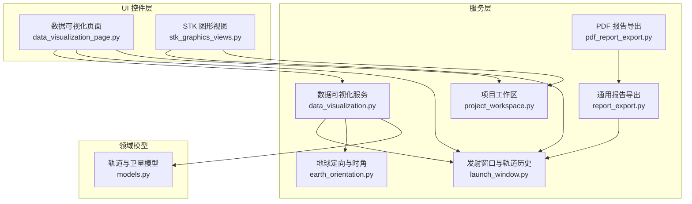
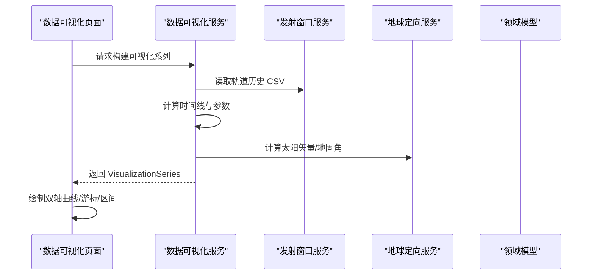
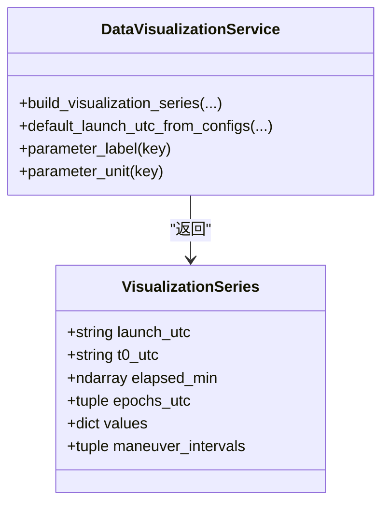
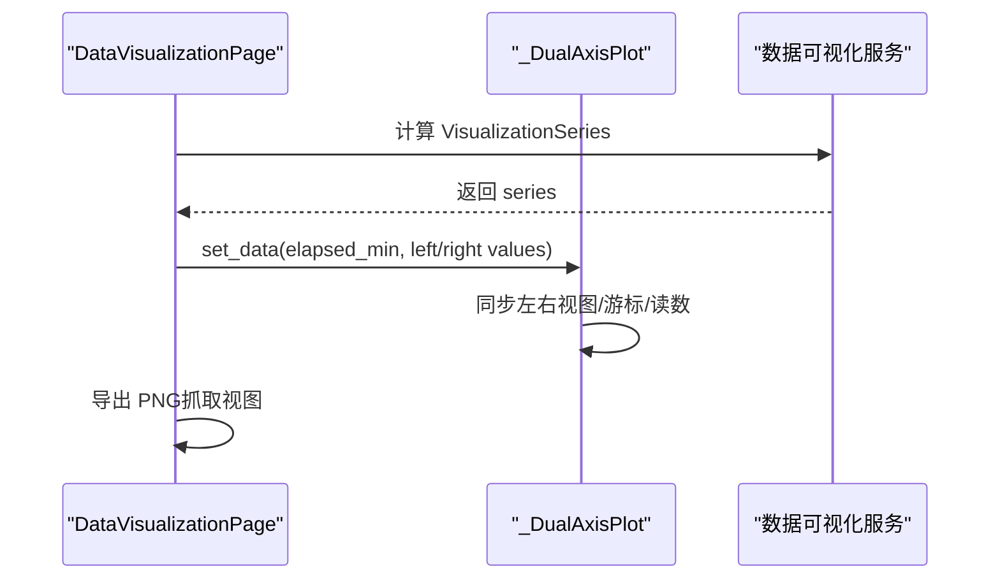
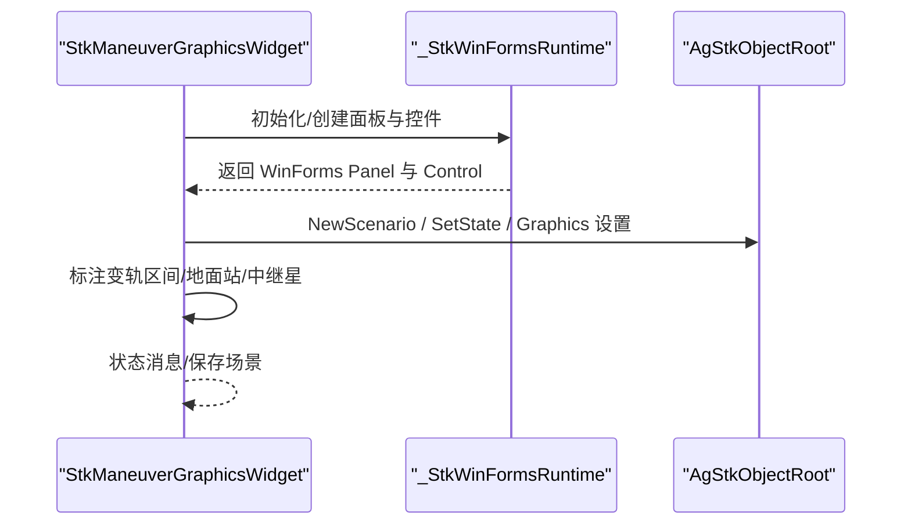
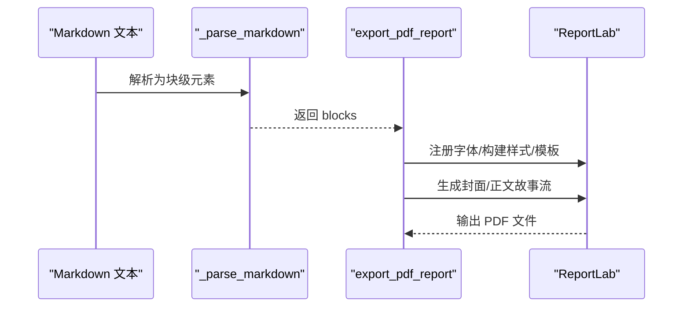
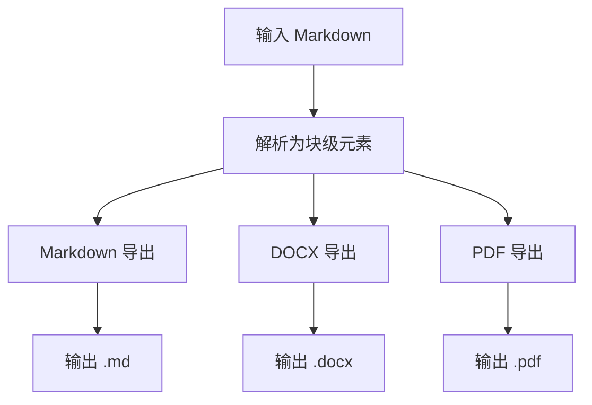
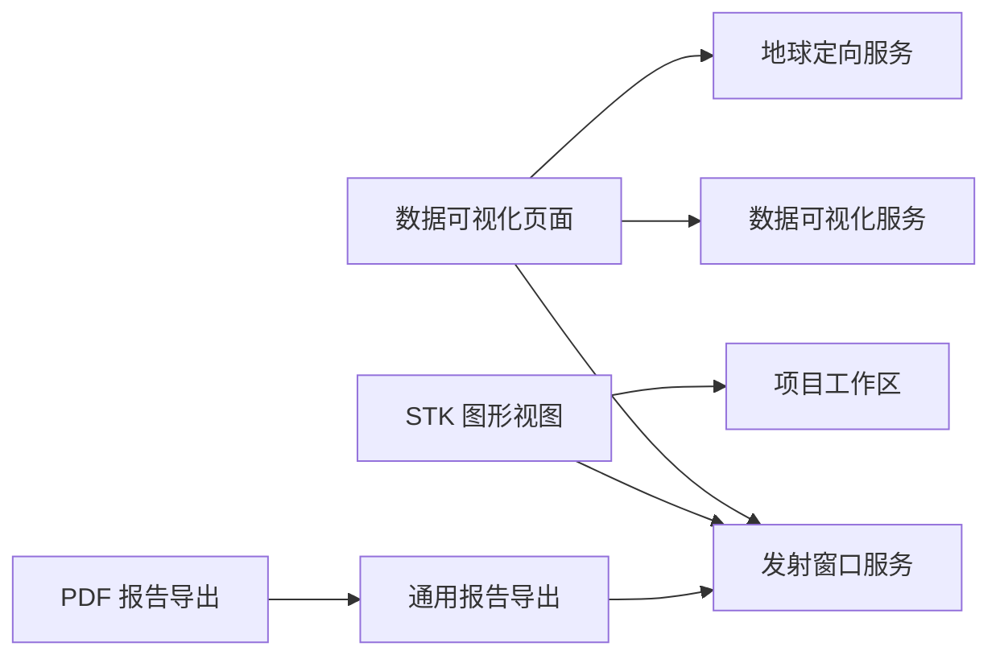

# 可视化与数据服务

<cite>
**本文引用的文件列表**
- [data_visualization.py](file://src/smart/services/data_visualization.py)
- [pdf_report_export.py](file://src/smart/services/pdf_report_export.py)
- [report_export.py](file://src/smart/services/report_export.py)
- [data_visualization_page.py](file://src/smart/ui/widgets/data_visualization_page.py)
- [stk_graphics_views.py](file://src/smart/ui/widgets/stk_graphics_views.py)
- [project_workspace.py](file://src/smart/services/project_workspace.py)
- [models.py](file://src/smart/domain/models.py)
- [launch_window.py](file://src/smart/services/launch_window.py)
- [earth_orientation.py](file://src/smart/services/earth_orientation.py)
- [test_data_visualization.py](file://tests/test_data_visualization.py)
- [test_pdf_report_export.py](file://tests/test_pdf_report_export.py)
- [README.md](file://README.md)
</cite>

## 目录
1. [简介](#简介)
2. [项目结构](#项目结构)
3. [核心组件](#核心组件)
4. [架构总览](#架构总览)
5. [详细组件分析](#详细组件分析)
6. [依赖关系分析](#依赖关系分析)
7. [性能考虑](#性能考虑)
8. [故障排查指南](#故障排查指南)
9. [结论](#结论)
10. [附录](#附录)

## 简介
本技术文档聚焦于 SMART 项目的可视化与数据服务，涵盖：
- 2D/3D 图形渲染与交互式图表
- 轨迹与轨道参数曲线展示
- PDF 报告生成（模板定制、内容填充、格式化输出）
- 通用报告导出服务（Markdown/DOCX/PDF）
- 性能优化策略（大数据集处理、GPU 加速、内存管理）
- 自定义图表与报告模板开发指南
- 数据服务 API 与扩展机制

## 项目结构
SMART 采用分层架构：UI 控件层负责交互与可视化，服务层提供数值计算与数据导出，领域模型承载轨道与卫星状态等业务实体。项目通过项目工作区统一管理配置、数据与图表输出路径。

**图表来源**
- [data_visualization_page.py:282-653](file://src/smart/ui/widgets/data_visualization_page.py#L282-L653)
- [stk_graphics_views.py:256-761](file://src/smart/ui/widgets/stk_graphics_views.py#L256-L761)
- [data_visualization.py:49-128](file://src/smart/services/data_visualization.py#L49-L128)
- [pdf_report_export.py:81-156](file://src/smart/services/pdf_report_export.py#L81-L156)
- [report_export.py:22-124](file://src/smart/services/report_export.py#L22-L124)
- [launch_window.py:542-563](file://src/smart/services/launch_window.py#L542-L563)
- [earth_orientation.py:28-47](file://src/smart/services/earth_orientation.py#L28-L47)
- [project_workspace.py:64-117](file://src/smart/services/project_workspace.py#L64-L117)
- [models.py:17-28](file://src/smart/domain/models.py#L17-L28)

**章节来源**
- [README.md:1-204](file://README.md#L1-L204)

## 核心组件
- 数据可视化服务：从轨道历史 CSV 与变轨策略构建可视化系列，计算轨道参数、Beta 角、地球-太阳夹角等，并生成时间线与区间。
- 2D 图表页面：基于 pyqtgraph 提供双轴曲线、联动缩放、游标读数、变轨区间高亮与导出 PNG。
- 3D/2D STK 图形视图：嵌入 STK 11.6 WinForms 控件，动态加载卫星轨迹、标注变轨区间与地面站/中继星可视性。
- 报告导出服务：Markdown 解析与渲染，支持 DOCX 与 PDF 输出，内置样式与封面模板。
- 项目工作区：统一管理项目目录、配置文件、数据 CSV 与图表输出路径。

**章节来源**
- [data_visualization.py:49-128](file://src/smart/services/data_visualization.py#L49-L128)
- [data_visualization_page.py:282-653](file://src/smart/ui/widgets/data_visualization_page.py#L282-L653)
- [stk_graphics_views.py:256-761](file://src/smart/ui/widgets/stk_graphics_views.py#L256-L761)
- [pdf_report_export.py:81-156](file://src/smart/services/pdf_report_export.py#L81-L156)
- [report_export.py:22-124](file://src/smart/services/report_export.py#L22-L124)
- [project_workspace.py:64-117](file://src/smart/services/project_workspace.py#L64-L117)

## 架构总览
可视化与数据服务的整体流程如下：
- 输入：轨道历史 CSV、变轨策略、发射时间、项目配置
- 处理：构建时间线、计算轨道参数与几何指标、解析 Markdown 报告
- 输出：2D 曲线图、3D/2D STK 轨迹视图、PDF/DOCX 报告

**图表来源**
- [data_visualization_page.py:346-373](file://src/smart/ui/widgets/data_visualization_page.py#L346-L373)
- [data_visualization.py:49-128](file://src/smart/services/data_visualization.py#L49-L128)
- [launch_window.py:542-563](file://src/smart/services/launch_window.py#L542-L563)
- [earth_orientation.py:50-59](file://src/smart/services/earth_orientation.py#L50-L59)

## 详细组件分析

### 数据可视化服务
- 功能要点
  - 从 CSV 与变轨策略构建时间线，派生半长轴、偏心率、倾角、升交点赤经、近地点幅角、真/平/偏近点角、星下点经纬度、近/远地点高度、质量、Beta 角、地球-太阳夹角等。
  - 支持默认发射时间推导，兼容飞行程序与变轨策略配置。
- 数据结构
  - VisualizationSeries：包含发射时间、T0 时间、时间序列、参数值字典、变轨区间元组。
- 性能特性
  - 使用 NumPy 向量化计算，避免 Python 循环；对三角函数与向量归一化进行数值稳定处理。

**图表来源**
- [data_visualization.py:39-107](file://src/smart/services/data_visualization.py#L39-L107)

**章节来源**
- [data_visualization.py:49-128](file://src/smart/services/data_visualization.py#L49-L128)

### 2D 图表页面（pyqtgraph）
- 功能要点
  - 双轴 PlotWidget，左右参数可独立选择；联动 X 轴缩放；游标移动触发读数与文本标注；支持变轨区间高亮；支持导出 PNG。
  - 参数单位与标签映射来自服务层，确保一致性。
- 交互细节
  - 左右视图同步、鼠标点击重置视图、读数文本锚定与颜色区分。
- 导出能力
  - 将当前视图抓取为 PNG 文件，便于报告插入。

**图表来源**
- [data_visualization_page.py:44-280](file://src/smart/ui/widgets/data_visualization_page.py#L44-L280)
- [data_visualization_page.py:444-460](file://src/smart/ui/widgets/data_visualization_page.py#L444-L460)

**章节来源**
- [data_visualization_page.py:282-653](file://src/smart/ui/widgets/data_visualization_page.py#L282-L653)

### 3D/2D STK 图形视图（WinForms + STK 11.6）
- 功能要点
  - 在 QWindow 容器中嵌入 STK 2D/3D 控件，动态加载卫星轨迹、设置轨道/地面轨迹颜色与样式、标注变轨区间与地面站/中继星可视性。
  - 提供场景保存、状态消息与错误提示。
- 运行条件
  - 仅在 Windows 上可用，依赖 STK 11.6 与 .NET 运行时；若不可用则显示占位信息。
- 交互与性能
  - 通过命令接口控制 STK 对象模型，避免频繁刷新；隐藏 Logo 覆盖层提升画面整洁度。

**图表来源**
- [stk_graphics_views.py:32-195](file://src/smart/ui/widgets/stk_graphics_views.py#L32-L195)
- [stk_graphics_views.py:256-761](file://src/smart/ui/widgets/stk_graphics_views.py#L256-L761)

**章节来源**
- [stk_graphics_views.py:256-761](file://src/smart/ui/widgets/stk_graphics_views.py#L256-L761)

### PDF 报告导出（基于 ReportLab）
- 功能要点
  - 将 Markdown 解析为块级元素，渲染为带封面与正文的 PDF，支持标题、列表、表格、代码块、强调框等。
  - 内置样式与配色方案，支持中文字体注册与回退。
- 流程
  - 解析 Markdown → 构建样式 → 定义封面/正文模板 → 生成故事流 → 构建 PDF 文档。
- 扩展点
  - 可通过修改样式字典与模板实现主题定制；表格列宽与样式可通过权重与 TableStyle 配置。

**图表来源**
- [pdf_report_export.py:81-156](file://src/smart/services/pdf_report_export.py#L81-L156)
- [report_export.py:43-124](file://src/smart/services/report_export.py#L43-L124)

**章节来源**
- [pdf_report_export.py:81-156](file://src/smart/services/pdf_report_export.py#L81-L156)
- [report_export.py:22-124](file://src/smart/services/report_export.py#L22-L124)

### 通用报告导出服务（Markdown/DOCX/PDF）
- Markdown 导出：直接写入纯文本。
- DOCX 导出：解析 Markdown 为 Word XML，打包为 .docx，包含样式与表格。
- PDF 导出：复用 Markdown 解析逻辑，使用 ReportLab 渲染为 PDF。
- 扩展机制：新增导出格式只需实现解析与渲染逻辑，并在导出入口注册。

**图表来源**
- [report_export.py:22-124](file://src/smart/services/report_export.py#L22-L124)
- [pdf_report_export.py:81-156](file://src/smart/services/pdf_report_export.py#L81-L156)

**章节来源**
- [report_export.py:22-124](file://src/smart/services/report_export.py#L22-L124)
- [pdf_report_export.py:81-156](file://src/smart/services/pdf_report_export.py#L81-L156)

## 依赖关系分析
- 服务层依赖
  - 数据可视化服务依赖发射窗口服务（读取轨道历史 CSV）、地球定向服务（太阳矢量/地固角）、领域模型（轨道参数）。
  - STK 图形视图依赖发射窗口服务（生成 STK 轨迹文件）与项目工作区（场景命名与保存路径）。
  - 报告导出服务依赖通用解析器与 ReportLab。
- UI 层耦合
  - 2D 页面与服务层松耦合，通过 VisualizationSeries 传递数据；3D 页面与 STK 运行时强耦合，需在 Windows 环境启用。

**图表来源**
- [data_visualization_page.py:11-24](file://src/smart/ui/widgets/data_visualization_page.py#L11-L24)
- [stk_graphics_views.py:15-16](file://src/smart/ui/widgets/stk_graphics_views.py#L15-L16)
- [pdf_report_export.py:45-46](file://src/smart/services/pdf_report_export.py#L45-L46)
- [report_export.py:43-46](file://src/smart/services/report_export.py#L43-L46)

**章节来源**
- [data_visualization_page.py:11-24](file://src/smart/ui/widgets/data_visualization_page.py#L11-L24)
- [stk_graphics_views.py:15-16](file://src/smart/ui/widgets/stk_graphics_views.py#L15-L16)
- [pdf_report_export.py:45-46](file://src/smart/services/pdf_report_export.py#L45-L46)
- [report_export.py:43-46](file://src/smart/services/report_export.py#L43-L46)

## 性能考虑
- 大数据集处理
  - 使用 NumPy 向量化计算轨道参数与几何指标，避免逐元素循环；对数组进行类型与精度统一，减少内存碎片。
  - 在 2D 图表中，仅在必要时更新曲线数据与读数文本，避免频繁重绘。
- GPU 加速
  - 3D 视图通过 pyqtgraph OpenGL 渲染，建议在支持的硬件上启用 GPU；避免在低端设备上同时开启多个高分辨率视图。
- 内存管理
  - 服务层返回的数组与时间线尽量复用，避免重复构造；导出 PDF 时按需构建样式与模板，避免全局缓存过大。
- STK 运行时
  - 通过泵送消息与延迟刷新减少 UI 卡顿；隐藏 Logo 覆盖层避免额外绘制开销。

[本节为通用指导，不直接分析具体文件]

## 故障排查指南
- 2D 图表无数据
  - 检查项目工作区是否正确加载变轨策略与轨道历史 CSV；确认发射时间与火箭飞行时间配置。
- STK 不可用
  - 确认运行平台为 Windows，STK 11.6 与 .NET 运行时可用；查看占位信息中的错误提示。
- PDF 导出异常
  - 检查 Markdown 语法与表格格式；确认中文字体注册成功；若配色无效，将回退到默认强调色。
- 报告导出为空
  - 确认 Markdown 文本非空；DOCX 导出需满足 Word XML 结构完整性。

**章节来源**
- [data_visualization_page.py:346-373](file://src/smart/ui/widgets/data_visualization_page.py#L346-L373)
- [stk_graphics_views.py:32-110](file://src/smart/ui/widgets/stk_graphics_views.py#L32-L110)
- [pdf_report_export.py:158-167](file://src/smart/services/pdf_report_export.py#L158-L167)
- [report_export.py:22-27](file://src/smart/services/report_export.py#L22-L27)

## 结论
SMART 的可视化与数据服务通过清晰的服务层与 UI 层分离，实现了从轨道历史到参数曲线、从 STK 轨迹到 PDF 报告的全链路闭环。服务层以 NumPy 为核心进行高效数值计算，UI 层以 pyqtgraph 与 STK 提供直观的交互体验。报告导出服务支持多种格式，具备良好的可扩展性。未来可在 STK/Astrogator 精化、约束校验与工程验收方面进一步完善。

[本节为总结性内容，不直接分析具体文件]

## 附录

### 自定义图表开发指南
- 2D 曲线
  - 在现有双轴 PlotWidget 基础上添加新参数映射，更新参数标签与单位；通过 set_data 传入新数组即可显示。
  - 若需更高性能，可考虑分段渲染与采样降采样策略。
- 3D 轨迹
  - 使用 STK 图形视图接口设置卫星轨迹颜色、标注与动画；注意在 Windows 环境下启用 STK 运行时。
- 报告模板
  - PDF 模板通过样式字典与 PageTemplate 定义；如需定制封面与页眉页脚，可扩展样式与绘制函数。
  - DOCX 模板通过 Word XML 结构与样式表实现，新增表格样式与段落样式需在样式表中补充。

**章节来源**
- [data_visualization_page.py:44-280](file://src/smart/ui/widgets/data_visualization_page.py#L44-L280)
- [stk_graphics_views.py:474-560](file://src/smart/ui/widgets/stk_graphics_views.py#L474-L560)
- [pdf_report_export.py:184-307](file://src/smart/services/pdf_report_export.py#L184-L307)
- [report_export.py:215-369](file://src/smart/services/report_export.py#L215-L369)

### API 与扩展机制
- 数据可视化服务 API
  - 构建可视化系列：接收轨道历史 CSV、变轨策略、发射时间与火箭飞行时间，返回 VisualizationSeries。
  - 默认发射时间推导：从飞行程序与变轨策略中提取 T0 与发射时间。
  - 参数标签与单位映射：用于 UI 显示与导出。
- 报告导出 API
  - Markdown 导出：直接写入 .md。
  - DOCX 导出：解析为 Word XML 并打包为 .docx。
  - PDF 导出：解析 Markdown，构建样式与模板，输出 .pdf。
- 扩展机制
  - 新增导出格式：实现解析与渲染逻辑，并在导出入口注册。
  - 新增图表：在 UI 层扩展 PlotWidget 或 STK 视图接口。

**章节来源**
- [data_visualization.py:49-128](file://src/smart/services/data_visualization.py#L49-L128)
- [report_export.py:22-124](file://src/smart/services/report_export.py#L22-L124)
- [pdf_report_export.py:81-156](file://src/smart/services/pdf_report_export.py#L81-L156)