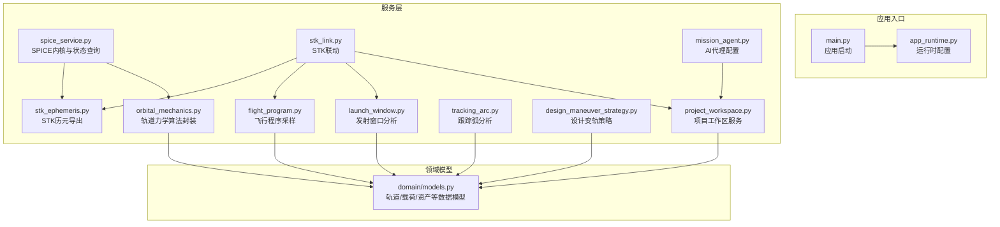
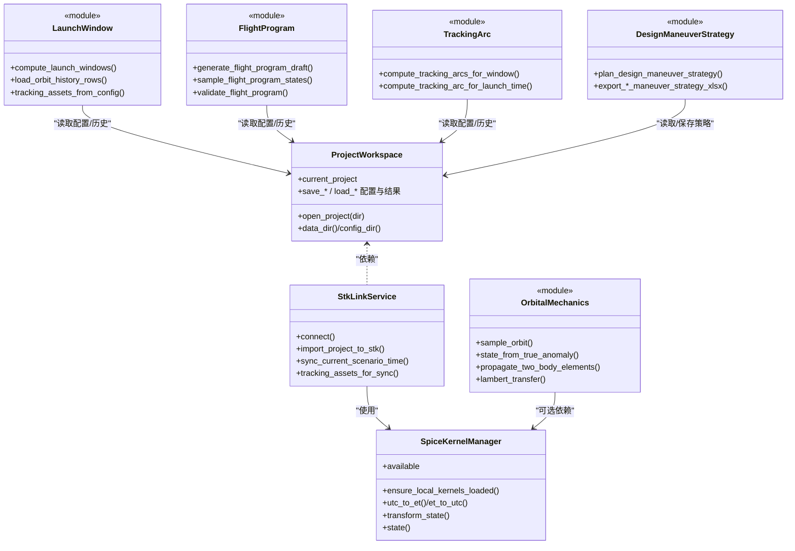
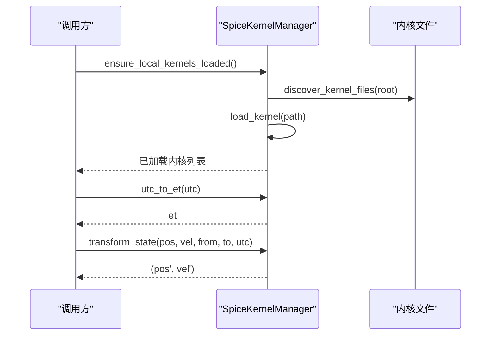
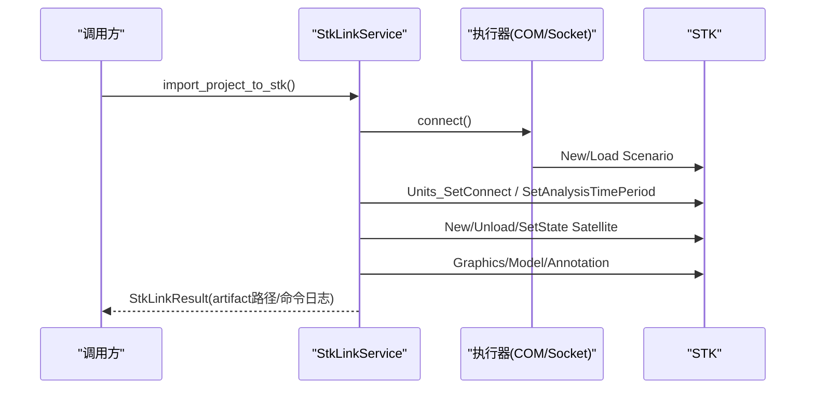
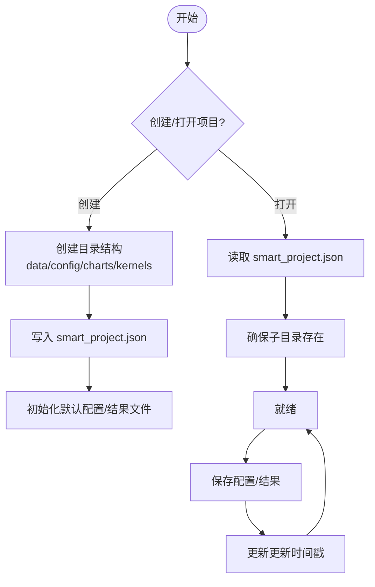
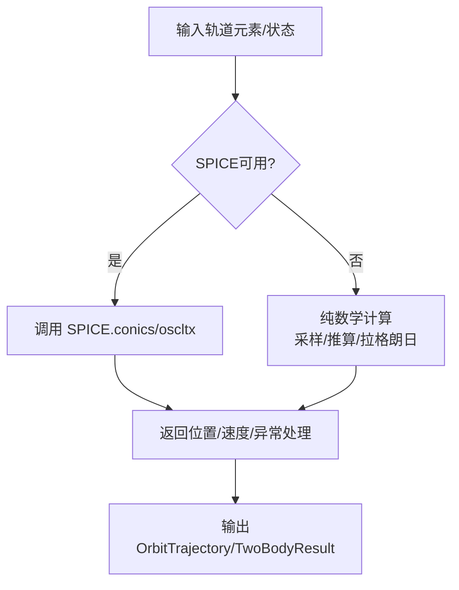
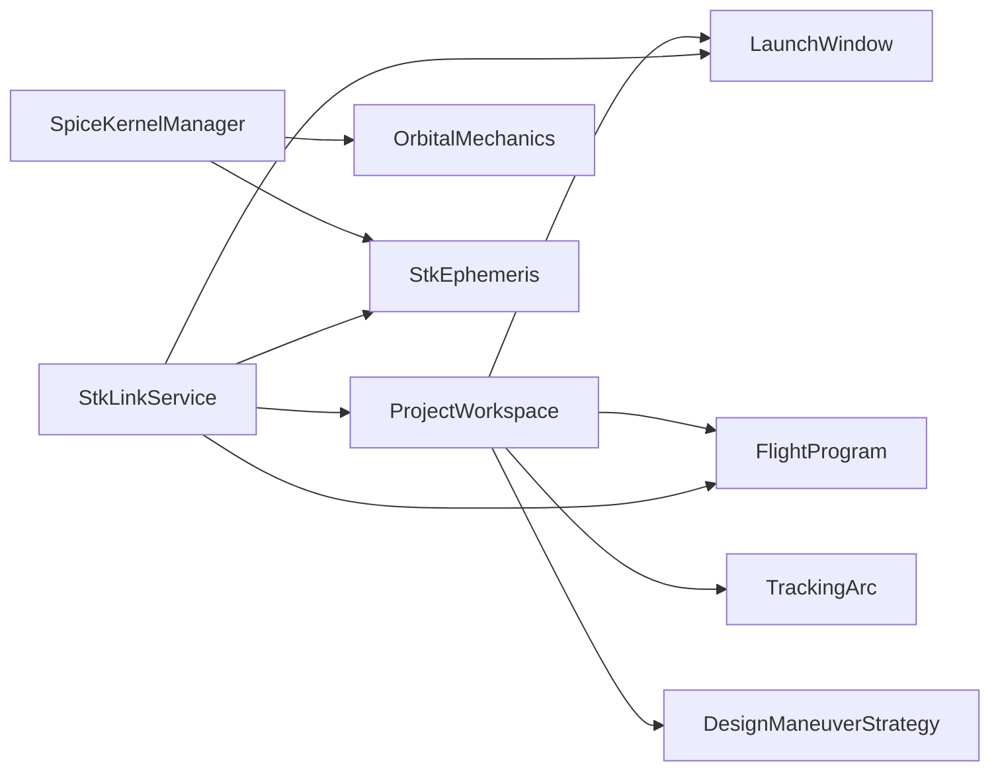

# 服务层架构

<cite>
**本文档引用的文件**
- [src/smart/services/__init__.py](file://src/smart/services/__init__.py)
- [src/smart/app_runtime.py](file://src/smart/app_runtime.py)
- [src/smart/main.py](file://src/smart/main.py)
- [src/smart/domain/models.py](file://src/smart/domain/models.py)
- [src/smart/services/spice_service.py](file://src/smart/services/spice_service.py)
- [src/smart/services/stk_link.py](file://src/smart/services/stk_link.py)
- [src/smart/services/project_workspace.py](file://src/smart/services/project_workspace.py)
- [src/smart/services/orbital_mechanics.py](file://src/smart/services/orbital_mechanics.py)
- [src/smart/services/mission_agent.py](file://src/smart/services/mission_agent.py)
- [src/smart/services/launch_window.py](file://src/smart/services/launch_window.py)
- [src/smart/services/design_maneuver_strategy.py](file://src/smart/services/design_maneuver_strategy.py)
- [src/smart/services/flight_program.py](file://src/smart/services/flight_program.py)
- [src/smart/services/tracking_arc.py](file://src/smart/services/tracking_arc.py)
- [src/smart/services/stk_ephemeris.py](file://src/smart/services/stk_ephemeris.py)
</cite>

## 目录
1. [引言](#引言)
2. [项目结构](#项目结构)
3. [核心组件](#核心组件)
4. [架构总览](#架构总览)
5. [详细组件分析](#详细组件分析)
6. [依赖关系分析](#依赖关系分析)
7. [性能考虑](#性能考虑)
8. [故障排查指南](#故障排查指南)
9. [结论](#结论)
10. [附录](#附录)

## 引言
本文件系统化梳理 SMART 项目的“服务层”架构，聚焦服务层的设计模式与实现策略，阐明各核心服务（SPICE 服务、STK 联动服务、项目工作区服务、轨道力学服务等）的职责边界与协作方式；解释服务的生命周期管理、依赖注入机制与错误处理策略；说明服务间通信与数据传递协议；阐述服务如何封装底层复杂逻辑以简化 UI 层调用；并给出配置管理、缓存策略、性能优化、扩展与自定义最佳实践以及测试与调试建议。

## 项目结构
SMART 的服务层位于 src/smart/services 目录，围绕“项目工作区”组织数据与配置，围绕“SPICE/STK”提供外部系统集成能力，围绕“轨道力学”提供核心算法封装，并通过“飞行程序/发射窗口/跟踪弧”等业务流程服务串联前后端交互。

图表来源
- [src/smart/main.py:10-31](file://src/smart/main.py#L10-L31)
- [src/smart/app_runtime.py:10-90](file://src/smart/app_runtime.py#L10-L90)
- [src/smart/services/project_workspace.py:64-116](file://src/smart/services/project_workspace.py#L64-L116)
- [src/smart/services/spice_service.py:174-305](file://src/smart/services/spice_service.py#L174-L305)
- [src/smart/services/orbital_mechanics.py:24-25](file://src/smart/services/orbital_mechanics.py#L24-L25)
- [src/smart/services/launch_window.py:503-506](file://src/smart/services/launch_window.py#L503-L506)
- [src/smart/services/flight_program.py:334-365](file://src/smart/services/flight_program.py#L334-L365)
- [src/smart/services/tracking_arc.py:123-146](file://src/smart/services/tracking_arc.py#L123-L146)
- [src/smart/services/stk_link.py:199-552](file://src/smart/services/stk_link.py#L199-L552)
- [src/smart/services/stk_ephemeris.py:31-111](file://src/smart/services/stk_ephemeris.py#L31-L111)
- [src/smart/services/mission_agent.py:145-151](file://src/smart/services/mission_agent.py#L145-L151)

章节来源
- [src/smart/main.py:10-31](file://src/smart/main.py#L10-L31)
- [src/smart/app_runtime.py:10-90](file://src/smart/app_runtime.py#L10-L90)

## 核心组件
- SPICE 服务：负责内核加载、时间转换、坐标变换与天体状态查询，为轨道力学与 STK 导出提供底层支持。
- STK 联动服务：封装 COM/Socket 接口，连接或启动 STK，导入轨道/姿态/中继星历，同步场景时间与分析期。
- 项目工作区服务：统一管理项目目录、配置文件、结果文件的读写与版本化更新，提供标准化的 JSON 配置与结果持久化。
- 轨道力学服务：封装开普勒/拉格朗日/两体传播等算法，兼容 SPICE 与纯数学实现，提供鲁棒回退。
- 发射窗口服务：基于轨道历史与约束条件构建时间线，评估阴影、可见性、倾角等约束，输出候选窗口。
- 飞行程序服务：对姿态事件进行采样与验证，结合轨道历史与约束生成/校验飞行计划。
- 跟踪弧服务：在选定发射时刻下，统计地面站/中继星可见性与地影时段，输出分段结果。
- 设计变轨策略服务：提供脉冲/连续推力策略生成、参数化导出与历史记录校验。
- AI 代理服务：提供代理配置、技能清单与帮助工具解析，支撑智能辅助分析。

章节来源
- [src/smart/services/spice_service.py:174-305](file://src/smart/services/spice_service.py#L174-L305)
- [src/smart/services/stk_link.py:199-552](file://src/smart/services/stk_link.py#L199-L552)
- [src/smart/services/project_workspace.py:64-116](file://src/smart/services/project_workspace.py#L64-L116)
- [src/smart/services/orbital_mechanics.py:24-25](file://src/smart/services/orbital_mechanics.py#L24-L25)
- [src/smart/services/launch_window.py:565-619](file://src/smart/services/launch_window.py#L565-L619)
- [src/smart/services/flight_program.py:292-331](file://src/smart/services/flight_program.py#L292-L331)
- [src/smart/services/tracking_arc.py:160-268](file://src/smart/services/tracking_arc.py#L160-L268)
- [src/smart/services/design_maneuver_strategy.py:535-672](file://src/smart/services/design_maneuver_strategy.py#L535-L672)
- [src/smart/services/mission_agent.py:145-239](file://src/smart/services/mission_agent.py#L145-L239)

## 架构总览
服务层采用“领域模型 + 服务编排”的分层设计：
- 领域模型：统一的轨道/载荷/资产等数据结构，确保跨服务一致性。
- 服务编排：工作区服务作为数据中枢，SPICE/STK 作为外部系统接入点，轨道力学与业务分析服务提供算法与流程能力。
- 生命周期：服务实例通常由上层控制器创建与持有，必要时通过单例/全局状态共享（如 SPICE 内核管理器），避免重复初始化。
- 错误处理：对可恢复异常提供回退路径（如 SPICE 不可用时走纯数学实现），对不可恢复异常抛出语义化错误类型。

图表来源
- [src/smart/services/project_workspace.py:64-116](file://src/smart/services/project_workspace.py#L64-L116)
- [src/smart/services/spice_service.py:174-305](file://src/smart/services/spice_service.py#L174-L305)
- [src/smart/services/stk_link.py:199-552](file://src/smart/services/stk_link.py#L199-L552)
- [src/smart/services/orbital_mechanics.py:24-25](file://src/smart/services/orbital_mechanics.py#L24-L25)
- [src/smart/services/launch_window.py:565-619](file://src/smart/services/launch_window.py#L565-L619)
- [src/smart/services/flight_program.py:144-226](file://src/smart/services/flight_program.py#L144-L226)
- [src/smart/services/tracking_arc.py:66-92](file://src/smart/services/tracking_arc.py#L66-L92)
- [src/smart/services/design_maneuver_strategy.py:535-672](file://src/smart/services/design_maneuver_strategy.py#L535-L672)

## 详细组件分析

### SPICE 服务（spice_service）
- 职责：内核发现与加载、时间转换（UTC↔ET）、坐标变换（J2000/ITRF93 等）、天体状态查询。
- 关键点：
  - 可选依赖：若未安装 SpiceyPy，则提供降级提示与错误类型。
  - 内核管理：自动扫描本地内核目录，去重加载，支持清理与重新加载。
  - 时间与变换：提供 UTC/ET 互转与旋转矩阵/状态变换。
- 与 STK/轨道力学协作：为 STK 导出历元与姿态提供时间基准，为轨道采样提供数值稳定性回退。

图表来源
- [src/smart/services/spice_service.py:205-244](file://src/smart/services/spice_service.py#L205-L244)
- [src/smart/services/spice_service.py:251-285](file://src/smart/services/spice_service.py#L251-L285)

章节来源
- [src/smart/services/spice_service.py:174-305](file://src/smart/services/spice_service.py#L174-L305)

### STK 联动服务（stk_link）
- 职责：连接/启动 STK，创建/切换场景，导入轨道/姿态/中继星历，同步动画时间与分析期。
- 关键点：
  - 执行器抽象：COM 与 Socket 两种执行器，自动探测可用路径。
  - 场景建立：标记场景已建立，避免重复初始化。
  - 导入流程：统一单位、设置分析期、导入卫星/地面站/中继星、标注事件注释、导出姿态与历元。
- 与工作区协作：从工作区读取策略/配置，写入 STK 输出目录。

图表来源
- [src/smart/services/stk_link.py:218-337](file://src/smart/services/stk_link.py#L218-L337)
- [src/smart/services/stk_link.py:492-495](file://src/smart/services/stk_link.py#L492-L495)

章节来源
- [src/smart/services/stk_link.py:199-552](file://src/smart/services/stk_link.py#L199-L552)

### 项目工作区服务（project_workspace）
- 职责：项目生命周期管理（创建/打开/关闭/另存）、配置与结果文件的读写、元数据维护（更新时间）。
- 关键点：
  - 统一的文件命名与目录布局，便于 UI 与 CLI 一致访问。
  - 配置归一化与默认值填充，保证跨版本兼容。
  - 结果文件带哈希校验，避免策略变更导致的陈旧结果误导。
- 与各服务协作：为发射窗口、飞行程序、跟踪弧、设计策略等提供输入/输出通道。

图表来源
- [src/smart/services/project_workspace.py:82-116](file://src/smart/services/project_workspace.py#L82-L116)
- [src/smart/services/project_workspace.py:636-660](file://src/smart/services/project_workspace.py#L636-L660)

章节来源
- [src/smart/services/project_workspace.py:64-116](file://src/smart/services/project_workspace.py#L64-L116)

### 轨道力学服务（orbital_mechanics）
- 职责：封装轨道采样、状态推算、两体传播、拉格朗日转移、平面改变等核心算法。
- 关键点：
  - 兼容 SPICE 与纯数学实现：当 SPICE 不可用时自动回退到手工实现，保证功能可用性。
  - 数值稳定：内置角度归一、向量归一、收敛阈值控制。
  - 与 SPICE 协作：优先使用 SPICE 提供的状态与变换，失败时回退至纯数学。
- 与发射窗口/飞行程序协作：为时间线构建与姿态采样提供基础数据。

图表来源
- [src/smart/services/orbital_mechanics.py:255-275](file://src/smart/services/orbital_mechanics.py#L255-L275)
- [src/smart/services/orbital_mechanics.py:277-310](file://src/smart/services/orbital_mechanics.py#L277-L310)
- [src/smart/services/orbital_mechanics.py:312-356](file://src/smart/services/orbital_mechanics.py#L312-L356)

章节来源
- [src/smart/services/orbital_mechanics.py:24-25](file://src/smart/services/orbital_mechanics.py#L24-L25)

### 发射窗口服务（launch_window）
- 职责：基于轨道历史与约束配置，构建时间线，评估阴影、可见性、倾角等，输出候选窗口与样本。
- 关键点：
  - 时间线预计算：包含位置、视线单位向量、地影标志、倾角、姿态参考等。
  - 约束类型丰富：支持无地影、可见性、θs、α/β、倾角等多类约束。
  - 可视化友好：输出窗口起止、持续时间、首次失败原因等指标。
- 与工作区协作：读取/写入发射窗口配置与结果。

章节来源
- [src/smart/services/launch_window.py:565-619](file://src/smart/services/launch_window.py#L565-L619)
- [src/smart/services/launch_window.py:671-770](file://src/smart/services/launch_window.py#L671-L770)

### 飞行程序服务（flight_program）
- 职责：生成/采样/验证飞行程序，定义姿态事件（SPM/EPM/AFM/Transition），与轨道历史和约束对齐。
- 关键点：
  - 采样上下文：复用时间线与太阳矢量、地影掩膜、AFM 参考姿态等。
  - 事件规范化：统一事件类型、模式、起止时间与属性。
  - 验证规则：检查事件重叠、AFM 覆盖、与地影交叠等。
- 与发射窗口/跟踪弧协作：读取窗口/弧结果，生成草稿并进行验证。

章节来源
- [src/smart/services/flight_program.py:144-226](file://src/smart/services/flight_program.py#L144-L226)
- [src/smart/services/flight_program.py:292-331](file://src/smart/services/flight_program.py#L292-L331)
- [src/smart/services/flight_program.py:229-289](file://src/smart/services/flight_program.py#L229-L289)

### 跟踪弧服务（tracking_arc）
- 职责：在选定发射时刻下，统计地面站/中继星可见性与地影时段，输出分段结果与汇总。
- 关键点：
  - 与发射窗口一致的姿态/约束定义，确保一致性。
  - 分段输出：含起止时间、种类（地面/中继/地影）、时长与提示信息。
- 与工作区协作：读取配置与轨道历史，输出轨道段落。

章节来源
- [src/smart/services/tracking_arc.py:160-268](file://src/smart/services/tracking_arc.py#L160-L268)

### 设计变轨策略服务（design_maneuver_strategy）
- 职责：生成脉冲/连续推力变轨策略，导出参数与轨道历史，支持硬约束规划与优化。
- 关键点：
  - 多阶段策略：支持超同步/标准转移，尾段固定与分布策略。
  - 参数化导出：支持 Excel/CSV 导出，便于人工审阅与批处理。
  - 结果校验：带哈希校验，避免策略变更导致的陈旧结果误导。
- 与工作区协作：读取/保存策略配置与结果。

章节来源
- [src/smart/services/design_maneuver_strategy.py:535-672](file://src/smart/services/design_maneuver_strategy.py#L535-L672)
- [src/smart/services/design_maneuver_strategy.py:737-800](file://src/smart/services/design_maneuver_strategy.py#L737-L800)

### STK 历元导出（stk_ephemeris）
- 职责：将轨道历史转换为 STK 历元文件，处理 ECI/ECEF 坐标转换与场景纪元推断。
- 关键点：
  - 场景纪元推断：基于首点子午线与格林威治平恒星时估算。
  - 插值与精度：Lagrange 插值阶数可配置，适配 STK 连续展示需求。

章节来源
- [src/smart/services/stk_ephemeris.py:31-111](file://src/smart/services/stk_ephemeris.py#L31-L111)
- [src/smart/services/stk_ephemeris.py:114-151](file://src/smart/services/stk_ephemeris.py#L114-L151)

### AI 代理服务（mission_agent）
- 职责：解析 STK 帮助工具配置，渲染代理系统提示词，提供技能清单与文档路径。
- 关键点：
  - 环境变量与配置文件双通道解析，支持命令行与脚本两种调用方式。
  - 文档路径与技能清单集中管理，便于扩展与维护。

章节来源
- [src/smart/services/mission_agent.py:80-119](file://src/smart/services/mission_agent.py#L80-L119)
- [src/smart/services/mission_agent.py:145-239](file://src/smart/services/mission_agent.py#L145-L239)

## 依赖关系分析
- 低耦合高内聚：各服务围绕单一职责，通过工作区与领域模型进行松耦合交互。
- 外部依赖：
  - SPICE：可选依赖，提供高性能数值能力；不可用时回退至纯数学实现。
  - STK：通过 COM/Socket 访问，具备连接失败与回退策略。
- 数据依赖：
  - 轨道历史 CSV 作为公共输入源，发射窗口/飞行程序/跟踪弧均依赖该数据。
  - 配置 JSON 作为输入，结果 JSON/CSV/XLSX 作为输出。

图表来源
- [src/smart/services/project_workspace.py:64-116](file://src/smart/services/project_workspace.py#L64-L116)
- [src/smart/services/spice_service.py:174-305](file://src/smart/services/spice_service.py#L174-L305)
- [src/smart/services/stk_link.py:199-552](file://src/smart/services/stk_link.py#L199-L552)
- [src/smart/services/stk_ephemeris.py:31-111](file://src/smart/services/stk_ephemeris.py#L31-L111)

章节来源
- [src/smart/services/project_workspace.py:64-116](file://src/smart/services/project_workspace.py#L64-L116)

## 性能考虑
- SPICE 回退策略：在 SPICE 不可用或异常时，自动切换到纯数学实现，保证功能可用但可能牺牲部分性能。
- 时间线预计算：发射窗口/跟踪弧/飞行程序均构建时间线，避免重复计算；注意内存占用与采样步长。
- 缓存策略：
  - 内核缓存：SPICE 内核加载后缓存，避免重复加载。
  - 结果缓存：工作区结果文件带哈希，避免陈旧结果误导。
- 并行与批处理：发射窗口采样可按时间步长并行处理（需注意 STK/COM 的并发限制）。
- I/O 优化：CSV/JSON/XLSX 导出批量写入，避免频繁小文件操作。

## 故障排查指南
- SPICE 相关
  - 症状：SPICE 不可用或内核加载失败。
  - 处理：确认环境变量与内核目录，检查内核后缀是否受支持；查看运行时摘要。
- STK 相关
  - 症状：COM/Socket 连接失败或命令返回 NACK。
  - 处理：确认 STK 安装路径与端口，尝试重启 STK 或切换执行器；检查命令日志。
- 配置与数据
  - 症状：配置解析异常或结果为空。
  - 处理：检查 JSON 结构与字段类型，确认工作区路径与文件存在；必要时回退默认配置。
- 性能问题
  - 症状：采样/计算耗时过长。
  - 处理：调整采样步长、减少插值阶数、启用缓存、避免重复初始化。

章节来源
- [src/smart/services/spice_service.py:79-88](file://src/smart/services/spice_service.py#L79-L88)
- [src/smart/services/stk_link.py:111-141](file://src/smart/services/stk_link.py#L111-L141)
- [src/smart/services/project_workspace.py:636-660](file://src/smart/services/project_workspace.py#L636-L660)

## 结论
SMART 服务层通过“领域模型 + 松耦合服务 + 外部系统桥接”的架构，实现了从项目数据管理到轨道力学计算、从发射窗口分析到 STK 联动导出的完整闭环。其设计强调可恢复性（SPICE 回退）、可扩展性（配置化与模块化）、可观测性（命令日志与摘要）与可维护性（统一文件布局与哈希校验）。建议在后续迭代中进一步完善服务注册与依赖注入容器，增强异步与并发处理能力，并补充单元测试与集成测试覆盖率。

## 附录
- 服务扩展与自定义最佳实践
  - 新增服务：遵循“单一职责”，通过工作区读写配置/结果，尽量减少对外部系统的直接依赖。
  - 配置管理：采用分层配置与默认值填充，支持环境变量与配置文件双通道。
  - 错误处理：区分可恢复与不可恢复错误，提供清晰的错误类型与回退策略。
  - 测试策略：针对关键算法（轨道采样、拉格朗日转移）编写单元测试；针对服务编排（STK 导入、发射窗口）编写集成测试；利用 CSV/JSON/XLSX 输出进行回归验证。
  - 调试技巧：开启命令日志与运行时摘要，逐步缩小问题范围；在 SPICE 不可用时启用纯数学路径进行对比验证。