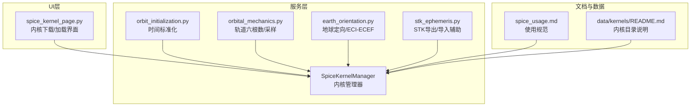
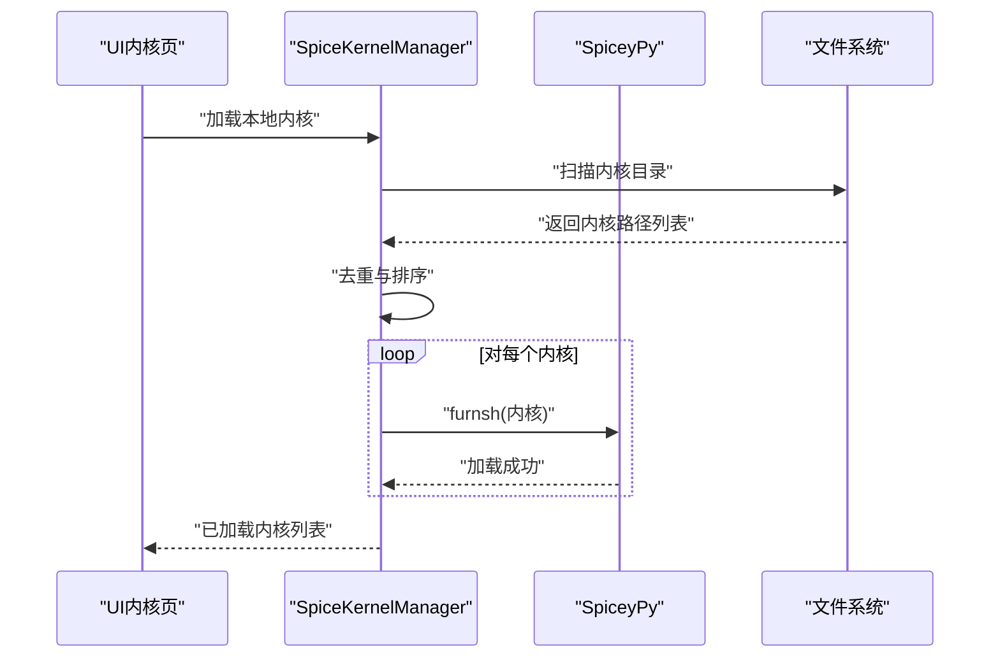
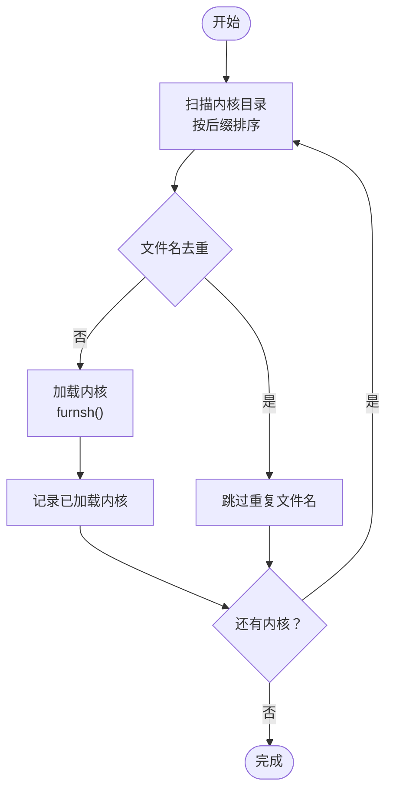
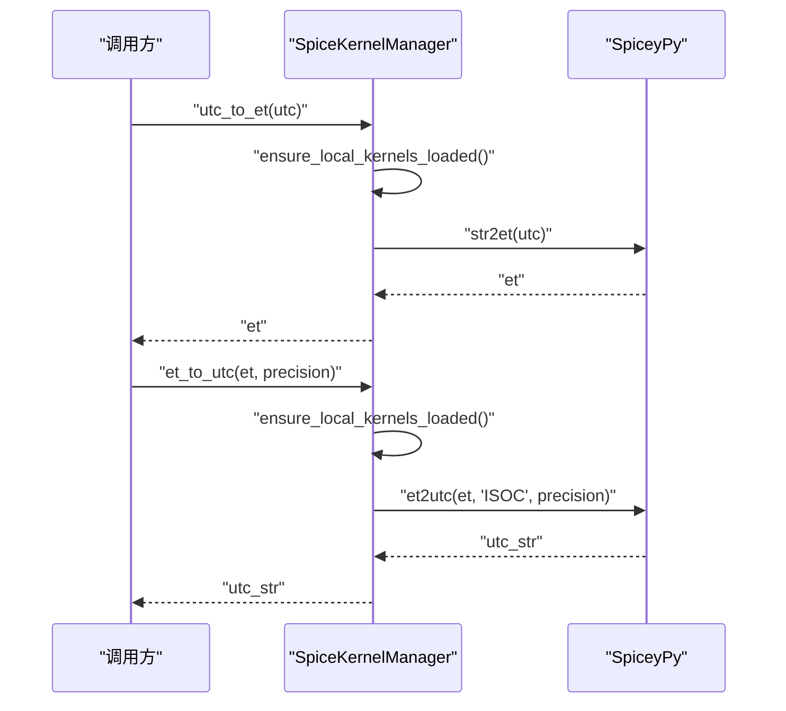
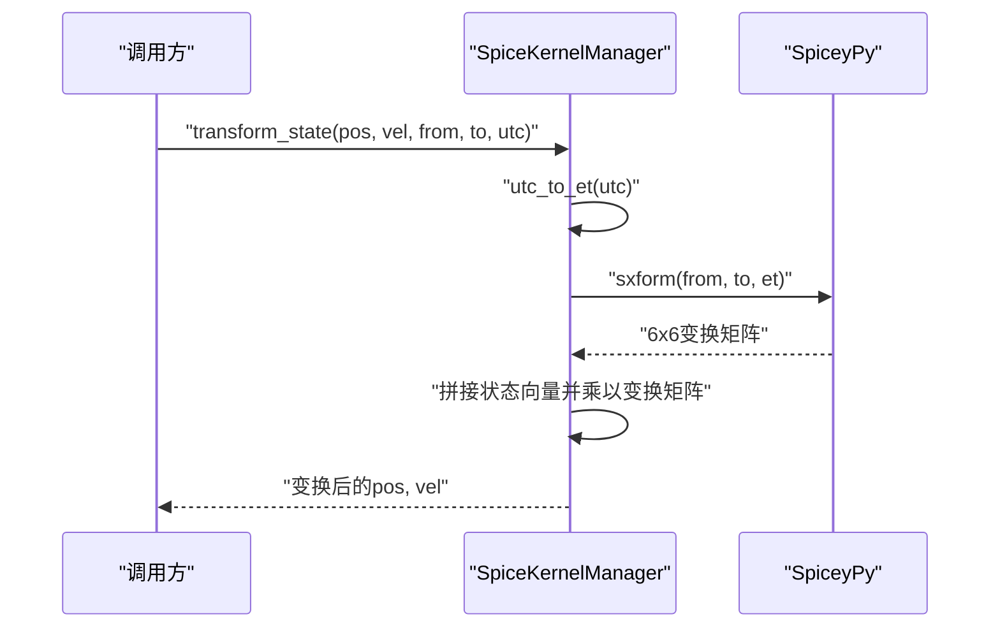
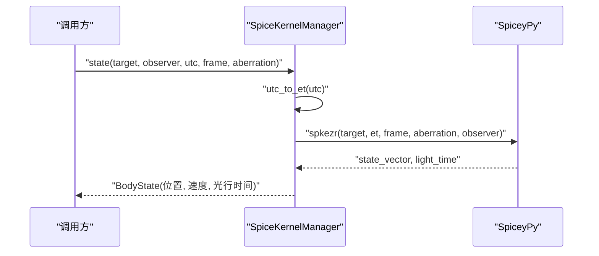
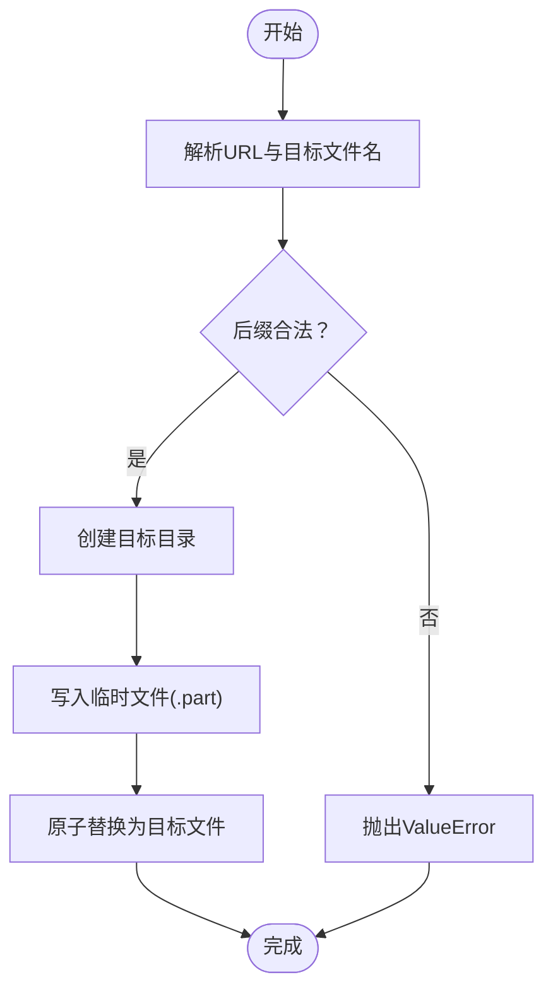
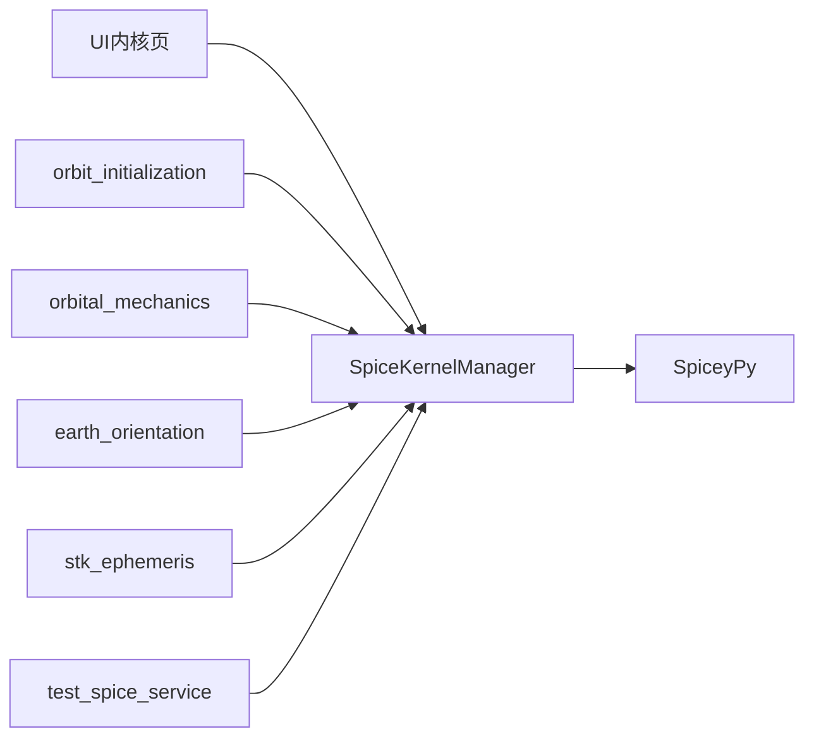

# SPICE天体动力学服务

<cite>
**本文引用的文件**
- [spice_service.py](file://src/smart/services/spice_service.py)
- [spice_usage.md](file://doc/spice_usage.md)
- [README.md（内核目录）](file://data/kernels/README.md)
- [test_spice_service.py](file://tests/test_spice_service.py)
- [spice_kernel_page.py](file://src/smart/ui/widgets/spice_kernel_page.py)
- [orbit_initialization.py](file://src/smart/services/orbit_initialization.py)
- [orbital_mechanics.py](file://src/smart/services/orbital_mechanics.py)
- [stk_ephemeris.py](file://src/smart/services/stk_ephemeris.py)
- [earth_orientation.py](file://src/smart/services/earth_orientation.py)
</cite>

## 目录
1. [简介](#简介)
2. [项目结构](#项目结构)
3. [核心组件](#核心组件)
4. [架构总览](#架构总览)
5. [详细组件分析](#详细组件分析)
6. [依赖关系分析](#依赖关系分析)
7. [性能考虑](#性能考虑)
8. [故障排查指南](#故障排查指南)
9. [结论](#结论)
10. [附录](#附录)

## 简介
本文件系统化梳理 SMART 项目中的 SPICE 天体动力学服务，围绕内核管理、时间系统转换、坐标系变换与天体状态查询展开，提供内核下载与验证、错误处理、性能优化与内存管理的最佳实践，并给出可操作的使用示例与流程图。

## 项目结构
SPICE 相关能力主要集中在服务层与 UI 展示层：
- 服务层：内核管理、时间转换、坐标系变换、状态查询、STK 星历导入辅助、地球定向与 ECI/ECEF 转换等
- UI 展示层：内核下载对话框、内核清单与加载界面
- 文档与测试：使用规范、内核目录说明、单元测试覆盖

图表来源
- [spice_service.py:174-305](file://src/smart/services/spice_service.py#L174-L305)
- [spice_kernel_page.py:200-554](file://src/smart/ui/widgets/spice_kernel_page.py#L200-L554)
- [orbit_initialization.py:48-71](file://src/smart/services/orbit_initialization.py#L48-L71)
- [orbital_mechanics.py:1-200](file://src/smart/services/orbital_mechanics.py#L1-L200)
- [earth_orientation.py:103-146](file://src/smart/services/earth_orientation.py#L103-L146)
- [stk_ephemeris.py:34-115](file://src/smart/services/stk_ephemeris.py#L34-L115)
- [spice_usage.md:1-235](file://doc/spice_usage.md#L1-L235)
- [README.md（内核目录）:1-12](file://data/kernels/README.md#L1-L12)

章节来源
- [spice_service.py:1-305](file://src/smart/services/spice_service.py#L1-L305)
- [spice_usage.md:1-235](file://doc/spice_usage.md#L1-L235)
- [README.md（内核目录）:1-12](file://data/kernels/README.md#L1-L12)

## 核心组件
- 内核管理器：负责内核发现、加载、去重、清理与本地根目录配置
- 时间系统：UTC 到 ET 的转换与格式化输出
- 坐标系变换：位置与状态向量在参考系之间的变换
- 天体状态查询：目标体相对观测体的状态向量与光行时间
- 内核下载与校验：安全下载、文件名推断与后缀校验
- UI 内核页：内核清单、批量下载、单个加载、清空已加载内核

章节来源
- [spice_service.py:174-305](file://src/smart/services/spice_service.py#L174-L305)
- [spice_kernel_page.py:200-554](file://src/smart/ui/widgets/spice_kernel_page.py#L200-L554)

## 架构总览
SPICE 服务采用“服务层统一封装 + UI 展示”的分层设计。服务层以 SpiceKernelManager 为核心，向上提供时间、坐标、状态查询等统一接口；向下通过 SPICE/SpiceyPy 执行底层计算；UI 层负责内核的可视化管理与交互。

图表来源
- [spice_service.py:205-221](file://src/smart/services/spice_service.py#L205-L221)
- [spice_kernel_page.py:421-429](file://src/smart/ui/widgets/spice_kernel_page.py#L421-L429)

## 详细组件分析

### 内核管理系统
- 发现与去重：按后缀模式递归扫描，按文件名去重，优先保留前面目录中的同名内核
- 加载策略：首次访问自动加载；支持显式加载单个或整目录
- 清理与重置：清空已加载内核，重新初始化
- 本地根目录：支持项目级与仓库级根目录，后者作为默认种子集

图表来源
- [spice_service.py:91-117](file://src/smart/services/spice_service.py#L91-L117)
- [spice_service.py:205-221](file://src/smart/services/spice_service.py#L205-L221)

章节来源
- [spice_service.py:91-117](file://src/smart/services/spice_service.py#L91-L117)
- [spice_service.py:205-221](file://src/smart/services/spice_service.py#L205-L221)

### 时间系统转换（UTC↔ET）
- UTC 到 ET：使用 str2et，自动确保本地内核已加载
- ET 到 UTC：使用 et2utc，支持 ISO-C 格式与精度控制
- 规范化：在轨道初始化中对输入 UTC 进行标准化，优先使用 SPICE，失败则回退标准库

图表来源
- [spice_service.py:241-249](file://src/smart/services/spice_service.py#L241-L249)
- [orbit_initialization.py:48-71](file://src/smart/services/orbit_initialization.py#L48-L71)

章节来源
- [spice_service.py:241-249](file://src/smart/services/spice_service.py#L241-L249)
- [orbit_initialization.py:48-71](file://src/smart/services/orbit_initialization.py#L48-L71)

### 坐标系变换
- 位置变换：使用 pxform 计算旋转矩阵，对位置向量进行变换
- 状态变换：使用 sxform 计算 6×6 变换矩阵，对 [pos, vel] 向量进行变换
- 自动加载：变换前自动加载本地内核

图表来源
- [spice_service.py:265-285](file://src/smart/services/spice_service.py#L265-L285)

章节来源
- [spice_service.py:251-285](file://src/smart/services/spice_service.py#L251-L285)

### 天体状态查询（位置/速度/光行时间）
- 查询接口：state(target, observer, utc, frame, aberration)
- 返回值：位置、速度与光行时间
- 异常处理：SPICE 不可用时抛出异常，调用方可选择回退方案

图表来源
- [spice_service.py:287-305](file://src/smart/services/spice_service.py#L287-L305)

章节来源
- [spice_service.py:287-305](file://src/smart/services/spice_service.py#L287-L305)

### 内核下载、验证与错误处理
- 下载流程：URL 校验、目标文件名推断、后缀检查、临时文件写入、原子替换
- 错误处理：网络异常、目标路径越界、文件已存在（可覆写）、下载失败清理临时文件
- UI 对话框：预设内核勾选、自定义 URL/文件名校验、批量下载与覆盖确认

图表来源
- [spice_service.py:133-172](file://src/smart/services/spice_service.py#L133-L172)
- [spice_kernel_page.py:445-511](file://src/smart/ui/widgets/spice_kernel_page.py#L445-L511)

章节来源
- [spice_service.py:133-172](file://src/smart/services/spice_service.py#L133-L172)
- [spice_kernel_page.py:445-511](file://src/smart/ui/widgets/spice_kernel_page.py#L445-L511)

### STK 星历导入与坐标系转换
- 支持中心体：仅 Earth
- 支持坐标系：惯性系（J2000/ICRF/Inertial）与地固系别名（Fixed/ITRF93/IAU_EARTH）
- 导入约束：距离单位、数据格式、内核缺失时报错
- ECI/ECEF 转换：优先通过 SPICE，失败回退至 GMST 旋转

章节来源
- [spice_usage.md:134-151](file://doc/spice_usage.md#L134-L151)
- [earth_orientation.py:103-146](file://src/smart/services/earth_orientation.py#L103-L146)
- [stk_ephemeris.py:34-115](file://src/smart/services/stk_ephemeris.py#L34-L115)

## 依赖关系分析
- 服务层依赖：SpiceKernelManager 依赖 SpiceyPy；时间与坐标转换依赖内核加载；STK 导入依赖地球定向内核
- UI 层依赖：内核页依赖 SpiceKernelManager 与下载工具
- 测试覆盖：内核发现、自动加载、下载校验、预设内核一致性、本地根目录顺序

图表来源
- [spice_service.py:1-305](file://src/smart/services/spice_service.py#L1-L305)
- [spice_kernel_page.py:1-554](file://src/smart/ui/widgets/spice_kernel_page.py#L1-L554)
- [orbit_initialization.py:1-200](file://src/smart/services/orbit_initialization.py#L1-L200)
- [orbital_mechanics.py:1-200](file://src/smart/services/orbital_mechanics.py#L1-L200)
- [earth_orientation.py:1-244](file://src/smart/services/earth_orientation.py#L1-L244)
- [stk_ephemeris.py:1-200](file://src/smart/services/stk_ephemeris.py#L1-L200)
- [test_spice_service.py:1-199](file://tests/test_spice_service.py#L1-L199)

章节来源
- [test_spice_service.py:1-199](file://tests/test_spice_service.py#L1-L199)

## 性能考虑
- 自动加载策略：首次访问时一次性加载所有本地内核，避免重复加载开销
- 缓存与去重：按文件名去重，避免重复加载相同内核
- 精度控制：时间转换支持精度参数，减少字符串格式化成本
- UI 体验：下载时设置等待光标，批量下载后刷新清单，提升交互效率
- 回退策略：SPICE 不可用时使用分析方法（如 GMST），降低整体失败概率

[本节为通用指导，无需特定文件来源]

## 故障排查指南
- SPICE 不可用：检查依赖安装与运行环境；查看运行状态摘要
- 内核缺失：确认 data/kernels 目录存在并包含必要内核；使用 UI 内核页下载或手动放置
- 文件名与后缀错误：下载时会校验后缀，不符合要求会抛出异常
- 目录越界：下载目标必须位于指定内核目录内，否则拒绝
- 文件已存在：默认不覆盖，需用户确认或显式启用覆写
- 坐标系转换失败：确认内核包含相应参考系转换信息；必要时补充地球定向与框架内核

章节来源
- [spice_service.py:24-26](file://src/smart/services/spice_service.py#L24-L26)
- [spice_service.py:133-172](file://src/smart/services/spice_service.py#L133-L172)
- [spice_kernel_page.py:445-511](file://src/smart/ui/widgets/spice_kernel_page.py#L445-L511)

## 结论
SMART 的 SPICE 天体动力学服务以 SpiceKernelManager 为核心，实现了内核的自动化发现与加载、UTC/ET 时间转换、坐标系变换与天体状态查询，并提供了完善的 UI 管理界面与测试覆盖。通过合理的缓存与去重策略、严格的下载校验与错误处理，以及 SPICE 不可用时的分析回退，系统在准确性与稳定性之间取得良好平衡。建议在新项目中优先使用该服务提供的接口，避免重复实现。

[本节为总结，无需特定文件来源]

## 附录

### 实际使用示例（路径指引）
- 加载默认本地内核
  - [示例路径:172-174](file://src/smart/services/spice_service.py#L172-L174)
- UTC 转 ET，再转回标准 UTC
  - [示例路径:181-184](file://src/smart/services/spice_service.py#L181-L184)
- 坐标系下的位置/速度转换
  - [示例路径:191-199](file://src/smart/services/spice_service.py#L191-L199)
- 由状态向量反求轨道根数
  - [示例路径:204-210](file://src/smart/services/orbital_mechanics.py#L204-L210)
- 由轨道根数采样轨道
  - [示例路径:215-227](file://src/smart/services/orbital_mechanics.py#L215-L227)

### SPICE 内核预设配置
- 预设集合：包含常用内核（时间、星历、地球定向、行星常数等），默认全部勾选
- 下载与校验：通过 UI 对话框批量下载，自动校验后缀与目标路径

章节来源
- [spice_service.py:50-76](file://src/smart/services/spice_service.py#L50-L76)
- [spice_kernel_page.py:94-106](file://src/smart/ui/widgets/spice_kernel_page.py#L94-L106)