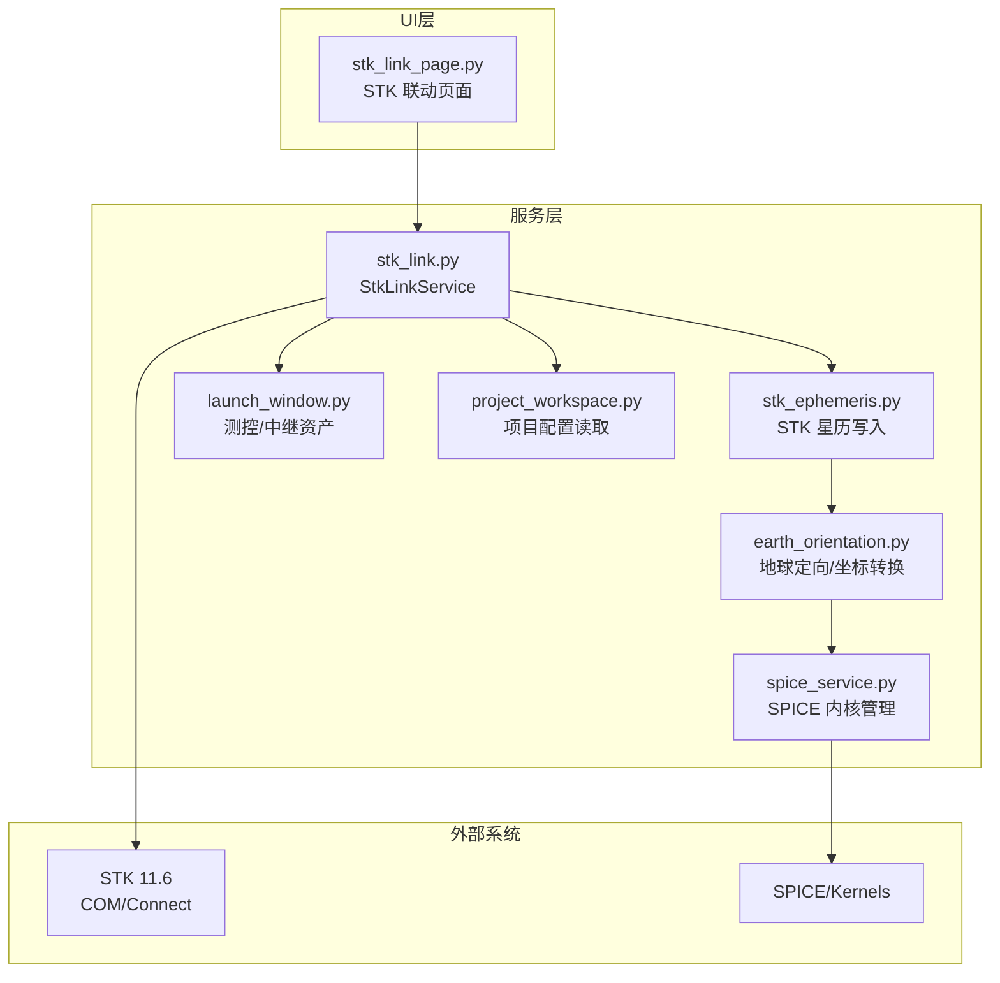
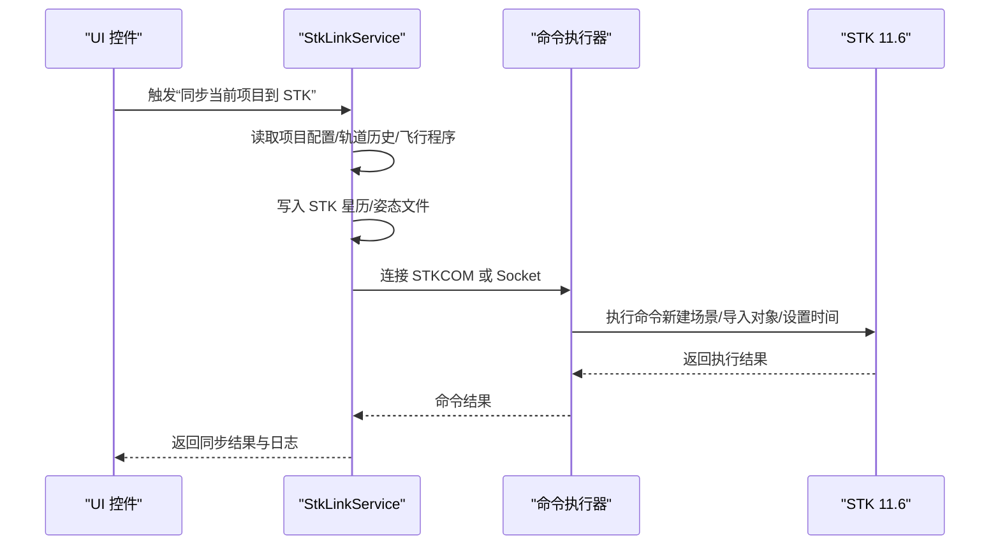
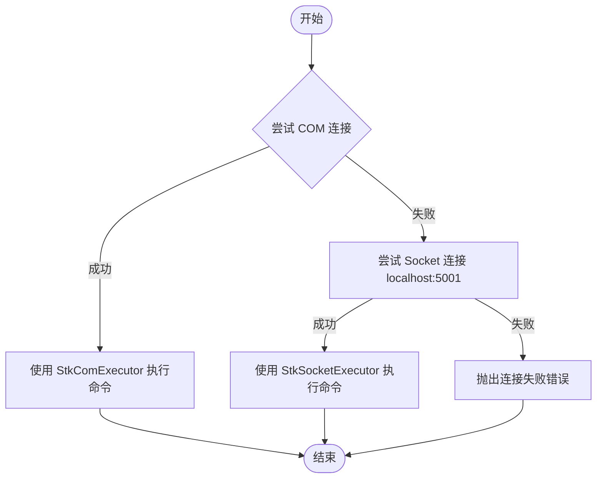
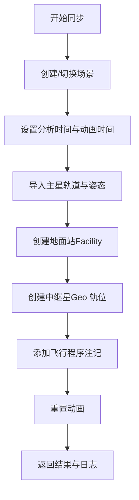
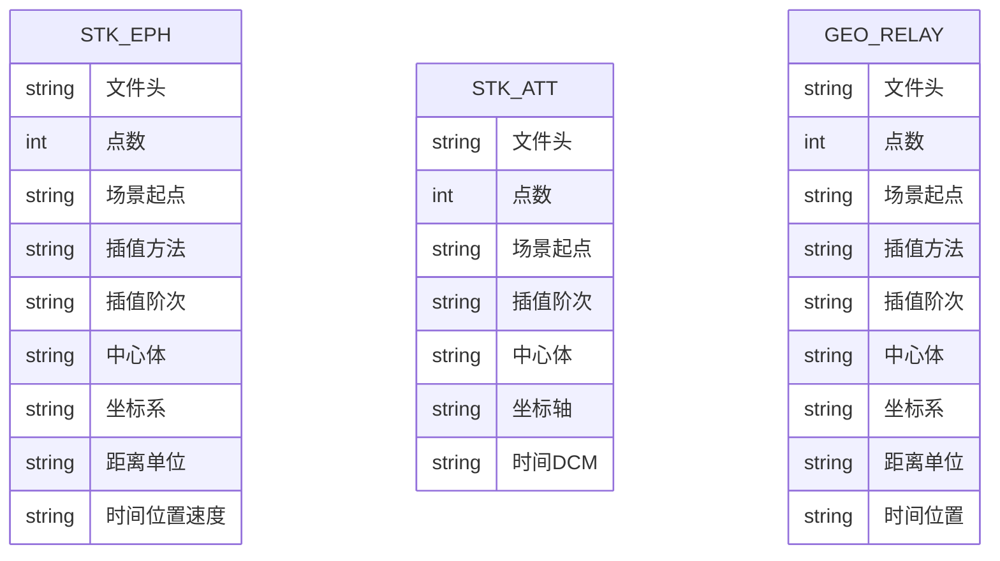
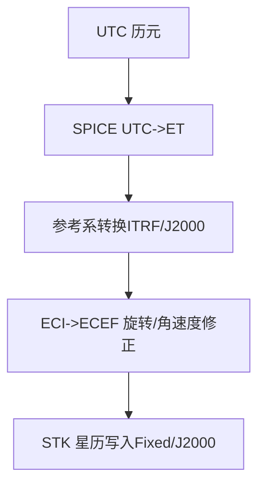
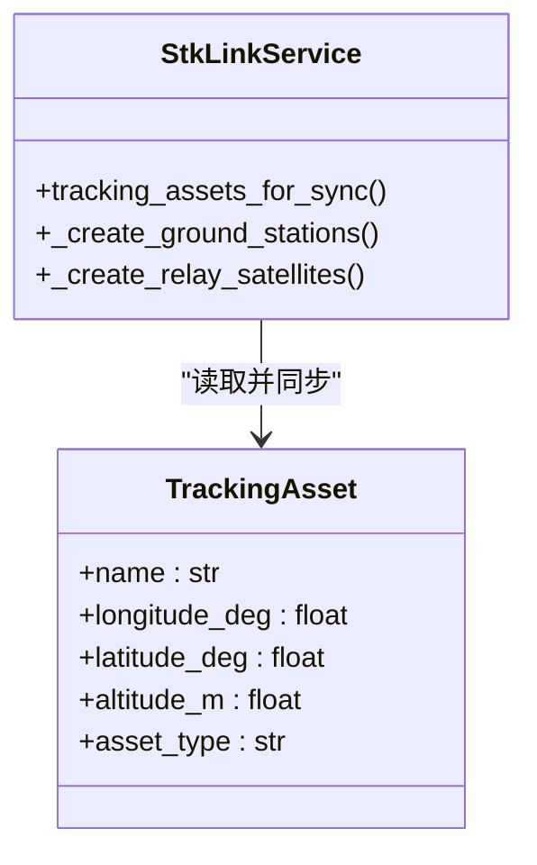
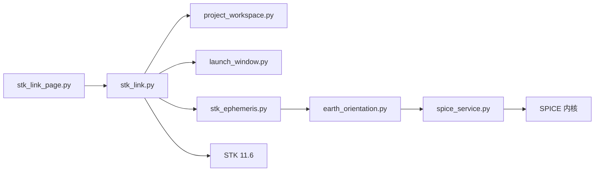

# STK数据联动服务

<cite>
**本文引用的文件**
- [stk_link.py](file://src/smart/services/stk_link.py)
- [stk_ephemeris.py](file://src/smart/services/stk_ephemeris.py)
- [stk_link_page.py](file://src/smart/ui/widgets/stk_link_page.py)
- [project_workspace.py](file://src/smart/services/project_workspace.py)
- [launch_window.py](file://src/smart/services/launch_window.py)
- [earth_orientation.py](file://src/smart/services/earth_orientation.py)
- [spice_service.py](file://src/smart/services/spice_service.py)
- [stk_11_6_operations.md](file://src/smart/agents/skills/stk_11_6_operations.md)
- [test_stk_link.py](file://tests/test_stk_link.py)
- [README.md](file://README.md)
- [spice_usage.md](file://doc/spice_usage.md)
- [smart_project.json](file://projects/F4/smart_project.json)
- [orbit_elements.json](file://projects/F4/data/orbit_elements.json)
- [flight_program.json](file://projects/F4/config/flight_program.json)
- [20260512_114224_Tianlian_1_geo.e](file://projects/F4/data/stk_link/20260512_114224/Tianlian_1_geo.e)
</cite>

## 目录
1. [简介](#简介)
2. [项目结构](#项目结构)
3. [核心组件](#核心组件)
4. [架构总览](#架构总览)
5. [详细组件分析](#详细组件分析)
6. [依赖关系分析](#依赖关系分析)
7. [性能考量](#性能考量)
8. [故障排查指南](#故障排查指南)
9. [结论](#结论)
10. [附录](#附录)

## 简介
本文件系统化梳理 SMART 项目中的 STK 数据联动服务，围绕 STK COM 接口通信机制、场景管理、数据交换协议、天文算法集成、场景模板与自动化脚本、Python 封装示例以及错误处理与连接状态监控进行深入说明。目标是帮助读者快速理解并安全高效地使用 STK 联动能力，支撑复杂航天任务仿真与工程分析。

## 项目结构
STK 联动服务位于服务层，与 UI 控件、项目工作区、发射窗口与飞行程序配置、SPICE/天文算法服务协同，形成“配置驱动 + 自动化同步”的闭环。

**图表来源**
- [stk_link_page.py:36-324](file://src/smart/ui/widgets/stk_link_page.py#L36-L324)
- [stk_link.py:199-755](file://src/smart/services/stk_link.py#L199-L755)
- [stk_ephemeris.py:34-278](file://src/smart/services/stk_ephemeris.py#L34-L278)
- [earth_orientation.py:103-146](file://src/smart/services/earth_orientation.py#L103-L146)
- [spice_service.py:174-200](file://src/smart/services/spice_service.py#L174-L200)
- [launch_window.py:54-192](file://src/smart/services/launch_window.py#L54-L192)
- [project_workspace.py:64-116](file://src/smart/services/project_workspace.py#L64-L116)

**章节来源**
- [README.md:44-46](file://README.md#L44-L46)
- [README.md:67-69](file://README.md#L67-L69)

## 核心组件
- StkLinkService：STK 联动主控制器，负责连接建立、场景创建、对象导入、属性配置、时间同步与日志记录。
- StkLinkPage：UI 控件，提供启动 STK、新建场景、同步项目到 STK 的交互入口与执行日志。
- StkEphemeris 与坐标转换：负责将轨道历史数据写入 STK 星历格式，并结合 SPICE/地球定向算法进行坐标转换。
- 项目工作区与配置：提供轨道元素、飞行程序、测控/中继资产等配置的读取与落盘。
- 发射窗口与测控资产：提供测控站与中继星的资产集合，用于同步到 STK。

**章节来源**
- [stk_link.py:199-755](file://src/smart/services/stk_link.py#L199-L755)
- [stk_link_page.py:36-324](file://src/smart/ui/widgets/stk_link_page.py#L36-L324)
- [stk_ephemeris.py:34-115](file://src/smart/services/stk_ephemeris.py#L34-L115)
- [project_workspace.py:64-116](file://src/smart/services/project_workspace.py#L64-L116)
- [launch_window.py:54-192](file://src/smart/services/launch_window.py#L54-L192)

## 架构总览
STK 联动采用“COM/Object Model 优先 + Socket Connect 回退”的双通道连接策略，确保在不同运行环境下稳定可用。服务层通过项目工作区读取配置，生成 STK 星历与姿态文件，再通过命令执行器将对象导入 STK 场景并应用图形与注记。

**图表来源**
- [stk_link.py:280-337](file://src/smart/services/stk_link.py#L280-L337)
- [stk_link_page.py:182-202](file://src/smart/ui/widgets/stk_link_page.py#L182-L202)

## 详细组件分析

### STK 连接与命令执行机制
- COM/Object Model 优先：通过 win32com 客户端获取 STK Application，访问 Personality2 获取 Root，使用 ExecuteCommand 执行 Connect 命令。
- Socket Connect 回退：当 COM 不可用时，自动启动 STK 并等待本地 5001 端口可用，使用 TCP 套接字发送命令并接收 ACK/NACK 响应。
- 错误处理：对异常进行捕获与包装，区分 ignore_failure 模式与严格模式；对连接超时、命令失败、非预期响应进行明确报错。

**图表来源**
- [stk_link.py:111-142](file://src/smart/services/stk_link.py#L111-L142)
- [stk_link.py:170-189](file://src/smart/services/stk_link.py#L170-L189)
- [stk_link.py:75-108](file://src/smart/services/stk_link.py#L75-L108)

**章节来源**
- [stk_link.py:57-108](file://src/smart/services/stk_link.py#L57-L108)
- [stk_link.py:111-189](file://src/smart/services/stk_link.py#L111-L189)

### 场景管理与对象导入
- 场景创建：检测当前是否存在场景，不存在则新建；设置分析时间段与动画起止时间；清理旧对象并创建新对象。
- 对象导入：卫星轨道（FromStkPL）、姿态（FromFile Filename）、地面站（Facility Geodetic）、中继星（Geo 轨位）。
- 图形与注记：设置颜色、标签、轨迹显示、VO 注释文本（飞行程序事件）。

**图表来源**
- [stk_link.py:280-337](file://src/smart/services/stk_link.py#L280-L337)
- [stk_link.py:339-450](file://src/smart/services/stk_link.py#L339-L450)

**章节来源**
- [stk_link.py:223-299](file://src/smart/services/stk_link.py#L223-L299)
- [stk_link.py:339-450](file://src/smart/services/stk_link.py#L339-L450)

### 数据交换协议与文件格式
- STK 星历（.e 文件）：包含场景起点、插值方法/阶次、中心体、坐标系、距离单位、时间与位置速度序列。
- STK 姿态（.a 文件）：包含姿态点数量、场景起点、插值阶次、坐标轴、姿态时间与方向余弦矩阵。
- 中继星 Geo 轨位（.e 文件）：固定坐标系下两点位置，用于在指定经度处生成静止轨道。

**图表来源**
- [stk_ephemeris.py:52-108](file://src/smart/services/stk_ephemeris.py#L52-L108)
- [stk_link.py:560-592](file://src/smart/services/stk_link.py#L560-L592)
- [stk_link.py:595-632](file://src/smart/services/stk_link.py#L595-L632)
- [20260512_114224_Tianlian_1_geo.e:1-19](file://projects/F4/data/stk_link/20260512_114224/Tianlian_1_geo.e#L1-L19)

**章节来源**
- [stk_ephemeris.py:34-115](file://src/smart/services/stk_ephemeris.py#L34-L115)
- [stk_link.py:560-632](file://src/smart/services/stk_link.py#L560-L632)

### 天文算法与坐标转换集成
- SPICE 优先：通过 SpiceKernelManager 进行 UTC/ET 转换、位置/速度变换、天体状态查询。
- 地球定向：提供 GMST/Greenwich 角度计算与 ITRF/J2000 参考系转换，支持 ECI/ECEF 互转。
- STK 星历导入：对地固系（Fixed/ITRF93）进行 J2000 转换，确保与 STK 坐标系兼容。

**图表来源**
- [earth_orientation.py:103-146](file://src/smart/services/earth_orientation.py#L103-L146)
- [spice_service.py:174-200](file://src/smart/services/spice_service.py#L174-L200)
- [stk_ephemeris.py:74-93](file://src/smart/services/stk_ephemeris.py#L74-L93)

**章节来源**
- [earth_orientation.py:103-146](file://src/smart/services/earth_orientation.py#L103-L146)
- [spice_service.py:174-200](file://src/smart/services/spice_service.py#L174-L200)
- [stk_ephemeris.py:74-93](file://src/smart/services/stk_ephemeris.py#L74-L93)

### 测控/中继资产与场景模板
- 资产来源：测控弧段配置（tracking_arc.json）与发射窗口配置（launch_window.json），支持预设与自定义资产。
- 同步策略：将地面站与中继星资产导入 STK，中继星按经度生成 Geo 轨位星历。
- 模板化：通过项目工作区的配置文件与 UI 预览表格，形成可复用的场景模板。

**图表来源**
- [launch_window.py:54-99](file://src/smart/services/launch_window.py#L54-L99)
- [stk_link.py:339-383](file://src/smart/services/stk_link.py#L339-L383)

**章节来源**
- [launch_window.py:54-192](file://src/smart/services/launch_window.py#L54-L192)
- [stk_link.py:339-383](file://src/smart/services/stk_link.py#L339-L383)

### UI 与自动化脚本
- UI 控件：提供启动 STK、新建场景、同步项目按钮，执行过程在独立线程中运行，避免阻塞主线程。
- 日志与状态：记录命令与生成文件，显示连接状态与执行结果。
- 自动化：通过测试用例展示命令序列、文件生成与断言，可作为自动化脚本参考。

**章节来源**
- [stk_link_page.py:36-324](file://src/smart/ui/widgets/stk_link_page.py#L36-L324)
- [test_stk_link.py:23-31](file://tests/test_stk_link.py#L23-L31)
- [test_stk_link.py:97-116](file://tests/test_stk_link.py#L97-L116)

## 依赖关系分析
- 服务层耦合：StkLinkService 依赖项目工作区、发射窗口配置、STK 星历写入与坐标转换服务。
- 外部依赖：STK 11.6（COM/Connect）、SPICE 内核（可选）。
- UI 与服务：UI 通过 StkLinkPage 调用 StkLinkService，使用 QThread 与 Worker 解耦执行。

**图表来源**
- [stk_link.py:199-755](file://src/smart/services/stk_link.py#L199-L755)
- [stk_link_page.py:36-324](file://src/smart/ui/widgets/stk_link_page.py#L36-L324)
- [project_workspace.py:64-116](file://src/smart/services/project_workspace.py#L64-L116)
- [launch_window.py:54-192](file://src/smart/services/launch_window.py#L54-L192)
- [stk_ephemeris.py:34-115](file://src/smart/services/stk_ephemeris.py#L34-L115)
- [earth_orientation.py:103-146](file://src/smart/services/earth_orientation.py#L103-L146)
- [spice_service.py:174-200](file://src/smart/services/spice_service.py#L174-L200)

**章节来源**
- [README.md:44-46](file://README.md#L44-L46)

## 性能考量
- 命令批量化：将多次命令合并为一次连接周期，减少往返开销。
- 文件写入：批量生成 .e/.a 文件，避免频繁 I/O。
- 线程化执行：UI 与业务分离，避免阻塞。
- SPICE 缓存：利用 LRU 缓存与内核自动加载，降低重复计算与加载成本。

[本节为通用指导，无需具体文件引用]

## 故障排查指南
- 连接失败
  - 确认 STK 11.6 是否安装并可被 COM 访问；若不可用，检查本地 5001 端口是否开放。
  - 参考技能文档中的帮助索引与本地帮助路径，定位 Connect 命令与场景状态。
- 命令失败
  - 检查命令字符串是否符合 STK Connect 语法；关注 NACK/ACK 响应体内容。
  - 使用 UI 日志查看具体命令与错误堆栈。
- 坐标/时间问题
  - 确保 SPICE 内核齐全，特别是地球定向与 J2000 参照系转换所需的内核。
  - 核对 UTC/ET 转换与历元格式，避免尾数精度差异导致的对齐误差。
- 场景对象异常
  - 检查对象命名清洗规则与路径合法性；确认经度/纬度/海拔参数范围。
  - 确认中继星 Geo 轨位经度与持续时间设置合理。

**章节来源**
- [stk_11_6_operations.md:19-33](file://src/smart/agents/skills/stk_11_6_operations.md#L19-L33)
- [stk_link.py:75-108](file://src/smart/services/stk_link.py#L75-L108)
- [spice_usage.md:134-151](file://doc/spice_usage.md#L134-L151)

## 结论
SMART 的 STK 数据联动服务以“配置驱动 + 自动化同步 + 天文算法优先”为核心理念，实现了从轨道/姿态/测控/中继的全链路导入与可视化。通过 COM/Socket 双通道连接、SPICE 参照系转换与严格的错误处理，确保在不同环境下稳定运行。配合 UI 与测试用例，可快速构建可复用的场景模板与自动化脚本，支撑复杂航天任务仿真与工程分析。

[本节为总结性内容，无需具体文件引用]

## 附录

### 常见操作的 Python 封装示例（路径指引）
- 启动/附加 STK 并执行命令
  - [launch_or_attach_stk_116:111-142](file://src/smart/services/stk_link.py#L111-L142)
  - [attach_to_running_stk_116_scenario:144-167](file://src/smart/services/stk_link.py#L144-L167)
- 新建场景与导入对象
  - [create_new_scenario:223-239](file://src/smart/services/stk_link.py#L223-L239)
  - [import_project_to_stk:280-337](file://src/smart/services/stk_link.py#L280-L337)
- 写入 STK 星历与姿态
  - [write_stk_ephemeris:34-115](file://src/smart/services/stk_ephemeris.py#L34-L115)
  - [write_stk_attitude_dcm:560-592](file://src/smart/services/stk_link.py#L560-L592)
  - [write_geo_relay_ephemeris:595-632](file://src/smart/services/stk_link.py#L595-L632)
- 时间与坐标转换
  - [ecef_state_from_eci:103-146](file://src/smart/services/earth_orientation.py#L103-L146)
  - [SpiceKernelManager:174-200](file://src/smart/services/spice_service.py#L174-L200)
- 项目配置读取
  - [ProjectWorkspace:64-116](file://src/smart/services/project_workspace.py#L64-L116)
  - [flight_program.json:1-367](file://projects/F4/config/flight_program.json#L1-L367)
  - [orbit_elements.json:1-11](file://projects/F4/data/orbit_elements.json#L1-L11)
  - [smart_project.json:1-6](file://projects/F4/smart_project.json#L1-L6)

### 测试用例参考（路径指引）
- 命令序列与断言
  - [test_sync_current_scenario_analysis_time:97-116](file://tests/test_stk_link.py#L97-L116)
  - [test_sync_current_scenario_time:127-135](file://tests/test_stk_link.py#L127-L135)
  - [test_apply_satellite_model_uses_stk_supported_model_file:137-151](file://tests/test_stk_link.py#L137-L151)
- 文件生成与内容校验
  - [test_write_geo_relay_ephemeris_uses_fixed_geo_slot:51-64](file://tests/test_stk_link.py#L51-L64)
  - [test_write_stk_attitude_dcm_aligns_body_z_with_project_plus_z:66-80](file://tests/test_stk_link.py#L66-L80)