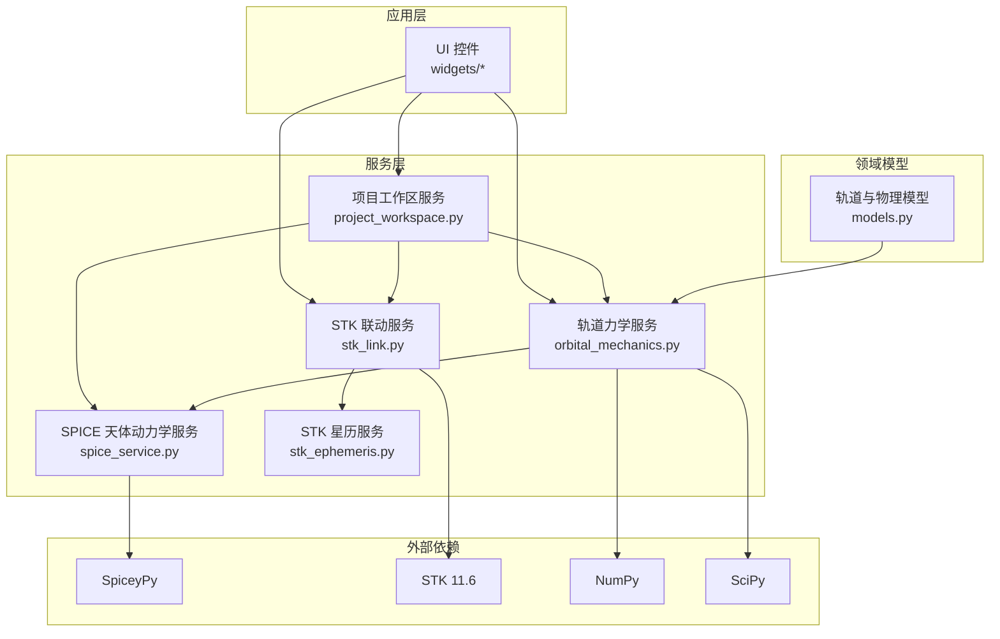
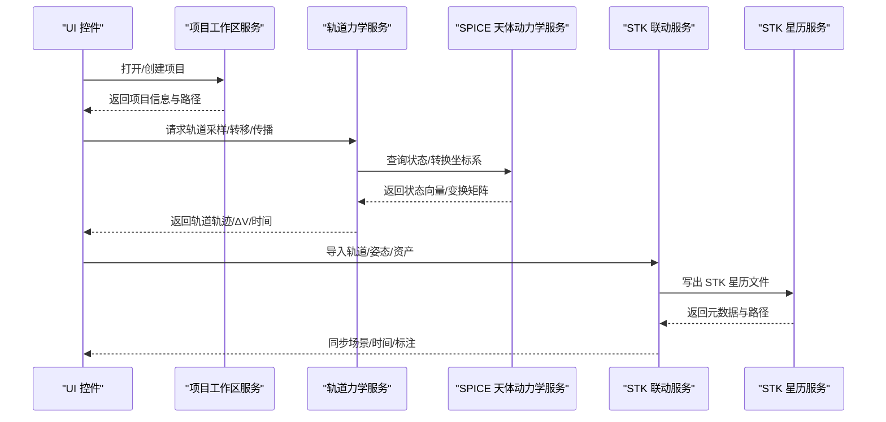
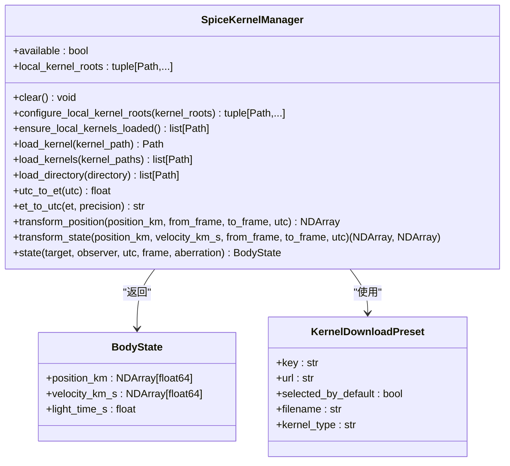
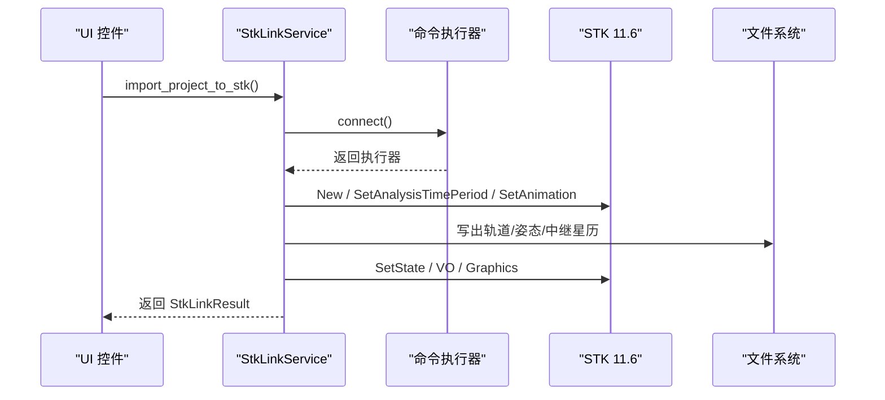
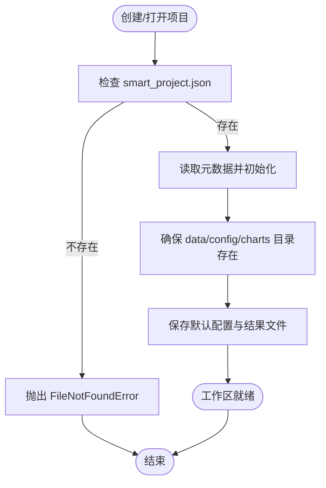
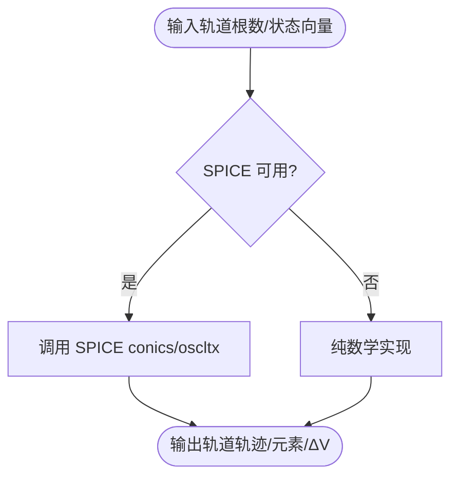
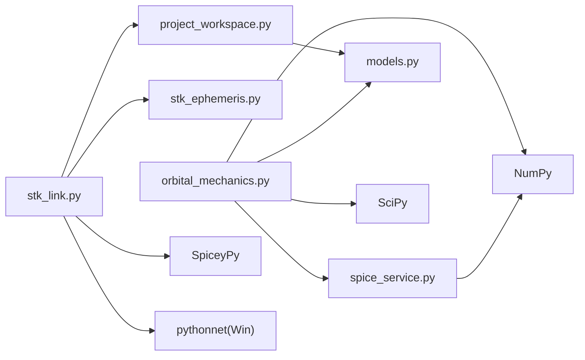

# 核心服务模块

<cite>
**本文档引用的文件**
- [spice_service.py](file://src/smart/services/spice_service.py)
- [stk_link.py](file://src/smart/services/stk_link.py)
- [project_workspace.py](file://src/smart/services/project_workspace.py)
- [orbital_mechanics.py](file://src/smart/services/orbital_mechanics.py)
- [stk_ephemeris.py](file://src/smart/services/stk_ephemeris.py)
- [models.py](file://src/smart/domain/models.py)
- [pyproject.toml](file://pyproject.toml)
- [README.md](file://README.md)
- [test_spice_service.py](file://tests/test_spice_service.py)
- [test_stk_link.py](file://tests/test_stk_link.py)
- [test_project_workspace.py](file://tests/test_project_workspace.py)
- [test_orbital_mechanics.py](file://tests/test_orbital_mechanics.py)
</cite>

## 目录
1. [简介](#简介)
2. [项目结构](#项目结构)
3. [核心组件](#核心组件)
4. [架构总览](#架构总览)
5. [详细组件分析](#详细组件分析)
6. [依赖关系分析](#依赖关系分析)
7. [性能考虑](#性能考虑)
8. [故障排除指南](#故障排除指南)
9. [结论](#结论)
10. [附录](#附录)

## 简介
本文件聚焦 SMART 项目的四大核心服务模块：SPICE 天体动力学服务、STK 联动服务、项目工作区服务与轨道力学服务。文档深入解释各模块的功能边界、数据结构、处理流程、配置参数、错误处理与性能优化策略，并提供服务调用示例与最佳实践指导，帮助开发者与用户高效使用与扩展这些服务。

## 项目结构
SMART 采用分层架构，核心服务位于 `src/smart/services/`，领域模型位于 `src/smart/domain/`，UI 控件位于 `src/smart/ui/widgets/`，测试位于 `tests/`。SPICE 内核默认放置于 `data/kernels/`，项目数据按 `config/data/charts` 结构组织。

**图表来源**
- [project_workspace.py:64-127](file://src/smart/services/project_workspace.py#L64-L127)
- [spice_service.py:174-305](file://src/smart/services/spice_service.py#L174-L305)
- [orbital_mechanics.py:1-25](file://src/smart/services/orbital_mechanics.py#L1-L25)
- [stk_link.py:199-337](file://src/smart/services/stk_link.py#L199-L337)
- [stk_ephemeris.py:31-111](file://src/smart/services/stk_ephemeris.py#L31-L111)

**章节来源**
- [README.md: 187-196:187-196](file://README.md#L187-L196)
- [pyproject.toml: 11-22:11-22](file://pyproject.toml#L11-L22)

## 核心组件
- SPICE 天体动力学服务：负责内核发现与加载、UTC/ET 时间转换、坐标系变换、天体状态查询，提供高精度轨道与姿态数据支撑。
- STK 联动服务：封装 COM 与 Socket 两种连接方式，实现场景创建、对象导入、姿态与图形设置、事件标注与时间同步。
- 项目工作区服务：管理项目生命周期、文件系统操作、JSON 数据持久化、配置与结果归档、项目复制与迁移。
- 轨道力学服务：提供轨道采样、开普勒/拉格朗日转移、两体传播、异常角换算、平面改变 ΔV 计算等核心算法。

**章节来源**
- [spice_service.py: 174-305:174-305](file://src/smart/services/spice_service.py#L174-L305)
- [stk_link.py: 199-337:199-337](file://src/smart/services/stk_link.py#L199-L337)
- [project_workspace.py: 64-127:64-127](file://src/smart/services/project_workspace.py#L64-L127)
- [orbital_mechanics.py: 25-780:25-780](file://src/smart/services/orbital_mechanics.py#L25-L780)

## 架构总览
下图展示核心服务间的交互关系与数据流向，强调 SPICE 作为底层数据源、STK 作为可视化与场景管理平台、工作区作为数据持久化枢纽的角色分工。

**图表来源**
- [orbital_mechanics.py: 255-310:255-310](file://src/smart/services/orbital_mechanics.py#L255-L310)
- [spice_service.py: 241-305:241-305](file://src/smart/services/spice_service.py#L241-L305)
- [stk_link.py: 280-337:280-337](file://src/smart/services/stk_link.py#L280-L337)
- [stk_ephemeris.py: 31-111:31-111](file://src/smart/services/stk_ephemeris.py#L31-L111)

## 详细组件分析

### SPICE 天体动力学服务
- 主要职责
  - 内核管理：自动发现与加载本地内核，支持多种后缀（*.tls, *.tpc, *.tf, *.bsp, *.bpc, *.bc）。
  - 时间处理：UTC 与 ET（以秒为单位的星历时间）互转，确保与 SPICE 时间系统一致。
  - 坐标系转换：基于 pxform/sxform 实现位置/状态向量的参考系变换。
  - 天体状态查询：通过 spkezr 获取目标体相对于观测者的状态向量与光行时。
- 关键数据结构
  - BodyState：包含位置、速度与光行时。
  - KernelDownloadPreset：预设常用内核下载地址与类型。
- 错误处理
  - 未安装 SpiceyPy 时抛出 SpiceUnavailableError。
  - 文件不存在、URL 不合法、内核后缀不受支持等输入校验。
- 性能优化
  - 首次使用时批量加载内核，避免重复加载。
  - 使用 NumPy 向量化进行矩阵乘法与数组运算。

**图表来源**
- [spice_service.py: 28-48:28-48](file://src/smart/services/spice_service.py#L28-L48)
- [spice_service.py: 174-305:174-305](file://src/smart/services/spice_service.py#L174-L305)

**章节来源**
- [spice_service.py: 79-131:79-131](file://src/smart/services/spice_service.py#L79-L131)
- [spice_service.py: 174-305:174-305](file://src/smart/services/spice_service.py#L174-L305)
- [test_spice_service.py: 20-96:20-96](file://tests/test_spice_service.py#L20-L96)

### STK 联动服务
- 主要职责
  - 连接管理：优先使用 COM 接口，若不可用则回退到 Socket 接口；支持附加到现有场景或启动新场景。
  - 场景管理：创建/关闭场景、设置分析时间段、动画起止时间与当前时间。
  - 数据交换：导入轨道星历、姿态文件、地面站与中继卫星资产，生成 STK 支持的 e/attitude 文件。
  - 图形与标注：设置卫星模型、颜色、标签、地面轨迹与轨道轨迹；添加飞行程序事件标注。
- 关键数据结构
  - StkLinkResult：返回场景名、卫星名、资产数量与产物路径。
  - StkLinkArtifacts：记录导出的轨道/姿态/中继星历路径。
- 错误处理
  - COM/Socket 连接失败、命令执行失败、场景不存在等情况均抛出明确错误。
- 性能优化
  - 将命令累积到内存列表，减少频繁 I/O。
  - 对 STK 对象名称进行安全清洗，避免非法字符导致的失败重试。

**图表来源**
- [stk_link.py: 280-337:280-337](file://src/smart/services/stk_link.py#L280-L337)
- [stk_link.py: 560-632:560-632](file://src/smart/services/stk_link.py#L560-L632)

**章节来源**
- [stk_link.py: 199-337:199-337](file://src/smart/services/stk_link.py#L199-L337)
- [stk_link.py: 560-632:560-632](file://src/smart/services/stk_link.py#L560-L632)
- [test_stk_link.py: 1-L390:1-390](file://tests/test_stk_link.py#L1-L390)

### 项目工作区服务
- 主要职责
  - 项目生命周期：创建、打开、关闭、复制项目；确保目录结构与元数据文件存在。
  - 数据持久化：以 JSON/CSV 形式保存轨道根数、策略配置、结果文件；提供稳定哈希用于结果一致性校验。
  - 配置管理：卫星3D模型、设计/导入变轨策略、发射窗口、跟踪弧段、飞行程序等配置的读写。
- 关键数据结构
  - ProjectInfo：项目元信息（名称、根目录、创建/更新时间）。
  - 多类配置文件路径常量：如 maneuver_strategy.json、launch_window.json、tracking_arc.json、flight_program.json 等。
- 错误处理
  - 项目目录不存在、目标目录非空、目标在当前项目内部等边界条件进行校验与报错。
- 性能优化
  - 使用稳定哈希（sha256）对配置进行摘要，用于结果缓存有效性判断，避免重复计算。

**图表来源**
- [project_workspace.py: 82-127:82-127](file://src/smart/services/project_workspace.py#L82-L127)
- [project_workspace.py: 641-661:641-661](file://src/smart/services/project_workspace.py#L641-L661)

**章节来源**
- [project_workspace.py: 33-53:33-53](file://src/smart/services/project_workspace.py#L33-L53)
- [project_workspace.py: 64-L661:64-661](file://src/smart/services/project_workspace.py#L64-L661)
- [test_project_workspace.py: 21-L432:21-432](file://tests/test_project_workspace.py#L21-L432)

### 轨道力学服务
- 主要职责
  - 轨道采样与传播：基于经典轨道根数生成轨道轨迹，支持两体传播与异常角换算。
  - 转移与约束：Hohmann 转移、共面 Hohmann 估计、Lambert 两体转移、平面改变 ΔV。
  - 状态向量处理：从状态向量反求轨道根数，支持 SPICE 与纯数学两种实现。
- 关键数据结构
  - OrbitalElements：半长轴、偏心率、倾角、升交点赤经、近地点幅角、真近点角等。
  - OrbitTrajectory：位置、速度、半径、速率、时间序列等。
  - 多类结果模型：HohmannTransferResult、CoplanarHohmannEstimate、LambertTransferResult、PlaneChangeResult、TwoBodyPropagationResult 等。
- 错误处理
  - 输入参数合法性校验（如半长轴小于地半径、椭圆偏心率越界、速度为零等），抛出 ValueError。
- 性能优化
  - 使用 NumPy 向量化与 SciPy 优化器（如 brentq）提升数值稳定性与效率。
  - 在 SPICE 可用时优先使用 conics/oscltx，不可用时回退至纯数学实现。

**图表来源**
- [orbital_mechanics.py: 255-310:255-310](file://src/smart/services/orbital_mechanics.py#L255-L310)
- [models.py: 17-80:17-80](file://src/smart/domain/models.py#L17-L80)

**章节来源**
- [orbital_mechanics.py: 25-780:25-780](file://src/smart/services/orbital_mechanics.py#L25-L780)
- [models.py: 17-L200:17-200](file://src/smart/domain/models.py#L17-L200)
- [test_orbital_mechanics.py: 1-L143:1-143](file://tests/test_orbital_mechanics.py#L1-L143)

## 依赖关系分析
- 外部依赖
  - NumPy/SciPy：数值计算与优化。
  - SpiceyPy：SPICE 内核与时间/坐标系处理。
  - pythonnet（Windows）：Win32 COM 支持。
  - PySide6/pyqtgraph/OpenGL：GUI 与 3D 可视化。
- 内部耦合
  - 轨道力学服务依赖 SPICE 服务进行高精度状态查询与变换。
  - STK 联动服务依赖项目工作区服务读取配置与结果文件，并通过 STK 星历服务写出 STK 星历。
  - 项目工作区服务为所有服务提供统一的数据持久化与路径管理。

**图表来源**
- [pyproject.toml: 11-22:11-22](file://pyproject.toml#L11-L22)
- [orbital_mechanics.py: 1-L25:1-25](file://src/smart/services/orbital_mechanics.py#L1-L25)
- [stk_link.py: 16-L26:16-26](file://src/smart/services/stk_link.py#L16-L26)

**章节来源**
- [pyproject.toml: 11-22:11-22](file://pyproject.toml#L11-L22)

## 性能考虑
- SPICE 内核加载
  - 仅在首次使用时加载，避免重复加载带来的性能损耗。
  - 本地内核目录优先，支持多根目录去重与排序。
- 数值计算
  - 使用 NumPy 向量化与原生广播，减少 Python 循环开销。
  - 对迭代求根（如开普勒方程）设定合理容差与最大迭代次数，保证收敛与性能平衡。
- STK 交互
  - COM 优先于 Socket，减少网络往返延迟。
  - 将命令批量执行，减少 STK 场景刷新频率。
- 文件 I/O
  - JSON/CSV 写入前确保父目录存在，避免多次异常处理。
  - 使用稳定哈希进行结果缓存有效性判断，避免重复计算。

[本节为通用指导，无需特定文件引用]

## 故障排除指南
- SPICE 相关
  - 未安装 SpiceyPy：调用会抛出 SpiceUnavailableError。请安装依赖后重试。
  - 内核后缀不受支持：检查文件扩展名是否在受支持列表中。
  - 下载 URL 非 HTTPS 或目标路径越界：修正 URL 与目标目录。
- STK 相关
  - COM/Socket 连接失败：确认 STK 11.6 已安装且可被 Win32 COM 激活；或确保 Socket 端口可达。
  - 命令执行失败：检查命令字符串格式与参数；必要时启用 ignore_failure 查看原始响应。
- 工作区相关
  - 项目目录不存在或非空：修正目标路径或清理目标目录。
  - JSON 结构非法：检查字段类型与必填项，确保为对象或数组。
- 轨道力学相关
  - 输入参数越界：如半长轴小于地半径、偏心率不在 [0,1) 区间等，修正后重试。
  - 拉格朗日转移无解：调整几何参数或时间窗，确保满足零回转条件。

**章节来源**
- [spice_service.py: 24-L26:24-26](file://src/smart/services/spice_service.py#L24-L26)
- [spice_service.py: 133-L172:133-172](file://src/smart/services/spice_service.py#L133-L172)
- [stk_link.py: 57-L109:57-109](file://src/smart/services/stk_link.py#L57-L109)
- [project_workspace.py: 132-L155:132-155](file://src/smart/services/project_workspace.py#L132-L155)
- [orbital_mechanics.py: 320-L357:320-357](file://src/smart/services/orbital_mechanics.py#L320-L357)

## 结论
SMART 的核心服务模块围绕“高精度 SPICE 数据 + 本地 STK 场景 + 结构化项目工作区 + 数值轨道力学算法”构建，形成从数据采集、计算、可视化到结果沉淀的闭环。通过合理的错误处理与性能优化策略，这些服务能够稳定支撑复杂航天任务的设计与分析流程。建议在实际使用中遵循本文的最佳实践，确保数据一致性与运行效率。

[本节为总结性内容，无需特定文件引用]

## 附录

### 服务调用示例与最佳实践
- SPICE 天体动力学
  - 自动加载本地内核并进行 UTC/ET 转换：先实例化 SpiceKernelManager，调用 ensure_local_kernels_loaded，再进行时间转换与坐标系变换。
  - 下载并保存常用内核：使用 download_kernel_file，指定目标目录与覆盖策略。
  - 查询天体状态：传入目标、观测者、UTC 与参考框架，获取 BodyState。
  - 最佳实践：将内核目录加入首选路径，避免重复加载；在批量查询前统一加载内核。
- STK 联动
  - 导入项目到 STK：调用 import_project_to_stk，自动创建场景、导入轨道/姿态/资产并设置图形与标注。
  - 同步分析时间：根据飞行程序或轨道历史推导场景起止时间并设置动画。
  - 最佳实践：优先使用 COM 接口；对命令执行失败启用忽略失败模式以便诊断；对 STK 对象名进行清洗。
- 项目工作区
  - 创建/打开项目：使用 create_project/open_project，确保目录结构与默认配置生成。
  - 保存/加载配置：使用 save_*_config/load_*_config，注意字段规范化与兼容性。
  - 最佳实践：定期备份项目；使用稳定哈希进行结果缓存有效性校验。
- 轨道力学
  - 采样与传播：使用 sample_orbit/propagate_two_body_elements，结合 SPICE 进行高精度状态查询。
  - 转移与约束：使用 hohmann_transfer_between_circular_orbits/coplanar_hohmann_estimate/lambert_transfer，注意输入参数合法性。
  - 最佳实践：在 SPICE 可用时优先使用其内置函数；对数值迭代设定合理容差；对异常角换算进行双向一致性校验。

**章节来源**
- [spice_service.py: 205-L240:205-240](file://src/smart/services/spice_service.py#L205-L240)
- [spice_service.py: 287-L305:287-305](file://src/smart/services/spice_service.py#L287-L305)
- [stk_link.py: 280-L337:280-337](file://src/smart/services/stk_link.py#L280-L337)
- [project_workspace.py: 82-L127:82-127](file://src/smart/services/project_workspace.py#L82-L127)
- [orbital_mechanics.py: 277-L310:277-310](file://src/smart/services/orbital_mechanics.py#L277-L310)