# 轨道力学计算服务

<cite>
**本文档引用的文件**
- [README.md](file://README.md)
- [orbital_mechanics.py](file://src/smart/services/orbital_mechanics.py)
- [orbit_initialization.py](file://src/smart/services/orbit_initialization.py)
- [models.py](file://src/smart/domain/models.py)
- [spice_service.py](file://src/smart/services/spice_service.py)
- [earth_orientation.py](file://src/smart/services/earth_orientation.py)
- [thrust_direction.py](file://src/smart/services/thrust_direction.py)
- [satellite_dynamics_equation.py](file://scripts/satellite_dynamics_equation.py)
- [data_visualization.py](file://src/smart/services/data_visualization.py)
- [stk_ephemeris.py](file://src/smart/services/stk_ephemeris.py)
- [orbit_views.py](file://src/smart/ui/widgets/orbit_views.py)
- [common_orbital_tools.py](file://src/smart/ui/widgets/common_orbital_tools.py)
</cite>

## 目录
1. [简介](#简介)
2. [项目结构](#项目结构)
3. [核心组件](#核心组件)
4. [架构概览](#架构概览)
5. [详细组件分析](#详细组件分析)
6. [依赖关系分析](#依赖关系分析)
7. [性能考虑](#性能考虑)
8. [故障排除指南](#故障排除指南)
9. [结论](#结论)
10. [附录](#附录)

## 简介

SMART（Spacecraft Mission Analysis, Research & Toolkit）是一个面向航天任务设计与工程分析的桌面软件系统。该项目围绕STK 11.6 + SPICE + PySide6构建统一工作流，专门用于解决轨道力学计算、变轨策略设计、发射窗口分析等核心航天任务分析需求。

该系统的核心价值在于将传统的多工具切换模式转变为单一的桌面分析环境，提供从轨道初始化、变轨策略设计到结果可视化的完整解决方案。系统特别专注于轨道力学计算服务，包括轨道根数计算与转换、轨道机动计算、轨道动力学模拟、轨道相交与交会计算等功能。

## 项目结构

SMART项目采用清晰的分层架构设计，主要分为以下几个核心层次：

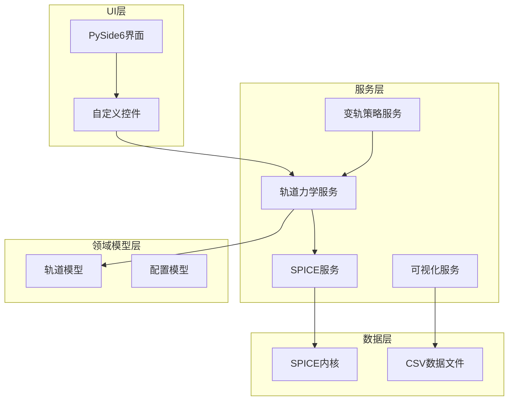

**图表来源**
- [README.md:187-196](file://README.md#L187-L196)
- [orbital_mechanics.py:1-25](file://src/smart/services/orbital_mechanics.py#L1-L25)

**章节来源**
- [README.md:187-196](file://README.md#L187-L196)

## 核心组件

### 轨道力学计算引擎

轨道力学计算引擎是系统的核心，提供了完整的轨道力学算法实现。该引擎基于经典轨道力学理论，实现了从基础的开普勒轨道参数到复杂的轨道机动计算的全方位功能。

主要功能模块包括：
- **轨道根数计算与转换**：支持六根数与状态矢量之间的相互转换
- **轨道机动计算**：包括脉冲变轨、Hohmann转移、Bielliptic转移
- **轨道动力学模拟**：二体问题求解、摄动分析、数值积分
- **轨道相交与交会**：目标轨道确定与最优交会方案

### 轨道初始化系统

轨道初始化系统负责从多种数据源获取轨道信息，包括经典轨道根数、TLE轨道根数和STK星历文件。该系统提供了灵活的数据导入机制，能够处理不同格式的轨道数据并将其标准化为统一的内部表示。

### SPICE集成服务

SPICE（Spacecraft Planet Instrument Cokinning Engineering Toolkit）集成为系统提供了精确的天体动力学计算能力。通过SPICE，系统能够进行高精度的位置、速度计算以及坐标系变换。

### 可视化与动画系统

系统提供了强大的可视化功能，包括2D轨道视图、3D轨道场景、科学数据曲线等。这些功能不仅支持静态展示，还能够生成动画效果，帮助用户更好地理解轨道运动规律。

**章节来源**
- [README.md:32-46](file://README.md#L32-L46)

## 架构概览

SMART系统的整体架构采用了分层设计原则，确保了各组件之间的松耦合和高内聚。

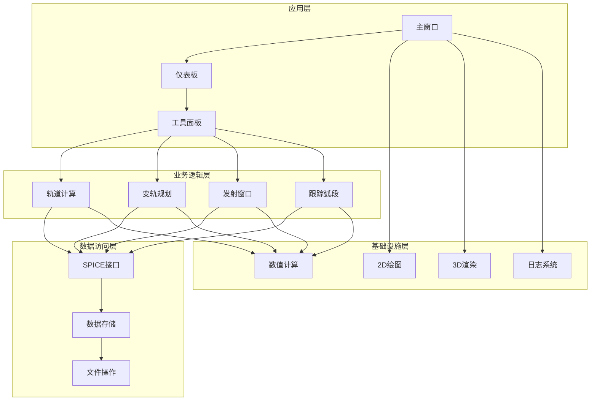

**图表来源**
- [README.md:48-54](file://README.md#L48-L54)

### 数据流架构

系统采用事件驱动的数据流架构，确保各个组件之间的数据传递高效可靠：

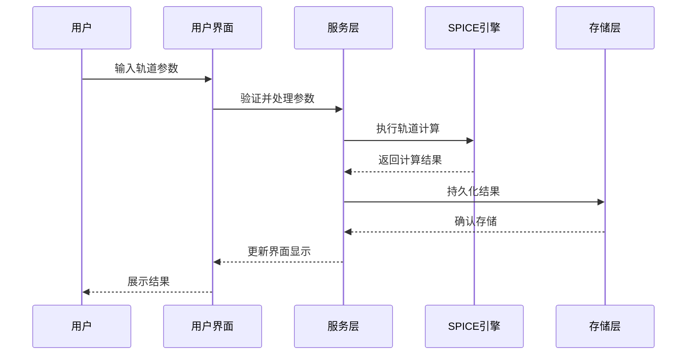

**图表来源**
- [spice_service.py:241-250](file://src/smart/services/spice_service.py#L241-L250)

## 详细组件分析

### 轨道根数计算与转换系统

轨道根数计算系统是轨道力学计算的基础，提供了完整的轨道参数转换功能。

#### 开普勒轨道参数体系

系统实现了标准的六根数轨道参数体系，包括：
- **半长轴 (a)**：决定轨道大小的基本参数
- **偏心率 (e)**：描述轨道形状的参数
- **轨道倾角 (i)**：轨道平面相对于参考平面的倾斜角度
- **升交点赤经 (Ω)**：升交点在参考坐标系中的方位角
- **近地点幅角 (ω)**：从升交点到近地点的角度
- **真近点角 (ν)**：从近地点到卫星位置的角度

#### 轨道根数与状态矢量转换

系统提供了双向转换功能，支持从轨道根数计算状态矢量，以及从状态矢量反推轨道根数。

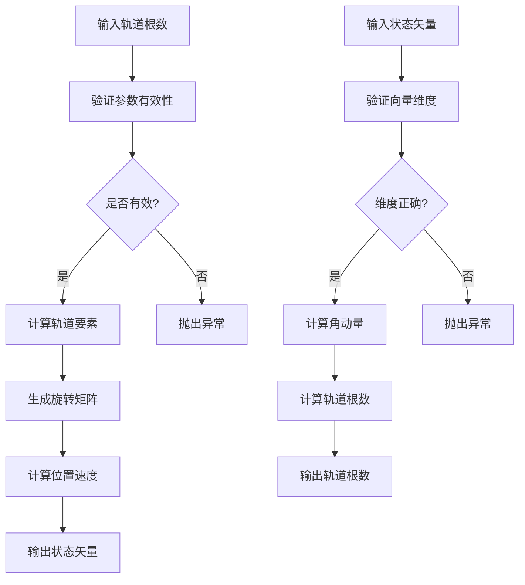

**图表来源**
- [orbital_mechanics.py:175-252](file://src/smart/services/orbital_mechanics.py#L175-L252)

**章节来源**
- [orbital_mechanics.py:29-173](file://src/smart/services/orbital_mechanics.py#L29-L173)

### 轨道机动计算系统

轨道机动计算系统实现了多种轨道机动类型的数学模型，为航天器变轨提供精确的计算支持。

#### 脉冲变轨计算

脉冲变轨是最常用的轨道机动方式，系统实现了精确的脉冲变轨计算模型：

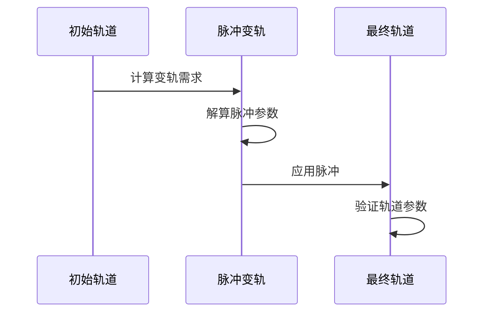

**图表来源**
- [orbital_mechanics.py:359-391](file://src/smart/services/orbital_mechanics.py#L359-L391)

#### Hohmann转移轨道计算

Hohmann转移是最经济的椭圆转移轨道，系统提供了完整的Hohmann转移计算功能：

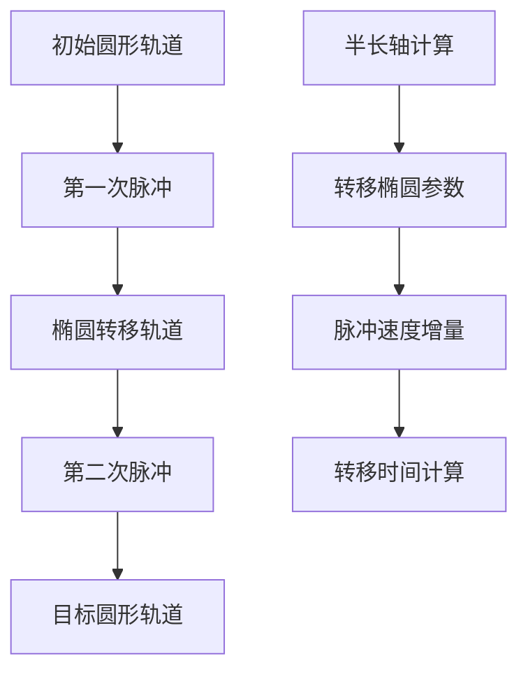

**图表来源**
- [orbital_mechanics.py:359-432](file://src/smart/services/orbital_mechanics.py#L359-L432)

**章节来源**
- [orbital_mechanics.py:359-432](file://src/smart/services/orbital_mechanics.py#L359-L432)

### 轨道动力学模拟系统

轨道动力学模拟系统基于二体问题理论，实现了精确的轨道演化计算。

#### 二体问题求解

系统实现了经典的二体问题求解算法，包括：

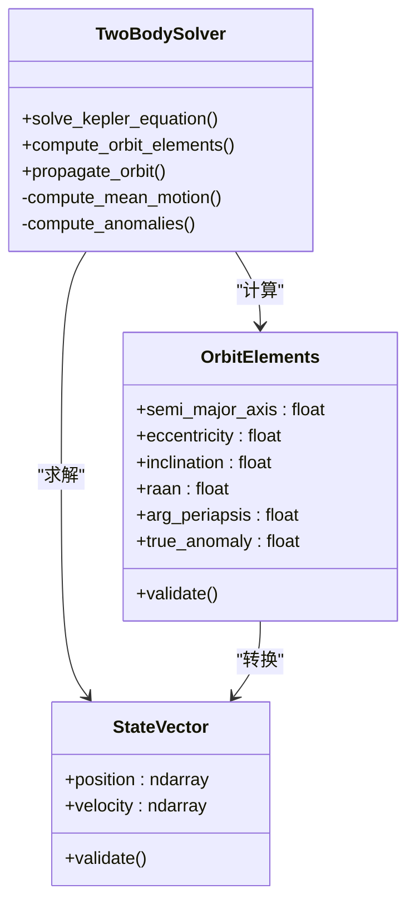

**图表来源**
- [satellite_dynamics_equation.py:362-398](file://scripts/satellite_dynamics_equation.py#L362-L398)

#### 数值积分方法

系统采用了多种数值积分方法来处理复杂的轨道动力学问题：

| 方法 | 特点 | 适用场景 |
|------|------|----------|
| RK4 | 四阶龙格-库塔法 | 一般轨道积分 |
| 梯形法 | 二阶精度 | 稳定性要求高的积分 |
| 后退欧拉法 | 一阶精度 | 强阻尼系统 |

**章节来源**
- [satellite_dynamics_equation.py:771-800](file://scripts/satellite_dynamics_equation.py#L771-L800)

### 轨道相交与交会计算

轨道相交与交会计算是航天任务中的重要环节，系统提供了精确的目标轨道确定和最优交会方案计算功能。

#### 目标轨道确定

系统实现了基于观测数据的目标轨道确定算法，包括：

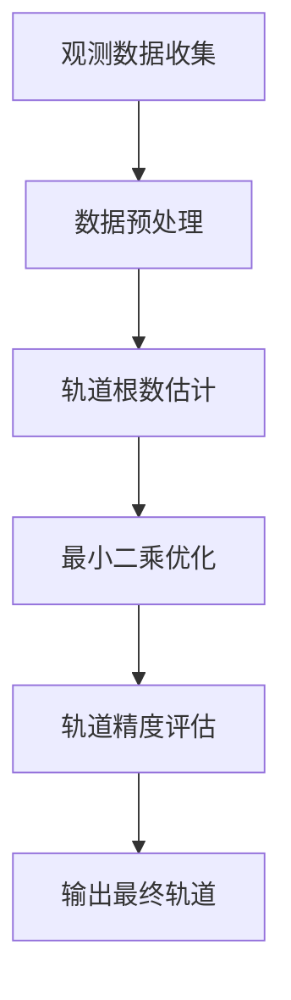

#### 最优交会方案

系统提供了多种最优交会方案的计算方法：

| 方案类型 | 数学模型 | 优势 | 局限性 |
|----------|----------|------|--------|
| Hohmann转移 | 椭圆转移轨道 | 燃料最省 | 时间较长 |
| Bielliptic转移 | 双椭圆转移 | 更省燃料 | 更复杂 |
| Lambert问题 | 两矢量问题 | 精确解 | 仅适用于瞬时变轨 |

**章节来源**
- [orbital_mechanics.py:555-621](file://src/smart/services/orbital_mechanics.py#L555-L621)

### 轨道初值计算系统

轨道初值计算系统提供了多种轨道确定方法，满足不同应用场景的需求。

#### 三矢量法

三矢量法是一种经典的轨道确定方法，通过三个观测时刻的位置矢量计算轨道根数：

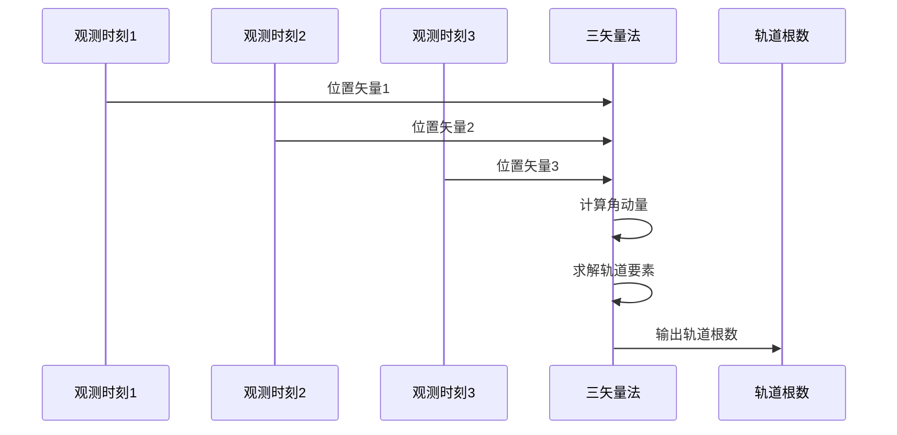

#### 四参数法

四参数法通过位置和速度的组合观测数据确定轨道：

#### 基于观测数据的轨道确定

系统支持多种观测数据格式，包括：

- **雷达观测**：距离、方位角、仰角、多普勒频移
- **光学观测**：星图、天体测量
- **无线电观测**：VLBI、DORIS

**章节来源**
- [orbit_initialization.py:81-129](file://src/smart/services/orbit_initialization.py#L81-L129)

### 轨道可视化与动画系统

轨道可视化系统提供了丰富的可视化功能，包括静态图表和动态动画。

#### 2D轨道视图

2D轨道视图提供了简洁直观的轨道展示功能：

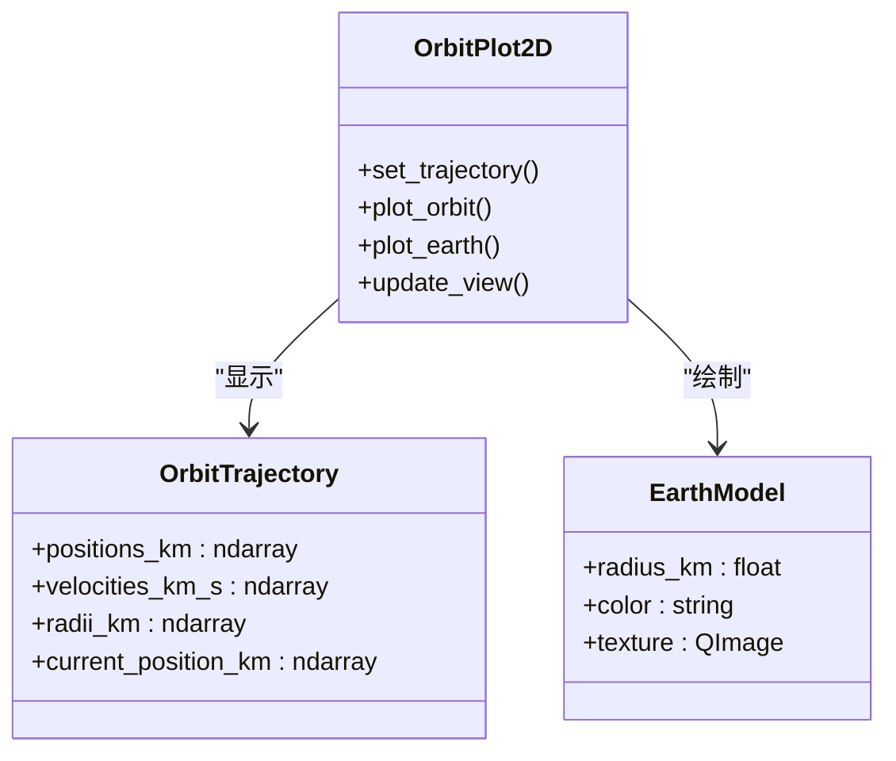

**图表来源**
- [orbit_views.py:104-154](file://src/smart/ui/widgets/orbit_views.py#L104-L154)

#### 3D轨道场景

3D轨道场景提供了沉浸式的轨道可视化体验：

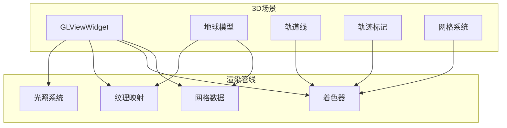

**图表来源**
- [orbit_views.py:212-285](file://src/smart/ui/widgets/orbit_views.py#L212-L285)

**章节来源**
- [orbit_views.py:104-547](file://src/smart/ui/widgets/orbit_views.py#L104-L547)

## 依赖关系分析

系统采用模块化设计，各组件之间的依赖关系清晰明确。

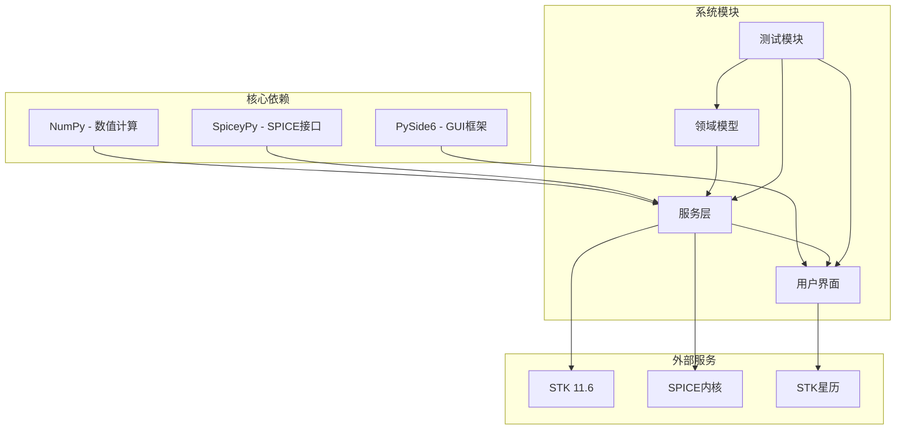

**图表来源**
- [README.md:50-54](file://README.md#L50-L54)

### 组件耦合度分析

系统在设计时遵循了低耦合高内聚的原则：

| 组件 | 耦合度 | 说明 |
|------|--------|------|
| 轨道力学服务 | 低 | 专注于轨道计算，独立性强 |
| SPICE服务 | 中等 | 依赖外部库，但接口清晰 |
| 可视化服务 | 低 | 独立的渲染模块 |
| 数据模型 | 低 | 纯数据结构，无业务逻辑 |
| UI组件 | 中等 | 与业务逻辑有交互，但保持分离 |

**章节来源**
- [README.md:48-55](file://README.md#L48-L55)

## 性能考虑

系统在设计时充分考虑了性能优化，采用了多种技术手段提升计算效率。

### 数值精度控制

系统实现了多层次的数值精度控制机制：

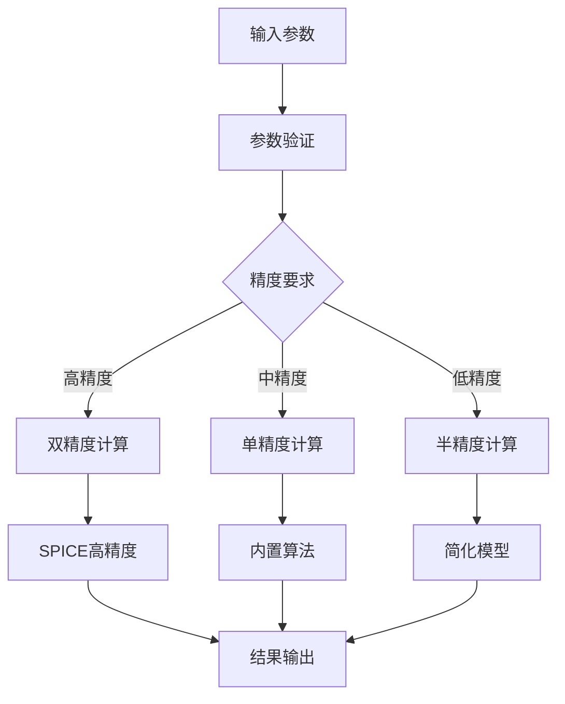

### 计算稳定性保障

系统采用了多种措施确保计算稳定性：

1. **数值稳定性算法**：使用稳定的数值方法避免计算误差累积
2. **边界条件处理**：对特殊轨道参数进行特殊处理
3. **异常检测机制**：实时监控计算过程中的异常情况
4. **容错恢复机制**：在出现错误时自动恢复到安全状态

### 并行计算优化

对于计算密集型任务，系统支持并行计算：

- **多线程计算**：利用多核CPU提升计算速度
- **向量化运算**：使用NumPy进行批量计算
- **GPU加速**：在支持的硬件上启用GPU计算

## 故障排除指南

### 常见问题诊断

系统提供了完善的错误处理和诊断机制：

#### 轨道计算错误

| 错误类型 | 可能原因 | 解决方案 |
|----------|----------|----------|
| 轨道根数无效 | 参数超出物理范围 | 检查输入参数范围 |
| 计算不收敛 | 初始猜测值不当 | 使用更好的初始值 |
| 数值不稳定 | 浮点数精度问题 | 提高精度设置 |

#### SPICE集成问题

| 问题类型 | 症状 | 解决方案 |
|----------|------|----------|
| 内核加载失败 | SPICE服务不可用 | 检查内核文件完整性 |
| 坐标系转换错误 | 位置计算偏差 | 验证坐标系定义 |
| 时间转换异常 | UTC/ET转换失败 | 检查时间格式 |

**章节来源**
- [spice_service.py:24-26](file://src/smart/services/spice_service.py#L24-L26)

### 调试工具

系统提供了多种调试工具帮助开发者定位问题：

1. **日志系统**：详细的计算过程记录
2. **断点调试**：支持在关键计算点设置断点
3. **性能分析**：计算时间统计和瓶颈识别
4. **内存监控**：内存使用情况跟踪

## 结论

SMART轨道力学计算服务是一个功能完整、架构清晰的航天任务分析系统。该系统通过集成SPICE引擎、提供丰富的轨道计算算法、实现高质量的可视化功能，在轨道力学计算领域提供了专业的解决方案。

系统的主要优势包括：

1. **算法完整性**：涵盖了从基础轨道计算到高级变轨策略的完整算法族
2. **集成度高**：将多个专业工具的功能整合到统一平台
3. **用户体验好**：提供直观的图形界面和丰富的可视化功能
4. **扩展性强**：模块化设计便于功能扩展和定制

未来的发展方向包括：

- 进一步优化计算性能，支持更大规模的轨道分析
- 增强机器学习算法的应用，提供智能化的轨道设计建议
- 扩展支持更多的航天器类型和任务场景
- 提升与其他航天软件的兼容性和互操作性

## 附录

### 支持的轨道类型

系统支持以下主要轨道类型：

| 轨道类型 | 特征参数 | 应用场景 |
|----------|----------|----------|
| 圆形轨道 | e=0, i=0 | 低地球轨道、同步轨道 |
| 椭圆轨道 | 0<e<1, 0≤i≤180° | 转移轨道、椭圆轨道 |
| 抛物线轨道 | e=1 | 逃逸轨道 |
| 双曲线轨道 | e>1 | 飞越任务 |

### 数值计算精度

系统在不同精度级别下的性能表现：

| 精度级别 | 计算速度 | 内存占用 | 适用场景 |
|----------|----------|----------|----------|
| 高精度 | 慢 | 大 | 科研计算、高精度仿真 |
| 中精度 | 中等 | 中等 | 工程设计、常规分析 |
| 低精度 | 快 | 小 | 实时仿真、快速评估 |

### 接口规范

系统对外部接口的规范定义：

- **SPICE接口**：遵循标准SPICE协议
- **STK接口**：支持STK 11.6及以上版本
- **文件格式**：CSV、JSON、XML等标准格式
- **通信协议**：HTTP REST API、WebSocket实时通信