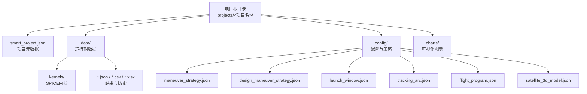
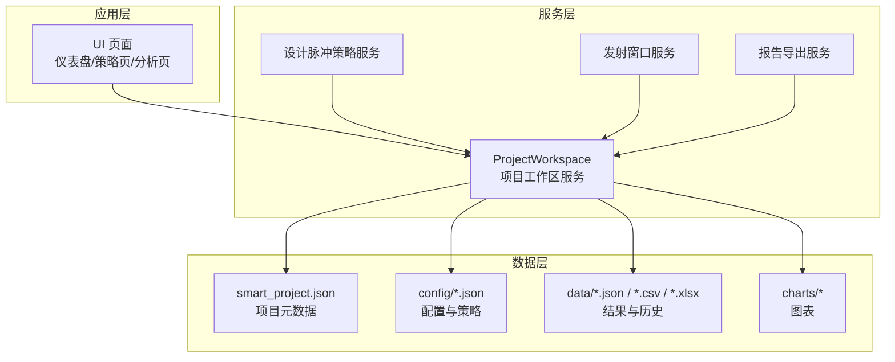
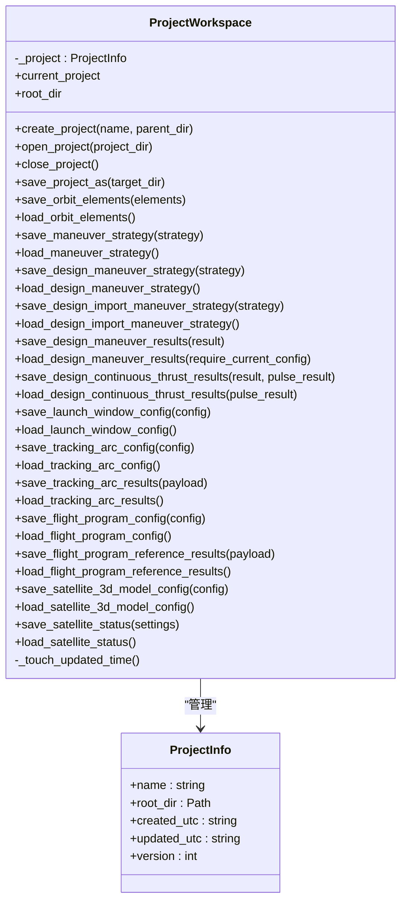
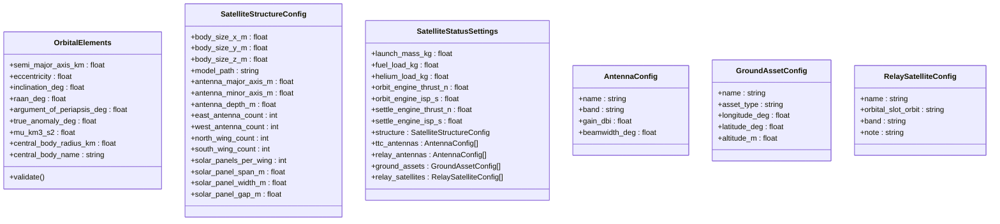
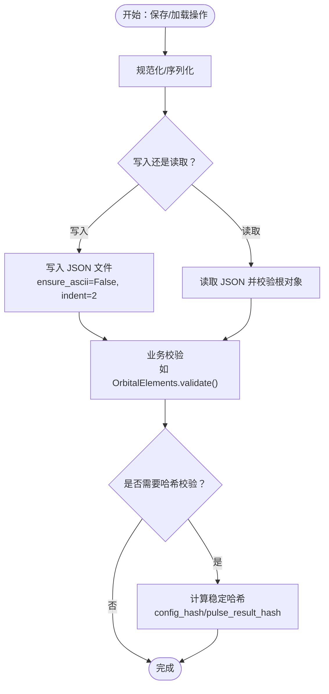
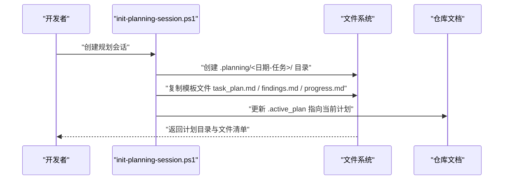
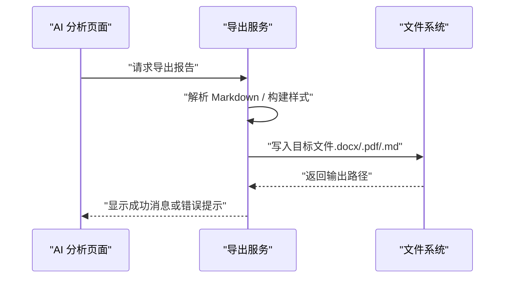
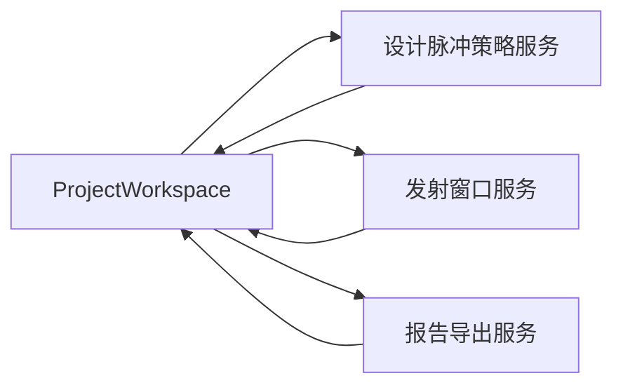

# 项目工作区服务

<cite>
**本文引用的文件**
- [project_workspace.py](file://src/smart/services/project_workspace.py)
- [models.py](file://src/smart/domain/models.py)
- [design_maneuver_strategy.py](file://src/smart/services/design_maneuver_strategy.py)
- [launch_window.py](file://src/smart/services/launch_window.py)
- [pdf_report_export.py](file://src/smart/services/pdf_report_export.py)
- [report_export.py](file://src/smart/services/report_export.py)
- [test_project_workspace.py](file://tests/test_project_workspace.py)
- [main.py](file://src/smart/main.py)
- [app_runtime.py](file://src/smart/app_runtime.py)
- [init-planning-session.ps1](file://scripts/init-planning-session.ps1)
- [planning_workflow.md](file://doc/planning_workflow.md)
- [module_catalog.py](file://src/smart/services/module_catalog.py)
</cite>

## 目录
1. [简介](#简介)
2. [项目结构](#项目结构)
3. [核心组件](#核心组件)
4. [架构总览](#架构总览)
5. [详细组件分析](#详细组件分析)
6. [依赖分析](#依赖分析)
7. [性能考虑](#性能考虑)
8. [故障排查指南](#故障排查指南)
9. [结论](#结论)
10. [附录](#附录)

## 简介
本文件系统性阐述 SMART 项目工作区服务的设计与实现，聚焦于项目文件系统架构、状态持久化机制、模板系统、数据模型映射、导入导出能力以及工作流最佳实践与安全性策略。通过对核心模块的代码级分析，帮助读者快速理解如何在复杂航天任务中高效管理项目数据与流程。

## 项目结构
SMART 采用“项目即文件系统”的理念，每个项目是一个独立目录，内部按功能划分子目录与文件，确保数据与配置清晰分离、可迁移且可审计。

- 根目录
  - projects/<项目名>/：项目根目录
    - smart_project.json：项目元数据（名称、版本、创建/更新时间）
    - data/：运行期数据与中间结果
      - kernels/：SPICE内核文件
      - *.json / *.csv / *.xlsx：各类结果与历史数据
    - config/：配置与策略文件
      - maneuver_strategy.json：脉冲变轨策略
      - design_maneuver_strategy.json：设计脉冲策略（含初始/目标轨道与规划器版本）
      - launch_window.json：发射窗口配置
      - tracking_arc.json：跟踪弧段配置
      - flight_program.json：飞行程序配置
      - satellite_3d_model.json：卫星3D模型配置（替代旧版卫星状态）
    - charts/：可视化图表
    - 其他生成文件：如 AI 分析报告、导出报表等

**图表来源**
- [project_workspace.py:82-127](file://src/smart/services/project_workspace.py#L82-L127)
- [project_workspace.py:156-212](file://src/smart/services/project_workspace.py#L156-L212)

**章节来源**
- [project_workspace.py:33-53](file://src/smart/services/project_workspace.py#L33-L53)
- [project_workspace.py:82-127](file://src/smart/services/project_workspace.py#L82-L127)

## 核心组件
- 项目信息模型：ProjectInfo，封装项目名称、根路径、创建/更新时间与版本号。
- 工作区服务：ProjectWorkspace，负责项目生命周期管理（创建/打开/关闭）、目录结构初始化、文件读写与元数据维护。
- 数据模型：域模型定义了轨道元素、卫星结构与状态、天线/地面资产/中继星配置等，用于序列化与反序列化。
- 策略与结果：设计脉冲策略、连续推力优化结果、发射窗口配置与结果、跟踪弧段配置与结果、飞行程序配置与参考结果等。
- 导出服务：Markdown/DOCX/PDF 报告导出，统一格式标准化与错误恢复。

**章节来源**
- [project_workspace.py:55-62](file://src/smart/services/project_workspace.py#L55-L62)
- [project_workspace.py:64-131](file://src/smart/services/project_workspace.py#L64-L131)
- [models.py:17-255](file://src/smart/domain/models.py#L17-L255)
- [design_maneuver_strategy.py:42-120](file://src/smart/services/design_maneuver_strategy.py#L42-L120)
- [launch_window.py:54-135](file://src/smart/services/launch_window.py#L54-L135)
- [report_export.py:22-41](file://src/smart/services/report_export.py#L22-L41)
- [pdf_report_export.py:84-158](file://src/smart/services/pdf_report_export.py#L84-L158)

## 架构总览
项目工作区服务以“文件系统为中心”的架构组织数据与配置，结合严格的 JSON 序列化与校验机制，确保跨模块数据一致性与可恢复性。

**图表来源**
- [project_workspace.py:64-131](file://src/smart/services/project_workspace.py#L64-L131)
- [design_maneuver_strategy.py:122-188](file://src/smart/services/design_maneuver_strategy.py#L122-L188)
- [launch_window.py:156-192](file://src/smart/services/launch_window.py#L156-L192)
- [report_export.py:22-41](file://src/smart/services/report_export.py#L22-L41)

## 详细组件分析

### 项目工作区服务（ProjectWorkspace）
- 职责
  - 项目生命周期管理：创建、打开、关闭、另存为复制。
  - 目录结构初始化：自动创建 data、data/kernels、charts、config 等目录。
  - 文件读写：提供统一的 JSON 读写函数，确保编码与缩进规范。
  - 元数据维护：更新 smart_project.json 的 updated_utc 字段。
  - 数据一致性：通过稳定哈希（config_hash/pulse_result_hash）避免过期或混用结果。
- 关键接口
  - create_project：创建项目并初始化默认配置文件。
  - open_project/save_project_as：打开现有项目或复制到新位置。
  - 各类 save/load 方法：轨道元素、脉冲/连续推力策略、发射窗口、跟踪弧段、飞行程序、卫星3D模型等。
- 安全与健壮性
  - 输入校验：空项目名、重复目录、目标目录为当前项目子目录等均抛出异常。
  - JSON 校验：读取时强制要求根为对象，否则抛出异常。
  - 元数据版本：项目元数据包含 version 字段，便于未来演进。

**图表来源**
- [project_workspace.py:64-131](file://src/smart/services/project_workspace.py#L64-L131)
- [project_workspace.py:55-62](file://src/smart/services/project_workspace.py#L55-L62)

**章节来源**
- [project_workspace.py:82-127](file://src/smart/services/project_workspace.py#L82-L127)
- [project_workspace.py:132-154](file://src/smart/services/project_workspace.py#L132-L154)
- [project_workspace.py:213-298](file://src/smart/services/project_workspace.py#L213-L298)
- [project_workspace.py:300-396](file://src/smart/services/project_workspace.py#L300-L396)
- [project_workspace.py:398-626](file://src/smart/services/project_workspace.py#L398-L626)
- [project_workspace.py:654-661](file://src/smart/services/project_workspace.py#L654-L661)

### 数据模型映射与持久化
- 领域模型
  - OrbitalElements：轨道六根数与中心体参数。
  - SatelliteStructureConfig/SatelliteStatusSettings：卫星结构与状态配置。
  - AntennaConfig/GroundAssetConfig/RelaySatelliteConfig：通信与地面/中继资源。
- 映射策略
  - 读写时将 dataclass 转换为字典，或从字典构造 dataclass。
  - 对旧字段（如 dae_model_path）进行兼容处理。
  - 统一数值类型转换（float/int），字符串字段严格校验。
- 版本与兼容
  - 通过 smart_project.json 的 version 字段标识项目版本，便于后续迁移。
  - 加载旧数据时保留默认值，避免缺失字段导致崩溃。

**图表来源**
- [models.py:17-255](file://src/smart/domain/models.py#L17-L255)

**章节来源**
- [models.py:17-255](file://src/smart/domain/models.py#L17-L255)
- [project_workspace.py:698-764](file://src/smart/services/project_workspace.py#L698-L764)
- [project_workspace.py:726-764](file://src/smart/services/project_workspace.py#L726-L764)

### 项目状态持久化机制
- JSON 序列化
  - 统一使用 ensure_ascii=False、indent=2 的写入格式，便于人工审阅与版本对比。
  - 读取时强制检查根对象类型，防止非对象 JSON 导致解析错误。
- 数据验证
  - OrbitalElements.validate：校验半长轴、偏心率与近地点高度约束。
  - 设计脉冲/连续推力结果加载时，通过 config_hash/pulse_result_hash 校验输入一致性。
- 版本兼容
  - 项目元数据包含 version 字段；卫星状态从旧版 satellite_status.json 迁移到新版 satellite_3d_model.json，并删除遗留文件。
  - 发射窗口/跟踪弧段配置共享同一规范化流程，确保字段一致性。

**图表来源**
- [project_workspace.py:667-683](file://src/smart/services/project_workspace.py#L667-L683)
- [project_workspace.py:673-675](file://src/smart/services/project_workspace.py#L673-L675)
- [project_workspace.py:287-298](file://src/smart/services/project_workspace.py#L287-L298)
- [project_workspace.py:316-330](file://src/smart/services/project_workspace.py#L316-L330)
- [models.py:29-36](file://src/smart/domain/models.py#L29-L36)

**章节来源**
- [project_workspace.py:667-683](file://src/smart/services/project_workspace.py#L667-L683)
- [project_workspace.py:287-298](file://src/smart/services/project_workspace.py#L287-L298)
- [project_workspace.py:316-330](file://src/smart/services/project_workspace.py#L316-L330)
- [models.py:29-36](file://src/smart/domain/models.py#L29-L36)

### 项目模板系统
- 模板创建
  - 使用脚本初始化规划会话，自动生成 task_plan.md、findings.md、progress.md，便于团队协作与知识沉淀。
- 参数化配置
  - 设计脉冲策略、发射窗口、跟踪弧段等配置均以 JSON 形式存储，支持参数化编辑与版本化管理。
- 批量生成
  - 通过服务层工具（如 mission_agent_tools）批量执行策略规划与结果导出，减少重复劳动。

**图表来源**
- [init-planning-session.ps1:25-47](file://scripts/init-planning-session.ps1#L25-L47)
- [planning_workflow.md:27-47](file://doc/planning_workflow.md#L27-L47)

**章节来源**
- [init-planning-session.ps1:25-47](file://scripts/init-planning-session.ps1#L25-L47)
- [planning_workflow.md:27-47](file://doc/planning_workflow.md#L27-L47)

### 项目数据模型映射
- 领域模型转换
  - 将 dataclass 转换为字典（序列化）与从字典构造 dataclass（反序列化）。
  - 对卫星结构配置中的旧字段（如 dae_model_path）进行兼容映射。
- 数据迁移
  - 从旧版 satellite_status.json 迁移至新版 satellite_3d_model.json，并清理遗留文件。
- 一致性保证
  - 通过稳定哈希与规范化流程，确保设计脉冲/连续推力结果与当前配置一致，避免误用过期数据。

**章节来源**
- [project_workspace.py:698-764](file://src/smart/services/project_workspace.py#L698-L764)
- [project_workspace.py:726-764](file://src/smart/services/project_workspace.py#L726-L764)
- [project_workspace.py:398-413](file://src/smart/services/project_workspace.py#L398-L413)

### 项目导入导出功能
- 数据格式标准化
  - Markdown/DOCX/PDF 报告导出：统一解析与渲染，支持表格、代码块与样式。
  - 导出前进行符号归一化与字体注册，确保跨平台一致性。
- 错误恢复机制
  - 导出失败时捕获异常并提示用户，保留已生成部分或回退到默认方案。
  - PDF 导出对无效强调色进行回退处理，避免渲染异常。

**图表来源**
- [report_export.py:22-41](file://src/smart/services/report_export.py#L22-L41)
- [pdf_report_export.py:84-158](file://src/smart/services/pdf_report_export.py#L84-L158)
- [ai_project_analysis_page.py:897-920](file://src/smart/ui/widgets/ai_project_analysis_page.py#L897-L920)

**章节来源**
- [report_export.py:22-41](file://src/smart/services/report_export.py#L22-L41)
- [pdf_report_export.py:84-158](file://src/smart/services/pdf_report_export.py#L84-L158)
- [ai_project_analysis_page.py:897-920](file://src/smart/ui/widgets/ai_project_analysis_page.py#L897-L920)

### 项目工作流最佳实践
- 规划先行：使用 .planning 目录存放阶段性成果，避免将临时调试信息写入永久文档。
- 配置即代码：将策略配置（如 maneuver_strategy.json、launch_window.json）纳入版本控制，便于回溯与复现。
- 结果归档：设计脉冲与连续推力结果自动归档，配合哈希校验避免误用过期数据。
- 可视化与审计：利用 charts 与导出报告形成闭环，定期审计项目状态与关键指标。

**章节来源**
- [planning_workflow.md:27-47](file://doc/planning_workflow.md#L27-L47)
- [project_workspace.py:277-298](file://src/smart/services/project_workspace.py#L277-L298)
- [project_workspace.py:300-330](file://src/smart/services/project_workspace.py#L300-L330)

### 项目安全性与权限控制策略
- 访问控制
  - 项目工作区服务不直接处理用户认证与授权，建议在上层 UI 层引入权限控制（如只读/编辑模式）。
- 数据隔离
  - 每个项目独立目录，避免跨项目数据污染；另存为复制时禁止目标位于当前项目内部。
- 完整性保障
  - JSON 读写统一校验，拒绝非对象根；哈希校验确保结果与配置匹配。
- 运行环境
  - 应用启动时统一图形后端与 WebEngine 配置，减少因环境差异导致的渲染与交互问题。

**章节来源**
- [project_workspace.py:132-154](file://src/smart/services/project_workspace.py#L132-L154)
- [project_workspace.py:678-683](file://src/smart/services/project_workspace.py#L678-L683)
- [project_workspace.py:673-675](file://src/smart/services/project_workspace.py#L673-L675)
- [app_runtime.py:31-91](file://src/smart/app_runtime.py#L31-L91)

## 依赖分析
- 模块耦合
  - ProjectWorkspace 与各服务（设计脉冲、发射窗口、报告导出）松耦合，通过 JSON 文件作为契约。
  - 设计脉冲与连续推力结果相互依赖（连续推力依赖脉冲结果哈希），形成弱依赖链。
- 外部依赖
  - JSON 序列化、文件系统操作、报告导出依赖第三方库（如 reportlab、zipfile）。
- 循环依赖
  - 未发现循环导入；服务间通过文件契约传递数据。

**图表来源**
- [project_workspace.py:64-131](file://src/smart/services/project_workspace.py#L64-L131)
- [design_maneuver_strategy.py:122-188](file://src/smart/services/design_maneuver_strategy.py#L122-L188)
- [launch_window.py:156-192](file://src/smart/services/launch_window.py#L156-L192)
- [report_export.py:22-41](file://src/smart/services/report_export.py#L22-L41)

**章节来源**
- [project_workspace.py:64-131](file://src/smart/services/project_workspace.py#L64-L131)
- [design_maneuver_strategy.py:122-188](file://src/smart/services/design_maneuver_strategy.py#L122-L188)
- [launch_window.py:156-192](file://src/smart/services/launch_window.py#L156-L192)
- [report_export.py:22-41](file://src/smart/services/report_export.py#L22-L41)

## 性能考虑
- I/O 优化
  - 统一的文件写入与读取路径，避免重复解析与转换。
  - 哈希计算仅在必要场景触发（如结果加载时），减少不必要的 CPU 开销。
- 导出性能
  - PDF/DOCX 导出采用流式构建与缓存字体注册，降低重复开销。
- 图形与渲染
  - 应用启动时统一图形后端，避免在不同后端之间切换带来的额外成本。

[本节为通用指导，无需特定文件引用]

## 故障排查指南
- 项目元数据缺失
  - 现象：打开项目时报错缺少 smart_project.json。
  - 处理：确认项目根目录存在该文件，或重新创建项目。
- JSON 解析错误
  - 现象：读取 JSON 文件时报“无效 JSON 对象”。
  - 处理：检查文件是否被外部工具破坏，或手动修复为合法对象。
- 结果加载为空
  - 现象：设计脉冲/连续推力结果加载为 None。
  - 处理：确认当前配置哈希与结果元数据一致；必要时重新生成结果。
- 导出失败
  - 现象：导出 DOCX/PDF 报告失败。
  - 处理：查看错误提示，修正 Markdown 格式或字体注册问题；必要时回退到 Markdown 导出。

**章节来源**
- [project_workspace.py:641-652](file://src/smart/services/project_workspace.py#L641-L652)
- [project_workspace.py:678-683](file://src/smart/services/project_workspace.py#L678-L683)
- [project_workspace.py:287-298](file://src/smart/services/project_workspace.py#L287-L298)
- [project_workspace.py:316-330](file://src/smart/services/project_workspace.py#L316-L330)
- [pdf_report_export.py:161-170](file://src/smart/services/pdf_report_export.py#L161-L170)

## 结论
项目工作区服务通过“文件系统即数据契约”的设计，实现了航天任务项目的数据持久化、版本兼容与可审计性。结合模板化工作流与报告导出能力，能够有效支撑复杂任务的长期演进与团队协作。建议在实际使用中强化权限控制与备份策略，确保项目数据的安全与可恢复。

[本节为总结性内容，无需特定文件引用]

## 附录
- 模块状态概览：提供模块目录与状态描述，便于识别当前可用与计划中的功能模块。

**章节来源**
- [module_catalog.py:12-42](file://src/smart/services/module_catalog.py#L12-L42)