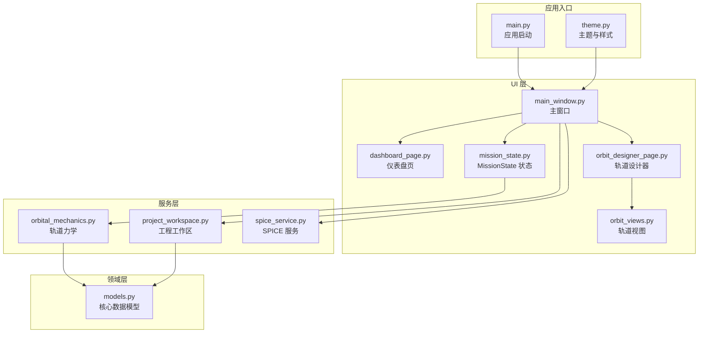
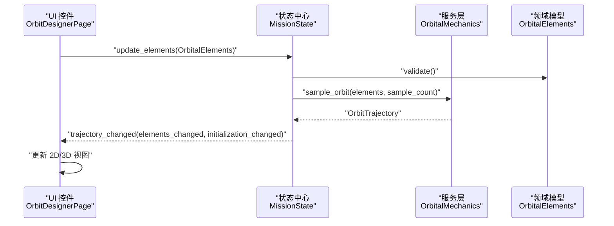
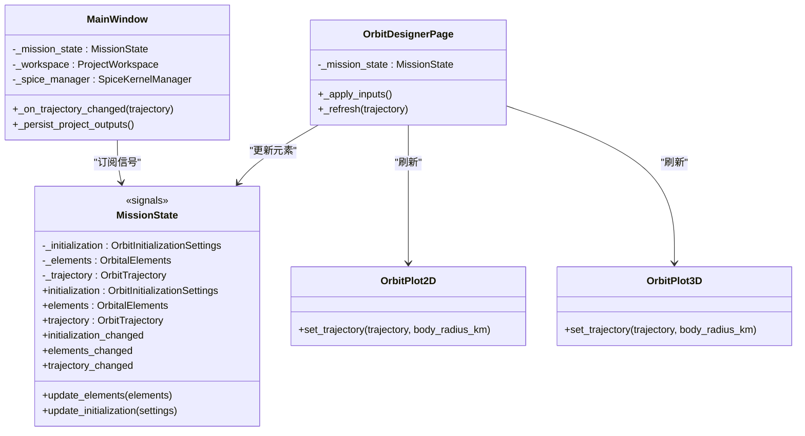
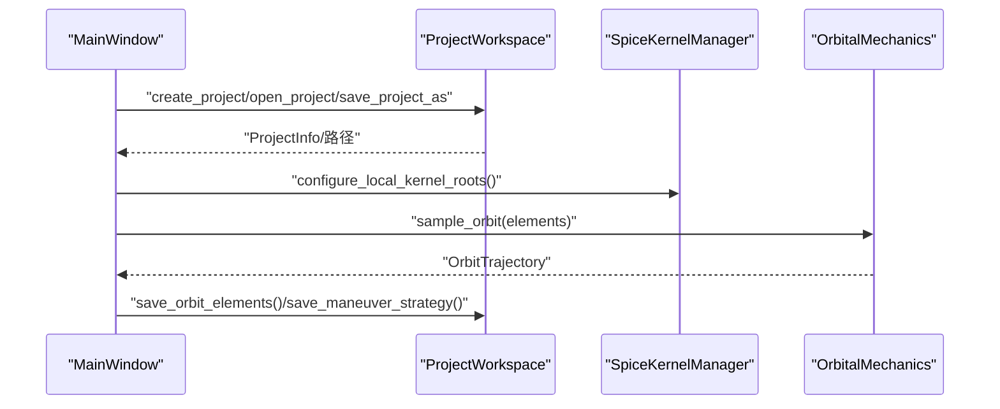
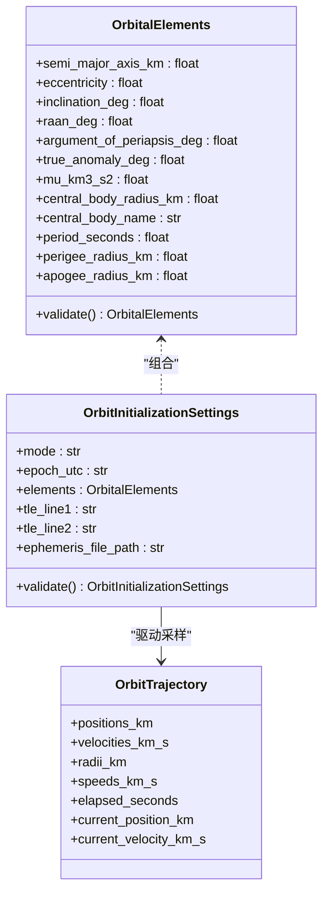
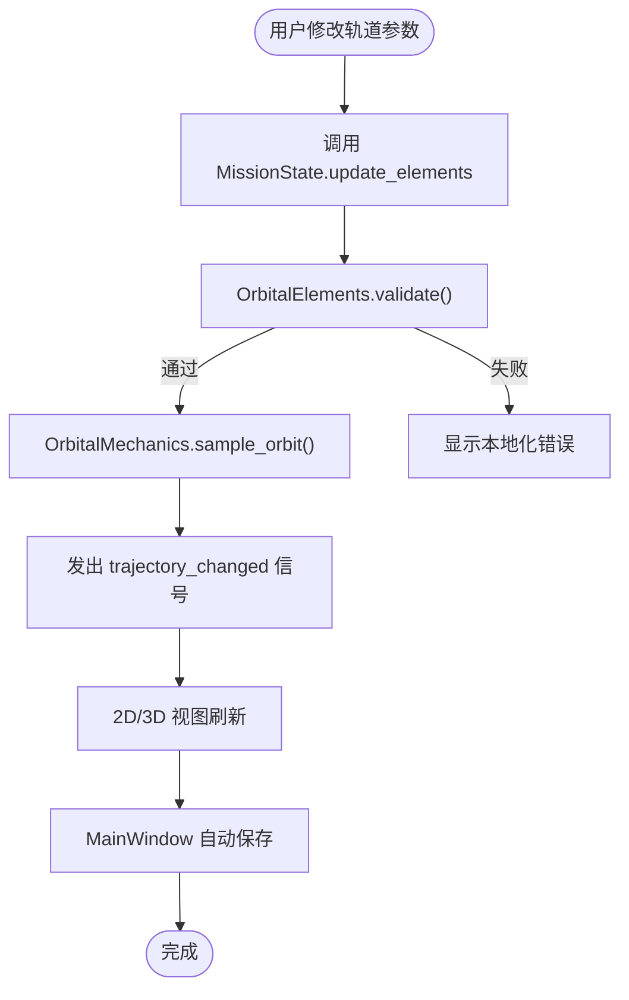
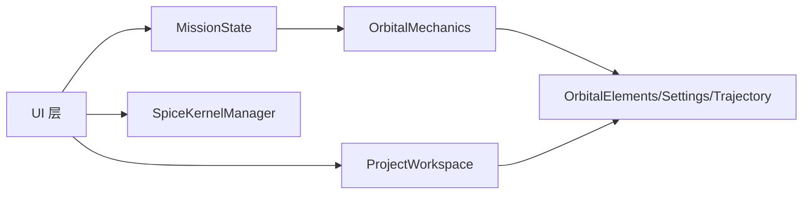

# 分层架构设计

<cite>
**本文引用的文件**
- [mission_state.py](file://src/smart/ui/mission_state.py)
- [models.py](file://src/smart/domain/models.py)
- [main_window.py](file://src/smart/ui/main_window.py)
- [orbital_mechanics.py](file://src/smart/services/orbital_mechanics.py)
- [project_workspace.py](file://src/smart/services/project_workspace.py)
- [spice_service.py](file://src/smart/services/spice_service.py)
- [dashboard_page.py](file://src/smart/ui/widgets/dashboard_page.py)
- [orbit_designer_page.py](file://src/smart/ui/widgets/orbit_designer_page.py)
- [orbit_views.py](file://src/smart/ui/widgets/orbit_views.py)
- [main.py](file://src/smart/main.py)
- [theme.py](file://src/smart/ui/theme.py)
</cite>

## 目录
1. [引言](#引言)
2. [项目结构](#项目结构)
3. [核心组件](#核心组件)
4. [架构总览](#架构总览)
5. [详细组件分析](#详细组件分析)
6. [依赖关系分析](#依赖关系分析)
7. [性能考虑](#性能考虑)
8. [故障排除指南](#故障排除指南)
9. [结论](#结论)

## 引言
本文件系统性梳理 SMART 项目的分层架构设计，明确 UI 层、服务层与领域层的职责边界与协作方式；深入解析 UI 层基于 MVVM 思想的状态管理（MissionState）、信号槽机制与数据绑定；阐述服务层对业务逻辑的封装、服务注册与生命周期管理；并总结领域层数据模型的设计原则与约束校验。最后给出层间交互流程、错误处理策略与最佳实践建议。

## 项目结构
SMART 采用典型的三层架构组织代码：
- UI 层：负责用户界面、事件处理、数据绑定与可视化渲染
- 服务层：封装业务逻辑、外部依赖（如 SPICE）与持久化
- 领域层：定义核心数据模型与不变量校验规则

**图表来源**
- [main.py:1-36](file://src/smart/main.py#L1-L36)
- [theme.py:1-519](file://src/smart/ui/theme.py#L1-L519)
- [main_window.py:1-781](file://src/smart/ui/main_window.py#L1-L781)
- [dashboard_page.py:1-984](file://src/smart/ui/widgets/dashboard_page.py#L1-L984)
- [orbit_designer_page.py:1-249](file://src/smart/ui/widgets/orbit_designer_page.py#L1-L249)
- [orbit_views.py:1-547](file://src/smart/ui/widgets/orbit_views.py#L1-L547)
- [mission_state.py:1-45](file://src/smart/ui/mission_state.py#L1-L45)
- [project_workspace.py:1-920](file://src/smart/services/project_workspace.py#L1-L920)
- [orbital_mechanics.py:1-780](file://src/smart/services/orbital_mechanics.py#L1-L780)
- [spice_service.py:1-305](file://src/smart/services/spice_service.py#L1-L305)
- [models.py:1-255](file://src/smart/domain/models.py#L1-L255)

**章节来源**
- [main.py:1-36](file://src/smart/main.py#L1-L36)
- [theme.py:1-519](file://src/smart/ui/theme.py#L1-L519)
- [main_window.py:1-781](file://src/smart/ui/main_window.py#L1-L781)

## 核心组件
- UI 层核心
  - 主窗口 MainWindow：聚合页面、项目工作区、SPICE 管理器与 MissionState，统一处理项目生命周期与自动保存
  - MissionState：以 Qt 信号槽驱动的状态对象，封装轨道初始化设置、轨道元素与轨迹采样
  - 轨道设计器 OrbitDesignerPage：双向绑定轨道元素输入与 MissionState，实时更新 2D/3D 轨道视图
  - 可视化视图 OrbitPlot2D/OrbitPlot3D：基于 pyqtgraph 的高性能渲染组件
- 服务层核心
  - ProjectWorkspace：项目文件系统抽象、JSON 持久化与元数据管理
  - OrbitalMechanics：轨道力学计算、异常降级与 SPICE 集成
  - SpiceService：SPICE 运行时检测、内核加载与坐标变换
- 领域层核心
  - OrbitalElements/OrbitInitializationSettings/OrbitTrajectory 等数据模型，内置严格校验与派生指标

**章节来源**
- [mission_state.py:1-45](file://src/smart/ui/mission_state.py#L1-L45)
- [main_window.py:1-781](file://src/smart/ui/main_window.py#L1-L781)
- [orbit_designer_page.py:1-249](file://src/smart/ui/widgets/orbit_designer_page.py#L1-L249)
- [orbit_views.py:1-547](file://src/smart/ui/widgets/orbit_views.py#L1-L547)
- [project_workspace.py:1-920](file://src/smart/services/project_workspace.py#L1-L920)
- [orbital_mechanics.py:1-780](file://src/smart/services/orbital_mechanics.py#L1-L780)
- [spice_service.py:1-305](file://src/smart/services/spice_service.py#L1-L305)
- [models.py:1-255](file://src/smart/domain/models.py#L1-L255)

## 架构总览
SMART 采用“事件驱动 + 数据驱动”的 MVVM 风格：
- Model：领域模型与服务层数据结构
- View：UI 组件与可视化视图
- ViewModel：MissionState 作为状态中心，提供属性与信号
- 事件流：UI 输入触发 MissionState 更新，服务层计算结果回写到状态，视图订阅信号自动刷新

**图表来源**
- [mission_state.py:34-45](file://src/smart/ui/mission_state.py#L34-L45)
- [orbital_mechanics.py:277-310](file://src/smart/services/orbital_mechanics.py#L277-L310)
- [orbit_designer_page.py:150-167](file://src/smart/ui/widgets/orbit_designer_page.py#L150-L167)
- [orbit_views.py:137-154](file://src/smart/ui/widgets/orbit_views.py#L137-L154)

## 详细组件分析

### UI 层：MVVM 与 MissionState 状态管理
- 设计原则
  - 单向数据流：UI 仅触发动作，状态变更通过信号广播
  - 响应式更新：视图订阅信号，自动刷新显示
  - 输入校验前置：在状态层进行领域校验，避免无效状态传播
- 关键实现
  - 信号槽：initialization_changed/elements_changed/trajectory_changed
  - 状态更新：update_elements/update_initialization 原子性地重算轨迹并发出信号
  - 与主窗口联动：主窗口监听轨迹变化进行自动保存

**图表来源**
- [mission_state.py:11-45](file://src/smart/ui/mission_state.py#L11-L45)
- [main_window.py:601-632](file://src/smart/ui/main_window.py#L601-L632)
- [orbit_designer_page.py:20-80](file://src/smart/ui/widgets/orbit_designer_page.py#L20-L80)
- [orbit_views.py:104-154](file://src/smart/ui/widgets/orbit_views.py#L104-L154)

**章节来源**
- [mission_state.py:1-45](file://src/smart/ui/mission_state.py#L1-L45)
- [main_window.py:601-632](file://src/smart/ui/main_window.py#L601-L632)
- [orbit_designer_page.py:150-167](file://src/smart/ui/widgets/orbit_designer_page.py#L150-L167)
- [orbit_views.py:137-154](file://src/smart/ui/widgets/orbit_views.py#L137-L154)

### 服务层：业务封装、依赖注入与生命周期
- 依赖注入
  - 通过构造函数注入：MainWindow 注入 ProjectWorkspace、StkLinkService、SpiceKernelManager
  - 工厂注入：飞行计划页面通过 lambda 注入服务实例
- 生命周期管理
  - 项目打开/关闭：激活/释放 ProjectWorkspace，清理 SPICE 内核
  - 自动保存：监听 MissionState 与页面变更，按需落盘
- 服务职责
  - ProjectWorkspace：项目目录结构、JSON 文件读写、元数据维护
  - OrbitalMechanics：轨道采样、开普勒/拉格朗日等算法、SPICE 回退
  - SpiceService：SPICE 可用性检测、内核发现与加载、时间/坐标转换

**图表来源**
- [main_window.py:534-580](file://src/smart/ui/main_window.py#L534-L580)
- [project_workspace.py:82-116](file://src/smart/services/project_workspace.py#L82-L116)
- [spice_service.py:200-221](file://src/smart/services/spice_service.py#L200-L221)
- [orbital_mechanics.py:277-310](file://src/smart/services/orbital_mechanics.py#L277-L310)

**章节来源**
- [main_window.py:53-131](file://src/smart/ui/main_window.py#L53-L131)
- [project_workspace.py:64-131](file://src/smart/services/project_workspace.py#L64-L131)
- [spice_service.py:174-240](file://src/smart/services/spice_service.py#L174-L240)
- [orbital_mechanics.py:277-310](file://src/smart/services/orbital_mechanics.py#L277-L310)

### 领域层：数据模型与不变量
- 核心数据结构
  - OrbitalElements：六根数与物理常量，内置半长轴、离心率、轨道周期等派生属性与校验
  - OrbitInitializationSettings：初始化模式、时间戳、轨道根数或外部源（TLE/STK）
  - OrbitTrajectory：采样位置、速度、半径、速率与当前状态
- 设计要点
  - 使用 dataclass + slots 提升内存与访问效率
  - validate() 方法集中校验，违反不变量抛出异常
  - 派生指标（周期、近远地点高度、逃逸速度等）按需计算，避免冗余存储

**图表来源**
- [models.py:17-78](file://src/smart/domain/models.py#L17-L78)

**章节来源**
- [models.py:17-78](file://src/smart/domain/models.py#L17-L78)

### 交互机制：数据传递、错误处理与状态同步
- 数据传递
  - UI 通过 MissionState.update_elements 发起变更，服务层返回新轨迹
  - 视图订阅信号，无需手动刷新
- 错误处理
  - 领域模型 validate 抛出 ValueError，UI 显示本地化错误信息
  - SPICE 不可用时，OrbitalMechanics 回退到纯数值实现
- 状态同步
  - MainWindow 在项目切换与页面变更时，自动保存最新状态
  - 仪表盘根据文件存在性与哈希一致性判断数据链路健康度

**图表来源**
- [mission_state.py:34-45](file://src/smart/ui/mission_state.py#L34-L45)
- [orbit_designer_page.py:150-167](file://src/smart/ui/widgets/orbit_designer_page.py#L150-L167)
- [orbital_mechanics.py:277-310](file://src/smart/services/orbital_mechanics.py#L277-L310)
- [main_window.py:601-632](file://src/smart/ui/main_window.py#L601-L632)

**章节来源**
- [orbit_designer_page.py:150-167](file://src/smart/ui/widgets/orbit_designer_page.py#L150-L167)
- [main_window.py:601-632](file://src/smart/ui/main_window.py#L601-L632)

## 依赖关系分析
- UI 依赖
  - 依赖 MissionState 获取状态与订阅信号
  - 依赖 ProjectWorkspace 读写项目数据
  - 依赖 SpiceKernelManager 管理天体动力学内核
- 服务层依赖
  - OrbitalMechanics 依赖领域模型与可选 SPICE
  - ProjectWorkspace 依赖 JSON 序列化与文件系统
- 领域层依赖
  - 无外部依赖，纯数据与纯函数

**图表来源**
- [main_window.py:53-131](file://src/smart/ui/main_window.py#L53-L131)
- [mission_state.py:1-45](file://src/smart/ui/mission_state.py#L1-L45)
- [orbital_mechanics.py:1-25](file://src/smart/services/orbital_mechanics.py#L1-L25)
- [project_workspace.py:10-31](file://src/smart/services/project_workspace.py#L10-L31)
- [models.py:1-25](file://src/smart/domain/models.py#L1-L25)

**章节来源**
- [main_window.py:53-131](file://src/smart/ui/main_window.py#L53-L131)
- [mission_state.py:1-45](file://src/smart/ui/mission_state.py#L1-L45)
- [orbital_mechanics.py:1-25](file://src/smart/services/orbital_mechanics.py#L1-L25)
- [project_workspace.py:10-31](file://src/smart/services/project_workspace.py#L10-L31)
- [models.py:1-25](file://src/smart/domain/models.py#L1-L25)

## 性能考虑
- 渲染优化
  - 2D 视图使用 pyqtgraph，3D 视图在可用时启用 OpenGL；不可用时降级提示
  - 轨道采样数量可配置，避免过度绘制
- 计算优化
  - OrbitalMechanics 对 SPICE 不可用场景提供纯数值实现，保证功能可用
  - 轨道采样批量计算，减少 Python 循环开销
- I/O 优化
  - ProjectWorkspace 仅在必要时写入，避免频繁磁盘 IO
  - 仪表盘通过文件存在性与哈希快速判断数据链路状态

[本节为通用指导，不直接分析具体文件]

## 故障排除指南
- SPICE 相关
  - 症状：SPICE 不可用或内核加载失败
  - 处理：检查依赖安装、内核目录与文件名后缀是否受支持；确保先加载本地内核再请求状态
- 轨道参数非法
  - 症状：输入导致 validate 抛错
  - 处理：UI 显示本地化错误文本；修正参数范围后重试
- 自动保存失败
  - 症状：状态变更后未持久化
  - 处理：检查项目路径权限与磁盘空间；查看状态栏错误提示

**章节来源**
- [spice_service.py:13-17](file://src/smart/services/spice_service.py#L13-L17)
- [spice_service.py:188-193](file://src/smart/services/spice_service.py#L188-L193)
- [orbital_mechanics.py:277-310](file://src/smart/services/orbital_mechanics.py#L277-L310)
- [main_window.py:618-632](file://src/smart/ui/main_window.py#L618-L632)

## 结论
SMART 的分层架构清晰地分离了关注点：UI 层专注交互与可视化，服务层封装业务与外部依赖，领域层保持数据与规则的纯净性。通过 MissionState 的信号槽机制与 ProjectWorkspace 的自动保存策略，实现了高效、可靠的层间通信与状态同步。建议在扩展新功能时遵循“UI 仅触发、服务做计算、领域做校验”的原则，并优先使用工厂/构造注入以增强可测试性与可维护性。