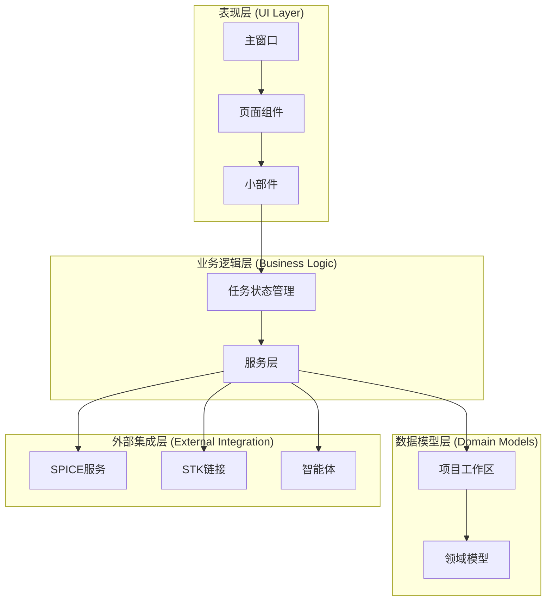
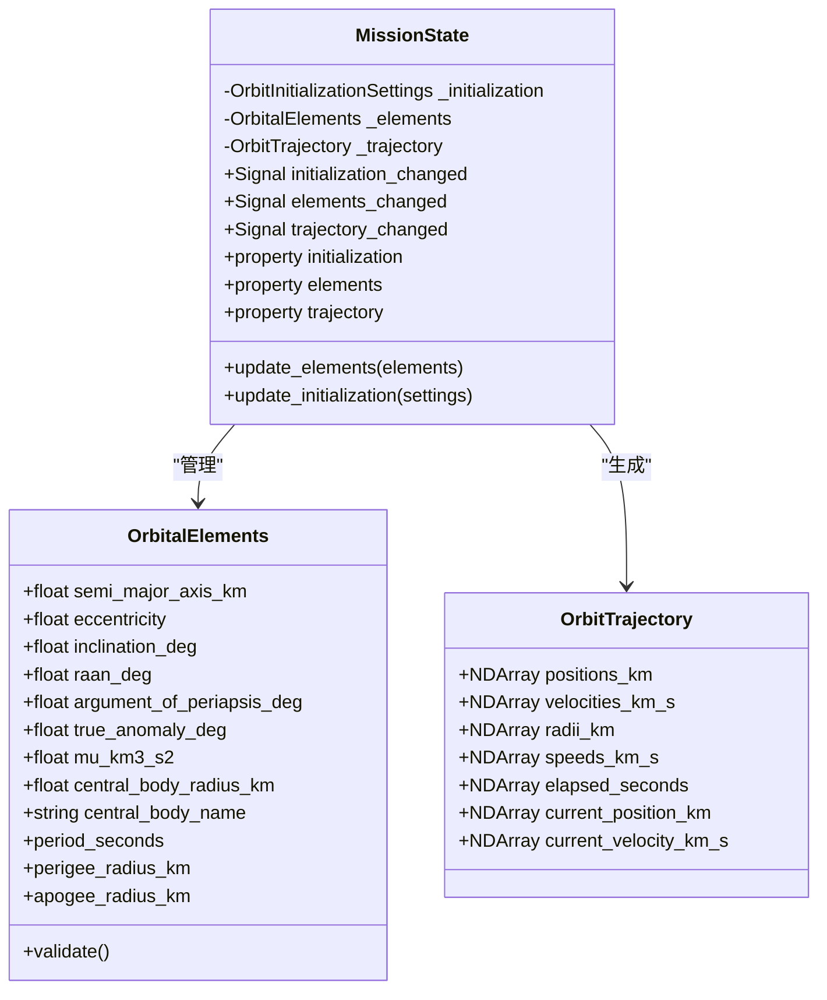
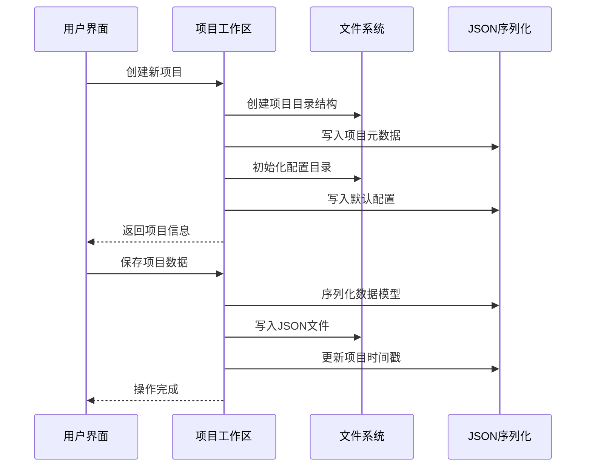
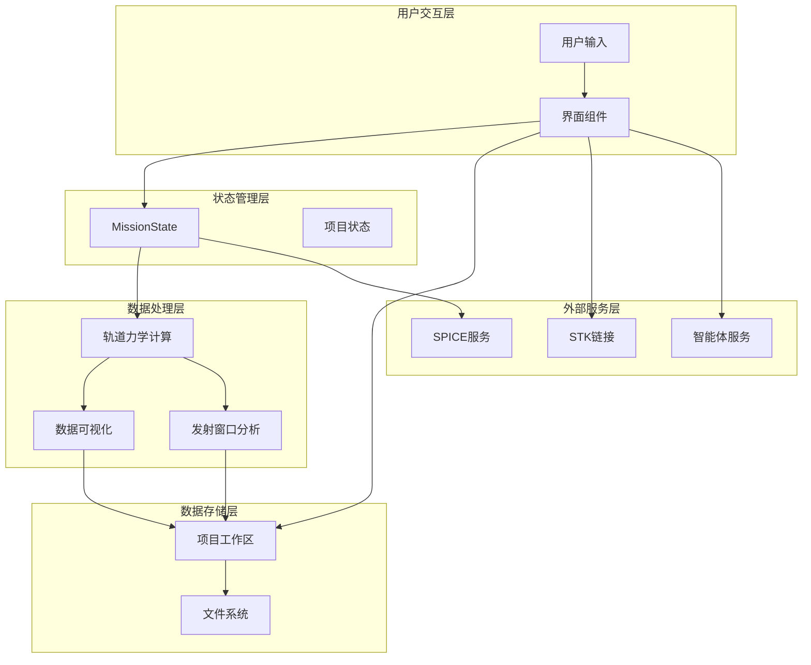
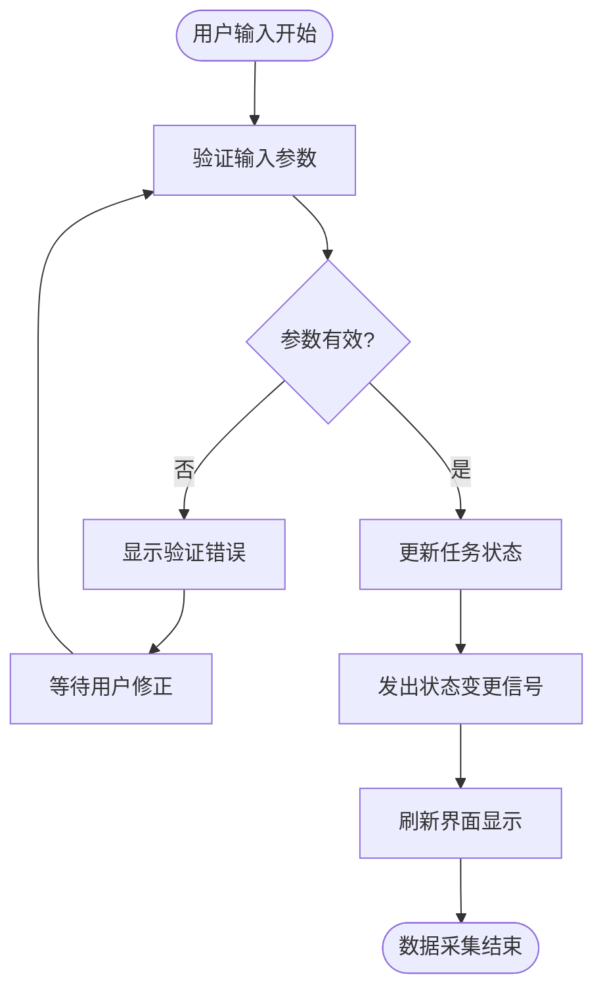
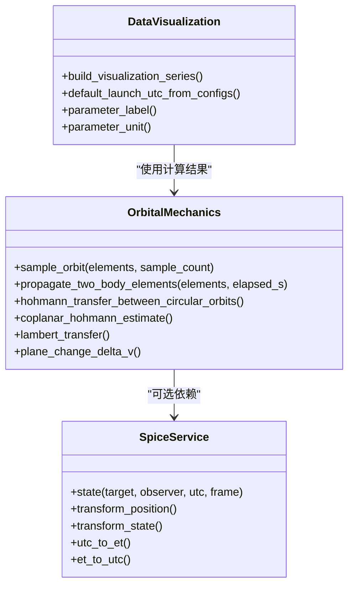
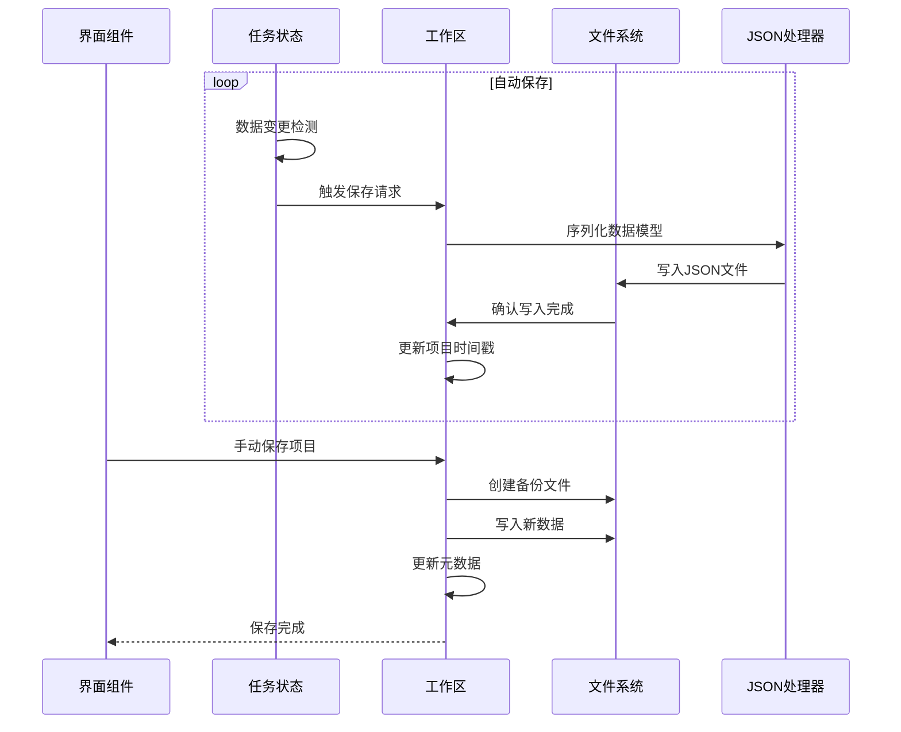
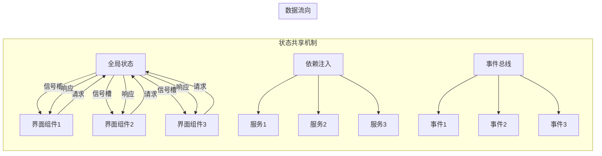
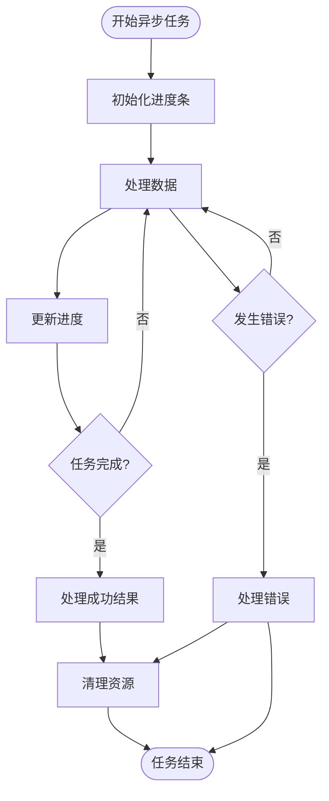
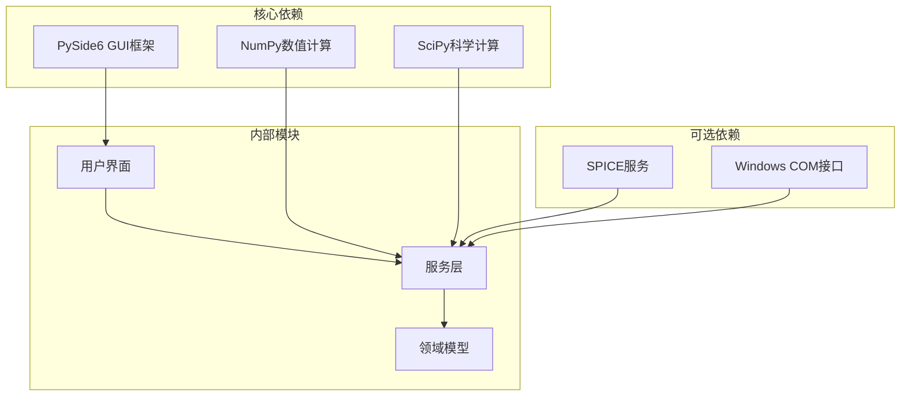

# 数据流设计

<cite>
**本文档引用的文件**
- [main.py](file://src/smart/main.py)
- [app_runtime.py](file://src/smart/app_runtime.py)
- [models.py](file://src/smart/domain/models.py)
- [mission_state.py](file://src/smart/ui/mission_state.py)
- [main_window.py](file://src/smart/ui/main_window.py)
- [project_workspace.py](file://src/smart/services/project_workspace.py)
- [data_visualization.py](file://src/smart/services/data_visualization.py)
- [mission_agent.py](file://src/smart/services/mission_agent.py)
- [stk_link.py](file://src/smart/services/stk_link.py)
- [dashboard_page.py](file://src/smart/ui/widgets/dashboard_page.py)
- [orbit_designer_page.py](file://src/smart/ui/widgets/orbit_designer_page.py)
- [orbital_mechanics.py](file://src/smart/services/orbital_mechanics.py)
- [spice_service.py](file://src/smart/services/spice_service.py)
- [launch_window.py](file://src/smart/services/launch_window.py)
</cite>

## 目录
1. [引言](#引言)
2. [项目结构](#项目结构)
3. [核心组件](#核心组件)
4. [架构概览](#架构概览)
5. [详细组件分析](#详细组件分析)
6. [依赖关系分析](#依赖关系分析)
7. [性能考虑](#性能考虑)
8. [故障排除指南](#故障排除指南)
9. [结论](#结论)

## 引言

SMART项目是一个基于PySide6的航天器任务分析应用程序，采用模块化架构设计。本设计文档专注于系统的数据流设计，详细描述从用户输入到结果展示的完整数据流程，包括数据采集、处理、存储和显示的各个环节。

## 项目结构

SMART项目采用分层架构，主要分为以下层次：

**图表来源**
- [main_window.py:53-136](file://src/smart/ui/main_window.py#L53-L136)
- [mission_state.py:11-45](file://src/smart/ui/mission_state.py#L11-L45)
- [project_workspace.py:64-116](file://src/smart/services/project_workspace.py#L64-L116)

**章节来源**
- [main.py:10-36](file://src/smart/main.py#L10-L36)
- [app_runtime.py:31-96](file://src/smart/app_runtime.py#L31-L96)

## 核心组件

### 任务状态管理系统

MissionState是整个系统的核心状态管理中心，负责维护航天器轨道状态并在数据变更时发出信号通知。

**图表来源**
- [mission_state.py:11-45](file://src/smart/ui/mission_state.py#L11-L45)
- [models.py:17-50](file://src/smart/domain/models.py#L17-L50)
- [models.py:69-78](file://src/smart/domain/models.py#L69-L78)

### 项目工作区管理

ProjectWorkspace提供统一的项目数据管理接口，负责项目文件的创建、加载、保存和版本控制。

**图表来源**
- [project_workspace.py:82-116](file://src/smart/services/project_workspace.py#L82-L116)
- [project_workspace.py:213-226](file://src/smart/services/project_workspace.py#L213-L226)

**章节来源**
- [mission_state.py:11-45](file://src/smart/ui/mission_state.py#L11-L45)
- [project_workspace.py:64-116](file://src/smart/services/project_workspace.py#L64-L116)

## 架构概览

SMART系统采用事件驱动的架构模式，通过信号槽机制实现组件间的松耦合通信。

**图表来源**
- [main_window.py:127-131](file://src/smart/ui/main_window.py#L127-L131)
- [mission_state.py:34-44](file://src/smart/ui/mission_state.py#L34-L44)

## 详细组件分析

### 数据采集与输入处理

用户通过界面组件输入轨道参数，系统进行实时验证和状态更新。

**图表来源**
- [orbit_designer_page.py:150-167](file://src/smart/ui/widgets/orbit_designer_page.py#L150-L167)
- [mission_state.py:34-44](file://src/smart/ui/mission_state.py#L34-L44)

**章节来源**
- [orbit_designer_page.py:20-80](file://src/smart/ui/widgets/orbit_designer_page.py#L20-L80)
- [models.py:17-50](file://src/smart/domain/models.py#L17-L50)

### 数据处理与计算

系统集成了多种轨道力学计算功能，包括轨道采样、轨道转换和转移计算。

**图表来源**
- [orbital_mechanics.py:277-310](file://src/smart/services/orbital_mechanics.py#L277-L310)
- [spice_service.py:287-304](file://src/smart/services/spice_service.py#L287-L304)
- [data_visualization.py:49-107](file://src/smart/services/data_visualization.py#L49-L107)

**章节来源**
- [orbital_mechanics.py:277-310](file://src/smart/services/orbital_mechanics.py#L277-L310)
- [spice_service.py:174-240](file://src/smart/services/spice_service.py#L174-L240)

### 数据持久化策略

系统采用JSON格式进行数据序列化，支持增量更新和版本控制。

**图表来源**
- [main_window.py:601-632](file://src/smart/ui/main_window.py#L601-L632)
- [project_workspace.py:213-226](file://src/smart/services/project_workspace.py#L213-L226)
- [project_workspace.py:654-660](file://src/smart/services/project_workspace.py#L654-L660)

**章节来源**
- [project_workspace.py:213-232](file://src/smart/services/project_workspace.py#L213-L232)
- [project_workspace.py:667-683](file://src/smart/services/project_workspace.py#L667-L683)

### 跨组件数据共享

系统通过多种机制实现组件间的数据共享：

1. **全局状态管理**：MissionState作为单一真相源
2. **事件总线**：PySide6信号槽机制
3. **依赖注入**：构造函数参数传递

**图表来源**
- [main_window.py:127-131](file://src/smart/ui/main_window.py#L127-L131)
- [mission_state.py:12-14](file://src/smart/ui/mission_state.py#L12-L14)

**章节来源**
- [main_window.py:60-131](file://src/smart/ui/main_window.py#L60-L131)
- [mission_state.py:11-45](file://src/smart/ui/mission_state.py#L11-L45)

### 异步数据处理模式

系统支持后台任务处理，提供进度反馈和错误处理机制。

**图表来源**
- [launch_window.py:565-620](file://src/smart/services/launch_window.py#L565-L620)
- [stk_link.py:280-337](file://src/smart/services/stk_link.py#L280-L337)

**章节来源**
- [launch_window.py:565-620](file://src/smart/services/launch_window.py#L565-L620)
- [stk_link.py:280-337](file://src/smart/services/stk_link.py#L280-L337)

## 依赖关系分析

系统采用模块化设计，各组件间依赖关系清晰：

**图表来源**
- [orbital_mechanics.py:1-25](file://src/smart/services/orbital_mechanics.py#L1-L25)
- [spice_service.py:13-16](file://src/smart/services/spice_service.py#L13-L16)

**章节来源**
- [orbital_mechanics.py:1-25](file://src/smart/services/orbital_mechanics.py#L1-L25)
- [spice_service.py:13-16](file://src/smart/services/spice_service.py#L13-L16)

## 性能考虑

系统在设计时充分考虑了性能优化：

1. **延迟加载**：SPICE内核按需加载
2. **缓存机制**：重复计算结果缓存
3. **批量处理**：大量数据的批处理优化
4. **内存管理**：及时释放不需要的对象

## 故障排除指南

### 常见问题及解决方案

1. **SPICE服务不可用**
   - 检查SpiceyPy是否正确安装
   - 验证内核文件路径配置
   - 确认内核文件格式支持

2. **项目文件损坏**
   - 使用备份文件恢复
   - 检查JSON格式有效性
   - 验证文件权限

3. **界面更新异常**
   - 检查信号槽连接
   - 验证状态变更通知
   - 确认UI线程安全

**章节来源**
- [spice_service.py:80-89](file://src/smart/services/spice_service.py#L80-L89)
- [main_window.py:622-631](file://src/smart/ui/main_window.py#L622-L631)

## 结论

SMART项目的数据流设计体现了现代桌面应用的最佳实践，通过模块化架构、事件驱动模式和完善的持久化机制，实现了高效、可靠的数据处理流程。系统的设计既保证了良好的用户体验，又为未来的功能扩展奠定了坚实基础。