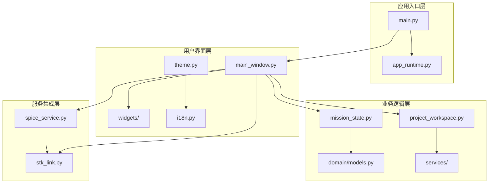
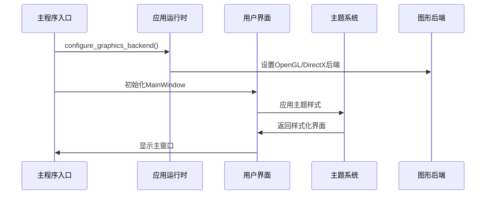
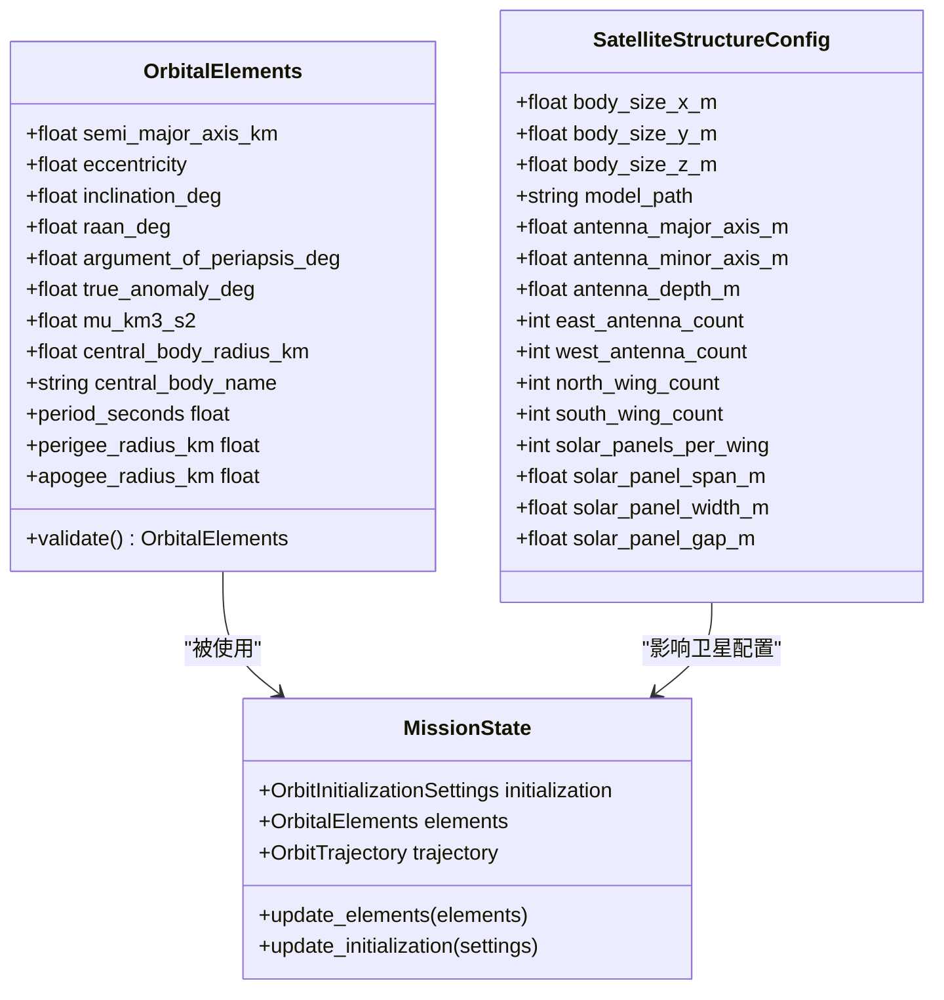
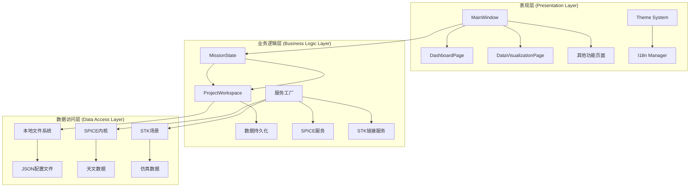
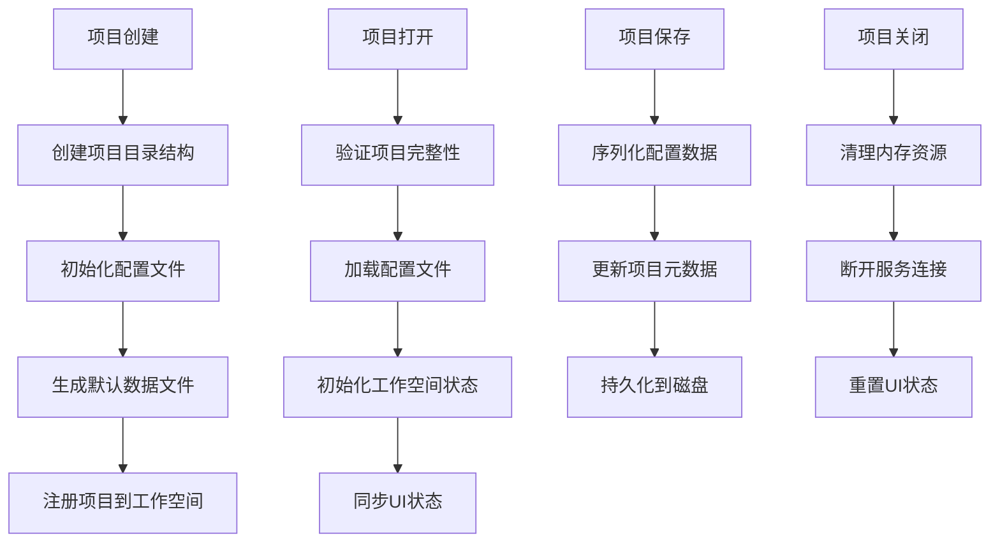
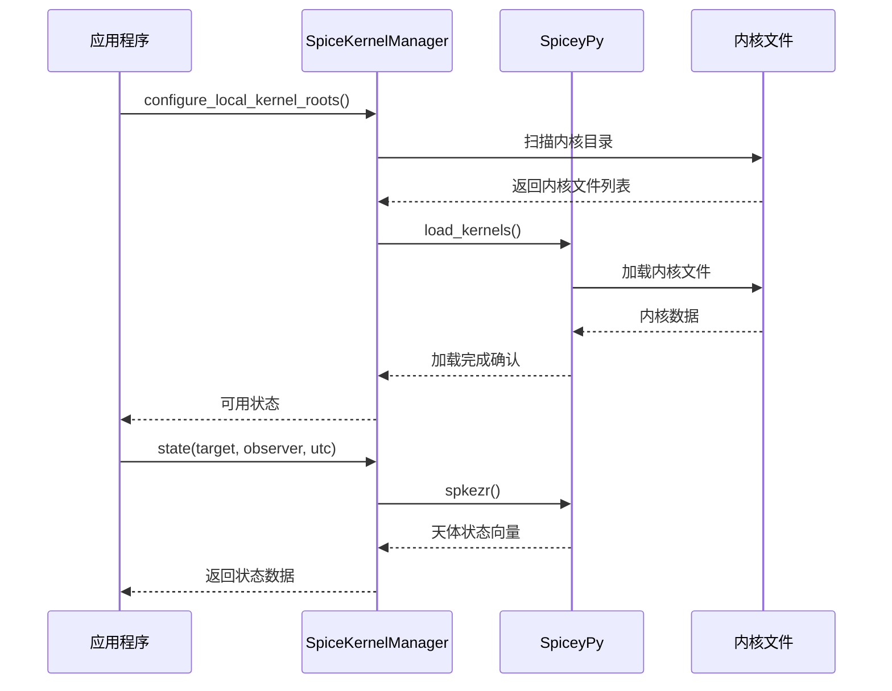
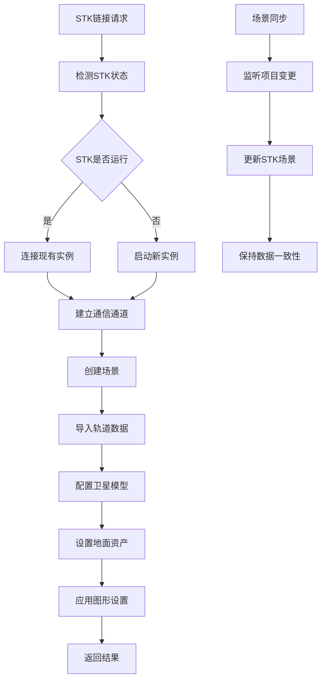
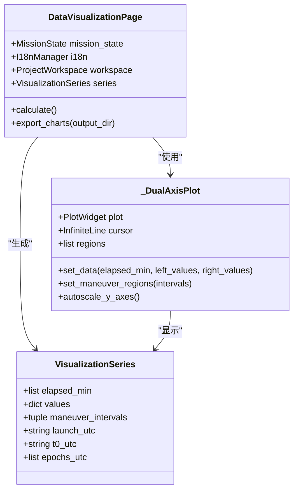
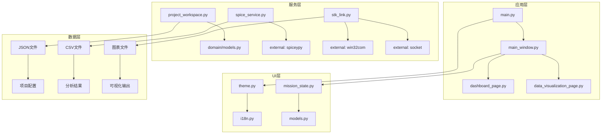

# 整体架构设计

<cite>
**本文档引用的文件**
- [main.py](file://src/smart/main.py)
- [app_runtime.py](file://src/smart/app_runtime.py)
- [main_window.py](file://src/smart/ui/main_window.py)
- [models.py](file://src/smart/domain/models.py)
- [mission_state.py](file://src/smart/ui/mission_state.py)
- [project_workspace.py](file://src/smart/services/project_workspace.py)
- [spice_service.py](file://src/smart/services/spice_service.py)
- [stk_link.py](file://src/smart/services/stk_link.py)
- [dashboard_page.py](file://src/smart/ui/widgets/dashboard_page.py)
- [data_visualization_page.py](file://src/smart/ui/widgets/data_visualization_page.py)
- [theme.py](file://src/smart/ui/theme.py)
- [i18n.py](file://src/smart/ui/i18n.py)
- [pyproject.toml](file://pyproject.toml)
- [README.md](file://README.md)
</cite>

## 目录
1. [引言](#引言)
2. [项目结构](#项目结构)
3. [核心组件](#核心组件)
4. [架构概览](#架构概览)
5. [详细组件分析](#详细组件分析)
6. [依赖关系分析](#依赖关系分析)
7. [性能考虑](#性能考虑)
8. [故障排除指南](#故障排除指南)
9. [结论](#结论)

## 引言

SMART（Spacecraft Mission Analysis, Research & Toolkit）是一个面向航天任务设计与工程分析的桌面软件。项目围绕 `STK 11.6 + SPICE + PySide6` 构建统一工作流，旨在解决传统任务分析中多工具切换、时间与坐标系转换易错、结果留痕分散的问题。

SMART采用分层架构设计，通过清晰的职责分离实现了高度模块化的桌面应用程序。系统的核心价值在于提供一体化的桌面任务分析环境，将任务建模、约束分析、图形验证、结果导出和工程说明收敛到一个可复用、可追溯的工作台中。

## 项目结构

SMART项目采用标准的Python桌面应用结构，主要分为以下几个层次：

**图表来源**
- [main.py:1-36](file://src/smart/main.py#L1-L36)
- [main_window.py:1-781](file://src/smart/ui/main_window.py#L1-L781)

### 核心目录结构

项目采用清晰的分层组织方式：

- **src/smart/**: 主要源代码目录
  - **domain/**: 领域模型和核心数据结构
  - **services/**: 业务服务和数据处理
  - **ui/**: 用户界面组件和主题
  - **assets/**: 静态资源文件
- **data/**: 本地数据和内核文件
- **projects/**: 用户项目文件
- **tests/**: 测试用例

**章节来源**
- [README.md:187-196](file://README.md#L187-L196)

## 核心组件

### 应用入口组件

应用入口通过简洁的启动流程初始化整个系统：

**图表来源**
- [main.py:10-31](file://src/smart/main.py#L10-L31)
- [app_runtime.py:31-90](file://src/smart/app_runtime.py#L31-L90)

### 主窗口组件

主窗口作为应用的核心控制器，负责协调各个功能模块：

- **导航管理**: 实现侧边栏导航和页面切换
- **项目管理**: 处理项目创建、打开、保存等生命周期
- **状态同步**: 维护MissionState与UI组件的数据绑定
- **服务集成**: 管理SPICE、STK等外部服务的连接

**章节来源**
- [main_window.py:53-136](file://src/smart/ui/main_window.py#L53-L136)
- [main_window.py:370-580](file://src/smart/ui/main_window.py#L370-L580)

### 领域模型组件

SMART定义了完整的航天器任务分析数据模型：

**图表来源**
- [models.py:17-255](file://src/smart/domain/models.py#L17-L255)
- [mission_state.py:11-45](file://src/smart/ui/mission_state.py#L11-L45)

**章节来源**
- [models.py:17-255](file://src/smart/domain/models.py#L17-L255)
- [mission_state.py:11-45](file://src/smart/ui/mission_state.py#L11-L45)

## 架构概览

SMART采用经典的三层架构模式，结合MVVM设计模式实现清晰的职责分离：

**图表来源**
- [main_window.py:86-124](file://src/smart/ui/main_window.py#L86-L124)
- [project_workspace.py:64-116](file://src/smart/services/project_workspace.py#L64-L116)

### MVVM模式应用

在SMART中，MVVM模式通过以下方式实现：

**Model (模型层)**: 由领域模型和数据持久化组成
- `OrbitalElements`: 轨道根数数据模型
- `SatelliteStructureConfig`: 卫星结构配置
- `ProjectWorkspace`: 项目数据管理

**View (视图层)**: UI组件和页面
- `DashboardPage`: 项目状态概览
- `DataVisualizationPage`: 数据可视化界面
- 各种功能页面组件

**ViewModel (视图模型层)**: 通过信号槽机制实现数据绑定
- `MissionState`: 提供轨道状态变化通知
- 页面组件通过信号槽与模型交互

**章节来源**
- [mission_state.py:11-45](file://src/smart/ui/mission_state.py#L11-L45)
- [dashboard_page.py:263-516](file://src/smart/ui/widgets/dashboard_page.py#L263-L516)

## 详细组件分析

### 项目管理系统

项目管理系统是SMART的核心基础设施，负责管理用户项目的所有数据和状态：

**图表来源**
- [project_workspace.py:82-116](file://src/smart/services/project_workspace.py#L82-L116)
- [project_workspace.py:118-127](file://src/smart/services/project_workspace.py#L118-L127)

#### 数据持久化策略

项目数据采用JSON格式进行持久化，确保跨平台兼容性和数据可读性：

| 数据类型 | 文件路径 | 描述 |
|---------|----------|------|
| 项目元数据 | `smart_project.json` | 项目基本信息和版本控制 |
| 轨道配置 | `config/orbit_elements.json` | 轨道根数和初始化设置 |
| 卫星配置 | `config/satellite_3d_model.json` | 卫星结构和天线配置 |
| 变轨策略 | `config/maneuver_strategy.json` | 变轨参数和执行计划 |
| 发射窗口 | `config/launch_window.json` | 发射约束和窗口配置 |

**章节来源**
- [project_workspace.py:33-53](file://src/smart/services/project_workspace.py#L33-L53)
- [project_workspace.py:213-232](file://src/smart/services/project_workspace.py#L213-L232)

### SPICE集成组件

SPICE（Spacecraft Planet Instrument C-matrix Event）服务为SMART提供精确的天文坐标计算能力：

**图表来源**
- [spice_service.py:205-221](file://src/smart/services/spice_service.py#L205-L221)
- [spice_service.py:287-305](file://src/smart/services/spice_service.py#L287-L305)

#### 内核管理策略

SMART采用智能的内核管理策略，确保天文计算的准确性和性能：

- **自动发现**: 递归扫描指定目录下的所有SPICE内核文件
- **去重加载**: 避免重复加载相同文件，提高内存效率
- **延迟加载**: 仅在需要时才加载内核，减少启动时间
- **错误处理**: 提供详细的错误信息和降级策略

**章节来源**
- [spice_service.py:91-99](file://src/smart/services/spice_service.py#L91-L99)
- [spice_service.py:205-221](file://src/smart/services/spice_service.py#L205-L221)

### STK联动组件

STK（Systems Tool Kit）链接服务实现SMART与AGI STK 11.6的深度集成：

**图表来源**
- [stk_link.py:280-337](file://src/smart/services/stk_link.py#L280-L337)
- [stk_link.py:492-495](file://src/smart/services/stk_link.py#L492-L495)

#### 通信协议设计

SMART支持多种STK通信方式，确保在不同环境下都能稳定工作：

| 通信方式 | 适用场景 | 优点 | 限制 |
|---------|----------|------|------|
| COM接口 | Windows本地环境 | 低延迟，功能完整 | 仅限Windows，需要COM支持 |
| Socket连接 | 跨平台网络通信 | 跨平台，灵活部署 | 网络延迟，需要端口开放 |
| 文件导入 | 离线数据交换 | 最大兼容性 | 数据同步延迟 |

**章节来源**
- [stk_link.py:111-142](file://src/smart/services/stk_link.py#L111-L142)
- [stk_link.py:144-167](file://src/smart/services/stk_link.py#L144-L167)

### 可视化组件

数据可视化组件提供强大的科学图表生成功能：

**图表来源**
- [data_visualization_page.py:282-341](file://src/smart/ui/widgets/data_visualization_page.py#L282-L341)
- [data_visualization_page.py:422-442](file://src/smart/ui/widgets/data_visualization_page.py#L422-L442)

#### 图表渲染引擎

SMART采用pyqtgraph作为底层渲染引擎，提供高性能的实时数据可视化：

- **双轴支持**: 同时显示两个不同量级的参数曲线
- **交互功能**: 支持鼠标悬停、缩放、平移等操作
- **时间线同步**: 多个图表的时间轴自动同步
- **导出功能**: 支持PNG格式图表导出

**章节来源**
- [data_visualization_page.py:44-127](file://src/smart/ui/widgets/data_visualization_page.py#L44-L127)
- [data_visualization_page.py:422-442](file://src/smart/ui/widgets/data_visualization_page.py#L422-L442)

## 依赖关系分析

SMART项目的依赖关系体现了清晰的分层架构设计：

**图表来源**
- [pyproject.toml:11-22](file://pyproject.toml#L11-L22)
- [main.py:15-27](file://src/smart/main.py#L15-L27)

### 第三方依赖管理

SMART使用pip和pyproject.toml进行依赖管理，确保环境的一致性和可重现性：

| 依赖类别 | 包名 | 版本要求 | 用途 |
|---------|------|----------|------|
| GUI框架 | PySide6 | >=6.8,<7 | 用户界面构建 |
| 数值计算 | numpy | >=2.0,<3 | 科学计算和数组操作 |
| 2D绘图 | pyqtgraph | >=0.13.7,<0.14 | 实时数据可视化 |
| 3D图形 | PyOpenGL | >=3.1.7,<4 | 3D场景渲染 |
| SPICE接口 | spiceypy | >=8.1,<9 | 天文坐标计算 |
| 模型处理 | trimesh | >=4.5,<5 | 3D模型处理 |
| 文档生成 | reportlab | >=4.0,<5 | PDF报告生成 |

**章节来源**
- [pyproject.toml:11-22](file://pyproject.toml#L11-L22)
- [pyproject.toml:24-30](file://pyproject.toml#L24-L30)

### 技术选型决策

#### PySide6选择理由

SMART选择PySide6作为GUI框架的主要原因：

- **跨平台兼容**: 支持Windows、macOS、Linux三大主流操作系统
- **Python原生**: 与项目技术栈完全一致，降低学习成本
- **现代特性**: 支持Qt 6的新特性和性能改进
- **社区支持**: 活跃的开源社区和完善的文档体系

#### SPICE集成策略

SPICE集成采用"优先本地内核，自动加载"的策略：

- **本地优先**: 首先尝试加载本地data/kernels目录下的内核
- **自动发现**: 递归扫描内核目录，自动识别支持的文件格式
- **错误降级**: 当本地内核不可用时，提供清晰的错误提示
- **性能优化**: 缓存已加载的内核，避免重复加载

#### STK集成策略

STK集成采用"多通道并行"的设计：

- **COM接口**: 优先使用Windows COM接口获得最佳性能
- **Socket连接**: 作为COM接口的备选方案，支持跨平台部署
- **文件导入**: 提供离线数据交换能力，确保最大兼容性
- **状态监控**: 实时监控STK状态，自动处理连接异常

**章节来源**
- [README.md:48-55](file://README.md#L48-L55)
- [spice_service.py:205-221](file://src/smart/services/spice_service.py#L205-L221)

## 性能考虑

SMART在设计时充分考虑了性能优化，特别是在大数据量处理和实时交互方面：

### 图形渲染优化

- **GPU加速**: 利用OpenGL硬件加速进行3D场景渲染
- **批处理渲染**: 将多个图形元素合并到单一绘制调用中
- **LOD系统**: 根据距离动态调整模型细节级别
- **帧率控制**: 限制最大帧率防止过度占用CPU/GPU资源

### 内存管理策略

- **懒加载**: 仅在需要时才加载大型数据集
- **对象池**: 复用频繁创建的对象减少GC压力
- **弱引用**: 避免循环引用导致的内存泄漏
- **增量更新**: 仅更新发生变化的部分UI组件

### 网络通信优化

- **连接复用**: 复用STK连接避免频繁建立新连接
- **异步操作**: 将耗时操作放到后台线程执行
- **缓存机制**: 缓存计算结果避免重复计算
- **流量控制**: 限制同时进行的网络操作数量

## 故障排除指南

### 常见问题诊断

#### SPICE内核加载失败

**症状**: SPICE页面显示"未连接"状态，无法进行天文计算

**诊断步骤**:
1. 检查data/kernels目录是否存在且可访问
2. 验证内核文件格式是否正确
3. 确认内核文件完整性
4. 查看SPICE运行时日志

**解决方案**:
- 重新下载缺失的内核文件
- 检查文件权限设置
- 清理已加载的内核缓存
- 验证SPICEyPy安装完整性

#### STK连接问题

**症状**: STK链接功能不可用，出现连接超时错误

**诊断步骤**:
1. 确认STK 11.6已正确安装
2. 检查Windows COM服务是否正常
3. 验证防火墙设置允许STK通信
4. 查看STK日志文件

**解决方案**:
- 重启STK应用程序
- 重新注册COM组件
- 检查网络连接状态
- 调整防火墙安全设置

#### 图形渲染异常

**症状**: 3D视图显示异常或渲染性能低下

**诊断步骤**:
1. 检查GPU驱动程序版本
2. 验证OpenGL支持情况
3. 确认显存容量充足
4. 查看图形日志输出

**解决方案**:
- 更新GPU驱动程序
- 调整图形渲染设置
- 关闭其他图形密集型应用
- 降低场景复杂度

**章节来源**
- [spice_service.py:79-89](file://src/smart/services/spice_service.py#L79-L89)
- [stk_link.py:111-142](file://src/smart/services/stk_link.py#L111-L142)

## 结论

SMART项目通过精心设计的分层架构和MVVM模式，成功构建了一个功能完整、性能优异的航天任务分析桌面应用。系统的核心优势体现在以下几个方面：

### 架构优势

- **清晰的职责分离**: 通过分层架构实现了良好的模块化设计
- **可扩展性**: 组件化设计使得新功能的添加变得简单
- **可维护性**: 清晰的依赖关系和接口定义降低了维护成本
- **跨平台兼容**: 基于PySide6的GUI框架确保了平台无关性

### 技术创新

- **多服务集成**: 成功整合了SPICE、STK等多个专业工具
- **实时数据可视化**: 提供了直观的科学数据分析界面
- **智能项目管理**: 自动化的数据持久化和版本控制
- **国际化支持**: 完善的多语言本地化机制

### 未来发展方向

SMART项目为后续的功能扩展奠定了坚实的基础，包括但不限于：

- **AI辅助分析**: 集成机器学习算法进行智能任务规划
- **云端协作**: 支持多用户协同编辑和远程访问
- **移动端支持**: 开发移动应用版本扩大使用场景
- **插件生态**: 建立开放的插件系统吸引更多开发者参与

通过持续的技术创新和功能完善，SMART有望成为航天任务分析领域的标杆性工具，为我国的航天事业贡献重要力量。