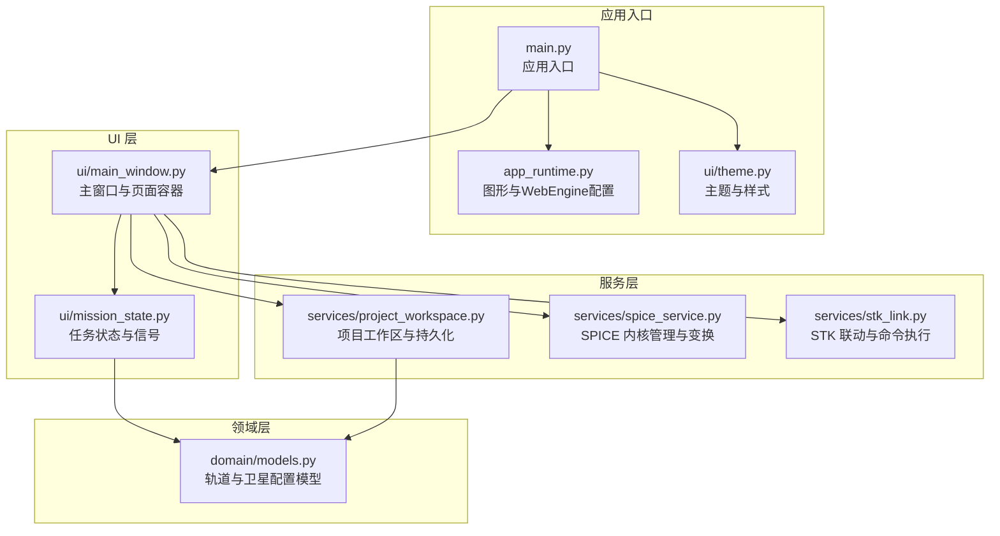
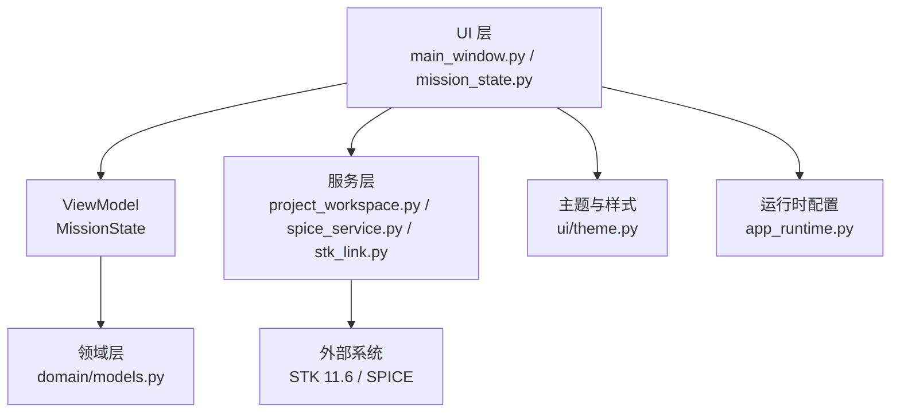
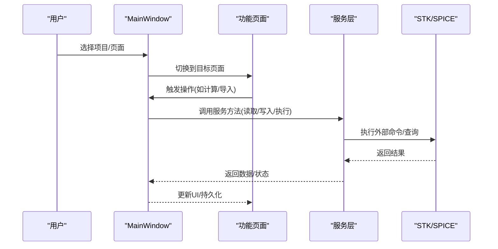
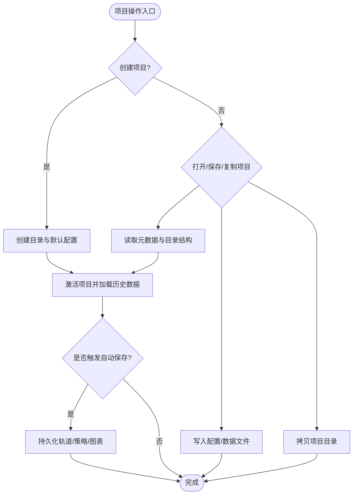
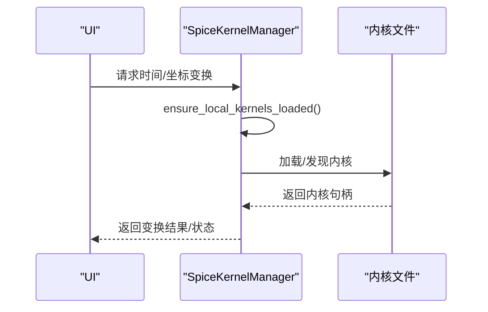
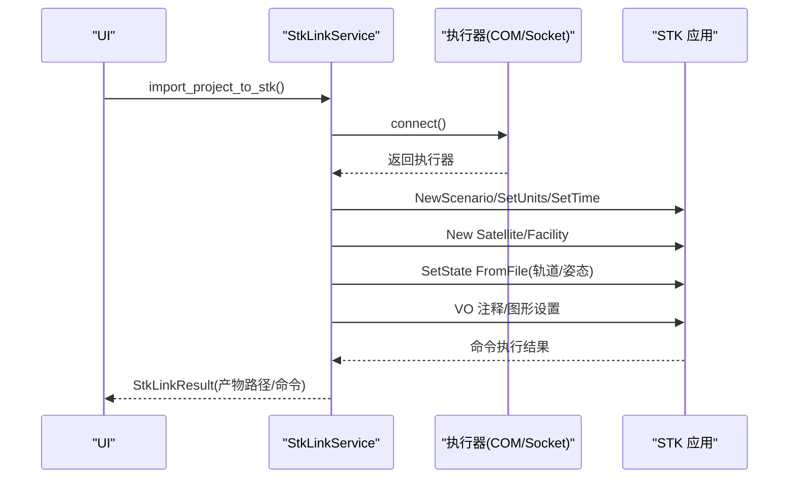
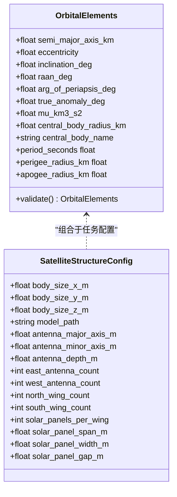
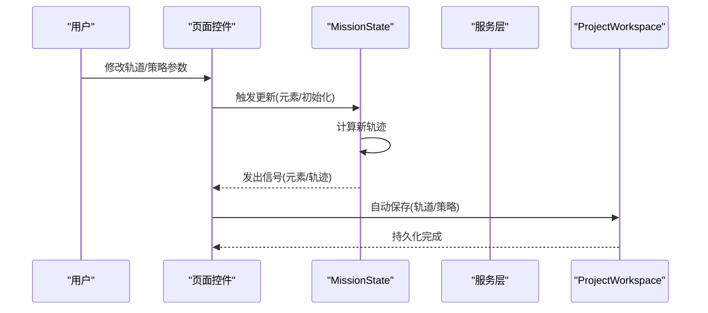
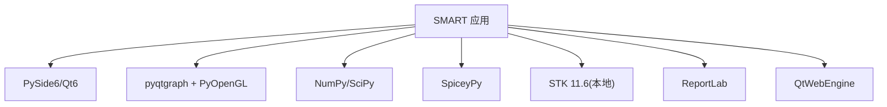

# 架构设计

<cite>
**本文引用的文件**
- [README.md](file://README.md)
- [pyproject.toml](file://pyproject.toml)
- [src/smart/main.py](file://src/smart/main.py)
- [src/smart/app_runtime.py](file://src/smart/app_runtime.py)
- [src/smart/ui/main_window.py](file://src/smart/ui/main_window.py)
- [src/smart/ui/theme.py](file://src/smart/ui/theme.py)
- [src/smart/ui/mission_state.py](file://src/smart/ui/mission_state.py)
- [src/smart/domain/models.py](file://src/smart/domain/models.py)
- [src/smart/services/project_workspace.py](file://src/smart/services/project_workspace.py)
- [src/smart/services/spice_service.py](file://src/smart/services/spice_service.py)
- [src/smart/services/stk_link.py](file://src/smart/services/stk_link.py)
- [src/smart/webengine_diagnostics.py](file://src/smart/webengine_diagnostics.py)
</cite>

## 目录
1. [引言](#引言)
2. [项目结构](#项目结构)
3. [核心组件](#核心组件)
4. [架构总览](#架构总览)
5. [详细组件分析](#详细组件分析)
6. [依赖分析](#依赖分析)
7. [性能考量](#性能考量)
8. [故障排查指南](#故障排查指南)
9. [结论](#结论)
10. [附录](#附录)

## 引言
SMART 是一个面向航天任务设计与工程分析的桌面应用，围绕 STK 11.6 + SPICE + PySide6 构建统一工作流，旨在解决传统任务分析中多工具切换、时间与坐标系转换易错、结果留痕分散等问题。系统通过清晰的分层架构与模块化设计，将 UI 层、服务层与领域层解耦，实现数据驱动的可视化与工程化闭环。

## 项目结构
项目采用按层与按功能混合的组织方式：
- domain/：领域模型与不变数据结构
- services/：服务层，封装数值计算、SPICE、STK 集成、项目工作区等
- ui/：UI 层，包含主窗口、页面与主题样式
- data/kernels/：本地 SPICE 内核
- tests/：单元与功能测试
- scripts/：开发与诊断脚本

**图表来源**
- [src/smart/main.py:1-36](file://src/smart/main.py#L1-L36)
- [src/smart/app_runtime.py:31-90](file://src/smart/app_runtime.py#L31-L90)
- [src/smart/ui/theme.py:473-519](file://src/smart/ui/theme.py#L473-L519)
- [src/smart/ui/main_window.py:53-136](file://src/smart/ui/main_window.py#L53-L136)
- [src/smart/ui/mission_state.py:11-45](file://src/smart/ui/mission_state.py#L11-L45)
- [src/smart/domain/models.py:17-255](file://src/smart/domain/models.py#L17-L255)
- [src/smart/services/project_workspace.py:64-116](file://src/smart/services/project_workspace.py#L64-L116)
- [src/smart/services/spice_service.py:174-305](file://src/smart/services/spice_service.py#L174-L305)
- [src/smart/services/stk_link.py:199-280](file://src/smart/services/stk_link.py#L199-L280)

**章节来源**
- [README.md:187-196](file://README.md#L187-L196)
- [pyproject.toml:36-49](file://pyproject.toml#L36-L49)

## 核心组件
- 应用入口与运行时
  - main.py：创建 QApplication、设置图标与主题、初始化主窗口并进入事件循环
  - app_runtime.py：配置图形后端（OpenGL/Direct3D/SwiftShader）、WebEngine 参数与环境变量
  - webengine_diagnostics.py：WebEngine/WebGL 诊断工具，隔离渲染问题
- UI 层
  - main_window.py：主窗口容器，构建侧边导航、页面栈、项目菜单与工具栏；聚合各功能页面与服务实例
  - mission_state.py：任务状态对象，提供轨道初始化、元素与轨迹的信号与属性
  - theme.py：主题与样式表，字体与配色方案
- 领域层
  - domain/models.py：轨道元素、卫星结构与状态、工具函数与常量
- 服务层
  - project_workspace.py：项目工作区，负责项目创建/打开/保存、配置与数据文件的读写与哈希校验
  - spice_service.py：SPICE 内核管理、时间转换、坐标变换与天体状态查询
  - stk_link.py：STK 11.6 联动，COM/Socket 命令执行、场景创建、轨道/姿态导入与注释

**章节来源**
- [src/smart/main.py:10-31](file://src/smart/main.py#L10-L31)
- [src/smart/app_runtime.py:31-90](file://src/smart/app_runtime.py#L31-L90)
- [src/smart/webengine_diagnostics.py:192-213](file://src/smart/webengine_diagnostics.py#L192-L213)
- [src/smart/ui/main_window.py:53-136](file://src/smart/ui/main_window.py#L53-L136)
- [src/smart/ui/mission_state.py:11-45](file://src/smart/ui/mission_state.py#L11-L45)
- [src/smart/ui/theme.py:473-519](file://src/smart/ui/theme.py#L473-L519)
- [src/smart/domain/models.py:17-255](file://src/smart/domain/models.py#L17-L255)
- [src/smart/services/project_workspace.py:64-116](file://src/smart/services/project_workspace.py#L64-L116)
- [src/smart/services/spice_service.py:174-305](file://src/smart/services/spice_service.py#L174-L305)
- [src/smart/services/stk_link.py:199-280](file://src/smart/services/stk_link.py#L199-L280)

## 架构总览
SMART 采用分层架构与 MVVM 思想的结合：
- 分层架构
  - UI 层：负责用户交互、页面导航与可视化
  - 服务层：封装业务能力（数值计算、SPICE、STK、项目持久化）
  - 领域层：承载不变的领域模型与规则
- MVVM 应用
  - ViewModel 角色由 mission_state.py 的 MissionState 承担，作为 UI 与服务层之间的桥梁，暴露信号与属性
  - UI 通过信号槽与属性绑定消费状态变化，触发服务层执行计算或外部集成
- 组件化设计
  - 主窗口聚合各功能页面，页面内部进一步拆分小组件
  - 服务通过构造函数注入（如 StkLinkService 接收 ProjectWorkspace），避免全局状态
  - 项目工作区集中管理配置与数据文件，提供稳定的 I/O 接口

**图表来源**
- [src/smart/ui/main_window.py:53-136](file://src/smart/ui/main_window.py#L53-L136)
- [src/smart/ui/mission_state.py:11-45](file://src/smart/ui/mission_state.py#L11-L45)
- [src/smart/domain/models.py:17-255](file://src/smart/domain/models.py#L17-L255)
- [src/smart/services/project_workspace.py:64-116](file://src/smart/services/project_workspace.py#L64-L116)
- [src/smart/services/spice_service.py:174-305](file://src/smart/services/spice_service.py#L174-L305)
- [src/smart/services/stk_link.py:199-280](file://src/smart/services/stk_link.py#L199-L280)
- [src/smart/ui/theme.py:473-519](file://src/smart/ui/theme.py#L473-L519)
- [src/smart/app_runtime.py:31-90](file://src/smart/app_runtime.py#L31-L90)

## 详细组件分析

### UI 层：主窗口与页面容器
- 职责
  - 构建侧边导航与页面栈，承载各功能页面（轨道设计、变轨策略、发射窗口、跟踪弧段、飞行程序、可视化、STK 联动、SPICE 内核、AI 分析等）
  - 维护项目生命周期（创建/打开/保存/关闭）与自动保存
  - 聚合服务实例（ProjectWorkspace、SpiceKernelManager、StkLinkService）
- 关键交互
  - 通过信号连接页面与服务，如轨道变更触发项目输出持久化
  - 项目激活时重置 SPICE 工作空间并加载历史数据
- 依赖
  - 依赖 mission_state 提供轨道状态
  - 依赖 theme 提供主题样式
  - 依赖各服务层组件进行数据读写与外部集成

**图表来源**
- [src/smart/ui/main_window.py:53-136](file://src/smart/ui/main_window.py#L53-L136)
- [src/smart/services/stk_link.py:280-337](file://src/smart/services/stk_link.py#L280-L337)
- [src/smart/services/spice_service.py:205-221](file://src/smart/services/spice_service.py#L205-L221)

**章节来源**
- [src/smart/ui/main_window.py:53-136](file://src/smart/ui/main_window.py#L53-L136)
- [src/smart/ui/main_window.py:581-660](file://src/smart/ui/main_window.py#L581-L660)

### 服务层：项目工作区与数据流
- 职责
  - 项目生命周期管理：创建/打开/保存/复制/关闭
  - 配置与数据文件的读写：轨道元素、卫星配置、变轨策略、发射窗口、跟踪弧段、飞行程序、结果与图表
  - 数据一致性校验：通过稳定哈希校验配置与结果的关联关系
- 关键流程
  - 项目创建时生成目录结构与默认配置
  - 项目激活时加载历史数据并刷新页面
  - 自动保存：轨道元素与变轨策略变更时持久化
- 依赖
  - 依赖领域模型进行序列化/反序列化
  - 依赖各算法服务产出的结果文件

**图表来源**
- [src/smart/services/project_workspace.py:82-116](file://src/smart/services/project_workspace.py#L82-L116)
- [src/smart/services/project_workspace.py:118-127](file://src/smart/services/project_workspace.py#L118-L127)
- [src/smart/services/project_workspace.py:132-154](file://src/smart/services/project_workspace.py#L132-L154)
- [src/smart/ui/main_window.py:534-580](file://src/smart/ui/main_window.py#L534-L580)
- [src/smart/ui/main_window.py:618-660](file://src/smart/ui/main_window.py#L618-L660)

**章节来源**
- [src/smart/services/project_workspace.py:64-116](file://src/smart/services/project_workspace.py#L64-L116)
- [src/smart/services/project_workspace.py:213-285](file://src/smart/services/project_workspace.py#L213-L285)
- [src/smart/services/project_workspace.py:332-358](file://src/smart/services/project_workspace.py#L332-L358)
- [src/smart/services/project_workspace.py:360-396](file://src/smart/services/project_workspace.py#L360-L396)
- [src/smart/services/project_workspace.py:398-482](file://src/smart/services/project_workspace.py#L398-L482)

### 服务层：SPICE 内核管理与时间/坐标变换
- 职责
  - 自动发现与加载本地内核
  - 时间格式转换（UTC/ET）
  - 坐标系变换（位置/状态向量）
  - 天体状态查询
- 关键点
  - 支持多种内核类型与默认加载顺序
  - 通过 ensure_local_kernels_loaded 避免重复加载
  - 提供 BodyState 结构返回位置、速度与光行时

**图表来源**
- [src/smart/services/spice_service.py:205-221](file://src/smart/services/spice_service.py#L205-L221)
- [src/smart/services/spice_service.py:241-305](file://src/smart/services/spice_service.py#L241-L305)

**章节来源**
- [src/smart/services/spice_service.py:174-305](file://src/smart/services/spice_service.py#L174-L305)

### 服务层：STK 联动与场景同步
- 职责
  - 连接/启动 STK 11.6（COM 或 Socket）
  - 创建新场景、导入轨道/姿态、创建地面站与中继星
  - 同步分析时间段与动画时间
  - 输出轨道/姿态/中继星星历文件
- 关键点
  - 支持两种执行器（COM/Socket），自动探测可用路径
  - 将轨道历史与飞行程序配置转化为 STK 输入
  - 通过 StkLinkResult 返回产物路径与命令日志

**图表来源**
- [src/smart/services/stk_link.py:218-280](file://src/smart/services/stk_link.py#L218-L280)
- [src/smart/services/stk_link.py:280-337](file://src/smart/services/stk_link.py#L280-L337)
- [src/smart/services/stk_link.py:492-495](file://src/smart/services/stk_link.py#L492-L495)

**章节来源**
- [src/smart/services/stk_link.py:199-280](file://src/smart/services/stk_link.py#L199-L280)
- [src/smart/services/stk_link.py:280-337](file://src/smart/services/stk_link.py#L280-L337)

### 领域层：轨道与卫星配置模型
- 职责
  - 定义轨道元素、初始化设置、轨迹采样、卫星结构与状态等不变数据结构
  - 提供基本校验与派生属性（周期、近/远地点半径等）
- 关键点
  - 使用 dataclass 与 NumPy 类型注解，保证类型安全与性能
  - 通过 validate 方法确保物理可行性

**图表来源**
- [src/smart/domain/models.py:17-255](file://src/smart/domain/models.py#L17-L255)

**章节来源**
- [src/smart/domain/models.py:17-255](file://src/smart/domain/models.py#L17-L255)

### MVVM 与数据流设计
- ViewModel：MissionState
  - 暴露 initialization_changed/elements_changed/trajectory_changed 信号
  - 提供 update_elements/update_initialization 更新轨道与轨迹
- 数据流
  - 用户输入（页面控件）通过信号/槽触发服务层计算
  - 服务层返回结果后，MissionState 发出信号，UI 刷新显示
  - 项目工作区在合适时机持久化轨道元素与策略配置

**图表来源**
- [src/smart/ui/mission_state.py:11-45](file://src/smart/ui/mission_state.py#L11-L45)
- [src/smart/ui/main_window.py:601-660](file://src/smart/ui/main_window.py#L601-L660)

**章节来源**
- [src/smart/ui/mission_state.py:11-45](file://src/smart/ui/mission_state.py#L11-L45)
- [src/smart/ui/main_window.py:601-660](file://src/smart/ui/main_window.py#L601-L660)

## 依赖分析
- 技术栈与外部依赖
  - GUI：PySide6（Qt6）
  - 2D/3D 可视化：pyqtgraph + PyOpenGL
  - 数值计算：NumPy/SciPy
  - SPICE：SpiceyPy
  - STK：Win32COM 或 Socket 接口
  - 报告导出：ReportLab
- 运行时配置
  - WebEngine 与图形后端通过环境变量与运行时函数控制
  - 诊断工具用于隔离 WebGL/GPU 渲染问题

**图表来源**
- [pyproject.toml:11-22](file://pyproject.toml#L11-L22)
- [src/smart/app_runtime.py:31-90](file://src/smart/app_runtime.py#L31-L90)
- [src/smart/webengine_diagnostics.py:192-213](file://src/smart/webengine_diagnostics.py#L192-L213)

**章节来源**
- [pyproject.toml:11-22](file://pyproject.toml#L11-L22)
- [src/smart/app_runtime.py:31-90](file://src/smart/app_runtime.py#L31-L90)

## 性能考量
- 图形与渲染
  - 通过 app_runtime.py 强制 OpenGL 上下文共享与后端一致，避免混合 D3D11 与 OpenGL 导致的兼容问题
  - WebEngine 默认使用 SwiftShader 以提升跨平台稳定性，必要时可切换为 D3D11 或桌面 GL
- 数据访问
  - 项目工作区使用稳定哈希进行配置与结果的关联校验，避免重复计算与不一致
  - SPICE 内核仅在首次使用时加载，ensure_local_kernels_loaded 避免重复加载
- I/O 与缓存
  - 页面侧通过自动保存减少手动操作，同时避免频繁写入造成阻塞

[本节为通用指导，无需特定文件引用]

## 故障排查指南
- WebEngine/WebGL 问题
  - 使用 webengine_diagnostics.py 启动诊断窗口，分别查看 chrome://gpu 与本地 WebGL 探针页面，确认渲染路径
- STK 连接失败
  - 若 COM 不可用，自动回退到 Socket；若 Socket 未就绪，尝试启动 STK 应用或检查端口占用
  - 检查 StkLinkService 的命令执行日志与返回值
- SPICE 内核加载
  - 确认 data/kernels 目录存在且包含受支持的内核类型
  - 使用 SpiceKernelManager 的可用性检测与错误信息定位问题
- 项目数据不一致
  - 通过 ProjectWorkspace 的哈希校验判断配置与结果是否匹配，必要时重新生成结果

**章节来源**
- [src/smart/webengine_diagnostics.py:112-190](file://src/smart/webengine_diagnostics.py#L112-L190)
- [src/smart/services/stk_link.py:144-167](file://src/smart/services/stk_link.py#L144-L167)
- [src/smart/services/stk_link.py:492-495](file://src/smart/services/stk_link.py#L492-L495)
- [src/smart/services/spice_service.py:188-193](file://src/smart/services/spice_service.py#L188-L193)
- [src/smart/services/project_workspace.py:287-298](file://src/smart/services/project_workspace.py#L287-L298)

## 结论
SMART 通过分层架构与 MVVM 思想，实现了 UI、服务与领域层的清晰分离；服务层以模块化方式封装 SPICE、STK 与项目持久化能力；UI 层以页面与信号槽驱动数据流，配合自动保存与哈希校验保障工程闭环。该设计既满足了工程化需求，又为后续扩展（如更多约束、Astrogator 精化与报告自动化）提供了良好基础。

## 附录
- 系统边界与集成点
  - 内部：UI 层、服务层、领域层
  - 外部：STK 11.6（COM/Socket）、SPICE（内核与时间/坐标变换）
- 关键技术决策与权衡
  - 选择 PySide6：成熟生态、跨平台、与 Qt 生态无缝集成
  - 选择 SPICE：高精度星历与坐标变换，适合工程级精度
  - 选择 STK 集成：本地 COM/Socket 双通道，兼顾可用性与稳定性
- 扩展机制
  - 服务层以构造函数注入与工厂函数（如 StkLinkService 的工厂参数）支持扩展
  - 项目工作区提供统一的配置/数据文件接口，便于新增模块接入

[本节为总结性内容，无需特定文件引用]