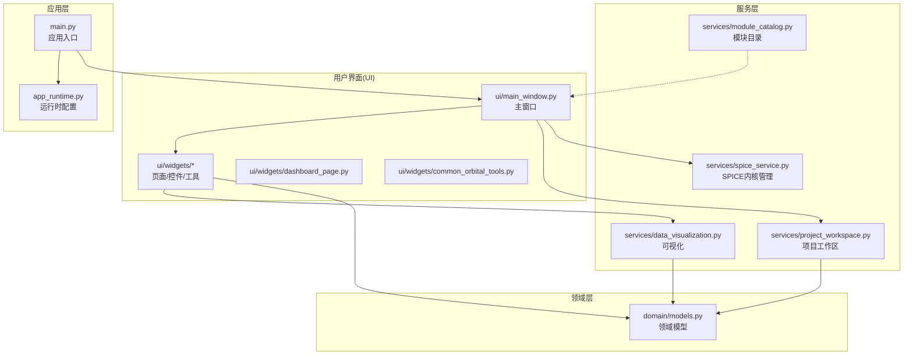
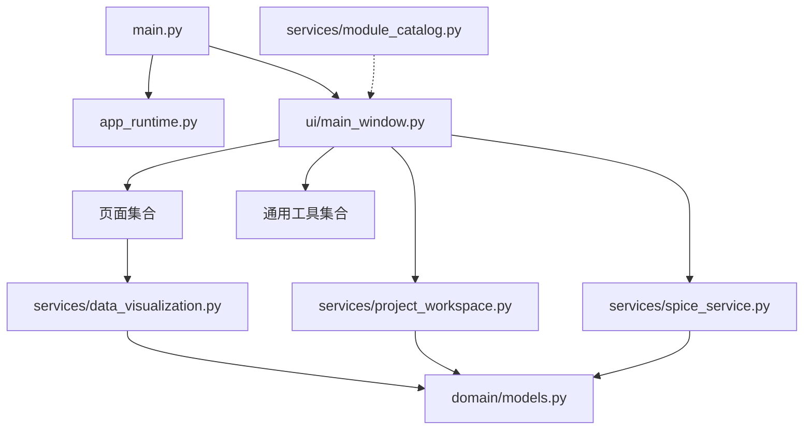
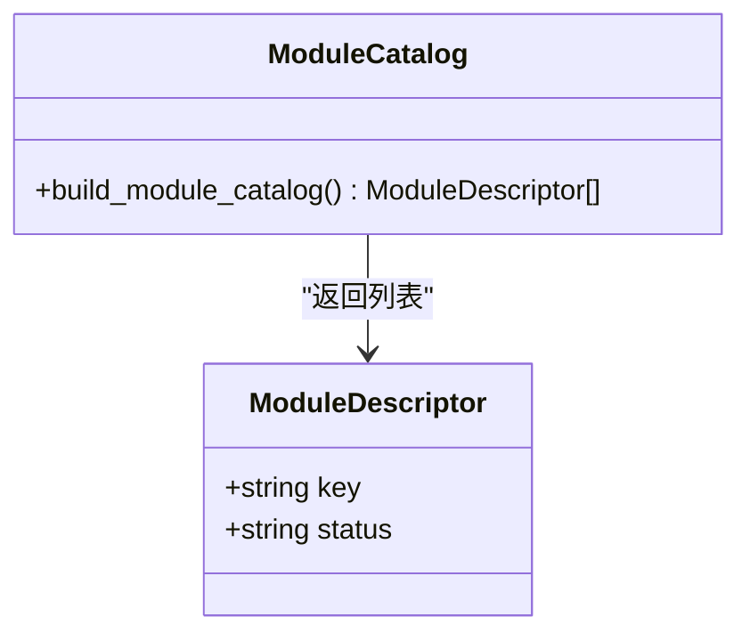
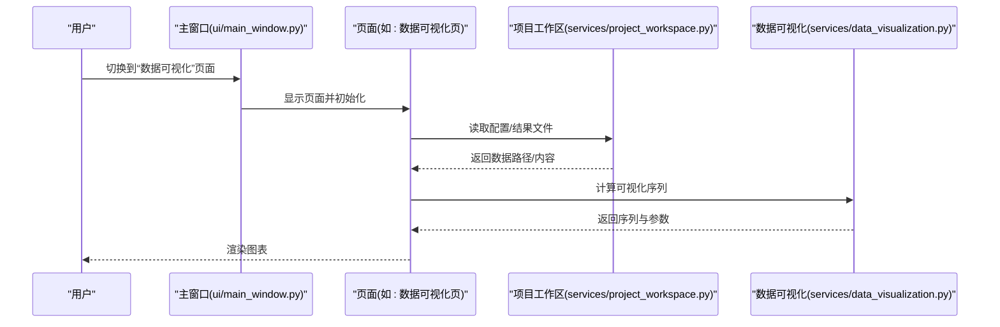
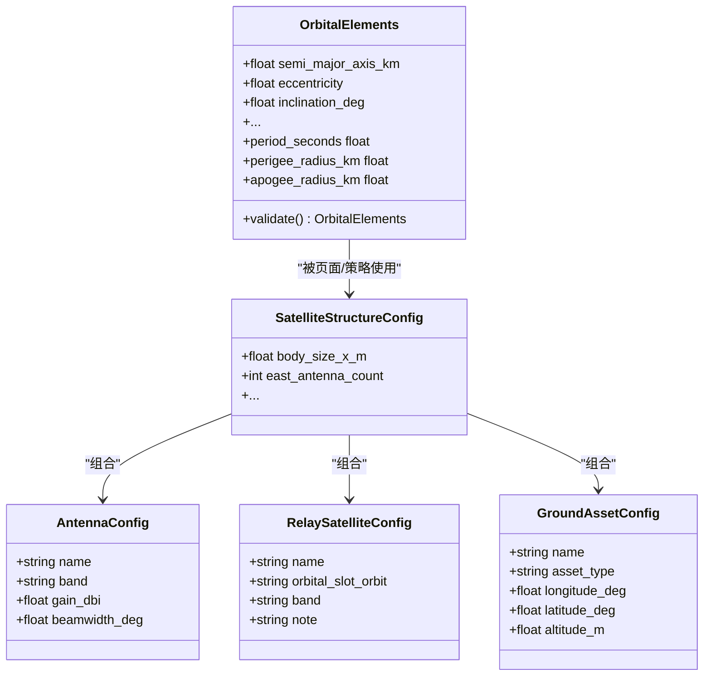
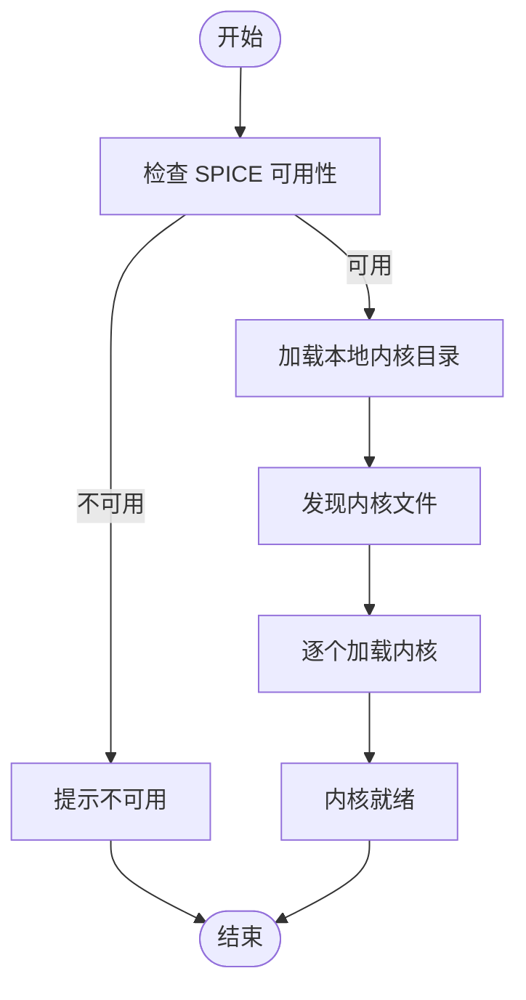
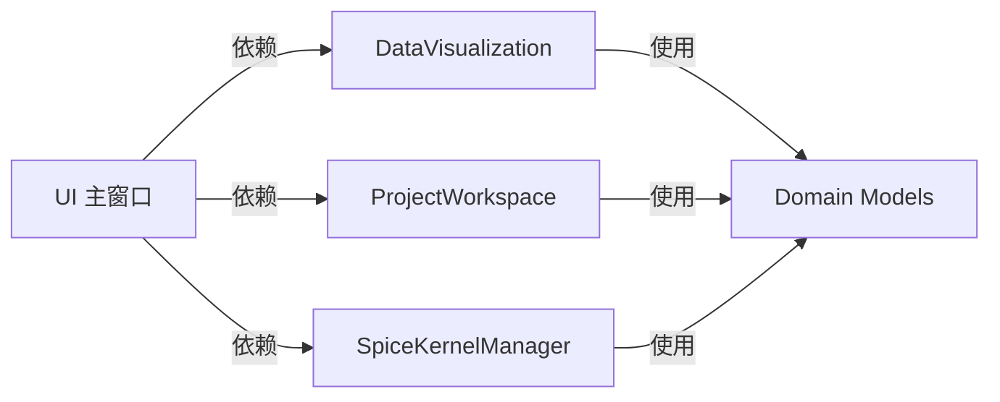

# 模块化设计

<cite>
**本文引用的文件**
- [src/smart/services/module_catalog.py](file://src/smart/services/module_catalog.py)
- [src/smart/app_runtime.py](file://src/smart/app_runtime.py)
- [src/smart/domain/models.py](file://src/smart/domain/models.py)
- [src/smart/ui/widgets/__init__.py](file://src/smart/ui/widgets/__init__.py)
- [src/smart/main.py](file://src/smart/main.py)
- [src/smart/ui/main_window.py](file://src/smart/ui/main_window.py)
- [src/smart/services/project_workspace.py](file://src/smart/services/project_workspace.py)
- [src/smart/ui/widgets/dashboard_page.py](file://src/smart/ui/widgets/dashboard_page.py)
- [src/smart/ui/widgets/common_orbital_tools.py](file://src/smart/ui/widgets/common_orbital_tools.py)
- [src/smart/services/data_visualization.py](file://src/smart/services/data_visualization.py)
- [src/smart/services/spice_service.py](file://src/smart/services/spice_service.py)
- [data/kernels/README.md](file://data/kernels/README.md)
</cite>

## 目录
1. [引言](#引言)
2. [项目结构](#项目结构)
3. [核心组件](#核心组件)
4. [架构总览](#架构总览)
5. [详细组件分析](#详细组件分析)
6. [依赖分析](#依赖分析)
7. [性能考虑](#性能考虑)
8. [故障排查指南](#故障排查指南)
9. [结论](#结论)
10. [附录](#附录)

## 引言
本文件系统性梳理 SMART 项目的模块化设计，围绕以下目标展开：
- 模块组织结构、命名规范与依赖关系
- ModuleCatalog 的作用与模块注册机制
- 服务的动态加载与管理
- UI 组件模块化（页面、控件、工具）的分类与复用
- 领域模型的模块化组织与接口设计
- 模块间解耦策略（接口抽象、依赖倒置、配置驱动）
- 模块扩展指南（新增模块、修改现有模块、处理依赖冲突）

SMART 采用清晰的分层与模块边界：应用入口负责运行时初始化与主题应用；UI 层通过主窗口聚合页面与工具；服务层提供业务能力与外部集成；领域层封装核心数据模型；资源与脚本支撑项目工作流。

## 项目结构
项目采用按功能域划分的模块化布局：
- 应用入口与运行时：main.py、app_runtime.py
- UI 子系统：ui 主目录，包含主窗口、页面、通用控件与工具
- 服务子系统：services 主目录，包含各业务服务与基础设施
- 领域模型：domain 目录，集中定义数据模型与常量
- 资源与数据：assets、data（含 kernels）、scripts
- 测试：tests 目录覆盖各模块

图表来源
- [src/smart/main.py:1-36](file://src/smart/main.py#L1-L36)
- [src/smart/app_runtime.py:1-96](file://src/smart/app_runtime.py#L1-L96)
- [src/smart/ui/main_window.py:1-781](file://src/smart/ui/main_window.py#L1-L781)
- [src/smart/ui/widgets/dashboard_page.py:1-984](file://src/smart/ui/widgets/dashboard_page.py#L1-L984)
- [src/smart/ui/widgets/common_orbital_tools.py:1-1247](file://src/smart/ui/widgets/common_orbital_tools.py#L1-L1247)
- [src/smart/services/module_catalog.py:1-43](file://src/smart/services/module_catalog.py#L1-L43)
- [src/smart/services/project_workspace.py:1-920](file://src/smart/services/project_workspace.py#L1-L920)
- [src/smart/services/data_visualization.py:1-220](file://src/smart/services/data_visualization.py#L1-L220)
- [src/smart/services/spice_service.py:1-305](file://src/smart/services/spice_service.py#L1-L305)
- [src/smart/domain/models.py:1-255](file://src/smart/domain/models.py#L1-L255)

章节来源
- [src/smart/main.py:1-36](file://src/smart/main.py#L1-L36)
- [src/smart/app_runtime.py:1-96](file://src/smart/app_runtime.py#L1-L96)
- [src/smart/ui/main_window.py:1-781](file://src/smart/ui/main_window.py#L1-L781)

## 核心组件
- 应用入口与运行时
  - main.py：创建 QApplication、设置图标与主题、启动 MainWindow
  - app_runtime.py：图形后端与 WebEngine 配置、应用图标加载
- UI 主窗口
  - ui/main_window.py：构建侧边栏导航、项目菜单、页面栈，聚合页面与工具，协调项目工作区与 SPICE
- 服务层
  - services/module_catalog.py：模块目录清单（键名、状态），用于模块化识别与状态展示
  - services/project_workspace.py：项目文件系统抽象、配置/结果读写、路径约定
  - services/spice_service.py：SPICE 内核发现、下载、加载与状态查询
  - services/data_visualization.py：基于轨道历史与策略生成可视化序列
- 领域模型
  - domain/models.py：轨道、航天器、地面资产等核心数据模型与常量

章节来源
- [src/smart/main.py:1-36](file://src/smart/main.py#L1-L36)
- [src/smart/app_runtime.py:1-96](file://src/smart/app_runtime.py#L1-L96)
- [src/smart/ui/main_window.py:1-781](file://src/smart/ui/main_window.py#L1-L781)
- [src/smart/services/module_catalog.py:1-43](file://src/smart/services/module_catalog.py#L1-L43)
- [src/smart/services/project_workspace.py:1-920](file://src/smart/services/project_workspace.py#L1-L920)
- [src/smart/services/spice_service.py:1-305](file://src/smart/services/spice_service.py#L1-L305)
- [src/smart/services/data_visualization.py:1-220](file://src/smart/services/data_visualization.py#L1-L220)
- [src/smart/domain/models.py:1-255](file://src/smart/domain/models.py#L1-L255)

## 架构总览
SMART 采用“应用入口 → UI 主窗口 → 页面/工具 → 服务 → 领域模型”的分层架构。UI 通过主窗口统一编排页面与工具，服务层提供可插拔的能力（如 SPICE），领域模型作为不变的数据契约贯穿各层。

图表来源
- [src/smart/main.py:1-36](file://src/smart/main.py#L1-L36)
- [src/smart/ui/main_window.py:1-781](file://src/smart/ui/main_window.py#L1-L781)
- [src/smart/services/module_catalog.py:1-43](file://src/smart/services/module_catalog.py#L1-L43)
- [src/smart/services/project_workspace.py:1-920](file://src/smart/services/project_workspace.py#L1-L920)
- [src/smart/services/data_visualization.py:1-220](file://src/smart/services/data_visualization.py#L1-L220)
- [src/smart/services/spice_service.py:1-305](file://src/smart/services/spice_service.py#L1-L305)
- [src/smart/domain/models.py:1-255](file://src/smart/domain/models.py#L1-L255)

## 详细组件分析

### 模块目录与模块注册机制
- ModuleCatalog 的职责
  - 提供模块清单（键名、状态），用于 UI 展示与模块状态管理
  - 当前包含轨道设计、策略设计、发射窗口、跟踪弧、飞行程序、科学可视化等模块
- 注册与使用
  - UI 侧通过模块键名进行导航与页面映射
  - 可扩展：新增模块只需在目录中增加条目并确保 UI 导航与页面对应

图表来源
- [src/smart/services/module_catalog.py:6-43](file://src/smart/services/module_catalog.py#L6-L43)

章节来源
- [src/smart/services/module_catalog.py:1-43](file://src/smart/services/module_catalog.py#L1-L43)
- [src/smart/ui/main_window.py:39-50](file://src/smart/ui/main_window.py#L39-L50)

### UI 组件模块化设计
- 页面组件
  - 主窗口集中管理页面栈，包含仪表盘、卫星状态、机动策略、发射窗口、跟踪弧、飞行程序、数据可视化、STK 链接、SPICE 内核等页面
  - 页面通过构造函数注入依赖（如 I18n、ProjectWorkspace、StkLinkService 工厂）
- 控件组件
  - widgets/__init__.py 作为集合入口，便于统一导入
- 工具组件
  - common_orbital_tools.py 提供通用轨道工具对话框（转换、近远地点参数、圆轨道周期、异常换算、日月位置等），以对话框形式复用

图表来源
- [src/smart/ui/main_window.py:110-125](file://src/smart/ui/main_window.py#L110-L125)
- [src/smart/services/project_workspace.py:180-420](file://src/smart/services/project_workspace.py#L180-L420)
- [src/smart/services/data_visualization.py:49-107](file://src/smart/services/data_visualization.py#L49-L107)

章节来源
- [src/smart/ui/main_window.py:1-781](file://src/smart/ui/main_window.py#L1-L781)
- [src/smart/ui/widgets/__init__.py:1-3](file://src/smart/ui/widgets/__init__.py#L1-L3)
- [src/smart/ui/widgets/common_orbital_tools.py:1-1247](file://src/smart/ui/widgets/common_orbital_tools.py#L1-L1247)

### 领域模型的模块化组织
- 数据模型分组
  - 轨道与力学：OrbitalElements、OrbitTrajectory、TwoBodyPropagationResult、LambertTransferResult 等
  - 航天器与载荷：SatelliteStructureConfig、AntennaConfig、RelaySatelliteConfig、GroundAssetConfig、SatelliteStatusSettings
  - 运算结果：HohmannTransferResult、CoplanarHohmannEstimate、PlaneChangeResult、CircularOrbitMetrics、ApsisOrbitMetrics、OrbitalAnomalySet
- 接口设计
  - 使用 dataclass 定义结构化数据，配合 validate 方法进行参数校验
  - 通过属性(property)暴露派生指标（如周期、近/远地点半径等）
- 常量与默认值
  - 地球引力参数、半径等常量集中定义，保证一致性

图表来源
- [src/smart/domain/models.py:17-255](file://src/smart/domain/models.py#L17-L255)

章节来源
- [src/smart/domain/models.py:1-255](file://src/smart/domain/models.py#L1-L255)

### 服务的动态加载与管理
- SPICE 内核管理
  - SpiceKernelManager 提供内核发现、下载、加载与状态查询
  - 支持本地内核根目录配置与去重加载
- 项目工作区
  - ProjectWorkspace 抽象项目文件系统，提供配置/结果文件的读写与路径约定
  - 通过 dataclass 与 JSON 序列化保障跨模块一致的数据契约
- 可视化服务
  - data_visualization 基于轨道历史与策略生成可视化序列，支持参数标签与单位映射

图表来源
- [src/smart/services/spice_service.py:174-221](file://src/smart/services/spice_service.py#L174-L221)
- [data/kernels/README.md:1-12](file://data/kernels/README.md#L1-L12)

章节来源
- [src/smart/services/spice_service.py:1-305](file://src/smart/services/spice_service.py#L1-L305)
- [src/smart/services/project_workspace.py:1-920](file://src/smart/services/project_workspace.py#L1-L920)
- [src/smart/services/data_visualization.py:1-220](file://src/smart/services/data_visualization.py#L1-L220)
- [data/kernels/README.md:1-12](file://data/kernels/README.md#L1-L12)

## 依赖分析
- 组件耦合与内聚
  - UI 与服务通过构造函数注入解耦，主窗口仅持有服务实例引用
  - 服务层内部尽量避免循环依赖，SPICE 为可选依赖，通过异常提示降级
- 外部依赖与集成点
  - SPICE：通过 SpiceKernelManager 封装，避免直接在 UI 层耦合第三方库
  - 项目文件系统：ProjectWorkspace 统一路径与文件读写，降低 UI/服务对文件系统的感知
- 接口契约
  - 领域模型以 dataclass 与 validate 方法形成稳定契约
  - 可视化服务以函数式接口接收配置与历史数据，返回序列对象

图表来源
- [src/smart/ui/main_window.py:1-781](file://src/smart/ui/main_window.py#L1-L781)
- [src/smart/services/project_workspace.py:1-920](file://src/smart/services/project_workspace.py#L1-L920)
- [src/smart/services/data_visualization.py:1-220](file://src/smart/services/data_visualization.py#L1-L220)
- [src/smart/services/spice_service.py:1-305](file://src/smart/services/spice_service.py#L1-L305)
- [src/smart/domain/models.py:1-255](file://src/smart/domain/models.py#L1-L255)

章节来源
- [src/smart/ui/main_window.py:1-781](file://src/smart/ui/main_window.py#L1-L781)
- [src/smart/services/project_workspace.py:1-920](file://src/smart/services/project_workspace.py#L1-L920)
- [src/smart/services/data_visualization.py:1-220](file://src/smart/services/data_visualization.py#L1-L220)
- [src/smart/services/spice_service.py:1-305](file://src/smart/services/spice_service.py#L1-L305)
- [src/smart/domain/models.py:1-255](file://src/smart/domain/models.py#L1-L255)

## 性能考虑
- 图形后端与 WebEngine
  - app_runtime.py 中对图形 API 与 WebEngine 后端进行显式配置，避免不同后端导致的兼容性问题与渲染性能波动
- 可视化计算
  - data_visualization 使用向量化运算（numpy），减少 Python 循环开销
- 文件 I/O
  - ProjectWorkspace 对文件读写进行批量操作与去重，避免重复 IO

## 故障排查指南
- SPICE 不可用
  - 现象：SPICE 状态显示不可用
  - 处理：安装依赖或检查环境；确认内核目录存在且包含受支持的内核文件
  - 参考：runtime_summary 与异常抛出
- 内核加载失败
  - 现象：加载内核时报错或无响应
  - 处理：检查内核路径、文件名后缀、是否重复加载；清理已加载内核后重试
- 项目文件读写错误
  - 现象：保存/打开项目失败
  - 处理：确认项目目录权限、JSON 结构合法性、路径规范化

章节来源
- [src/smart/services/spice_service.py:79-89](file://src/smart/services/spice_service.py#L79-L89)
- [src/smart/services/spice_service.py:188-193](file://src/smart/services/spice_service.py#L188-L193)
- [src/smart/services/project_workspace.py:636-660](file://src/smart/services/project_workspace.py#L636-L660)

## 结论
SMART 的模块化设计以清晰的分层与稳定的契约为核心：UI 通过主窗口聚合页面与工具，服务层提供可插拔能力（SPICE、项目工作区、可视化），领域模型作为不变的数据契约贯穿全链路。ModuleCatalog 为模块化识别与状态展示提供基础，配合依赖注入与配置驱动实现模块间的低耦合与高内聚。该设计便于扩展新模块、维护既有模块，并有效处理模块间依赖冲突。

## 附录

### 模块扩展指南
- 新增模块
  - 在 services/module_catalog.py 中添加 ModuleDescriptor 条目
  - 在 ui/main_window.py 的导航键列表与页面栈中注册新页面
  - 在 ui/widgets 下创建页面组件，并在主窗口中实例化与接入
- 修改现有模块
  - 若涉及领域模型变更，保持 dataclass 字段与默认值稳定，必要时提供向后兼容的解析逻辑
  - 若涉及服务接口变更，优先通过参数扩展或可选参数维持兼容
- 处理模块间依赖冲突
  - 通过依赖注入与工厂模式（如 StkLinkService 工厂）降低耦合
  - 对可选依赖（如 SPICE）提供降级提示与最小化功能集

章节来源
- [src/smart/services/module_catalog.py:12-42](file://src/smart/services/module_catalog.py#L12-L42)
- [src/smart/ui/main_window.py:39-125](file://src/smart/ui/main_window.py#L39-L125)
- [src/smart/ui/widgets/dashboard_page.py:558-800](file://src/smart/ui/widgets/dashboard_page.py#L558-L800)
- [src/smart/services/spice_service.py:174-221](file://src/smart/services/spice_service.py#L174-L221)