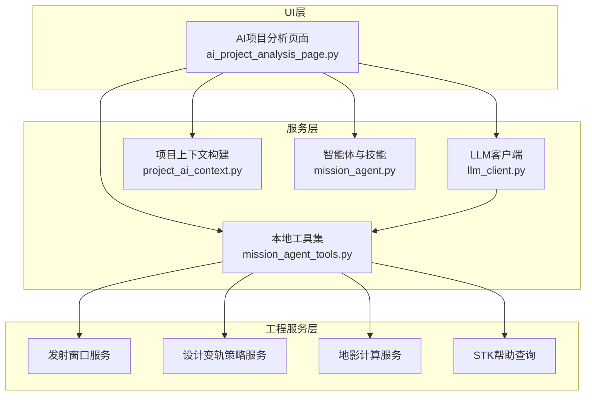
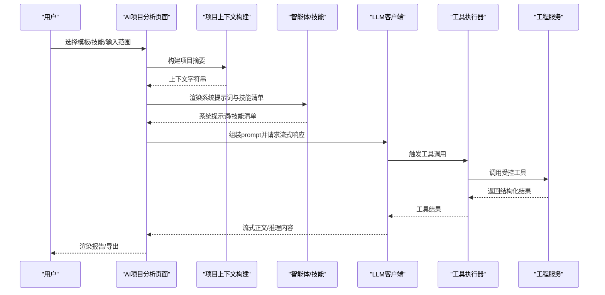
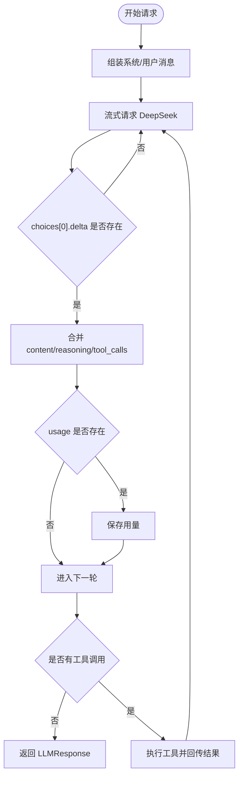
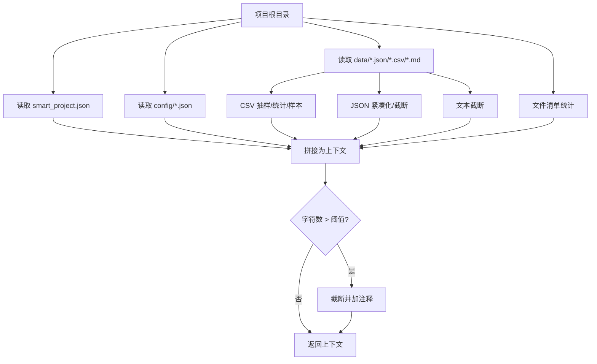
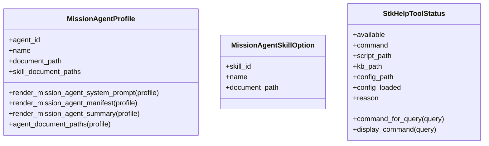
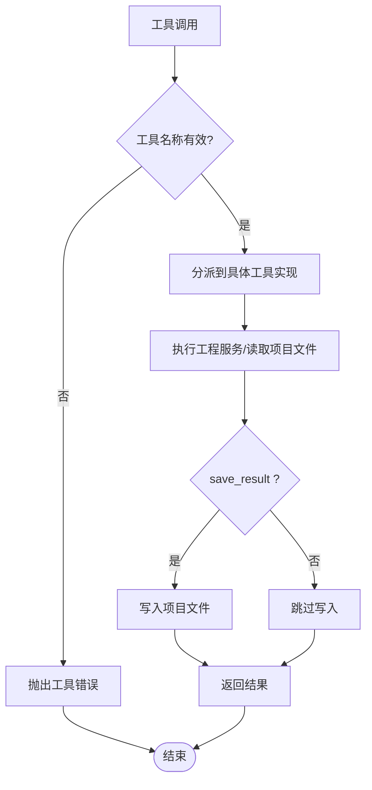
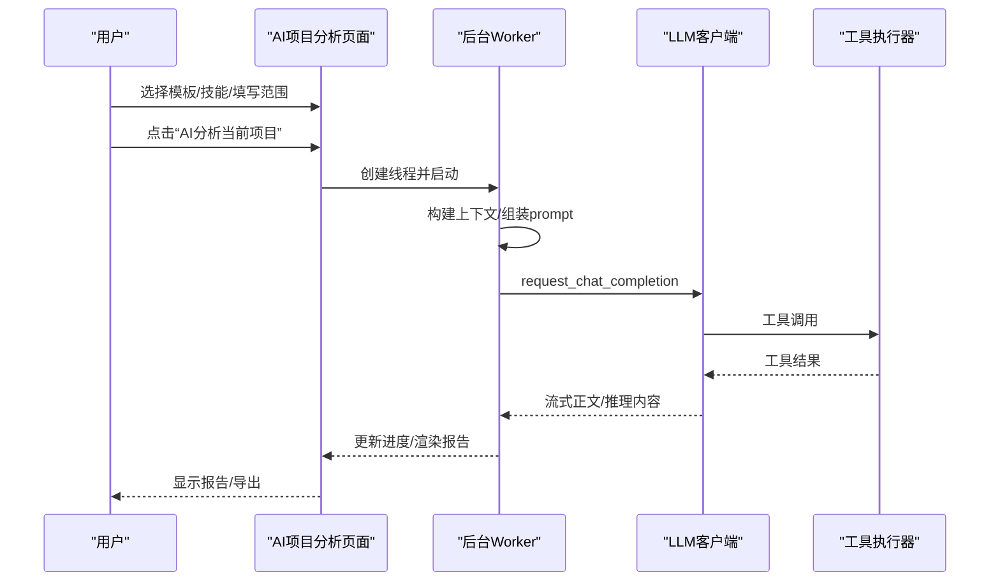
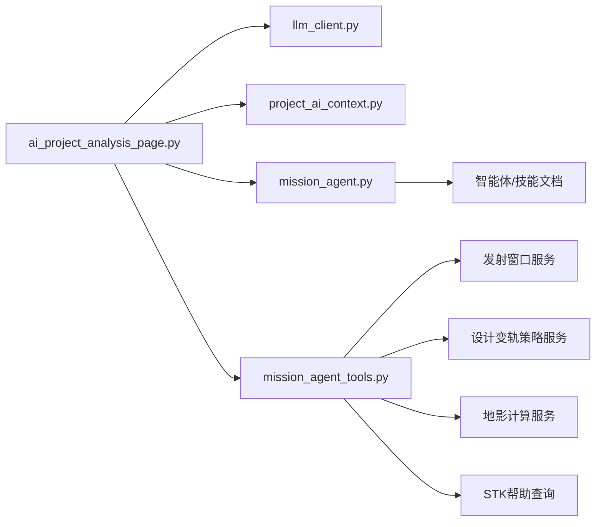

# AI项目分析

<cite>
**本文引用的文件**
- [llm_client.py](file://src/smart/services/llm_client.py)
- [project_ai_context.py](file://src/smart/services/project_ai_context.py)
- [ai_project_analysis_page.py](file://src/smart/ui/widgets/ai_project_analysis_page.py)
- [mission_agent.py](file://src/smart/services/mission_agent.py)
- [mission_agent_tools.py](file://src/smart/services/mission_agent_tools.py)
- [ai_project_analysis.md](file://doc/ai_project_analysis.md)
- [test_ai_project_analysis.py](file://tests/test_ai_project_analysis.py)
- [mission_agent.md](file://src/smart/agents/mission_agent.md)
- [mission_analysis_calculation.md](file://src/smart/agents/skills/mission_analysis_calculation.md)
- [project_consistency_audit.md](file://src/smart/agents/skills/project_consistency_audit.md)
- [AGENTS.md](file://AGENTS.md)
- [ai_project_analysis.md（F4 示例）](file://projects/F4/data/ai_project_analysis.md)
</cite>

## 目录
1. [简介](#简介)
2. [项目结构](#项目结构)
3. [核心组件](#核心组件)
4. [架构总览](#架构总览)
5. [详细组件分析](#详细组件分析)
6. [依赖关系分析](#依赖关系分析)
7. [性能考量](#性能考量)
8. [故障排查指南](#故障排查指南)
9. [结论](#结论)
10. [附录](#附录)

## 简介
本技术文档聚焦 SMART 项目的“AI项目分析”能力，系统阐述其基于大语言模型（LLM）的辅助分析架构、对话与工具调用管理机制、项目上下文构建与信息抽取策略、分析结果的解释与可视化展示、AI与传统航天分析方法的融合模式与互补优势、准确性与可信度评估方法、配置与参数调优指南，以及实际项目中的应用案例与使用经验。

## 项目结构
AI项目分析功能由三层组成：
- UI层：提供交互界面、提示词模板、模型配置、执行日志与报告导出。
- 服务层：封装 LLM 客户端、项目上下文构建、智能体与工具集。
- 工程服务层：提供发射窗口、变轨策略、地影计算、STK帮助查询等受控工具。

**图表来源**
- [ai_project_analysis_page.py:231-1092](file://src/smart/ui/widgets/ai_project_analysis_page.py#L231-L1092)
- [llm_client.py:69-339](file://src/smart/services/llm_client.py#L69-L339)
- [project_ai_context.py:17-217](file://src/smart/services/project_ai_context.py#L17-L217)
- [mission_agent.py:145-240](file://src/smart/services/mission_agent.py#L145-L240)
- [mission_agent_tools.py:42-732](file://src/smart/services/mission_agent_tools.py#L42-L732)

**章节来源**
- [ai_project_analysis_page.py:231-1092](file://src/smart/ui/widgets/ai_project_analysis_page.py#L231-L1092)
- [llm_client.py:69-339](file://src/smart/services/llm_client.py#L69-L339)
- [project_ai_context.py:17-217](file://src/smart/services/project_ai_context.py#L17-L217)
- [mission_agent.py:145-240](file://src/smart/services/mission_agent.py#L145-L240)
- [mission_agent_tools.py:42-732](file://src/smart/services/mission_agent_tools.py#L42-L732)

## 核心组件
- LLM 客户端：封装 DeepSeek V4 Chat Completions API，支持流式响应、推理内容聚合、工具调用编排与进度回调。
- 项目上下文构建：从项目根目录抽取配置、数据摘要与文件清单，进行压缩与截断，确保发送给模型的数据规模可控。
- 智能体与技能：定义“SMART航天器任务分析专家”的角色与能力边界，提供任务分析计算、项目一致性审计、STK 11.6操作等技能。
- 本地工具集：提供受控工具，包括发射窗口查找、地影区间计算、脉冲/连续推力变轨策略规划、窗口重采样、项目文件检查、STK帮助查询等。
- UI页面：提供提示词模板、模型配置、执行日志与报告导出，保障分析过程透明与可追溯。

**章节来源**
- [llm_client.py:69-339](file://src/smart/services/llm_client.py#L69-L339)
- [project_ai_context.py:17-217](file://src/smart/services/project_ai_context.py#L17-L217)
- [mission_agent.py:145-240](file://src/smart/services/mission_agent.py#L145-L240)
- [mission_agent_tools.py:42-732](file://src/smart/services/mission_agent_tools.py#L42-L732)
- [ai_project_analysis_page.py:231-1092](file://src/smart/ui/widgets/ai_project_analysis_page.py#L231-L1092)

## 架构总览
AI项目分析采用“智能体+工具”的协同架构：UI组装分析范围与技能，构建项目上下文，调用 LLM 客户端；LLM 根据系统提示词与工具规范进行推理与工具调用；工具在受控范围内访问项目数据与工程服务，返回结构化结果；最终由 UI 渲染报告并支持导出。

**图表来源**
- [ai_project_analysis_page.py:147-230](file://src/smart/ui/widgets/ai_project_analysis_page.py#L147-L230)
- [llm_client.py:69-225](file://src/smart/services/llm_client.py#L69-L225)
- [mission_agent_tools.py:232-512](file://src/smart/services/mission_agent_tools.py#L232-L512)

**章节来源**
- [ai_project_analysis_page.py:147-230](file://src/smart/ui/widgets/ai_project_analysis_page.py#L147-L230)
- [llm_client.py:69-225](file://src/smart/services/llm_client.py#L69-L225)
- [mission_agent_tools.py:232-512](file://src/smart/services/mission_agent_tools.py#L232-L512)

## 详细组件分析

### LLM 客户端与对话管理
- 请求配置：支持模型、推理强度、思维开关、超时、最大工具轮次、推理内容暴露与工具参数日志等。
- 流式处理：解析 SSE 事件，聚合正文与推理内容，累积工具调用，支持进度回调。
- 工具调用循环：当 LLM 请求工具调用时，执行器按名称与参数调用本地工具，将结果以工具消息回传，直至无工具调用或达到轮次上限。
- 错误处理：对无效参数、HTTP错误、超时、SSE负载异常等进行统一错误包装与上报。

**图表来源**
- [llm_client.py:164-225](file://src/smart/services/llm_client.py#L164-L225)
- [llm_client.py:228-271](file://src/smart/services/llm_client.py#L228-L271)

**章节来源**
- [llm_client.py:69-339](file://src/smart/services/llm_client.py#L69-L339)

### 项目AI上下文构建与信息抽取
- 数据来源：smart_project.json、config/*.json、data/*.json、data/*.csv、ai_project_analysis.md、charts/* 等。
- 抽样与统计：对 CSV 进行列名、行数、数值统计与样本抽取；对 JSON 进行紧凑化与截断；对文本进行长度截断。
- 文件清单：遍历 config/data/charts，统计文件数量与大小，限制展示数量。
- 截断策略：整体字符数超过阈值时截断并标记“已截断”。

**图表来源**
- [project_ai_context.py:17-56](file://src/smart/services/project_ai_context.py#L17-L56)
- [project_ai_context.py:83-154](file://src/smart/services/project_ai_context.py#L83-L154)

**章节来源**
- [project_ai_context.py:17-217](file://src/smart/services/project_ai_context.py#L17-L217)

### 智能体与技能体系
- 智能体：定义“SMART航天器任务分析专家”的角色、工作原则与回答要求。
- 技能：
  - 任务分析计算：覆盖变轨策略、发射窗口、跟踪弧段、地影、轨道状态与工程输出解释。
  - 项目一致性审计：检查配置、缓存、结果、图表与报告之间的一致性，识别过期与漂移。
  - STK 11.6 操作：提供 STK 帮助查询与本机安装路径、KB、命令行工具的解析与调用。
- 系统提示词与技能清单：由智能体加载文档并拼装，注入 LLM 的 system prompt 与对话上下文。

**图表来源**
- [mission_agent.py:40-120](file://src/smart/services/mission_agent.py#L40-L120)
- [mission_agent.py:145-240](file://src/smart/services/mission_agent.py#L145-L240)

**章节来源**
- [mission_agent.py:145-240](file://src/smart/services/mission_agent.py#L145-L240)
- [mission_agent.md:1-27](file://src/smart/agents/mission_agent.md#L1-L27)
- [mission_analysis_calculation.md:1-48](file://src/smart/agents/skills/mission_analysis_calculation.md#L1-L48)
- [project_consistency_audit.md:1-56](file://src/smart/agents/skills/project_consistency_audit.md#L1-L56)

### 本地工具集与受控执行
- 工具清单：构建项目上下文、查找发射窗口、计算地影区间、规划脉冲/连续推力变轨策略、重采样发射窗口、检查项目文件、查询 STK 帮助。
- 受控写入：默认只读；仅当显式参数 save_result=true 时写入项目文件，避免无意覆盖。
- 参数校验与合并：对配置覆盖进行深合并，保证参数一致性。
- STK 帮助：优先使用环境变量/配置文件/默认路径解析命令与脚本，支持回退命令。

**图表来源**
- [mission_agent_tools.py:232-512](file://src/smart/services/mission_agent_tools.py#L232-L512)

**章节来源**
- [mission_agent_tools.py:42-732](file://src/smart/services/mission_agent_tools.py#L42-L732)

### UI页面与交互流程
- 提示词模板：提供“项目综合体检”“设计变轨策略复核”“连续推力优化复核”“发射窗口约束重采样”“跟踪弧段与地影风险”“飞行程序与结果一致性”等模板，支持编辑与套用。
- 模型配置：支持 DeepSeek base_url、api_key、模型、推理强度、思维开关等，支持保存到本地设置。
- 执行日志：显示上下文构建、prompt组装、推理内容、工具调用与结果摘要，支持折叠/展开。
- 报告导出：支持导出 Markdown、DOCX、PDF，报告包含生成时间、项目目录、分析范围、模型名与正文。

**图表来源**
- [ai_project_analysis_page.py:147-230](file://src/smart/ui/widgets/ai_project_analysis_page.py#L147-L230)
- [ai_project_analysis_page.py:530-620](file://src/smart/ui/widgets/ai_project_analysis_page.py#L530-L620)

**章节来源**
- [ai_project_analysis_page.py:231-1092](file://src/smart/ui/widgets/ai_project_analysis_page.py#L231-L1092)
- [ai_project_analysis.md:1-103](file://doc/ai_project_analysis.md#L1-L103)

## 依赖关系分析
- UI依赖服务层：AI项目分析页面依赖 LLM 客户端、项目上下文构建、智能体与工具集。
- 服务层依赖工程服务：工具集依赖发射窗口、变轨策略、地影计算、STK帮助查询等工程服务。
- 智能体文档：智能体与技能文档位于独立 Markdown 文件，便于维护与演进。
- 测试覆盖：测试覆盖上下文构建、提示词组装、工具规格、STK帮助解析、报告导出等关键路径。

**图表来源**
- [ai_project_analysis_page.py:10-36](file://src/smart/ui/widgets/ai_project_analysis_page.py#L10-L36)
- [mission_agent.py:31-37](file://src/smart/services/mission_agent.py#L31-L37)
- [mission_agent_tools.py:12-32](file://src/smart/services/mission_agent_tools.py#L12-L32)

**章节来源**
- [test_ai_project_analysis.py:1-490](file://tests/test_ai_project_analysis.py#L1-L490)

## 性能考量
- 流式响应：使用 SSE 流式返回，降低首字节延迟，提升交互体验。
- 上下文截断：对 CSV/JSON/文本进行抽样与截断，避免超大载荷导致传输与解析开销。
- 工具调用轮次控制：限制最大工具轮次，防止长链路调用导致资源占用。
- UI线程隔离：后台线程执行 LLM 请求与工具调用，避免阻塞 UI。
- 报告导出：Markdown/DOCX/PDF 导出采用轻量处理，避免重复解析与内存峰值。

[本节为通用指导，无需特定文件来源]

## 故障排查指南
- API密钥与URL：检查页面输入或环境变量设置，确认 base_url 与模型名称正确。
- 工具调用失败：查看执行日志中的工具调用与返回摘要，定位缺失文件或参数错误。
- STK帮助不可用：检查环境变量/配置文件/默认路径，确认 KB 与命令行工具可用。
- 报告未生成：确认后台线程正常启动与完成，查看状态栏与执行日志。
- 测试验证：参考测试用例，验证上下文构建、提示词组装、工具规格与导出流程。

**章节来源**
- [ai_project_analysis_page.py:530-620](file://src/smart/ui/widgets/ai_project_analysis_page.py#L530-L620)
- [test_ai_project_analysis.py:168-490](file://tests/test_ai_project_analysis.py#L168-L490)

## 结论
SMART 的 AI项目分析通过“智能体+工具”的协同架构，实现了对航天项目配置与数据的自动化分析与交叉验证。其核心优势在于：
- 可控工具调用：所有外部访问均在受控范围内，避免敏感数据泄露与意外写入。
- 透明过程：流式推理内容与工具调用轨迹可被观察与审计。
- 工程导向：优先调用本地工程服务与项目数据，输出可复核的工程结论与最小修复建议。
- 可视化与可追溯：报告导出与执行日志便于复盘与知识沉淀。

[本节为总结性内容，无需特定文件来源]

## 附录

### AI与传统航天分析的结合模式与互补优势
- 结合模式：AI负责跨模块一致性审计、跨文件交叉验证与复杂场景的综合归纳；传统工程服务负责精确的轨道/窗口/变轨计算与可视化。
- 互补优势：AI提供“全局视角”的风险识别与最小修复路径，传统方法提供“局部精确”的计算与验证，二者协同提升分析效率与质量。

[本节为概念性内容，无需特定文件来源]

### AI分析结果的解释与可视化展示
- 报告结构：包含生成时间、项目目录、分析范围、模型名与正文。
- 可视化：支持导出 Markdown、DOCX、PDF；报告中可包含表格、甘特图链接与证据路径。
- 交互：执行日志可折叠查看，便于快速定位问题与工具调用轨迹。

**章节来源**
- [ai_project_analysis_page.py:219-228](file://src/smart/ui/widgets/ai_project_analysis_page.py#L219-L228)
- [ai_project_analysis.md:81-103](file://doc/ai_project_analysis.md#L81-L103)

### AI分析的准确性评估与可信度计算
- 评估维度：工具调用覆盖率、上下文完整性、结论来源标注（工具结果/工程判断）、约束检查通过率。
- 可信度指标：可基于工具调用次数、上下文字符数、推理内容长度、结果一致性与历史回归误差等进行量化评估。
- 建议：建立基线数据集与回归测试，定期评估模型输出稳定性与一致性。

[本节为通用指导，无需特定文件来源]

### 配置选项与参数调优指南
- 模型与推理：根据任务复杂度选择推理强度与思维开关；合理设置超时与工具轮次。
- 上下文规模：通过 row_limit 与 char_limit 控制 CSV抽样与上下文截断，平衡信息完整性与性能。
- 工具参数：谨慎使用 save_result，优先只读验证；必要时逐步开启写入以确认结果。
- 环境变量：优先使用环境变量管理 API key，避免硬编码与误提交。

**章节来源**
- [ai_project_analysis_page.py:574-590](file://src/smart/ui/widgets/ai_project_analysis_page.py#L574-L590)
- [llm_client.py:31-42](file://src/smart/services/llm_client.py#L31-L42)
- [project_ai_context.py:13-14](file://src/smart/services/project_ai_context.py#L13-L14)

### 实际项目中的AI辅助分析案例与使用经验
- F4项目端到端体检：通过工具调用与缓存对比，识别飞行程序、发射窗口、跟踪弧段与地影分析的过期与漂移问题，提出按优先级的最小修复清单。
- 使用经验：先用模板确定分析范围，再选择技能聚焦领域；利用执行日志定位问题；优先只读验证，确认后再写入项目文件。

**章节来源**
- [ai_project_analysis.md（F4 示例）:1-220](file://projects/F4/data/ai_project_analysis.md#L1-L220)
- [AGENTS.md:92-103](file://AGENTS.md#L92-L103)