# SPICE内核管理

<cite>
**本文档引用的文件**
- [spice_service.py](file://src/smart/services/spice_service.py)
- [spice_kernel_page.py](file://src/smart/ui/widgets/spice_kernel_page.py)
- [spice_usage.md](file://doc/spice_usage.md)
- [README.md](file://data/kernels/README.md)
- [test_spice_service.py](file://tests/test_spice_service.py)
- [orbit_initialization.py](file://src/smart/services/orbit_initialization.py)
- [orbital_mechanics.py](file://src/smart/services/orbital_mechanics.py)
- [stk_ephemeris.py](file://src/smart/services/stk_ephemeris.py)
- [earth_orientation.py](file://src/smart/services/earth_orientation.py)
- [pck00011.tpc](file://data/kernels/pck00011.tpc)
</cite>

## 目录
1. [简介](#简介)
2. [项目结构](#项目结构)
3. [核心组件](#核心组件)
4. [架构概览](#架构概览)
5. [详细组件分析](#详细组件分析)
6. [依赖关系分析](#依赖关系分析)
7. [性能考虑](#性能考虑)
8. [故障排除指南](#故障排除指南)
9. [结论](#结论)
10. [附录](#附录)

## 简介

SMART项目中的SPICE内核管理系统是一个基于NASA SPICE Toolkit的航天器轨道分析和天体动力学计算框架。该系统提供了完整的内核加载、管理和缓存机制，支持天体状态查询、坐标系转换和时间处理等功能。

SPICE（Spacecraft Planet Instrument C-matrix Pointing Interpreter）是由NASA开发的航天器几何学和导航工具包，广泛应用于深空探测任务的轨道计算和姿态控制。在SMART项目中，SPICE内核管理功能为所有与轨道、时间、坐标系和状态向量相关的处理提供了标准化的实现。

## 项目结构

SMART项目采用模块化的架构设计，SPICE内核管理功能主要分布在以下目录中：

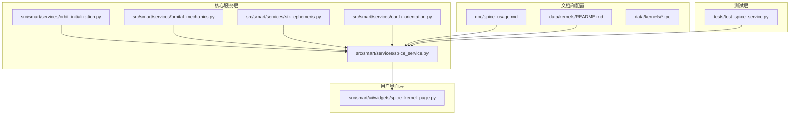

**图表来源**
- [spice_service.py:1-305](file://src/smart/services/spice_service.py#L1-L305)
- [spice_kernel_page.py:1-554](file://src/smart/ui/widgets/spice_kernel_page.py#L1-L554)

**章节来源**
- [spice_service.py:1-305](file://src/smart/services/spice_service.py#L1-L305)
- [spice_usage.md:1-235](file://doc/spice_usage.md#L1-L235)

## 核心组件

### SpiceKernelManager类

`SpiceKernelManager`是SPICE内核管理的核心类，提供了完整的内核生命周期管理功能：

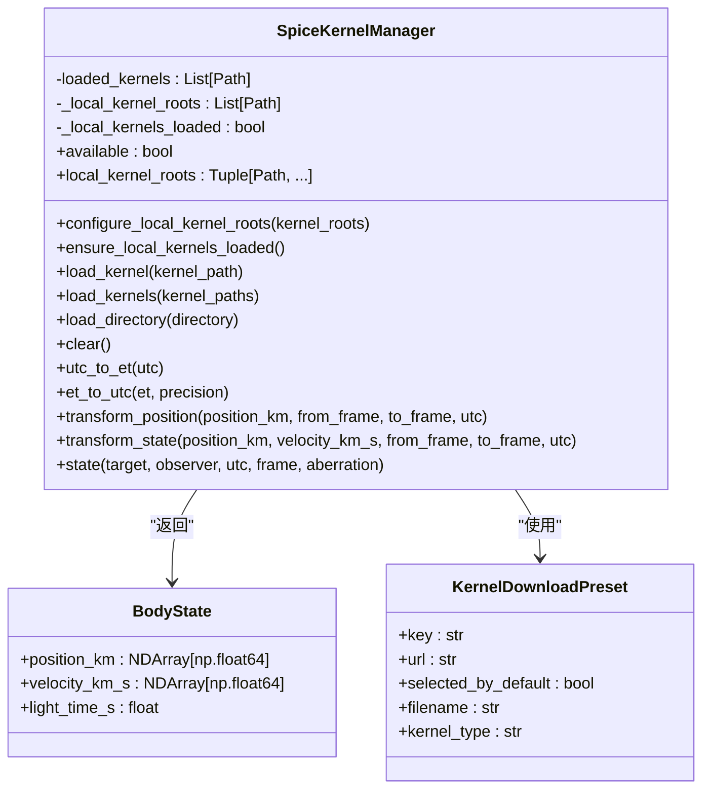

**图表来源**
- [spice_service.py:28-305](file://src/smart/services/spice_service.py#L28-L305)

### 内核类型支持

系统支持多种SPICE内核格式，每种内核承担不同的功能：

| 内核类型 | 文件后缀 | 主要用途 | 示例文件 |
|---------|----------|----------|----------|
| 时间内核 | .tls | 历元时间定义、闰秒信息 | naif0012.tls |
| 参数常数内核 | .tpc | 天体物理常数、半径等 | pck00011.tpc |
| 固体参考系内核 | .tf | 坐标系变换矩阵 | earth_assoc_itrf93.tf |
| 轨道星历内核 | .bsp | 天体位置和速度数据 | de440s.bsp |
| 地球定向内核 | .bpc | 地球自转参数 | earth_latest_high_prec.bpc |

**章节来源**
- [spice_service.py:19-76](file://src/smart/services/spice_service.py#L19-L76)
- [spice_usage.md:22-52](file://doc/spice_usage.md#L22-L52)

## 架构概览

SMART的SPICE内核管理架构采用了分层设计，确保了功能的模块化和可维护性：

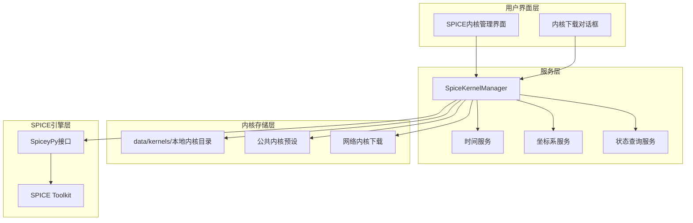

**图表来源**
- [spice_kernel_page.py:200-554](file://src/smart/ui/widgets/spice_kernel_page.py#L200-L554)
- [spice_service.py:174-305](file://src/smart/services/spice_service.py#L174-L305)

## 详细组件分析

### 内核发现和加载机制

内核发现机制实现了智能的文件扫描和去重功能：

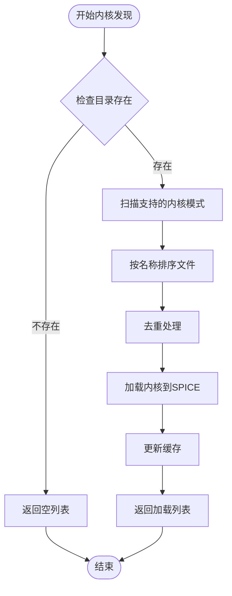

**图表来源**
- [spice_service.py:91-235](file://src/smart/services/spice_service.py#L91-L235)

### 时间处理系统

SMART实现了完整的时间处理系统，支持UTC和ET（ Ephemeris Time）之间的转换：

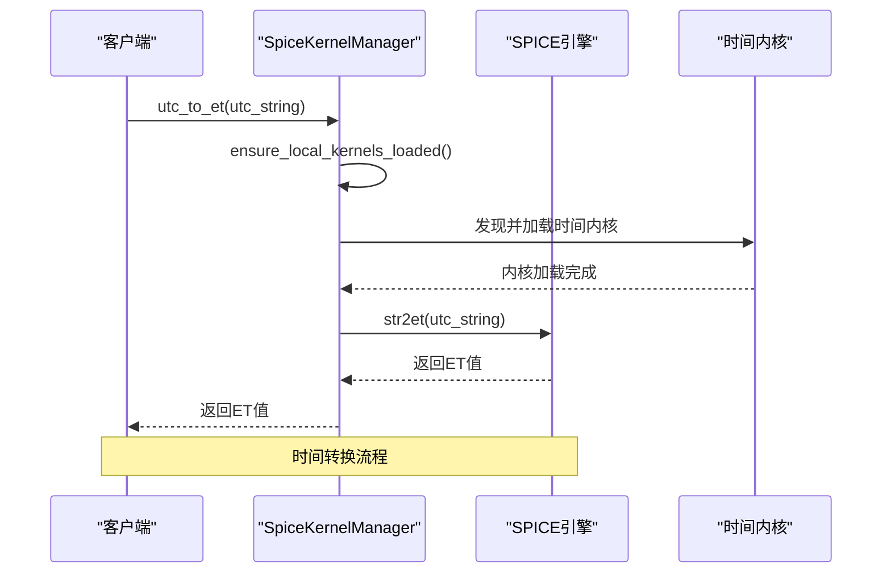

**图表来源**
- [spice_service.py:241-249](file://src/smart/services/spice_service.py#L241-L249)
- [orbit_initialization.py:48-71](file://src/smart/services/orbit_initialization.py#L48-L71)

### 坐标系转换系统

坐标系转换系统提供了位置和状态向量的转换功能：

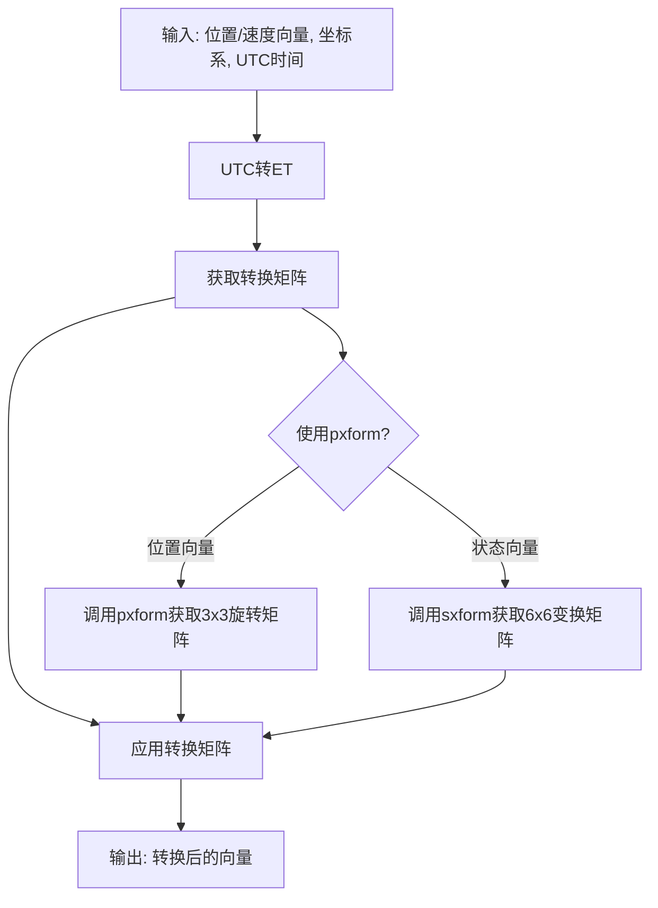

**图表来源**
- [spice_service.py:251-285](file://src/smart/services/spice_service.py#L251-L285)

### STK星历导入处理

SMART支持STK星历文件的导入和处理，实现了复杂的坐标系转换：

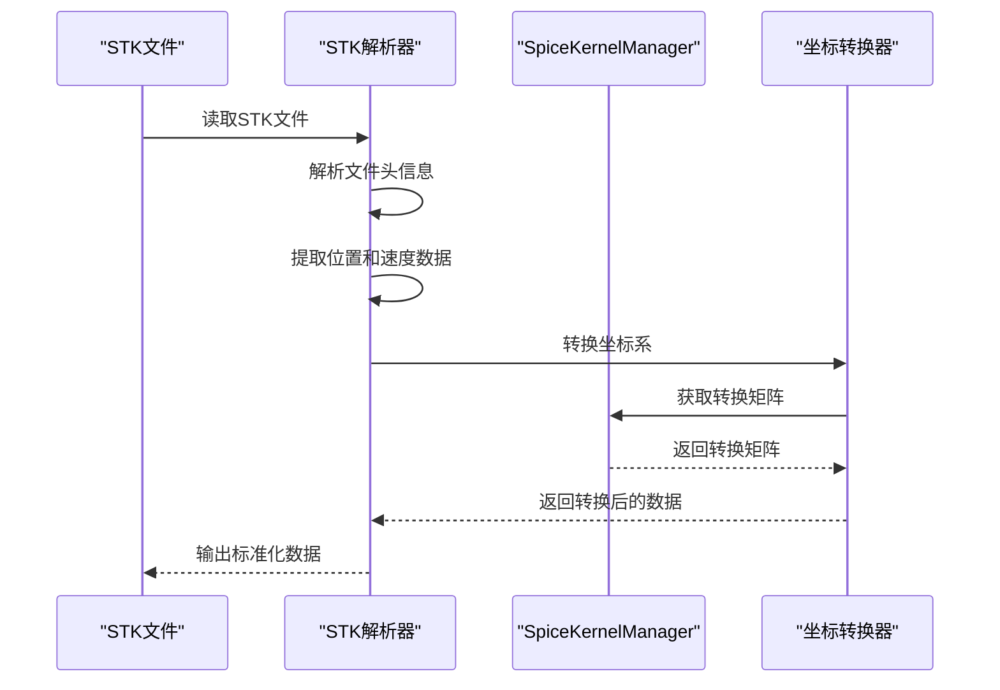

**图表来源**
- [orbit_initialization.py:140-283](file://src/smart/services/orbit_initialization.py#L140-L283)

**章节来源**
- [spice_service.py:174-305](file://src/smart/services/spice_service.py#L174-L305)
- [spice_kernel_page.py:406-510](file://src/smart/ui/widgets/spice_kernel_page.py#L406-L510)

## 依赖关系分析

### 外部依赖

SMART项目对SPICE系统的依赖关系如下：

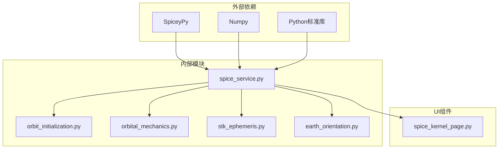

**图表来源**
- [spice_service.py:1-16](file://src/smart/services/spice_service.py#L1-L16)
- [spice_kernel_page.py:8-17](file://src/smart/ui/widgets/spice_kernel_page.py#L8-L17)

### 内部模块耦合

各模块之间的依赖关系体现了清晰的分层架构：

| 模块 | 依赖模块 | 依赖类型 | 说明 |
|------|----------|----------|------|
| spice_service.py | 无 | 核心服务 | 提供SPICE接口封装 |
| spice_kernel_page.py | spice_service.py | UI层 | 提供内核管理界面 |
| orbit_initialization.py | spice_service.py | 业务层 | 轨道初始化处理 |
| orbital_mechanics.py | spice_service.py | 业务层 | 轨道力学计算 |
| stk_ephemeris.py | spice_service.py | 业务层 | STK星历处理 |
| earth_orientation.py | spice_service.py | 业务层 | 地球定向计算 |

**章节来源**
- [spice_service.py:1-305](file://src/smart/services/spice_service.py#L1-L305)
- [spice_kernel_page.py:1-554](file://src/smart/ui/widgets/spice_kernel_page.py#L1-L554)

## 性能考虑

### 缓存策略

SMART实现了多层次的缓存机制来优化性能：

1. **内核缓存**: 已加载的内核会被缓存，避免重复加载
2. **转换矩阵缓存**: 坐标系转换结果在相同时间点会被缓存
3. **时间转换缓存**: 常用的时间转换操作会被缓存

### 内存管理

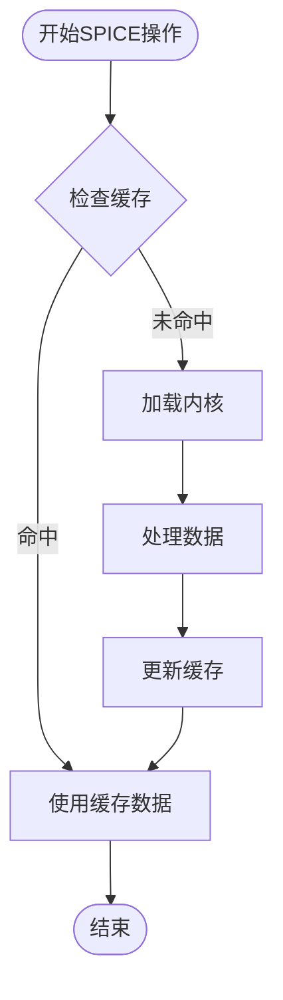

### 并发处理

系统支持多线程环境下的SPICE操作，但需要注意以下限制：
- SPICE引擎本身不是线程安全的
- 需要在应用层面进行适当的同步控制
- 建议使用单例模式管理SpiceKernelManager实例

## 故障排除指南

### 常见问题及解决方案

| 问题类型 | 症状 | 可能原因 | 解决方案 |
|----------|------|----------|----------|
| 内核加载失败 | FileNotFoundError | 内核文件不存在 | 检查内核文件路径和权限 |
| SPICE不可用 | SpiceUnavailableError | SpiceyPy未安装 | 安装SpiceyPy依赖 |
| 坐标系转换错误 | TransformError | 坐标系定义不正确 | 检查坐标系名称和内核完整性 |
| 时间转换异常 | TimeError | 时间格式不正确 | 验证UTC时间格式 |

### 错误处理机制

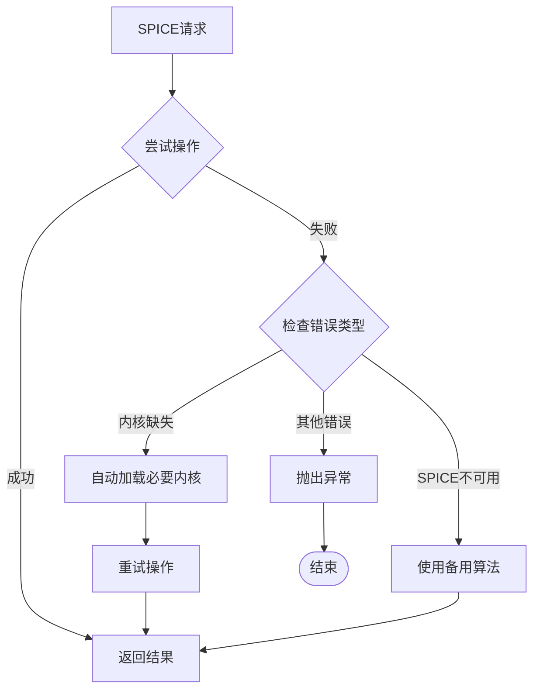

**章节来源**
- [spice_service.py:24-26](file://src/smart/services/spice_service.py#L24-L26)
- [spice_kernel_page.py:406-440](file://src/smart/ui/widgets/spice_kernel_page.py#L406-L440)

## 结论

SMART项目的SPICE内核管理系统提供了一个完整、健壮且高效的航天器轨道分析框架。通过模块化的架构设计、完善的错误处理机制和优化的性能策略，该系统能够满足复杂航天任务的需求。

系统的主要优势包括：
- **标准化接口**: 所有SPICE功能都通过统一的接口提供
- **智能缓存**: 多层次缓存机制显著提升性能
- **完整的UI支持**: 提供直观的内核管理界面
- **健壮的错误处理**: 完善的异常处理和降级策略
- **灵活的配置**: 支持多种内核组合和自定义配置

未来可以考虑的改进方向：
- 增加内核验证机制
- 实现更精细的缓存控制
- 添加内核更新通知功能
- 优化大文件内核的加载性能

## 附录

### API使用示例

#### 基本内核管理
```python
from smart.services.spice_service import SpiceKernelManager

# 创建内核管理器
manager = SpiceKernelManager()

# 自动加载本地内核
manager.ensure_local_kernels_loaded()

# 加载特定内核
manager.load_kernel("/path/to/kernel.bsp")

# 清空已加载内核
manager.clear()
```

#### 时间处理
```python
# UTC转ET
et = manager.utc_to_et("2026-04-18T12:00:00Z")

# ET转UTC
utc = manager.et_to_utc(et, precision=3)
```

#### 坐标系转换
```python
# 位置向量转换
position_j2000, velocity_j2000 = manager.transform_state(
    [7000.0, 0.0, 0.0],
    [0.0, 7.5, 1.0],
    from_frame="ITRF93",
    to_frame="J2000",
    utc="2026-04-18T12:00:00Z"
)
```

### 内核文件格式说明

#### PCK文件格式
PCK（Planetary Constants Kernel）文件用于存储天体物理常数和几何参数：

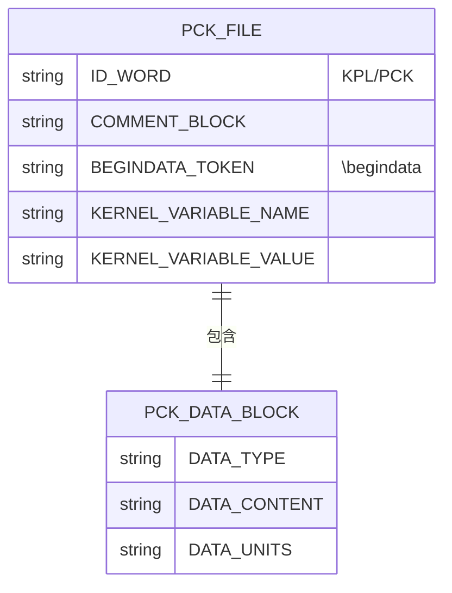

**图表来源**
- [pck00011.tpc:562-620](file://data/kernels/pck00011.tpc#L562-L620)

### 最佳实践建议

1. **内核组织**: 将项目专用内核放在项目目录下，通用内核放在仓库根目录
2. **命名规范**: 使用清晰的内核文件命名，便于识别和管理
3. **版本控制**: 对重要的内核文件进行版本控制
4. **备份策略**: 定期备份关键内核文件
5. **监控告警**: 建立内核加载状态的监控机制