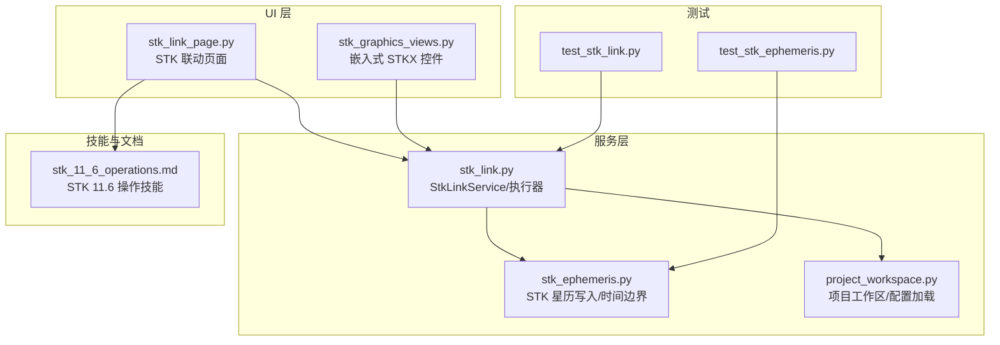
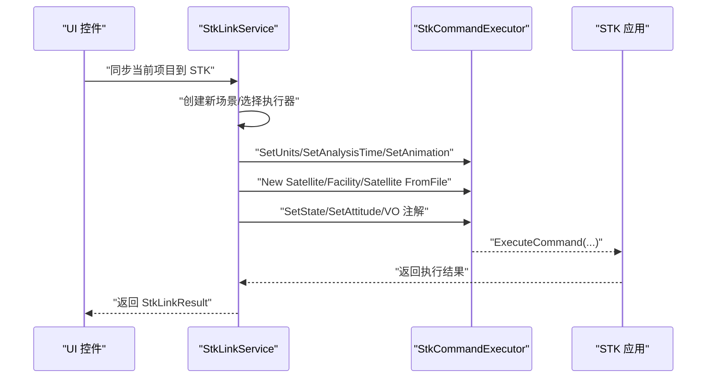
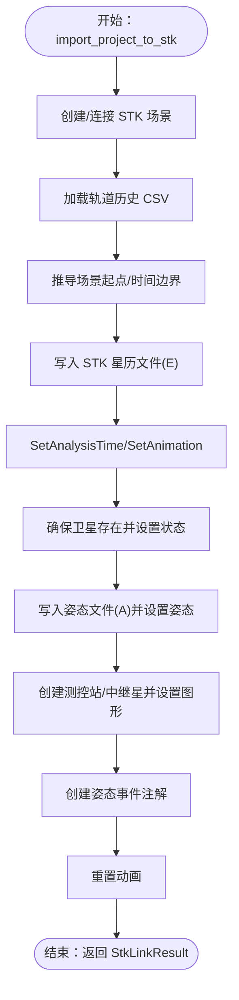
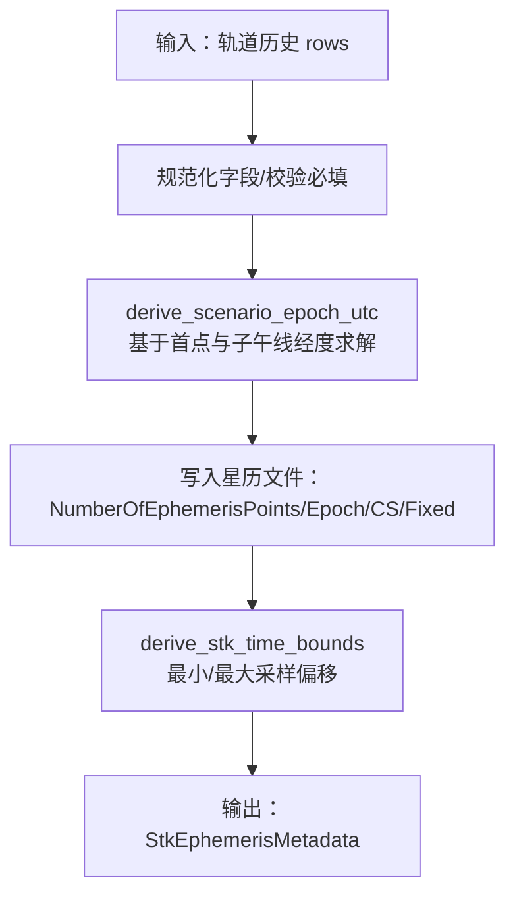
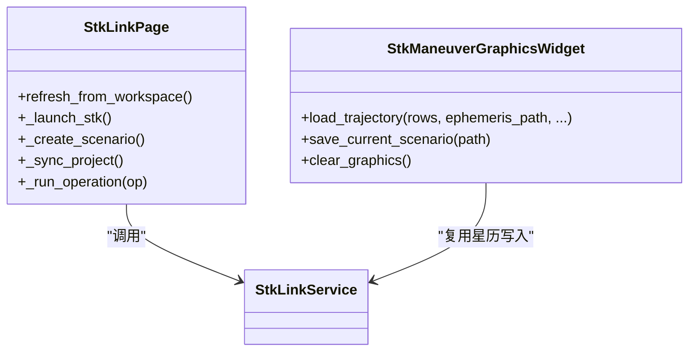
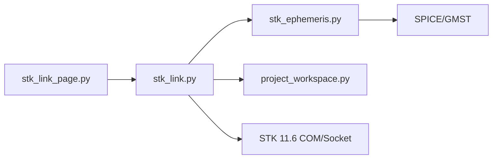

# STK联动

<cite>
**本文引用的文件**
- [src/smart/services/stk_link.py](file://src/smart/services/stk_link.py)
- [src/smart/services/stk_ephemeris.py](file://src/smart/services/stk_ephemeris.py)
- [src/smart/ui/widgets/stk_link_page.py](file://src/smart/ui/widgets/stk_link_page.py)
- [src/smart/ui/widgets/stk_graphics_views.py](file://src/smart/ui/widgets/stk_graphics_views.py)
- [src/smart/agents/skills/stk_11_6_operations.md](file://src/smart/agents/skills/stk_11_6_operations.md)
- [tests/test_stk_link.py](file://tests/test_stk_link.py)
- [tests/test_stk_ephemeris.py](file://tests/test_stk_ephemeris.py)
- [src/smart/services/project_workspace.py](file://src/smart/services/project_workspace.py)
- [projects/F4/config/tracking_arc.json](file://projects/F4/config/tracking_arc.json)
- [projects/F4/config/satellite_3d_model.json](file://projects/F4/config/satellite_3d_model.json)
</cite>

## 目录
1. [简介](#简介)
2. [项目结构](#项目结构)
3. [核心组件](#核心组件)
4. [架构总览](#架构总览)
5. [详细组件分析](#详细组件分析)
6. [依赖关系分析](#依赖关系分析)
7. [性能考量](#性能考量)
8. [故障排除指南](#故障排除指南)
9. [结论](#结论)
10. [附录](#附录)

## 简介
本技术文档围绕 SMART 项目与 STK 11.6 的联动能力，系统阐述了基于 COM 接口与 Connect Socket 的双向数据交换机制，覆盖场景创建、轨道与姿态数据导出、测控站与中继星同步、时间序列管理、坐标系与时间基准统一、以及数据一致性与冲突处理策略。同时提供 STK 场景配置与卫星模型导入的完整流程、故障排除与性能优化建议，并给出实际工程应用中的案例与最佳实践。

## 项目结构
SMART 的 STK 集成主要由以下模块构成：
- 服务层：负责与 STK 交互、生成 STK 文件、解析与转换时间与坐标系
- UI 层：提供图形界面以启动 STK、创建场景、同步项目到 STK
- 工具与技能：提供 STK 11.6 操作技能与帮助入口
- 测试：验证 STK 导出文件格式、时间边界推导、资产同步等关键逻辑

图表来源
- [src/smart/ui/widgets/stk_link_page.py:36-324](file://src/smart/ui/widgets/stk_link_page.py#L36-L324)
- [src/smart/ui/widgets/stk_graphics_views.py:259-766](file://src/smart/ui/widgets/stk_graphics_views.py#L259-L766)
- [src/smart/services/stk_link.py:199-755](file://src/smart/services/stk_link.py#L199-L755)
- [src/smart/services/stk_ephemeris.py:34-278](file://src/smart/services/stk_ephemeris.py#L34-L278)
- [src/smart/services/project_workspace.py:64-200](file://src/smart/services/project_workspace.py#L64-L200)
- [src/smart/agents/skills/stk_11_6_operations.md:1-52](file://src/smart/agents/skills/stk_11_6_operations.md#L1-L52)
- [tests/test_stk_link.py:1-390](file://tests/test_stk_link.py#L1-L390)
- [tests/test_stk_ephemeris.py:1-77](file://tests/test_stk_ephemeris.py#L1-L77)

章节来源
- [src/smart/services/stk_link.py:1-755](file://src/smart/services/stk_link.py#L1-L755)
- [src/smart/services/stk_ephemeris.py:1-278](file://src/smart/services/stk_ephemeris.py#L1-L278)
- [src/smart/ui/widgets/stk_link_page.py:1-324](file://src/smart/ui/widgets/stk_link_page.py#L1-L324)
- [src/smart/ui/widgets/stk_graphics_views.py:1-766](file://src/smart/ui/widgets/stk_graphics_views.py#L1-L766)
- [src/smart/agents/skills/stk_11_6_operations.md:1-52](file://src/smart/agents/skills/stk_11_6_operations.md#L1-L52)
- [tests/test_stk_link.py:1-390](file://tests/test_stk_link.py#L1-L390)
- [tests/test_stk_ephemeris.py:1-77](file://tests/test_stk_ephemeris.py#L1-L77)
- [src/smart/services/project_workspace.py:1-200](file://src/smart/services/project_workspace.py#L1-L200)

## 核心组件
- StkLinkService：封装与 STK 的交互，负责场景创建、资产同步、时间边界设定、轨道与姿态文件生成、注释标注等
- StkLinkResult/Artifacts：记录同步结果与生成的 STK 文件路径
- StkCommandExecutor/COM/Socket：抽象 STK 命令执行器，支持 COM 与 Connect Socket 两种通道
- StkEphemerisMetadata：STK 星历元数据，包含场景起点、采样数与输出路径
- StkLinkPage：UI 控件，提供启动 STK、创建场景、同步项目到 STK 的交互入口
- StkManeuverGraphicsWidget：嵌入式 STKX 控件，用于预览与展示机动轨迹与注释

章节来源
- [src/smart/services/stk_link.py:35-50](file://src/smart/services/stk_link.py#L35-L50)
- [src/smart/services/stk_link.py:52-109](file://src/smart/services/stk_link.py#L52-L109)
- [src/smart/services/stk_link.py:199-755](file://src/smart/services/stk_link.py#L199-L755)
- [src/smart/services/stk_ephemeris.py:27-32](file://src/smart/services/stk_ephemeris.py#L27-L32)
- [src/smart/ui/widgets/stk_link_page.py:36-324](file://src/smart/ui/widgets/stk_link_page.py#L36-L324)
- [src/smart/ui/widgets/stk_graphics_views.py:259-766](file://src/smart/ui/widgets/stk_graphics_views.py#L259-L766)

## 架构总览
SMART 与 STK 的联动采用“UI 触发—服务编排—STK 执行”的分层架构。UI 层通过按钮触发服务层操作；服务层根据项目工作区配置加载轨道历史、飞行计划、测控与中继资产，生成 STK 星历与姿态文件，并通过 COM 或 Connect Socket 向 STK 发送命令；STK 执行命令并渲染场景。

图表来源
- [src/smart/services/stk_link.py:280-337](file://src/smart/services/stk_link.py#L280-L337)
- [src/smart/services/stk_link.py:492-521](file://src/smart/services/stk_link.py#L492-L521)
- [src/smart/services/stk_link.py:523-532](file://src/smart/services/stk_link.py#L523-L532)

章节来源
- [src/smart/services/stk_link.py:199-337](file://src/smart/services/stk_link.py#L199-L337)

## 详细组件分析

### StkLinkService：STK 场景创建与数据同步
- 场景创建与连接
  - 支持通过 COM 或 Connect Socket 连接已运行的 STK 桌面场景，若未运行则尝试启动 STK 并等待 Connect 就绪
  - 创建新场景并设置单位、分析时间段与动画起止时间
- 资产同步
  - 加载测控站与中继星配置，创建 Facility 与 Satellite 对象，设置位置与图形属性
  - 中继星采用固定经度的地理轨道（GEO）星历文件
- 轨道与姿态
  - 从项目轨道历史生成 STK 星历文件（Ephemeris），并设置卫星状态
  - 从飞行计划采样生成姿态文件（DCM），并设置卫星姿态
- 注释与标注
  - 解析飞行计划中的姿态事件，生成 VO 注解文本，放置于 STK 画面左上角像素坐标
- 时间与坐标系
  - 使用 UTC 时间与 STK Epoch 文本格式，统一场景起点与时间边界
  - 星历文件采用固定坐标系（Fixed），距离单位米

图表来源
- [src/smart/services/stk_link.py:280-337](file://src/smart/services/stk_link.py#L280-L337)
- [src/smart/services/stk_link.py:339-450](file://src/smart/services/stk_link.py#L339-L450)
- [src/smart/services/stk_link.py:452-496](file://src/smart/services/stk_link.py#L452-L496)

章节来源
- [src/smart/services/stk_link.py:111-141](file://src/smart/services/stk_link.py#L111-L141)
- [src/smart/services/stk_link.py:144-167](file://src/smart/services/stk_link.py#L144-L167)
- [src/smart/services/stk_link.py:223-239](file://src/smart/services/stk_link.py#L223-L239)
- [src/smart/services/stk_link.py:280-337](file://src/smart/services/stk_link.py#L280-L337)
- [src/smart/services/stk_link.py:339-450](file://src/smart/services/stk_link.py#L339-L450)
- [src/smart/services/stk_link.py:452-496](file://src/smart/services/stk_link.py#L452-L496)

### StkEphemeris 服务：轨道数据处理与时间序列管理
- 星历写入
  - 将轨道历史（含位置、速度、子午线经度等）转换为 STK 星历文件，插值方法与阶数可配置
  - 统一坐标系为 Fixed，距离单位为米
- 场景起点推导
  - 基于首点 ECI 位置与子午线经度，结合 SPICE 或 GMST 计算格林威治角度，反求场景起点
- 时间边界
  - 从最小/最大采样偏移计算分析起止时间，确保至少覆盖 60 秒区间

图表来源
- [src/smart/services/stk_ephemeris.py:34-114](file://src/smart/services/stk_ephemeris.py#L34-L114)
- [src/smart/services/stk_ephemeris.py:117-135](file://src/smart/services/stk_ephemeris.py#L117-L135)
- [src/smart/services/stk_ephemeris.py:138-154](file://src/smart/services/stk_ephemeris.py#L138-L154)

章节来源
- [src/smart/services/stk_ephemeris.py:34-114](file://src/smart/services/stk_ephemeris.py#L34-L114)
- [src/smart/services/stk_ephemeris.py:117-154](file://src/smart/services/stk_ephemeris.py#L117-L154)

### UI 组件：STK 联动页面与嵌入式 STKX
- STK 联动页面
  - 提供启动 STK、创建新场景、同步项目到 STK 的按钮
  - 异步执行操作，避免阻塞 UI 线程
  - 展示执行日志与生成文件路径
- 嵌入式 STKX 控件
  - 在 Windows 上通过 CLR 与 STKX/STK Objects 互操作，创建 2D/3D 控件
  - 支持保存场景、加载星历、设置动画与图形样式、添加注释标记
  - 提供状态消息与错误提示

图表来源
- [src/smart/ui/widgets/stk_link_page.py:36-324](file://src/smart/ui/widgets/stk_link_page.py#L36-L324)
- [src/smart/ui/widgets/stk_graphics_views.py:259-766](file://src/smart/ui/widgets/stk_graphics_views.py#L259-L766)

章节来源
- [src/smart/ui/widgets/stk_link_page.py:36-324](file://src/smart/ui/widgets/stk_link_page.py#L36-L324)
- [src/smart/ui/widgets/stk_graphics_views.py:259-766](file://src/smart/ui/widgets/stk_graphics_views.py#L259-L766)

### STK 场景配置与卫星模型导入流程
- 测控站与中继星
  - 从项目配置加载测控站与中继星列表，创建 Facility 与 Satellite 对象
  - 中继星采用固定经度的 GEO 星历文件，持续时间与场景时长一致
- 卫星模型
  - 从项目配置读取卫星 3D 模型路径，仅支持 .mdl/.dae/.glb/.gltf
  - 设置模型文件路径并启用显示

章节来源
- [src/smart/services/stk_link.py:339-383](file://src/smart/services/stk_link.py#L339-L383)
- [src/smart/services/stk_link.py:472-491](file://src/smart/services/stk_link.py#L472-L491)
- [projects/F4/config/tracking_arc.json:143-229](file://projects/F4/config/tracking_arc.json#L143-L229)
- [projects/F4/config/satellite_3d_model.json:1-17](file://projects/F4/config/satellite_3d_model.json#L1-L17)

### 数据格式转换、坐标系处理与时间基准统一
- 星历格式
  - STK 星历文件头包含版本、采样数、场景起点、插值方法与阶数、中央天体、坐标系与距离单位
  - 数据行包含“时间偏移 秒”与“X Y Z Vx Vy Vz”
- 姿态格式
  - STK 姿态文件包含姿态点数、场景起点、坐标轴类型（Fixed）、姿态矩阵序列
- 时间基准
  - 使用 UTC 时间字符串与 STK Epoch 文本格式，确保跨模块一致
- 坐标系
  - 星历与姿态文件均采用 Fixed 坐标系，距离单位为米

章节来源
- [src/smart/services/stk_ephemeris.py:52-109](file://src/smart/services/stk_ephemeris.py#L52-L109)
- [src/smart/services/stk_link.py:560-592](file://src/smart/services/stk_link.py#L560-L592)
- [src/smart/services/stk_link.py:595-632](file://src/smart/services/stk_link.py#L595-L632)

### 数据一致性与冲突处理策略
- 场景状态保持
  - 通过全局标志与服务内部状态标记场景已建立，避免重复创建
- 命令执行容错
  - 执行器支持忽略失败的命令，便于回退与降级
- 资产命名与标签
  - 对对象名进行清理与英文化，避免非法字符与非 ASCII 名称导致的 STK 命令异常
- 注释与图形
  - 注释使用像素坐标定位，字体与颜色统一，避免遮挡与视觉冲突

章节来源
- [src/smart/services/stk_link.py:32-33](file://src/smart/services/stk_link.py#L32-L33)
- [src/smart/services/stk_link.py:65-72](file://src/smart/services/stk_link.py#L65-L72)
- [src/smart/services/stk_link.py:635-642](file://src/smart/services/stk_link.py#L635-L642)
- [src/smart/services/stk_link.py:420-450](file://src/smart/services/stk_link.py#L420-L450)

## 依赖关系分析
- 模块耦合
  - UI 与服务层通过 StkLinkService 解耦，UI 只负责触发与展示
  - 服务层依赖项目工作区加载配置与数据文件
  - STK 星历与姿态生成依赖轨道历史与飞行计划
- 外部依赖
  - Windows 平台上的 COM 与 STKX/STK Objects 互操作
  - Connect Socket 作为 COM 不可用时的后备通道
  - SPICE 用于地固坐标系转换与格林威治角计算

图表来源
- [src/smart/ui/widgets/stk_link_page.py:36-324](file://src/smart/ui/widgets/stk_link_page.py#L36-L324)
- [src/smart/services/stk_link.py:199-755](file://src/smart/services/stk_link.py#L199-L755)
- [src/smart/services/stk_ephemeris.py:34-278](file://src/smart/services/stk_ephemeris.py#L34-L278)
- [src/smart/services/project_workspace.py:64-200](file://src/smart/services/project_workspace.py#L64-L200)

章节来源
- [src/smart/services/stk_link.py:199-755](file://src/smart/services/stk_link.py#L199-L755)
- [src/smart/services/stk_ephemeris.py:34-278](file://src/smart/services/stk_ephemeris.py#L34-L278)
- [src/smart/services/project_workspace.py:64-200](file://src/smart/services/project_workspace.py#L64-L200)

## 性能考量
- 异步执行
  - UI 操作通过独立线程与工作器执行，避免阻塞主线程
- 命令批量化
  - 将一系列 STK 命令收集后一次性执行，减少往返开销
- 文件生成
  - 星历与姿态文件按需生成，避免重复写入
- 嵌入式控件
  - 通过 PumpMessages 驱动 STKX 控件更新，避免长时间阻塞

章节来源
- [src/smart/ui/widgets/stk_link_page.py:20-34](file://src/smart/ui/widgets/stk_link_page.py#L20-L34)
- [src/smart/ui/widgets/stk_graphics_views.py:162-170](file://src/smart/ui/widgets/stk_graphics_views.py#L162-L170)

## 故障排除指南
- COM/Socket 连接失败
  - 若无法加载 win32com，则自动切换至 Connect Socket；若 Socket 未就绪，尝试启动 STK 并等待端口开放
- STK 命令失败
  - 检查命令字符串是否符合 STK Connect 语法；查看执行日志定位失败命令
- 对象命名问题
  - 清理非法字符与数字开头的对象名；必要时使用英文化标签
- 模型文件不支持
  - 确认模型扩展名为 .mdl/.dae/.glb/.gltf；路径存在且可访问
- 时间边界异常
  - 确保轨道历史包含至少两个采样点；场景起点推导依赖首点子午线经度

章节来源
- [src/smart/services/stk_link.py:111-141](file://src/smart/services/stk_link.py#L111-L141)
- [src/smart/services/stk_link.py:170-188](file://src/smart/services/stk_link.py#L170-L188)
- [src/smart/services/stk_link.py:635-642](file://src/smart/services/stk_link.py#L635-L642)
- [src/smart/services/stk_link.py:472-491](file://src/smart/services/stk_link.py#L472-L491)
- [tests/test_stk_link.py:97-135](file://tests/test_stk_link.py#L97-L135)

## 结论
SMART 的 STK 联动通过清晰的服务层与 UI 分层设计，实现了与 STK 11.6 的稳定集成。服务层统一处理时间与坐标系、资产同步与注释标注，UI 层提供直观的操作入口与日志反馈。测试覆盖关键流程，保障了数据一致性与可维护性。在实际工程中，建议遵循本文的最佳实践，确保 STK 场景的一致性与可重现性。

## 附录

### 实际工程应用案例与最佳实践
- 案例：F4 项目中测控站与中继星配置
  - 使用 tracking_arc.json 定义测控站与中继星预设，页面自动填充资产表
  - 同步时自动创建 Facility 与 Satellite 对象，设置图形与标签
- 最佳实践
  - 保持轨道历史与飞行计划的时序一致性，确保场景起点与时间边界正确
  - 使用英文化标签与合法对象名，避免 STK 命令异常
  - 在复杂场景中分步执行命令并记录日志，便于调试与回溯

章节来源
- [projects/F4/config/tracking_arc.json:143-229](file://projects/F4/config/tracking_arc.json#L143-L229)
- [src/smart/ui/widgets/stk_link_page.py:264-291](file://src/smart/ui/widgets/stk_link_page.py#L264-L291)