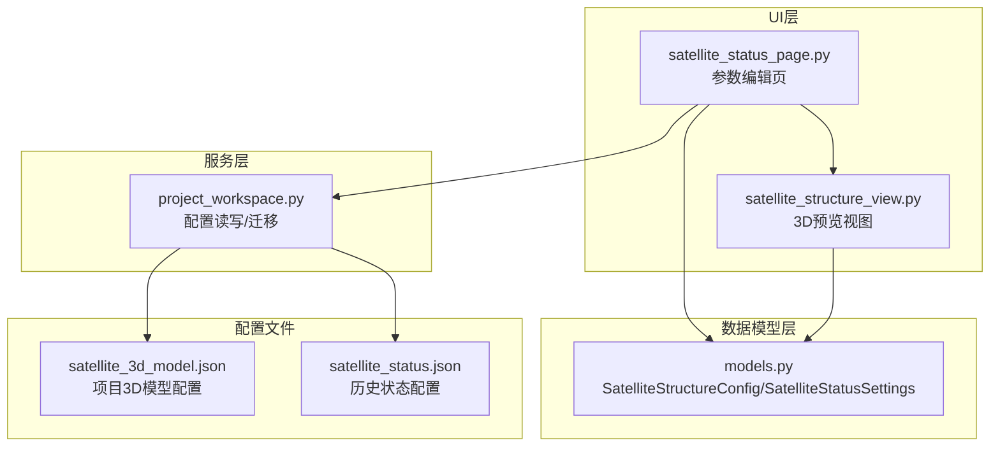
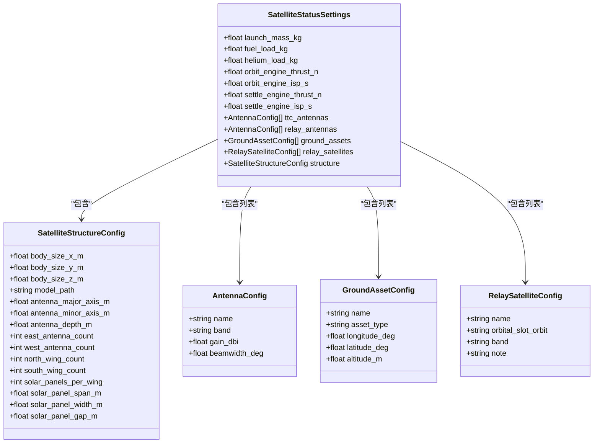
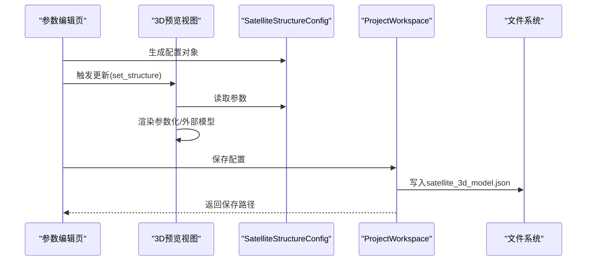
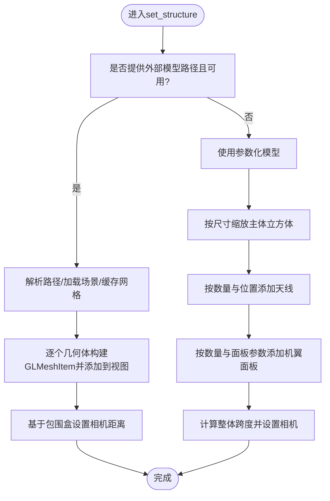
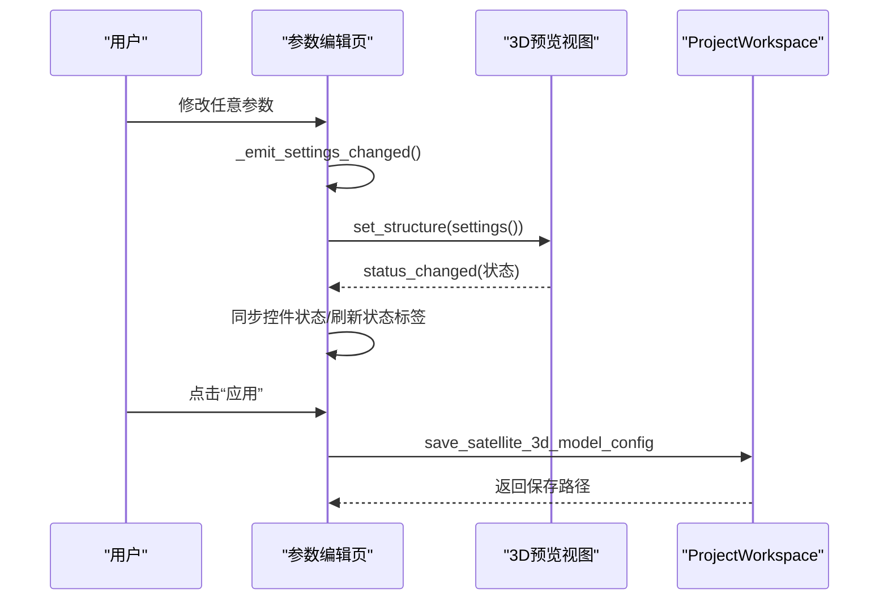
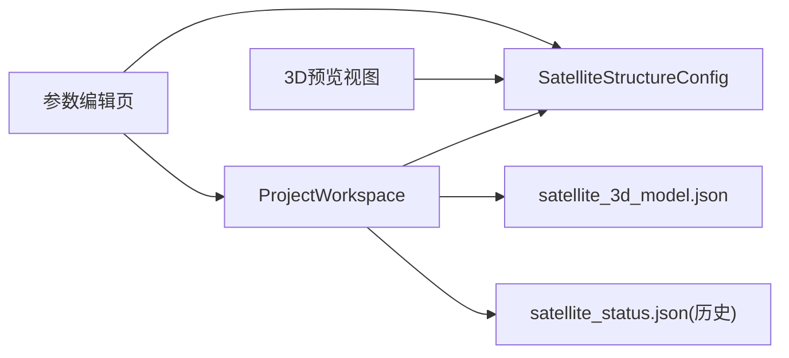

# 卫星3D模型配置

<cite>
**本文引用的文件**
- [satellite_3d_model.json](file://projects/F4/config/satellite_3d_model.json)
- [satellite_status.json](file://projects/F1/config/satellite_status.json)
- [models.py](file://src/smart/domain/models.py)
- [satellite_structure_view.py](file://src/smart/ui/widgets/satellite_structure_view.py)
- [satellite_status_page.py](file://src/smart/ui/widgets/satellite_status_page.py)
- [project_workspace.py](file://src/smart/services/project_workspace.py)
- [test_project_workspace.py](file://tests/test_project_workspace.py)
- [HANDOFF.md](file://HANDOFF.md)
</cite>

## 目录
1. [简介](#简介)
2. [项目结构](#项目结构)
3. [核心组件](#核心组件)
4. [架构总览](#架构总览)
5. [详细组件分析](#详细组件分析)
6. [依赖关系分析](#依赖关系分析)
7. [性能考量](#性能考量)
8. [故障排查指南](#故障排查指南)
9. [结论](#结论)
10. [附录](#附录)

## 简介
本技术文档围绕SMART项目的卫星3D模型配置功能，系统阐述卫星几何结构配置、载荷系统设置与3D可视化集成的实现方式。重点解析数据模型SatelliteStructureConfig与SatelliteStatusSettings的设计理念、字段含义与使用边界；详解卫星主体尺寸参数、天线配置、太阳能电池板布局与结构组件的配置方法；提供卫星3D模型导入、渲染与交互操作的实现细节；给出天线增益、波束宽度、载荷配置等关键参数的设置指南；解释3D视图组件与配置数据的绑定机制与实时更新策略，并提供配置验证、默认值处理与兼容性检查的实现方案。

## 项目结构
卫星3D模型配置相关的核心文件分布如下：
- 数据模型层：定义卫星结构与状态配置的数据类
- UI层：提供3D预览与参数编辑界面
- 服务层：负责配置的持久化与迁移兼容
- 配置文件：项目级JSON配置用于保存3D模型参数

**图表来源**
- [models.py:187-255](file://src/smart/domain/models.py#L187-L255)
- [satellite_status_page.py:25-343](file://src/smart/ui/widgets/satellite_status_page.py#L25-L343)
- [satellite_structure_view.py:66-472](file://src/smart/ui/widgets/satellite_structure_view.py#L66-L472)
- [project_workspace.py:406-605](file://src/smart/services/project_workspace.py#L406-L605)
- [satellite_3d_model.json:1-17](file://projects/F4/config/satellite_3d_model.json#L1-L17)
- [satellite_status.json:1-72](file://projects/F1/config/satellite_status.json#L1-L72)

**章节来源**
- [satellite_3d_model.json:1-17](file://projects/F4/config/satellite_3d_model.json#L1-L17)
- [satellite_status.json:1-72](file://projects/F1/config/satellite_status.json#L1-L72)
- [models.py:187-255](file://src/smart/domain/models.py#L187-L255)
- [satellite_status_page.py:25-343](file://src/smart/ui/widgets/satellite_status_page.py#L25-L343)
- [satellite_structure_view.py:66-472](file://src/smart/ui/widgets/satellite_structure_view.py#L66-L472)
- [project_workspace.py:406-605](file://src/smart/services/project_workspace.py#L406-L605)

## 核心组件
本节聚焦于两个关键数据模型及其在系统中的作用。

- SatelliteStructureConfig（卫星结构配置）
  - 字段覆盖卫星主体尺寸、外部模型路径、天线参数、机翼与太阳能板布局等
  - 提供默认值，确保在缺失配置时仍可渲染参数化模型
- SatelliteStatusSettings（卫星状态与载荷配置）
  - 在结构配置基础上，扩展载荷系统（如天线、地面资产、中继卫星）与推进参数
  - 作为历史遗留配置的容器，支持从旧格式迁移

**图表来源**
- [models.py:187-255](file://src/smart/domain/models.py#L187-L255)

**章节来源**
- [models.py:187-255](file://src/smart/domain/models.py#L187-L255)

## 架构总览
卫星3D模型配置的端到端流程包括：参数编辑界面收集配置 → 生成SatelliteStructureConfig → 3D视图根据配置渲染 → 服务层持久化到JSON配置文件 → 历史配置兼容与迁移。

**图表来源**
- [satellite_status_page.py:219-262](file://src/smart/ui/widgets/satellite_status_page.py#L219-L262)
- [satellite_structure_view.py:132-210](file://src/smart/ui/widgets/satellite_structure_view.py#L132-L210)
- [project_workspace.py:406-482](file://src/smart/services/project_workspace.py#L406-L482)

**章节来源**
- [satellite_status_page.py:219-262](file://src/smart/ui/widgets/satellite_status_page.py#L219-L262)
- [satellite_structure_view.py:132-210](file://src/smart/ui/widgets/satellite_structure_view.py#L132-L210)
- [project_workspace.py:406-482](file://src/smart/services/project_workspace.py#L406-L482)

## 详细组件分析

### 数据模型设计与字段含义
- 卫星主体尺寸参数
  - body_size_x_m、body_size_y_m、body_size_z_m：决定参数化立方体主体大小
  - 默认值确保最小可渲染尺寸，避免过小导致视觉不可见
- 外部模型路径
  - model_path：支持.glb、.gltf、.dae；若为空则回退到参数化模型
  - 不支持.STK .mdl格式，存在时会触发状态提示
- 天线配置
  - antenna_major_axis_m、antenna_minor_axis_m、antenna_depth_m：决定天线椭球体尺寸
  - east_antenna_count、west_antenna_count：分别控制左右两侧天线数量
- 机翼与太阳能电池板布局
  - north_wing_count、south_wing_count：控制前后机翼数量
  - solar_panels_per_wing：单侧机翼上的太阳能板数量
  - solar_panel_span_m、solar_panel_width_m、solar_panel_gap_m：决定面板尺寸与间距
  - 面板厚度按宽度比例计算，保证视觉一致性
- 载荷系统设置（位于SatelliteStatusSettings）
  - ttc_antennas、relay_antennas：包含名称、频段、增益(dBi)、波束宽度(deg)
  - ground_assets、relay_satellites：地面站与中继卫星资源清单
  - 推进参数：轨道机动与驻留发动机的推力与比冲

**章节来源**
- [models.py:187-255](file://src/smart/domain/models.py#L187-L255)
- [satellite_status.json:26-72](file://projects/F1/config/satellite_status.json#L26-L72)

### 3D可视化与渲染实现
- 参数化模型渲染
  - 使用单位立方体网格缩放生成主体
  - 天线以球形网格渲染，按数量沿Y轴对称布置
  - 机翼由多个立方体面板组成，按span/width/gap排列
  - 相机距离根据整体跨度动态调整，确保全貌可见
- 外部模型加载
  - 支持.trimesh场景加载，遍历几何体并转换为GLMeshItem
  - 自动计算包围盒中心并平移至原点，统一缩放与视角
  - 按材质或名称启发式分配颜色与边框色
- 状态反馈
  - 通过status_changed信号上报渲染状态（如OpenGL不可用、模型加载失败、外部模型已加载等）

**图表来源**
- [satellite_structure_view.py:132-210](file://src/smart/ui/widgets/satellite_structure_view.py#L132-L210)
- [satellite_structure_view.py:212-253](file://src/smart/ui/widgets/satellite_structure_view.py#L212-L253)
- [satellite_structure_view.py:329-400](file://src/smart/ui/widgets/satellite_structure_view.py#L329-L400)

**章节来源**
- [satellite_structure_view.py:132-210](file://src/smart/ui/widgets/satellite_structure_view.py#L132-L210)
- [satellite_structure_view.py:212-253](file://src/smart/ui/widgets/satellite_structure_view.py#L212-L253)
- [satellite_structure_view.py:329-400](file://src/smart/ui/widgets/satellite_structure_view.py#L329-L400)

### 参数编辑界面与绑定机制
- 参数编辑页
  - 数值型字段：主体尺寸、天线与面板尺寸范围与步进
  - 计数型字段：天线与机翼数量、每翼面板数
  - 文件选择：模型文件浏览与STK示例模型快速应用
  - 实时更新：任一参数变化即触发预览更新与settings_changed信号
- 绑定与同步
  - apply_settings将配置写入控件并更新预览
  - 当外部模型加载成功时，禁用参数控件，防止冲突
  - 状态标签根据渲染状态动态显示国际化文案

**图表来源**
- [satellite_status_page.py:212-296](file://src/smart/ui/widgets/satellite_status_page.py#L212-L296)
- [satellite_status_page.py:298-321](file://src/smart/ui/widgets/satellite_status_page.py#L298-L321)
- [project_workspace.py:406-482](file://src/smart/services/project_workspace.py#L406-L482)

**章节来源**
- [satellite_status_page.py:170-262](file://src/smart/ui/widgets/satellite_status_page.py#L170-L262)
- [satellite_status_page.py:298-321](file://src/smart/ui/widgets/satellite_status_page.py#L298-L321)
- [project_workspace.py:406-482](file://src/smart/services/project_workspace.py#L406-L482)

### 配置验证、默认值与兼容性检查
- 默认值处理
  - 所有数值参数均提供合理默认值，确保首次使用即可渲染
  - 面板厚度按宽度比例计算，避免极端薄厚
- 兼容性检查
  - 支持从历史satellite_status.json迁移，自动映射结构字段
  - 兼容旧版dae_model_path键名，向后兼容
- 输入约束
  - 最小尺寸与最小数量保护，避免渲染异常
  - 外部模型路径解析与扩展名校验，不支持的扩展名返回状态提示

**章节来源**
- [models.py:187-204](file://src/smart/domain/models.py#L187-L204)
- [project_workspace.py:746-762](file://src/smart/services/project_workspace.py#L746-L762)
- [project_workspace.py:504-551](file://src/smart/services/project_workspace.py#L504-L551)
- [satellite_structure_view.py:146-156](file://src/smart/ui/widgets/satellite_structure_view.py#L146-L156)
- [satellite_structure_view.py:255-279](file://src/smart/ui/widgets/satellite_structure_view.py#L255-L279)

## 依赖关系分析
- UI层依赖数据模型与服务层
  - 参数编辑页依赖SatelliteStructureConfig构造与序列化
  - 3D预览视图依赖SatelliteStructureConfig进行渲染
  - 服务层负责配置的读取、保存与历史迁移
- 外部依赖
  - OpenGL与pyqtgraph.opengl用于3D渲染
  - trimesh用于外部模型场景加载与网格提取
- 文件依赖
  - 项目配置文件satellite_3d_model.json与历史satellite_status.json

**图表来源**
- [satellite_status_page.py:25-343](file://src/smart/ui/widgets/satellite_status_page.py#L25-L343)
- [satellite_structure_view.py:66-472](file://src/smart/ui/widgets/satellite_structure_view.py#L66-L472)
- [project_workspace.py:406-605](file://src/smart/services/project_workspace.py#L406-L605)
- [satellite_3d_model.json:1-17](file://projects/F4/config/satellite_3d_model.json#L1-L17)
- [satellite_status.json:1-72](file://projects/F1/config/satellite_status.json#L1-L72)

**章节来源**
- [satellite_status_page.py:25-343](file://src/smart/ui/widgets/satellite_status_page.py#L25-L343)
- [satellite_structure_view.py:66-472](file://src/smart/ui/widgets/satellite_structure_view.py#L66-L472)
- [project_workspace.py:406-605](file://src/smart/services/project_workspace.py#L406-L605)

## 性能考量
- 渲染性能
  - 参数化模型仅使用少量网格与固定着色器，开销较低
  - 外部模型采用trimesh场景加载并缓存网格包，避免重复解析
  - 相机距离按整体尺寸比例自适应，减少不必要的缩放与重绘
- UI交互
  - 参数变更即时触发预览更新，保持低延迟反馈
  - 控件启用/禁用逻辑避免无效操作（外部模型加载时禁用参数控件）

[本节为通用性能讨论，无需特定文件引用]

## 故障排查指南
- OpenGL初始化失败
  - 现象：3D预览区域显示不可用提示
  - 处理：检查本地OpenGL运行时环境，重新启动应用
- 外部模型支持不可用
  - 现象：提供模型路径但未渲染，状态提示为“模型支持不可用”
  - 处理：确认已安装trimesh依赖，或改用支持的模型格式
- 模型路径错误或扩展名不支持
  - 现象：状态提示为“模型不存在/扩展名无效/不支持.mdl”
  - 处理：修正路径或更换为.glb/gltf/dae；STK示例模型按钮可快速应用
- 外部模型加载失败
  - 现象：状态提示为“模型加载失败”
  - 处理：检查模型文件完整性与依赖纹理/材质；尝试简化场景或转换格式
- 参数化模型被禁用
  - 现象：参数控件被禁用
  - 原因：已加载外部模型，参数化模型不可编辑
  - 处理：清空模型路径或切换到外部模型

**章节来源**
- [satellite_structure_view.py:75-87](file://src/smart/ui/widgets/satellite_structure_view.py#L75-L87)
- [satellite_structure_view.py:212-233](file://src/smart/ui/widgets/satellite_structure_view.py#L212-L233)
- [satellite_structure_view.py:255-279](file://src/smart/ui/widgets/satellite_structure_view.py#L255-L279)
- [satellite_status_page.py:307-316](file://src/smart/ui/widgets/satellite_status_page.py#L307-L316)

## 结论
SMART项目的卫星3D模型配置通过清晰的数据模型、直观的参数编辑界面与稳健的3D渲染管线，实现了从参数化到外部模型的无缝切换。SatelliteStructureConfig提供了完整的几何与布局参数，默认值与输入约束保障了可用性与稳定性；SatelliteStatusSettings扩展了载荷系统与推进参数，满足工程化配置需求。服务层负责配置持久化与历史迁移，确保新旧版本兼容。整体架构在易用性与可维护性之间取得良好平衡。

[本节为总结性内容，无需特定文件引用]

## 附录

### 关键参数设置指南
- 主体尺寸
  - 建议从默认值出发，逐步调整以匹配实际卫星构型
- 天线配置
  - 根据任务需求设置主/副轴与深度；数量应考虑通信覆盖与功耗
- 太阳能电池板
  - 合理设置span/width/gap，确保发电面积与散热需求平衡
- 载荷配置
  - 天线增益与波束宽度直接影响链路预算；地面站与中继卫星需与轨道设计协同

**章节来源**
- [models.py:187-255](file://src/smart/domain/models.py#L187-L255)
- [satellite_status.json:26-72](file://projects/F1/config/satellite_status.json#L26-L72)

### 配置文件示例与字段对照
- 项目配置文件satellite_3d_model.json
  - 字段与SatelliteStructureConfig一一对应，支持直接编辑
- 历史配置文件satellite_status.json
  - 包含结构字段与载荷系统，服务层负责迁移

**章节来源**
- [satellite_3d_model.json:1-17](file://projects/F4/config/satellite_3d_model.json#L1-L17)
- [satellite_status.json:1-72](file://projects/F1/config/satellite_status.json#L1-L72)
- [project_workspace.py:406-413](file://src/smart/services/project_workspace.py#L406-L413)

### 设计变更与兼容性说明
- 参考项目手册关于卫星3D模型配置的任务说明，了解默认形状更新与STK模型支持策略

**章节来源**
- [HANDOFF.md:24-25](file://HANDOFF.md#L24-L25)