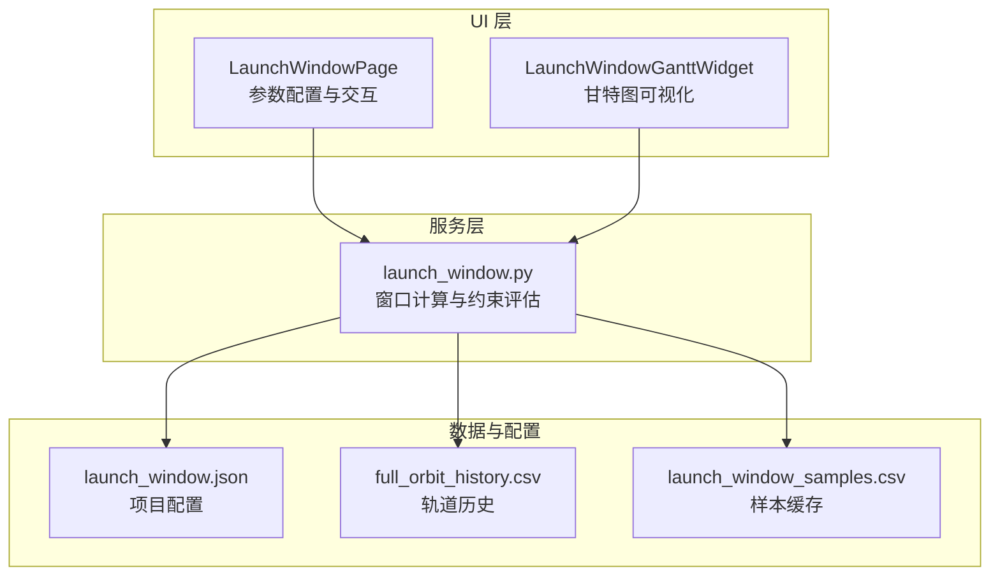
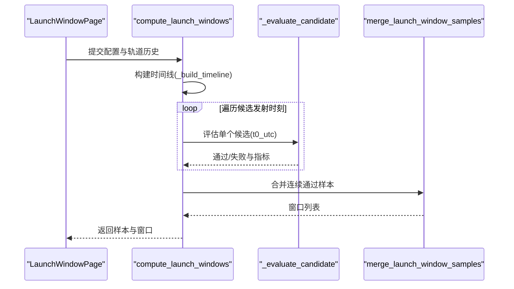
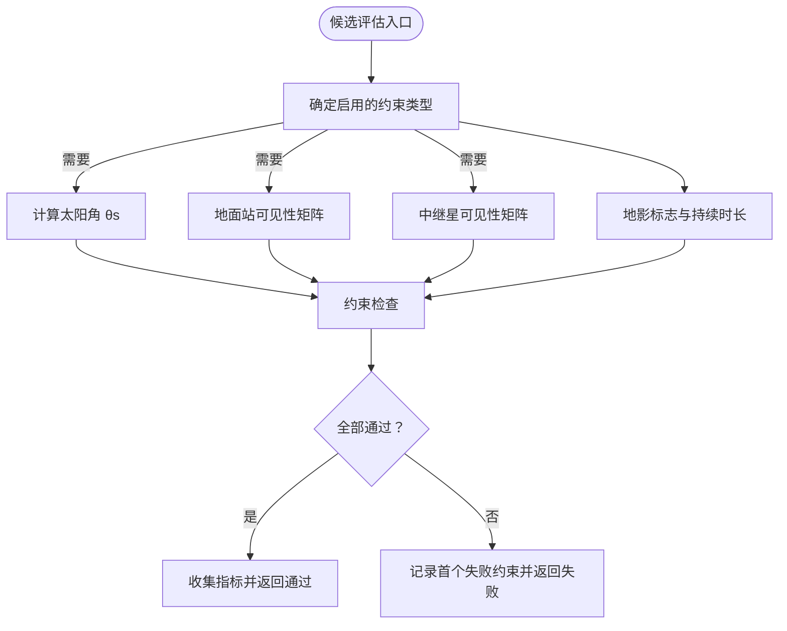
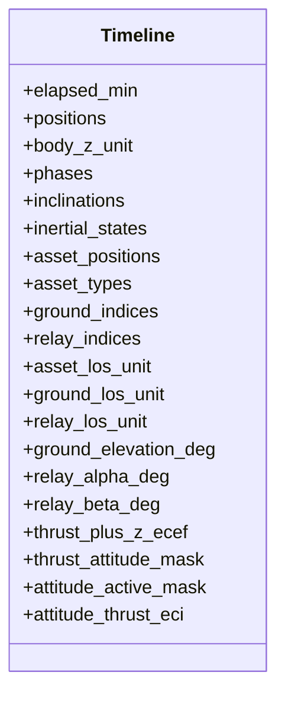
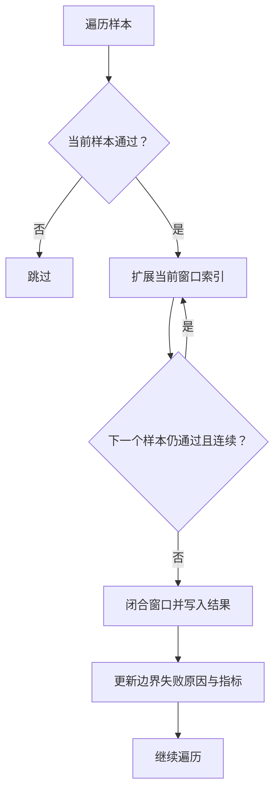
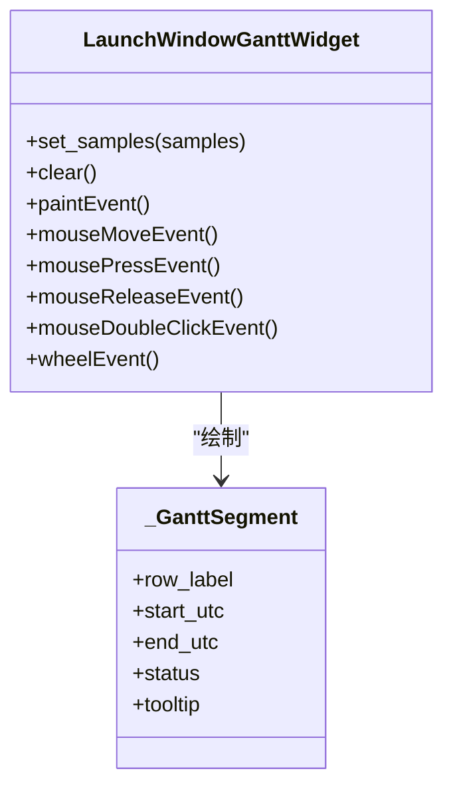
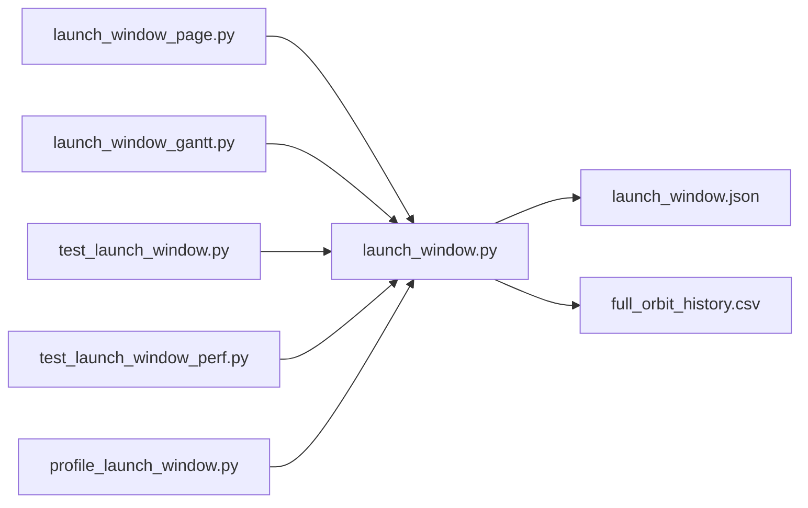

# 发射窗口分析

<cite>
**本文引用的文件**
- [launch_window.py](file://src/smart/services/launch_window.py)
- [launch_window_page.py](file://src/smart/ui/widgets/launch_window_page.py)
- [launch_window_gantt.py](file://src/smart/ui/widgets/launch_window_gantt.py)
- [launch_window_workflow.md](file://doc/launch_window_workflow.md)
- [launch_window.json](file://projects/F4/config/launch_window.json)
- [test_launch_window.py](file://tests/test_launch_window.py)
- [test_launch_window_perf.py](file://tests/test_launch_window_perf.py)
- [profile_launch_window.py](file://scripts/profile_launch_window.py)
</cite>

## 目录
1. [简介](#简介)
2. [项目结构](#项目结构)
3. [核心组件](#核心组件)
4. [架构总览](#架构总览)
5. [详细组件分析](#详细组件分析)
6. [依赖关系分析](#依赖关系分析)
7. [性能考量](#性能考量)
8. [故障排查指南](#故障排查指南)
9. [结论](#结论)
10. [附录](#附录)

## 简介
本技术文档围绕 SMART 项目的发射窗口分析功能，系统阐述了窗口计算的算法原理、数据结构、约束建模、可视化展示、质量评估与选择策略，以及性能优化与大规模搜索实践。文档面向工程人员与任务规划人员，既提供代码级细节，也给出可操作的参数设置与案例指导。

## 项目结构
发射窗口分析涉及三层：UI 层负责参数配置与可视化；服务层负责窗口扫描、约束评估与结果合并；测试与脚本提供回归与性能剖析支撑。

**图表来源**
- [launch_window_page.py:348-800](file://src/smart/ui/widgets/launch_window_page.py#L348-L800)
- [launch_window_gantt.py:35-505](file://src/smart/ui/widgets/launch_window_gantt.py#L35-L505)
- [launch_window.py:565-620](file://src/smart/services/launch_window.py#L565-L620)
- [launch_window_workflow.md:1-117](file://doc/launch_window_workflow.md#L1-L117)
- [launch_window.json:1-230](file://projects/F4/config/launch_window.json#L1-L230)

**章节来源**
- [launch_window_workflow.md:1-117](file://doc/launch_window_workflow.md#L1-L117)

## 核心组件
- 服务层核心模块：窗口扫描、约束评估、结果合并、时间线构建与姿态预计算。
- UI 组件：参数面板、状态设置对话框、结果表与甘特图。
- 测试与性能脚本：单元测试覆盖关键流程，性能脚本用于热点定位。

**章节来源**
- [launch_window.py:565-620](file://src/smart/services/launch_window.py#L565-L620)
- [launch_window_page.py:348-800](file://src/smart/ui/widgets/launch_window_page.py#L348-L800)
- [launch_window_gantt.py:35-505](file://src/smart/ui/widgets/launch_window_gantt.py#L35-L505)
- [test_launch_window.py:1-120](file://tests/test_launch_window.py#L1-L120)
- [test_launch_window_perf.py:1-151](file://tests/test_launch_window_perf.py#L1-L151)
- [profile_launch_window.py:1-116](file://scripts/profile_launch_window.py#L1-L116)

## 架构总览
发射窗口分析采用“扫描-评估-合并”的流水线架构。UI 触发计算，服务层对候选发射时刻进行约束评估，将连续通过样本合并为窗口，并输出样本与窗口结果。

**图表来源**
- [launch_window.py:565-620](file://src/smart/services/launch_window.py#L565-L620)
- [launch_window.py:787-973](file://src/smart/services/launch_window.py#L787-L973)
- [launch_window.py:1140-1220](file://src/smart/services/launch_window.py#L1140-L1220)

## 详细组件分析

### 数据结构与参数定义
- LaunchWindowConfig：窗口扫描与约束阈值的配置载体，包含扫描区间、步长、各类约束阈值、要求开关与约束表。
- TrackingAsset：测控资产抽象，支持地面站与中继星两类。
- ManeuverInterval：变轨区间，用于参数化约束表达式。
- LaunchWindowResult：窗口结果，包含窗口起止、持续时间、首个失败原因、关键指标等。
- ShadowInterval：地影区间，用于阴影分析与插值。

**章节来源**
- [launch_window.py:64-117](file://src/smart/services/launch_window.py#L64-L117)
- [launch_window.py:119-135](file://src/smart/services/launch_window.py#L119-L135)
- [launch_window.py:137-154](file://src/smart/services/launch_window.py#L137-L154)
- [launch_window.py:156-192](file://src/smart/services/launch_window.py#L156-L192)

### 约束建模与评估
- 几何约束：地影、太阳角 θs、地面站/中继星可见性（仰角、天线覆盖角 α/β）、倾角限制。
- 可达性约束：测控连续弧段、远距离测控、分离地影。
- 任务约束：基于约束表的区间与时序约束，支持参数化表达式（如 T1_start、T2_end）。
- 评估策略：按需计算，仅在约束启用时执行相应检查；通过向量化 NumPy 计算提升性能。

**图表来源**
- [launch_window.py:787-973](file://src/smart/services/launch_window.py#L787-L973)
- [launch_window.py:975-1031](file://src/smart/services/launch_window.py#L975-L1031)
- [launch_window.py:1062-1097](file://src/smart/services/launch_window.py#L1062-L1097)

**章节来源**
- [launch_window.py:787-973](file://src/smart/services/launch_window.py#L787-L973)
- [launch_window.py:975-1031](file://src/smart/services/launch_window.py#L975-L1031)
- [launch_window.py:1062-1097](file://src/smart/services/launch_window.py#L1062-L1097)

### 时间线构建与姿态预计算
- 时间线包含：位置、速度、相位、倾角、资产位置与视线单位向量、地面/中继可见性矩阵、姿态推力方向等。
- 姿态预计算：在构建阶段一次性计算每个采样点的姿态推力方向（ECI），并在候选评估时复用，避免重复计算。

**图表来源**
- [launch_window.py:676-771](file://src/smart/services/launch_window.py#L676-L771)
- [launch_window.py:1383-1435](file://src/smart/services/launch_window.py#L1383-L1435)

**章节来源**
- [launch_window.py:676-771](file://src/smart/services/launch_window.py#L676-L771)
- [launch_window.py:1383-1435](file://src/smart/services/launch_window.py#L1383-L1435)

### 窗口识别与合并
- 连续通过样本合并为窗口，依据扫描步长与通过状态判断连续性。
- 窗口指标聚合：取区间内指标的最大/最小值，记录前后沿的最长地影与首个失败约束。

**图表来源**
- [launch_window.py:1144-1220](file://src/smart/services/launch_window.py#L1144-L1220)

**章节来源**
- [launch_window.py:1144-1220](file://src/smart/services/launch_window.py#L1144-L1220)

### 可视化与交互
- 甘特图：按样本绘制通过段，红色表示窗口，绿色表示各约束通过段；支持滚轮缩放、拖拽平移、双击重置与悬停提示。
- UI 参数面板：扫描区间、步长、阈值、测控资源、约束表与状态设置对话框；支持保存参数与导出结果。

**图表来源**
- [launch_window_gantt.py:35-505](file://src/smart/ui/widgets/launch_window_gantt.py#L35-L505)

**章节来源**
- [launch_window_gantt.py:35-505](file://src/smart/ui/widgets/launch_window_gantt.py#L35-L505)
- [launch_window_page.py:724-771](file://src/smart/ui/widgets/launch_window_page.py#L724-L771)

### 窗口质量评估与选择策略
- 质量指标：第一圈地影、无地影时段、分离地影、太阳角余量、最大测控间隙、倾角。
- 选择策略：优先满足关键约束（如无地影、测控连续弧段、远距离测控），再根据窗口长度与边缘约束进行权衡。

**章节来源**
- [launch_window.py:950-973](file://src/smart/services/launch_window.py#L950-L973)
- [launch_window_workflow.md:60-97](file://doc/launch_window_workflow.md#L60-L97)

### 实际案例与参数设置
- F4 项目配置示例展示了典型参数：扫描区间、步长、阈值、约束表与测控资源。
- 参数建议：根据任务需求调整步长与阈值，合理设置约束表与测控资源，确保窗口满足任务约束。

**章节来源**
- [launch_window.json:1-230](file://projects/F4/config/launch_window.json#L1-L230)
- [launch_window_workflow.md:26-31](file://doc/launch_window_workflow.md#L26-L31)

## 依赖关系分析
- UI 依赖服务层的计算接口与配置转换。
- 服务层依赖轨道历史 CSV、变轨策略与测控资产配置。
- 测试与脚本依赖服务层核心函数，用于回归与性能剖析。

**图表来源**
- [launch_window_page.py:14-40](file://src/smart/ui/widgets/launch_window_page.py#L14-L40)
- [launch_window_gantt.py:13-24](file://src/smart/ui/widgets/launch_window_gantt.py#L13-L24)
- [launch_window.py:503-506](file://src/smart/services/launch_window.py#L503-L506)
- [test_launch_window.py:10-47](file://tests/test_launch_window.py#L10-L47)
- [test_launch_window_perf.py:15-22](file://tests/test_launch_window_perf.py#L15-L22)
- [profile_launch_window.py:17-22](file://scripts/profile_launch_window.py#L17-L22)

**章节来源**
- [launch_window_page.py:14-40](file://src/smart/ui/widgets/launch_window_page.py#L14-L40)
- [launch_window_gantt.py:13-24](file://src/smart/ui/widgets/launch_window_gantt.py#L13-L24)
- [launch_window.py:503-506](file://src/smart/services/launch_window.py#L503-L506)
- [test_launch_window.py:10-47](file://tests/test_launch_window.py#L10-L47)
- [test_launch_window_perf.py:15-22](file://tests/test_launch_window_perf.py#L15-L22)
- [profile_launch_window.py:17-22](file://scripts/profile_launch_window.py#L17-L22)

## 性能考量
- 向量化与预计算：时间线构建阶段完成姿态推力方向与可见性矩阵的向量化计算，候选评估仅做掩码筛选与阈值比较。
- 按需计算：仅在约束启用时计算对应指标，减少不必要的计算。
- 样本解析优化：一次性解析候选发射时刻，避免内层循环重复解析导致的二次方行为。
- 进度回调节流：避免每个候选点都触发事件处理，降低 UI 开销。
- 分块与内存控制：后续可考虑分块批量计算，平衡吞吐与内存占用。

**章节来源**
- [launch_window.py:1144-1162](file://src/smart/services/launch_window.py#L1144-L1162)
- [launch_window_workflow.md:98-107](file://doc/launch_window_workflow.md#L98-L107)
- [test_launch_window_perf.py:108-151](file://tests/test_launch_window_perf.py#L108-L151)

## 故障排查指南
- 常见问题
  - 扫描步长过小导致计算耗时过长：适当增大步长或分块计算。
  - 约束阈值过严导致窗口稀少：逐步放宽阈值并观察窗口变化。
  - 测控资源不足：启用更多地面站或中继星，或调整可见性阈值。
  - 参数化表达式错误：检查变轨策略中的 Tn_start/Tn_end 是否与约束表一致。
- 回归与性能
  - 使用测试用例验证关键路径一致性与等价性。
  - 使用性能剖析脚本定位热点函数，持续优化。

**章节来源**
- [test_launch_window.py:508-551](file://tests/test_launch_window.py#L508-L551)
- [test_launch_window_perf.py:108-151](file://tests/test_launch_window_perf.py#L108-L151)
- [profile_launch_window.py:83-116](file://scripts/profile_launch_window.py#L83-L116)

## 结论
SMART 的发射窗口分析以向量化与预计算为核心，结合灵活的约束建模与直观的可视化展示，实现了高效、可扩展的窗口搜索与评估。通过合理的参数设置与性能优化策略，可在保证精度的同时快速生成满足任务约束的窗口集合，并为后续任务规划提供可靠支撑。

## 附录
- 关键 API 与路径
  - 计算入口：[compute_launch_windows:565-620](file://src/smart/services/launch_window.py#L565-L620)
  - 候选评估：[evaluate_candidate:787-973](file://src/smart/services/launch_window.py#L787-L973)
  - 结果合并：[merge_launch_window_samples:1140-1220](file://src/smart/services/launch_window.py#L1140-L1220)
  - 甘特图控件：[LaunchWindowGanttWidget:35-505](file://src/smart/ui/widgets/launch_window_gantt.py#L35-L505)
  - 工作流说明：[launch_window_workflow.md:1-117](file://doc/launch_window_workflow.md#L1-L117)
  - F4 配置示例：[launch_window.json:1-230](file://projects/F4/config/launch_window.json#L1-L230)